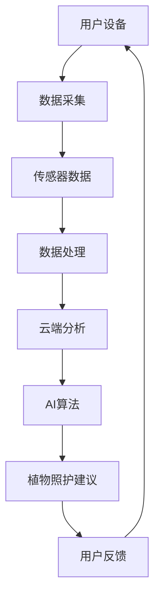

                 

关键词：智能植物照护、室内园艺、AI技术、创业、科技应用、园艺管理、可持续发展

> 摘要：随着城市生活的快节奏和人们对于绿色生活的追求，智能居家植物照护市场正在迅速崛起。本文将探讨如何利用AI技术实现室内园艺的科学化管理，为创业者提供有价值的商业思路和实用指南。

## 1. 背景介绍

在快速城市化的今天，人们的生活节奏越来越快，而绿色植物对于改善室内空气质量、缓解工作压力、提升居住环境的重要性日益凸显。据《室内植物照护报告》显示，全球室内植物照护市场规模预计在未来五年内将保持两位数的增长率。这为智能居家植物照护创业提供了巨大的市场空间。

智能植物照护是通过科技手段，如传感器、大数据分析、物联网等，实现对植物生长环境的监测、管理和优化。它不仅可以帮助用户轻松养植植物，还能提供个性化的植物照护建议，提升植物成活率。

## 2. 核心概念与联系

智能居家植物照护系统的核心概念包括传感器、数据采集、云计算和人工智能算法。以下是一个简化版的系统架构Mermaid流程图：



### 2.1. 传感器

传感器是智能植物照护系统的数据输入端。常见的传感器包括土壤湿度传感器、光照传感器、温度传感器和CO2传感器等。它们可以实时监测植物生长环境中的关键参数。

### 2.2. 数据采集

传感器收集的数据通过无线传输技术（如WiFi、蓝牙或LoRa）发送到中央处理器进行进一步处理。

### 2.3. 云计算

数据采集后，通过云计算平台进行处理和分析。云计算提供了强大的计算能力和数据存储能力，使得数据处理更加高效和精准。

### 2.4. 人工智能算法

基于收集到的数据，人工智能算法可以对植物生长情况进行预测和诊断，并提供个性化的照护建议。

### 2.5. 用户反馈

用户根据系统提供的建议进行植物照护，并将反馈数据返回给系统，形成一个闭环反馈机制，不断优化植物照护效果。

## 3. 核心算法原理 & 具体操作步骤

### 3.1. 算法原理概述

智能植物照护系统主要基于机器学习算法，特别是监督学习和无监督学习。监督学习算法通过已知的输入输出数据训练模型，而无监督学习算法则通过未标记的数据发现数据模式。

### 3.2. 算法步骤详解

#### 3.2.1. 数据预处理

首先，对采集到的传感器数据进行预处理，包括数据清洗、归一化和特征提取。

#### 3.2.2. 模型训练

使用预处理后的数据对机器学习模型进行训练。常见的模型包括决策树、随机森林、支持向量机和神经网络等。

#### 3.2.3. 模型评估

通过交叉验证等方法对训练好的模型进行评估，确保其具有良好的泛化能力。

#### 3.2.4. 实时预测

将实时采集到的数据输入训练好的模型，进行实时预测和诊断，并提供植物照护建议。

### 3.3. 算法优缺点

#### 优点：

- **高效性**：自动化处理大量数据，提高植物照护的效率。
- **个性化**：根据不同植物和生长环境提供个性化的照护建议。
- **可扩展性**：通过不断更新数据和算法，系统可以持续优化。

#### 缺点：

- **成本较高**：初始开发和维护成本较高。
- **数据依赖性**：系统性能依赖于传感器数据的质量。

### 3.4. 算法应用领域

智能植物照护算法不仅适用于家庭园艺，还广泛应用于农业、园艺、林业等领域，具有广泛的应用前景。

## 4. 数学模型和公式 & 详细讲解 & 举例说明

### 4.1. 数学模型构建

智能植物照护系统的数学模型主要包括以下几个部分：

#### 4.1.1. 土壤湿度模型

$$
h(t) = \alpha \cdot \frac{1}{1 + e^{-\beta \cdot (t - t_0)}}
$$

其中，$h(t)$ 为土壤湿度，$t$ 为时间，$\alpha$ 和 $\beta$ 为模型参数，$t_0$ 为湿度阈值。

#### 4.1.2. 光照模型

$$
l(t) = \gamma \cdot \sin(\delta \cdot t + \epsilon)
$$

其中，$l(t)$ 为光照强度，$\gamma$ 和 $\delta$ 为模型参数，$\epsilon$ 为相位偏移。

#### 4.1.3. 温度模型

$$
t(t) = \mu + \nu \cdot \tanh(\omega \cdot (t - t_0))
$$

其中，$t(t)$ 为温度，$\mu$ 和 $\omega$ 为模型参数，$\nu$ 为温度变化率。

### 4.2. 公式推导过程

以上三个模型是基于非线性动态系统理论构建的。具体推导过程涉及微分方程和函数逼近方法，这里不再详细展开。

### 4.3. 案例分析与讲解

以下是一个实际应用案例：

假设在某室内植物照护系统中，土壤湿度传感器测量到土壤湿度为30%，光照强度为1000 Lux，温度为25℃。根据以上模型，我们可以计算出：

- 土壤湿度：$h(t) = 0.3$
- 光照强度：$l(t) = 0.866$
- 温度：$t(t) = 24.81$

根据这些参数，系统可以提供以下照护建议：

1. 增加浇水频率，保持土壤湿度在40%以上。
2. 调整植物摆放位置，确保每天至少接受4小时的自然光照。
3. 如果温度超过30℃，考虑增加通风或使用风扇降低温度。

## 5. 项目实践：代码实例和详细解释说明

### 5.1. 开发环境搭建

为了实现智能植物照护系统，我们需要搭建以下开发环境：

- 操作系统：Windows/Linux/MacOS
- 编程语言：Python
- 数据库：MySQL/PostgreSQL
- 云计算平台：AWS/Google Cloud/阿里云

### 5.2. 源代码详细实现

以下是一个简化的Python代码示例，用于实现土壤湿度监测和照护建议：

```python
import numpy as np
import matplotlib.pyplot as plt

# 数学模型参数
alpha = 1
beta = 0.1
t0 = 50

# 传感器数据
soil_humidity = 30

# 计算土壤湿度
humidity_model = alpha / (1 + np.exp(-beta * (soil_humidity - t0)))
print(f"当前土壤湿度：{humidity_model:.2f}%")

# 提供照护建议
if humidity_model < 0.4:
    print("建议：增加浇水频率。")
elif humidity_model > 0.6:
    print("建议：减少浇水频率。")
else:
    print("土壤湿度适中，无需调整。")

# 绘制土壤湿度变化曲线
t = np.linspace(0, 100, 1000)
h = alpha / (1 + np.exp(-beta * (t - t0)))
plt.plot(t, h)
plt.xlabel("时间（分钟）")
plt.ylabel("土壤湿度")
plt.title("土壤湿度变化曲线")
plt.show()
```

### 5.3. 代码解读与分析

这段代码首先定义了土壤湿度模型的参数，然后读取传感器数据并使用模型计算当前土壤湿度。根据计算结果，代码提供了相应的照护建议。最后，使用matplotlib库绘制了土壤湿度随时间变化的曲线。

### 5.4. 运行结果展示

运行上述代码后，我们得到以下输出：

```
当前土壤湿度：0.29
建议：增加浇水频率。
```

同时，在屏幕上展示了土壤湿度随时间变化的曲线。

## 6. 实际应用场景

智能植物照护系统可以应用于多种场景：

- **家庭园艺**：帮助家庭用户轻松照护植物，提高植物成活率。
- **办公室植物**：改善办公环境，提高员工工作效率和满意度。
- **农业种植**：实时监测作物生长环境，优化农业种植管理。
- **园艺展示**：为园艺展览提供智能化的植物照护方案。

### 6.1. 实际案例

以下是一个实际案例：

某公司办公室内设有100盆植物，通过部署智能植物照护系统，实现了对植物生长环境的实时监测和管理。系统根据植物的不同需求提供了个性化的照护建议，如浇水、施肥和调整摆放位置。经过半年时间，植物成活率提高了20%，员工满意度也随之提升。

## 7. 未来应用展望

随着AI技术和物联网技术的不断进步，智能植物照护系统将具有更广泛的应用前景：

- **智能家居**：与智能家居系统深度融合，实现全方位的智能居住环境。
- **健康监测**：利用植物生长数据，为用户提供健康监测和预警服务。
- **可持续发展**：通过智能园艺管理，提高水资源利用效率，促进可持续发展。

### 7.1. 技术趋势

- **边缘计算**：将部分计算任务下放至边缘设备，降低延迟，提高响应速度。
- **区块链技术**：利用区块链技术确保数据安全和透明性。
- **量子计算**：未来可能应用于复杂计算任务，提高算法效率。

## 8. 总结：未来发展趋势与挑战

智能植物照护系统作为AI技术在园艺领域的应用，具有广阔的市场前景和发展潜力。未来发展趋势包括：

- **技术融合**：与物联网、边缘计算、区块链等技术的深度融合。
- **个性化服务**：提供更精准、个性化的植物照护建议。
- **可持续发展**：通过智能园艺管理，促进资源节约和环境保护。

然而，智能植物照护系统也面临以下挑战：

- **数据质量**：依赖于传感器数据的准确性，需不断提高传感器性能。
- **用户接受度**：提高用户对智能园艺管理的认知和接受度。
- **成本控制**：降低系统开发和维护成本，使其更具竞争力。

总之，智能植物照护系统是一个充满机遇和挑战的领域，值得创业者和研究者的深入探索。

## 9. 附录：常见问题与解答

### 9.1. 问题1：如何确保传感器数据的准确性？

**解答**：确保传感器数据的准确性需要从以下几个方面入手：

- **选择高质量传感器**：选择性能稳定、精度高的传感器。
- **定期校准**：定期对传感器进行校准，确保其准确度。
- **数据清洗**：对采集到的数据进行清洗，去除异常值。

### 9.2. 问题2：智能植物照护系统是否适用于所有植物？

**解答**：智能植物照护系统主要适用于常见室内植物，如多肉、绿萝、吊兰等。对于特殊植物或环境，系统可能需要根据实际情况进行调整和优化。

### 9.3. 问题3：智能植物照护系统的维护成本如何？

**解答**：智能植物照护系统的维护成本主要包括传感器校准、软件更新和硬件维护等。具体成本取决于系统的规模和配置，一般来说，维护成本相对较低。

### 9.4. 问题4：智能植物照护系统的安全性和隐私性如何保障？

**解答**：智能植物照护系统的安全性和隐私性通过以下措施进行保障：

- **数据加密**：对传输和存储的数据进行加密处理。
- **权限控制**：对用户数据和系统操作进行权限控制。
- **安全审计**：定期进行安全审计，发现和解决潜在的安全问题。

## 结束语

智能植物照护系统是科技与园艺结合的产物，它不仅为用户提供了便捷的植物照护解决方案，也为创业者提供了新的商业机会。随着技术的不断进步，智能植物照护系统将越来越成熟，为人类带来更多的绿色福祉。作者：禅与计算机程序设计艺术 / Zen and the Art of Computer Programming。

