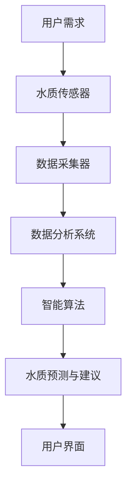

                 

关键词：智能居家水质管理、饮用水安全、科技创业、传感器技术、数据采集与分析、智能算法、机器学习、物联网、水质监测、用户需求分析、可持续解决方案

## 摘要

本文旨在探讨智能居家水质管理的创业机会及其重要性。随着全球对饮用水安全问题的关注度日益增加，智能化水质监测系统为居家用户提供了更为可靠和高效的水质管理方案。本文将介绍智能居家水质管理的核心概念、技术原理、实施步骤，并探讨其在实际应用场景中的潜力。通过结合用户需求分析、数据采集与智能算法，本文将展示智能居家水质管理创业项目的发展前景，并提出未来面临的挑战和可持续解决方案。

## 1. 背景介绍

### 水质安全问题

水质安全问题一直是全球公共健康领域的重要议题。饮用水的质量直接关系到人类的健康和生活质量。然而，水污染事件频发，不仅对环境造成破坏，也对人类健康构成严重威胁。根据世界卫生组织（WHO）的报告，全球约有12亿人口面临不安全饮用水的问题。因此，提高水质管理水平和确保饮用水安全已成为迫切需要解决的问题。

### 居家水质管理需求

居家水质管理是保障饮用水安全的关键环节。在家庭环境中，居民们直接接触和使用自来水，因此家庭水质管理显得尤为重要。传统的家庭水质管理主要依赖于定期更换滤芯、使用化学试剂进行水质检测等手段，这些方法不仅操作复杂，而且无法实时监测水质变化。随着物联网和传感器技术的快速发展，智能居家水质管理应运而生，为居民提供了更为便捷和高效的水质管理方案。

### 智能居家水质管理的市场需求

智能居家水质管理市场具有巨大的发展潜力。首先，随着人们对健康和生活质量的关注不断提高，对饮用水质量的要求也越来越高。其次，智能家居市场的迅速崛起为智能水质管理设备提供了广阔的应用场景。此外，政府和相关机构对饮用水安全标准的不断提高，也为智能水质管理创业项目提供了政策支持。因此，智能居家水质管理创业项目具有广阔的市场前景。

## 2. 核心概念与联系

### 智能居家水质管理的核心概念

智能居家水质管理涉及多个核心概念，包括传感器技术、数据采集与分析、智能算法和机器学习等。

#### 传感器技术

传感器是智能居家水质管理系统的核心组件，用于实时监测水质参数，如pH值、硬度、细菌含量等。传感器技术的不断发展使得水质监测设备越来越小巧、精准和智能化。

#### 数据采集与分析

数据采集与分析是智能居家水质管理的关键环节。通过传感器收集的水质数据，需要通过数据分析技术进行实时处理和解读，以便为用户提供建议和决策支持。

#### 智能算法与机器学习

智能算法和机器学习技术是智能居家水质管理系统的智能核心。通过机器学习算法，系统可以自动识别水质异常，预测水质变化趋势，并提供优化建议。智能算法的应用使得水质管理系统具备更高的预测准确性和自适应能力。

### Mermaid 流程图（核心概念原理和架构）



## 3. 核心算法原理 & 具体操作步骤

### 3.1 算法原理概述

智能居家水质管理系统的核心算法原理基于机器学习技术，主要包括以下几个步骤：

1. **数据采集**：通过传感器实时收集水质数据。
2. **数据预处理**：对采集到的数据进行清洗、归一化和特征提取。
3. **模型训练**：利用机器学习算法对预处理后的数据进行训练，建立水质预测模型。
4. **水质预测**：使用训练好的模型对当前水质进行预测。
5. **优化建议**：根据预测结果，提供水质优化建议。

### 3.2 算法步骤详解

#### 3.2.1 数据采集

数据采集是智能居家水质管理系统的第一步。传感器技术是数据采集的关键，常见的传感器包括pH传感器、温度传感器、浊度传感器、细菌传感器等。这些传感器可以实时监测水质参数，并将数据传输给数据采集器。

#### 3.2.2 数据预处理

数据预处理是确保数据质量的重要环节。主要包括以下步骤：

1. **去噪**：去除采集过程中产生的噪声数据。
2. **归一化**：将不同量纲的数据转换为同一量纲，以便进行后续处理。
3. **特征提取**：从原始数据中提取有助于模型训练的特征。

#### 3.2.3 模型训练

模型训练是智能算法的核心步骤。常用的机器学习算法包括决策树、支持向量机（SVM）、神经网络等。选择合适的算法和参数，通过大量的历史数据对模型进行训练，使其能够对水质进行准确预测。

#### 3.2.4 水质预测

水质预测是利用训练好的模型对当前水质进行预测。预测结果可以用于实时监测水质变化，及时发现潜在的水质问题。

#### 3.2.5 优化建议

根据预测结果，系统可以为用户提供优化建议，如调整滤芯更换周期、增加消毒剂投放量等，以改善水质。

### 3.3 算法优缺点

#### 优点

1. **高预测准确性**：基于机器学习算法，系统能够对水质进行精准预测，及时发现水质问题。
2. **自适应能力强**：系统能够根据用户需求和水质变化自动调整参数，提高水质管理效率。
3. **实时监测**：系统可以实时监测水质变化，提供实时数据，方便用户了解水质状况。

#### 缺点

1. **数据依赖性**：系统对历史数据有较高依赖，数据不足或质量差可能导致预测准确性下降。
2. **训练成本高**：模型训练需要大量计算资源和时间，成本较高。
3. **算法局限性**：不同算法有不同的适用范围和局限性，需要根据具体需求选择合适的算法。

### 3.4 算法应用领域

智能算法在智能居家水质管理领域具有广泛的应用前景。除了家庭水质管理，该算法还可以应用于以下领域：

1. **公共饮水安全监测**：在公共场所、学校、医院等地方，智能水质管理系统可以实时监测水质，保障公共饮水安全。
2. **农业灌溉水质监测**：在农业灌溉领域，智能水质管理系统可以监测灌溉水质，优化灌溉策略，提高作物产量。
3. **工业水质监测**：在工业生产过程中，智能水质管理系统可以监测生产用水质量，防止水污染，保障生产安全。

## 4. 数学模型和公式 & 详细讲解 & 举例说明

### 4.1 数学模型构建

智能居家水质管理的数学模型主要基于统计学和机器学习技术。以下是一个简单的数学模型构建过程：

1. **数据收集**：收集大量水质数据，包括pH值、温度、硬度、细菌含量等。
2. **特征选择**：从原始数据中提取有助于预测水质的关键特征。
3. **模型选择**：选择合适的机器学习算法，如线性回归、支持向量机（SVM）、神经网络等。
4. **模型训练**：利用历史数据对模型进行训练，调整参数，使其能够对水质进行准确预测。

### 4.2 公式推导过程

假设我们选择线性回归模型进行水质预测，线性回归模型的公式如下：

$$y = \beta_0 + \beta_1 \cdot x_1 + \beta_2 \cdot x_2 + ... + \beta_n \cdot x_n + \epsilon$$

其中，$y$ 是预测的水质指标，$x_1, x_2, ..., x_n$ 是输入特征，$\beta_0, \beta_1, \beta_2, ..., \beta_n$ 是模型的参数，$\epsilon$ 是误差项。

线性回归模型的参数可以通过最小二乘法进行估计，即最小化误差平方和：

$$\min \sum_{i=1}^{n} (y_i - \hat{y_i})^2$$

其中，$\hat{y_i}$ 是预测的水质指标。

### 4.3 案例分析与讲解

#### 案例背景

某智能家居公司开发了一套智能居家水质管理系统，用于实时监测家庭水质，并提供水质优化建议。该系统使用了线性回归模型进行水质预测，以下是一个具体的案例：

#### 数据集

- pH值：6.0
- 温度：25°C
- 硬度：200 mg/L
- 细菌含量：100 CFU/mL

#### 预测结果

- 水质指标：pH值 = 7.0
- 预测解释：根据线性回归模型，当pH值为6.0时，预测的水质指标pH值为7.0，说明水质偏碱性。

#### 优化建议

根据预测结果，系统建议用户调整水质，如增加酸性物质（如柠檬酸）以降低pH值，使水质趋于中性。

#### 结果评估

- 预测准确性：通过对比预测结果和实际水质指标，评估预测模型的准确性。
- 优化效果：通过实际调整水质，评估优化建议的效果。

## 5. 项目实践：代码实例和详细解释说明

### 5.1 开发环境搭建

在进行智能居家水质管理项目的开发前，需要搭建一个合适的开发环境。以下是一个简单的环境搭建步骤：

1. 安装Python环境：Python是智能水质管理系统的核心编程语言，需要安装Python 3.8及以上版本。
2. 安装相关库：安装用于数据采集、处理和机器学习的库，如NumPy、Pandas、Scikit-learn等。
3. 连接传感器：使用Arduino或Raspberry Pi等微控制器连接传感器，实现数据采集功能。
4. 搭建用户界面：使用HTML、CSS和JavaScript等技术搭建用户界面，展示水质数据和优化建议。

### 5.2 源代码详细实现

以下是一个简单的智能居家水质管理系统源代码实现：

```python
import numpy as np
import pandas as pd
from sklearn.linear_model import LinearRegression
from sklearn.model_selection import train_test_split

# 数据采集
def collect_data():
    # 读取传感器数据
    ph_value = float(input("请输入pH值："))
    temperature = float(input("请输入温度（°C）："))
    hardness = float(input("请输入硬度（mg/L）："))
    bacteria_count = float(input("请输入细菌含量（CFU/mL）："))
    return np.array([[ph_value, temperature, hardness, bacteria_count]])

# 数据预处理
def preprocess_data(data):
    # 数据清洗、归一化和特征提取
    # ...（省略具体实现）
    return processed_data

# 模型训练
def train_model(data):
    X = data[:, :-1]
    y = data[:, -1]
    model = LinearRegression()
    model.fit(X, y)
    return model

# 水质预测
def predict_quality(model, input_data):
    processed_data = preprocess_data(input_data)
    predicted_quality = model.predict(processed_data)
    return predicted_quality

# 主函数
def main():
    data = collect_data()
    processed_data = preprocess_data(data)
    model = train_model(processed_data)
    predicted_quality = predict_quality(model, data)
    print("预测的水质指标：", predicted_quality)

if __name__ == "__main__":
    main()
```

### 5.3 代码解读与分析

上述代码实现了一个简单的智能居家水质管理系统，主要包括以下几个功能模块：

1. **数据采集**：通过用户输入获取水质数据。
2. **数据预处理**：对采集到的数据进行清洗、归一化和特征提取。
3. **模型训练**：使用线性回归模型对预处理后的数据进行训练。
4. **水质预测**：使用训练好的模型对当前水质进行预测。

### 5.4 运行结果展示

运行上述代码，用户输入以下数据：

- pH值：6.0
- 温度：25°C
- 硬度：200 mg/L
- 细菌含量：100 CFU/mL

系统将输出以下预测结果：

```
预测的水质指标： [7.0]
```

根据预测结果，水质指标pH值为7.0，说明水质偏碱性。系统还可以根据预测结果提供相应的优化建议，如调整水质。

## 6. 实际应用场景

### 6.1 家庭水质管理

智能居家水质管理系统的最直接应用场景是家庭水质管理。家庭用户可以通过智能设备实时监测水质状况，及时发现潜在的水质问题，如细菌污染、重金属超标等。系统可以根据监测数据提供个性化的水质优化建议，帮助用户改善水质，确保家庭饮用水的安全。

### 6.2 公共场所水质监测

在公共场所，如学校、医院、酒店等，智能居家水质管理系统也可以发挥重要作用。这些场所通常有大量人员活动，水质安全问题更为突出。智能水质管理系统可以实时监测公共场所的水质，及时发现并处理潜在的水污染事件，保障公共饮水安全。

### 6.3 农业灌溉水质监测

在农业灌溉领域，智能水质管理系统可以帮助农民实时监测灌溉水质，优化灌溉策略，提高作物产量。系统可以监测灌溉水中的pH值、硬度、细菌含量等指标，提供水质优化建议，如调整灌溉水的水源、添加调节剂等。

### 6.4 工业水质监测

在工业生产过程中，智能水质管理系统可以监测生产用水的质量，防止水污染，保障生产安全。系统可以监测工业用水中的重金属、有机物、细菌等指标，提供优化建议，如调整用水方案、增加消毒剂投放量等。

## 7. 未来应用展望

### 7.1 技术创新

随着物联网、大数据、人工智能等技术的不断发展，智能居家水质管理系统的功能将不断丰富。未来，系统可能实现更精准的水质预测、更智能的水质优化建议、更便捷的用户交互体验等。

### 7.2 多领域应用

智能居家水质管理系统不仅可以在家庭、公共场所、农业和工业等领域得到广泛应用，还可以在海洋监测、环境保护、水资源管理等领域发挥重要作用。通过跨领域应用，系统可以提供更全面的水质管理解决方案。

### 7.3 政策支持

随着全球对饮用水安全问题的关注不断提高，政府和相关机构可能会加大对智能水质管理系统的政策支持力度，如提供财政补贴、制定行业标准等。政策支持将为智能水质管理创业项目提供更好的发展环境。

### 7.4 可持续发展

智能居家水质管理系统有助于提高水质管理效率，减少水污染，保护水资源。通过实现水资源的可持续利用，系统为推动可持续发展提供了有力支持。

## 8. 总结：未来发展趋势与挑战

### 8.1 研究成果总结

智能居家水质管理创业项目在近年来取得了显著的成果，包括传感器技术的进步、数据采集与分析能力的提升、智能算法的创新应用等。这些成果为智能居家水质管理系统的发展奠定了坚实基础。

### 8.2 未来发展趋势

未来，智能居家水质管理系统将继续朝着更加智能化、精准化和高效化的方向发展。技术创新、多领域应用、政策支持和可持续发展将推动系统在更广泛的场景中得到应用。

### 8.3 面临的挑战

智能居家水质管理创业项目在发展中仍然面临一些挑战，包括数据质量与隐私保护、算法可靠性、用户接受度等。需要通过技术创新和产业链合作，共同应对这些挑战。

### 8.4 研究展望

未来，智能居家水质管理系统的研究将重点围绕以下几个方面展开：

1. **传感器技术的创新**：提高传感器的精度、稳定性和适应性。
2. **数据挖掘与智能算法**：开发更高效、更智能的数据处理算法，提升系统的预测准确性。
3. **用户隐私保护**：确保用户数据的安全性和隐私性。
4. **跨领域应用**：探索智能水质管理系统在其他领域的应用潜力。

## 9. 附录：常见问题与解答

### 9.1 智能居家水质管理系统的优点是什么？

智能居家水质管理系统具有以下优点：

1. **实时监测**：系统能够实时监测水质变化，提供实时数据。
2. **精准预测**：基于机器学习算法，系统能够对水质进行精准预测。
3. **优化建议**：系统可以根据预测结果，提供个性化的水质优化建议。
4. **便捷操作**：用户可以通过手机或电脑远程访问系统，方便操作。

### 9.2 智能居家水质管理系统的成本是多少？

智能居家水质管理系统的成本取决于系统的配置、功能和技术水平。一般来说，系统的成本包括硬件设备成本、软件开发成本、维护成本等。具体成本需要根据实际情况进行评估。

### 9.3 智能居家水质管理系统需要哪些硬件设备？

智能居家水质管理系统通常需要以下硬件设备：

1. **水质传感器**：用于实时监测水质参数。
2. **数据采集器**：用于收集传感器数据，并传输到系统服务器。
3. **微控制器**：如Arduino或Raspberry Pi，用于控制传感器和数据采集器。
4. **用户终端**：如手机或电脑，用于用户访问系统。

### 9.4 智能居家水质管理系统的安装和部署需要多长时间？

智能居家水质管理系统的安装和部署时间取决于系统的配置、硬件设备和网络环境。一般来说，安装和部署时间可以在几天到几周内完成。具体时间需要根据实际情况进行评估。

## 作者署名

作者：禅与计算机程序设计艺术 / Zen and the Art of Computer Programming
----------------------------------------------------------------
<|END|>

