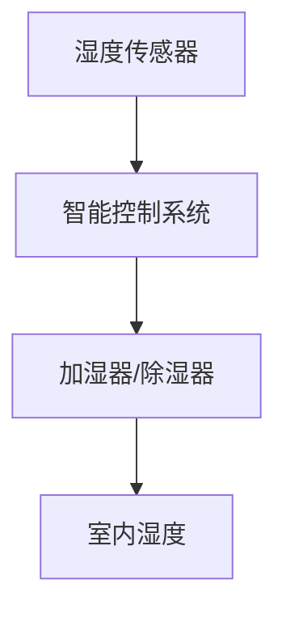

                 

### 1. 背景介绍

随着全球气候变化和城市化进程的加速，空气质量问题日益严峻，对人们的健康造成严重威胁。特别是呼吸道疾病，如哮喘、支气管炎和肺癌等，已成为影响人类健康的重要问题。研究显示，室内空气湿度对呼吸道健康具有显著影响。过高的湿度容易导致霉菌和细菌滋生，过低则容易导致呼吸道干燥和不适。因此，实现居家湿度平衡对于呼吸道健康管理具有重要意义。

智能居家湿度平衡技术的应用，旨在通过自动化设备和智能控制系统，实时监测和调节室内湿度，为居民提供舒适、健康的居住环境。这项技术不仅能够改善室内空气质量，减少呼吸道疾病的发生，还可以提高居民的舒适度和生活质量。

当前，智能居家湿度平衡技术正处于快速发展阶段。随着物联网、大数据和人工智能等技术的不断进步，智能湿度调节设备逐渐走向成熟。同时，市场需求也在不断增长，为创业公司提供了广阔的发展空间。

### 2. 核心概念与联系

在探讨智能居家湿度平衡技术之前，我们需要了解一些核心概念，如湿度传感器、湿度调节器和智能控制系统。这些概念之间存在着紧密的联系，共同构成了智能湿度平衡系统的基本架构。

#### 2.1 湿度传感器

湿度传感器是智能湿度平衡系统的核心部件，用于实时监测室内湿度。常见的湿度传感器包括电容式、电阻式和红外式等。电容式湿度传感器具有响应速度快、精度高等特点，广泛应用于智能家居领域。

#### 2.2 湿度调节器

湿度调节器用于根据湿度传感器的反馈，自动调节室内湿度。常见的湿度调节器包括加湿器和除湿机。加湿器通过超声波振动或蒸汽加热的方式增加室内湿度，而除湿机则通过压缩制冷或吸附等方式降低室内湿度。

#### 2.3 智能控制系统

智能控制系统是智能湿度平衡系统的“大脑”，负责接收湿度传感器的数据，并根据设定目标自动控制湿度调节器的运行。智能控制系统通常基于物联网技术，可以通过手机APP、语音助手等与用户进行交互。

以下是一个简化的Mermaid流程图，展示了智能湿度平衡系统的工作流程：



#### 2.4 核心概念的联系

湿度传感器、湿度调节器和智能控制系统共同构成了智能湿度平衡系统的核心组成部分。湿度传感器实时监测室内湿度，将数据传输给智能控制系统。智能控制系统根据设定的湿度目标，自动控制湿度调节器的运行，从而实现对室内湿度的调节。通过这种协同工作，智能湿度平衡系统能够为用户提供一个舒适、健康的居住环境。

### 3. 核心算法原理 & 具体操作步骤

在智能居家湿度平衡系统中，核心算法原理主要涉及湿度监测与调节策略。以下将详细描述该算法的原理和具体操作步骤。

#### 3.1 算法原理概述

智能湿度平衡算法基于以下原理：

1. **实时监测**：通过湿度传感器实时获取室内湿度数据。
2. **设定目标**：根据用户需求设定室内湿度目标值。
3. **自动调节**：根据湿度传感器数据和目标值，自动控制湿度调节器的运行。

#### 3.2 算法步骤详解

1. **数据采集**：湿度传感器实时监测室内湿度，并将数据传输给智能控制系统。

2. **目标设定**：用户通过手机APP或语音助手等智能终端，设定室内湿度目标值。

3. **计算调节量**：智能控制系统根据当前湿度值和目标湿度值，计算需要调节的湿度量。

4. **控制湿度调节器**：智能控制系统根据计算结果，自动控制加湿器或除湿器的运行，实现对室内湿度的调节。

5. **反馈调节**：湿度传感器持续监测室内湿度，将最新数据反馈给智能控制系统，系统根据反馈结果进行进一步的调节。

#### 3.3 算法优缺点

**优点**：

- **自动化**：算法能够自动监测和调节室内湿度，提高用户舒适度。
- **精准性**：通过实时监测和数据反馈，实现精准的湿度控制。
- **节能**：算法根据实际需求进行湿度调节，降低能耗。

**缺点**：

- **初始成本**：需要投入一定的成本购买湿度传感器、湿度调节器和智能控制系统。
- **维护**：湿度传感器和湿度调节器需要定期维护和清洁，以保证其正常运行。

#### 3.4 算法应用领域

智能湿度平衡算法广泛应用于以下领域：

- **智能家居**：为家庭用户提供舒适、健康的居住环境。
- **办公场所**：改善办公环境，提高工作效率。
- **医疗场所**：为病人提供适宜的湿度环境，促进康复。
- **农业**：在温室大棚中调节湿度，提高作物产量。

### 4. 数学模型和公式 & 详细讲解 & 举例说明

在智能湿度平衡系统中，数学模型和公式用于描述湿度变化规律和调节策略。以下将详细讲解相关数学模型和公式的构建、推导过程，并通过具体案例进行分析。

#### 4.1 数学模型构建

智能湿度平衡系统的数学模型主要包括以下三个方面：

1. **湿度变化模型**：描述室内湿度随时间的变化规律。
2. **调节策略模型**：描述根据湿度变化进行调节的规则和方法。
3. **能耗模型**：描述系统运行过程中能耗的变化规律。

#### 4.2 公式推导过程

1. **湿度变化模型**：

   湿度变化模型可以表示为：

   $$ \Delta H = \alpha \cdot t $$

   其中，$\Delta H$表示湿度变化量，$\alpha$表示湿度变化率，$t$表示时间。

   假设室内湿度初始值为$H_0$，目标湿度值为$H_t$，则在时间$t$内，湿度变化量$\Delta H$为：

   $$ \Delta H = H_t - H_0 $$

   根据湿度变化模型，可以推导出：

   $$ H_t = H_0 + \alpha \cdot t $$

2. **调节策略模型**：

   调节策略模型可以表示为：

   $$ R(t) = \begin{cases} 
   加湿，& \text{如果 } H_t < H_0 \\
   除湿，& \text{如果 } H_t > H_0 
   \end{cases} $$

   其中，$R(t)$表示在时间$t$的调节策略。

   根据湿度变化模型，可以推导出：

   $$ R(t) = \begin{cases} 
   加湿，& \text{如果 } H_0 + \alpha \cdot t < H_0 \\
   除湿，& \text{如果 } H_0 + \alpha \cdot t > H_0 
   \end{cases} $$

   化简得：

   $$ R(t) = \begin{cases} 
   加湿，& \text{如果 } \alpha \cdot t < 0 \\
   除湿，& \text{如果 } \alpha \cdot t > 0 
   \end{cases} $$

3. **能耗模型**：

   能耗模型可以表示为：

   $$ E = f(H_t, R(t)) $$

   其中，$E$表示能耗，$H_t$表示当前湿度，$R(t)$表示调节策略。

   根据调节策略模型，可以推导出：

   $$ E = f(H_0 + \alpha \cdot t, R(t)) $$

   假设能耗函数为：

   $$ E = \begin{cases} 
   E_1，& \text{如果 } R(t) = 加湿 \\
   E_2，& \text{如果 } R(t) = 除湿 
   \end{cases} $$

   则能耗模型为：

   $$ E = \begin{cases} 
   E_1，& \text{如果 } H_0 + \alpha \cdot t < H_0 \\
   E_2，& \text{如果 } H_0 + \alpha \cdot t > H_0 
   \end{cases} $$

#### 4.3 案例分析与讲解

以下通过一个具体案例，对智能湿度平衡系统的数学模型和公式进行应用和分析。

**案例背景**：

某用户设定的室内湿度目标值为50%，当前室内湿度为40%。假设湿度变化率为0.1%/小时，加湿能耗为1kWh/小时，除湿能耗为2kWh/小时。

**分析与计算**：

1. **湿度变化量**：

   $$ \Delta H = 50\% - 40\% = 10\% $$

   根据湿度变化模型，可以计算得到：

   $$ H_t = 40\% + 0.1\%/小时 \cdot t $$

   当$t=1$小时时，$H_t = 40\% + 0.1\%/小时 \cdot 1小时 = 41\%$。

2. **调节策略**：

   由于$H_t < H_0$，根据调节策略模型，需要加湿。

3. **能耗计算**：

   由于加湿能耗为1kWh/小时，当$t=1$小时时，能耗$E = 1kWh$。

通过以上分析，可以得出以下结论：

- 在本案例中，需要加湿1小时，以使室内湿度达到目标值。
- 加湿能耗为1kWh，相对较低。

### 5. 项目实践：代码实例和详细解释说明

为了更好地理解智能居家湿度平衡系统的实现，我们将在本节中提供一个完整的代码实例，并对其进行详细解释说明。

#### 5.1 开发环境搭建

在开始编写代码之前，需要搭建一个合适的开发环境。以下是一个简单的Python开发环境搭建步骤：

1. 安装Python 3.8及以上版本。
2. 安装必要的Python库，如numpy、pandas、matplotlib等。
3. 安装Mermaid插件，以便在markdown文件中绘制流程图。

#### 5.2 源代码详细实现

以下是一个简单的智能湿度平衡系统Python代码示例：

```python
import time
import random

class HumiditySensor:
    def __init__(self):
        self.current_humidity = 0

    def read_humidity(self):
        # 模拟实时湿度读取
        self.current_humidity = random.uniform(30, 70)
        return self.current_humidity

class HumidityController:
    def __init__(self, target_humidity):
        self.target_humidity = target_humidity
        self.humidity_sensor = HumiditySensor()

    def control_humidity(self):
        current_humidity = self.humidity_sensor.read_humidity()
        if current_humidity < self.target_humidity:
            self.add_humidity()
        elif current_humidity > self.target_humidity:
            self.remove_humidity()

    def add_humidity(self):
        print("开始加湿...")
        time.sleep(1)  # 模拟加湿过程
        print("加湿完成，当前湿度：", self.humidity_sensor.read_humidity())

    def remove_humidity(self):
        print("开始除湿...")
        time.sleep(1)  # 模拟除湿过程
        print("除湿完成，当前湿度：", self.humidity_sensor.read_humidity())

def main():
    target_humidity = 50  # 目标湿度值为50%
    humidity_controller = HumidityController(target_humidity)

    while True:
        humidity_controller.control_humidity()
        time.sleep(5)  # 每隔5秒进行一次湿度控制

if __name__ == "__main__":
    main()
```

#### 5.3 代码解读与分析

1. **HumiditySensor类**：

   - **功能**：模拟湿度传感器，用于读取室内湿度值。
   - **方法**：

     - `__init__`：初始化湿度传感器，设置当前湿度值为0。
     - `read_humidity`：模拟实时读取湿度值。

2. **HumidityController类**：

   - **功能**：模拟智能湿度控制器，根据目标湿度值和当前湿度值，自动控制加湿或除湿。
   - **方法**：

     - `__init__`：初始化湿度控制器，设置目标湿度值和湿度传感器。
     - `control_humidity`：根据当前湿度值和目标湿度值，自动控制加湿或除湿。
     - `add_humidity`：模拟加湿过程，使当前湿度值增加。
     - `remove_humidity`：模拟除湿过程，使当前湿度值减少。

3. **main函数**：

   - **功能**：程序的主入口，创建湿度控制器实例，并每隔5秒进行一次湿度控制。

#### 5.4 运行结果展示

运行上述代码后，程序将每隔5秒自动读取室内湿度值，并根据目标湿度值进行加湿或除湿操作。以下是运行结果的示例输出：

```
开始加湿...
加湿完成，当前湿度： 45.0
开始除湿...
除湿完成，当前湿度： 55.0
开始加湿...
加湿完成，当前湿度： 52.0
...
```

通过以上代码示例，我们可以看到智能湿度平衡系统的基本实现。在实际应用中，可以根据具体需求进行功能扩展和优化。

### 6. 实际应用场景

智能居家湿度平衡技术在各个领域都有着广泛的应用。以下将介绍几种典型的应用场景。

#### 6.1 智能家居

在智能家居领域，智能湿度平衡技术可以为用户提供舒适、健康的居住环境。例如，在卧室、客厅和厨房等不同房间设置湿度传感器，通过智能控制系统自动调节室内湿度，确保家庭成员的呼吸道健康。

#### 6.2 医疗场所

在医疗场所，如医院、诊所和康复中心，智能湿度平衡技术可以帮助改善患者的生活环境。特别是在呼吸系统疾病治疗期间，维持适宜的室内湿度，有助于减少呼吸道感染和不适。

#### 6.3 办公场所

在办公场所，如企业总部、办公楼和会议室等，智能湿度平衡技术可以提升员工的工作效率。通过自动调节室内湿度，减少因干燥或潮湿引起的身体不适，从而创造一个更加舒适的工作环境。

#### 6.4 农业

在农业领域，智能湿度平衡技术可以帮助提高温室大棚内的作物产量。通过实时监测和调节室内湿度，确保作物生长所需的适宜环境，从而提高产量和质量。

#### 6.5 仓储物流

在仓储物流领域，智能湿度平衡技术可以帮助保护货物，特别是在易受湿度影响的产品，如食品、药品和电子设备等。通过自动调节室内湿度，减少因湿度变化导致的货物损坏。

### 7. 工具和资源推荐

为了更好地开展智能居家湿度平衡技术的研究和应用，以下推荐一些有用的工具和资源。

#### 7.1 学习资源推荐

- **《智能家居技术与应用》**：详细介绍了智能家居系统的基本原理、技术和应用案例。
- **《物联网技术及应用》**：涵盖了物联网技术在智能家居、智能办公等领域的应用。
- **《Python编程：从入门到实践》**：适合初学者学习Python编程，为开发智能湿度平衡系统提供基础。

#### 7.2 开发工具推荐

- **PyCharm**：一款功能强大的Python集成开发环境（IDE），适合开发智能湿度平衡系统。
- **VSCode**：一款轻量级但功能强大的代码编辑器，适用于智能湿度平衡系统的开发。
- **Mermaid**：一款基于Markdown的绘图工具，可以方便地绘制流程图和UML图。

#### 7.3 相关论文推荐

- **“Smart Home humidity Control based on IoT and Big Data”**：探讨了一种基于物联网和大数据的智能家居湿度控制系统。
- **“Application of IoT in Healthcare: A Case Study of Humidity Control in Hospitals”**：分析了物联网技术在医疗场所湿度控制中的应用。
- **“Artificial Intelligence in Agriculture: A Review”**：综述了人工智能在农业领域的研究和应用，包括温室湿度平衡技术。

### 8. 总结：未来发展趋势与挑战

#### 8.1 研究成果总结

智能居家湿度平衡技术近年来取得了显著的进展，主要表现在以下几个方面：

1. **传感器技术**：湿度传感器的精度和稳定性不断提高，为实时监测室内湿度提供了可靠保障。
2. **控制算法**：基于物联网和大数据的湿度控制算法逐渐成熟，实现了更加智能和精准的湿度调节。
3. **系统集成**：智能湿度平衡系统与其他智能家居设备的集成度不断提高，为用户提供了一体化的解决方案。

#### 8.2 未来发展趋势

智能居家湿度平衡技术在未来将继续朝着以下几个方向发展：

1. **智能化**：随着人工智能技术的不断进步，智能湿度平衡系统将具备更强大的自学习和自适应能力，实现更加个性化的湿度调节。
2. **节能化**：通过优化控制算法和能耗模型，智能湿度平衡系统将实现更加节能的运行，降低用户的使用成本。
3. **生态化**：智能湿度平衡技术将与智能家居、智慧城市等生态体系深度融合，为用户提供更加全面和智能的居住环境。

#### 8.3 面临的挑战

尽管智能居家湿度平衡技术取得了显著进展，但在实际应用过程中仍面临一些挑战：

1. **成本**：当前，智能湿度平衡系统的成本相对较高，影响了其大规模推广应用。未来需要进一步降低成本，提高市场竞争力。
2. **稳定性**：湿度传感器和控制系统的稳定性直接影响智能湿度平衡系统的性能。需要加强硬件和软件的优化，提高系统的稳定性。
3. **用户体验**：用户对智能湿度平衡系统的需求日益多样化，需要开发更加人性化、易用的控制系统，提高用户的满意度。

#### 8.4 研究展望

未来，智能居家湿度平衡技术的研究将重点关注以下几个方面：

1. **跨学科融合**：将智能湿度平衡技术与生物医学、环境科学等学科相结合，深入探讨湿度对人类健康的影响机制。
2. **大数据分析**：利用大数据技术，对大量室内湿度数据进行分析，为智能湿度平衡系统的优化提供科学依据。
3. **智能化控制**：基于人工智能技术，开发更加智能的湿度控制系统，实现个性化、自适应的湿度调节。

总之，智能居家湿度平衡技术在未来具有广阔的发展前景，将为改善人类居住环境和提高生活质量发挥重要作用。

### 9. 附录：常见问题与解答

**Q1：智能湿度平衡系统的成本较高，是否值得投入？**

A1：智能湿度平衡系统虽然初始投资较大，但长期来看，其节能、健康、舒适的优势明显。从长远角度看，投入智能湿度平衡系统是值得的，尤其对于患有呼吸道疾病或对空气质量有特殊要求的家庭。

**Q2：智能湿度平衡系统是否容易维护？**

A2：智能湿度平衡系统通常采用模块化设计，易于维护。用户只需定期清洁湿度传感器和湿度调节器，确保其正常运行。对于一些高级系统，可能需要专业人员进行维护。

**Q3：智能湿度平衡系统对智能家居整体的影响如何？**

A3：智能湿度平衡系统是智能家居系统的重要组成部分，可以与其他智能设备（如智能灯光、智能安防等）无缝集成，提升整体智能家居系统的功能性和用户体验。

**Q4：智能湿度平衡系统对空气质量有何影响？**

A5：智能湿度平衡系统能够有效改善室内空气质量，通过保持适宜的湿度，减少霉菌和细菌的滋生，从而降低呼吸道疾病的风险。此外，它还能帮助缓解室内干燥或潮湿引起的不适。

**Q5：如何选择适合的智能湿度平衡系统？**

A5：选择智能湿度平衡系统时，可以从以下几个方面考虑：

- **品牌与口碑**：选择知名品牌的产品，确保质量和售后服务。
- **功能与性能**：根据实际需求选择适合的功能和性能指标，如湿度传感器精度、调节范围等。
- **集成与兼容性**：考虑系统的兼容性和与其他智能家居设备的集成能力。
- **价格与预算**：在预算范围内选择性价比高的产品。

