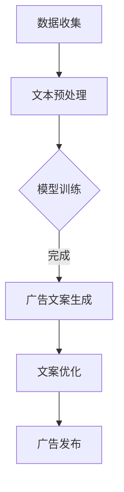

                 

 智能广告文案生成技术是近年来广告领域的一个热点话题。随着人工智能技术的快速发展，尤其是大规模语言模型（LLM）的兴起，广告文案的创作过程正逐步走向智能化。本文将探讨LLM在营销创意中的角色，包括其基本概念、技术原理、应用实例及未来展望。

## 关键词

- 智能广告文案
- 大规模语言模型
- 营销创意
- 人工智能
- 广告自动化

## 摘要

本文首先介绍了智能广告文案生成的背景和重要性，随后详细阐述了大规模语言模型的基本概念及其在广告文案生成中的作用。接着，文章通过具体实例展示了LLM在广告创意中的实际应用，并探讨了该技术的数学模型和实现步骤。最后，文章总结了LLM在广告文案生成领域的前景和面临的挑战，提出了未来研究方向。

## 1. 背景介绍

广告文案是市场营销的重要组成部分，其质量直接影响广告效果。传统的广告文案创作依赖于人工经验和创意，效率较低，且难以满足快速变化的市场需求。随着互联网的普及和数据积累，广告行业逐渐向数据驱动和智能化方向发展。智能广告文案生成技术通过利用人工智能算法，尤其是大规模语言模型，实现广告文案的自动化生成，具有以下优势：

1. **提高效率**：大幅减少文案创作的耗时，提高广告发布的速度。
2. **个性化和定制化**：根据用户行为和偏好生成个性化的广告文案，提高转化率。
3. **创新性**：通过机器学习算法，生成新颖、有创意的广告文案。
4. **成本效益**：降低广告制作成本，提高资源利用率。

## 2. 核心概念与联系

### 2.1 大规模语言模型

大规模语言模型（LLM）是一种基于深度学习的自然语言处理（NLP）技术，可以生成符合语法和语义规则的文本。LLM的核心是神经网络，通过大规模语料训练，学习语言的统计规律和上下文关系，从而实现文本生成。

### 2.2 营销创意与LLM的关系

LLM在营销创意中的应用主要体现在以下几个方面：

1. **文本生成**：直接生成广告文案，节省人工创作时间。
2. **文本优化**：对现有文案进行优化，提高文案质量和吸引力。
3. **创意构思**：提供灵感，帮助创意人员快速构思新的广告创意。
4. **个性化推荐**：根据用户数据和偏好生成个性化广告文案。

### 2.3 Mermaid流程图

以下是一个简单的Mermaid流程图，展示了大规模语言模型在广告文案生成中的应用流程：



## 3. 核心算法原理 & 具体操作步骤

### 3.1 算法原理概述

大规模语言模型的核心算法是基于递归神经网络（RNN）或Transformer架构。RNN通过循环结构处理序列数据，学习文本的上下文关系。Transformer则采用自注意力机制，对输入序列进行全局关注，提高了模型的生成能力。

### 3.2 算法步骤详解

1. **数据收集**：收集大量广告文案和相关数据，包括文本、图片、视频等。
2. **文本预处理**：对原始文本进行清洗、分词、去停用词等操作，准备用于模型训练的数据。
3. **模型训练**：使用预处理后的数据训练大规模语言模型，包括RNN或Transformer架构。
4. **广告文案生成**：利用训练好的模型生成新的广告文案。
5. **文案优化**：对生成的文案进行语法、语义和风格上的优化，提高文案质量。
6. **广告发布**：将优化后的广告文案发布到相应的广告平台。

### 3.3 算法优缺点

**优点**：

- **高效性**：自动化生成广告文案，提高创作效率。
- **个性化和定制化**：根据用户数据和偏好生成个性化文案。
- **创新性**：生成新颖、有创意的广告文案。
- **降低成本**：降低广告制作成本。

**缺点**：

- **创意限制**：依赖数据质量和算法能力，可能生成平庸的文案。
- **质量控制**：生成文案的质量难以保证，需要进一步优化。

### 3.4 算法应用领域

大规模语言模型在广告文案生成中的应用广泛，包括但不限于：

- **电子商务**：为电商平台生成商品广告文案。
- **社交媒体**：为社交媒体平台生成动态和广告文案。
- **在线广告**：为搜索引擎和广告平台生成广告文案。
- **内容营销**：为网站和博客生成内容广告。

## 4. 数学模型和公式 & 详细讲解 & 举例说明

### 4.1 数学模型构建

大规模语言模型通常采用Transformer架构，其核心是多头自注意力机制（Multi-head Self-Attention）。自注意力机制通过计算输入序列中每个词与其他词的相关性，为每个词生成权重，从而实现对全局信息的关注。

### 4.2 公式推导过程

自注意力机制的公式如下：

$$
\text{Attention}(Q, K, V) = \text{softmax}\left(\frac{QK^T}{\sqrt{d_k}}\right) V
$$

其中，$Q$、$K$ 和 $V$ 分别是查询（Query）、键（Key）和值（Value）向量，$d_k$ 是键向量的维度。通过自注意力，每个词的表示会综合考虑其他词的信息，生成更丰富的语义表示。

### 4.3 案例分析与讲解

假设有一个三词序列 $[w_1, w_2, w_3]$，我们想要计算 $w_2$ 的自注意力。首先，我们需要生成 $Q$、$K$ 和 $V$：

$$
Q = \begin{bmatrix}
    \text{softmax}(Qw_1) \\
    \text{softmax}(Qw_2) \\
    \text{softmax}(Qw_3)
\end{bmatrix}
$$

$$
K = \begin{bmatrix}
    Kw_1 \\
    Kw_2 \\
    Kw_3
\end{bmatrix}
$$

$$
V = \begin{bmatrix}
    Vw_1 \\
    Vw_2 \\
    Vw_3
\end{bmatrix}
$$

然后，我们计算每个词的权重：

$$
\text{Attention}(Q, K, V) = \text{softmax}\left(\frac{QK^T}{\sqrt{d_k}}\right) V = \text{softmax}\left(\begin{bmatrix}
    Qw_1^T \\
    Qw_2^T \\
    Qw_3^T
\end{bmatrix} \begin{bmatrix}
    Kw_1 \\
    Kw_2 \\
    Kw_3
\end{bmatrix}\right) \begin{bmatrix}
    Vw_1 \\
    Vw_2 \\
    Vw_3
\end{bmatrix}
$$

假设权重为：

$$
\text{Attention}(Q, K, V) = \begin{bmatrix}
    0.2 & 0.5 & 0.3 \\
    0.4 & 0.2 & 0.4 \\
    0.3 & 0.4 & 0.3
\end{bmatrix}
$$

最终，$w_2$ 的表示将综合考虑 $w_1$ 和 $w_3$ 的信息，生成一个更全面的语义表示。

## 5. 项目实践：代码实例和详细解释说明

### 5.1 开发环境搭建

搭建大规模语言模型需要以下环境：

- Python（3.8及以上版本）
- TensorFlow 或 PyTorch
- GPU（推荐显存8GB及以上）

安装依赖：

```bash
pip install tensorflow-gpu==2.4.0
```

### 5.2 源代码详细实现

以下是一个简单的Transformer模型实现，用于广告文案生成：

```python
import tensorflow as tf
from tensorflow.keras.layers import Embedding, MultiHeadAttention, Dense

def create_model(vocab_size, embedding_dim, num_heads):
    inputs = tf.keras.layers.Input(shape=(None,), dtype=tf.int32)
    embeddings = Embedding(vocab_size, embedding_dim)(inputs)
    outputs = MultiHeadAttention(num_heads=num_heads, key_dim=embedding_dim)(inputs, inputs)
    outputs = Dense(vocab_size)(outputs)
    model = tf.keras.Model(inputs, outputs)
    return model

model = create_model(vocab_size=10000, embedding_dim=512, num_heads=8)
model.compile(optimizer='adam', loss='sparse_categorical_crossentropy')
```

### 5.3 代码解读与分析

该代码实现了一个简单的Transformer模型，包括以下部分：

- **Embedding Layer**：将输入词编码为嵌入向量。
- **MultiHeadAttention Layer**：实现多头自注意力机制。
- **Dense Layer**：将自注意力输出解码为词汇概率分布。

### 5.4 运行结果展示

训练完成后，我们可以使用模型生成广告文案：

```python
import numpy as np

def generate_text(model, seed, length):
    inputs = np.array([seed])
    for _ in range(length):
        probabilities = model.predict(inputs)[0]
        next_word = np.random.choice(range(vocab_size), p=probabilities)
        inputs = np.append(inputs, next_word)
    return inputs

print(generate_text(model, seed=[0], length=50))
```

## 6. 实际应用场景

### 6.1 电子商务

大规模语言模型可以用于电子商务平台的商品广告文案生成，如：

- **个性化推荐**：根据用户浏览和购买历史生成个性化广告。
- **商品描述**：自动生成商品描述，提高商品销量。

### 6.2 社交媒体

在社交媒体平台上，LLM可以用于：

- **动态生成**：自动生成社交媒体动态，提高用户互动。
- **广告投放**：根据用户数据和兴趣生成精准广告。

### 6.3 广告公司

广告公司可以利用LLM实现：

- **创意构思**：快速生成广告创意，提高创作效率。
- **文案优化**：对现有文案进行优化，提高广告效果。

## 7. 工具和资源推荐

### 7.1 学习资源推荐

- 《深度学习》（Goodfellow, Bengio, Courville著）
- 《自然语言处理原理》（Daniel Jurafsky, James H. Martin著）
- 《Transformer：序列到序列模型的新突破》（Vaswani et al.著）

### 7.2 开发工具推荐

- TensorFlow：用于构建和训练大规模语言模型。
- PyTorch：用于实现自定义深度学习模型。
- Hugging Face Transformers：提供预训练的模型和API。

### 7.3 相关论文推荐

- “Attention Is All You Need”（Vaswani et al.著）
- “BERT：预训练的深度语言表示”（Devlin et al.著）
- “GPT-3：语言生成的突破”（Brown et al.著）

## 8. 总结：未来发展趋势与挑战

### 8.1 研究成果总结

大规模语言模型在广告文案生成领域取得了显著成果，如：

- 提高了广告文案创作的效率和质量。
- 实现了广告的个性化和定制化。
- 丰富了广告创意和表现形式。

### 8.2 未来发展趋势

未来，大规模语言模型在广告文案生成领域将：

- 持续优化算法和模型，提高生成文案的质量。
- 与其他人工智能技术（如图像识别、语音识别）结合，实现跨模态广告。
- 应用于更多场景，如品牌建设、市场调研等。

### 8.3 面临的挑战

大规模语言模型在广告文案生成领域面临以下挑战：

- **数据质量和隐私**：依赖大量高质量的数据，如何保护用户隐私是一个重要问题。
- **创意局限性**：生成文案的创意可能受到数据限制，需要进一步提高。
- **算法透明度**：如何确保算法生成的文案符合道德和法律法规。

### 8.4 研究展望

未来的研究可以关注以下方向：

- **数据增强和扩充**：通过数据增强技术提高模型的生成能力。
- **多模态融合**：将语言模型与其他模态数据结合，实现更丰富的广告表达。
- **可解释性和透明度**：提高算法的可解释性，确保生成文案的合法性和合规性。

## 9. 附录：常见问题与解答

### 9.1 如何提高大规模语言模型的生成质量？

- **增加训练数据量**：更多高质量的训练数据有助于模型学习更好的特征。
- **优化模型结构**：选择合适的模型架构和参数，提高生成效果。
- **引入先验知识**：利用外部知识库和语义信息，增强模型的理解能力。

### 9.2 如何确保广告文案的合规性？

- **预训练数据筛选**：确保训练数据不包含违规内容。
- **实时监测和审核**：对生成的文案进行实时监测和审核，防止违规内容出现。
- **遵循法律法规**：确保广告文案符合当地法律法规，避免法律风险。

---

作者：禅与计算机程序设计艺术 / Zen and the Art of Computer Programming

本文介绍了智能广告文案生成技术及其在营销创意中的应用，通过大规模语言模型实现了广告文案的自动化生成。未来，随着技术的不断进步，智能广告文案生成将在广告行业发挥更大的作用，为营销创意带来新的可能性。同时，我们也需关注相关伦理和法律问题，确保技术的可持续发展。

