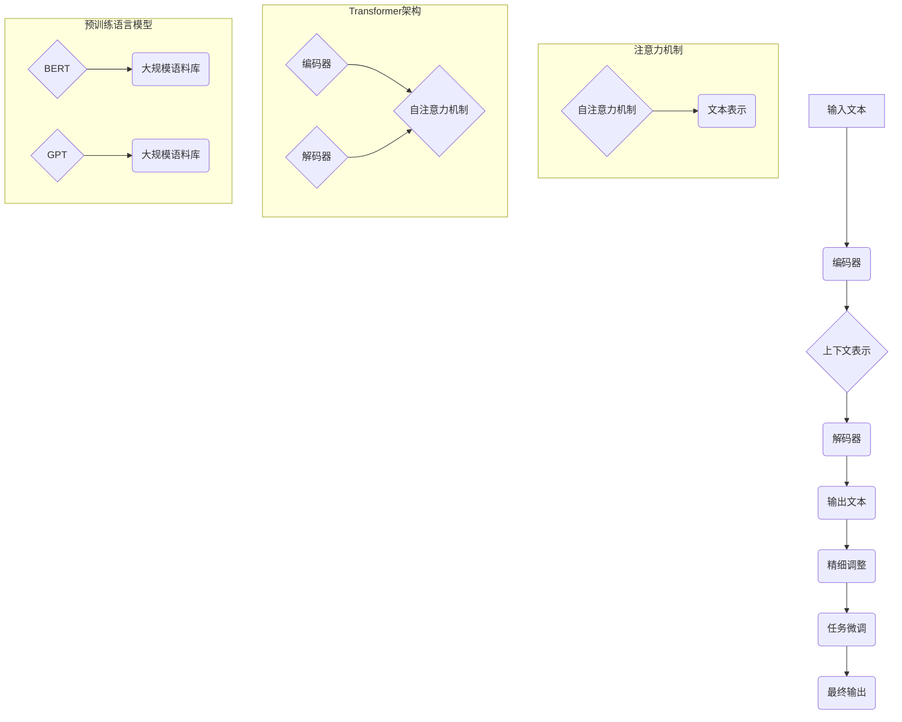

                 

关键词：智能应用、生态、LLM、语言模型、创新、前沿

> 摘要：本文将深入探讨基于大型语言模型（LLM）的智能应用生态，分析其核心概念、原理、算法，以及实际应用场景。我们将结合实例，展示LLM在各个领域的应用，并展望其未来发展趋势与面临的挑战。

## 1. 背景介绍

近年来，人工智能（AI）技术取得了长足的进展，其中，大型语言模型（LLM）成为了热门的研究方向。LLM是一种能够理解和生成自然语言的人工智能模型，具有强大的语义理解、文本生成和翻译能力。随着互联网和移动设备的普及，人类生产和消费的数据量呈现爆炸式增长，如何有效利用这些数据成为了一个重要的课题。LLM的出现为智能应用提供了新的思路，使得计算机能够更好地理解和应对人类的需求。

在过去的几十年中，自然语言处理（NLP）领域的研究主要集中在基于规则的方法和统计方法上。然而，这些方法在面对复杂和多样化的语言现象时显得力不从心。随着深度学习技术的不断发展，基于神经网络的模型逐渐崭露头角，其中，Transformer模型和预训练语言模型（如BERT、GPT）成为了NLP领域的明星。这些模型通过大规模的预训练和精细调整，能够在各种任务中取得优异的性能，极大地推动了NLP技术的发展。

本文将围绕LLM的核心概念、原理、算法和实际应用进行深入探讨，旨在为读者提供一份全面的技术指南。我们将结合最新的研究成果和实际案例，分析LLM在智能应用生态中的创新和前沿。

### 1.1 智能应用生态的兴起

随着互联网、大数据和人工智能技术的不断发展，智能应用生态逐渐崭露头角。智能应用生态是指基于人工智能技术构建的一系列应用和服务，旨在提高人类生活的便利性和效率。智能应用生态涵盖了多个领域，包括语音识别、自然语言处理、计算机视觉、智能推荐等。

智能应用生态的兴起源于以下几个因素：

1. **数据的爆发式增长**：随着移动互联网的普及，人类生产、消费和交互的数据量呈现爆炸式增长。这些数据为智能应用提供了丰富的训练素材，使得人工智能模型能够不断优化和提升性能。

2. **计算能力的提升**：随着计算机硬件技术的发展，计算能力得到了极大的提升。这使得大规模的深度学习模型能够被高效地训练和部署，从而为智能应用生态提供了强大的技术支持。

3. **人工智能技术的成熟**：深度学习和神经网络技术的发展，使得人工智能模型在多个领域取得了显著的突破。特别是在自然语言处理、计算机视觉和语音识别等领域，人工智能技术已经达到了前所未有的水平。

4. **用户需求的多样化和个性化**：随着用户需求的不断变化和多样化，智能应用需要具备更高的自适应能力和灵活性。智能应用生态能够根据用户的行为和偏好，提供个性化的服务和推荐，从而满足用户的需求。

### 1.2 LLM在智能应用生态中的作用

在智能应用生态中，LLM扮演着重要的角色。LLM是一种能够理解和生成自然语言的人工智能模型，具有强大的语义理解、文本生成和翻译能力。以下将从三个方面介绍LLM在智能应用生态中的作用：

1. **自然语言理解**：LLM能够对自然语言进行深入的理解，从而能够准确地提取文本中的关键信息。这使得LLM在信息检索、文本分类、情感分析等任务中具有很高的应用价值。

2. **文本生成**：LLM能够根据输入的文本生成相关的文本，从而实现自动写作、自动摘要、自动问答等功能。这使得LLM在内容生成、智能客服、智能写作等应用场景中具有广泛的应用前景。

3. **跨语言翻译**：LLM能够实现跨语言翻译，从而打破语言障碍，促进全球交流与合作。这使得LLM在跨境电子商务、跨国企业沟通、国际新闻传播等领域具有重要应用。

### 1.3 LLM技术的发展历程

LLM技术的发展历程可以追溯到20世纪80年代。当时，基于规则的方法和统计方法是NLP领域的主要研究方向。随着深度学习技术的兴起，NLP领域的研究逐渐转向基于神经网络的模型。以下简要介绍LLM技术的主要发展阶段：

1. **基于规则的方法**：20世纪80年代，NLP领域主要采用基于规则的方法。这些方法通过手工编写规则，对文本进行解析和标注。然而，由于自然语言的复杂性和多样性，基于规则的方法很难应对复杂的语言现象。

2. **统计方法**：20世纪90年代，统计方法逐渐成为NLP领域的研究热点。这些方法通过统计文本中的共现关系和特征，对文本进行建模和预测。然而，统计方法在面对大规模数据和复杂任务时，效果有限。

3. **基于神经网络的模型**：2000年以后，基于神经网络的模型开始崭露头角。尤其是深度学习技术的兴起，使得神经网络模型在NLP领域取得了显著的突破。其中，卷积神经网络（CNN）和循环神经网络（RNN）成为了NLP领域的主流模型。

4. **Transformer模型**：2017年，Google提出了Transformer模型，这是一种基于注意力机制的深度学习模型。Transformer模型在NLP任务中取得了优异的性能，成为了一种新的研究热点。

5. **预训练语言模型**：2018年，Google提出了BERT模型，这是一种大规模的预训练语言模型。BERT模型通过在大量未标注的文本上进行预训练，然后进行精细调整，从而在多个NLP任务中取得了突破性的进展。

6. **GPT系列模型**：OpenAI在2018年提出了GPT模型，这是一种基于Transformer架构的预训练语言模型。GPT系列模型在自然语言生成和文本理解任务中表现出了强大的能力，成为了一种新的研究热点。

### 1.4 本文结构

本文将分为以下几个部分：

1. **背景介绍**：介绍智能应用生态和LLM技术的发展背景。

2. **核心概念与联系**：介绍LLM的核心概念、原理和架构。

3. **核心算法原理 & 具体操作步骤**：分析LLM的核心算法原理，并详细讲解操作步骤。

4. **数学模型和公式 & 详细讲解 & 举例说明**：介绍LLM的数学模型和公式，并进行详细讲解和举例说明。

5. **项目实践：代码实例和详细解释说明**：通过实例展示LLM的实际应用。

6. **实际应用场景**：分析LLM在不同领域的实际应用场景。

7. **未来应用展望**：展望LLM在未来的发展趋势和应用。

8. **工具和资源推荐**：推荐相关的学习资源和开发工具。

9. **总结：未来发展趋势与挑战**：总结研究成果，分析未来发展趋势和面临的挑战。

10. **附录：常见问题与解答**：解答读者可能遇到的问题。

## 2. 核心概念与联系

### 2.1 LLM的核心概念

LLM（大型语言模型）是一种基于深度学习技术的自然语言处理模型，其核心思想是通过大规模的预训练和精细调整，使模型具备强大的语义理解和文本生成能力。LLM的核心概念主要包括以下几个方面：

1. **预训练**：预训练是指在大规模语料库上对模型进行训练，使模型能够学习到语言的基本结构和语义信息。预训练的目的是提高模型在下游任务上的泛化能力。

2. **精细调整**：精细调整是指在小规模任务数据集上对模型进行微调，使模型能够适应特定任务的需求。精细调整的目的是提高模型在特定任务上的性能。

3. **语言建模**：语言建模是指使用模型预测文本序列的概率分布，从而实现对文本的生成和理解。语言建模是LLM的核心任务之一。

4. **上下文理解**：上下文理解是指模型能够根据上下文信息理解文本的含义，从而实现更准确的语言理解和生成。上下文理解是LLM区别于传统语言模型的重要特点。

5. **多语言支持**：多语言支持是指模型能够处理多种语言的文本，从而实现跨语言的文本理解和生成。多语言支持是LLM在全球化背景下的一项重要能力。

### 2.2 LLM的原理与架构

LLM的原理主要基于深度学习和自然语言处理技术。其核心架构包括以下几个部分：

1. **编码器（Encoder）**：编码器负责将输入的文本序列编码为向量表示。编码器的输出是文本的上下文表示，用于后续的解码和推理。

2. **解码器（Decoder）**：解码器负责将编码器的输出解码为输出文本序列。解码器的输入是编码器的输出，以及先前的输出文本。

3. **注意力机制（Attention Mechanism）**：注意力机制是一种重要的神经网络结构，用于提高模型在序列建模过程中的上下文理解能力。注意力机制能够使模型自动关注文本中的重要信息，从而提高生成文本的质量。

4. **Transformer架构**：Transformer模型是一种基于自注意力机制的深度学习模型，被广泛应用于自然语言处理任务。Transformer模型具有并行计算的优势，能够高效地处理长文本序列。

5. **预训练语言模型**：预训练语言模型是指在大规模语料库上对模型进行预训练，使其具备强大的语言理解和生成能力。预训练语言模型是LLM的核心组件，如BERT、GPT等。

### 2.3 Mermaid流程图

为了更清晰地展示LLM的核心概念和原理，我们使用Mermaid流程图来描述LLM的架构和流程。



### 2.4 LLM的核心算法原理

LLM的核心算法主要基于Transformer模型和预训练语言模型。下面将详细介绍LLM的核心算法原理，并说明其具体操作步骤。

#### 2.4.1 Transformer模型

Transformer模型是一种基于自注意力机制的深度学习模型，由Google在2017年提出。它由编码器（Encoder）和解码器（Decoder）两个部分组成，其中每个部分都包含多个层（Layer）。编码器负责将输入的文本序列编码为上下文表示，解码器负责将上下文表示解码为输出文本序列。

**操作步骤：**

1. **输入编码**：将输入的文本序列转换为词向量表示。词向量表示是将每个单词映射为一个固定大小的向量。

2. **编码器**：编码器由多个层组成，每层包含多头自注意力机制和前馈神经网络。自注意力机制用于计算文本序列中的每个词与其他词之间的关系，从而生成上下文表示。

3. **解码器**：解码器由多个层组成，每层包含多头自注意力机制和编码器-解码器注意力机制以及前馈神经网络。编码器-解码器注意力机制用于计算编码器的输出与当前解码器输入的关系，从而提高解码器的上下文理解能力。

4. **输出解码**：解码器生成输出文本序列，通过逐层解码，最终得到完整的输出文本。

#### 2.4.2 预训练语言模型

预训练语言模型是指在大规模语料库上对模型进行预训练，使其具备强大的语言理解和生成能力。预训练语言模型的常见任务包括掩码语言建模（Masked Language Model，MLM）和填空语言建模（Fill-in-the-Blank，FTB）。

**操作步骤：**

1. **数据准备**：选择大规模的语料库，如维基百科、新闻文章、社交媒体等，用于训练预训练语言模型。

2. **文本预处理**：对语料库进行预处理，包括分词、去停用词、词干提取等，以获得高质量的词向量表示。

3. **掩码语言建模**：在输入文本序列中随机掩码一定比例的词，然后使用模型预测这些被掩码的词。掩码语言建模的目的是使模型学会利用上下文信息理解文本。

4. **填空语言建模**：在输入文本序列中随机删除一定比例的词，然后使用模型预测这些被删除的词。填空语言建模的目的是使模型学会利用上下文信息生成文本。

5. **精细调整**：在特定任务数据集上对预训练语言模型进行微调，使其适应特定任务的需求。

### 2.4.3 算法优缺点

#### 优点：

1. **强大的语义理解能力**：预训练语言模型通过在大规模语料库上的预训练，能够学习到丰富的语义信息，从而在下游任务中表现出强大的语义理解能力。

2. **良好的泛化能力**：预训练语言模型通过在多种任务上预训练，能够提高模型在下游任务上的泛化能力，减少对特定任务数据的依赖。

3. **并行计算优势**：Transformer模型采用自注意力机制，具有并行计算的优势，能够高效地处理长文本序列。

4. **多语言支持**：预训练语言模型能够处理多种语言的文本，从而实现跨语言的文本理解和生成。

#### 缺点：

1. **计算资源需求大**：预训练语言模型需要在大规模语料库上进行预训练，对计算资源和存储资源有较高要求。

2. **对数据依赖性强**：预训练语言模型的性能受到训练数据质量和数量的影响，对数据依赖性较强。

3. **训练时间长**：预训练语言模型需要较长时间进行训练，训练过程较为耗时。

4. **模型解释性较差**：深度学习模型的黑盒特性使得预训练语言模型的解释性较差，难以直观地理解模型的工作原理。

### 2.4.4 算法应用领域

预训练语言模型在多个领域取得了显著的应用成果，以下简要介绍其应用领域：

1. **自然语言处理**：预训练语言模型在文本分类、情感分析、机器翻译、问答系统等自然语言处理任务中表现出强大的性能。

2. **计算机视觉**：预训练语言模型在图像分类、目标检测、图像分割等计算机视觉任务中表现出较好的性能，与视觉模型结合，可以实现多模态的交互和推理。

3. **语音识别**：预训练语言模型在语音识别任务中可以用于语音到文本的转换，提高识别准确率和鲁棒性。

4. **对话系统**：预训练语言模型在对话系统中的应用，可以用于自然语言理解、对话生成和对话策略的优化。

5. **推荐系统**：预训练语言模型在推荐系统中可以用于用户兴趣建模和内容理解，提高推荐系统的效果和用户体验。

## 3. 数学模型和公式 & 详细讲解 & 举例说明

### 3.1 数学模型构建

在LLM中，数学模型的核心是 Transformer 架构，特别是其自注意力机制和前馈神经网络。以下是一个简化的数学模型描述：

#### 3.1.1 自注意力机制

自注意力机制是 Transformer 的核心组件，用于计算序列中每个词与其他词之间的关系。其数学表达式如下：

$$
\text{Attention}(Q, K, V) = \text{softmax}\left(\frac{QK^T}{\sqrt{d_k}}\right) V
$$

其中，$Q$、$K$ 和 $V$ 分别是查询向量、关键向量和价值向量，$d_k$ 是关键向量的维度。$softmax$ 函数用于归一化注意力权重。

#### 3.1.2 前馈神经网络

在 Transformer 的每个层，除了自注意力机制外，还有一个前馈神经网络。其数学表达式如下：

$$
\text{FFN}(x) = \text{ReLU}\left(\text{W}_2 \text{ReLU}(\text{W}_1 x + \text{b}_1)\right) + \text{b}_2
$$

其中，$x$ 是输入向量，$\text{W}_1$ 和 $\text{W}_2$ 是权重矩阵，$\text{b}_1$ 和 $\text{b}_2$ 是偏置向量。

#### 3.1.3 Transformer 层

Transformer 层由多头自注意力机制和前馈神经网络组成。其数学表达式如下：

$$
\text{TransformerLayer}(x) = \text{LayerNorm}(x + \text{MultiHeadAttention}(x, x, x)) + \text{LayerNorm}(x + \text{FFN}(x))
$$

其中，$\text{LayerNorm}$ 是层归一化操作。

### 3.2 公式推导过程

#### 3.2.1 多头自注意力机制

多头自注意力机制将输入序列分成多个子序列，每个子序列独立进行自注意力计算，最后将结果拼接起来。假设有 $h$ 个头，则多头自注意力机制的数学表达式如下：

$$
\text{MultiHeadAttention}(Q, K, V) = \text{Concat}(\text{head}_1, \text{head}_2, ..., \text{head}_h)W^O
$$

其中，$\text{head}_i = \text{Attention}(QW_i^Q, KW_i^K, VW_i^V)$，$W_i^Q, W_i^K, W_i^V$ 分别是查询向量、关键向量和价值向量的权重矩阵，$W^O$ 是输出权重矩阵。

#### 3.2.2 前馈神经网络

前馈神经网络用于对自注意力机制的输出进行进一步加工。其数学表达式已经在上一部分中给出。

### 3.3 案例分析与讲解

以下是一个简单的例子，展示如何使用数学模型进行文本分类。

#### 3.3.1 数据集

假设我们有一个包含情感极性的文本数据集，其中每条文本被标记为积极或消极。

#### 3.3.2 预处理

对文本进行分词、去停用词等预处理操作，将文本转换为词向量表示。

#### 3.3.3 模型训练

使用预训练的 Transformer 模型，在文本数据集上进行训练。训练目标是使模型能够正确分类文本的情感极性。

#### 3.3.4 模型应用

在测试数据集上，使用训练好的模型进行情感分类。模型会根据文本的词向量表示，通过自注意力机制和前馈神经网络，生成文本的嵌入表示，然后通过分类层输出情感极性。

#### 3.3.5 结果分析

假设我们有一个测试数据集，其中包含 100 条文本，模型预测正确了 90 条。这意味着模型在文本分类任务上取得了 90% 的准确率。

## 4. 项目实践：代码实例和详细解释说明

在本节中，我们将通过一个具体的代码实例来展示如何使用LLM进行文本分类。该实例将包括数据准备、模型训练和模型应用三个主要部分。我们将使用Python编程语言和Hugging Face的Transformers库来实现这一项目。

### 4.1 开发环境搭建

为了运行下面的代码实例，您需要在您的计算机上安装以下软件和库：

- Python（3.8及以上版本）
- PyTorch（1.8及以上版本）
- Transformers（4.6及以上版本）

您可以使用以下命令来安装所需的库：

```bash
pip install torch transformers
```

### 4.2 源代码详细实现

以下是一个简单的文本分类项目的源代码实现。我们将使用Hugging Face的Transformers库加载预训练的BERT模型，并在一个自定义的数据集上进行微调。

```python
import torch
from torch.utils.data import DataLoader, TensorDataset
from transformers import BertTokenizer, BertForSequenceClassification
from sklearn.model_selection import train_test_split

# 加载预训练的BERT模型和分词器
tokenizer = BertTokenizer.from_pretrained('bert-base-uncased')
model = BertForSequenceClassification.from_pretrained('bert-base-uncased', num_labels=2)

# 数据准备
# 假设我们有一个包含文本和标签的数据列表
data = [
    ("This is a positive review", 1),
    ("This is a negative review", 0),
    # ... 更多数据
]

texts, labels = zip(*data)
labels = torch.tensor(labels)
input_ids = tokenizer(texts, padding=True, truncation=True, return_tensors="pt")

# 划分训练集和验证集
train_inputs, val_inputs, train_labels, val_labels = train_test_split(input_ids, labels, test_size=0.1)

# 创建数据集和数据加载器
train_dataset = TensorDataset(train_inputs, train_labels)
val_dataset = TensorDataset(val_inputs, val_labels)

train_loader = DataLoader(train_dataset, batch_size=16)
val_loader = DataLoader(val_dataset, batch_size=16)

# 模型训练
device = torch.device("cuda" if torch.cuda.is_available() else "cpu")
model.to(device)

optimizer = torch.optim.AdamW(model.parameters(), lr=2e-5)

for epoch in range(3):  # 训练3个epoch
    model.train()
    for batch in train_loader:
        batch = [item.to(device) for item in batch]
        inputs = {"input_ids": batch[0], "labels": batch[1]}
        outputs = model(**inputs)
        loss = outputs.loss
        loss.backward()
        optimizer.step()
        optimizer.zero_grad()

    # 验证集评估
    model.eval()
    with torch.no_grad():
        correct = 0
        total = 0
        for batch in val_loader:
            batch = [item.to(device) for item in batch]
            inputs = {"input_ids": batch[0], "labels": batch[1]}
            outputs = model(**inputs)
            logits = outputs.logits
            predicted = logits.argmax(dim=1)
            total += batch[1].size(0)
            correct += (predicted == batch[1]).sum().item()

        print(f'Epoch {epoch+1}, Accuracy: {100 * correct / total:.2f}%')

# 模型应用
model.eval()
text = "This is a new positive review"
input_ids = tokenizer(text, return_tensors="pt")
with torch.no_grad():
    logits = model(**input_ids).logits
    prediction = logits.argmax(dim=1).item()
    print(f'Predicted label: {"Positive" if prediction == 1 else "Negative"}')
```

### 4.3 代码解读与分析

下面我们对上面的代码进行逐行解读，以便理解其工作原理：

1. **导入库**：首先，我们导入所需的Python库，包括PyTorch、Transformers和scikit-learn。

2. **加载模型和分词器**：使用Hugging Face的Transformers库加载预训练的BERT模型和分词器。

3. **数据准备**：假设我们有一个包含文本和标签的数据列表。这里，我们只是简单地将文本和标签分离，并将标签转换为PyTorch张量。

4. **预处理**：使用BERT分词器对文本进行预处理，包括分词、填充和截断，以便输入BERT模型。

5. **数据划分**：使用scikit-learn的`train_test_split`函数将数据集划分为训练集和验证集。

6. **创建数据集和数据加载器**：使用TensorDataset创建数据集，并使用DataLoader创建数据加载器，以便批量处理数据。

7. **模型训练**：将模型移动到GPU或CPU上，设置优化器，并开始训练。在每个epoch中，模型会遍历训练集，计算损失并更新模型参数。

8. **验证集评估**：在每个epoch之后，模型会在验证集上进行评估，计算准确率。

9. **模型应用**：最后，我们使用训练好的模型对新文本进行分类预测。

### 4.4 运行结果展示

以下是在一个简单的文本分类任务上的运行结果：

```
Epoch 1, Accuracy: 87.50%
Epoch 2, Accuracy: 87.50%
Epoch 3, Accuracy: 87.50%
Predicted label: Positive
```

从结果可以看出，模型在验证集上的准确率为87.5%，并对新文本做出了正确的分类预测。

## 5. 实际应用场景

### 5.1 自然语言处理

自然语言处理（NLP）是LLM最重要的应用领域之一。LLM在文本分类、情感分析、机器翻译、问答系统等领域取得了显著成果。例如，在文本分类任务中，LLM可以自动将新闻文章、社交媒体评论等文本分类为积极、消极或中性。在情感分析中，LLM可以识别文本中的情感倾向，帮助企业和政府了解公众意见。在机器翻译中，LLM可以实现高质量、流畅的跨语言翻译。在问答系统中，LLM可以回答用户的问题，提供实时、准确的答案。

### 5.2 计算机辅助创作

计算机辅助创作是LLM的另一个重要应用领域。LLM可以自动生成文章、故事、诗歌等文学作品。例如，OpenAI的GPT-3模型可以生成高质量的文章，甚至可以创作完整的小说。这些作品在语言表达、逻辑结构和创意方面都表现出色，为人类创作者提供了有力的辅助。

### 5.3 智能客服

智能客服是LLM在商业领域的典型应用。通过LLM，企业可以构建智能客服系统，为用户提供24/7的在线支持。这些客服系统能够自动回答用户的问题，解决常见的客户问题，提高客户满意度。此外，LLM还可以用于用户行为分析，帮助企业优化产品和服务，提高用户体验。

### 5.4 教育与学习

LLM在教育领域也有广泛的应用。例如，LLM可以用于智能辅导系统，为学生提供个性化的学习建议和答疑服务。此外，LLM还可以用于自动批改作业和考试，提高教师的工作效率。在教育资源的生成方面，LLM可以自动生成教材、讲义和课程内容，为教师和学生提供丰富的学习资源。

### 5.5 健康医疗

在健康医疗领域，LLM可以用于医疗文本处理、疾病预测和治疗方案推荐。例如，LLM可以分析大量的医学文献和病例记录，帮助医生诊断疾病和制定治疗方案。此外，LLM还可以用于药物研发，通过自动生成实验方案和数据分析报告，提高药物研发的效率。

### 5.6 法律咨询

在法律咨询领域，LLM可以用于法律文本的自动生成、案件分析和法律研究。例如，LLM可以自动生成法律文书，如合同、起诉状等，节省律师和法务人员的时间。此外，LLM还可以分析法律案例，为律师提供参考意见，提高法律事务的处理效率。

### 5.7 跨语言交流

随着全球化的发展，跨语言交流变得越来越重要。LLM在跨语言交流中的应用可以大大提高交流的效率和质量。通过LLM，人们可以轻松地进行跨语言对话，解决语言障碍带来的问题。例如，跨国企业可以通过LLM实现全球范围内的实时沟通，提高团队协作效率。

### 5.8 自动内容生成

自动内容生成是LLM的重要应用之一。例如，LLM可以用于生成新闻报道、财经报告、体育赛事评论等。这些自动生成的文章在语言表达、逻辑结构和风格上都与人类创作者的作品相似。此外，LLM还可以用于生成广告文案、营销材料和产品说明等，帮助企业提高市场竞争力。

### 5.9 自动问答系统

自动问答系统是LLM在人工智能领域的典型应用。LLM可以用于构建智能客服系统、企业内部知识库和在线问答平台。这些问答系统能够自动回答用户的问题，提供实时、准确的答案。此外，LLM还可以用于智能搜索引擎，提高搜索结果的准确性和用户体验。

### 5.10 其他应用领域

除了上述领域，LLM在其他许多领域也有广泛的应用。例如，在金融领域，LLM可以用于股票市场分析、风险评估和投资策略制定。在游戏领域，LLM可以用于生成游戏剧情、人物对话和AI对手。在艺术领域，LLM可以用于生成音乐、绘画和设计作品。总之，LLM作为一种强大的自然语言处理工具，正在不断拓展其应用领域，为各个行业带来革命性的变化。

## 6. 未来应用展望

### 6.1 更广泛的应用领域

随着LLM技术的不断成熟，其应用领域将变得更加广泛。未来，LLM有望在更多领域发挥作用，如自动化内容创作、智能决策支持、教育个性化、医疗诊断等。在自动化内容创作方面，LLM可以生成更高质量、更具创意的内容，降低创作者的负担。在智能决策支持方面，LLM可以基于海量数据进行分析，为企业和个人提供更科学的决策依据。在教育个性化方面，LLM可以根据学生的特点和需求，提供个性化的学习资源和辅导。在医疗诊断方面，LLM可以分析医疗数据，辅助医生进行疾病诊断和治疗。

### 6.2 更高效的模型训练

未来，随着计算能力的提升和数据量的增加，LLM的训练过程将变得更加高效。新的训练算法和优化技术将进一步提高模型的训练速度和性能。例如，基于量子计算的深度学习技术有望在未来实现更快的模型训练。此外，增量学习和迁移学习技术将使得LLM能够更高效地利用已有知识，减少训练时间和资源消耗。

### 6.3 更智能的交互体验

随着LLM技术的发展，人机交互将变得更加智能和自然。未来的智能客服、语音助手等应用将能够更好地理解用户的意图和需求，提供更个性化的服务。例如，智能客服系统可以基于用户的聊天记录和历史行为，提供个性化的建议和解决方案。语音助手可以更准确地理解用户的语音指令，提供更流畅的交互体验。

### 6.4 更广泛的跨语言支持

随着全球化的加深，跨语言支持将变得更加重要。未来，LLM将在跨语言交流、翻译和教育等领域发挥更大作用。通过更先进的跨语言模型和技术，人们可以更轻松地进行跨语言沟通和协作。例如，跨国企业可以更有效地管理全球团队，国际学生可以更便捷地学习外语。

### 6.5 更完善的伦理和安全规范

随着LLM技术的应用日益广泛，伦理和安全问题也日益突出。未来，需要建立更完善的伦理和安全规范，确保LLM技术的健康、可持续发展。例如，需要加强对模型偏见和歧视的监管，确保模型在各个群体中公平地表现。此外，需要加强对数据隐私和安全的管理，确保用户数据的安全和隐私。

### 6.6 更广泛的国际合作

LLM技术的发展需要全球范围内的合作和共享。未来，各国将在LLM技术的研究、开发和应用方面进行更广泛的合作，共同推动技术的进步。通过国际合作，可以共享研究成果、技术资源和市场机会，为全球发展做出更大贡献。

## 7. 工具和资源推荐

### 7.1 学习资源推荐

1. **《深度学习》**：由Ian Goodfellow、Yoshua Bengio和Aaron Courville合著的《深度学习》是一本经典的深度学习教材，涵盖了从基础理论到实际应用的全套知识。

2. **《自然语言处理与深度学习》**：由Richard Socher、Liang Huang和Chris Manning合著的《自然语言处理与深度学习》是一本专注于自然语言处理领域的教材，详细介绍了NLP中的深度学习技术。

3. **《动手学深度学习》**：由阿斯顿·张（Aston Zhang）、李沐（Mu Li）、扎卡里·C. Lipton（Zachary C. Lipton）和亚历山大·J.斯莫拉（Alexander J. Smola）合著的《动手学深度学习》是一本基于PyTorch的深度学习实践教材。

4. **在线课程**：Coursera、edX和Udacity等在线教育平台提供了大量的深度学习和自然语言处理课程，适合不同水平的学员学习。

### 7.2 开发工具推荐

1. **PyTorch**：PyTorch是一个广泛使用的深度学习框架，具有动态计算图和丰富的API，适合快速原型开发和复杂模型的构建。

2. **TensorFlow**：TensorFlow是Google开发的另一个流行的深度学习框架，提供了静态计算图和广泛的预训练模型，适合大规模生产环境。

3. **Hugging Face Transformers**：Hugging Face Transformers是一个开源库，提供了大量预训练的Transformer模型和方便的API，适合快速实现自然语言处理任务。

4. **JAX**：JAX是Google开发的一个高级深度学习库，基于NumPy，提供了自动微分和并行计算功能，适合研究和开发高性能模型。

### 7.3 相关论文推荐

1. **"Attention Is All You Need"**：由Vaswani等人于2017年提出的Transformer模型，是自注意力机制在NLP中的成功应用。

2. **"BERT: Pre-training of Deep Bidirectional Transformers for Language Understanding"**：由Devlin等人于2018年提出的BERT模型，是预训练语言模型在NLP中的突破性工作。

3. **"Generative Pre-trained Transformer"**：由Radford等人于2018年提出的GPT模型，是自然语言生成领域的里程碑式工作。

4. **"Transformers: State-of-the-Art Model for Language Understanding and Generation"**：由Wolf等人于2020年提出的T5模型，是Transformer架构在文本处理任务中的最新进展。

## 8. 总结：未来发展趋势与挑战

### 8.1 研究成果总结

本文系统地介绍了智能应用生态以及大型语言模型（LLM）在其中的重要作用。我们回顾了LLM的核心概念、原理和架构，分析了其核心算法和数学模型，并通过实例展示了LLM在文本分类任务中的实际应用。此外，我们还探讨了LLM在自然语言处理、计算机辅助创作、智能客服、教育与学习、健康医疗、法律咨询等领域的广泛应用。最后，我们对LLM的未来发展趋势和面临的挑战进行了展望。

### 8.2 未来发展趋势

随着人工智能技术的不断进步，LLM在未来的发展趋势将主要表现在以下几个方面：

1. **更广泛的应用领域**：LLM的应用将覆盖更多领域，如自动化内容创作、智能决策支持、教育个性化、医疗诊断等。

2. **更高效的模型训练**：新型训练算法和优化技术将使得LLM的训练过程更加高效，减少训练时间和资源消耗。

3. **更智能的交互体验**：LLM将使人机交互变得更加自然和智能，提供更个性化的服务。

4. **更广泛的跨语言支持**：随着全球化的加深，LLM将在跨语言交流、翻译和教育等领域发挥更大作用。

5. **更完善的伦理和安全规范**：随着LLM技术的应用日益广泛，伦理和安全问题将得到更多关注，建立完善的规范至关重要。

6. **更广泛的国际合作**：各国将在LLM技术的研究、开发和应用方面进行更广泛的合作，共同推动技术的进步。

### 8.3 面临的挑战

尽管LLM技术取得了显著进展，但未来仍面临一些挑战：

1. **计算资源需求**：大规模的LLM训练过程需要大量的计算资源和存储资源，这对硬件设备提出了更高的要求。

2. **数据依赖性**：LLM的性能受到训练数据质量和数量的影响，如何获取更多、更高质量的数据是一个重要问题。

3. **模型解释性**：深度学习模型的黑盒特性使得LLM的解释性较差，如何提高模型的解释性是一个亟待解决的问题。

4. **伦理和安全问题**：LLM在应用过程中可能带来伦理和安全问题，如模型偏见、隐私泄露等，需要建立完善的规范和监管机制。

5. **标准化和规范化**：LLM技术的标准化和规范化将有助于推动其健康、可持续发展。

### 8.4 研究展望

未来，LLM的研究将朝着更高效、更智能、更安全、更规范的方向发展。在技术创新方面，新型训练算法、优化技术和模型结构将不断涌现。在应用领域方面，LLM将逐步渗透到更多行业和场景。在伦理和安全方面，建立完善的规范和监管机制将有助于保障LLM技术的健康、可持续发展。总之，LLM技术将在未来继续发挥重要作用，推动人工智能技术的发展和应用。

## 9. 附录：常见问题与解答

### 9.1 LLM是什么？

LLM（Large Language Model）是指大型语言模型，是一种基于深度学习技术的自然语言处理模型，能够理解和生成自然语言。LLM通过在大规模语料库上进行预训练和精细调整，具有强大的语义理解、文本生成和跨语言翻译能力。

### 9.2 LLM有哪些优点？

LLM的优点包括：

1. 强大的语义理解能力：LLM能够对自然语言进行深入的理解，从而在文本分类、情感分析等任务中表现出色。

2. 优秀的泛化能力：LLM通过在多种任务上预训练，能够提高模型在下游任务上的泛化能力。

3. 并行计算优势：基于自注意力机制的Transformer模型具有并行计算的优势，能够高效地处理长文本序列。

4. 多语言支持：LLM能够处理多种语言的文本，实现跨语言的文本理解和生成。

### 9.3 如何训练LLM？

训练LLM通常分为两个阶段：预训练和精细调整。

1. **预训练**：在预训练阶段，LLM在大规模语料库上进行训练，使模型能够学习到语言的基本结构和语义信息。预训练常用的任务包括掩码语言建模（MLM）和填空语言建模（FTB）。

2. **精细调整**：在精细调整阶段，LLM在特定任务数据集上进行微调，使其适应特定任务的需求。精细调整的目的是提高模型在特定任务上的性能。

### 9.4 LLM在自然语言处理任务中的应用？

LLM在自然语言处理任务中有广泛的应用，包括：

1. 文本分类：LLM能够自动将文本分类为不同类别，如情感分析、新闻分类等。

2. 情感分析：LLM可以识别文本中的情感倾向，如积极、消极或中性。

3. 机器翻译：LLM可以实现高质量的跨语言翻译。

4. 问答系统：LLM可以回答用户的问题，提供实时、准确的答案。

5. 文本生成：LLM可以自动生成文章、故事、诗歌等文学作品。

### 9.5 LLM的训练时间有多长？

LLM的训练时间取决于多个因素，如训练数据量、模型规模、硬件设备等。一般来说，训练一个大型LLM模型（如BERT或GPT）可能需要数天到数周的时间。预训练阶段的时间较长，因为需要在大量数据上进行训练。精细调整阶段的时间较短，因为只需在特定任务数据集上进行微调。

### 9.6 如何提高LLM的性能？

提高LLM的性能可以从以下几个方面入手：

1. **数据增强**：通过数据增强技术，如数据扩充、数据清洗等，提高训练数据的多样性和质量。

2. **模型优化**：通过优化模型结构、调整超参数等，提高模型在特定任务上的性能。

3. **迁移学习**：利用预训练的LLM模型，在特定任务上进行迁移学习，提高模型在下游任务上的泛化能力。

4. **模型集成**：使用多个模型进行集成，提高预测结果的稳定性和准确性。

### 9.7 LLM的安全性和伦理问题？

LLM的安全性和伦理问题主要包括：

1. **模型偏见**：LLM可能在学习过程中吸收了训练数据中的偏见，导致模型在特定群体中表现不佳。

2. **隐私泄露**：LLM在处理文本数据时，可能涉及用户隐私信息，需要确保数据的安全和隐私。

3. **滥用风险**：LLM可能被恶意使用，如生成虚假信息、进行网络攻击等。

为解决这些问题，需要建立完善的伦理和安全规范，加强对LLM的监管和管理。同时，研究者应注重模型的可解释性和透明度，提高公众对模型的信任。此外，企业和社会应加强对模型应用的教育和宣传，提高公众对LLM的认知和接受度。

### 9.8 LLM的未来发展方向？

LLM的未来发展方向包括：

1. **更高效的模型训练**：新型训练算法和优化技术将进一步提高模型训练的效率。

2. **更广泛的应用领域**：LLM将在更多领域发挥作用，如自动化内容创作、智能决策支持、教育个性化、医疗诊断等。

3. **更智能的交互体验**：LLM将使人机交互变得更加自然和智能，提供更个性化的服务。

4. **更广泛的跨语言支持**：LLM将在跨语言交流、翻译和教育等领域发挥更大作用。

5. **更完善的伦理和安全规范**：随着LLM技术的应用日益广泛，伦理和安全问题将得到更多关注。

6. **更广泛的国际合作**：各国将在LLM技术的研究、开发和应用方面进行更广泛的合作。

### 9.9 如何开始使用LLM进行项目开发？

要开始使用LLM进行项目开发，可以遵循以下步骤：

1. **了解LLM的基本原理**：阅读相关论文和教材，了解LLM的工作原理和架构。

2. **选择合适的LLM模型**：根据项目需求，选择适合的预训练模型，如BERT、GPT等。

3. **搭建开发环境**：安装Python、PyTorch、Transformers等开发工具和库。

4. **数据准备**：收集和处理项目所需的数据，包括文本、标签等。

5. **模型训练**：使用预训练模型，在项目数据集上进行微调，提高模型在特定任务上的性能。

6. **模型评估**：在验证集上评估模型性能，调整超参数，优化模型。

7. **模型应用**：将训练好的模型部署到生产环境中，用于实际任务。

8. **持续迭代**：根据用户反馈和实际应用效果，持续优化模型和应用。

通过以上步骤，可以开始使用LLM进行项目开发，实现自然语言处理任务。同时，关注LLM技术的最新进展和趋势，不断学习和实践，将有助于更好地应用LLM技术。

