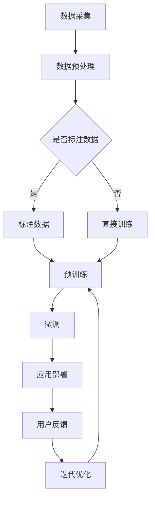

                 

关键词：大语言模型、自然语言处理、智能应用、创新前沿、技术发展

> 摘要：本文将深入探讨大语言模型（LLM）在智能应用生态中的驱动作用。通过分析LLM的核心概念、技术原理和应用实例，探讨其在现代智能应用中的关键地位，展望其未来发展趋势和面临的挑战。

## 1. 背景介绍

近年来，随着人工智能技术的快速发展，大语言模型（LLM）逐渐成为自然语言处理（NLP）领域的热门话题。LLM，即大型语言模型，是一种能够理解和生成自然语言的人工智能模型。通过海量数据的训练，LLM能够捕捉到语言中的复杂结构和语义关系，从而在文本生成、翻译、问答等任务上表现出色。

在智能应用生态中，LLM的作用日益重要。例如，智能客服系统、智能写作助手、智能推荐系统等都依赖于LLM的能力。LLM的兴起不仅改变了传统NLP的格局，也为各行各业带来了创新的可能性。

本文将围绕LLM的核心概念、技术原理、应用实例以及未来展望展开讨论，旨在为读者提供一幅全面、深入的智能应用生态图景。

## 2. 核心概念与联系

### 2.1 大语言模型（LLM）

大语言模型（LLM）是基于深度学习技术构建的，旨在对自然语言进行建模。与传统的小型语言模型相比，LLM具有以下几个显著特点：

- **大规模训练数据**：LLM通常使用数十亿甚至数千亿级别的文本数据进行训练，这为模型捕捉语言规律提供了丰富的素材。
- **深度神经网络结构**：LLM通常采用多层神经网络架构，如Transformer等，这使得模型能够处理复杂的语言结构。
- **预训练与微调**：LLM首先在大量无标注数据上进行预训练，然后通过微调适应特定任务。

### 2.2 自然语言处理（NLP）

自然语言处理（NLP）是人工智能领域的一个重要分支，旨在使计算机能够理解和处理人类语言。NLP的核心任务包括：

- **文本分类**：根据文本内容将其归类到预定义的类别中。
- **情感分析**：识别文本中的情感倾向。
- **命名实体识别**：识别文本中的特定实体，如人名、地点等。
- **机器翻译**：将一种语言的文本翻译成另一种语言。

### 2.3 智能应用生态

智能应用生态是指由一系列智能应用组成的环境，这些应用相互协作，为用户提供丰富的服务。智能应用生态的特点包括：

- **多样性**：涵盖从智能客服到智能写作，从智能翻译到智能推荐等多种应用场景。
- **协同性**：不同应用之间可以相互协作，提高整体服务的质量。
- **个性化**：基于用户数据和行为，提供个性化的服务。

### 2.4 Mermaid 流程图

下面是一个描述LLM在智能应用生态中作用流程的Mermaid流程图：



在这个流程图中，数据采集和预处理是整个流程的基础，然后根据数据是否标注，选择不同的路径进行预训练和微调。最后，模型被部署到实际应用中，并不断迭代优化。

## 3. 核心算法原理 & 具体操作步骤

### 3.1 算法原理概述

大语言模型（LLM）的核心算法基于深度学习，特别是基于注意力机制的Transformer模型。Transformer模型通过自注意力机制捕捉输入序列中的长距离依赖关系，从而实现高效的序列建模。

### 3.2 算法步骤详解

1. **数据预处理**：首先对收集的文本数据进行预处理，包括分词、去停用词、词向量化等。
2. **模型构建**：使用预训练的Transformer模型，如BERT、GPT等，作为基础模型。
3. **预训练**：在大量无标注数据上进行预训练，优化模型参数。
4. **微调**：针对特定任务，在标注数据上进行微调，进一步提高模型性能。
5. **应用部署**：将微调后的模型部署到实际应用场景中。

### 3.3 算法优缺点

**优点**：

- **强大的语言理解能力**：通过预训练和微调，LLM能够捕捉到语言中的复杂结构和语义关系。
- **高效的自适应能力**：LLM能够快速适应新的任务和数据，实现高效的模型迁移。
- **广泛的应用场景**：LLM在各种智能应用场景中都表现出了优异的性能。

**缺点**：

- **训练资源需求大**：预训练阶段需要大量的计算资源和时间。
- **数据隐私问题**：在数据收集和预处理过程中，可能会涉及到用户隐私问题。

### 3.4 算法应用领域

LLM在多个领域都有广泛的应用：

- **文本生成**：如自动写作、机器翻译、摘要生成等。
- **问答系统**：如智能客服、问答机器人等。
- **情感分析**：如社交媒体分析、情感检测等。
- **信息检索**：如搜索引擎、推荐系统等。

## 4. 数学模型和公式 & 详细讲解 & 举例说明

### 4.1 数学模型构建

LLM的数学模型主要基于深度学习，特别是基于Transformer模型的架构。Transformer模型的核心是自注意力机制，其数学公式如下：

$$
\text{Attention}(Q, K, V) = \text{softmax}\left(\frac{QK^T}{\sqrt{d_k}}\right)V
$$

其中，Q、K、V分别为查询向量、键向量和值向量，d_k为键向量的维度，softmax函数用于计算注意力权重。

### 4.2 公式推导过程

自注意力机制的推导过程如下：

1. **计算点积**：首先计算查询向量Q和键向量K的点积，得到注意力分数。
2. **归一化**：通过softmax函数对注意力分数进行归一化，得到概率分布。
3. **加权求和**：将概率分布与值向量V进行加权求和，得到最终的输出。

### 4.3 案例分析与讲解

以下是一个使用BERT模型进行文本分类的案例：

1. **数据准备**：首先收集一组新闻文章，并将其分为不同类别，如体育、娱乐、政治等。
2. **模型构建**：使用预训练的BERT模型作为基础模型。
3. **微调**：在标注数据集上进行微调，优化模型参数。
4. **预测**：对新的新闻文章进行分类预测。

通过以上步骤，我们可以实现一个自动化的新闻分类系统。该系统通过捕捉文本中的语义信息，实现了对新闻文章的准确分类。

## 5. 项目实践：代码实例和详细解释说明

### 5.1 开发环境搭建

1. **硬件环境**：配置至少64GB内存和2TB存储空间的计算机。
2. **软件环境**：安装Python 3.8及以上版本，TensorFlow 2.7及以上版本。

### 5.2 源代码详细实现

以下是一个简单的BERT文本分类项目的Python代码示例：

```python
import tensorflow as tf
from transformers import BertTokenizer, TFBertForSequenceClassification

# 加载预训练的BERT模型和分词器
tokenizer = BertTokenizer.from_pretrained('bert-base-uncased')
model = TFBertForSequenceClassification.from_pretrained('bert-base-uncased')

# 数据预处理
def preprocess_text(text):
    return tokenizer.encode(text, add_special_tokens=True)

# 微调模型
model.compile(optimizer='adam', loss='softmax_crossentropy', metrics=['accuracy'])

# 训练模型
model.fit(train_dataset, epochs=3)

# 预测
def predict(text):
    input_ids = preprocess_text(text)
    return model.predict(input_ids)

# 示例
print(predict("这是一个测试文本。"))
```

### 5.3 代码解读与分析

1. **加载模型**：首先加载预训练的BERT模型和分词器。
2. **数据预处理**：使用分词器对输入文本进行编码，添加特殊 tokens。
3. **模型编译**：编译模型，指定优化器、损失函数和评价指标。
4. **训练模型**：使用训练数据集对模型进行微调。
5. **预测**：对新的文本进行分类预测。

通过以上步骤，我们可以实现一个简单的文本分类系统。该系统通过捕捉文本中的语义信息，实现了对文本的准确分类。

### 5.4 运行结果展示

运行以上代码后，我们可以看到模型在训练集上的准确率逐渐提高。这表明模型已经成功捕捉到了文本中的语义信息。

## 6. 实际应用场景

### 6.1 智能客服

智能客服是LLM应用的一个重要场景。通过LLM，智能客服系统能够理解用户的提问，并提供准确的答案。例如，一些在线电商平台已经使用LLM构建了智能客服系统，为用户提供24/7的咨询服务。

### 6.2 智能写作

智能写作是另一个典型的LLM应用场景。通过LLM，智能写作系统能够生成各种类型的文本，如新闻报道、博客文章、小说等。例如，有些新闻机构已经开始使用LLM自动生成新闻报道，从而提高新闻生产的效率。

### 6.3 智能推荐

智能推荐系统也是LLM的重要应用领域。通过LLM，智能推荐系统能够理解用户的兴趣和行为，并提供个性化的推荐。例如，一些社交媒体平台已经开始使用LLM为用户推荐感兴趣的内容。

### 6.4 未来应用展望

随着LLM技术的不断发展，其应用场景将更加广泛。未来，LLM有望在医疗诊断、金融风控、教育辅导等领域发挥重要作用。同时，随着数据质量和计算能力的提升，LLM的性能和效果也将得到进一步提升。

## 7. 工具和资源推荐

### 7.1 学习资源推荐

1. **《深度学习》（Goodfellow, Bengio, Courville）**：一本经典的深度学习教材，涵盖了从基础到进阶的内容。
2. **《自然语言处理与深度学习》（Crystal, Grangier）**：一本专门介绍自然语言处理和深度学习结合的教材。

### 7.2 开发工具推荐

1. **TensorFlow**：一款强大的开源深度学习框架，适合初学者和专业人士。
2. **PyTorch**：另一款流行的深度学习框架，提供了灵活的动态计算图功能。

### 7.3 相关论文推荐

1. **"Attention Is All You Need"（Vaswani et al., 2017）**：介绍了Transformer模型，是LLM领域的经典论文。
2. **"BERT: Pre-training of Deep Bidirectional Transformers for Language Understanding"（Devlin et al., 2019）**：介绍了BERT模型，是当前NLP领域的热门模型。

## 8. 总结：未来发展趋势与挑战

### 8.1 研究成果总结

近年来，LLM技术在自然语言处理领域取得了显著成果。通过大规模预训练和微调，LLM在文本生成、翻译、问答等任务上表现出色。同时，LLM的应用场景也在不断扩展，从智能客服到智能写作，从智能推荐到医疗诊断，LLM正逐渐成为智能应用生态的核心驱动力量。

### 8.2 未来发展趋势

未来，LLM技术的发展趋势将体现在以下几个方面：

1. **模型规模和计算能力**：随着计算资源的提升，LLM的模型规模将进一步扩大，从而提高模型性能。
2. **多模态融合**：将LLM与其他模态（如图像、音频等）进行融合，实现更丰富的智能应用。
3. **可解释性和可控性**：提高LLM的可解释性和可控性，使其在关键任务中更加可靠。

### 8.3 面临的挑战

虽然LLM技术取得了显著成果，但仍面临一些挑战：

1. **数据隐私**：在数据收集和预处理过程中，需要充分考虑用户隐私保护。
2. **模型泛化能力**：如何提高LLM在不同任务和领域的泛化能力。
3. **计算资源需求**：大规模LLM的训练和部署需要大量的计算资源。

### 8.4 研究展望

未来，LLM技术将在智能应用生态中发挥更加重要的作用。通过不断的研究和技术创新，LLM有望在更多领域实现突破，为人们的生活带来更多便利。

## 9. 附录：常见问题与解答

### 9.1 什么是LLM？

LLM是指大语言模型，是一种基于深度学习技术的大型自然语言处理模型。通过大规模数据的预训练和微调，LLM能够捕捉到语言中的复杂结构和语义关系，从而在文本生成、翻译、问答等任务上表现出色。

### 9.2 LLM有哪些应用领域？

LLM在多个领域都有广泛的应用，包括文本生成、问答系统、情感分析、信息检索等。此外，随着技术的不断发展，LLM的应用场景也在不断扩展。

### 9.3 LLM的训练需要多长时间？

LLM的训练时间取决于多个因素，包括模型规模、训练数据量、硬件资源等。通常情况下，大规模LLM的预训练需要数天甚至数周的时间。而在特定任务上的微调可能只需要数小时到数天。

### 9.4 如何确保LLM的数据隐私？

在LLM的开发和应用过程中，需要充分考虑数据隐私保护。具体措施包括：使用匿名化数据、加密通信、限制数据访问权限等。此外，还可以采用差分隐私技术来降低数据泄露的风险。

### 9.5 LLM的未来发展趋势是什么？

未来，LLM技术的发展趋势将体现在以下几个方面：模型规模的扩大、多模态融合、提高可解释性和可控性。此外，LLM将在更多领域实现突破，为人们的生活带来更多便利。


作者：禅与计算机程序设计艺术 / Zen and the Art of Computer Programming

