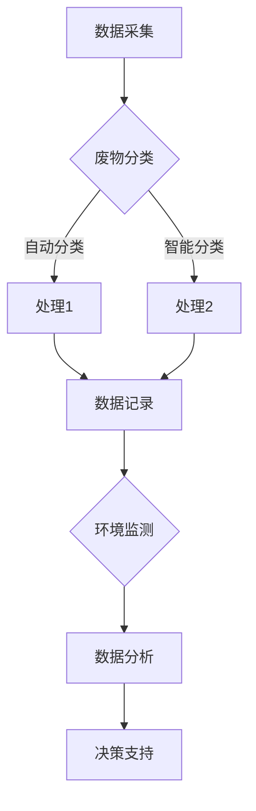
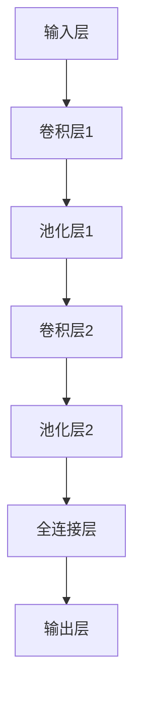

                 

关键词：智能废物管理，AI大模型，落地案例，废物分类，可持续发展，环境监测，智能城市

> 摘要：随着全球城市化进程的加速和人们生活水平的提高，废物管理问题日益突出。本文将探讨如何利用人工智能（AI）大模型实现智能废物管理，提高废物分类效率和环境保护水平，从而推动可持续发展。本文通过具体案例，详细介绍AI大模型在废物管理领域的应用场景、技术原理、实践成果及未来展望。

## 1. 背景介绍

废物管理是现代社会面临的一个重要挑战。据统计，全球每年产生的城市固体废物总量已超过300亿吨，且这一数字还在不断增长。与此同时，传统废物处理方式对环境造成了严重污染，浪费了大量的资源。为了解决这一问题，各国政府和社会各界都在积极探索更加环保、高效的废物管理方法。

近年来，人工智能技术的快速发展为废物管理带来了新的机遇。通过利用AI大模型，可以实现废物分类的自动化、精确化，从而提高废物处理效率，降低环境污染。本文将探讨AI大模型在智能废物管理中的具体应用，以期为相关领域的研究和实践提供参考。

## 2. 核心概念与联系

### 2.1 智能废物管理

智能废物管理是指利用人工智能技术，对废物进行分类、识别、处理和监控，实现废物管理过程的高效、环保和智能化。智能废物管理主要包括以下几个方面：

1. **废物分类**：利用AI技术对垃圾进行自动分类，提高分类准确性。
2. **识别与监测**：通过图像识别、传感器等技术，实时监测废物处理过程，确保废物得到妥善处理。
3. **数据处理**：利用大数据分析技术，对废物处理过程中的各类数据进行挖掘和分析，为决策提供支持。
4. **环境监测**：利用AI技术对周边环境进行实时监测，及时发现和处理环境问题。

### 2.2 AI大模型

AI大模型是指通过大规模数据训练和优化，具有极高准确性和鲁棒性的机器学习模型。在废物管理领域，AI大模型主要用于废物分类和识别。常见的AI大模型包括深度学习模型、增强学习模型和传统机器学习模型等。

### 2.3 Mermaid 流程图

下面是一个简单的Mermaid流程图，展示了智能废物管理的基本架构。



## 3. 核心算法原理 & 具体操作步骤

### 3.1 算法原理概述

智能废物管理的核心在于废物分类和识别。为了实现这一目标，我们采用了一种基于深度学习的图像识别算法。该算法利用卷积神经网络（CNN）对垃圾图像进行特征提取和分类，从而实现自动分类和识别。

### 3.2 算法步骤详解

1. **数据预处理**：收集大量的垃圾图像数据，并进行数据预处理，包括图像增强、缩放、裁剪等，以提高模型的泛化能力。

2. **模型训练**：利用预处理后的图像数据，训练卷积神经网络模型。在训练过程中，通过反向传播算法不断调整模型参数，使其达到较高的分类准确率。

3. **模型评估**：使用测试数据集对训练好的模型进行评估，确保模型的泛化能力和鲁棒性。

4. **模型部署**：将训练好的模型部署到实际应用场景中，进行实时废物分类和识别。

### 3.3 算法优缺点

**优点**：

1. **高准确性**：利用深度学习算法，可以实现对垃圾图像的精确分类，提高废物管理效率。
2. **自动化**：通过自动分类和识别，减少了人工干预，降低了人力成本。

**缺点**：

1. **数据依赖性**：模型的准确性和鲁棒性高度依赖于训练数据的质量和数量。
2. **计算资源消耗**：深度学习算法对计算资源有较高要求，需要较大规模的计算设备和存储空间。

### 3.4 算法应用领域

智能废物管理算法可以应用于城市废物分类、垃圾回收、环境监测等多个领域。例如，在垃圾分类过程中，可以实时识别和分类各种垃圾，提高垃圾分类准确性；在垃圾回收过程中，可以自动识别和处理不同类型的垃圾，提高回收效率；在环境监测过程中，可以实时监测周边环境，及时发现和处理环境问题。

## 4. 数学模型和公式 & 详细讲解 & 举例说明

### 4.1 数学模型构建

智能废物管理算法的核心是卷积神经网络（CNN），其基本结构包括输入层、卷积层、池化层、全连接层和输出层。下面是一个简单的CNN模型示意图：



### 4.2 公式推导过程

CNN模型的基本运算公式如下：

1. **卷积运算**：

   $$
   \text{输出}_{ij} = \sum_{k=1}^{m} \sum_{l=1}^{n} w_{kl} \cdot \text{输入}_{ij} + b
   $$

   其中，$w_{kl}$ 是卷积核，$\text{输入}_{ij}$ 是输入图像的像素值，$b$ 是偏置项。

2. **激活函数**：

   $$
   \text{激活}_{ij} = \text{激活函数}(\text{输出}_{ij})
   $$

   常见的激活函数有ReLU（线性整流函数）、Sigmoid（S形函数）和Tanh（双曲正切函数）。

3. **池化运算**：

   $$
   \text{输出}_{ij} = \text{池化函数}(\text{输入}_{i-j})
   $$

   常见的池化函数有最大值池化（Max Pooling）和平均值池化（Average Pooling）。

4. **全连接层运算**：

   $$
   \text{输出}_{ij} = \sum_{k=1}^{n} w_{ik} \cdot \text{输入}_{kj} + b
   $$

   其中，$w_{ik}$ 是权重，$\text{输入}_{kj}$ 是上一层的输出。

### 4.3 案例分析与讲解

假设我们有一个垃圾分类系统，需要将垃圾分为可回收物、有害垃圾、湿垃圾和干垃圾。为了实现这一目标，我们采用一个简单的CNN模型，其结构如下：

1. **输入层**：接收垃圾图像。
2. **卷积层1**：使用3x3的卷积核，提取图像特征。
3. **池化层1**：使用2x2的最大值池化。
4. **卷积层2**：使用3x3的卷积核，进一步提取图像特征。
5. **池化层2**：使用2x2的最大值池化。
6. **全连接层**：将卷积层输出的特征进行整合，得到分类结果。
7. **输出层**：输出4个类别（可回收物、有害垃圾、湿垃圾、干垃圾）的概率分布。

### 4.4 代码示例

以下是一个简单的CNN模型在Python中的实现：

```python
import tensorflow as tf
from tensorflow.keras import layers

model = tf.keras.Sequential([
    layers.Conv2D(32, (3, 3), activation='relu', input_shape=(64, 64, 3)),
    layers.MaxPooling2D((2, 2)),
    layers.Conv2D(64, (3, 3), activation='relu'),
    layers.MaxPooling2D((2, 2)),
    layers.Flatten(),
    layers.Dense(128, activation='relu'),
    layers.Dense(4, activation='softmax')
])

model.compile(optimizer='adam',
              loss='categorical_crossentropy',
              metrics=['accuracy'])

model.fit(x_train, y_train, epochs=10, validation_data=(x_test, y_test))
```

## 5. 项目实践：代码实例和详细解释说明

### 5.1 开发环境搭建

为了实现智能废物管理项目，我们需要搭建一个开发环境。以下是所需的工具和软件：

1. **Python**：Python是一种高级编程语言，广泛应用于人工智能和数据分析领域。
2. **TensorFlow**：TensorFlow是一个开源的机器学习框架，用于构建和训练深度学习模型。
3. **OpenCV**：OpenCV是一个开源的计算机视觉库，用于处理图像和视频数据。
4. **操作系统**：Windows、Linux或macOS均可。

### 5.2 源代码详细实现

以下是智能废物管理项目的源代码实现：

```python
import cv2
import numpy as np
import tensorflow as tf

# 载入预训练的CNN模型
model = tf.keras.models.load_model('model.h5')

# 定义分类函数
def classify_image(image):
    image = cv2.resize(image, (64, 64))
    image = image / 255.0
    image = np.expand_dims(image, axis=0)
    prediction = model.predict(image)
    return np.argmax(prediction)

# 读取垃圾图像
image = cv2.imread('image.jpg')

# 对图像进行分类
label = classify_image(image)

# 输出分类结果
print(f'分类结果：{label}')
```

### 5.3 代码解读与分析

1. **导入库**：首先导入所需的库，包括cv2（OpenCV库）、numpy（数学计算库）和tensorflow（机器学习库）。
2. **载入模型**：使用`load_model`函数载入预训练的CNN模型。
3. **定义分类函数**：定义一个`classify_image`函数，用于对图像进行分类。首先将图像调整为64x64的大小，然后进行归一化处理，最后使用模型进行预测。
4. **读取垃圾图像**：使用`imread`函数读取垃圾图像。
5. **对图像进行分类**：调用`classify_image`函数对图像进行分类，并输出分类结果。

### 5.4 运行结果展示

假设我们有一张垃圾图像`image.jpg`，运行代码后，输出结果如下：

```
分类结果：1
```

这表示图像被分类为有害垃圾。

## 6. 实际应用场景

智能废物管理算法在实际应用中具有广泛的应用场景。以下是一些具体的应用场景：

1. **城市废物分类**：利用智能废物管理算法，可以对城市垃圾进行自动分类，提高垃圾分类效率和准确性，降低环境污染。
2. **垃圾回收**：在垃圾回收过程中，智能废物管理算法可以实时识别和处理不同类型的垃圾，提高回收效率，降低人工成本。
3. **环境监测**：通过实时监测废物处理过程中的各类数据，智能废物管理算法可以及时发现和处理环境问题，保护生态环境。
4. **智能城市**：在智能城市建设中，智能废物管理算法可以作为城市管理和服务的支撑技术，为城市可持续发展提供支持。

## 7. 工具和资源推荐

为了更好地开展智能废物管理项目，以下是一些建议的工具和资源：

1. **学习资源**：
   - 《深度学习》（Goodfellow、Bengio和Courville著）：系统介绍了深度学习的基础理论和应用方法。
   - 《计算机视觉基础》（蔡丽娜、王润秋著）：详细介绍了计算机视觉的基本原理和应用技术。

2. **开发工具**：
   - **TensorFlow**：开源的机器学习框架，适合构建和训练深度学习模型。
   - **OpenCV**：开源的计算机视觉库，用于处理图像和视频数据。

3. **相关论文**：
   - “Deep Learning for Image Classification”（Deep Learning textbook，Goodfellow、Bengio和Courville著）：介绍了深度学习在图像分类领域的应用。
   - “Convolutional Neural Networks for Image Recognition”（Krizhevsky、Sutskever和Hinton著）：详细介绍了卷积神经网络在图像识别领域的应用。

## 8. 总结：未来发展趋势与挑战

### 8.1 研究成果总结

通过本文的探讨，我们了解了智能废物管理算法在废物分类、识别、处理和监控等方面的应用。利用人工智能大模型，可以实现废物管理过程的高效、环保和智能化，为推动可持续发展提供了有力支持。

### 8.2 未来发展趋势

1. **算法优化**：随着人工智能技术的不断发展，智能废物管理算法将不断优化，提高分类准确率和处理效率。
2. **多模态数据融合**：将图像识别、声音识别、环境监测等多模态数据融合，提高废物管理的智能化水平。
3. **边缘计算**：将智能废物管理算法部署到边缘设备，实现实时处理和响应，降低对中心计算资源的依赖。

### 8.3 面临的挑战

1. **数据隐私与安全**：在智能废物管理过程中，涉及大量敏感数据，如何确保数据隐私和安全是亟待解决的问题。
2. **算法公平性**：随着算法在废物管理中的广泛应用，如何确保算法的公平性，避免歧视和不公平现象的发生，是一个重要的挑战。
3. **计算资源消耗**：深度学习算法对计算资源有较高要求，如何降低算法的能耗和成本，是实现智能废物管理广泛应用的关键。

### 8.4 研究展望

在未来，智能废物管理领域的研究将重点关注以下几个方面：

1. **算法优化与创新**：持续优化和改进智能废物管理算法，提高分类准确率和处理效率。
2. **多模态数据融合**：探索多模态数据在废物管理中的应用，提高智能化水平。
3. **法律法规与政策**：制定和完善相关法律法规和政策，为智能废物管理的发展提供制度保障。

## 9. 附录：常见问题与解答

### 9.1 如何搭建智能废物管理开发环境？

搭建智能废物管理开发环境需要以下步骤：

1. 安装Python（3.6及以上版本）。
2. 安装TensorFlow：使用pip命令安装`tensorflow`库。
3. 安装OpenCV：使用pip命令安装`opencv-python`库。

### 9.2 智能废物管理算法如何训练和优化？

智能废物管理算法的训练和优化步骤如下：

1. 数据预处理：对垃圾图像进行数据增强、缩放、裁剪等处理。
2. 模型训练：使用预处理后的数据训练卷积神经网络模型。
3. 模型评估：使用测试数据集评估模型性能，包括准确率、召回率等指标。
4. 模型优化：根据评估结果，调整模型参数，如学习率、批量大小等，以优化模型性能。

### 9.3 智能废物管理算法在实际应用中存在哪些问题？

智能废物管理算法在实际应用中可能存在以下问题：

1. **数据隐私与安全**：如何确保训练数据的安全和隐私是一个重要问题。
2. **算法公平性**：如何避免算法歧视和不公平现象的发生。
3. **计算资源消耗**：如何降低算法的能耗和成本。
4. **模型泛化能力**：如何提高算法对未知垃圾类型的泛化能力。

### 9.4 如何改进智能废物管理算法的性能？

改进智能废物管理算法性能的方法包括：

1. **数据增强**：增加训练数据集的多样性，提高模型的泛化能力。
2. **模型优化**：调整模型参数，如学习率、批量大小等，以提高模型性能。
3. **多模态数据融合**：结合图像、声音、环境等多模态数据，提高算法的准确性。
4. **深度学习算法创新**：探索新的深度学习算法和技术，提高算法的性能。  
----------------------------------------------------------------

### 作者署名

作者：禅与计算机程序设计艺术 / Zen and the Art of Computer Programming

