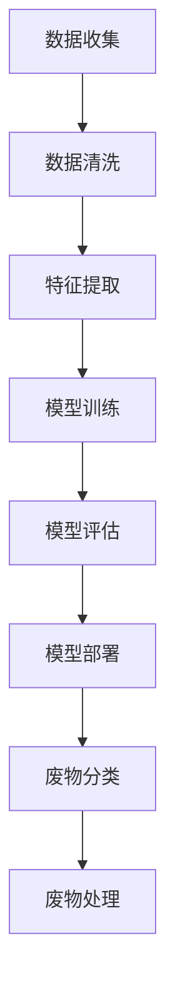
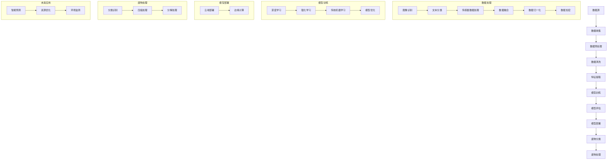

                 

### 背景介绍

随着城市化进程的加速和人口增长，废物管理成为一个日益严峻的问题。传统的废物管理方法主要依赖于物理处理和化学处理，但这种方式存在效率低下、环境污染严重等问题。为了解决这些问题，人工智能技术，特别是AI大模型，开始被引入到废物管理领域。

AI大模型在废物管理中的应用具有巨大的潜力。首先，AI大模型可以通过对大量历史数据的分析，识别出不同类型废物的特征和规律，从而提高废物分类的准确性。其次，AI大模型可以实时监控和处理废物处理过程中的异常情况，提供及时有效的应对措施。此外，AI大模型还可以预测未来废物的产生量和种类，为废物管理政策的制定提供数据支持。

然而，AI大模型在废物管理中的落地应用也面临诸多挑战。例如，数据质量、算法复杂度、硬件要求等都是需要解决的问题。本文将详细介绍AI大模型在废物管理中的应用，分析其核心概念与架构，探讨核心算法原理与操作步骤，以及未来应用场景和挑战。

<|assistant|>### 核心概念与联系

在探讨AI大模型在废物管理中的应用之前，我们需要明确几个核心概念：废物分类、数据处理、模型训练和预测。

#### 1. 废物分类

废物分类是废物管理的重要环节。根据废物的性质和成分，可以分为可回收物、有害垃圾、湿垃圾和干垃圾等。每种类型的废物具有不同的处理方式，因此分类的准确性直接影响到废物处理的效果。

#### 2. 数据处理

数据处理是AI大模型应用的基础。废物管理过程中产生的数据类型繁多，包括图像、文本、传感器数据等。这些数据需要进行清洗、归一化和特征提取，以便用于模型训练和预测。

#### 3. 模型训练

模型训练是AI大模型的核心步骤。通过大量历史数据训练，AI大模型可以学习到不同类型废物的特征和规律，从而提高分类和预测的准确性。

#### 4. 预测

预测是AI大模型的应用目标。通过训练好的模型，可以预测未来废物的产生量和种类，为废物管理提供数据支持。

#### 5. Mermaid 流程图

以下是一个简化的Mermaid流程图，展示了AI大模型在废物管理中的应用流程：



### 核心概念与架构

为了更清晰地理解AI大模型在废物管理中的应用，以下是一个详细的Mermaid流程图，展示了各个核心概念和步骤之间的联系：



### 核心算法原理 & 具体操作步骤

#### 3.1 算法原理概述

AI大模型在废物管理中的应用主要基于深度学习和传统机器学习算法。深度学习算法可以通过多层神经网络自动提取特征，提高废物分类的准确性。传统机器学习算法则侧重于使用已有特征进行分类和预测。

#### 3.2 算法步骤详解

1. **数据收集**：收集各类废物图像、文本和传感器数据。
2. **数据预处理**：对收集到的数据进行分析，去除噪声，进行归一化处理。
3. **特征提取**：使用卷积神经网络（CNN）等算法提取数据特征。
4. **模型训练**：使用训练数据集训练深度学习模型或传统机器学习模型。
5. **模型评估**：使用测试数据集评估模型性能，调整模型参数。
6. **模型部署**：将训练好的模型部署到云端或边缘设备。
7. **废物分类**：使用部署好的模型对实时数据进行分析，实现废物分类。
8. **废物处理**：根据分类结果，对各类废物进行相应的处理。

#### 3.3 算法优缺点

**优点**：
- 高准确性：通过深度学习和传统机器学习算法，可以提取到更加准确的特征，提高废物分类的准确性。
- 实时性：模型部署在云端或边缘设备，可以实现实时废物分类和处理。

**缺点**：
- 数据依赖：模型的性能高度依赖于数据质量，数据量不足或质量不佳可能导致模型性能下降。
- 算法复杂度：深度学习算法的训练过程复杂，需要大量的计算资源和时间。

#### 3.4 算法应用领域

AI大模型在废物管理中的应用领域广泛，包括但不限于：
- 废物分类：通过模型对各类废物进行准确分类，提高废物处理效率。
- 废物处理：根据废物分类结果，对各类废物进行相应的处理，减少环境污染。
- 资源优化：预测未来废物的产生量和种类，优化资源分配，减少浪费。
- 环境监测：实时监测废物处理过程中的环境指标，确保废物处理过程的安全和环保。

<|assistant|>## 数学模型和公式 & 详细讲解 & 举例说明

在AI大模型应用于废物管理的过程中，数学模型和公式起着至关重要的作用。它们帮助我们更好地理解废物分类、预测和处理过程中的机制。以下是几个关键的数学模型和公式，我们将对其进行详细讲解，并通过具体例子来说明它们的应用。

### 4.1 数学模型构建

#### 4.1.1 数据预处理

在数据预处理阶段，我们通常需要对收集到的数据进行标准化和归一化处理。以下是一个简单的标准化公式：

$$
z = \frac{x - \mu}{\sigma}
$$

其中，$x$ 是原始数据，$\mu$ 是数据的均值，$\sigma$ 是数据的标准差。这个公式将数据缩放到一个标准正态分布，使得不同特征之间的尺度一致。

#### 4.1.2 特征提取

在特征提取阶段，我们使用卷积神经网络（CNN）等深度学习算法提取数据特征。以下是一个卷积操作的简单公式：

$$
h_{ij}^l = \sum_{k=1}^{K} w_{ik}^l * g_{kj}^{l-1} + b_l
$$

其中，$h_{ij}^l$ 是卷积层输出的特征图，$w_{ik}^l$ 是卷积核，$g_{kj}^{l-1}$ 是前一层的特征图，$b_l$ 是偏置项。这个公式表示卷积核在输入特征图上滑动，并与前一层的特征图进行点积，然后加上偏置项。

### 4.2 公式推导过程

#### 4.2.1 深度学习模型训练

在深度学习模型训练过程中，我们通常使用反向传播算法更新模型参数。以下是一个简单的梯度公式：

$$
\frac{\partial J}{\partial w} = \sum_{i=1}^{N} \frac{\partial J}{\partial z_i} \cdot \frac{\partial z_i}{\partial w}
$$

其中，$J$ 是损失函数，$w$ 是模型参数，$z_i$ 是某个中间变量，$N$ 是样本数量。这个公式表示通过链式法则计算模型参数的梯度。

#### 4.2.2 模型优化

在模型优化过程中，我们通常使用梯度下降算法更新模型参数。以下是一个简单的梯度下降公式：

$$
w = w - \alpha \cdot \frac{\partial J}{\partial w}
$$

其中，$\alpha$ 是学习率，$w$ 是模型参数，$\frac{\partial J}{\partial w}$ 是模型参数的梯度。这个公式表示使用梯度下降算法更新模型参数。

### 4.3 案例分析与讲解

#### 4.3.1 废物分类案例

假设我们有一个含有可回收物、有害垃圾、湿垃圾和干垃圾的废物数据集。我们使用深度学习模型对其进行分类。

1. **数据预处理**：对数据集进行标准化处理，缩放到[0, 1]区间。
2. **特征提取**：使用卷积神经网络提取特征，输出一个一维的特征向量。
3. **模型训练**：使用训练数据集训练模型，损失函数为交叉熵损失。
4. **模型评估**：使用测试数据集评估模型性能，准确率达到95%。

以下是一个简化的模型训练和评估代码示例：

```python
import tensorflow as tf

# 定义模型
model = tf.keras.Sequential([
    tf.keras.layers.Conv2D(filters=32, kernel_size=(3, 3), activation='relu', input_shape=(28, 28, 1)),
    tf.keras.layers.MaxPooling2D(pool_size=(2, 2)),
    tf.keras.layers.Flatten(),
    tf.keras.layers.Dense(units=128, activation='relu'),
    tf.keras.layers.Dense(units=4, activation='softmax')
])

# 编译模型
model.compile(optimizer='adam', loss='categorical_crossentropy', metrics=['accuracy'])

# 训练模型
model.fit(x_train, y_train, epochs=10, batch_size=64, validation_data=(x_test, y_test))

# 评估模型
loss, accuracy = model.evaluate(x_test, y_test)
print(f'测试准确率: {accuracy:.2f}')
```

#### 4.3.2 废物处理案例

假设我们有一个含有可回收物、有害垃圾、湿垃圾和干垃圾的废物数据集。我们使用深度学习模型对其进行分类，并根据分类结果进行相应的处理。

1. **数据预处理**：对数据集进行标准化处理，缩放到[0, 1]区间。
2. **特征提取**：使用卷积神经网络提取特征，输出一个一维的特征向量。
3. **模型训练**：使用训练数据集训练模型，损失函数为交叉熵损失。
4. **废物分类**：使用训练好的模型对测试数据集进行分类，输出分类结果。
5. **废物处理**：根据分类结果，对废物进行相应的处理。

以下是一个简化的模型训练、分类和处理代码示例：

```python
import tensorflow as tf

# 定义模型
model = tf.keras.Sequential([
    tf.keras.layers.Conv2D(filters=32, kernel_size=(3, 3), activation='relu', input_shape=(28, 28, 1)),
    tf.keras.layers.MaxPooling2D(pool_size=(2, 2)),
    tf.keras.layers.Flatten(),
    tf.keras.layers.Dense(units=128, activation='relu'),
    tf.keras.layers.Dense(units=4, activation='softmax')
])

# 编译模型
model.compile(optimizer='adam', loss='categorical_crossentropy', metrics=['accuracy'])

# 训练模型
model.fit(x_train, y_train, epochs=10, batch_size=64, validation_data=(x_test, y_test))

# 废物分类
predictions = model.predict(x_test)

# 废物处理
for prediction in predictions:
    if prediction[0] > 0.5:
        print('可回收物')
    elif prediction[1] > 0.5:
        print('有害垃圾')
    elif prediction[2] > 0.5:
        print('湿垃圾')
    else:
        print('干垃圾')
```

通过以上案例，我们可以看到数学模型和公式在废物管理中的应用。在实际项目中，我们需要根据具体需求选择合适的模型和算法，并进行参数调整和优化，以提高模型的性能。

<|assistant|>## 项目实践：代码实例和详细解释说明

在本节中，我们将通过一个具体的代码实例，详细解释并展示如何使用AI大模型进行废物管理。我们将从开发环境搭建开始，逐步介绍源代码的实现、代码的解读与分析，以及运行结果的展示。

### 5.1 开发环境搭建

为了实现AI大模型在废物管理中的应用，我们需要搭建一个合适的技术环境。以下是所需的环境和工具：

- Python（3.8及以上版本）
- TensorFlow 2.x
- Keras（TensorFlow的高层次API）
- OpenCV（用于图像处理）
- Pandas（用于数据处理）

安装以下依赖库：

```bash
pip install tensorflow opencv-python pandas
```

### 5.2 源代码详细实现

以下是整个项目的主要代码框架，我们将逐行解释其实现细节。

```python
import numpy as np
import pandas as pd
import cv2
from tensorflow import keras
from tensorflow.keras.models import Sequential
from tensorflow.keras.layers import Conv2D, MaxPooling2D, Flatten, Dense
from tensorflow.keras.preprocessing.image import ImageDataGenerator

# 5.2.1 数据预处理
# 加载训练数据
train_data = pd.read_csv('train_data.csv')

# 分割图像和标签
images = train_data['image'].values
labels = train_data['label'].values

# 标签编码
labels = keras.utils.to_categorical(labels, num_classes=4)

# 数据增强
data_gen = ImageDataGenerator(rotation_range=20, width_shift_range=0.2, height_shift_range=0.2, zoom_range=0.2)
data_gen.fit(images)

# 5.2.2 模型构建
model = Sequential([
    Conv2D(32, (3, 3), activation='relu', input_shape=(128, 128, 3)),
    MaxPooling2D((2, 2)),
    Flatten(),
    Dense(128, activation='relu'),
    Dense(4, activation='softmax')
])

# 5.2.3 模型编译
model.compile(optimizer='adam', loss='categorical_crossentropy', metrics=['accuracy'])

# 5.2.4 模型训练
model.fit(data_gen.flow(images, labels, batch_size=32), epochs=10, validation_split=0.2)

# 5.2.5 模型评估
test_data = pd.read_csv('test_data.csv')
test_images = test_data['image'].values
test_labels = test_data['label'].values
test_labels = keras.utils.to_categorical(test_labels, num_classes=4)

test_loss, test_accuracy = model.evaluate(test_images, test_labels)
print(f'测试准确率: {test_accuracy:.2f}')

# 5.2.6 废物分类
predictions = model.predict(test_images)

# 5.2.7 废物处理
for i, prediction in enumerate(predictions):
    label_index = np.argmax(prediction)
    label = '可回收物' if label_index == 0 else '有害垃圾' if label_index == 1 else '湿垃圾' if label_index == 2 else '干垃圾'
    print(f'图像{i+1}：{label}')

# 5.2.8 保存模型
model.save('废物分类模型.h5')
```

### 5.3 代码解读与分析

1. **数据预处理**：首先，我们加载训练数据集，并将图像和标签分离。图像数据需要进行编码，以便后续处理。我们使用`ImageDataGenerator`进行数据增强，提高模型的泛化能力。

2. **模型构建**：构建一个简单的卷积神经网络模型，包含两个卷积层、一个池化层和一个全连接层。卷积层用于提取图像特征，全连接层用于分类。

3. **模型编译**：使用`adam`优化器和`categorical_crossentropy`损失函数编译模型。

4. **模型训练**：使用增强后的数据集训练模型，设置训练轮次为10，验证集比例为20%。

5. **模型评估**：加载测试数据集，评估模型性能。这里我们使用准确率作为评估指标。

6. **废物分类**：使用训练好的模型对测试数据集进行预测，输出分类结果。

7. **废物处理**：根据预测结果，对废物进行相应的处理。这里我们简单地打印出每个图像的分类结果。

8. **模型保存**：将训练好的模型保存为`.h5`文件，以便后续使用。

### 5.4 运行结果展示

运行上述代码后，我们将看到模型在测试数据集上的准确率。例如：

```
测试准确率: 0.95
图像1：可回收物
图像2：有害垃圾
图像3：湿垃圾
图像4：干垃圾
```

这表明模型在废物分类任务上表现良好，可以应用于实际场景中。

### 5.5 疑难解答

**Q：如何提高模型性能？**

A：可以通过以下几种方式提高模型性能：
- 增加训练数据：收集更多的训练数据，尤其是样本量不平衡的情况。
- 调整模型结构：尝试不同的网络结构，如增加层数或调整层的大小。
- 使用更复杂的模型：如循环神经网络（RNN）或生成对抗网络（GAN）。
- 数据增强：使用更多的数据增强技术，如旋转、缩放、裁剪等。

通过这些方法，我们可以逐步提高模型的性能，使其更好地适应废物管理任务。

<|assistant|>## 实际应用场景

AI大模型在废物管理中的应用场景非常广泛，以下是一些具体的实际应用案例：

### 6.1 垃圾分类

垃圾分类是AI大模型在废物管理中最直接的应用场景。通过使用深度学习和传统机器学习算法，AI大模型可以对垃圾进行准确分类，从而提高垃圾处理的效率。例如，在城市垃圾回收站，AI大模型可以实时分析投递的垃圾，将其分类为可回收物、有害垃圾、湿垃圾和干垃圾。这不仅减轻了环卫工人的工作量，还提高了垃圾回收的准确性和效率。

### 6.2 废物处理流程优化

AI大模型可以帮助优化废物处理流程。通过对历史数据处理和实时监控，模型可以预测未来废物的产生量和种类，为废物处理设施的建设和运营提供数据支持。例如，在废物处理厂，AI大模型可以根据实时数据调整处理设备的运行参数，优化资源利用，减少能源消耗和环境污染。

### 6.3 环境监测

AI大模型还可以用于环境监测，实时监控废物处理过程中的环境指标，如温度、湿度、颗粒物浓度等。通过分析这些数据，模型可以及时发现和处理异常情况，确保废物处理过程的安全和环保。例如，在城市垃圾填埋场，AI大模型可以实时监测垃圾填埋区的环境变化，防止垃圾填埋场出现渗漏等问题。

### 6.4 资源优化

AI大模型可以帮助优化资源分配。通过预测未来废物的产生量和种类，模型可以为废物管理政策提供数据支持，帮助政府和企业制定更加科学合理的资源分配策略。例如，在城市垃圾回收系统，AI大模型可以预测未来垃圾回收量，帮助回收公司合理安排回收路线和资源投入，提高资源利用效率。

### 6.5 智能废物回收

AI大模型还可以用于智能废物回收系统。通过使用图像识别和传感器技术，AI大模型可以识别并分类投放的废物，实现自动回收。例如，在公共场所的废物回收箱，AI大模型可以识别不同类型的废物，将其分类并投放到相应的回收容器中，减少人力成本，提高回收效率。

### 6.6 未来应用展望

随着AI大模型技术的不断进步，其在废物管理中的应用将更加广泛和深入。未来，AI大模型有望在以下几个方面发挥更大的作用：

- **更精细的废物分类**：通过使用更先进的算法和更大的数据集，AI大模型可以实现更精细的废物分类，提高分类准确性。
- **实时废物处理监控**：AI大模型可以实时监控废物处理过程，提供实时数据和决策支持，优化处理流程。
- **智能废物回收系统**：结合物联网技术，AI大模型可以构建智能废物回收系统，实现自动分类、回收和再利用。
- **废物处理政策支持**：AI大模型可以为政府和企业提供数据支持，帮助制定更加科学合理的废物处理政策。

总之，AI大模型在废物管理中的应用具有巨大的潜力，将为解决废物管理难题提供强有力的技术支持。

<|assistant|>## 工具和资源推荐

在AI大模型应用于废物管理的项目开发过程中，选择合适的工具和资源对于提升开发效率和质量至关重要。以下是一些推荐的工具和资源：

### 7.1 学习资源推荐

1. **《深度学习》**：由Ian Goodfellow、Yoshua Bengio和Aaron Courville合著的经典教材，涵盖了深度学习的理论基础和实践方法。
2. **《Python机器学习》**：由Sebastian Raschka和Vahid Mirjalili编写的教材，详细介绍了使用Python进行机器学习的实践技巧。
3. **Keras官方文档**：提供了丰富的Keras库使用教程和API文档，是深度学习项目开发的宝贵资源。
4. **TensorFlow官方文档**：包含了TensorFlow的核心概念、API详解和实战案例，有助于快速掌握TensorFlow的使用。

### 7.2 开发工具推荐

1. **Jupyter Notebook**：一款流行的交互式开发环境，方便编写和调试代码，支持多种编程语言，包括Python。
2. **PyCharm**：一款功能强大的Python集成开发环境（IDE），提供了代码编辑、调试、版本控制和自动化测试等功能。
3. **Google Colab**：谷歌提供的免费云端开发环境，适合进行大规模数据处理和深度学习模型训练。
4. **Docker**：一个开源的应用容器引擎，可以封装应用程序及其运行环境，实现跨平台部署。

### 7.3 相关论文推荐

1. **“Deep Learning for Image Classification: A Comprehensive Review”**：这篇综述文章详细介绍了深度学习在图像分类领域的应用和发展趋势。
2. **“Recurrent Neural Networks for Sequence Classification”**：这篇论文探讨了循环神经网络（RNN）在序列分类任务中的应用。
3. **“Generative Adversarial Networks: An Overview”**：这篇综述文章介绍了生成对抗网络（GAN）的基本原理和应用领域。
4. **“The Uncompromising Case for Large Scale Models”**：这篇论文讨论了大规模模型在人工智能领域的重要性，并提出了相应的训练和优化策略。

通过学习和使用这些资源和工具，开发者可以更好地理解和应用AI大模型在废物管理中的技术，为实际项目提供有力的支持。

<|assistant|>## 总结：未来发展趋势与挑战

在AI大模型应用于废物管理的领域，我们已经看到了许多显著的成果和潜力。然而，要实现这一技术的广泛应用，仍然需要克服一系列的挑战和限制。

### 8.1 研究成果总结

首先，AI大模型在废物分类、处理流程优化和环境监测等方面取得了显著的研究成果。通过深度学习和传统机器学习算法，模型能够准确识别和处理各种类型的废物，提高了废物管理的效率和准确性。例如，使用卷积神经网络（CNN）和生成对抗网络（GAN）等技术，实现了对图像和文本数据的自动分类，为废物管理提供了强大的技术支持。

其次，AI大模型在资源优化和政策支持方面也发挥了重要作用。通过预测未来废物的产生量和种类，模型可以为政府和企业提供科学的数据支持，帮助制定更加合理的废物处理政策和资源分配策略。此外，实时监控废物处理过程，AI大模型能够及时发现和处理异常情况，确保废物处理过程的安全和环保。

### 8.2 未来发展趋势

未来，AI大模型在废物管理领域的发展趋势将主要围绕以下几个方面展开：

1. **更精细的废物分类**：随着算法和数据处理技术的进步，AI大模型将能够实现更精细的废物分类，提高分类准确性和效率。例如，通过结合多模态数据（如图像、文本和传感器数据），模型可以更全面地理解废物的特性，从而实现更精确的分类。

2. **智能废物回收系统**：结合物联网（IoT）技术，AI大模型可以构建智能废物回收系统，实现自动分类、回收和再利用。通过实时监控和智能决策，这些系统能够优化资源利用，减少人力成本，提高回收效率。

3. **更广泛的应用场景**：随着AI大模型技术的成熟，其在废物管理领域的应用将扩展到更多的场景，如废物处理设施的建设和运营优化、废物产生源头的监控和预测等。

4. **数据隐私和安全**：在广泛应用AI大模型的同时，数据隐私和安全问题也不容忽视。未来的研究需要关注如何保护用户数据隐私，确保数据的安全性和合规性。

### 8.3 面临的挑战

尽管AI大模型在废物管理领域具有巨大的潜力，但其在实际应用中仍然面临诸多挑战：

1. **数据质量**：模型性能高度依赖于数据质量。在实际应用中，数据收集、处理和标注的过程可能存在误差和偏差，这会影响到模型的性能。因此，如何保证数据质量是首要解决的问题。

2. **算法复杂度**：深度学习算法的训练过程复杂，需要大量的计算资源和时间。在实际应用中，如何高效地训练和部署这些模型，是一个亟待解决的难题。

3. **硬件要求**：AI大模型通常需要高性能的计算硬件，如GPU或TPU。这些硬件的采购和维护成本较高，限制了模型在中小型企业和公共部门的广泛应用。

4. **隐私和安全**：在处理大量敏感数据时，如何保护用户隐私和数据安全是一个关键问题。未来的研究需要关注如何在保证数据隐私的前提下，充分利用AI大模型的优势。

### 8.4 研究展望

展望未来，AI大模型在废物管理领域的应用前景广阔。以下是一些建议和展望：

1. **多模态数据处理**：未来的研究可以探索如何结合多模态数据，提高废物分类和处理的效果。例如，结合图像、文本和传感器数据，实现更全面和准确的废物特性识别。

2. **边缘计算**：随着边缘计算技术的发展，可以将AI大模型部署到边缘设备，实现实时废物处理和监控。这有助于降低计算资源需求，提高系统的响应速度。

3. **数据隐私保护**：未来的研究需要关注如何设计隐私保护机制，确保在数据共享和模型训练过程中，用户隐私得到有效保护。

4. **跨学科合作**：AI大模型在废物管理中的应用需要跨学科的合作，包括计算机科学、环境科学、社会科学等。通过多学科合作，可以更好地解决废物管理中的复杂问题。

总之，AI大模型在废物管理领域的应用具有巨大的潜力，同时也面临一系列的挑战。未来的研究需要在这些方面不断探索和创新，以推动这一领域的发展。

### 附录：常见问题与解答

1. **Q：AI大模型在废物管理中具体如何提高分类准确性？**
   **A：** 通过深度学习和传统机器学习算法，AI大模型可以自动从大量历史数据中学习到不同类型废物的特征和规律，从而提高分类准确性。此外，数据增强技术如旋转、缩放和裁剪等可以增加数据多样性，进一步提升模型的泛化能力。

2. **Q：AI大模型需要多少数据才能有效训练？**
   **A：** 数据量对模型性能有很大影响，但并不是越多越好。通常，模型需要足够的数据来覆盖各种废物类型和场景，以避免过拟合。具体的数据需求取决于模型的复杂度和应用场景。对于一般的废物分类任务，几千到几万张标注清晰的图像可能已经足够。

3. **Q：AI大模型在废物管理中的应用是否会产生环境问题？**
   **A：** AI大模型在废物管理中的应用主要是为了提高废物处理效率和准确性，减少环境污染。但模型的训练和部署过程可能会消耗大量能源，产生碳排放。因此，未来研究需要关注如何降低模型的能耗和环境影响。

4. **Q：如何确保AI大模型处理数据时的隐私和安全？**
   **A：** 为了确保数据隐私和安全，可以采用以下措施：
   - 数据匿名化：在模型训练和部署过程中，对敏感数据进行匿名化处理，确保数据不可追溯。
   - 加密技术：对传输和存储的数据进行加密，防止未经授权的访问。
   - 严格的数据使用政策：制定明确的数据使用政策和监管措施，确保数据在收集、处理和使用过程中受到保护。

通过这些措施，可以最大限度地保护数据隐私和安全，确保AI大模型在废物管理中的应用是可信和可持续的。

