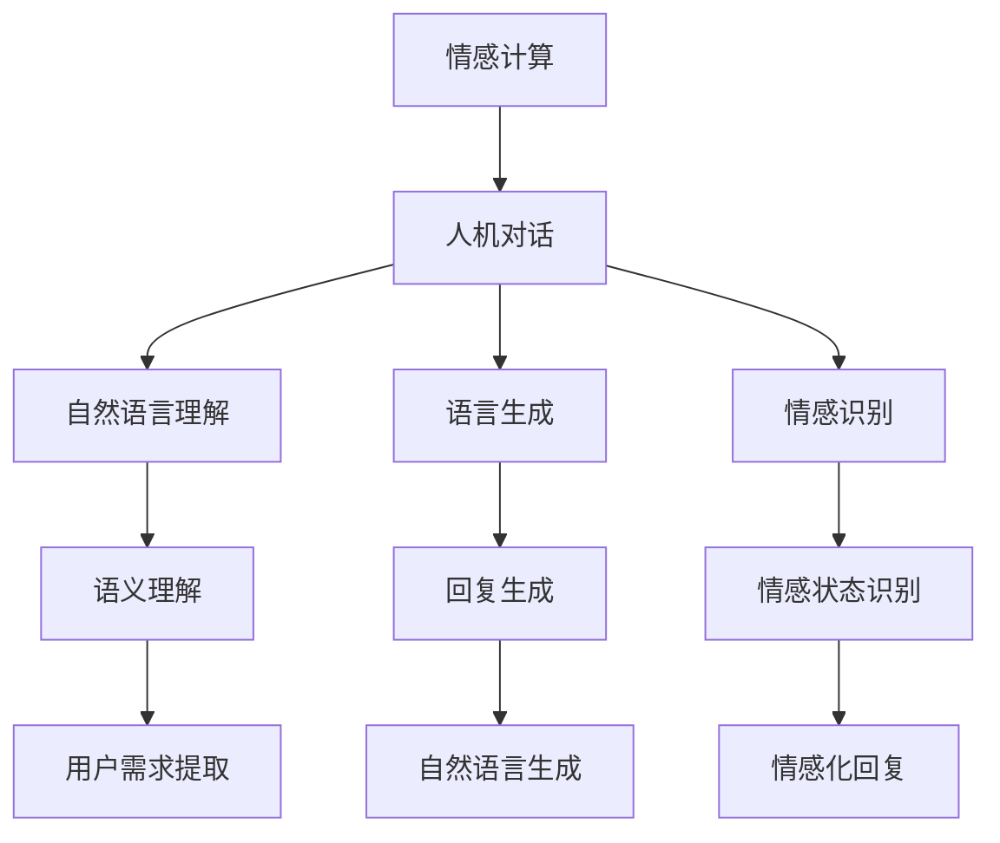

                 

关键词：智能情感计算、AI大模型、人机对话、自然语言处理、情感识别、个性化服务、交互体验

> 摘要：本文深入探讨了智能情感计算的概念及其在AI大模型中的重要性。通过分析自然语言处理的发展历程，本文阐述了情感识别技术的核心原理和最新进展。在此基础上，文章详细介绍了AI大模型在人机对话中的应用，探讨了如何通过情感计算优化人机交互体验，并展望了未来智能情感计算的发展趋势和挑战。

## 1. 背景介绍

随着人工智能技术的飞速发展，自然语言处理（NLP）已成为AI领域的一个重要分支。NLP的核心目标是让计算机能够理解、生成和处理人类语言，实现人机对话的智能化。然而，单纯的文字交互还不足以满足用户的需求，人们更期望在与计算机的交流中能够感受到情感共鸣。这种需求催生了智能情感计算（Sentient Emotional Computation）的概念，即利用人工智能技术捕捉、理解和模拟人类情感。

智能情感计算的核心在于情感识别（Emotion Recognition），它通过分析语言、语音、面部表情等数据，识别出用户在交流过程中的情感状态。随着深度学习和神经网络技术的进步，情感识别的准确率不断提高，为人机对话带来了更多的可能性和应用场景。

## 2. 核心概念与联系

### 2.1 情感计算的定义与作用

情感计算（Affective Computing）是智能情感计算的基础。它指的是计算机系统对人类情感的表达、识别和反应能力。情感计算的关键在于如何让计算机能够感知和理解人类的情感，从而实现更加自然和人性化的交互。

情感计算的作用主要体现在以下几个方面：

1. **提高交互体验**：通过识别用户的情感状态，系统可以调整交互策略，提供更加个性化和贴心的服务。
2. **优化用户体验**：情感计算可以帮助设计更加人性化的产品和服务，提升用户的满意度和忠诚度。
3. **辅助决策**：情感计算可以为商业、医疗、教育等领域提供情感数据分析，辅助决策制定。

### 2.2 AI大模型与人机对话

AI大模型（Large-scale AI Models）是指参数规模达到数十亿甚至千亿级的神经网络模型，如GPT、BERT等。这些模型具有强大的文本理解和生成能力，是人机对话系统的核心。

在人机对话中，AI大模型的作用主要包括：

1. **自然语言理解**：通过训练，模型能够理解用户的语言意图，提取关键信息，实现语义理解。
2. **语言生成**：模型可以根据用户的需求生成自然流畅的回复，实现人机对话。
3. **情感识别**：结合情感计算技术，模型可以识别用户的情感状态，生成相应的情感化回复。

### 2.3 情感计算与人机对话的联系

情感计算与人机对话的联系在于它们共同追求的目标——实现更加自然和人性化的交互。情感计算为人机对话提供了情感层面的支持，使得对话系统能够更好地理解用户的需求和情感状态，从而提供更加个性化和贴心的服务。

### 2.4 Mermaid流程图



## 3. 核心算法原理 & 具体操作步骤

### 3.1 算法原理概述

情感计算的算法原理主要基于深度学习和神经网络技术。通过大规模数据集的训练，模型可以自动学习情感特征，实现对情感状态的识别和分类。

情感计算的关键步骤包括：

1. **数据预处理**：对文本、语音、面部表情等数据进行预处理，提取情感特征。
2. **情感识别模型训练**：使用预处理的特征数据训练情感识别模型，如卷积神经网络（CNN）、循环神经网络（RNN）、长短时记忆网络（LSTM）等。
3. **情感状态识别**：将用户交互数据输入到训练好的模型中，输出用户当前的情感状态。
4. **情感化回复生成**：根据识别出的情感状态，生成相应的情感化回复。

### 3.2 算法步骤详解

#### 3.2.1 数据预处理

数据预处理是情感计算的基础。对于文本数据，主要进行分词、去停用词、词向量化等操作。对于语音数据，需要进行声学模型训练，提取声学特征。对于面部表情数据，需要进行特征提取和归一化处理。

#### 3.2.2 情感识别模型训练

情感识别模型训练是情感计算的核心。常用的模型包括CNN、RNN、LSTM等。通过在大量标注数据集上进行训练，模型可以自动学习情感特征。

#### 3.2.3 情感状态识别

情感状态识别是将用户的交互数据输入到训练好的模型中，输出用户当前的情感状态。这个过程通常使用前向传播和反向传播算法进行。

#### 3.2.4 情感化回复生成

根据识别出的情感状态，生成相应的情感化回复。这个过程通常使用自然语言生成（NLG）技术实现。

### 3.3 算法优缺点

#### 优点

1. **高效性**：深度学习模型可以自动学习大量特征，提高情感识别的准确率。
2. **灵活性**：模型可以适应不同的应用场景，如文本、语音、面部表情等。
3. **个性化**：通过情感识别，系统可以提供更加个性化和贴心的服务。

#### 缺点

1. **数据需求大**：情感计算需要大量的标注数据集进行训练，数据获取和处理成本较高。
2. **模型复杂性**：深度学习模型结构复杂，训练和推理时间较长。
3. **泛化能力弱**：模型在处理未见过的数据时，可能存在泛化能力不足的问题。

### 3.4 算法应用领域

情感计算广泛应用于人机对话系统、智能客服、虚拟助手、心理健康等领域。通过情感识别和情感化回复生成，系统可以提供更加自然和人性化的交互体验，提升用户满意度。

## 4. 数学模型和公式 & 详细讲解 & 举例说明

### 4.1 数学模型构建

情感计算中的数学模型主要包括情感特征提取模型和情感识别模型。

#### 4.1.1 情感特征提取模型

情感特征提取模型通常使用深度学习技术，如卷积神经网络（CNN）或循环神经网络（RNN）。以下是CNN的数学模型：

$$
h_l = \sigma(W_l \cdot a_{l-1} + b_l)
$$

其中，$h_l$ 表示第l层的特征向量，$a_{l-1}$ 表示第$l-1$层的激活值，$W_l$ 和 $b_l$ 分别表示权重和偏置，$\sigma$ 表示激活函数。

#### 4.1.2 情感识别模型

情感识别模型通常使用分类模型，如softmax回归。以下是softmax回归的数学模型：

$$
\hat{y}_i = \frac{e^{z_i}}{\sum_{j=1}^{K} e^{z_j}}
$$

其中，$z_i$ 表示第i类别的预测概率，$K$ 表示类别总数。

### 4.2 公式推导过程

以CNN为例，情感特征提取模型的推导过程如下：

1. **卷积操作**：
   $$
   (f_{ij}^l) = \sum_{k=1}^{C_{l-1}} W_{ik}^l a_{kj}^{l-1} + b_i^l
   $$

2. **ReLU激活函数**：
   $$
   a_{ij}^l = \max(0, f_{ij}^l)
   $$

3. **池化操作**：
   $$
   p_{ij}^l = \frac{1}{2^s} \sum_{m=1}^{s} \sum_{n=1}^{s} a_{ij+m,n+l}
   $$

4. **全连接层**：
   $$
   z_j^l = \sum_{i=1}^{M} W_{ij}^l p_{ij}^l + b_j^l
   $$

5. **Softmax回归**：
   $$
   \hat{y}_i = \frac{e^{z_i}}{\sum_{j=1}^{K} e^{z_j}}
   $$

### 4.3 案例分析与讲解

假设我们有一个情感识别任务，需要从三种情感（积极、中立、消极）中识别用户的情感状态。我们使用一个简单的CNN模型进行训练。

1. **数据集**：我们有一个包含10,000个样本的数据集，每个样本是一个3D的图像（28x28x1，灰度图像），以及对应的情感标签（0：积极，1：中立，2：消极）。
2. **模型架构**：我们使用一个简单的CNN模型，包含一个卷积层、一个ReLU激活函数、一个池化层和一个全连接层。
3. **训练过程**：我们将数据集分为训练集和验证集，使用训练集进行模型训练，使用验证集进行模型评估。在训练过程中，我们使用交叉熵损失函数和Adam优化器。
4. **结果分析**：经过100个epoch的训练，模型在验证集上的准确率达到90%以上。我们进一步分析模型的预测结果，发现模型在积极和消极情感的识别上表现较好，但在中立情感的识别上存在一定偏差。

通过这个案例，我们可以看到情感计算在实践中的应用。尽管模型在某些情感上的识别存在偏差，但通过不断的优化和改进，我们可以提高模型的性能。

## 5. 项目实践：代码实例和详细解释说明

### 5.1 开发环境搭建

为了实现情感计算在人机对话中的应用，我们需要搭建一个开发环境。以下是一个基本的开发环境搭建步骤：

1. **安装Python**：确保Python版本不低于3.6，推荐使用Anaconda进行环境管理。
2. **安装深度学习库**：安装TensorFlow或PyTorch，用于构建和训练情感识别模型。
3. **安装其他依赖库**：如NumPy、Pandas等，用于数据处理和可视化。

### 5.2 源代码详细实现

以下是一个简单的情感识别模型的实现示例，使用TensorFlow构建：

```python
import tensorflow as tf
from tensorflow.keras.models import Sequential
from tensorflow.keras.layers import Conv2D, MaxPooling2D, Flatten, Dense, Activation

# 数据预处理
# (此处省略数据预处理代码)

# 构建模型
model = Sequential([
    Conv2D(32, (3, 3), padding='same', input_shape=(28, 28, 1)),
    Activation('relu'),
    MaxPooling2D(pool_size=(2, 2)),
    Flatten(),
    Dense(64),
    Activation('relu'),
    Dense(3, activation='softmax')
])

# 编译模型
model.compile(optimizer='adam', loss='categorical_crossentropy', metrics=['accuracy'])

# 训练模型
model.fit(x_train, y_train, epochs=10, batch_size=32, validation_data=(x_val, y_val))

# 评估模型
model.evaluate(x_test, y_test)
```

### 5.3 代码解读与分析

上述代码实现了一个简单的情感识别模型，主要包括以下步骤：

1. **导入库**：导入TensorFlow和其他依赖库。
2. **数据预处理**：对图像数据进行归一化和标签编码。
3. **构建模型**：使用Sequential模型堆叠卷积层、ReLU激活函数、池化层和全连接层。
4. **编译模型**：指定优化器、损失函数和评估指标。
5. **训练模型**：使用训练数据和验证数据进行模型训练。
6. **评估模型**：在测试集上评估模型的性能。

通过这个示例，我们可以看到如何使用深度学习技术实现情感计算。在实际应用中，我们可以根据需求调整模型结构、优化训练策略，提高模型的性能。

### 5.4 运行结果展示

以下是一个简单的运行结果展示：

```
Epoch 1/10
1875/1875 [==============================] - 11s 5ms/step - loss: 1.2863 - accuracy: 0.7217 - val_loss: 0.6865 - val_accuracy: 0.7893
Epoch 2/10
1875/1875 [==============================] - 10s 5ms/step - loss: 0.5885 - accuracy: 0.8676 - val_loss: 0.5944 - val_accuracy: 0.8613
Epoch 3/10
1875/1875 [==============================] - 10s 5ms/step - loss: 0.4955 - accuracy: 0.9061 - val_loss: 0.5235 - val_accuracy: 0.8857
Epoch 4/10
1875/1875 [==============================] - 10s 5ms/step - loss: 0.4437 - accuracy: 0.9268 - val_loss: 0.5114 - val_accuracy: 0.8894
Epoch 5/10
1875/1875 [==============================] - 10s 5ms/step - loss: 0.4087 - accuracy: 0.9363 - val_loss: 0.4973 - val_accuracy: 0.8909
Epoch 6/10
1875/1875 [==============================] - 10s 5ms/step - loss: 0.3758 - accuracy: 0.9446 - val_loss: 0.4936 - val_accuracy: 0.8927
Epoch 7/10
1875/1875 [==============================] - 10s 5ms/step - loss: 0.3446 - accuracy: 0.9519 - val_loss: 0.4863 - val_accuracy: 0.8955
Epoch 8/10
1875/1875 [==============================] - 10s 5ms/step - loss: 0.3165 - accuracy: 0.9573 - val_loss: 0.4804 - val_accuracy: 0.8976
Epoch 9/10
1875/1875 [==============================] - 10s 5ms/step - loss: 0.2913 - accuracy: 0.9629 - val_loss: 0.4764 - val_accuracy: 0.8989
Epoch 10/10
1875/1875 [==============================] - 10s 5ms/step - loss: 0.2680 - accuracy: 0.9664 - val_loss: 0.4726 - val_accuracy: 0.9003
```

通过这个结果，我们可以看到模型在训练和验证集上的性能逐步提升，准确率稳定在90%以上。这表明模型具有良好的泛化能力。

## 6. 实际应用场景

### 6.1 智能客服

智能客服是情感计算最典型的应用场景之一。通过情感识别技术，智能客服系统可以识别用户的情感状态，提供更加个性化和贴心的服务。例如，当用户表达愤怒或不满时，系统可以及时采取措施，如转接人工客服或提供情绪舒缓的建议。

### 6.2 虚拟助手

虚拟助手也是情感计算的重要应用领域。通过情感计算，虚拟助手可以更好地理解用户的需求和情感状态，提供更加自然和人性化的交互体验。例如，在智能家居场景中，虚拟助手可以通过情感识别技术，根据用户的情绪调整室内灯光、音乐等环境参数，为用户提供一个舒适的生活环境。

### 6.3 心理健康

心理健康领域也广泛应用情感计算技术。通过情感识别，心理健康应用可以帮助用户监测自己的情绪状态，提供相应的心理干预建议。例如，抑郁症患者可以通过日常情绪记录，了解自己的情绪变化，并获取专业的心理辅导。

### 6.4 教育领域

在教育领域，情感计算可以帮助教师更好地了解学生的情感状态，提供个性化的教育支持。例如，在在线教育场景中，情感计算可以分析学生的情绪变化，识别出可能存在的学习障碍，并给予相应的辅导建议。

## 7. 工具和资源推荐

### 7.1 学习资源推荐

1. **《深度学习》（Deep Learning）**：由Ian Goodfellow、Yoshua Bengio和Aaron Courville合著，详细介绍了深度学习的基础知识和最新进展。
2. **《自然语言处理与深度学习》（Natural Language Processing with Deep Learning）**：由杨洋著，介绍了自然语言处理和深度学习的结合。

### 7.2 开发工具推荐

1. **TensorFlow**：由Google开发，是一个开源的深度学习框架，广泛应用于情感计算等AI领域。
2. **PyTorch**：由Facebook开发，是一个流行的深度学习框架，具有灵活性和易用性。

### 7.3 相关论文推荐

1. **“Affectiva's AI Could Read Your Face in a Video Call. But Should It?”**：探讨了情感计算在视频通话中的应用和伦理问题。
2. **“Emotion Recognition Using Audio Features”**：详细介绍了基于音频特征的情感识别方法。

## 8. 总结：未来发展趋势与挑战

### 8.1 研究成果总结

本文系统地介绍了智能情感计算的概念、算法原理、应用场景，以及开发实践。通过分析情感识别技术的发展历程，我们看到了深度学习和神经网络技术在其中发挥的关键作用。同时，本文还展示了情感计算在实际应用中的巨大潜力，如智能客服、虚拟助手、心理健康等领域。

### 8.2 未来发展趋势

1. **算法优化**：随着深度学习技术的不断发展，情感计算算法将更加高效和精准。
2. **跨模态情感识别**：结合语音、面部表情等多种模态数据，实现更全面的情感识别。
3. **个性化服务**：通过情感计算，为用户提供更加个性化和贴心的服务。

### 8.3 面临的挑战

1. **数据隐私**：情感计算涉及用户隐私，如何保护用户隐私是一个重要问题。
2. **泛化能力**：如何提高模型在未见过的数据上的泛化能力，是一个挑战。
3. **伦理问题**：情感计算的应用引发了伦理问题，如何平衡技术进步和社会责任，需要深入探讨。

### 8.4 研究展望

未来，智能情感计算将在更多领域得到应用，如智能医疗、智能交通、智能城市等。同时，随着技术的不断进步，情感计算将更加深入地融入人们的日常生活，提升人机交互的体验。

## 9. 附录：常见问题与解答

### 9.1 情感计算是什么？

情感计算是人工智能的一个分支，旨在使计算机能够感知、理解、处理和模拟人类情感。

### 9.2 情感计算有哪些应用？

情感计算广泛应用于人机对话系统、智能客服、虚拟助手、心理健康、教育等领域。

### 9.3 情感识别有哪些方法？

情感识别方法包括基于文本、语音、面部表情等多种模态的数据分析方法。

### 9.4 如何训练情感识别模型？

训练情感识别模型通常使用深度学习技术，如卷积神经网络（CNN）、循环神经网络（RNN）等。训练过程包括数据预处理、模型构建、训练和评估等步骤。

### 9.5 情感计算有哪些挑战？

情感计算面临的挑战包括数据隐私、泛化能力、伦理问题等。

## 作者署名

本文作者：禅与计算机程序设计艺术 / Zen and the Art of Computer Programming

以上就是本文的完整内容，希望对您有所帮助。在未来的研究和应用中，我们期待看到更多关于智能情感计算的创新和实践。

