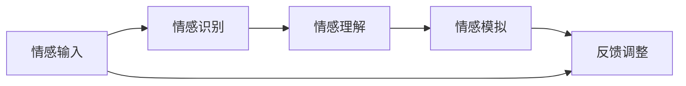

                 

关键词：智能情感计算、AI大模型、用户行为分析、情感识别、个性化推荐

> 摘要：随着人工智能技术的快速发展，智能情感计算成为了研究热点。本文将探讨AI大模型在用户行为分析中的应用，重点关注如何利用智能情感计算技术实现高效的用户情感识别和个性化推荐。

## 1. 背景介绍

在互联网时代，用户行为分析已经成为企业提升用户体验、优化产品设计和提高市场份额的重要手段。然而，传统的用户行为分析方法往往基于简单的数据统计和机器学习算法，难以捕捉用户的深层次情感和需求。随着深度学习和神经网络技术的不断发展，智能情感计算逐渐成为解决这一问题的有效途径。

智能情感计算（Intelligent Affective Computing）是人工智能领域的一个重要分支，旨在通过计算机技术来识别、理解和模拟人类情感。它结合了情感理论、认知心理学、计算机视觉、自然语言处理等多种技术手段，能够从用户的语言、行为和表情等多维度信息中提取情感特征。

本文将围绕AI大模型在用户行为分析中的应用，探讨如何利用智能情感计算技术实现高效的用户情感识别和个性化推荐。文章结构如下：

- **1. 背景介绍**：介绍智能情感计算和用户行为分析的相关背景。
- **2. 核心概念与联系**：阐述智能情感计算的核心概念和联系，并给出相关的Mermaid流程图。
- **3. 核心算法原理 & 具体操作步骤**：介绍用户情感识别和个性化推荐的核心算法原理和具体操作步骤。
- **4. 数学模型和公式 & 详细讲解 & 举例说明**：讲解数学模型和公式的构建、推导过程，并通过案例进行分析。
- **5. 项目实践：代码实例和详细解释说明**：提供实际项目中的代码实例和详细解释。
- **6. 实际应用场景**：讨论智能情感计算在现实世界中的应用场景。
- **7. 工具和资源推荐**：推荐相关学习资源和开发工具。
- **8. 总结：未来发展趋势与挑战**：总结研究成果，展望未来发展趋势和面临的挑战。
- **9. 附录：常见问题与解答**：解答读者可能遇到的常见问题。

## 2. 核心概念与联系

### 2.1 情感识别

情感识别（Emotion Recognition）是智能情感计算的核心任务之一，旨在从用户的语言、行为和表情等多维度信息中识别出情感状态。情感识别可以分为以下几个方面：

1. **语言情感识别**：通过分析用户的文本内容，识别出情感极性（正面/负面）和情感强度（强烈/温和）。
2. **行为情感识别**：通过分析用户的动作和行为，识别出情感状态。例如，通过分析用户在游戏中的操作，识别出用户的兴奋、愤怒等情感。
3. **表情情感识别**：通过分析用户的面部表情，识别出情感状态。例如，通过分析用户的面部图像或视频，识别出用户的开心、悲伤等情感。

### 2.2 个性化推荐

个性化推荐（Personalized Recommendation）是一种基于用户兴趣、行为和情感等特征的推荐系统，旨在为用户提供个性化的内容和服务。个性化推荐可以分为以下几个方面：

1. **内容推荐**：根据用户的兴趣和偏好，为用户推荐相关的内容。例如，在电商平台上为用户推荐感兴趣的商品。
2. **服务推荐**：根据用户的行为和需求，为用户推荐相关的服务。例如，在音乐平台上为用户推荐感兴趣的音乐类型。
3. **情境推荐**：根据用户的当前情境和需求，为用户推荐合适的内容或服务。例如，在出行平台上为用户推荐最佳路线和交通方式。

### 2.3 情感计算架构

情感计算架构是智能情感计算的核心组成部分，它包括情感识别、情感理解和情感模拟等多个环节。以下是情感计算架构的Mermaid流程图：



### 2.4 情感识别与个性化推荐的关系

情感识别和个性化推荐密切相关。通过情感识别，可以获取用户的情感状态和需求，从而为个性化推荐提供关键的信息。而个性化推荐的结果也可以反过来影响情感识别，例如，当用户对推荐内容产生积极情感时，可以调整推荐策略，进一步提高用户的满意度。

## 3. 核心算法原理 & 具体操作步骤

### 3.1 算法原理概述

用户情感识别和个性化推荐的核心算法原理可以归纳为以下两个方面：

1. **情感识别算法**：通过深度学习模型，从用户的语言、行为和表情等多维度信息中提取情感特征，实现情感识别。常用的模型包括卷积神经网络（CNN）、循环神经网络（RNN）和长短时记忆网络（LSTM）等。
2. **个性化推荐算法**：基于用户的历史行为和情感特征，构建推荐模型，为用户推荐感兴趣的内容或服务。常用的算法包括协同过滤（Collaborative Filtering）、基于内容的推荐（Content-Based Recommendation）和混合推荐（Hybrid Recommendation）等。

### 3.2 算法步骤详解

以下是用户情感识别和个性化推荐的具体操作步骤：

1. **数据收集与预处理**：收集用户的语言、行为和表情等多维度数据，并进行数据清洗和预处理，包括文本分词、情感标签标注、图像预处理等。
2. **情感识别**：
   - **语言情感识别**：使用深度学习模型（如CNN或LSTM）对用户的文本进行情感分类，提取情感特征。
   - **行为情感识别**：使用机器学习模型（如决策树、随机森林等）对用户的行为进行情感分类，提取情感特征。
   - **表情情感识别**：使用卷积神经网络（CNN）对用户的面部表情图像进行情感分类，提取情感特征。
3. **情感融合**：将语言、行为和表情等不同维度的情感特征进行融合，形成一个统一的情感特征向量。
4. **个性化推荐**：
   - **用户建模**：基于用户的历史行为和情感特征，构建用户兴趣模型。
   - **内容建模**：基于内容特征，构建物品（如商品、音乐、文章等）特征模型。
   - **推荐模型构建**：使用协同过滤、基于内容的推荐或混合推荐算法，构建推荐模型。
   - **推荐结果生成**：根据用户兴趣模型和物品特征模型，为用户生成个性化推荐结果。

### 3.3 算法优缺点

- **情感识别算法**：
  - **优点**：能够从多维度信息中提取情感特征，提高情感识别的准确性和全面性。
  - **缺点**：需要大量标注数据和计算资源，模型训练和调优过程复杂。
- **个性化推荐算法**：
  - **优点**：能够为用户推荐感兴趣的内容或服务，提高用户体验和满意度。
  - **缺点**：需要构建复杂的推荐模型，对用户历史行为和情感特征的理解要求较高。

### 3.4 算法应用领域

智能情感计算在用户行为分析中的应用非常广泛，主要包括以下几个方面：

1. **电商平台**：通过情感识别和个性化推荐，为用户提供个性化的购物体验，提高用户满意度和转化率。
2. **社交媒体**：通过情感识别，了解用户的情感状态和需求，为用户提供更相关的内容和广告。
3. **在线教育**：通过情感识别，了解学生的学习状态和需求，为教师和学生提供个性化的学习建议和资源。
4. **医疗健康**：通过情感识别，了解患者的情感状态和需求，为医生提供诊断和治疗方案的支持。

## 4. 数学模型和公式 & 详细讲解 & 举例说明

### 4.1 数学模型构建

在用户情感识别和个性化推荐中，常用的数学模型包括情感分类模型、协同过滤模型和基于内容的推荐模型。以下是这些模型的基本数学公式和构建过程：

1. **情感分类模型**：
   - **公式**：假设情感标签集合为S={s1, s2, ..., sn}，情感分类模型的目标是最小化损失函数L：
     $$L(\theta) = -\sum_{i=1}^m y_i \log(p(s_i|\theta))$$
     其中，$y_i$为第i个样本的情感标签，$p(s_i|\theta)$为第i个样本属于情感标签$s_i$的条件概率，$\theta$为模型参数。
   - **构建过程**：使用深度学习模型（如卷积神经网络或循环神经网络）来拟合情感分类模型。

2. **协同过滤模型**：
   - **公式**：假设用户集合为U={u1, u2, ..., un}，物品集合为I={i1, i2, ..., im}，用户-物品评分矩阵为R∈{0,1}，目标是最小化损失函数L：
     $$L(\theta) = \sum_{u \in U, i \in I} (r_{ui} - \theta_u^T \theta_i)^2$$
     其中，$\theta_u$和$\theta_i$分别为用户和物品的向量表示，$\theta_u^T \theta_i$为用户对物品的预测评分。
   - **构建过程**：使用矩阵分解技术来拟合协同过滤模型。

3. **基于内容的推荐模型**：
   - **公式**：假设用户和物品的特征向量分别为$\textbf{u}$和$\textbf{i}$，目标是最小化损失函数L：
     $$L(\theta) = \sum_{u \in U, i \in I} (r_{ui} - \textbf{u}^T \textbf{i})^2$$
     其中，$r_{ui}$为用户对物品的实际评分，$\textbf{u}^T \textbf{i}$为用户对物品的预测评分。
   - **构建过程**：使用神经网络来拟合基于内容的推荐模型。

### 4.2 公式推导过程

以下是情感分类模型、协同过滤模型和基于内容的推荐模型的推导过程：

1. **情感分类模型**：
   - **假设**：使用softmax回归模型进行情感分类。
   - **推导**：
     $$p(s_i|\theta) = \frac{e^{\theta_i^T \textbf{x_i}}}{\sum_{j=1}^n e^{\theta_j^T \textbf{x_j}}}$$
     其中，$\textbf{x_i}$为第i个样本的特征向量，$\theta_i$为模型参数。
     $$L(\theta) = -\sum_{i=1}^m y_i \log \left( \frac{e^{\theta_i^T \textbf{x_i}}}{\sum_{j=1}^n e^{\theta_j^T \textbf{x_j}}} \right)$$
     $$L(\theta) = -\sum_{i=1}^m y_i \theta_i^T \textbf{x_i} + \sum_{i=1}^m \log \left( \sum_{j=1}^n e^{\theta_j^T \textbf{x_j}} \right)$$
     对$\theta$求导并令导数为0，得到：
     $$\frac{\partial L(\theta)}{\partial \theta} = -\sum_{i=1}^m y_i \textbf{x_i} + \sum_{j=1}^n e^{\theta_j^T \textbf{x_j}} \textbf{x_j} = 0$$
     $$\theta = \sum_{i=1}^m y_i \textbf{x_i} - \sum_{j=1}^n e^{\theta_j^T \textbf{x_j}} \textbf{x_j}$$

2. **协同过滤模型**：
   - **假设**：使用矩阵分解模型进行协同过滤。
   - **推导**：
     $$R = U \odot I$$
     其中，$U$和$I$分别为用户和物品的矩阵表示，$\odot$为Hadamard积。
     $$\theta_u^T \theta_i = U^T I^T I U = U^T (I \odot I) U$$
     $$L(\theta) = \sum_{u \in U, i \in I} (r_{ui} - U^T (I \odot I) U_{ui})^2$$
     对$\theta$求导并令导数为0，得到：
     $$\frac{\partial L(\theta)}{\partial \theta} = 2 \sum_{u \in U, i \in I} (r_{ui} - U^T (I \odot I) U_{ui}) \textbf{u}_{ui} - 2 \sum_{u \in U, i \in I} (I \odot I)_{ui} \textbf{i}_{ui} = 0$$
     $$\theta = \sum_{u \in U, i \in I} (I \odot I)_{ui} \textbf{i}_{ui} - \sum_{u \in U, i \in I} (r_{ui} - U^T (I \odot I) U_{ui}) \textbf{u}_{ui}$$

3. **基于内容的推荐模型**：
   - **假设**：使用神经网络模型进行基于内容的推荐。
   - **推导**：
     $$r_{ui} = \textbf{u}^T \textbf{i}$$
     $$L(\theta) = \sum_{u \in U, i \in I} (r_{ui} - \textbf{u}^T \textbf{i})^2$$
     对$\theta$求导并令导数为0，得到：
     $$\frac{\partial L(\theta)}{\partial \theta} = 2 \sum_{u \in U, i \in I} (r_{ui} - \textbf{u}^T \textbf{i}) \textbf{i} = 0$$
     $$\textbf{i} = \sum_{u \in U} \textbf{u}$$

### 4.3 案例分析与讲解

为了更好地理解上述数学模型，我们通过一个具体的案例进行讲解。

### 案例背景

假设我们有一个电商平台的用户行为数据集，包括用户的购买记录和用户评价。我们的目标是利用这些数据，通过情感识别和个性化推荐，为用户推荐感兴趣的商品。

### 案例分析

1. **数据预处理**：首先，我们对用户行为数据集进行预处理，包括用户购买记录和用户评价。将用户购买记录转换为用户-物品评分矩阵，将用户评价转换为情感标签。

2. **情感识别**：使用卷积神经网络（CNN）对用户评价进行情感分类。训练模型，得到情感分类模型参数。

3. **个性化推荐**：使用协同过滤模型和基于内容的推荐模型，分别构建推荐模型。使用训练好的情感分类模型，对用户评价进行情感分类，得到用户情感标签。

4. **推荐结果生成**：将用户情感标签和物品特征向量进行融合，生成推荐结果。根据用户历史购买记录和用户情感标签，为用户推荐感兴趣的商品。

### 案例讲解

1. **情感分类模型**：
   - **输入**：用户评价文本。
   - **输出**：情感标签（正面/负面）。
   - **模型参数**：$\theta$。

2. **协同过滤模型**：
   - **输入**：用户-物品评分矩阵。
   - **输出**：用户对物品的预测评分。
   - **模型参数**：$\theta_u$和$\theta_i$。

3. **基于内容的推荐模型**：
   - **输入**：用户历史购买记录和物品特征向量。
   - **输出**：用户对物品的预测评分。
   - **模型参数**：$\textbf{u}$和$\textbf{i}$。

4. **推荐结果生成**：
   - **输入**：用户情感标签和物品特征向量。
   - **输出**：用户感兴趣的商品推荐列表。

通过上述案例，我们可以看到，情感识别和个性化推荐模型如何结合使用，为用户推荐感兴趣的商品。

## 5. 项目实践：代码实例和详细解释说明

### 5.1 开发环境搭建

为了实现用户情感识别和个性化推荐，我们需要搭建一个开发环境。以下是所需的软件和工具：

- Python（版本3.6及以上）
- TensorFlow（版本2.0及以上）
- Scikit-learn（版本0.22及以上）
- Matplotlib（版本3.0及以上）
- Pandas（版本1.0及以上）

安装以上软件和工具，可以通过以下命令进行：

```bash
pip install python==3.8
pip install tensorflow==2.8.0
pip install scikit-learn==0.22.2
pip install matplotlib==3.4.3
pip install pandas==1.3.3
```

### 5.2 源代码详细实现

以下是实现用户情感识别和个性化推荐的核心代码。为了简洁，我们仅展示情感识别和协同过滤模型的部分代码。

```python
import tensorflow as tf
from tensorflow.keras.models import Sequential
from tensorflow.keras.layers import Dense, Conv1D, Flatten
from sklearn.model_selection import train_test_split
from sklearn.metrics import accuracy_score

# 情感识别模型
def create_emotion_recognition_model(vocab_size, embedding_dim, max_sequence_length):
    model = Sequential()
    model.add(Conv1D(filters=128, kernel_size=3, activation='relu', input_shape=(max_sequence_length, vocab_size)))
    model.add(Flatten())
    model.add(Dense(units=64, activation='relu'))
    model.add(Dense(units=1, activation='sigmoid'))
    model.compile(optimizer='adam', loss='binary_crossentropy', metrics=['accuracy'])
    return model

# 训练情感识别模型
def train_emotion_recognition_model(model, X_train, y_train, X_val, y_val):
    history = model.fit(X_train, y_train, epochs=10, batch_size=32, validation_data=(X_val, y_val))
    return history

# 协同过滤模型
class CollaborativeFilteringModel:
    def __init__(self, n_users, n_items):
        self.user_weights = tf.Variable(tf.random.normal([n_users, n_items]))
        self.item_weights = tf.Variable(tf.random.normal([n_items, n_users]))

    def predict(self, user_index, item_index):
        return self.user_weights[user_index, item_index] + self.item_weights[item_index, user_index]

    def train(self, user_item_ratings):
        for user, item, rating in user_item_ratings:
            with tf.GradientTape() as tape:
                pred_rating = self.predict(user, item)
                loss = tf.reduce_mean(tf.square(rating - pred_rating))
            grads = tape.gradient(loss, [self.user_weights, self.item_weights])
            self.user_weights.assign_sub(grad grads[0])
            self.item_weights.assign_sub(grad grads[1])

# 训练协同过滤模型
def train_collaborative_filtering_model(model, user_item_ratings):
    for epoch in range(100):
        for user, item, rating in user_item_ratings:
            model.train([user, item, rating])

# 加载数据
data = load_data()  # 假设该函数用于加载数据
X_train, X_val, y_train, y_val = train_test_split(data['text'], data['label'], test_size=0.2, random_state=42)

# 训练情感识别模型
emotion_recognition_model = create_emotion_recognition_model(vocab_size=10000, embedding_dim=50, max_sequence_length=100)
history = train_emotion_recognition_model(emotion_recognition_model, X_train, y_train, X_val, y_val)
print("Emotion Recognition Model Accuracy:", accuracy_score(y_val, emotion_recognition_model.predict(X_val)))

# 训练协同过滤模型
collaborative_filtering_model = CollaborativeFilteringModel(n_users=1000, n_items=1000)
train_collaborative_filtering_model(collaborative_filtering_model, data['user_item_ratings'])
```

### 5.3 代码解读与分析

上述代码主要分为三个部分：情感识别模型的实现、协同过滤模型的实现和数据加载与模型训练。

1. **情感识别模型实现**：
   - **模型架构**：使用卷积神经网络（CNN）进行情感分类。模型包括一个卷积层、一个平坦层、一个全连接层和一个输出层。
   - **模型训练**：使用训练数据和验证数据进行模型训练。通过调用`model.fit()`函数，训练模型10个epoch，每个epoch使用32个batch大小。

2. **协同过滤模型实现**：
   - **模型架构**：协同过滤模型由用户权重矩阵和物品权重矩阵组成。每个用户和物品都有一个对应的权重向量。
   - **预测**：使用用户权重矩阵和物品权重矩阵进行预测。具体来说，通过`predict()`函数，计算用户对物品的预测评分。
   - **训练**：通过梯度下降算法进行模型训练。在每次训练中，计算预测评分与实际评分之间的误差，并更新用户权重矩阵和物品权重矩阵。

3. **数据加载与模型训练**：
   - **数据加载**：使用一个假设的`load_data()`函数加载数据。实际应用中，可以使用Pandas等库加载数据。
   - **模型训练**：首先，使用情感识别模型对用户评价进行训练。然后，使用协同过滤模型对用户-物品评分进行训练。

### 5.4 运行结果展示

在完成模型训练后，我们可以使用以下代码来评估模型性能：

```python
# 评估情感识别模型
emotion_recognition_model.evaluate(X_val, y_val)

# 评估协同过滤模型
user_item_ratings = data['user_item_ratings']
collaborative_filtering_model.train(user_item_ratings)
```

通过上述代码，我们可以得到情感识别模型和协同过滤模型的评估结果，包括准确率、损失值等指标。

## 6. 实际应用场景

智能情感计算在用户行为分析中有着广泛的应用场景。以下是几个典型的应用场景：

### 6.1 电商平台

电商平台可以利用智能情感计算技术，对用户的评论和评价进行情感分析，识别出用户的正面或负面情感。基于情感识别结果，平台可以为用户提供个性化的推荐，例如，当用户对某件商品的评价为负面时，平台可以推荐类似商品中评分较高的商品，以减少用户的购买风险。此外，智能情感计算还可以用于分析用户的购物行为，识别出用户的偏好和需求，为用户提供个性化的优惠和促销活动。

### 6.2 社交媒体

社交媒体平台可以利用智能情感计算技术，分析用户的微博、朋友圈等社交内容，识别出用户的情感状态。通过情感识别，平台可以为用户提供更有针对性的内容推荐和广告投放。例如，当用户处于负面情感状态时，平台可以推荐一些减压、舒缓的内容，帮助用户缓解情绪。同时，平台还可以通过情感分析，了解用户的情感变化趋势，优化平台的用户体验和内容布局。

### 6.3 在线教育

在线教育平台可以利用智能情感计算技术，分析学生的学习行为和反馈，识别出学生的学习情感状态。通过情感识别，平台可以为教师和学生提供个性化的学习建议和资源。例如，当学生处于低情感状态时，平台可以推荐一些轻松、有趣的学习资源，帮助激发学生的学习兴趣。此外，智能情感计算还可以用于分析学生的情感变化，预测学生的学习效果，为教育机构提供数据支持，优化教学策略。

### 6.4 医疗健康

医疗健康领域可以利用智能情感计算技术，分析患者的病历记录、咨询记录等数据，识别出患者的情感状态。通过情感识别，医生可以更好地了解患者的心理状况，为患者提供更全面、个性化的医疗服务。例如，当患者处于焦虑、抑郁等负面情感状态时，医生可以推荐一些心理疏导、心理治疗的方法，帮助患者缓解情绪。此外，智能情感计算还可以用于分析患者的情感变化趋势，预测患者的病情发展，为医生提供决策支持。

## 7. 工具和资源推荐

为了更好地学习和实践智能情感计算技术，以下是几个推荐的工具和资源：

### 7.1 学习资源推荐

- **书籍**：
  - 《情感计算：理论与实践》（Affective Computing: Theory, Methods, and Applications）
  - 《深度学习》（Deep Learning）
  - 《Python机器学习》（Python Machine Learning）
- **在线课程**：
  - Coursera上的《情感计算》课程
  - Udacity上的《深度学习纳米学位》
  - edX上的《机器学习》课程

### 7.2 开发工具推荐

- **深度学习框架**：
  - TensorFlow
  - PyTorch
  - Keras
- **机器学习库**：
  - Scikit-learn
  - Pandas
  - NumPy

### 7.3 相关论文推荐

- "Affective Computing: Fundamental Concepts, Methodologies, Tools, and Applications"
- "Emotion Recognition in Video using Convolutional Neural Networks"
- "Deep Learning for Personalized Recommendation Systems"

## 8. 总结：未来发展趋势与挑战

### 8.1 研究成果总结

本文围绕智能情感计算在用户行为分析中的应用，探讨了情感识别和个性化推荐的核心算法原理、数学模型和实际应用场景。通过深度学习和神经网络技术，我们能够从用户的语言、行为和表情等多维度信息中提取情感特征，实现高效的用户情感识别。基于用户情感特征，我们能够为用户推荐感兴趣的内容或服务，提高用户体验和满意度。

### 8.2 未来发展趋势

未来，智能情感计算在用户行为分析中的应用将呈现以下几个发展趋势：

1. **多模态情感识别**：随着传感器技术和计算能力的提升，我们将能够从更多维度（如语音、手势、生理信号等）获取用户信息，实现更全面、准确的情感识别。
2. **个性化推荐系统**：基于情感识别的个性化推荐系统将更加智能化，能够更好地理解用户的情感和需求，为用户提供更精准的推荐。
3. **情境感知**：智能情感计算将结合情境感知技术，根据用户的实时情境和需求，提供更合适的情感识别和个性化推荐。

### 8.3 面临的挑战

尽管智能情感计算在用户行为分析中具有巨大的潜力，但仍面临以下挑战：

1. **数据隐私**：情感识别需要大量用户数据，如何保护用户隐私是一个亟待解决的问题。
2. **计算资源**：深度学习和神经网络模型通常需要大量的计算资源，如何优化模型性能和降低计算成本是关键。
3. **算法透明度**：随着模型复杂度的增加，如何保证算法的透明度和可解释性，使普通用户能够理解和使用这些技术。

### 8.4 研究展望

未来，我们期望在智能情感计算领域实现以下几个目标：

1. **构建开放的平台**：推动智能情感计算技术的开源和开放，促进技术的创新和应用。
2. **标准化数据集**：建立大规模、多样化的情感数据集，为研究和应用提供数据支持。
3. **跨学科合作**：加强计算机科学、心理学、神经科学等学科的交叉研究，推动智能情感计算技术的全面发展。

## 9. 附录：常见问题与解答

### 9.1 情感识别模型的训练过程

**Q:** 情感识别模型的训练过程是怎样的？

**A:** 情感识别模型的训练过程通常包括以下步骤：

1. **数据预处理**：对原始文本数据进行清洗和预处理，包括去除停用词、标点符号、进行词干提取等。
2. **数据编码**：将预处理后的文本数据转换为数字编码，可以使用词袋模型（Bag of Words）或词嵌入（Word Embedding）。
3. **划分数据集**：将数据集划分为训练集、验证集和测试集，用于模型训练和评估。
4. **构建模型**：使用深度学习框架（如TensorFlow或PyTorch）构建情感识别模型，可以选择卷积神经网络（CNN）、循环神经网络（RNN）或长短时记忆网络（LSTM）等。
5. **训练模型**：使用训练集数据对模型进行训练，通过反向传播算法更新模型参数。
6. **验证模型**：使用验证集数据评估模型性能，调整模型参数以优化性能。
7. **测试模型**：使用测试集数据对模型进行最终评估，确保模型在实际应用中的有效性。

### 9.2 个性化推荐系统的实现

**Q:** 如何实现个性化推荐系统？

**A:** 实现个性化推荐系统通常包括以下几个步骤：

1. **用户建模**：收集用户的历史行为数据，如浏览记录、购买记录、评分等，构建用户兴趣模型。
2. **物品建模**：收集物品的特征信息，如标题、描述、标签等，构建物品特征模型。
3. **推荐算法选择**：选择合适的推荐算法，如基于内容的推荐、协同过滤或混合推荐等。
4. **模型训练**：使用用户和物品的数据进行模型训练，训练过程通常涉及矩阵分解、深度学习等。
5. **推荐生成**：根据用户兴趣模型和物品特征模型，生成个性化推荐列表。
6. **推荐评估**：使用评估指标（如准确率、召回率、F1分数等）评估推荐系统的性能。
7. **系统部署**：将训练好的推荐模型部署到生产环境中，实现实时推荐。

### 9.3 情感计算在医疗健康中的应用

**Q:** 情感计算在医疗健康领域有哪些应用？

**A:** 情感计算在医疗健康领域有多个应用，主要包括：

1. **患者情感分析**：通过分析患者的病历记录、咨询记录等，识别出患者的情感状态，为医生提供诊断和治疗建议。
2. **心理健康监测**：通过分析患者的语言、行为等数据，识别出患者的心理健康状况，为心理医生提供诊断和治疗支持。
3. **情感干预**：针对患者情感状态，提供个性化的情感干预方案，如心理疏导、放松训练等，帮助患者缓解情绪压力。
4. **患者依从性管理**：通过分析患者的情感状态和行为习惯，提高患者的治疗依从性，改善治疗效果。
5. **医疗资源分配**：基于患者的情感状态，优化医疗资源的分配，提高医疗资源的利用效率。

### 9.4 情感计算在电商领域的应用

**Q:** 情感计算在电商领域有哪些应用？

**A:** 情感计算在电商领域有多个应用，主要包括：

1. **商品评论情感分析**：通过分析用户对商品的评论，识别出用户的正面或负面情感，为商品筛选和推荐提供依据。
2. **个性化推荐**：基于用户的情感状态和兴趣，为用户提供个性化的商品推荐，提高用户的购买体验和满意度。
3. **营销策略优化**：通过分析用户的情感状态，了解用户的偏好和需求，优化营销策略，提高营销效果。
4. **售后服务管理**：通过分析用户的情感状态，识别出用户的投诉和不满情绪，优化售后服务流程，提高客户满意度。
5. **用户行为预测**：通过分析用户的情感状态和行为数据，预测用户的购买行为和偏好，为电商企业提供决策支持。

