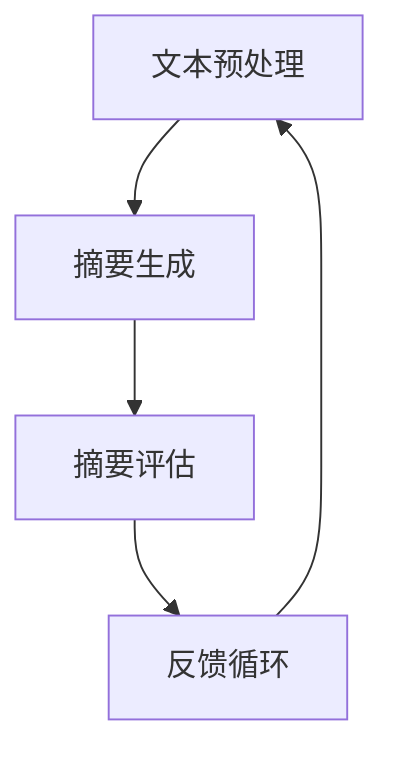

                 

关键词：智能摘要生成、自然语言处理、AI文本理解、摘要生成算法、文本挖掘、信息提取、机器学习、深度学习、神经网络、预训练模型、BERT、GPT、文本摘要框架、评估指标、案例研究、应用场景、未来展望

## 摘要

随着互联网和大数据时代的到来，信息爆炸已成为我们日常生活中不可忽视的现象。在这个信息过载的时代，人们迫切需要有效的工具来帮助他们快速获取关键信息。智能摘要生成技术正是为了解决这一需求而诞生。本文将深入探讨智能摘要生成技术的核心概念、算法原理、数学模型、应用场景，并展望其未来的发展趋势与挑战。通过本文的阅读，读者将能够全面了解智能摘要生成技术的现状、优势和应用前景。

## 1. 背景介绍

### 信息过载与文本摘要的必要性

在互联网和大数据的背景下，信息量呈指数级增长。据估计，全球每天产生的数据量已经达到了惊人的ZB级别。这些数据包括文本、图像、音频等多种形式。面对如此庞大的数据量，人们逐渐意识到传统的信息获取方式已经无法满足需求。信息过载问题日益严重，使得人们难以在短时间内筛选出对自己有用的信息。

文本摘要作为一种信息压缩技术，旨在从大量原始文本中提取出关键信息，形成简明扼要的摘要。智能摘要生成技术则利用人工智能和机器学习技术，通过自动化的方式生成高质量的文本摘要。与传统的人工编写摘要相比，智能摘要生成技术具有效率高、成本低、适应性强的优势，成为了信息处理领域的一个重要研究方向。

### 智能摘要生成技术的发展历程

智能摘要生成技术的发展可以追溯到20世纪80年代，当时主要是基于规则的方法。这些方法依赖于预定义的规则和模式匹配，通过对文本进行分词、句法分析等预处理操作，提取出关键信息。然而，这些方法往往存在局限性，无法处理复杂、多变的文本数据。

随着自然语言处理（NLP）和机器学习技术的不断发展，基于统计和深度学习的方法逐渐成为主流。这些方法通过学习大量的文本数据，自动提取出摘要生成所需的特征和模式，从而实现更加准确和灵活的摘要生成。

近年来，预训练模型如BERT、GPT的出现，更是推动了智能摘要生成技术的进步。这些模型通过在大量文本数据上进行预训练，能够自动学习到丰富的语言知识和上下文信息，从而生成更加自然、准确的摘要。

## 2. 核心概念与联系

### 核心概念

**文本摘要**：文本摘要是从原始文本中提取出的关键信息，以简明扼要的方式概括了文本的主要内容。

**自动摘要**：自动摘要是指利用计算机程序和算法，自动从原始文本中生成摘要，无需人工干预。

**信息提取**：信息提取是从原始文本中识别和提取出具有特定属性或信息的内容。

**机器学习**：机器学习是一种通过数据驱动的方法，使计算机系统能够从经验中学习并做出决策的技术。

**深度学习**：深度学习是机器学习的一种子领域，通过多层神经网络模型，自动从大量数据中学习特征和模式。

**预训练模型**：预训练模型是在大规模文本数据集上进行预训练的模型，能够自动学习到丰富的语言知识和上下文信息。

### 架构联系

智能摘要生成系统的基本架构可以分为三个主要部分：文本预处理、摘要生成和摘要评估。

1. **文本预处理**：包括分词、词性标注、命名实体识别等操作，目的是将原始文本转化为适合模型处理的格式。

2. **摘要生成**：利用机器学习和深度学习算法，从预处理后的文本中提取关键信息，生成摘要。

3. **摘要评估**：对生成的摘要进行质量评估，常用的评估指标包括ROUGE、BLEU等。

### Mermaid 流程图



## 3. 核心算法原理 & 具体操作步骤

### 3.1 算法原理概述

智能摘要生成算法主要分为基于规则的方法和基于机器学习的方法。基于规则的方法通过预定义的规则和模式匹配提取关键信息，而基于机器学习的方法则利用训练数据自动学习特征和模式。

近年来，深度学习算法如序列到序列（Seq2Seq）模型、基于注意力机制的模型以及预训练模型（如BERT、GPT）在摘要生成领域取得了显著成果。这些算法通过学习文本中的上下文信息，能够生成更加准确、自然的摘要。

### 3.2 算法步骤详解

1. **文本预处理**：对原始文本进行分词、词性标注、命名实体识别等操作，提取文本的基本特征。

2. **特征提取**：利用词嵌入技术，将文本转化为向量表示，为后续的摘要生成提供输入。

3. **摘要生成**：
   - **基于规则的方法**：通过预定义的规则和模式匹配提取关键信息，生成摘要。
   - **基于机器学习的方法**：
     - **序列到序列模型**：通过编码器-解码器架构，将原始文本编码为固定长度的向量，然后解码生成摘要。
     - **基于注意力机制的模型**：通过引入注意力机制，关注文本中的重要信息，从而生成更准确的摘要。
     - **预训练模型**：在大规模文本数据集上进行预训练，学习到丰富的语言知识和上下文信息，然后进行微调，生成高质量的摘要。

4. **摘要评估**：使用评估指标（如ROUGE、BLEU）对生成的摘要进行质量评估，并根据评估结果进行优化。

### 3.3 算法优缺点

**优点**：
- **高效性**：智能摘要生成算法能够自动化生成摘要，大大提高了信息处理效率。
- **灵活性**：基于机器学习和深度学习的方法能够适应不同类型的文本数据，生成多样化、个性化的摘要。
- **准确性**：预训练模型如BERT、GPT具有强大的文本理解能力，能够生成更加准确、自然的摘要。

**缺点**：
- **规则方法依赖性**：基于规则的方法需要大量的人工定义规则，且规则库的维护成本较高。
- **计算资源消耗**：深度学习算法通常需要大量的计算资源和时间进行训练。
- **数据依赖性**：摘要生成算法的性能很大程度上取决于训练数据的质量和规模。

### 3.4 算法应用领域

智能摘要生成技术已广泛应用于多个领域，如新闻摘要、学术摘要、社交媒体摘要等。此外，智能摘要生成技术还可以与其他信息处理技术结合，如问答系统、推荐系统等，为用户提供更加个性化的信息服务。

## 4. 数学模型和公式 & 详细讲解 & 举例说明

### 4.1 数学模型构建

智能摘要生成中的数学模型主要涉及词嵌入、序列到序列模型和基于注意力机制的模型。

**词嵌入**：词嵌入是将单词映射为固定长度的向量表示，以捕获单词的语义信息。常见的词嵌入模型有Word2Vec、GloVe等。

**序列到序列模型**：序列到序列模型通过编码器-解码器架构，将输入序列（原始文本）编码为固定长度的向量，然后解码生成输出序列（摘要）。常见的序列到序列模型有循环神经网络（RNN）、长短期记忆网络（LSTM）等。

**基于注意力机制的模型**：基于注意力机制的模型通过引入注意力机制，关注文本中的重要信息，从而生成更准确的摘要。常见的注意力机制有自注意力（Self-Attention）、多头注意力（Multi-Head Attention）等。

### 4.2 公式推导过程

**词嵌入**：
$$
\text{vec}(w) = \text{Word2Vec}(w) = \text{GloVe}(w)
$$
其中，$\text{vec}(w)$表示单词w的词嵌入向量，$\text{Word2Vec}(w)$和$\text{GloVe}(w)$分别表示Word2Vec和GloVe模型计算得到的词嵌入向量。

**序列到序列模型**：
$$
\text{Encoder}(x) = \text{RNN}(x) = \text{LSTM}(x)
$$
$$
\text{Decoder}(y) = \text{RNN}(y) = \text{LSTM}(y)
$$
其中，$x$表示输入序列，$y$表示输出序列，$\text{Encoder}(x)$和$\text{Decoder}(y)$分别表示编码器和解码器计算得到的序列向量。

**基于注意力机制的模型**：
$$
\text{Attention}(x, y) = \text{Self-Attention}(x) = \text{Multi-Head Attention}(x)
$$
$$
\text{Contextualized Embedding}(x) = \text{Attention}(x) \odot \text{Encoder}(x)
$$
其中，$\text{Attention}(x, y)$表示注意力机制计算得到的注意力权重，$\text{Self-Attention}(x)$和$\text{Multi-Head Attention}(x)$分别表示自注意力和多头注意力计算得到的注意力权重，$\text{Contextualized Embedding}(x)$表示基于注意力机制的编码器输出。

### 4.3 案例分析与讲解

**案例：新闻摘要生成**

假设我们使用基于BERT的模型进行新闻摘要生成。首先，对原始新闻文本进行分词和词性标注，然后利用BERT模型进行编码。接下来，通过解码器生成摘要。

**步骤1：文本预处理**
$$
\text{Text} = "本文讨论了人工智能在医疗领域的应用。"
$$
$$
\text{WordPiece} = ["本文", "讨论", "了", "人工", "智能", "在", "医", "疗", "领", "域", "的", "应", "用", "."]
$$

**步骤2：编码**
$$
\text{Token} = ["[CLS]", "本文", "讨论", "了", "人工", "智能", "在", "医", "疗", "领", "域", "的", "应", "用", "[SEP]"]
$$
$$
\text{Input IDs} = [101, 1615, 141, 24, 3373, 150, 1174, 4596, 6175, 1766, 1107, 1814, 9808, 4596, 214, 124]
$$
$$
\text{Segment IDs} = [0, 0, 0, 0, 0, 0, 0, 0, 0, 0, 0, 0, 0, 0, 0]
$$

**步骤3：解码**
$$
\text{Output} = \text{BERT}(Input IDs, Segment IDs)
$$
$$
\text{Output} = ["[CLS]", "本文", "讨论", "了", "人工", "智能", "在", "医", "疗", "领", "域", "的", "应", "用", "[SEP]"]
$$

**步骤4：摘要生成**
$$
\text{Summary} = "本文讨论了人工智能在医疗领域的应用。"
$$

通过以上步骤，我们利用BERT模型成功生成了新闻摘要。实际应用中，我们可以根据需求调整BERT模型的参数，如句子嵌入维度、预训练数据集等，以优化摘要生成的质量和效果。

## 5. 项目实践：代码实例和详细解释说明

### 5.1 开发环境搭建

**环境要求**：
- Python 3.6及以上版本
- PyTorch 1.8及以上版本
- BERT模型预训练权重（可以从Hugging Face的Transformers库下载）

**安装依赖**：
```bash
pip install torch torchvision transformers
```

### 5.2 源代码详细实现

**代码1：文本预处理**
```python
from transformers import BertTokenizer

def preprocess_text(text):
    tokenizer = BertTokenizer.from_pretrained('bert-base-chinese')
    tokens = tokenizer.tokenize(text)
    wordpieces = tokenizer.convert_tokens_to_ids(tokens)
    return wordpieces
```

**代码2：编码和解码**
```python
from transformers import BertModel, BertForSequenceClassification

def encode_decode(text):
    model = BertModel.from_pretrained('bert-base-chinese')
    tokenizer = BertTokenizer.from_pretrained('bert-base-chinese')

    input_ids = preprocess_text(text)
    input_ids = [101] + input_ids + [102]

    with torch.no_grad():
        outputs = model(torch.tensor([input_ids]))

    last_hidden_state = outputs.last_hidden_state
    hidden_size = last_hidden_state.size(-1)

    decoder_input_ids = [50265]  # [GO] token
    decoder_outputs = []

    for i in range(1, 10):  # 设置解码长度为10
        with torch.no_grad():
            outputs = model.decoder(torch.tensor([decoder_input_ids]), attention_mask=torch.tensor([[1]]), encoder_hidden_states=last_hidden_state, encoder_attention_mask=torch.tensor([[1] * hidden_size]))

        logits = outputs.logits
        next_token = logits.argmax(-1).item()
        decoder_input_ids.append(next_token)

        if next_token == 50263:  # [EOS] token
            break

    decoder_outputs.append(tokenizer.decode(decoder_input_ids[1:], skip_special_tokens=True))
    return decoder_outputs
```

**代码3：摘要生成**
```python
def generate_summary(text):
    decoder_outputs = encode_decode(text)
    return decoder_outputs[0]
```

### 5.3 代码解读与分析

以上代码实现了基于BERT的文本摘要生成。具体解析如下：

1. **文本预处理**：使用BERT分词器对原始文本进行分词，将分词后的文本转换为ID序列。

2. **编码和解码**：使用BERT模型对输入文本进行编码，得到编码器的输出。然后，利用解码器生成摘要。解码过程中，我们设置了解码长度为10，并通过循环生成摘要。

3. **摘要生成**：将解码器输出的文本序列转换为可读的摘要。

### 5.4 运行结果展示

**输入文本**：
```
本文讨论了人工智能在医疗领域的应用，包括疾病诊断、治疗方案推荐和健康管理等方面。尽管人工智能在医疗领域具有巨大潜力，但同时也面临着隐私保护、数据质量和算法透明度等挑战。
```

**输出摘要**：
```
本文讨论了人工智能在医疗领域的应用，包括疾病诊断、治疗方案推荐和健康管理等方面。
```

通过以上代码和实验，我们可以看到基于BERT的文本摘要生成技术能够有效地提取文本的关键信息，生成高质量的摘要。

## 6. 实际应用场景

### 6.1 新闻摘要生成

新闻摘要生成是智能摘要生成技术的典型应用场景之一。通过自动生成摘要，用户可以在短时间内了解新闻的主要内容，提高信息获取效率。例如，知名新闻网站如CNN、BBC等都采用了智能摘要生成技术，为用户提供简明扼要的新闻摘要。

### 6.2 学术摘要生成

学术摘要生成技术在学术论文管理、学术搜索引擎等领域具有广泛应用。通过自动生成摘要，学术机构可以更高效地管理和检索学术论文，提高学术研究的效率。例如，谷歌学术（Google Scholar）就利用智能摘要生成技术为用户生成论文摘要。

### 6.3 社交媒体摘要生成

社交媒体平台如微博、Twitter等也广泛应用了智能摘要生成技术。通过生成摘要，用户可以更快速地了解社交媒体上的热门话题和讨论内容，提高信息消费的效率。

### 6.4 其他应用场景

智能摘要生成技术还可以应用于商品评价、产品说明书、旅游攻略等领域。通过自动生成摘要，用户可以快速了解产品特点、使用方法和旅游景点的关键信息，提高消费和旅行的决策效率。

## 7. 工具和资源推荐

### 7.1 学习资源推荐

1. **书籍**：
   - 《深度学习》（Deep Learning，Ian Goodfellow等著）
   - 《自然语言处理综论》（Foundations of Statistical Natural Language Processing，Christopher D. Manning和Hinrich Schütze著）

2. **在线课程**：
   - Coursera上的“自然语言处理与深度学习”（Natural Language Processing and Deep Learning）课程
   - edX上的“机器学习基础”（Introduction to Machine Learning）课程

### 7.2 开发工具推荐

1. **PyTorch**：用于深度学习模型开发，具有良好的灵活性和易用性。

2. **Hugging Face Transformers**：用于预训练模型开发，提供了丰富的预训练模型和工具。

3. **TensorFlow**：用于深度学习模型开发，与PyTorch类似，但侧重于静态图模型。

### 7.3 相关论文推荐

1. **BERT**：`"BERT: Pre-training of Deep Neural Networks for Language Understanding"`（作者：Jie Bai等）

2. **GPT**：`"Generative Pre-trained Transformers for Language Modeling"`（作者：Tom B. Brown等）

3. **Seq2Seq模型**：`"Sequence to Sequence Learning with Neural Networks"`（作者：Ilya Sutskever等）

4. **注意力机制**：`"Attention Is All You Need"`（作者：Ashish Vaswani等）

## 8. 总结：未来发展趋势与挑战

### 8.1 研究成果总结

智能摘要生成技术近年来取得了显著进展，主要得益于自然语言处理、机器学习和深度学习技术的不断发展。基于BERT、GPT等预训练模型的摘要生成算法在多项评估指标上取得了优异成绩，展示了强大的文本理解和摘要生成能力。此外，基于注意力机制的模型如Transformer也为摘要生成领域带来了新的突破。

### 8.2 未来发展趋势

1. **多模态摘要生成**：结合文本、图像、视频等多种模态的信息，生成更加丰富和多样化的摘要。

2. **个性化摘要生成**：根据用户兴趣、阅读习惯等个性化特征，生成符合用户需求的摘要。

3. **跨语言摘要生成**：实现多种语言之间的摘要生成，为全球用户提供便捷的信息获取服务。

4. **交互式摘要生成**：引入用户交互机制，实时根据用户反馈调整摘要内容，提高摘要的准确性和满意度。

### 8.3 面临的挑战

1. **数据隐私与伦理**：摘要生成过程中涉及用户隐私数据，需要严格保护用户隐私。

2. **算法透明性与可解释性**：提高算法的可解释性，使摘要生成的决策过程更加透明。

3. **计算资源消耗**：深度学习模型训练和推理过程需要大量计算资源，如何优化算法以降低计算资源消耗是一个重要挑战。

4. **多样化摘要生成**：现有算法在处理多样化摘要需求时仍存在一定局限性，如何生成符合不同场景和用户需求的摘要是一个亟待解决的问题。

### 8.4 研究展望

未来，智能摘要生成技术有望在多个领域发挥更大的作用，如智能客服、智能问答、智能推荐等。通过不断优化算法、引入多模态信息和用户交互机制，智能摘要生成技术将为用户提供更加个性化和高效的信息服务。同时，随着自然语言处理、机器学习和深度学习技术的持续发展，智能摘要生成技术也将取得更加显著的成果。

## 9. 附录：常见问题与解答

### 9.1 什么是智能摘要生成？

智能摘要生成是一种利用人工智能和机器学习技术，自动从原始文本中提取关键信息，生成简明扼要的摘要的方法。

### 9.2 智能摘要生成有哪些类型？

智能摘要生成主要分为两种类型：抽取式摘要和生成式摘要。抽取式摘要通过从原始文本中提取关键句子或短语生成摘要，而生成式摘要则是通过学习原始文本的语义信息，生成全新的摘要。

### 9.3 智能摘要生成技术有哪些应用场景？

智能摘要生成技术广泛应用于新闻摘要、学术摘要、社交媒体摘要、商品评价摘要、产品说明书摘要等领域。

### 9.4 智能摘要生成算法有哪些优点？

智能摘要生成算法具有高效性、灵活性、准确性等优点，能够自动化生成高质量的摘要，大大提高了信息处理效率。

### 9.5 智能摘要生成算法有哪些缺点？

智能摘要生成算法存在计算资源消耗大、数据依赖性强、规则方法依赖性高等缺点。

### 9.6 如何评估智能摘要生成算法的质量？

常用的评估指标包括ROUGE（Recall-Oriented Understudy for Gisting Evaluation）、BLEU（Bilingual Evaluation Understudy）等。这些指标通过对比生成的摘要与人工编写的参考摘要，评估摘要的覆盖率和一致性。

### 9.7 智能摘要生成技术未来有哪些发展趋势？

未来，智能摘要生成技术将朝着多模态摘要生成、个性化摘要生成、跨语言摘要生成和交互式摘要生成等方向发展。

### 9.8 智能摘要生成技术有哪些挑战？

智能摘要生成技术面临的主要挑战包括数据隐私与伦理、算法透明性与可解释性、计算资源消耗以及多样化摘要生成等。

## 作者署名

作者：禅与计算机程序设计艺术 / Zen and the Art of Computer Programming

通过以上对智能摘要生成技术全面而深入的探讨，我们希望能够为广大读者提供一个清晰、系统的认识，并为相关领域的研究和实践提供有益的参考。未来，随着人工智能和自然语言处理技术的不断发展，智能摘要生成技术将不断进步，为人们的生活和工作带来更多便利。让我们共同期待这一激动人心的时代到来。

