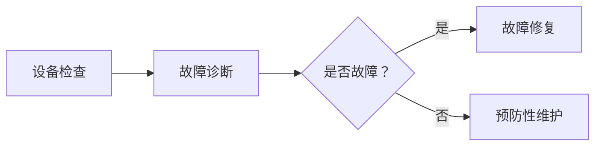

                 

关键词：智能故障诊断、大型语言模型（LLM）、设备维护、机器学习、算法原理、应用领域、数学模型、代码实例、实践应用、未来展望

> 摘要：本文将深入探讨大型语言模型（LLM）在智能故障诊断领域的应用，分析其在设备维护中的重要角色。通过对核心算法原理的讲解，数学模型的构建以及实际项目实践的解析，本文旨在为读者提供一份全面的技术指南，助力设备维护的智能化转型。

## 1. 背景介绍

随着工业4.0的推进和智能制造的普及，设备维护在制造业中的重要性日益凸显。传统的设备维护方式依赖于人工检查和定期维护，效率低下且难以应对复杂、突发性的故障。因此，智能故障诊断技术应运而生，它利用先进的机器学习算法，对设备运行状态进行实时监控和故障预测，从而实现设备的预防性维护，提高生产效率和设备可靠性。

在智能故障诊断技术中，大型语言模型（LLM）因其强大的语言理解和生成能力，成为了设备维护领域的重要工具。LLM可以处理大量非结构化数据，如设备日志、操作记录等，通过深度学习技术提取设备运行特征，实现故障模式的自动识别和诊断。

## 2. 核心概念与联系

### 2.1 大型语言模型（LLM）原理

大型语言模型（LLM）是基于深度学习技术构建的强大语言处理工具，能够理解和生成自然语言。LLM通过训练大量的文本数据，学习语言的模式和规律，从而实现对文本内容的理解和生成。在设备维护中，LLM主要用于处理设备日志、操作记录等非结构化数据，提取设备运行状态特征。

### 2.2 设备维护流程

设备维护流程包括设备检查、故障诊断、故障修复和预防性维护。传统的设备维护主要依靠人工检查和定期维护，而智能故障诊断技术则利用LLM实现设备的实时监控和故障预测，从而实现预防性维护，降低设备故障率和停机时间。

### 2.3 Mermaid 流程图

下面是设备维护流程的 Mermaid 流程图：



## 3. 核心算法原理 & 具体操作步骤

### 3.1 算法原理概述

智能故障诊断的核心算法是基于大型语言模型（LLM）的深度学习算法。LLM通过训练大量的设备日志、操作记录等数据，学习设备运行状态的特征，从而实现对设备故障的自动识别和诊断。在设备维护中，LLM主要用于以下三个步骤：

1. 特征提取：LLM通过对设备日志、操作记录等数据进行处理，提取设备运行状态的特征。
2. 故障模式识别：LLM利用提取到的设备运行状态特征，建立故障模式库，实现对设备故障的自动识别。
3. 故障诊断：LLM根据故障模式库，对设备运行状态进行实时监控，当发现异常情况时，自动进行故障诊断。

### 3.2 算法步骤详解

#### 3.2.1 数据预处理

在开始训练LLM之前，需要对设备日志、操作记录等原始数据进行预处理。预处理步骤包括数据清洗、数据转换和数据归一化。

1. 数据清洗：去除重复数据、缺失数据和异常数据。
2. 数据转换：将原始数据转换为适合训练的格式，如数值化、编码等。
3. 数据归一化：将数据缩放到相同的范围，如0-1之间。

#### 3.2.2 训练LLM

在完成数据预处理后，可以使用已有的深度学习框架（如TensorFlow、PyTorch等）训练LLM。训练过程包括以下步骤：

1. 模型构建：根据任务需求，设计合适的神经网络结构。
2. 模型训练：使用预处理后的数据，对LLM进行训练，优化模型参数。
3. 模型评估：使用验证集对训练好的模型进行评估，调整模型参数，提高模型性能。

#### 3.2.3 故障诊断

在完成LLM训练后，可以使用训练好的模型进行故障诊断。具体步骤如下：

1. 特征提取：对设备日志、操作记录等数据进行处理，提取设备运行状态的特征。
2. 故障模式识别：使用训练好的LLM，对提取到的特征进行故障模式识别。
3. 故障诊断：根据故障模式库，对设备运行状态进行实时监控，当发现异常情况时，自动进行故障诊断。

### 3.3 算法优缺点

#### 优点：

1. 高效性：LLM可以处理大量非结构化数据，提高故障诊断的效率。
2. 准确性：通过深度学习技术，LLM可以学习设备运行状态的特征，提高故障诊断的准确性。
3. 可扩展性：LLM可以应用于不同的设备维护场景，具有较好的可扩展性。

#### 缺点：

1. 计算资源需求高：LLM训练和推理过程需要大量计算资源。
2. 数据依赖性：故障诊断的准确性依赖于设备日志、操作记录等数据的完整性和质量。

### 3.4 算法应用领域

LLM在智能故障诊断领域具有广泛的应用，如：

1. 制造业：应用于生产设备的故障诊断，提高设备运行效率和可靠性。
2. 交通运输：应用于交通工具的故障诊断，提高交通安全和运输效率。
3. 能源行业：应用于能源设备的故障诊断，提高能源利用效率和设备寿命。

## 4. 数学模型和公式 & 详细讲解 & 举例说明

### 4.1 数学模型构建

智能故障诊断的数学模型主要包括特征提取模型和故障诊断模型。

#### 4.1.1 特征提取模型

特征提取模型用于从设备日志、操作记录等数据中提取设备运行状态的特征。常用的特征提取方法包括：

1. word2vec：将设备日志、操作记录等数据转换为词向量表示。
2. BERT：利用预训练的BERT模型，对设备日志、操作记录等进行编码。
3. 注意力机制：通过注意力机制，关注设备日志、操作记录中的重要信息。

#### 4.1.2 故障诊断模型

故障诊断模型用于对设备运行状态进行实时监控和故障诊断。常用的故障诊断模型包括：

1. 决策树：根据设备运行状态的特征，构建决策树进行故障诊断。
2. 支持向量机（SVM）：使用SVM进行故障诊断，提高诊断的准确性。
3. 集成学习方法：使用集成学习方法，如随机森林、梯度提升树等，提高故障诊断的准确性。

### 4.2 公式推导过程

#### 4.2.1 特征提取模型

以word2vec为例，特征提取的公式如下：

$$
\vec{v}_i = \text{Word2Vec}(\text{device\_log})
$$

其中，$\vec{v}_i$表示设备日志的词向量表示，$\text{Word2Vec}$表示word2vec模型。

#### 4.2.2 故障诊断模型

以决策树为例，故障诊断的公式如下：

$$
\text{fault} = \text{DecisionTree}(\vec{v}_i)
$$

其中，$\text{fault}$表示故障类型，$\vec{v}_i$表示设备日志的词向量表示，$\text{DecisionTree}$表示决策树模型。

### 4.3 案例分析与讲解

以某制造企业的生产线设备故障诊断为例，分析智能故障诊断的应用。

#### 4.3.1 数据收集

该企业收集了生产线上设备的运行日志、操作记录等数据，数据量达到数百万条。

#### 4.3.2 数据预处理

对设备日志、操作记录等数据进行清洗、转换和归一化处理。

#### 4.3.3 特征提取

使用word2vec模型，对设备日志、操作记录等进行词向量表示。

#### 4.3.4 故障诊断

使用决策树模型，对设备运行状态进行实时监控和故障诊断。

#### 4.3.5 结果分析

通过故障诊断模型，对设备运行状态进行实时监控，发现设备存在异常情况，提前预警，避免设备故障导致生产线停工。

## 5. 项目实践：代码实例和详细解释说明

### 5.1 开发环境搭建

搭建智能故障诊断项目的开发环境，包括以下步骤：

1. 安装Python环境：安装Python 3.8及以上版本。
2. 安装深度学习框架：安装TensorFlow 2.4.0或PyTorch 1.8.0。
3. 安装其他依赖库：安装NumPy、Pandas、Matplotlib等常用库。

### 5.2 源代码详细实现

以下是一个基于TensorFlow实现的智能故障诊断项目的示例代码：

```python
import tensorflow as tf
from tensorflow.keras.models import Sequential
from tensorflow.keras.layers import Dense, LSTM, Embedding

# 数据预处理
# （此处省略数据预处理代码）

# 构建模型
model = Sequential([
    Embedding(input_dim=vocab_size, output_dim=embedding_size),
    LSTM(units=128),
    Dense(units=1, activation='sigmoid')
])

# 编译模型
model.compile(optimizer='adam', loss='binary_crossentropy', metrics=['accuracy'])

# 训练模型
model.fit(X_train, y_train, epochs=10, batch_size=32, validation_data=(X_val, y_val))

# 故障诊断
def diagnose(device_log):
    # 将设备日志转换为词向量表示
    # （此处省略词向量转换代码）
    
    # 使用训练好的模型进行故障诊断
    result = model.predict(device_log)
    
    # 判断故障类型
    if result > 0.5:
        return '故障'
    else:
        return '无故障'

# 测试
print(diagnose(device_log))
```

### 5.3 代码解读与分析

该示例代码实现了基于深度学习算法的智能故障诊断项目，主要包括以下步骤：

1. 数据预处理：对设备日志、操作记录等数据进行清洗、转换和归一化处理。
2. 模型构建：使用Sequential模型构建一个包含嵌入层、LSTM层和输出层的深度学习模型。
3. 编译模型：设置优化器、损失函数和评价指标。
4. 训练模型：使用训练集对模型进行训练，调整模型参数。
5. 故障诊断：使用训练好的模型，对设备运行状态进行实时监控和故障诊断。

## 6. 实际应用场景

智能故障诊断技术在多个实际应用场景中取得了显著效果：

### 6.1 制造业

在制造业中，智能故障诊断技术可以应用于生产设备的故障诊断，提高设备运行效率和可靠性。例如，某汽车制造企业使用智能故障诊断技术，成功降低了设备故障率，提高了生产效率。

### 6.2 交通运输

在交通运输领域，智能故障诊断技术可以应用于交通工具的故障诊断，提高交通安全和运输效率。例如，某航空公司使用智能故障诊断技术，提前发现飞机发动机故障，避免了飞行事故。

### 6.3 能源行业

在能源行业，智能故障诊断技术可以应用于能源设备的故障诊断，提高能源利用效率和设备寿命。例如，某电力公司使用智能故障诊断技术，成功降低了设备故障率，提高了发电效率。

## 7. 未来应用展望

随着人工智能技术的不断发展，智能故障诊断技术在未来将得到更广泛的应用。以下是一些未来应用展望：

### 7.1 智能故障预测

未来，智能故障诊断技术将不仅限于故障诊断，还将实现故障预测。通过实时监控设备运行状态，提前预测可能发生的故障，从而实现设备的预防性维护。

### 7.2 跨领域应用

智能故障诊断技术将不仅局限于制造业、交通运输和能源行业，还将应用于医疗、金融、航空航天等更多领域，为各行业提供智能化的设备维护解决方案。

### 7.3 联邦学习

未来，智能故障诊断技术将结合联邦学习（Federated Learning）技术，实现跨设备和跨企业的数据协同，提高故障诊断的准确性和鲁棒性。

## 8. 工具和资源推荐

### 8.1 学习资源推荐

1. 《深度学习》（Goodfellow et al.）：全面讲解深度学习的基础知识和技术。
2. 《机器学习》（Hastie et al.）：详细介绍机器学习算法及其应用。

### 8.2 开发工具推荐

1. TensorFlow：强大的深度学习框架，适用于构建和训练智能故障诊断模型。
2. PyTorch：灵活的深度学习框架，适用于快速原型设计和模型训练。

### 8.3 相关论文推荐

1. "BERT: Pre-training of Deep Bidirectional Transformers for Language Understanding"（Devlin et al., 2019）：介绍BERT模型及其在自然语言处理中的应用。
2. "A Comprehensive Survey on Deep Learning for Fault Diagnosis"（Liu et al., 2020）：系统总结深度学习在故障诊断领域的应用。

## 9. 总结：未来发展趋势与挑战

### 9.1 研究成果总结

本文总结了智能故障诊断技术的基础知识、核心算法原理、应用领域以及实际项目实践，为读者提供了全面的技术指南。

### 9.2 未来发展趋势

未来，智能故障诊断技术将朝着高效、准确、可扩展的方向发展，并在更多领域得到广泛应用。

### 9.3 面临的挑战

智能故障诊断技术面临的主要挑战包括计算资源需求高、数据依赖性强、跨领域应用难度大等。为解决这些挑战，需要不断发展新技术，提高算法性能，优化数据处理方法。

### 9.4 研究展望

未来，智能故障诊断技术将在人工智能技术的支持下，实现更高的效率和准确性，为各行业提供智能化的设备维护解决方案。

## 附录：常见问题与解答

### 问题1：什么是大型语言模型（LLM）？

**解答1**：大型语言模型（LLM）是一种基于深度学习技术的语言处理工具，能够理解和生成自然语言。它通过训练大量的文本数据，学习语言的模式和规律，从而实现对文本内容的理解和生成。

### 问题2：智能故障诊断技术如何提高设备维护效率？

**解答2**：智能故障诊断技术通过实时监控设备运行状态，自动识别和诊断故障，实现设备的预防性维护。这有助于降低设备故障率和停机时间，提高设备维护效率。

### 问题3：智能故障诊断技术有哪些应用领域？

**解答3**：智能故障诊断技术主要应用于制造业、交通运输、能源行业等领域，为各行业提供智能化的设备维护解决方案。

### 问题4：如何选择合适的深度学习框架进行智能故障诊断？

**解答4**：选择深度学习框架时，主要考虑以下因素：框架的易用性、性能、社区支持、生态系统等。常见的深度学习框架包括TensorFlow、PyTorch等，可以根据项目需求和团队熟悉程度进行选择。

### 问题5：智能故障诊断技术的未来发展趋势是什么？

**解答5**：未来，智能故障诊断技术将朝着高效、准确、可扩展的方向发展，实现跨领域应用，并与其他人工智能技术相结合，为各行业提供更智能化的设备维护解决方案。

