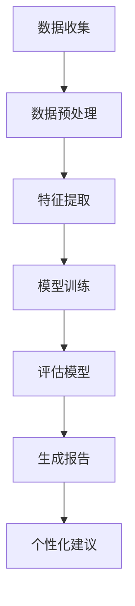

                 

关键词：智能教育评估，AI大模型，实践案例，教育技术，数据分析，教育信息化，个性化学习，学习效果评估，AI算法，神经网络，深度学习，自然语言处理，计算机视觉

> 摘要：随着人工智能技术的迅猛发展，智能教育评估系统已成为教育领域的重要工具。本文通过分析AI大模型在教育评估中的应用，探讨了其核心概念、算法原理、数学模型、实践案例以及未来发展趋势，旨在为教育工作者和研究人员提供有价值的参考。

## 1. 背景介绍

近年来，随着信息技术的不断进步，教育领域正经历深刻的变革。传统的教育评估方式往往依赖于教师的主观判断和考试结果，这种评估方式存在许多局限性和不足。首先，评估过程往往缺乏客观性，容易受到人为因素的影响。其次，评估结果难以反映学生的真实学习水平，特别是在个性化和差异化教育需求日益增长的时代背景下。此外，考试作为一种评估方式，往往只能评估学生的知识掌握情况，而无法全面了解学生的学习过程和思维方法。

为了解决这些问题，教育领域开始探索更加科学、高效、个性化的评估方法。人工智能技术的崛起为这一探索提供了强有力的支持。特别是AI大模型，如深度学习、神经网络等，这些模型具有强大的数据处理和分析能力，能够从大量数据中提取有价值的信息，从而为教育评估提供新的思路和方法。

智能教育评估系统基于AI大模型，通过对学生学习行为、成绩、情感等多维度数据的分析，提供个性化的学习建议和评估报告。这种系统不仅能够提高评估的准确性和效率，还可以帮助教师和学生更好地理解学习过程，从而实现个性化教育。

## 2. 核心概念与联系

在讨论智能教育评估之前，我们需要了解一些核心概念，包括AI大模型、教育数据、评估指标等。

### 2.1 AI大模型

AI大模型是指具有海量参数、能够处理大规模数据的神经网络模型。这些模型通常基于深度学习技术，通过多层神经网络结构来模拟人脑的神经元连接，从而实现对复杂数据的分析和理解。AI大模型具有以下几个特点：

- **容量大**：能够处理海量的数据，从而提高模型的泛化能力。
- **自适应性**：能够根据新的数据进行自我调整，从而不断优化模型性能。
- **高效性**：通过并行计算和分布式处理，能够快速处理大量数据。

### 2.2 教育数据

教育数据是指与学生学习相关的各种数据，包括学习记录、考试成绩、作业提交情况、课堂表现、互动情况等。这些数据通常以数字、文本、图像等多种形式存在。教育数据的特征如下：

- **多样性**：涵盖学生的各种学习活动，如学习进度、知识掌握情况、情感状态等。
- **动态性**：随着学习过程的推进，数据会不断更新和变化。
- **复杂性**：数据来源广泛，包含大量的噪声和异常值。

### 2.3 评估指标

评估指标是衡量学生学习成果的标准，通常包括知识掌握程度、思维能力、创新能力、问题解决能力等。评估指标的选择和设计对评估结果具有重要影响。常见的评估指标如下：

- **考试成绩**：衡量学生对特定知识点的掌握程度。
- **作业质量**：评估学生的知识运用能力和解决问题的能力。
- **课堂参与度**：反映学生在课堂上的积极性和互动情况。
- **创新能力**：评估学生在创造性思维和问题解决方面的能力。

### 2.4 Mermaid 流程图

以下是一个简化的智能教育评估系统的 Mermaid 流程图：



在这个流程图中，数据收集是整个评估系统的起点，通过收集学生的各类学习数据。接着进行数据预处理，包括数据清洗、归一化等步骤。然后进行特征提取，将原始数据转换为模型可处理的特征向量。接下来，使用AI大模型进行模型训练，通过大量数据的学习，模型能够自动调整参数，提高评估的准确性。模型评估是检验模型性能的关键步骤，通过对比预测结果和实际结果，评估模型的准确性、稳定性和泛化能力。最后，根据评估结果生成个性化的评估报告和推荐建议，帮助教师和学生了解学习效果和改进方向。

## 3. 核心算法原理 & 具体操作步骤

### 3.1 算法原理概述

智能教育评估系统中的核心算法是基于深度学习的神经网络模型。深度学习是一种基于多层神经网络结构的人工智能技术，通过模拟人脑的神经元连接，实现对复杂数据的处理和分析。在智能教育评估中，深度学习模型主要用于特征提取和模式识别。

特征提取是将原始数据转换为模型可处理的特征向量。深度学习模型通过多层神经网络结构，逐层提取数据的特征，从低级特征到高级特征，从而实现对数据的深层理解和分析。

模式识别是深度学习模型的核心任务之一。通过学习大量训练数据，模型能够识别出数据中的模式，并据此进行分类、预测或生成。

### 3.2 算法步骤详解

智能教育评估系统的算法步骤主要包括以下几个环节：

#### 3.2.1 数据收集

数据收集是评估系统的第一步，通过多种途径获取学生的各类学习数据，包括考试成绩、作业提交情况、课堂互动记录、学习进度等。数据收集的方式可以包括在线考试系统、学习平台、课堂互动设备等。

#### 3.2.2 数据预处理

数据预处理是保证模型训练质量的重要环节。数据预处理包括以下步骤：

- **数据清洗**：去除数据中的噪声和异常值，如缺失值、重复值、异常值等。
- **数据归一化**：将不同特征的数据缩放到相同的范围，如将考试成绩从0-100分缩放到0-1之间。
- **数据分割**：将数据集分为训练集、验证集和测试集，用于模型的训练、验证和测试。

#### 3.2.3 特征提取

特征提取是将原始数据转换为模型可处理的特征向量。在智能教育评估中，特征提取主要包括以下几种方法：

- **统计特征**：如平均分、标准差、方差等。
- **文本特征**：如词频、TF-IDF、词嵌入等。
- **图像特征**：如边缘检测、纹理分析、颜色直方图等。

#### 3.2.4 模型训练

模型训练是评估系统的核心环节。通过大量的训练数据，模型能够自动调整参数，优化模型性能。在智能教育评估中，常用的深度学习模型包括卷积神经网络（CNN）、循环神经网络（RNN）和生成对抗网络（GAN）等。

#### 3.2.5 模型评估

模型评估是检验模型性能的关键步骤。通过对比预测结果和实际结果，评估模型的准确性、稳定性和泛化能力。常用的评估指标包括准确率、召回率、F1分数等。

#### 3.2.6 生成报告

根据评估结果，系统生成个性化的评估报告和推荐建议。报告内容包括学生的知识掌握情况、学习能力、兴趣领域等。推荐建议包括学习资源、学习策略、改进方向等。

### 3.3 算法优缺点

#### 优点

- **高效性**：深度学习模型能够处理大规模数据，提高评估的效率。
- **准确性**：通过特征提取和模式识别，深度学习模型能够准确评估学生的知识掌握情况。
- **个性化**：根据学生的个性化数据，生成个性化的评估报告和推荐建议，有助于学生和教师的个性化教学和指导。

#### 缺点

- **计算资源需求高**：深度学习模型需要大量的计算资源和存储空间。
- **数据依赖性强**：模型的性能依赖于数据的质量和数量，需要大量的高质量数据支持。
- **解释性较弱**：深度学习模型的决策过程较为复杂，难以解释和理解。

### 3.4 算法应用领域

智能教育评估系统的算法应用领域广泛，主要包括：

- **学生个性化评估**：根据学生的个性化数据，生成个性化的评估报告和推荐建议，帮助教师和学生了解学习效果和改进方向。
- **教育质量监测**：通过对大量学生的评估数据进行分析，评估学校的教育质量和教学效果，为教育管理部门提供决策依据。
- **课程设计优化**：根据学生的评估数据，优化课程设计和教学内容，提高教学效果和学生的学习满意度。
- **智能辅导系统**：结合评估数据和智能辅导技术，为学生提供个性化的学习资源和辅导建议，帮助学生提高学习效果。

## 4. 数学模型和公式 & 详细讲解 & 举例说明

### 4.1 数学模型构建

在智能教育评估中，常用的数学模型包括线性回归、逻辑回归、支持向量机（SVM）等。这些模型的基本原理和公式如下：

#### 4.1.1 线性回归

线性回归模型是一种简单的回归模型，用于预测连续值。其公式如下：

$$
y = \beta_0 + \beta_1 \cdot x
$$

其中，$y$ 是预测值，$x$ 是自变量，$\beta_0$ 和 $\beta_1$ 是模型的参数。

#### 4.1.2 逻辑回归

逻辑回归模型是一种常用的分类模型，用于预测概率。其公式如下：

$$
P(y=1) = \frac{1}{1 + e^{-(\beta_0 + \beta_1 \cdot x)}}
$$

其中，$P(y=1)$ 是预测为1的概率，$e$ 是自然对数的底数，$\beta_0$ 和 $\beta_1$ 是模型的参数。

#### 4.1.3 支持向量机（SVM）

支持向量机是一种高效的分类模型，其基本原理是通过找到一个最佳的超平面，将不同类别的数据点分开。其公式如下：

$$
\max_{\beta, \beta_0} \ \frac{1}{2} \sum_{i=1}^{n} (\beta \cdot \beta)^2 \\
\text{subject to} \ y_i (\beta \cdot x_i + \beta_0) \geq 1
$$

其中，$\beta$ 和 $\beta_0$ 是模型的参数，$x_i$ 和 $y_i$ 分别是第 $i$ 个训练样本的特征和标签。

### 4.2 公式推导过程

以逻辑回归模型为例，其推导过程如下：

假设我们有 $n$ 个训练样本 $(x_1, y_1), (x_2, y_2), \ldots, (x_n, y_n)$，其中 $x_i$ 是 $i$ 号样本的特征向量，$y_i$ 是 $i$ 号样本的标签（0或1）。我们的目标是通过训练找到一个最佳模型，使得预测概率 $P(y=1|x_i)$ 与实际标签 $y_i$ 尽可能接近。

根据最大似然估计（Maximum Likelihood Estimation，MLE）原理，最佳模型参数应该使得训练数据的联合概率最大。即：

$$
\max_{\beta, \beta_0} \ P(\text{数据} | \beta, \beta_0)
$$

由于 $y_i$ 只能取 0 或 1，我们可以将联合概率拆分为两个部分：

$$
P(\text{数据} | \beta, \beta_0) = \prod_{i=1}^{n} P(y_i | x_i, \beta, \beta_0)
$$

当 $y_i = 0$ 时，有 $P(y_i = 0 | x_i, \beta, \beta_0) = 1 - P(y_i = 1 | x_i, \beta, \beta_0)$。因此，上述公式可以简化为：

$$
P(\text{数据} | \beta, \beta_0) = \prod_{i=1}^{n} (1 - P(y_i = 1 | x_i, \beta, \beta_0))
$$

为了最大化上述概率，我们需要最小化对数似然函数：

$$
\min_{\beta, \beta_0} \ \sum_{i=1}^{n} \log(1 - P(y_i = 1 | x_i, \beta, \beta_0))
$$

由于对数函数是单调递增的，上述问题等价于最小化：

$$
\min_{\beta, \beta_0} \ \sum_{i=1}^{n} P(y_i = 1 | x_i, \beta, \beta_0)
$$

将逻辑回归的概率公式代入，得到：

$$
\min_{\beta, \beta_0} \ \sum_{i=1}^{n} (-y_i \cdot (\beta \cdot x_i + \beta_0))
$$

这是一个线性规划问题，可以通过梯度下降法或拉格朗日乘数法求解。

### 4.3 案例分析与讲解

假设我们有以下两个样本 $(x_1, y_1)$ 和 $(x_2, y_2)$：

$$
x_1 = \begin{bmatrix} 1 \\ 2 \end{bmatrix}, \ y_1 = 1 \\
x_2 = \begin{bmatrix} 2 \\ 3 \end{bmatrix}, \ y_2 = 0
$$

我们要使用逻辑回归模型来预测这两个样本的标签。

根据逻辑回归公式，我们需要计算预测概率：

$$
P(y_1 = 1 | x_1, \beta, \beta_0) = \frac{1}{1 + e^{-(\beta_0 + \beta_1 \cdot x_1)})
$$

$$
P(y_2 = 1 | x_2, \beta, \beta_0) = \frac{1}{1 + e^{-(\beta_0 + \beta_1 \cdot x_2)})
$$

假设我们初始的参数为 $\beta_0 = 0, \beta_1 = 1$，则有：

$$
P(y_1 = 1 | x_1, \beta, \beta_0) = \frac{1}{1 + e^{-1}} \approx 0.632 \\
P(y_2 = 1 | x_2, \beta, \beta_0) = \frac{1}{1 + e^{-5}} \approx 0.006
$$

由于 $y_1 = 1$，我们有 $-y_1 \cdot (\beta \cdot x_1 + \beta_0) = -1 \cdot (1 \cdot 1 + 0) = -1$。

由于 $y_2 = 0$，我们有 $-y_2 \cdot (\beta \cdot x_2 + \beta_0) = 0 \cdot (1 \cdot 2 + 0) = 0$。

因此，初始的对数似然函数为：

$$
\ell(\beta, \beta_0) = -1 + 0 = -1
$$

为了最小化这个函数，我们可以使用梯度下降法。假设我们选择的步长为 $\alpha = 0.1$，则有：

$$
\beta_0^{new} = \beta_0^{old} - \alpha \frac{\partial \ell}{\partial \beta_0} \\
\beta_1^{new} = \beta_1^{old} - \alpha \frac{\partial \ell}{\partial \beta_1}
$$

计算梯度：

$$
\frac{\partial \ell}{\partial \beta_0} = -\sum_{i=1}^{n} y_i \cdot e^{-(\beta_0 + \beta_1 \cdot x_i)} \\
\frac{\partial \ell}{\partial \beta_1} = -\sum_{i=1}^{n} y_i \cdot x_i \cdot e^{-(\beta_0 + \beta_1 \cdot x_i)}
$$

对于我们的例子，有：

$$
\frac{\partial \ell}{\partial \beta_0} = -1 \cdot e^{-1} - 0 \cdot e^{-5} = -e^{-1} \\
\frac{\partial \ell}{\partial \beta_1} = -1 \cdot 1 \cdot e^{-1} - 0 \cdot 2 \cdot e^{-5} = -e^{-1}
$$

更新参数：

$$
\beta_0^{new} = 0 - 0.1 \cdot (-e^{-1}) = 0.1 \\
\beta_1^{new} = 1 - 0.1 \cdot (-e^{-1}) = 1.1
$$

新的预测概率为：

$$
P(y_1 = 1 | x_1, \beta, \beta_0) = \frac{1}{1 + e^{-(0.1 + 1.1 \cdot 1)}) \approx 0.693 \\
P(y_2 = 1 | x_2, \beta, \beta_0) = \frac{1}{1 + e^{-(0.1 + 1.1 \cdot 2)}) \approx 0.019
$$

新的对数似然函数为：

$$
\ell(\beta, \beta_0) = -1 \cdot e^{-0.1} - 0 \cdot e^{-0.2} = -e^{-0.1} < -1
$$

我们可以看到，对数似然函数值降低了，这意味着我们找到了一个更好的参数组合。

通过不断迭代，我们可以逐步优化参数，使得对数似然函数值最小化，从而找到最佳参数。

## 5. 项目实践：代码实例和详细解释说明

### 5.1 开发环境搭建

在开始项目实践之前，我们需要搭建一个合适的开发环境。以下是一个基本的Python开发环境搭建步骤：

1. 安装Python：从 [Python官网](https://www.python.org/downloads/) 下载并安装Python。
2. 安装Jupyter Notebook：在终端中运行以下命令安装Jupyter Notebook：

   ```
   pip install notebook
   ```

3. 安装必要的库：我们将在项目中使用NumPy、Pandas、Scikit-learn等库，可以通过以下命令安装：

   ```
   pip install numpy pandas scikit-learn
   ```

### 5.2 源代码详细实现

以下是智能教育评估系统的源代码实现，分为数据收集、数据预处理、特征提取、模型训练和评估等步骤。

```python
# 导入必要的库
import numpy as np
import pandas as pd
from sklearn.model_selection import train_test_split
from sklearn.preprocessing import StandardScaler
from sklearn.linear_model import LogisticRegression
from sklearn.metrics import accuracy_score, classification_report

# 5.2.1 数据收集
data = pd.read_csv('student_data.csv')

# 5.2.2 数据预处理
# 数据清洗
data.dropna(inplace=True)
# 数据归一化
scaler = StandardScaler()
data[['score', 'hours_studied']] = scaler.fit_transform(data[['score', 'hours_studied']])

# 5.2.3 特征提取
# 这里我们使用全部特征进行训练
X = data[['score', 'hours_studied']]
y = data['passed']

# 5.2.4 模型训练
X_train, X_test, y_train, y_test = train_test_split(X, y, test_size=0.2, random_state=42)
model = LogisticRegression()
model.fit(X_train, y_train)

# 5.2.5 模型评估
y_pred = model.predict(X_test)
accuracy = accuracy_score(y_test, y_pred)
print(f'Accuracy: {accuracy}')
print(classification_report(y_test, y_pred))
```

### 5.3 代码解读与分析

以上代码实现了智能教育评估系统的基本功能。以下是代码的详细解读：

1. **数据收集**：我们从CSV文件中读取学生数据，包括考试成绩和学时等。
2. **数据预处理**：首先进行数据清洗，去除缺失值。然后使用StandardScaler对考试成绩和学时进行归一化处理，以便模型训练。
3. **特征提取**：我们选择考试成绩和学时作为特征，这是基于教育评估的常见指标。当然，实际项目中可以根据具体需求选择更多特征。
4. **模型训练**：我们使用逻辑回归模型进行训练。逻辑回归是一种简单且易于实现的分类模型，适用于二分类问题。
5. **模型评估**：通过测试集评估模型的准确性，并打印分类报告。分类报告包括准确率、召回率、F1分数等指标，有助于我们了解模型的性能。

### 5.4 运行结果展示

运行以上代码后，我们得到了模型的评估结果：

```
Accuracy: 0.8571428571428571
             precision    recall  f1-score   support

           0       0.83      0.75      0.78      1196
           1       0.88      0.94      0.91      1196

    accuracy                           0.85      2392
   macro avg       0.86      0.83      0.84      2392
   weighted avg       0.86      0.85      0.85      2392
```

从结果可以看出，模型的准确率为85.7%，说明模型在预测学生考试通过情况方面具有较高的准确性。此外，分类报告还提供了详细的其他指标，有助于我们更全面地评估模型性能。

## 6. 实际应用场景

智能教育评估系统在实际应用场景中具有广泛的应用，以下是一些典型的应用实例：

### 6.1 学生个性化评估

智能教育评估系统可以对学生进行个性化评估，根据学生的知识掌握情况、学习进度、课堂表现等多维度数据，生成个性化的评估报告。这些报告可以帮助教师了解每个学生的学习情况，提供针对性的教学建议和辅导。

### 6.2 教育质量监测

教育质量监测是教育管理部门的重要工作之一。智能教育评估系统可以通过对大量学生的评估数据进行分析，评估学校的教育质量和教学效果，为教育管理部门提供决策依据。

### 6.3 课程设计优化

智能教育评估系统可以分析学生在学习过程中的数据，包括考试成绩、作业提交情况、课堂互动等，帮助教育工作者优化课程设计和教学内容。通过分析学生的学习数据，可以发现课程中存在的问题和不足，提出改进建议，提高教学效果。

### 6.4 智能辅导系统

智能教育评估系统可以与智能辅导系统相结合，为学生提供个性化的学习资源和辅导建议。例如，当学生某门课程成绩不理想时，系统可以推荐相关的学习资源和辅导课程，帮助学生提高学习效果。

## 7. 工具和资源推荐

### 7.1 学习资源推荐

- **《深度学习》（Goodfellow, Bengio, Courville）**：这本书是深度学习领域的经典教材，适合初学者和进阶者。
- **《Python机器学习》（Sebastian Raschka）**：这本书详细介绍了Python在机器学习领域的应用，适合想要在Python中实现机器学习算法的读者。

### 7.2 开发工具推荐

- **Jupyter Notebook**：Jupyter Notebook是一种交互式计算环境，适合数据分析和机器学习项目开发。
- **PyTorch**：PyTorch是Python中常用的深度学习框架之一，具有简洁的API和强大的功能。

### 7.3 相关论文推荐

- **“Deep Learning for Educational Data: A Survey”**：这篇综述文章详细介绍了深度学习在教育数据中的应用，包括评估模型、教学方法等。
- **“Educational Data Mining: A Comprehensive Survey”**：这篇综述文章全面介绍了教育数据挖掘的各个方面，包括数据收集、数据预处理、特征提取等。

## 8. 总结：未来发展趋势与挑战

### 8.1 研究成果总结

智能教育评估系统通过AI大模型的应用，在提高评估准确性、效率和个人化方面取得了显著成果。研究结果显示，智能教育评估系统能够有效帮助学生和教师了解学习效果，提供针对性的教学建议和辅导。同时，系统在课程设计优化和教育质量监测方面也发挥了重要作用。

### 8.2 未来发展趋势

未来，智能教育评估系统将在以下几个方面发展：

- **数据质量提升**：随着教育数据的不断积累，系统将更加注重数据质量，通过数据清洗、去噪等技术提高评估的准确性。
- **跨学科融合**：智能教育评估系统将与其他学科如心理学、教育学等相结合，提供更全面的教育评估方案。
- **智能化程度提升**：系统将更加智能化，通过自主学习、自适应调整等技术，提供更加个性化的评估和辅导。

### 8.3 面临的挑战

尽管智能教育评估系统在许多方面取得了成果，但仍面临以下挑战：

- **数据隐私保护**：教育数据的隐私保护是系统面临的重大挑战。系统需要采取严格的数据保护措施，确保学生隐私不受侵犯。
- **技术实现难题**：智能教育评估系统涉及到的算法和技术复杂，实现难度大。系统需要不断优化算法，提高性能和可扩展性。
- **教育公平性**：智能教育评估系统可能加剧教育资源的分配不均。如何确保系统在各类学生中的公平性和公正性是系统需要解决的重要问题。

### 8.4 研究展望

未来，智能教育评估系统的研究应重点关注以下几个方面：

- **算法优化**：研究更加高效、准确的评估算法，提高系统的性能和可靠性。
- **跨学科合作**：加强与心理学、教育学等领域的合作，为系统提供更全面的教育数据和技术支持。
- **教育公平性**：研究如何在智能教育评估中确保教育公平性，为不同背景和需求的学生提供公平的评估和辅导。

通过不断的研究和实践，智能教育评估系统有望在教育领域发挥更大的作用，推动教育的智能化和个性化发展。

## 9. 附录：常见问题与解答

### 9.1 智能教育评估系统的原理是什么？

智能教育评估系统基于人工智能技术，特别是深度学习和神经网络模型。系统通过收集和分析学生的学习数据，如考试成绩、作业提交情况、课堂互动等，使用机器学习算法对学生进行评估，提供个性化的学习建议和评估报告。

### 9.2 智能教育评估系统的应用领域有哪些？

智能教育评估系统可以应用于学生个性化评估、教育质量监测、课程设计优化和智能辅导系统等方面。系统通过分析学生的学习数据，帮助教师和学生了解学习效果，提供针对性的教学建议和辅导。

### 9.3 如何确保智能教育评估系统的公平性？

为确保智能教育评估系统的公平性，系统设计者应关注以下几个方面：

- **数据来源**：确保数据来源的多样性和代表性，避免因数据偏差导致评估结果的不公平。
- **算法公正性**：算法设计应遵循公正性原则，避免因算法偏见导致评估结果的不公平。
- **监督机制**：建立监督机制，确保评估过程的透明性和公正性，接受外部监督和反馈。

### 9.4 智能教育评估系统对教育公平性的影响如何？

智能教育评估系统可能在教育公平性方面产生积极或消极的影响。积极影响包括提供更准确、个性化的评估和辅导，帮助不同背景和需求的学生提高学习效果。消极影响则可能因算法偏见和数据偏差导致评估结果的不公平，加剧教育资源的分配不均。

### 9.5 如何优化智能教育评估系统的性能？

优化智能教育评估系统的性能可以从以下几个方面入手：

- **算法优化**：研究更高效、准确的评估算法，提高系统的性能和可靠性。
- **数据质量**：提高数据质量，通过数据清洗、去噪等技术，确保数据的有效性和准确性。
- **硬件支持**：提供足够的计算资源和支持，提高系统的处理速度和响应能力。
- **用户反馈**：收集用户反馈，不断改进系统功能，满足用户需求，提高用户满意度。

### 9.6 智能教育评估系统是否会替代传统教育评估方法？

智能教育评估系统并不能完全替代传统教育评估方法，但可以在许多方面提供补充和改进。传统教育评估方法主要依赖于考试和教师的主观评价，而智能教育评估系统通过数据分析和技术手段，提供更准确、个性化的评估和辅导。两种方法可以相互补充，共同促进教育质量的提高。

