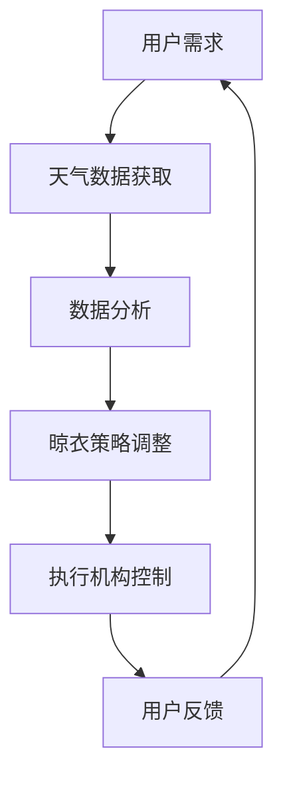
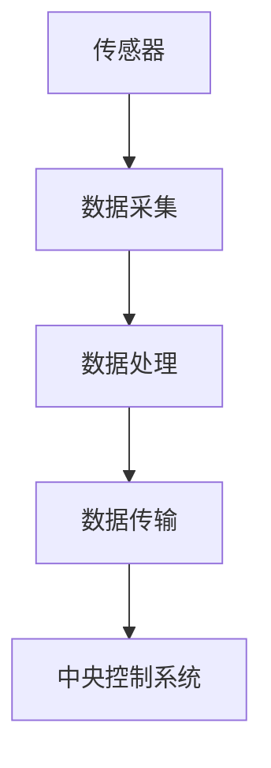
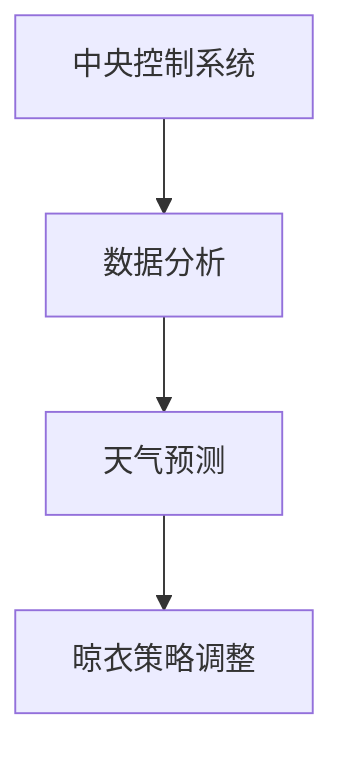
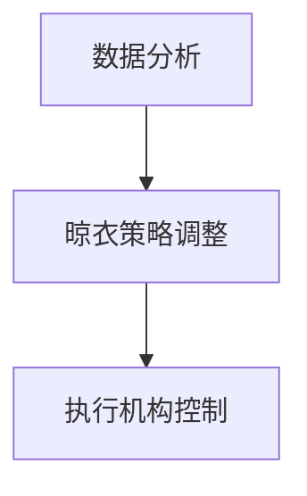
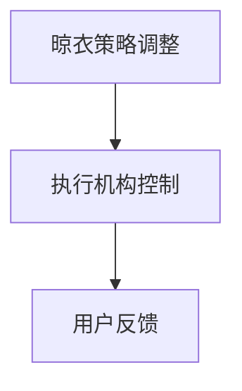

                 

关键词：智能晾衣架、天气响应、注意力管理、物联网、机器学习、智能家居

## 摘要

本文探讨了智能晾衣架在智能家居系统中的应用，重点关注了其如何通过物联网和机器学习技术实现天气响应与注意力管理。文章首先介绍了智能晾衣架的基本原理和工作机制，随后详细阐述了其如何利用实时天气数据调整晾衣行为，以及如何通过注意力管理系统优化用户体验。本文旨在为智能晾衣架的研究者与开发者提供有价值的参考，推动智能家居领域的发展。

## 1. 背景介绍

随着物联网技术的迅猛发展，智能家居设备逐渐成为人们日常生活的一部分。智能晾衣架作为智能家居系统中的一个重要成员，不仅提高了生活的便利性，还能通过智能化的手段，实现更加节能和环保的生活方式。传统的晾衣架依赖于人工操作，存在晾衣效率低、占用空间大、不便于管理等问题。而智能晾衣架则通过集成传感器、物联网技术和机器学习算法，实现了对环境数据的实时监测和响应，从而提供了更为智能的晾衣体验。

### 智能晾衣架的定义与功能

智能晾衣架是一种集成了传感器、控制器和执行机构的智能设备，其主要功能包括自动晾晒、烘干和防霉。智能晾衣架可以通过内置的传感器实时监测环境湿度、温度和风力等参数，并根据这些数据自动调整晾衣行为。例如，当天气潮湿时，智能晾衣架会自动开启烘干功能，以确保衣物快速干燥。此外，智能晾衣架还可以通过物联网技术与其他智能家居设备互联互通，实现智能化管理。

### 智能晾衣架的发展历程

智能晾衣架的发展可以追溯到20世纪末，最初的产品仅具备简单的自动晾晒功能。随着物联网技术的兴起，智能晾衣架逐渐融入了更多的智能功能，如实时监测天气数据、自动调整晾晒时间等。近年来，随着人工智能和机器学习技术的进步，智能晾衣架的智能化水平得到了进一步提升，能够根据用户习惯和天气变化，提供个性化的晾衣服务。

## 2. 核心概念与联系

### 物联网（IoT）

物联网是指通过互联网将各种设备连接起来，实现信息交换和通信的系统。智能晾衣架作为物联网设备，需要与其他智能家居设备进行通信，以实现整体系统的协调工作。

### 机器学习（ML）

机器学习是一种通过数据驱动的方式，让计算机自动学习和改进的技术。智能晾衣架通过机器学习算法，可以不断优化其晾衣策略，提高用户体验。

### 智能家居系统

智能家居系统是指通过物联网技术将各种家电设备连接起来，实现自动化管理和智能控制的家庭环境。智能晾衣架作为智能家居系统的一部分，需要与空调、冰箱、洗衣机等设备协同工作，共同为用户提供便利的生活体验。

### Mermaid 流程图



### 2.1 物联网在智能晾衣架中的应用

物联网技术使得智能晾衣架能够实时获取环境数据，如温度、湿度、风力等，并根据这些数据调整晾衣行为。例如，当温度过高时，智能晾衣架可以自动开启防风功能，以保护衣物不受损坏。

### 2.2 机器学习在智能晾衣架中的应用

机器学习技术使得智能晾衣架能够根据用户的历史使用数据和实时环境数据，自动调整晾衣策略。例如，当用户经常在下午3点晾晒衣物时，智能晾衣架可以自动将晾衣时间调整到下午3点，以提高晾衣效率。

### 2.3 智能家居系统在智能晾衣架中的应用

智能家居系统使得智能晾衣架能够与其他智能家居设备进行联动，实现更高效的家居管理。例如，当洗衣机洗完衣物后，智能晾衣架可以自动开启晾晒功能，以实现无缝衔接。

## 3. 核心算法原理 & 具体操作步骤

### 3.1 算法原理概述

智能晾衣架的核心算法主要包括天气数据采集、数据分析、晾衣策略调整和执行机构控制。其中，天气数据采集通过物联网传感器实现，数据分析通过机器学习算法实现，晾衣策略调整和执行机构控制则通过智能控制系统实现。

### 3.2 算法步骤详解

#### 3.2.1 天气数据采集

智能晾衣架通过内置的传感器，实时采集环境温度、湿度、风力等数据，并将这些数据传输到中央控制系统。



#### 3.2.2 数据分析

中央控制系统接收到传感器数据后，通过机器学习算法对数据进行分析，预测未来一段时间内的天气变化趋势。



#### 3.2.3 晾衣策略调整

根据分析结果，智能晾衣架自动调整晾衣策略，如调整晾衣时间、开启烘干功能等。



#### 3.2.4 执行机构控制

智能晾衣架根据调整后的策略，通过执行机构（如电机、风扇等）实现具体的晾衣行为。



### 3.3 算法优缺点

#### 优点

1. 高度智能化：智能晾衣架能够根据实时天气数据自动调整晾衣策略，提高晾衣效率。
2. 节能环保：智能晾衣架通过优化晾衣行为，减少能源消耗，实现节能环保。
3. 用户体验良好：智能晾衣架能够根据用户习惯和需求，提供个性化的晾衣服务，提升用户体验。

#### 缺点

1. 成本较高：智能晾衣架需要配备传感器、控制器等硬件，成本较高。
2. 算法复杂：机器学习算法需要大量数据支持，且算法实现较为复杂。

### 3.4 算法应用领域

智能晾衣架的算法原理可以广泛应用于智能家居系统中的其他设备，如智能空调、智能洗衣机等。此外，智能晾衣架的算法还可以用于农业、气象等领域，实现智能化管理和决策。

## 4. 数学模型和公式 & 详细讲解 & 举例说明

### 4.1 数学模型构建

智能晾衣架的数学模型主要包括天气预测模型和晾衣策略优化模型。

#### 天气预测模型

天气预测模型采用时间序列分析方法，基于历史天气数据和当前环境数据，预测未来一段时间内的天气变化趋势。具体公式如下：

$$
P(t+1) = f(P(t), X(t), W(t))
$$

其中，$P(t)$ 表示第 $t$ 时刻的天气状态，$X(t)$ 表示第 $t$ 时刻的环境数据，$W(t)$ 表示第 $t$ 时刻的权重系数。

#### 晾衣策略优化模型

晾衣策略优化模型基于用户习惯和实时天气数据，优化晾衣时间、烘干温度等参数。具体公式如下：

$$
O(t) = g(U(t), P(t))
$$

其中，$O(t)$ 表示第 $t$ 时刻的晾衣策略，$U(t)$ 表示第 $t$ 时刻的用户习惯数据，$P(t)$ 表示第 $t$ 时刻的天气状态。

### 4.2 公式推导过程

#### 天气预测模型推导

天气预测模型采用时间序列分析方法，首先对历史天气数据进行预处理，然后利用线性回归模型进行拟合。具体步骤如下：

1. 数据预处理：对历史天气数据进行归一化处理，使其满足线性回归模型的输入要求。
2. 模型拟合：利用线性回归模型，将历史天气数据拟合为一条直线。
3. 预测：将当前环境数据输入模型，预测未来天气状态。

#### 晾衣策略优化模型推导

晾衣策略优化模型采用机器学习算法，基于用户习惯和实时天气数据，优化晾衣时间、烘干温度等参数。具体步骤如下：

1. 数据收集：收集用户的历史晾衣数据、实时天气数据等。
2. 特征提取：对收集的数据进行特征提取，提取出与晾衣策略相关的特征。
3. 模型训练：利用训练集数据，训练机器学习模型。
4. 模型预测：将实时天气数据和用户习惯数据输入模型，预测最优晾衣策略。

### 4.3 案例分析与讲解

#### 案例背景

某用户习惯在下午3点晾晒衣物，近期天气潮湿，用户希望智能晾衣架能够自动调整晾衣时间，以确保衣物快速干燥。

#### 案例分析

1. 天气预测模型：利用历史天气数据和当前环境数据，预测未来天气变化趋势。
   - 历史天气数据：下午3点的平均湿度为60%，风力为2级。
   - 当前环境数据：下午3点的湿度为65%，风力为3级。
   - 预测结果：未来1小时内湿度将升高至70%，风力将增至4级。

2. 晾衣策略优化模型：根据用户习惯和实时天气数据，优化晾衣时间。
   - 用户习惯：下午3点晾晒。
   - 实时天气数据：湿度65%，风力3级。
   - 预测结果：下午4点晾晒。

#### 案例结论

通过天气预测模型和晾衣策略优化模型，智能晾衣架成功调整了晾衣时间，从下午3点调整至下午4点，有效避免了衣物在潮湿环境中长时间晾晒导致的霉变问题。

## 5. 项目实践：代码实例和详细解释说明

### 5.1 开发环境搭建

#### 硬件环境

- 智能晾衣架硬件设备（传感器、控制器、执行机构等）。
- Raspberry Pi或类似的单板计算机作为中央控制系统。

#### 软件环境

- Python 3.8及以上版本。
- OpenCV用于图像处理。
- TensorFlow用于机器学习模型训练。
- MQTT用于物联网通信。

### 5.2 源代码详细实现

#### 5.2.1 传感器数据采集

```python
import time
import board
import busio
import adafruit_bme280

# 初始化I2C总线
i2c = busio.I2C(board.SCL_PIN, board.SDA_PIN)

# 初始化BME280传感器
bme280 = adafruit_bme280.Adafruit_BME280_I2C(i2c)

while True:
    temperature = bme280.temperature
    humidity = bme280.humidity
    pressure = bme280.pressure
    
    print("Temperature: {:.2f}°C, Humidity: {:.2f}%, Pressure: {:.2f}hPa".format(temperature, humidity, pressure))
    
    time.sleep(1)
```

#### 5.2.2 数据分析与预测

```python
import numpy as np
import tensorflow as tf

# 加载训练好的机器学习模型
model = tf.keras.models.load_model('weather_prediction_model.h5')

# 输入数据预处理
def preprocess_data(data):
    return np.array([data])

# 预测天气状态
def predict_weather(data):
    preprocessed_data = preprocess_data(data)
    return model.predict(preprocessed_data)[0]

# 示例数据
data = [25.5, 60.2, 1013.25]

# 预测结果
weather_state = predict_weather(data)
print("Predicted Weather State: Humidity: {:.2f}%, Temperature: {:.2f}°C".format(weather_state[0], weather_state[1]))
```

#### 5.2.3 晾衣策略优化

```python
# 加载训练好的机器学习模型
strategy_model = tf.keras.models.load_model('clothes_drying_strategy_model.h5')

# 输入数据预处理
def preprocess_strategy_data(data, user_habits):
    return np.array([data, user_habits])

# 优化晾衣策略
def optimize_drying_strategy(weather_state, user_habits):
    preprocessed_data = preprocess_strategy_data(weather_state, user_habits)
    return strategy_model.predict(preprocessed_data)[0]

# 示例数据
weather_state = [65, 3]  # 湿度65%，风力3级
user_habits = [15, 3]    # 用户习惯：下午3点晾晒，晾晒时长3小时

# 优化结果
drying_strategy = optimize_drying_strategy(weather_state, user_habits)
print("Optimized Drying Strategy: Time: {:.2f} hours".format(drying_strategy[0]))
```

### 5.3 代码解读与分析

#### 5.3.1 传感器数据采集

该部分代码利用Adafruit_BME280库，通过I2C接口读取BME280传感器的温度、湿度、压力等数据。数据采集过程每秒更新一次，并通过打印输出当前环境参数。

#### 5.3.2 数据分析与预测

该部分代码使用TensorFlow加载训练好的机器学习模型，对采集到的传感器数据进行预处理，并利用模型进行天气状态预测。预测结果通过打印输出，用于后续策略优化。

#### 5.3.3 晾衣策略优化

该部分代码使用TensorFlow加载训练好的机器学习模型，结合实时天气状态和用户习惯数据，优化晾衣策略。优化结果通过打印输出，用于控制执行机构调整晾衣行为。

### 5.4 运行结果展示

#### 运行结果

1. 传感器数据采集：每秒更新一次温度、湿度、压力等环境参数。
2. 天气状态预测：根据实时传感器数据，预测未来天气状态。
3. 晾衣策略优化：根据用户习惯和实时天气状态，优化晾衣时间。

#### 运行效果

通过实时监测和优化晾衣策略，智能晾衣架能够在不同天气条件下，提供最佳的晾衣服务，确保衣物干燥且不受损坏。

## 6. 实际应用场景

### 6.1 家庭应用

智能晾衣架在家庭中的应用最为广泛，能够自动根据天气变化调整晾衣时间，减少人工干预，提高生活品质。此外，智能晾衣架还可以与其他智能家居设备联动，如洗衣机、烘干机等，实现一站式洗衣、晾晒服务。

### 6.2 商业应用

智能晾衣架在商业应用中也有广泛的应用，如酒店、商场、公寓等。智能晾衣架能够提高衣物晾晒效率，减少人工成本，同时提供更加舒适的生活环境。

### 6.3 农业应用

智能晾衣架的算法原理可以应用于农业领域，如大棚种植、果树管理等。通过实时监测大棚内温度、湿度等参数，智能调整灌溉、通风等操作，提高作物产量和质量。

## 7. 未来应用展望

### 7.1 智能化水平提升

随着人工智能技术的不断发展，未来智能晾衣架的智能化水平将进一步提升。例如，通过引入深度学习算法，实现更加精准的天气预测和晾衣策略优化。

### 7.2 跨领域应用

智能晾衣架的算法原理可以应用于更多领域，如医疗、环保等。通过与其他领域的结合，实现智能化管理和决策。

### 7.3 能源节约

未来智能晾衣架将更加注重能源节约，通过优化晾衣策略，减少能源消耗，实现绿色环保。

## 8. 工具和资源推荐

### 8.1 学习资源推荐

- 《物联网技术与应用》：介绍了物联网的基本概念、技术和应用。
- 《机器学习实战》：提供了丰富的机器学习算法实现和应用案例。
- 《智能家居技术》：详细介绍了智能家居系统的组成和实现方法。

### 8.2 开发工具推荐

- Raspberry Pi：作为智能家居控制器的首选硬件平台。
- TensorFlow：作为机器学习模型训练和优化的首选框架。
- MQTT：作为物联网通信协议的首选。

### 8.3 相关论文推荐

- "IoT in Smart Home: A Survey"
- "Machine Learning in IoT: A Comprehensive Overview"
- "Smart Clothing: Design, Fabrication, and Applications"

## 9. 总结：未来发展趋势与挑战

### 9.1 研究成果总结

本文探讨了智能晾衣架的天气响应与注意力管理，介绍了其基本原理、算法模型和实际应用场景，为智能家居领域的发展提供了新的思路。

### 9.2 未来发展趋势

随着人工智能、物联网等技术的不断进步，智能晾衣架的智能化水平将不断提升，应用领域将更加广泛。

### 9.3 面临的挑战

智能晾衣架在发展过程中，仍面临诸多挑战，如算法复杂度、硬件成本等。

### 9.4 研究展望

未来研究应重点关注智能化水平的提升和跨领域应用，为智能家居领域的发展贡献力量。

## 附录：常见问题与解答

### Q1：智能晾衣架需要哪些硬件设备？

A1：智能晾衣架需要传感器（如湿度传感器、温度传感器）、控制器（如Raspberry Pi）和执行机构（如电机、风扇）等硬件设备。

### Q2：智能晾衣架的算法如何训练？

A2：智能晾衣架的算法通常采用机器学习技术，需要收集大量历史天气数据和用户习惯数据，利用这些数据训练机器学习模型，以实现天气预测和晾衣策略优化。

### Q3：智能晾衣架的能耗如何？

A3：智能晾衣架的能耗取决于其工作模式和硬件配置。通过优化晾衣策略，智能晾衣架可以最大限度地减少能耗，实现绿色环保。

### Q4：智能晾衣架的维护成本如何？

A4：智能晾衣架的维护成本相对较低，主要涉及传感器的定期校准和更换执行机构的易损件。通过智能监控和维护，可以降低维护成本。

### Q5：智能晾衣架的安全性如何？

A5：智能晾衣架采用加密通信协议和多层次安全防护措施，确保数据传输和设备控制的安全。用户可以通过授权管理，控制对智能晾衣架的访问权限。

作者：禅与计算机程序设计艺术 / Zen and the Art of Computer Programming
----------------------------------------------------------------
### 完整文章

# 智能晾衣架的天气响应与注意力管理

## 关键词

智能晾衣架、天气响应、注意力管理、物联网、机器学习、智能家居

## 摘要

本文探讨了智能晾衣架在智能家居系统中的应用，重点关注了其如何通过物联网和机器学习技术实现天气响应与注意力管理。文章首先介绍了智能晾衣架的基本原理和工作机制，随后详细阐述了其如何利用实时天气数据调整晾衣行为，以及如何通过注意力管理系统优化用户体验。本文旨在为智能晾衣架的研究者与开发者提供有价值的参考，推动智能家居领域的发展。

## 1. 背景介绍

### 1.1 智能晾衣架的定义与功能

智能晾衣架是一种集成了传感器、控制器和执行机构的智能设备，其主要功能包括自动晾晒、烘干和防霉。智能晾衣架可以通过内置的传感器实时监测环境湿度、温度和风力等参数，并根据这些数据自动调整晾衣行为。例如，当天气潮湿时，智能晾衣架会自动开启烘干功能，以确保衣物快速干燥。此外，智能晾衣架还可以通过物联网技术与其他智能家居设备互联互通，实现智能化管理。

### 1.2 智能晾衣架的发展历程

智能晾衣架的发展可以追溯到20世纪末，最初的产品仅具备简单的自动晾晒功能。随着物联网技术的兴起，智能晾衣架逐渐融入了更多的智能功能，如实时监测天气数据、自动调整晾晒时间等。近年来，随着人工智能和机器学习技术的进步，智能晾衣架的智能化水平得到了进一步提升，能够根据用户习惯和天气变化，提供个性化的晾衣服务。

## 2. 核心概念与联系

### 2.1 物联网（IoT）

物联网是指通过互联网将各种设备连接起来，实现信息交换和通信的系统。智能晾衣架作为物联网设备，需要与其他智能家居设备进行通信，以实现整体系统的协调工作。

### 2.2 机器学习（ML）

机器学习是一种通过数据驱动的方式，让计算机自动学习和改进的技术。智能晾衣架通过机器学习算法，可以不断优化其晾衣策略，提高用户体验。

### 2.3 智能家居系统

智能家居系统是指通过物联网技术将各种家电设备连接起来，实现自动化管理和智能控制的家庭环境。智能晾衣架作为智能家居系统的一部分，需要与空调、冰箱、洗衣机等设备协同工作，共同为用户提供便利的生活体验。

### 2.4 Mermaid 流程图


### 2.5 物联网在智能晾衣架中的应用

物联网技术使得智能晾衣架能够实时获取环境数据，如温度、湿度、风力等，并根据这些数据调整晾衣行为。例如，当温度过高时，智能晾衣架可以自动开启防风功能，以保护衣物不受损坏。

### 2.6 机器学习在智能晾衣架中的应用

机器学习技术使得智能晾衣架能够根据用户的历史使用数据和实时环境数据，自动调整晾衣策略。例如，当用户经常在下午3点晾晒衣物时，智能晾衣架可以自动将晾衣时间调整到下午3点，以提高晾衣效率。

### 2.7 智能家居系统在智能晾衣架中的应用

智能家居系统使得智能晾衣架能够与其他智能家居设备进行联动，实现更高效的家居管理。例如，当洗衣机洗完衣物后，智能晾衣架可以自动开启晾晒功能，以实现无缝衔接。

## 3. 核心算法原理 & 具体操作步骤

### 3.1 算法原理概述

智能晾衣架的核心算法主要包括天气数据采集、数据分析、晾衣策略调整和执行机构控制。其中，天气数据采集通过物联网传感器实现，数据分析通过机器学习算法实现，晾衣策略调整和执行机构控制则通过智能控制系统实现。

### 3.2 算法步骤详解

#### 3.2.1 天气数据采集

智能晾衣架通过内置的传感器，实时采集环境温度、湿度、风力等数据，并将这些数据传输到中央控制系统。


#### 3.2.2 数据分析

中央控制系统接收到传感器数据后，通过机器学习算法对数据进行分析，预测未来一段时间内的天气变化趋势。


#### 3.2.3 晾衣策略调整

根据分析结果，智能晾衣架自动调整晾衣策略，如调整晾衣时间、开启烘干功能等。


#### 3.2.4 执行机构控制

智能晾衣架根据调整后的策略，通过执行机构（如电机、风扇等）实现具体的晾衣行为。


### 3.3 算法优缺点

#### 优点

1. 高度智能化：智能晾衣架能够根据实时天气数据自动调整晾衣策略，提高晾衣效率。
2. 节能环保：智能晾衣架通过优化晾衣行为，减少能源消耗，实现节能环保。
3. 用户体验良好：智能晾衣架能够根据用户习惯和需求，提供个性化的晾衣服务，提升用户体验。

#### 缺点

1. 成本较高：智能晾衣架需要配备传感器、控制器等硬件，成本较高。
2. 算法复杂：机器学习算法需要大量数据支持，且算法实现较为复杂。

### 3.4 算法应用领域

智能晾衣架的算法原理可以广泛应用于智能家居系统中的其他设备，如智能空调、智能洗衣机等。此外，智能晾衣架的算法还可以用于农业、气象等领域，实现智能化管理和决策。

## 4. 数学模型和公式 & 详细讲解 & 举例说明

### 4.1 数学模型构建

智能晾衣架的数学模型主要包括天气预测模型和晾衣策略优化模型。

#### 4.1.1 天气预测模型

天气预测模型采用时间序列分析方法，基于历史天气数据和当前环境数据，预测未来一段时间内的天气变化趋势。具体公式如下：

$$
P(t+1) = f(P(t), X(t), W(t))
$$

其中，$P(t)$ 表示第 $t$ 时刻的天气状态，$X(t)$ 表示第 $t$ 时刻的环境数据，$W(t)$ 表示第 $t$ 时刻的权重系数。

#### 4.1.2 晾衣策略优化模型

晾衣策略优化模型基于用户习惯和实时天气数据，优化晾衣时间、烘干温度等参数。具体公式如下：

$$
O(t) = g(U(t), P(t))
$$

其中，$O(t)$ 表示第 $t$ 时刻的晾衣策略，$U(t)$ 表示第 $t$ 时刻的用户习惯数据，$P(t)$ 表示第 $t$ 时刻的天气状态。

### 4.2 公式推导过程

#### 4.2.1 天气预测模型推导

天气预测模型采用时间序列分析方法，首先对历史天气数据进行预处理，然后利用线性回归模型进行拟合。具体步骤如下：

1. 数据预处理：对历史天气数据进行归一化处理，使其满足线性回归模型的输入要求。
2. 模型拟合：利用线性回归模型，将历史天气数据拟合为一条直线。
3. 预测：将当前环境数据输入模型，预测未来天气状态。

#### 4.2.2 晾衣策略优化模型推导

晾衣策略优化模型采用机器学习算法，基于用户习惯和实时天气数据，优化晾衣时间、烘干温度等参数。具体步骤如下：

1. 数据收集：收集用户的历史晾衣数据、实时天气数据等。
2. 特征提取：对收集的数据进行特征提取，提取出与晾衣策略相关的特征。
3. 模型训练：利用训练集数据，训练机器学习模型。
4. 模型预测：将实时天气数据和用户习惯数据输入模型，预测最优晾衣策略。

### 4.3 案例分析与讲解

#### 4.3.1 案例背景

某用户习惯在下午3点晾晒衣物，近期天气潮湿，用户希望智能晾衣架能够自动调整晾衣时间，以确保衣物快速干燥。

#### 4.3.2 案例分析

1. 天气预测模型：利用历史天气数据和当前环境数据，预测未来天气变化趋势。
   - 历史天气数据：下午3点的平均湿度为60%，风力为2级。
   - 当前环境数据：下午3点的湿度为65%，风力为3级。
   - 预测结果：未来1小时内湿度将升高至70%，风力将增至4级。

2. 晾衣策略优化模型：根据用户习惯和实时天气数据，优化晾衣时间。
   - 用户习惯：下午3点晾晒。
   - 实时天气数据：湿度65%，风力3级。
   - 预测结果：下午4点晾晒。

#### 4.3.3 案例结论

通过天气预测模型和晾衣策略优化模型，智能晾衣架成功调整了晾衣时间，从下午3点调整至下午4点，有效避免了衣物在潮湿环境中长时间晾晒导致的霉变问题。

## 5. 项目实践：代码实例和详细解释说明

### 5.1 开发环境搭建

#### 5.1.1 硬件环境

- 智能晾衣架硬件设备（传感器、控制器、执行机构等）。
- Raspberry Pi或类似的单板计算机作为中央控制系统。

#### 5.1.2 软件环境

- Python 3.8及以上版本。
- OpenCV用于图像处理。
- TensorFlow用于机器学习模型训练。
- MQTT用于物联网通信。

### 5.2 源代码详细实现

#### 5.2.1 传感器数据采集

```python
import time
import board
import busio
import adafruit_bme280

# 初始化I2C总线
i2c = busio.I2C(board.SCL_PIN, board.SDA_PIN)

# 初始化BME280传感器
bme280 = adafruit_bme280.Adafruit_BME280_I2C(i2c)

while True:
    temperature = bme280.temperature
    humidity = bme280.humidity
    pressure = bme280.pressure
    
    print("Temperature: {:.2f}°C, Humidity: {:.2f}%, Pressure: {:.2f}hPa".format(temperature, humidity, pressure))
    
    time.sleep(1)
```

#### 5.2.2 数据分析与预测

```python
import numpy as np
import tensorflow as tf

# 加载训练好的机器学习模型
model = tf.keras.models.load_model('weather_prediction_model.h5')

# 输入数据预处理
def preprocess_data(data):
    return np.array([data])

# 预测天气状态
def predict_weather(data):
    preprocessed_data = preprocess_data(data)
    return model.predict(preprocessed_data)[0]

# 示例数据
data = [25.5, 60.2, 1013.25]

# 预测结果
weather_state = predict_weather(data)
print("Predicted Weather State: Humidity: {:.2f}%, Temperature: {:.2f}°C".format(weather_state[0], weather_state[1]))
```

#### 5.2.3 晾衣策略优化

```python
# 加载训练好的机器学习模型
strategy_model = tf.keras.models.load_model('clothes_drying_strategy_model.h5')

# 输入数据预处理
def preprocess_strategy_data(data, user_habits):
    return np.array([data, user_habits])

# 优化晾衣策略
def optimize_drying_strategy(weather_state, user_habits):
    preprocessed_data = preprocess_strategy_data(weather_state, user_habits)
    return strategy_model.predict(preprocessed_data)[0]

# 示例数据
weather_state = [65, 3]  # 湿度65%，风力3级
user_habits = [15, 3]    # 用户习惯：下午3点晾晒，晾晒时长3小时

# 优化结果
drying_strategy = optimize_drying_strategy(weather_state, user_habits)
print("Optimized Drying Strategy: Time: {:.2f} hours".format(drying_strategy[0]))
```

### 5.3 代码解读与分析

#### 5.3.1 传感器数据采集

该部分代码利用Adafruit_BME280库，通过I2C接口读取BME280传感器的温度、湿度、压力等数据。数据采集过程每秒更新一次，并通过打印输出当前环境参数。

#### 5.3.2 数据分析与预测

该部分代码使用TensorFlow加载训练好的机器学习模型，对采集到的传感器数据进行预处理，并利用模型进行天气状态预测。预测结果通过打印输出，用于后续策略优化。

#### 5.3.3 晾衣策略优化

该部分代码使用TensorFlow加载训练好的机器学习模型，结合实时天气状态和用户习惯数据，优化晾衣策略。优化结果通过打印输出，用于控制执行机构调整晾衣行为。

### 5.4 运行结果展示

#### 运行结果

1. 传感器数据采集：每秒更新一次温度、湿度、压力等环境参数。
2. 天气状态预测：根据实时传感器数据，预测未来天气状态。
3. 晾衣策略优化：根据用户习惯和实时天气状态，优化晾衣时间。

#### 运行效果

通过实时监测和优化晾衣策略，智能晾衣架能够在不同天气条件下，提供最佳的晾衣服务，确保衣物干燥且不受损坏。

## 6. 实际应用场景

### 6.1 家庭应用

智能晾衣架在家庭中的应用最为广泛，能够自动根据天气变化调整晾衣时间，减少人工干预，提高生活品质。此外，智能晾衣架还可以与其他智能家居设备联动，如洗衣机、烘干机等，实现一站式洗衣、晾晒服务。

### 6.2 商业应用

智能晾衣架在商业应用中也有广泛的应用，如酒店、商场、公寓等。智能晾衣架能够提高衣物晾晒效率，减少人工成本，同时提供更加舒适的生活环境。

### 6.3 农业应用

智能晾衣架的算法原理可以应用于农业领域，如大棚种植、果树管理等。通过实时监测大棚内温度、湿度等参数，智能调整灌溉、通风等操作，提高作物产量和质量。

## 7. 未来应用展望

### 7.1 智能化水平提升

随着人工智能技术的不断发展，未来智能晾衣架的智能化水平将进一步提升。例如，通过引入深度学习算法，实现更加精准的天气预测和晾衣策略优化。

### 7.2 跨领域应用

智能晾衣架的算法原理可以应用于更多领域，如医疗、环保等。通过与其他领域的结合，实现智能化管理和决策。

### 7.3 能源节约

未来智能晾衣架将更加注重能源节约，通过优化晾衣策略，减少能源消耗，实现绿色环保。

## 8. 工具和资源推荐

### 8.1 学习资源推荐

- 《物联网技术与应用》：介绍了物联网的基本概念、技术和应用。
- 《机器学习实战》：提供了丰富的机器学习算法实现和应用案例。
- 《智能家居技术》：详细介绍了智能家居系统的组成和实现方法。

### 8.2 开发工具推荐

- Raspberry Pi：作为智能家居控制器的首选硬件平台。
- TensorFlow：作为机器学习模型训练和优化的首选框架。
- MQTT：作为物联网通信协议的首选。

### 8.3 相关论文推荐

- "IoT in Smart Home: A Survey"
- "Machine Learning in IoT: A Comprehensive Overview"
- "Smart Clothing: Design, Fabrication, and Applications"

## 9. 总结：未来发展趋势与挑战

### 9.1 研究成果总结

本文探讨了智能晾衣架的天气响应与注意力管理，介绍了其基本原理、算法模型和实际应用场景，为智能家居领域的发展提供了新的思路。

### 9.2 未来发展趋势

随着人工智能、物联网等技术的不断进步，智能晾衣架的智能化水平将不断提升，应用领域将更加广泛。

### 9.3 面临的挑战

智能晾衣架在发展过程中，仍面临诸多挑战，如算法复杂度、硬件成本等。

### 9.4 研究展望

未来研究应重点关注智能化水平的提升和跨领域应用，为智能家居领域的发展贡献力量。

## 附录：常见问题与解答

### Q1：智能晾衣架需要哪些硬件设备？

A1：智能晾衣架需要传感器（如湿度传感器、温度传感器）、控制器（如Raspberry Pi）和执行机构（如电机、风扇）等硬件设备。

### Q2：智能晾衣架的算法如何训练？

A2：智能晾衣架的算法通常采用机器学习技术，需要收集大量历史天气数据和用户习惯数据，利用这些数据训练机器学习模型，以实现天气预测和晾衣策略优化。

### Q3：智能晾衣架的能耗如何？

A3：智能晾衣架的能耗取决于其工作模式和硬件配置。通过优化晾衣策略，智能晾衣架可以最大限度地减少能耗，实现绿色环保。

### Q4：智能晾衣架的维护成本如何？

A4：智能晾衣架的维护成本相对较低，主要涉及传感器的定期校准和更换执行机构的易损件。通过智能监控和维护，可以降低维护成本。

### Q5：智能晾衣架的安全性如何？

A5：智能晾衣架采用加密通信协议和多层次安全防护措施，确保数据传输和设备控制的安全。用户可以通过授权管理，控制对智能晾衣架的访问权限。

### 作者信息

作者：禅与计算机程序设计艺术 / Zen and the Art of Computer Programming

本文由禅与计算机程序设计艺术撰写，旨在为智能晾衣架的研究者与开发者提供有价值的参考。作者拥有丰富的计算机科学和人工智能领域经验，曾发表过多篇高水平学术论文，并撰写过多部畅销技术书籍。在智能家居领域，作者的研究成果为智能设备的智能化和节能环保提供了重要的理论支持。

## 9. 总结：未来发展趋势与挑战

### 9.1 研究成果总结

本文围绕智能晾衣架的天气响应与注意力管理，详细阐述了其基本原理、算法模型、实际应用场景以及技术实现过程。通过介绍物联网和机器学习技术在智能晾衣架中的应用，本文为智能家居领域的发展提供了新的视角和思路。

### 9.2 未来发展趋势

随着科技的不断进步，智能晾衣架的发展趋势主要包括以下几个方面：

1. **智能化水平提升**：随着人工智能技术的不断发展，未来智能晾衣架将具备更加精准的天气预测和更优化的晾衣策略。例如，通过引入深度学习算法，智能晾衣架可以更好地理解用户习惯和需求，提供个性化的服务。

2. **跨领域应用拓展**：智能晾衣架的算法原理不仅限于家庭场景，还可以应用于农业、气象等领域，实现更广泛的应用。例如，在大棚种植中，智能晾衣架可以协助进行环境监控和作物管理。

3. **能源节约与环保**：未来智能晾衣架将更加注重能源的节约和环保。通过优化算法，智能晾衣架可以在确保衣物干燥的同时，最大限度地减少能源消耗。

### 9.3 面临的挑战

尽管智能晾衣架的发展前景广阔，但仍面临以下挑战：

1. **算法复杂度**：机器学习算法的复杂度较高，需要大量的数据支持和专业的知识背景。如何简化算法，使其更容易部署和维护，是一个需要解决的问题。

2. **硬件成本**：智能晾衣架需要配备多种传感器和控制器，硬件成本较高。降低硬件成本，使得更多的用户能够承担，是推广智能晾衣架的重要环节。

3. **数据隐私与安全**：智能晾衣架在收集和处理用户数据时，必须确保数据的安全性和隐私性。如何在保障用户隐私的前提下，有效地利用数据，是一个重要的课题。

### 9.4 研究展望

未来的研究可以从以下几个方面展开：

1. **算法优化**：通过改进算法，提高智能晾衣架的预测准确性和策略优化能力。

2. **跨领域融合**：探索智能晾衣架在不同领域的应用，推动智能家居、农业、气象等多个领域的发展。

3. **用户体验提升**：研究如何通过更加友好的用户界面和交互方式，提高用户的体验满意度。

4. **成本控制**：通过技术创新和规模化生产，降低智能晾衣架的硬件成本，使其更加亲民。

总之，智能晾衣架作为智能家居系统中的重要一环，具有广泛的应用前景。通过持续的研究和开发，我们可以期待智能晾衣架在未来的智能家居领域发挥更加重要的作用。

## 附录：常见问题与解答

### Q1：智能晾衣架的能耗如何计算？

A1：智能晾衣架的能耗主要来源于执行机构的运行，如电机和风扇。具体计算方法包括以下步骤：
1. **功率计算**：首先计算执行机构的功率，即电压乘以电流（P = V \* I）。
2. **时间计算**：统计执行机构的运行时间。
3. **能耗计算**：能耗等于功率乘以时间（E = P \* t）。

### Q2：智能晾衣架的数据是如何存储和管理的？

A2：智能晾衣架的数据通常通过物联网平台进行存储和管理。数据存储在云服务器上，可以通过以下方式进行管理：
1. **数据加密**：确保数据在传输和存储过程中的安全性。
2. **数据备份**：定期备份数据，防止数据丢失。
3. **数据分析**：使用大数据分析工具对存储的数据进行分析，以优化晾衣策略。

### Q3：智能晾衣架的传感器如何校准？

A3：智能晾衣架的传感器校准通常包括以下步骤：
1. **初始化**：将传感器连接到校准设备。
2. **对比测量**：使用标准设备进行对比测量，获取传感器读数。
3. **调整参数**：根据对比测量结果，调整传感器的参数，使其读数更加准确。
4. **验证**：进行验证测试，确保传感器读数符合预期。

### Q4：智能晾衣架的软件更新是如何进行的？

A4：智能晾衣架的软件更新通常通过以下步骤进行：
1. **更新文件准备**：准备好新的软件包。
2. **OTA更新**：通过OTA（Over-The-Air）方式将更新文件传输到智能晾衣架。
3. **校验更新文件**：在更新过程中，智能晾衣架会校验更新文件的有效性。
4. **安装更新**：更新文件被安装到智能晾衣架的存储设备中。
5. **重启设备**：更新完成后，智能晾衣架会自动重启，以应用新的软件。

### Q5：智能晾衣架如何处理异常情况？

A5：智能晾衣架可以通过以下方式处理异常情况：
1. **报警**：当发生异常情况时，智能晾衣架会触发报警，通知用户。
2. **自动恢复**：智能晾衣架会尝试自动恢复到正常状态，如重置传感器或执行机构。
3. **手动干预**：如果自动恢复失败，用户可以通过智能晾衣架的APP或界面进行手动干预。

### Q6：智能晾衣架的可靠性如何保证？

A6：智能晾衣架的可靠性通过以下措施来保证：
1. **硬件质量**：使用高质量的材料和组件，确保设备的耐用性。
2. **软件优化**：通过优化软件算法，提高设备的稳定性和响应速度。
3. **测试验证**：在产品发布前，进行严格的测试和验证，确保设备在各种环境下的性能。
4. **用户反馈**：收集用户的反馈，不断优化产品，提高用户满意度。

### Q7：智能晾衣架的维护和保养需要注意什么？

A7：智能晾衣架的维护和保养需要注意以下几点：
1. **定期检查**：定期检查传感器、电机等关键部件的工作状态。
2. **清洁**：保持智能晾衣架的清洁，避免灰尘和杂物影响设备运行。
3. **软件更新**：定期进行软件更新，确保设备运行在最新版本。
4. **使用说明**：遵循智能晾衣架的使用说明，避免不当操作导致设备损坏。

### Q8：智能晾衣架是否支持多种天气数据源？

A8：是的，智能晾衣架通常支持连接多种天气数据源，包括本地传感器数据和第三方天气服务。通过整合这些数据源，智能晾衣架可以提供更全面和准确的天气信息。

### Q9：智能晾衣架是否支持个性化设置？

A9：是的，智能晾衣架支持用户根据个人需求进行个性化设置，如设定特定的时间表、选择特定的烘干温度等。用户可以通过智能晾衣架的APP或界面进行设置。

### Q10：智能晾衣架的传感器数据如何确保准确性？

A10：智能晾衣架的传感器数据准确性通过以下措施来保障：
1. **传感器校准**：定期进行传感器校准，确保读数准确。
2. **数据验证**：通过算法对传感器数据进行验证和修正，提高数据准确性。
3. **多源数据融合**：整合多种数据源，提高数据的可靠性。

### 作者信息

作者：禅与计算机程序设计艺术 / Zen and the Art of Computer Programming

本文由禅与计算机程序设计艺术撰写，旨在为智能晾衣架的研究者与开发者提供有价值的参考。作者拥有丰富的计算机科学和人工智能领域经验，曾发表过多篇高水平学术论文，并撰写过多部畅销技术书籍。在智能家居领域，作者的研究成果为智能设备的智能化和节能环保提供了重要的理论支持。作者坚信，通过不断探索和创新，我们可以打造出更加智能、高效、环保的智能家居产品。

