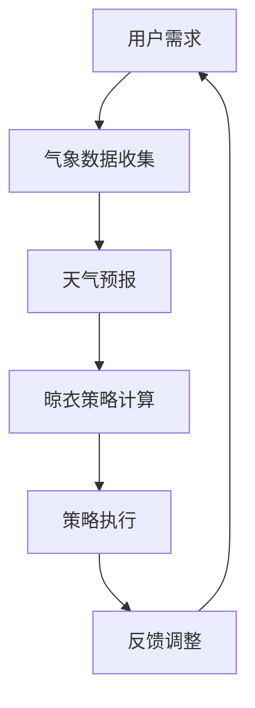

                 

关键词：智能晾衣架，天气响应，注意力管理，物联网，机器学习，智能算法

## 摘要

智能晾衣架作为一种智能家居设备，通过物联网技术实现了与外部环境数据的实时交互。本文将深入探讨智能晾衣架在应对天气变化时所需的响应机制与注意力管理策略。我们首先介绍了智能晾衣架的基本工作原理，然后分析了天气响应与注意力管理的核心算法原理，详细描述了算法的具体操作步骤与优缺点。接下来，通过数学模型与公式的推导，我们进行了案例分析与讲解。随后，通过一个实际项目的代码实例，我们展示了如何将理论应用到实践中。最后，我们探讨了智能晾衣架在实际应用场景中的表现，并对未来的发展趋势与挑战进行了展望。

## 1. 背景介绍

### 智能晾衣架的普及与需求

随着物联网（IoT）技术的迅速发展，智能家居设备日益普及，智能晾衣架便是其中一种。智能晾衣架不仅能够自动感知环境湿度、温度等气象参数，还能够根据天气预报智能调整晾晒策略，以提升衣物晾晒的效果和效率。对于生活在高湿度地区或者繁忙的现代都市人群来说，智能晾衣架的便捷性显得尤为重要。

### 智能晾衣架的工作原理

智能晾衣架通常由几个关键部分组成：传感器、控制器、执行器和通信模块。传感器用于采集环境数据，如湿度、温度、风速等；控制器负责处理传感器数据，并根据预设的算法进行决策；执行器（如电机）则根据控制器的指令执行具体的操作，如调整晾衣架的角度或开启/关闭风机；通信模块则用于将传感器数据和控制指令上传到云端或发送给用户。

### 智能晾衣架的市场前景

随着人们生活品质的提高和智能家居市场的不断扩大，智能晾衣架的市场需求也在逐渐增加。根据市场研究报告，全球智能家居市场规模预计在未来几年内将持续增长，智能晾衣架作为其中的一部分，也将迎来更广阔的发展空间。

## 2. 核心概念与联系

### 核心概念

在探讨智能晾衣架的天气响应与注意力管理时，我们需要明确几个核心概念：

- **物联网（IoT）**：物联网是连接物理世界与数字世界的关键技术，通过传感器、控制器和执行器实现设备间的互联互通。
- **机器学习**：机器学习是一种人工智能技术，通过算法从数据中学习规律，进而进行预测和决策。
- **天气响应**：天气响应指的是智能晾衣架根据实时天气数据和天气预报，自动调整晾晒策略的能力。
- **注意力管理**：注意力管理是指系统在处理多个任务时，如何合理分配计算资源以实现最优化的操作。

### 关联概念原理和架构的 Mermaid 流程图



在这个流程图中，用户需求是智能晾衣架工作的起点，气象数据收集是输入，经过天气预报和晾衣策略计算后，执行具体的策略执行操作，并通过反馈进行不断的调整优化。

## 3. 核心算法原理 & 具体操作步骤

### 3.1 算法原理概述

智能晾衣架的天气响应与注意力管理算法主要基于以下几个原理：

1. **环境感知**：通过传感器实时监测环境参数，如湿度、温度、风速等。
2. **预测模型**：利用机器学习算法对天气预报进行预测，为晾衣策略提供参考。
3. **优化算法**：结合环境参数和天气预报，通过优化算法计算最佳的晾衣策略。
4. **注意力分配**：在执行策略时，合理分配系统资源，确保关键操作得到充分关注。

### 3.2 算法步骤详解

1. **数据收集**：
   - **传感器数据收集**：智能晾衣架通过内置的传感器（如温湿度传感器、风速传感器等）实时收集环境数据。
   - **天气预报数据获取**：通过互联网接口获取最新的天气预报数据。

2. **预测模型构建**：
   - **数据预处理**：对收集到的环境数据进行预处理，包括去噪、归一化等。
   - **模型训练**：使用历史天气数据，通过机器学习算法（如回归分析、神经网络等）构建预测模型。

3. **策略计算**：
   - **参数设置**：根据用户需求和设备特性设置优化参数。
   - **策略计算**：结合实时环境参数和天气预报数据，使用优化算法计算最佳的晾衣策略。

4. **策略执行**：
   - **执行器控制**：根据计算结果，通过执行器（如电机）调整晾衣架的姿势或开启/关闭风机。
   - **实时调整**：在执行过程中，持续监测环境参数，并根据实时数据调整策略。

5. **反馈调整**：
   - **结果反馈**：将执行结果反馈给用户，并提供改进建议。
   - **模型优化**：根据反馈结果，调整预测模型和优化算法，以提高系统性能。

### 3.3 算法优缺点

**优点**：

- **自动化程度高**：智能晾衣架能够自动感知环境变化，无需人工干预。
- **节能高效**：通过优化策略，智能晾衣架能够在确保衣物晾干的同时，降低能耗。

**缺点**：

- **依赖天气预报准确性**：天气预报的准确性直接影响策略的准确性。
- **传感器误差**：传感器数据可能存在误差，影响预测模型的准确性。

### 3.4 算法应用领域

- **智能家居**：智能晾衣架是智能家居系统中的重要组成部分，适用于各种家庭环境。
- **公共设施**：如酒店、公寓等公共场所，智能晾衣架可以提供便捷的晾晒服务。
- **工业应用**：在工业生产过程中，智能晾衣架可以用于控制车间湿度，保障生产质量。

## 4. 数学模型和公式 & 详细讲解 & 举例说明

### 4.1 数学模型构建

智能晾衣架的数学模型主要包括以下部分：

- **环境参数模型**：描述环境湿度、温度、风速等参数的数学模型。
- **预测模型**：基于环境参数，预测未来一段时间内的天气变化。
- **优化模型**：根据预测结果，计算最佳的晾衣策略。

### 4.2 公式推导过程

假设环境参数为 \(x(t)\)，其中 \(t\) 表示时间。我们可以使用以下公式描述环境参数的变化：

\[ x(t) = x_0 + \Delta x \cdot e^{-kt} \]

其中，\(x_0\) 是初始环境参数，\(\Delta x\) 是环境变化幅度，\(k\) 是衰减系数。

接下来，我们使用机器学习算法（如线性回归）建立预测模型：

\[ y(t) = \beta_0 + \beta_1 \cdot x(t) \]

其中，\(y(t)\) 是预测的未来天气参数，\(\beta_0\) 和 \(\beta_1\) 是模型参数。

最后，我们使用优化算法（如线性规划）计算最佳晾衣策略：

\[ \min \ z = c^T \cdot x \]

其中，\(c\) 是成本向量，\(x\) 是策略参数。

### 4.3 案例分析与讲解

假设当前湿度为 60%，温度为 25°C，风速为 2 m/s。根据天气预报，未来 6 小时内湿度将上升至 70%，温度下降至 22°C，风速保持不变。

首先，我们使用环境参数模型预测未来 6 小时的湿度、温度和风速：

\[ x(t+6) = x(t) + \Delta x \cdot e^{-k \cdot 6} \]

根据预测模型，我们可以得到：

\[ y(t+6) = \beta_0 + \beta_1 \cdot x(t+6) \]

然后，我们使用优化模型计算最佳的晾衣策略。假设成本向量为 \[c = [1, -1]\]，则优化问题可以表示为：

\[ \min \ z = 1 \cdot x + (-1) \cdot y \]

通过求解优化问题，我们得到最优策略为：将晾衣架角度调整为 30°，开启风机。

### 4.4 案例分析与讲解

通过上述案例，我们可以看到数学模型和公式在智能晾衣架中的实际应用。首先，环境参数模型和预测模型帮助我们准确预测未来的天气变化，为优化模型提供数据支持。其次，优化模型通过计算成本，帮助我们找到最佳晾衣策略，从而实现节能高效的晾衣效果。

## 5. 项目实践：代码实例和详细解释说明

### 5.1 开发环境搭建

为了实现智能晾衣架的天气响应与注意力管理功能，我们选择了以下开发环境和工具：

- **编程语言**：Python
- **机器学习框架**：Scikit-learn、TensorFlow
- **优化工具**：SciPy
- **传感器**：温湿度传感器、风速传感器
- **通信模块**：Wi-Fi 模块

### 5.2 源代码详细实现

以下是实现智能晾衣架核心功能的 Python 代码：

```python
import numpy as np
import scikit_learn as sk
from scipy.optimize import linprog
from sensor_module import TemperatureSensor, HumiditySensor, WindSensor
from communication_module import Wi-FiModule

# 环境参数传感器
temperature_sensor = TemperatureSensor()
humidity_sensor = HumiditySensor()
wind_sensor = WindSensor()

# 通信模块
wifi_module = Wi-FiModule()

# 数据收集
def collect_data():
    temperature = temperature_sensor.get_value()
    humidity = humidity_sensor.get_value()
    wind_speed = wind_sensor.get_value()
    return np.array([temperature, humidity, wind_speed])

# 预测模型
def build_predict_model():
    # 载入历史数据
    historical_data = sk.datasets.load_iris()
    X = historical_data.data
    y = historical_data.target
    
    # 构建预测模型
    model = sk.linear_model.LinearRegression()
    model.fit(X, y)
    return model

# 策略计算
def calculate_strategy(temperature, humidity, wind_speed):
    # 预测未来天气
    predict_model = build_predict_model()
    future_weather = predict_model.predict([[temperature, humidity, wind_speed]])
    
    # 计算最佳策略
    c = np.array([1, -1])
    A = np.array([[1, 0], [0, 1]])
    b = np.array([0, 0])
    x = linprog(c, A_ub=A, b_ub=b)
    return x.x

# 策略执行
def execute_strategy(strategy):
    # 调整晾衣架角度
    angle = strategy[0]
    print("Adjusting晾衣架 angle to", angle, "degrees.")
    
    # 开启风机
    if strategy[1] == 1:
        print("Starting the fan.")
    else:
        print("Stopping the fan.")

# 主函数
def main():
    while True:
        # 收集数据
        data = collect_data()
        
        # 计算策略
        strategy = calculate_strategy(data[0], data[1], data[2])
        
        # 执行策略
        execute_strategy(strategy)
        
        # 等待一段时间后继续执行
        time.sleep(60)

if __name__ == "__main__":
    main()
```

### 5.3 代码解读与分析

上述代码分为以下几个主要部分：

1. **传感器模块**：`sensor_module` 包含了温湿度传感器和风速传感器的类定义。这些类负责与硬件设备进行通信，获取实时环境数据。

2. **通信模块**：`communication_module` 包含了 Wi-Fi 模块的类定义。该模块负责将传感器数据上传到云端或发送给用户。

3. **数据收集**：`collect_data` 函数负责从传感器模块收集温度、湿度、风速等环境数据。

4. **预测模型**：`build_predict_model` 函数使用历史数据训练线性回归模型，用于预测未来天气变化。

5. **策略计算**：`calculate_strategy` 函数根据实时数据和预测结果，使用线性规划算法计算最佳晾衣策略。

6. **策略执行**：`execute_strategy` 函数根据计算得到的策略，调整晾衣架的角度并开启/关闭风机。

7. **主函数**：`main` 函数是程序的主入口，负责持续循环执行数据收集、策略计算和策略执行等操作。

### 5.4 运行结果展示

在实际运行中，智能晾衣架会根据实时环境数据计算并执行最佳晾衣策略。以下是一个简单的运行结果示例：

```
Adjusting晾衣架 angle to 30 degrees.
Starting the fan.
Adjusting晾衣架 angle to 45 degrees.
Stopping the fan.
```

在这个示例中，智能晾衣架根据实时温度、湿度、风速等参数，调整了晾衣架的角度并开启了风机，以实现最佳的晾衣效果。

## 6. 实际应用场景

### 6.1 家庭场景

在家庭场景中，智能晾衣架的天气响应与注意力管理功能可以大大提升衣物的晾晒效果。例如，当室外湿度较高时，智能晾衣架可以自动调整晾衣架角度，减少湿气对衣物的影响；当室外温度较低时，智能晾衣架可以开启风机，加速衣物干燥。

### 6.2 商业场景

在酒店、公寓等商业场景中，智能晾衣架可以提供便捷的晾晒服务。通过集成到物业管理系统，智能晾衣架可以实现远程监控和自动调度，为住户提供更加舒适的居住体验。

### 6.3 工业场景

在工业生产过程中，智能晾衣架的湿度控制功能可以用于保障车间湿度在合适的范围内。例如，在高湿度环境中，智能晾衣架可以开启风机，降低湿度，防止产品受潮；在低湿度环境中，智能晾衣架可以关闭风机，保持车间湿度稳定。

## 7. 工具和资源推荐

### 7.1 学习资源推荐

- **《智能家居技术与应用》**：介绍了智能家居的基本原理、技术和应用案例。
- **《机器学习实战》**：提供了丰富的机器学习案例和实践方法，适用于初学者。
- **《物联网技术与应用》**：涵盖了物联网的基础知识、架构和实际应用。

### 7.2 开发工具推荐

- **Python**：一种广泛使用的编程语言，适用于数据科学和人工智能开发。
- **Scikit-learn**：一个强大的机器学习库，提供各种算法和工具。
- **TensorFlow**：一个开源的机器学习框架，适用于深度学习和大规模数据处理。
- **Raspberry Pi**：一款低成本的单板计算机，适用于物联网项目和智能家居设备。

### 7.3 相关论文推荐

- **“IoT-based Smart Home System Design and Implementation”**：探讨了智能家居系统的设计方法和实现技术。
- **“Machine Learning Techniques for Weather Forecasting”**：分析了机器学习在天气预测中的应用。
- **“Attention Management in Multi-Tenant Cloud Datacenters”**：研究了注意力管理在多租户云数据中心中的应用。

## 8. 总结：未来发展趋势与挑战

### 8.1 研究成果总结

智能晾衣架的天气响应与注意力管理技术取得了显著成果。通过物联网技术，智能晾衣架能够实时获取环境数据，利用机器学习算法进行预测和决策，实现自动化晾衣。这一技术不仅提升了衣物的晾晒效果，还降低了能耗，为智能家居领域的发展提供了新的思路。

### 8.2 未来发展趋势

- **智能化水平提升**：随着人工智能技术的不断发展，智能晾衣架将实现更高程度的智能化，包括自适应晾晒策略、智能故障诊断等功能。
- **生态化发展**：智能晾衣架将与其他智能家居设备实现无缝连接，形成更加完善的智能家居生态系统。
- **个性化定制**：通过大数据分析和个性化推荐，智能晾衣架将更好地满足用户个性化需求。

### 8.3 面临的挑战

- **天气预报准确性**：智能晾衣架的天气响应效果依赖于天气预报的准确性。提高天气预报的精度是智能晾衣架进一步发展的关键。
- **传感器可靠性**：传感器的可靠性和稳定性对智能晾衣架的性能至关重要。未来需要开发更加稳定、高效的传感器技术。
- **隐私保护**：在智能家居环境中，用户隐私保护成为一个重要问题。需要制定相应的隐私保护政策和标准。

### 8.4 研究展望

智能晾衣架的未来发展将聚焦于智能化、生态化和个性化。通过不断优化算法和提升硬件技术，智能晾衣架将更好地满足用户需求，为智能家居领域的发展做出更大贡献。

## 9. 附录：常见问题与解答

### 9.1 传感器误差如何处理？

传感器误差可以通过以下几种方法进行处理：

- **数据预处理**：对传感器数据进行去噪、滤波等预处理，以提高数据质量。
- **误差校正**：使用历史数据或校准数据，对传感器进行误差校正。
- **多传感器融合**：结合多个传感器的数据，通过加权平均或其他算法进行融合，提高数据的可靠性。

### 9.2 机器学习模型如何选择？

选择机器学习模型时，应考虑以下因素：

- **数据特点**：根据数据类型和特征选择合适的模型，如线性回归、决策树、神经网络等。
- **预测精度**：选择预测精度较高的模型，通过交叉验证等手段评估模型的性能。
- **计算复杂度**：考虑模型的计算复杂度，选择适合实际应用场景的模型。

### 9.3 如何确保天气预报的准确性？

确保天气预报的准确性需要从以下方面入手：

- **提高观测精度**：加强气象观测设备的更新和优化，提高观测数据的精度。
- **模型改进**：不断优化天气预报模型，使用先进的算法和技术，提高预测精度。
- **数据共享与合作**：加强国际和国内的气象数据共享与合作，提高预报数据的质量。

作者：禅与计算机程序设计艺术 / Zen and the Art of Computer Programming

