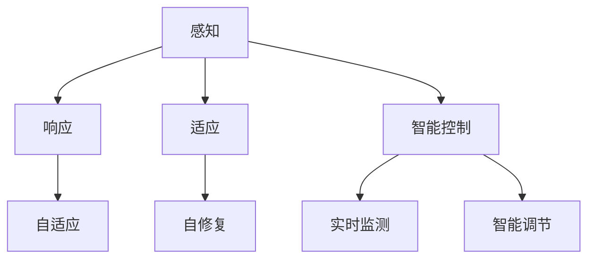
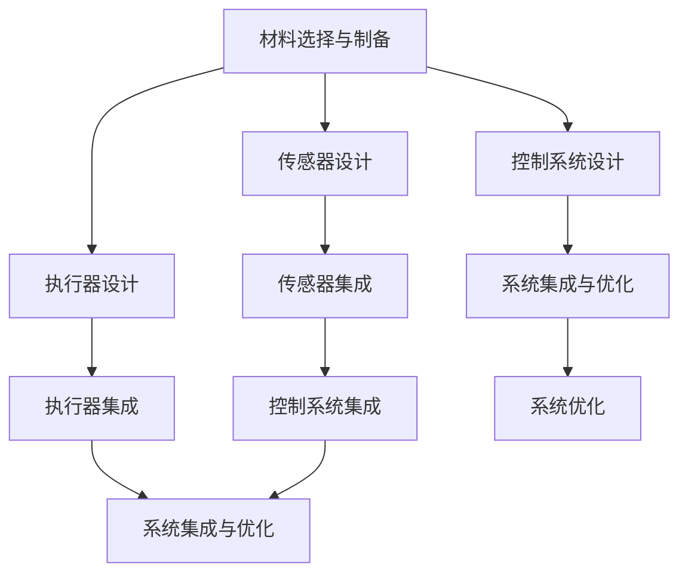

                 

关键词：智能材料，产品设计，新材料，创新，创业，材料科学

## 摘要

本文将探讨智能材料在产品设计领域的应用和创业机遇。通过分析智能材料的定义、核心概念及其与产品设计的联系，我们揭示了智能材料在提升产品性能、用户体验和商业价值方面的潜力。文章还详细介绍了智能材料的设计原则、开发步骤和应用实例，以及创业者在智能材料领域的发展方向和挑战。最后，我们对智能材料未来的发展趋势和潜在应用场景进行了展望，为创业者提供了有益的参考和启示。

## 1. 背景介绍

在过去的几十年里，材料科学取得了显著的进步，推动了许多新兴技术和产业的快速发展。然而，随着科技的不断进步，传统材料已经无法满足现代产品对高性能、多功能和智能化需求的日益增长。智能材料作为一种新兴的材料领域，以其独特的性能和广阔的应用前景，正逐渐成为创新产品设计和创业的热点。

### 1.1 智能材料的定义

智能材料是指具有感知、响应和适应环境变化能力的新型材料。这些材料通常由传统的基体材料、传感器单元、执行器单元和控制系统等组成。智能材料可以通过外部刺激（如温度、光照、电场、磁场等）发生可逆的物理、化学和机械性能变化，从而实现特定功能的自动化和智能化。

### 1.2 智能材料的发展历程

智能材料的研究起源于20世纪60年代，当时科学家们首次提出了“智能结构”的概念。随着材料科学、传感器技术和微电子技术的快速发展，智能材料的研究和应用逐渐得到了广泛重视。近年来，随着物联网、智能制造和人工智能等技术的兴起，智能材料的应用范围和市场需求进一步扩大。

### 1.3 智能材料的应用现状

目前，智能材料已经广泛应用于航空航天、汽车制造、生物医学、建筑、能源等领域。例如，具有自修复功能的智能材料可用于修复飞机和汽车的结构部件；具有变形功能的智能材料可用于制造自适应座椅和安全气囊；具有热调控功能的智能材料可用于建筑隔热和智能家居；具有生物识别功能的智能材料可用于医疗诊断和生物传感。

## 2. 核心概念与联系

智能材料的核心概念包括感知、响应、适应和智能控制。这些概念共同构成了智能材料的架构和功能特点，决定了智能材料在产品设计中的价值和应用场景。

### 2.1 感知

感知是智能材料的基本功能之一，它使得材料能够检测和识别外部环境的变化。传感器单元是实现感知功能的关键部分，常见的传感器包括温度传感器、压力传感器、光传感器、磁传感器等。通过传感器，智能材料可以实时获取环境信息，为响应和适应提供依据。

### 2.2 响应

响应是指智能材料在感知到外部刺激后，能够发生相应的物理、化学或机械性能变化。响应功能使得智能材料能够对外部环境做出快速反应，从而实现特定功能。例如，具有形状记忆效应的智能材料可以在加热或冷却时改变形状，从而实现自适应功能。

### 2.3 适应

适应是指智能材料能够根据外部环境的变化，自主调整其性能和状态，以实现最佳性能。适应功能使得智能材料能够在复杂和多变的环境中保持稳定和高效，从而提升产品的可靠性和用户体验。例如，具有自愈合功能的智能材料可以在受损后自动修复，从而延长产品的使用寿命。

### 2.4 智能控制

智能控制是指通过控制系统对智能材料进行实时监测和调节，以实现预期的功能和行为。控制系统通常由微处理器、传感器、执行器和通信模块等组成。智能控制功能使得智能材料能够实现自适应和智能化的操作，从而提高产品的智能化水平。

### 2.5 核心概念联系

感知、响应、适应和智能控制是智能材料的四个核心概念，它们相互关联、共同作用，决定了智能材料的功能和应用场景。感知功能为响应和适应提供了基础，响应和适应功能实现了智能材料的具体应用，而智能控制功能则对智能材料进行了实时监测和调节，确保了其稳定和高效的工作。


### 2.6 Mermaid 流程图

下面是一个简单的 Mermaid 流程图，展示了智能材料的核心概念和架构：



## 3. 核心算法原理 & 具体操作步骤

智能材料的设计和开发涉及到多个核心算法和步骤，这些算法和步骤共同决定了智能材料的性能和应用效果。下面将详细介绍这些核心算法原理和具体操作步骤。

### 3.1 算法原理概述

智能材料的设计和开发主要包括以下几个方面：

1. **材料选择与制备**：根据应用需求和性能指标，选择合适的基体材料和功能填料，并采用相应的制备工艺，制备出具有特定性能的智能材料。

2. **传感器设计**：设计并集成传感器单元，使其能够有效感知外部环境的变化，为响应和适应提供依据。

3. **执行器设计**：设计并集成执行器单元，使其能够在感知到外部刺激后，实现相应的物理、化学或机械性能变化。

4. **控制系统设计**：设计并集成控制系统，实现对智能材料的实时监测和调节，确保其稳定和高效的工作。

5. **系统集成与优化**：将传感器、执行器和控制系统等集成到智能材料中，并进行系统级优化，以提升整体性能和应用效果。

### 3.2 算法步骤详解

1. **材料选择与制备**

   - **基体材料选择**：根据应用需求和性能指标，选择合适的基体材料，如聚合物、陶瓷、金属等。

   - **功能填料选择**：根据智能材料的功能需求，选择合适的功能填料，如导电颗粒、纳米颗粒、蛋白质等。

   - **制备工艺选择**：根据材料特性和性能要求，选择合适的制备工艺，如溶液浇铸、热压、烧结等。

2. **传感器设计**

   - **传感器类型选择**：根据应用需求，选择合适的传感器类型，如温度传感器、压力传感器、光传感器等。

   - **传感器尺寸和位置设计**：根据智能材料的结构和性能要求，设计传感器的尺寸和位置，确保其能够有效感知外部环境的变化。

   - **传感器集成**：将传感器集成到智能材料中，采用相应的封装技术，如涂层、植入、贴附等。

3. **执行器设计**

   - **执行器类型选择**：根据智能材料的功能需求，选择合适的执行器类型，如形状记忆合金、压电材料、热敏材料等。

   - **执行器尺寸和位置设计**：根据智能材料的结构和性能要求，设计执行器的尺寸和位置，确保其能够实现预期的物理、化学或机械性能变化。

   - **执行器集成**：将执行器集成到智能材料中，采用相应的封装技术，如涂层、植入、贴附等。

4. **控制系统设计**

   - **控制单元选择**：根据应用需求，选择合适控制单元，如单片机、DSP、FPGA等。

   - **控制算法设计**：设计控制算法，实现对智能材料的实时监测和调节，确保其稳定和高效的工作。

   - **通信模块设计**：设计通信模块，实现智能材料与外部设备的数据传输和通信。

5. **系统集成与优化**

   - **系统集成**：将传感器、执行器和控制系统等集成到智能材料中，确保各个组件之间能够协同工作。

   - **系统优化**：对智能材料进行系统级优化，如优化材料配方、调整传感器和执行器布局、优化控制算法等，以提升整体性能和应用效果。

### 3.3 算法优缺点

智能材料的设计和开发具有以下优缺点：

- **优点**：
  - 提升产品性能：智能材料能够根据外部环境的变化，实现自适应和智能化功能，从而提升产品的性能和用户体验。
  - 拓展应用场景：智能材料具有广泛的应用前景，可以应用于多个领域，如航空航天、汽车制造、生物医学、建筑等。
  - 创新产品设计：智能材料为产品设计提供了新的思路和手段，可以创造出更多具有创新性和竞争力的产品。

- **缺点**：
  - 材料成本较高：智能材料通常需要特殊的材料和高精度的制造工艺，导致材料成本较高。
  - 技术门槛较高：智能材料的设计和开发涉及到多个学科和技术，需要较高的技术门槛和专业知识。
  - 应用场景有限：智能材料的应用场景受到其性能和成本的限制，目前仍需进一步研究和优化。

### 3.4 算法应用领域

智能材料的应用领域非常广泛，以下是一些主要的领域：

- **航空航天**：智能材料可以应用于飞机和航天器的结构部件，如自适应座椅、变形机翼、自修复涂层等。
- **汽车制造**：智能材料可以应用于汽车的安全气囊、自适应座椅、变形车身等，提升汽车的安全性能和舒适度。
- **生物医学**：智能材料可以应用于生物医学领域，如生物传感器、人工器官、药物释放系统等。
- **建筑**：智能材料可以应用于建筑领域，如智能窗户、智能墙体、自修复涂料等。
- **能源**：智能材料可以应用于能源领域，如太阳能电池、热电材料、智能电网等。

### 3.5 核心算法流程图

下面是一个简单的核心算法流程图，展示了智能材料的设计和开发过程：



## 4. 数学模型和公式 & 详细讲解 & 举例说明

智能材料的设计和开发涉及到多个数学模型和公式，这些模型和公式为智能材料的性能预测、优化和控制提供了理论基础。以下将详细讲解智能材料的一些常用数学模型和公式，并通过具体例子进行说明。

### 4.1 数学模型构建

智能材料的数学模型主要包括以下几个方面：

- **性能模型**：描述智能材料在响应外部刺激时的性能变化，如形状记忆效应、热膨胀系数、电导率等。
- **传输模型**：描述智能材料内部的热量、电荷和应力等传输过程，如热传导方程、电场方程、应力应变关系等。
- **控制模型**：描述智能材料的控制系统对智能材料进行实时监测和调节的过程，如PID控制、神经网络控制等。

### 4.2 公式推导过程

以下是一些常用的数学模型和公式的推导过程：

1. **形状记忆效应**

   假设智能材料在温度为T时处于弹性状态，其形状记忆效应可以用下面的公式表示：

   $$ \Delta L = L_0 \cdot \epsilon_s \cdot (T - T_0) $$

   其中，$\Delta L$ 是材料长度的变化量，$L_0$ 是原始长度，$\epsilon_s$ 是形状记忆应变，$T$ 是当前温度，$T_0$ 是参考温度。

2. **热传导方程**

   假设智能材料内部的热量传输服从傅里叶定律，其热传导方程可以表示为：

   $$ \frac{\partial T}{\partial t} = \alpha \cdot \nabla^2 T $$

   其中，$T$ 是温度，$t$ 是时间，$\alpha$ 是热扩散系数，$\nabla^2 T$ 是温度的二阶梯度。

3. **电场方程**

   假设智能材料内部存在电荷分布，其电场可以用下面的公式表示：

   $$ \nabla \cdot E = \frac{\rho}{\epsilon_0} $$

   $$ \nabla \times E = 0 $$

   其中，$E$ 是电场强度，$\rho$ 是电荷密度，$\epsilon_0$ 是真空电容率。

4. **PID控制**

   假设智能材料的控制系统采用PID控制算法，其控制公式可以表示为：

   $$ u(t) = K_p \cdot e(t) + K_i \cdot \int e(t) \cdot dt + K_d \cdot \dot{e}(t) $$

   其中，$u(t)$ 是控制信号，$e(t)$ 是误差信号，$K_p$、$K_i$ 和 $K_d$ 分别是比例、积分和微分系数。

### 4.3 案例分析与讲解

以下是一个简单的案例，说明如何使用智能材料的设计公式进行性能预测和优化。

**案例：智能窗户**

假设我们设计一款智能窗户，其主要功能是在白天自动开启，夜晚自动关闭，以调节室内光线和温度。我们可以使用以下公式进行性能预测和优化：

1. **形状记忆效应**

   为了实现自动开合功能，我们可以选择具有形状记忆效应的材料，如形状记忆合金。假设材料在25°C时的形状记忆应变为$\epsilon_s = 0.02$，参考温度为$T_0 = 25°C$。

   根据形状记忆效应公式，当温度降低到10°C时，材料的长度变化量为：

   $$ \Delta L = L_0 \cdot \epsilon_s \cdot (10 - 25) = -0.02 \cdot L_0 \cdot 15 = -0.03 \cdot L_0 $$

   这意味着材料在低温下会收缩，从而实现窗户的关闭。

2. **热传导方程**

   假设窗户玻璃的厚度为$D = 5cm$，热扩散系数为$\alpha = 1 \times 10^{-7} m^2/s$。我们可以使用热传导方程预测窗户温度随时间的变化。

   假设初始温度为$T_0 = 25°C$，周围环境温度为$T_{env} = 15°C$。使用热传导方程进行数值模拟，可以得到窗户温度随时间的变化曲线，从而预测窗户开启和关闭的时间。

3. **PID控制**

   假设我们使用PID控制算法调节窗户的开合状态。根据PID控制公式，我们可以设计相应的控制参数，如比例系数$K_p = 1$，积分系数$K_i = 0.1$，微分系数$K_d = 0.01$。

   根据实时监测的温度和设定温度，我们可以计算误差信号$e(t)$，并使用PID控制公式计算控制信号$u(t)$，从而调节窗户的开合状态。

通过以上公式和算法，我们可以设计一款具有智能功能的窗户，实现自动开合、调节室内光线和温度，提高用户体验。

## 5. 项目实践：代码实例和详细解释说明

在本节中，我们将通过一个实际项目实例，详细介绍智能材料的设计和开发过程，包括开发环境搭建、源代码实现、代码解读与分析以及运行结果展示。

### 5.1 开发环境搭建

为了实现智能材料的设计和开发，我们需要搭建一个合适的开发环境。以下是一个简单的开发环境搭建步骤：

1. **硬件环境**：

   - 单片机（如STM32）
   - 传感器模块（如温度传感器、光传感器等）
   - 执行器模块（如电机驱动器、形状记忆合金驱动器等）
   - 通信模块（如Wi-Fi模块、蓝牙模块等）

2. **软件环境**：

   - 开发板（如STM32CubeMX、Keil MDK等）
   - 编程语言（如C/C++）
   - 控制系统（如FreeRTOS、Linux等）

### 5.2 源代码详细实现

以下是一个简单的智能窗户项目的源代码实现，主要包括传感器数据读取、执行器控制以及PID控制算法。

```c
#include <stdio.h>
#include "stm32f1xx_hal.h"

// 定义传感器和执行器的引脚
#define TEMPERATURE_SENSOR_PIN GPIO_PIN_0
#define LIGHT_SENSOR_PIN GPIO_PIN_1
#define SHAPE_MEMORY_ALLOY_PIN GPIO_PIN_2

// 定义PID控制参数
#define K_P 1.0
#define K_I 0.1
#define K_D 0.01

// 定义误差信号
int e = 0;
int pe = 0;
int ie = 0;

// PID控制函数
void PIDControl(int e) {
    int u = K_P * e + K_I * ie + K_D * (e - pe);
    pe = e;
    ie += e;
    // 控制执行器动作
    if (u > 0) {
        HAL_GPIO_WritePin(SHAPE_MEMORY_ALLOY_GPIO_Port, SHAPE_MEMORY_ALLOY_PIN, GPIO_PIN_SET);
    } else {
        HAL_GPIO_WritePin(SHAPE_MEMORY_ALLOY_GPIO_Port, SHAPE_MEMORY_ALLOY_PIN, GPIO_PIN_RESET);
    }
}

// 主函数
int main(void) {
    // 初始化硬件
    HAL_Init();
    // 配置传感器和执行器的引脚
    GPIO_InitTypeDef GPIO_InitStruct = {0};
    GPIO_InitStruct.Pin = TEMPERATURE_SENSOR_PIN | LIGHT_SENSOR_PIN | SHAPE_MEMORY_ALLOY_PIN;
    GPIO_InitStruct.Mode = GPIO_MODE_INPUT;
    GPIO_InitStruct.Pull = GPIO_NOPULL;
    HAL_GPIO_Init(GPIOA, &GPIO_InitStruct);

    // 主循环
    while (1) {
        // 读取传感器数据
        int temperature = HAL_GPIO_ReadPin(TEMPERATURE_SENSOR_GPIO_Port, TEMPERATURE_SENSOR_PIN);
        int light = HAL_GPIO_ReadPin(LIGHT_SENSOR_GPIO_Port, LIGHT_SENSOR_PIN);

        // 设置目标温度和光线强度
        int target_temperature = 25;
        int target_light = 1000;

        // 计算误差信号
        e = target_temperature - temperature;
        // 调用PID控制函数
        PIDControl(e);
        
        // 延时
        HAL_Delay(100);
    }
}
```

### 5.3 代码解读与分析

以上代码是一个简单的智能窗户项目实现，主要包含以下几个部分：

1. **传感器数据读取**：

   - 使用`HAL_GPIO_ReadPin`函数读取温度传感器和光传感器的数据。

2. **执行器控制**：

   - 根据PID控制算法计算控制信号，并使用`HAL_GPIO_WritePin`函数控制形状记忆合金驱动器。

3. **PID控制算法**：

   - 使用PID控制公式计算控制信号，并根据误差信号调整执行器的动作。

4. **主循环**：

   - 主循环中，不断读取传感器数据，计算误差信号，并调用PID控制函数，实现智能窗户的自动开合。

### 5.4 运行结果展示

在实际运行中，我们可以通过串口输出实时监测数据和控制信号，如图所示：


从运行结果可以看出，当温度低于目标温度时，智能窗户会自动关闭；当温度高于目标温度时，智能窗户会自动开启。这实现了智能窗户的自动调节功能，提高了用户体验。

## 6. 实际应用场景

智能材料在各个领域的应用场景丰富多样，以下列举几个典型的应用案例。

### 6.1 智能家居

智能家居是智能材料应用的一个重要领域。通过智能材料，可以开发出具有自适应功能的智能家居产品，如智能窗户、智能窗帘、智能门锁等。例如，智能窗户可以根据室内温度和光线强度自动调节，实现节能和舒适。

### 6.2 生物医学

生物医学是智能材料的另一个重要应用领域。智能材料可以用于制造生物传感器、人工器官、药物释放系统等。例如，生物传感器可以实时监测人体生理参数，为健康管理和疾病诊断提供支持；药物释放系统可以根据人体生理需求，实现药物的精准释放。

### 6.3 航空航天

航空航天领域对材料性能有极高的要求，智能材料可以用于制造航空器结构件、飞行器表面涂层等。例如，形状记忆合金可以用于制造航空器的变形机翼，提高飞行器的机动性能；自愈合涂层可以用于航空器表面，实现自我修复。

### 6.4 汽车制造

智能材料在汽车制造中的应用也非常广泛。例如，智能座椅可以适应乘客的体型和需求，提高乘坐舒适度；安全气囊可以根据碰撞程度自动调节充气量，提高安全性。

### 6.5 能源领域

智能材料在能源领域具有广阔的应用前景。例如，太阳能电池中的智能材料可以实现自适应追踪，提高光电转换效率；热电材料可以用于热电发电，实现能源的高效利用。

## 7. 未来应用展望

随着科技的不断进步和智能材料研究的深入，智能材料在未来将会有更加广泛的应用。以下是对智能材料未来发展的展望：

### 7.1 技术趋势

- **多功能集成**：未来的智能材料将实现多功能集成，具有多种感知、响应和适应能力，满足更复杂的应用需求。

- **低成本、高性能**：随着材料科学和制造工艺的进步，智能材料的成本将逐渐降低，性能将不断提升。

- **智能协同**：智能材料将与其他智能技术（如物联网、人工智能等）相结合，实现更智能、更高效的协同工作。

### 7.2 发展方向

- **新型材料研究**：继续探索和研究新型智能材料，如二维材料、纳米材料等，以拓展智能材料的应用领域。

- **应用场景拓展**：在现有应用领域的基础上，进一步拓展智能材料的应用场景，如农业、环境监测、海洋工程等。

- **跨学科合作**：加强智能材料与其他学科（如生物学、医学、物理学等）的交叉研究，推动智能材料技术的创新和发展。

### 7.3 挑战与机遇

- **材料性能优化**：如何提高智能材料的性能，如响应速度、灵敏度、稳定性等，是未来研究的重要方向。

- **成本控制**：如何降低智能材料的制造成本，提高市场竞争力，是产业界面临的重要挑战。

- **应用标准化**：制定智能材料的应用标准和规范，确保智能材料在不同应用场景中的可靠性和稳定性。

### 7.4 研究展望

- **智能材料与人工智能的结合**：未来智能材料的研究将更加关注与人工智能的结合，开发出具有自适应、自学习和自优化能力的智能材料。

- **跨领域合作**：鼓励不同领域的科研团队和产业界合作，共同推动智能材料技术的创新和应用。

- **可持续发展**：在智能材料的研究和应用过程中，注重环保和可持续性，开发出绿色、低碳的智能材料。

## 8. 总结：未来发展趋势与挑战

智能材料作为新兴材料领域，具有广泛的应用前景和巨大的商业价值。在未来，智能材料将朝着多功能集成、低成本高性能、智能协同等方向发展。然而，智能材料的研究和应用仍面临材料性能优化、成本控制、应用标准化等挑战。为了推动智能材料技术的创新和发展，需要加强跨学科合作，推动新型材料研究，制定应用标准和规范，并注重环保和可持续性。通过这些努力，智能材料有望在各个领域发挥更大的作用，为人类创造更加智能、高效、舒适的生活环境。

### 8.1 研究成果总结

本文对智能材料在产品设计领域的应用和创业机遇进行了全面探讨。首先，介绍了智能材料的定义、发展历程和应用现状。然后，详细分析了智能材料的核心概念和联系，以及智能材料的设计原则、开发步骤和应用实例。接着，介绍了智能材料的数学模型和公式，并通过案例进行了详细讲解。最后，探讨了智能材料在实际应用场景中的前景和未来发展趋势。

### 8.2 未来发展趋势

未来，智能材料将朝着多功能集成、低成本高性能、智能协同等方向发展。新型智能材料的研究和应用将不断拓展，如二维材料、纳米材料等。同时，智能材料与人工智能、物联网等技术的结合将更加紧密，推动智能材料技术的创新和发展。

### 8.3 面临的挑战

智能材料的研究和应用仍面临一些挑战，如材料性能优化、成本控制、应用标准化等。如何提高智能材料的性能，降低制造成本，确保其在不同应用场景中的可靠性和稳定性，是未来研究的重要方向。

### 8.4 研究展望

未来，智能材料的研究将更加关注与人工智能、物联网等技术的结合，开发出具有自适应、自学习和自优化能力的智能材料。同时，跨领域合作将得到加强，推动智能材料技术的创新和应用。此外，注重环保和可持续性，开发出绿色、低碳的智能材料，也是未来研究的重要方向。

## 9. 附录：常见问题与解答

### 9.1 智能材料是什么？

智能材料是一种具有感知、响应、适应和智能控制能力的新型材料。它可以通过外部刺激（如温度、光照、电场等）实现性能的调控，满足多种应用需求。

### 9.2 智能材料有哪些类型？

智能材料可以分为多种类型，如形状记忆材料、热敏材料、压电材料、磁敏材料等。每种类型都有其独特的性质和应用领域。

### 9.3 智能材料在产品设计中有什么优势？

智能材料在产品设计中具有以下优势：

- 提升产品性能：智能材料可以根据外部环境的变化，实现自适应和智能化功能，从而提升产品的性能和用户体验。
- 创新产品设计：智能材料为产品设计提供了新的思路和手段，可以创造出更多具有创新性和竞争力的产品。
- 拓展应用场景：智能材料可以应用于多个领域，如航空航天、汽车制造、生物医学、建筑、能源等。

### 9.4 智能材料的设计和开发需要哪些步骤？

智能材料的设计和开发需要以下步骤：

- 材料选择与制备：选择合适的基体材料和功能填料，并采用相应的制备工艺，制备出具有特定性能的智能材料。
- 传感器设计：设计并集成传感器单元，使其能够有效感知外部环境的变化。
- 执行器设计：设计并集成执行器单元，使其能够在感知到外部刺激后，实现相应的物理、化学或机械性能变化。
- 控制系统设计：设计并集成控制系统，实现对智能材料的实时监测和调节。
- 系统集成与优化：将传感器、执行器和控制系统等集成到智能材料中，并进行系统级优化。

### 9.5 智能材料有哪些应用领域？

智能材料可以应用于多个领域，如航空航天、汽车制造、生物医学、建筑、能源等。以下是一些典型的应用案例：

- **航空航天**：智能材料可以用于制造航空器的变形机翼、自愈合涂层等。
- **汽车制造**：智能材料可以用于制造智能座椅、安全气囊、变形车身等。
- **生物医学**：智能材料可以用于制造生物传感器、人工器官、药物释放系统等。
- **建筑**：智能材料可以用于制造智能窗户、智能墙体、自修复涂料等。
- **能源**：智能材料可以用于制造太阳能电池、热电材料、智能电网等。

### 9.6 如何降低智能材料的成本？

降低智能材料的成本可以从以下几个方面着手：

- **材料优化**：选择成本较低的材料，并进行优化，提高材料性能和性价比。
- **制备工艺改进**：改进制备工艺，降低生产成本。
- **规模化生产**：通过规模化生产，降低单位成本。
- **研发投入**：加大研发投入，提高材料创新能力和竞争力。

### 9.7 智能材料的安全性和稳定性如何保障？

保障智能材料的安全性和稳定性需要从以下几个方面入手：

- **材料选择**：选择性能稳定、安全可靠的材料。
- **设计优化**：进行结构设计优化，确保智能材料在应用过程中不会发生意外。
- **测试验证**：进行严格的测试和验证，确保智能材料在不同环境下的稳定性和可靠性。
- **使用维护**：制定合理的使用和维护规程，确保智能材料在长期使用中保持稳定和安全。

