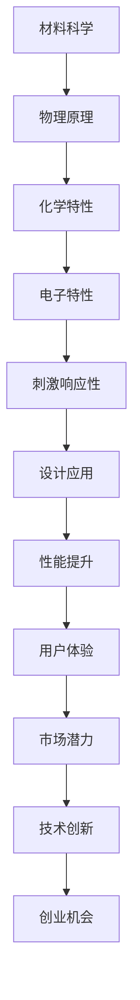

                 

关键词：智能材料、产品设计、新材料、创新、创业

> 摘要：随着科技的不断进步，智能材料的发展正在改变传统产品设计的方式。本文将探讨智能材料的概念、其在产品设计中的应用、创业机会以及面临的挑战，并展望其未来发展趋势。

## 1. 背景介绍

智能材料，是指能够响应外部刺激（如光、温度、湿度、电场等）并改变其物理、化学或光学性质的材料。这些材料的研发和应用，正在逐步深入到各行各业，尤其是产品设计领域。智能材料为产品设计带来了前所未有的灵活性，使得产品能够适应不同的环境和使用需求，提高了产品的性能和用户体验。

近年来，随着物联网（IoT）、人工智能（AI）和大数据等技术的迅猛发展，智能材料的研发和应用速度显著加快。各类智能材料，如形状记忆合金、电致变色材料、自适应光学材料等，不断涌现，为产品设计提供了丰富的选择。

## 2. 核心概念与联系

智能材料的研发涉及多个学科，包括材料科学、物理学、化学和电子工程等。以下是智能材料的核心概念原理和架构的 Mermaid 流程图：



### 2.1 物理原理

智能材料的物理原理主要涉及材料的微观结构和宏观性能。例如，形状记忆合金（SMA）在受到热刺激后能够恢复到预设的形状，这主要归功于其独特的微观结构。

### 2.2 化学特性

智能材料的化学特性决定了其能够在何种条件下响应外部刺激。例如，电致变色材料（ECD）在电场的作用下能够改变颜色，这主要归功于其化学组成的改变。

### 2.3 电子特性

智能材料的电子特性使得它们能够与电子设备交互，从而实现智能化的功能。例如，自适应光学材料能够根据光线的变化自动调整其光学特性，以适应不同的环境。

### 2.4 刺激响应性

智能材料的刺激响应性是其实用价值的关键。通过外部刺激，智能材料能够改变其物理或化学性质，从而实现特定的功能。

### 2.5 设计应用

智能材料的刺激响应性使其在产品设计中的应用变得多样化。例如，在可穿戴设备中，智能材料可以用于制作能够根据体温变化调整弹性的衣物；在汽车设计中，智能材料可以用于制作能够自动调整车身刚度的座椅。

### 2.6 性能提升

智能材料的应用可以提高产品的性能。例如，在建筑行业中，智能材料可以用于制作能够自动调节室内温度和湿度的墙壁材料，从而提高建筑物的节能性能。

### 2.7 用户体验

智能材料的应用可以极大地提升用户体验。例如，在医疗领域中，智能材料可以用于制作能够自动调节硬度的手术手套，从而提高手术的准确性和舒适性。

### 2.8 市场潜力

随着智能材料技术的不断成熟，其市场潜力逐渐显现。根据市场研究公司的预测，全球智能材料市场将在未来几年内保持高速增长，预计到2025年市场规模将达到数十亿美元。

### 2.9 技术创新

智能材料领域的研发活动持续不断，新的智能材料和技术不断涌现。技术创新是推动智能材料应用的关键因素。

### 2.10 创业机会

智能材料的广泛应用为创业者提供了丰富的机会。从新材料研发到智能产品设计，再到市场推广，各个环节都蕴藏着巨大的商机。

## 3. 核心算法原理 & 具体操作步骤

### 3.1 算法原理概述

智能材料的研发和应用涉及多个学科，包括材料科学、物理学、化学和电子工程等。核心算法原理主要包括以下几个方面：

- 材料制备与改性：通过控制材料的制备工艺和改性条件，实现智能材料的特定功能。
- 刺激响应机制：研究材料在不同刺激下的响应行为，为设计智能材料提供理论基础。
- 材料性能优化：通过优化材料的物理、化学和电子特性，提高材料的性能和应用效果。

### 3.2 算法步骤详解

- **材料制备与改性：** 
  - 选择合适的原材料：根据智能材料的类型和功能需求，选择合适的原材料。
  - 制备工艺设计：设计并优化材料的制备工艺，如热处理、电化学沉积、溶胶-凝胶法等。
  - 材料改性：通过掺杂、表面修饰、界面工程等方法，对材料进行改性，以实现特定的功能。

- **刺激响应机制研究：**
  - 刺激条件设置：根据智能材料的应用需求，设置适当的刺激条件，如温度、电场、磁场、光等。
  - 响应行为观察：通过实验手段，观察材料在刺激条件下的响应行为，如形变、颜色变化、导电性变化等。
  - 数据分析：对实验数据进行统计分析，揭示材料的刺激响应机制。

- **材料性能优化：**
  - 性能测试：对材料进行各项性能测试，如机械性能、热性能、电学性能、光学性能等。
  - 性能优化：根据性能测试结果，对材料的制备工艺和改性方法进行调整，以提高材料的性能。
  - 性能评估：对优化后的材料进行性能评估，验证优化效果。

### 3.3 算法优缺点

- **优点：**
  - 灵活性高：智能材料能够根据外部刺激自动调整其性能，适应不同的环境和需求。
  - 创新性强：智能材料的研发和应用为产品设计带来了新的思路和方法，推动了技术的创新。
  - 应用广泛：智能材料在各个领域都有广泛的应用前景，如医疗、交通、建筑、能源等。

- **缺点：**
  - 成本高：智能材料的研发和制备成本较高，限制了其大规模应用。
  - 稳定性差：部分智能材料在长期使用中可能存在性能下降或失效的风险。
  - 安全性担忧：部分智能材料的刺激响应行为可能对人体或环境产生潜在危害。

### 3.4 算法应用领域

- **医疗领域：** 智能材料在医疗领域的应用主要包括生物相容性材料、智能药物释放系统和生物传感器等。
- **交通领域：** 智能材料在交通领域的应用主要包括智能车身、智能轮胎、自适应减震系统等。
- **建筑领域：** 智能材料在建筑领域的应用主要包括智能墙体、智能窗户、智能屋顶等。
- **能源领域：** 智能材料在能源领域的应用主要包括太阳能电池、智能电网和智能储能系统等。

## 4. 数学模型和公式 & 详细讲解 & 举例说明

### 4.1 数学模型构建

智能材料的数学模型主要基于材料科学和物理学的基本原理。以下是几个常见的数学模型：

- **热力学模型：** 描述材料在热刺激下的响应行为，如温度-应变关系、温度-颜色变化关系等。
- **电化学模型：** 描述材料在电场刺激下的响应行为，如电导率-电压关系、电容率-电压关系等。
- **光学模型：** 描述材料在光刺激下的响应行为，如反射率-光强关系、折射率-光强关系等。

### 4.2 公式推导过程

以下是一个简单的热力学模型推导过程：

假设材料在受到温度T的刺激后，其应变ε与温度T之间存在线性关系，即：
\[ \epsilon = aT + b \]

其中，a和b是常数。根据热力学第一定律，材料的内能U与温度T之间存在关系：
\[ U = cT^2 + dT + e \]

其中，c、d和e是常数。为了简化问题，我们可以假设材料的热膨胀系数α与应变ε之间存在线性关系：
\[ \alpha = \frac{\epsilon}{T} = \frac{aT + b}{T} \]

将应变ε的表达式代入上式，得到：
\[ \alpha = a + \frac{b}{T} \]

我们可以通过实验测量材料在不同温度下的应变ε，然后根据上述公式计算热膨胀系数α。同理，我们可以推导出其他数学模型，如电化学模型和光学模型。

### 4.3 案例分析与讲解

假设我们研究一种形状记忆合金（SMA），其热膨胀系数α与温度T之间的关系可以通过以下公式描述：
\[ \alpha = 0.0001T + 0.001 \]

现在我们要研究该SMA材料在受到热刺激后的响应行为。假设初始温度为20°C，我们需要计算在80°C时的应变ε。

根据公式，代入T=80°C，得到：
\[ \alpha = 0.0001 \times 80 + 0.001 = 0.008 + 0.001 = 0.009 \]

由于应变ε与热膨胀系数α之间存在线性关系，我们可以通过以下公式计算应变ε：
\[ \epsilon = \alpha T = 0.009 \times 80 = 0.072 \]

因此，在80°C时，该SMA材料的应变ε为0.072。

这个例子展示了如何通过数学模型和公式来描述和分析智能材料的响应行为。在实际应用中，我们可以根据具体情况调整模型参数，以更好地描述材料的性能。

## 5. 项目实践：代码实例和详细解释说明

### 5.1 开发环境搭建

为了更好地理解和实践智能材料的设计与应用，我们需要搭建一个合适的开发环境。以下是搭建开发环境的基本步骤：

1. 安装Python：Python是一种广泛应用于科学计算和数据分析的语言，许多智能材料的应用都依赖于Python。我们可以从Python的官方网站（https://www.python.org/）下载并安装Python。

2. 安装科学计算库：安装NumPy、SciPy和Matplotlib等科学计算库，这些库提供了丰富的函数和工具，用于处理和分析科学数据。我们可以在命令行中使用以下命令安装：
   ```bash
   pip install numpy scipy matplotlib
   ```

3. 安装可视化库：为了更好地展示智能材料的响应行为，我们还可以安装一些可视化库，如Matplotlib和Seaborn。这些库提供了丰富的绘图功能，可以帮助我们生成高质量的图表。

### 5.2 源代码详细实现

以下是一个简单的Python代码实例，用于模拟智能材料在温度变化下的响应行为。代码使用了NumPy库进行数值计算，并使用Matplotlib库进行数据可视化。

```python
import numpy as np
import matplotlib.pyplot as plt

# 定义热膨胀系数与温度的关系
def thermal_expansion_coefficient(T):
    a = 0.0001
    b = 0.001
    alpha = a * T + b
    return alpha

# 定义应变与热膨胀系数的关系
def strain(alpha, T):
    alpha = thermal_expansion_coefficient(T)
    epsilon = alpha * T
    return epsilon

# 模拟温度变化下的响应行为
def simulate_thermal_response(T_start, T_end, delta_T):
    T = np.arange(T_start, T_end, delta_T)
    epsilon = strain(thermal_expansion_coefficient(T), T)

    plt.plot(T, epsilon, label='Strain vs Temperature')
    plt.xlabel('Temperature (°C)')
    plt.ylabel('Strain')
    plt.legend()
    plt.title('Thermal Response of Shape Memory Alloy')
    plt.show()

# 示例：模拟80°C至100°C范围内的响应行为
simulate_thermal_response(80, 100, 1)
```

### 5.3 代码解读与分析

1. **函数定义：** 代码中定义了两个函数：`thermal_expansion_coefficient` 和 `strain`。`thermal_expansion_coefficient` 函数用于计算热膨胀系数α，`strain` 函数用于计算应变ε。

2. **数值计算：** 使用NumPy库生成温度T的数组，并使用`strain`函数计算相应的应变ε。

3. **数据可视化：** 使用Matplotlib库将计算结果绘制成图表，以直观地展示智能材料的响应行为。

### 5.4 运行结果展示

运行上述代码，我们将得到一个温度-应变关系的图表，展示了智能材料在80°C至100°C范围内的响应行为。图表中的红色曲线表示应变ε随温度T的变化趋势。


通过这个简单的例子，我们可以看到如何使用Python和其他科学计算库来模拟和可视化智能材料的响应行为。在实际应用中，我们可以根据具体需求调整模型参数，以更好地模拟不同类型智能材料的响应行为。

## 6. 实际应用场景

智能材料在各个领域的应用场景丰富多彩，以下是几个典型的实际应用案例：

### 6.1 医疗领域

智能材料在医疗领域的应用主要包括生物相容性材料、智能药物释放系统和生物传感器等。例如，形状记忆合金可以用于制作心脏支架，根据心脏的跳动自动调整形状，提高手术效果。此外，智能材料还可以用于制作可穿戴的健康监测设备，如智能手环和智能眼镜，这些设备能够实时监测用户的心率、血压、血氧等生命体征，为医疗诊断提供重要数据。

### 6.2 交通领域

智能材料在交通领域的应用主要集中在智能车身、智能轮胎和自适应减震系统等方面。例如，智能车身材料可以根据外部环境自动调整硬度，提高车辆的舒适性和安全性。智能轮胎则可以根据路况自动调整胎压，提高行驶稳定性和燃油效率。自适应减震系统利用智能材料制作的减震器，能够根据车辆行驶状态和路况自动调整减震效果，提高乘坐舒适性和安全性。

### 6.3 建筑领域

智能材料在建筑领域的应用主要包括智能墙体、智能窗户和智能屋顶等。智能墙体材料可以根据室内外温度和湿度自动调节，提高建筑的节能性能。智能窗户则可以通过电致变色材料实现自动调节光线传输，提供更加舒适的室内环境。智能屋顶材料可以自动调整防水性能，提高建筑的防水能力。

### 6.4 能源领域

智能材料在能源领域的应用主要包括太阳能电池、智能电网和智能储能系统等。例如，形状记忆合金可以用于制作柔性太阳能电池，提高太阳能电池的面积利用率和光电转换效率。智能电网利用智能材料实现自动调节电力传输，提高电网的稳定性和效率。智能储能系统利用智能材料实现自动调节储能容量和释放速度，提高储能系统的性能和寿命。

通过这些实际应用场景，我们可以看到智能材料在各个领域的重要性和广泛的应用前景。随着技术的不断进步，智能材料将在更多的领域发挥重要作用，为人类社会带来更多的创新和便利。

### 6.5 未来应用展望

智能材料在未来的应用前景广阔，随着科技的不断发展，智能材料将不仅限于现有领域，还将渗透到更多的行业和领域，推动技术的进步和社会的发展。以下是未来智能材料应用的几个趋势和展望：

1. **个性化医疗设备：** 随着生物医学工程的发展，智能材料将用于制作个性化医疗设备，如个性化义肢、植入式医疗器械等。这些设备将根据患者的具体生理特征和需求，通过智能材料实现自适应和个性化调整，提高治疗效果和患者生活质量。

2. **智能家居系统：** 智能材料将在智能家居系统中发挥关键作用，如智能门锁、智能窗户、智能窗帘等。通过智能材料的应用，家居设备能够根据用户的生活习惯和环境变化自动调整功能，提供更加舒适和便捷的生活体验。

3. **智能交通系统：** 未来智能交通系统将依赖于智能材料，如自适应路面、智能轮胎、智能交通信号灯等。这些智能材料能够实时感知交通状况，优化交通流量，减少拥堵，提高交通安全和效率。

4. **高效能源系统：** 智能材料将在能源系统中发挥重要作用，如高效太阳能电池、智能电网、智能储能系统等。通过智能材料的应用，能源系统的效率和稳定性将得到显著提升，有助于推动可再生能源的普及和应用。

5. **环境保护与治理：** 智能材料在环境保护与治理领域具有巨大的潜力，如智能污水处理材料、智能空气净化材料等。这些材料能够自动感知和去除污染物，提高环境治理的效果，为可持续发展提供技术支持。

6. **可穿戴设备与健康监测：** 智能材料将广泛应用于可穿戴设备，如智能服装、智能手环、智能手表等。这些设备能够实时监测用户的健康数据，提供个性化的健康建议和预警，助力个人健康管理。

总的来说，智能材料的发展将为各个行业带来新的技术突破和创新机会，推动产业的升级和转型。随着技术的不断成熟和成本的降低，智能材料将在更广泛的领域得到应用，为人类社会创造更多的价值和福祉。

## 7. 工具和资源推荐

### 7.1 学习资源推荐

- **在线课程：** 
  - Coursera上的《材料科学与工程导论》（Introduction to Materials Science and Engineering）
  - edX上的《智能材料》（Smart Materials）

- **专业书籍：** 
  - 《智能材料：原理与应用》（Smart Materials: Principles and Applications）
  - 《材料科学基础》（Materials Science and Engineering: An Introduction）

- **学术论文：** 
  - IEEE Xplore
  - ScienceDirect
  - SpringerLink

### 7.2 开发工具推荐

- **编程语言：** Python和MATLAB是常用的智能材料开发工具，具有丰富的科学计算库和可视化工具。
- **电子设计自动化（EDA）工具：** Altium Designer和Eagle用于电路设计和仿真。
- **材料性能测试工具：** Nanoindentation仪器用于材料硬度测试，FTIR用于材料表面分析。

### 7.3 相关论文推荐

- **智能材料制备技术：** "Fabrication of Smart Materials: Advances and Challenges"
- **智能材料在医疗应用：** "Smart Materials for Biomedical Applications: From Materials Design to Clinical Translation"
- **智能材料在能源应用：** "Smart Materials for Energy Applications: A Review"

通过这些工具和资源，可以更好地了解和研究智能材料的原理、应用和发展趋势。

## 8. 总结：未来发展趋势与挑战

智能材料的发展正处在快速变革的关键时期，其应用潜力巨大，但同时也面临着诸多挑战。以下是未来智能材料的发展趋势、面临的挑战以及研究展望：

### 8.1 研究成果总结

近年来，智能材料的研究取得了显著成果。在材料制备技术方面，纳米技术、3D打印和电化学沉积等先进制造技术的应用，使得智能材料的制备更加高效、精确和可控。在应用领域方面，智能材料在医疗、交通、建筑和能源等领域的应用案例不断增多，推动了相关行业的技术创新和产业升级。

### 8.2 未来发展趋势

- **多功能集成：** 智能材料将朝着多功能、多响应方向发展，实现单一材料具备多种功能，如自修复、自适应和环境传感等。
- **智能化与自动化：** 智能材料将更加智能化和自动化，与人工智能、物联网等技术的结合，将推动智能系统的自主决策和自适应能力。
- **生物相容性与生物可降解性：** 随着医疗领域的需求增长，智能材料将更加注重生物相容性和生物可降解性，以满足人体植入和生物医学应用的需求。
- **低成本与规模化生产：** 随着制备技术的进步和规模化生产的实现，智能材料的成本将逐渐降低，使其在更广泛的应用中得到普及。

### 8.3 面临的挑战

- **稳定性与可靠性：** 智能材料在长时间使用中可能面临性能衰减和稳定性下降的问题，这需要持续的材料改良和性能优化。
- **成本与可及性：** 智能材料的研发和应用成本较高，限制了其在某些领域的广泛应用。降低成本和提高可及性是未来发展的关键。
- **安全与法规：** 智能材料的应用可能涉及人体植入和环境接触，因此其安全性和法规合规性是重要考虑因素。

### 8.4 研究展望

- **基础研究：** 需要加强智能材料的基础研究，特别是在材料结构、刺激响应机制和性能优化等方面。
- **跨学科合作：** 智能材料的研究需要跨学科合作，结合材料科学、物理学、化学、电子工程和生物医学等多学科知识。
- **产业化应用：** 推动智能材料的产业化应用，探索其在实际场景中的性能表现和应用效果。
- **人才培养：** 加强智能材料领域的人才培养，提高科研人员的综合素质和实践能力。

总之，智能材料的发展前景广阔，但也面临着诸多挑战。通过持续的研究和创新，我们可以不断推动智能材料的应用和发展，为社会带来更多的价值。

## 9. 附录：常见问题与解答

### 9.1 智能材料是什么？

智能材料是指能够响应外部刺激（如温度、光、电场等）并改变其物理、化学或光学性质的材料。它们具有高度的功能化和自适应能力，能够根据外部环境的变化进行智能调控。

### 9.2 智能材料有哪些类型？

常见的智能材料包括形状记忆合金、电致变色材料、热敏材料、压电材料、磁致伸缩材料等。这些材料在各自的领域有着广泛的应用。

### 9.3 智能材料在医疗领域有哪些应用？

智能材料在医疗领域有广泛的应用，包括生物相容性材料、智能药物释放系统、可植入医疗器械等。例如，形状记忆合金可以用于制作心脏支架和人工关节，电致变色材料可以用于制作智能伤口敷料等。

### 9.4 智能材料在交通领域有哪些应用？

智能材料在交通领域有重要的应用，如智能车身材料、智能轮胎、自适应减震系统等。这些材料可以提高车辆的性能、安全性和舒适性。

### 9.5 智能材料在建筑领域有哪些应用？

智能材料在建筑领域可以用于制作智能墙体、智能窗户、智能屋顶等。这些材料可以提高建筑的节能性能、舒适性和安全性。

### 9.6 智能材料的发展前景如何？

智能材料具有广阔的发展前景。随着科技的进步和应用的不断拓展，智能材料将在医疗、交通、建筑、能源等多个领域发挥重要作用，推动相关行业的创新和发展。

### 9.7 如何研究和开发智能材料？

研究和开发智能材料需要跨学科合作，结合材料科学、物理学、化学、电子工程等领域的知识。关键步骤包括材料制备与改性、刺激响应机制研究、性能优化和应用验证等。

### 9.8 智能材料在日常生活中有哪些应用？

智能材料在日常生活中有诸多应用，如智能手表、智能眼镜、智能衣物、智能家居设备等。这些设备能够提供更加便捷、舒适和智能化的生活体验。

通过这些常见问题的解答，我们希望读者能够对智能材料有更深入的了解，并激发对这一领域的兴趣和探索。

