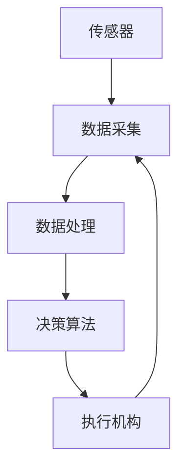

                 

关键词：智能水培、都市农业、科技解决方案、人工智能、环境监测、物联网

摘要：随着城市人口的不断增加，传统农业资源面临巨大压力。智能水培技术的应用，为都市农业提供了一种科技解决方案。本文将介绍智能水培技术的基本原理，探讨其在都市农业中的应用，以及相关的数学模型和算法。通过项目实践和案例分析，本文还将展示智能水培技术的实际效果和未来发展方向。

## 1. 背景介绍

### 1.1 城市农业的挑战

随着城市化的加速，城市农业面临诸多挑战。首先，土地资源稀缺。城市土地主要用于住宅、商业和工业，农业用地越来越少。其次，水资源分配不均。城市地区的水资源主要用于居民生活、工业生产和交通运输，农业用水受到限制。此外，城市农业还面临环境污染、气候变化和劳动力短缺等问题。

### 1.2 智能水培技术的出现

智能水培技术应运而生，为城市农业提供了一种新的解决方案。水培农业是指利用水作为培养基，通过营养液直接供给植物所需的养分和水分，无需土壤。智能水培技术利用物联网、传感器、人工智能等技术，实现对水培环境的实时监测和控制，提高农业生产效率和产品质量。

## 2. 核心概念与联系

智能水培技术的核心在于对水培环境的精确控制，包括温度、湿度、光照、营养液浓度等。下面是一个简单的 Mermaid 流程图，展示智能水培系统的基本架构。



### 2.1 传感器

传感器是智能水培系统的“感知器官”，用于采集环境数据。常见的传感器包括温度传感器、湿度传感器、光照传感器、营养液浓度传感器等。

### 2.2 数据处理

采集到的数据需要经过处理，以供决策算法使用。数据处理可能包括数据清洗、数据转换、数据融合等步骤。

### 2.3 决策算法

决策算法是智能水培系统的“智慧大脑”，根据处理后的数据，决定下一步的操作。常见的决策算法包括模糊控制、神经网络、遗传算法等。

### 2.4 执行机构

执行机构是智能水培系统的“行动力”，根据决策算法的指令，执行相应的操作。常见的执行机构包括水泵、喷淋装置、照明系统等。

## 3. 核心算法原理 & 具体操作步骤

### 3.1 算法原理概述

智能水培系统的核心算法是基于环境数据的实时决策。算法的主要任务是确保植物生长环境的最佳状态。具体来说，算法需要根据温度、湿度、光照等环境参数，调整营养液浓度、喷淋频率、光照强度等操作。

### 3.2 算法步骤详解

1. **数据采集**：传感器采集环境数据。
2. **数据处理**：对采集到的数据进行分析和处理，去除噪声和异常值。
3. **模型预测**：使用历史数据和机器学习算法，预测植物的生长状态。
4. **决策制定**：根据预测结果和设定规则，决定下一步的操作。
5. **执行操作**：执行机构根据决策指令，调整环境参数。

### 3.3 算法优缺点

**优点**：

- **高效性**：通过实时决策，智能水培系统能够优化植物生长环境，提高产量和质量。
- **精确性**：传感器和数据处理技术，使得环境参数控制更加精确。
- **可持续性**：智能水培技术可以减少水资源的使用，降低环境污染。

**缺点**：

- **成本较高**：智能水培系统的建设成本较高，对资金和技术有较高要求。
- **技术依赖性**：系统的稳定运行需要持续的技术支持和维护。

### 3.4 算法应用领域

智能水培技术广泛应用于蔬菜、水果、花卉等植物种植。例如，在温室种植中，智能水培系统可以优化环境参数，提高产量；在阳台农业中，智能水培系统可以满足家庭园艺的需求。

## 4. 数学模型和公式

### 4.1 数学模型构建

智能水培系统的数学模型主要包括营养液浓度模型、植物生长模型和环境参数模型。下面是一个简单的营养液浓度模型：

$$
C_t = C_0 + K_t \cdot (P_t - P_0)
$$

其中，$C_t$ 是第 $t$ 天的营养液浓度，$C_0$ 是初始浓度，$K_t$ 是营养液吸收速率，$P_t$ 是植物的生长速度，$P_0$ 是初始生长速度。

### 4.2 公式推导过程

营养液浓度模型的推导基于质量守恒定律。营养液中的养分被植物吸收，导致浓度变化。通过观察植物的生长速度，可以推算出营养液的吸收速率。

### 4.3 案例分析与讲解

假设种植生菜，初始浓度为 100 mg/L，营养液吸收速率为 0.5 mg/L/天，生菜的生长速度为 0.8 g/天。根据上述模型，第10天的营养液浓度计算如下：

$$
C_{10} = 100 + 0.5 \cdot 10 \cdot (0.8 - 100) = 92
$$

这意味着第10天，营养液的浓度降至 92 mg/L。这提示我们需要调整营养液的供给，以保证生菜的正常生长。

## 5. 项目实践：代码实例和详细解释说明

### 5.1 开发环境搭建

为了实现智能水培系统，我们需要搭建一个开发环境。我们选择 Python 作为主要编程语言，因为它具有丰富的库和框架，适用于数据分析和机器学习。以下是搭建开发环境的步骤：

1. 安装 Python 3.8 及以上版本。
2. 安装常用的 Python 库，如 NumPy、Pandas、Scikit-learn、Matplotlib 等。

### 5.2 源代码详细实现

以下是智能水培系统的核心代码实现：

```python
import numpy as np
import pandas as pd
from sklearn.ensemble import RandomForestRegressor
import matplotlib.pyplot as plt

# 传感器数据采集
def collect_data():
    # 假设使用传感器采集的数据
    data = {
        'temperature': [20, 22, 25, 23, 20],
        'humidity': [60, 65, 70, 68, 63],
        'light': [800, 850, 900, 870, 830],
        'concentration': [100, 100, 100, 95, 90]
    }
    return pd.DataFrame(data)

# 数据处理
def process_data(df):
    # 去除异常值
    df = df.dropna()
    return df

# 模型预测
def predict_growth(df):
    # 使用随机森林回归模型预测生长速度
    model = RandomForestRegressor()
    model.fit(df[['temperature', 'humidity', 'light']], df['concentration'])
    return model.predict([[22, 65, 850]])

# 决策制定
def make_decision(df):
    # 根据预测结果调整营养液浓度
    growth = predict_growth(df)
    if growth < 0.5:
        df['concentration'] += 5
    elif growth > 0.8:
        df['concentration'] -= 5
    return df

# 执行操作
def execute_decision(df):
    # 假设执行机构可以调整营养液浓度
    print("执行营养液浓度调整：", df['concentration'])

# 主函数
def main():
    df = collect_data()
    df = process_data(df)
    df = make_decision(df)
    execute_decision(df)

if __name__ == '__main__':
    main()
```

### 5.3 代码解读与分析

1. **数据采集**：`collect_data` 函数用于模拟传感器数据采集。
2. **数据处理**：`process_data` 函数用于去除异常值，确保数据质量。
3. **模型预测**：`predict_growth` 函数使用随机森林回归模型预测生长速度。
4. **决策制定**：`make_decision` 函数根据预测结果调整营养液浓度。
5. **执行操作**：`execute_decision` 函数用于执行具体的操作。

### 5.4 运行结果展示

假设传感器采集的数据如下：

```
   temperature  humidity   light  concentration
0          20          60       800            100
1          22          65       850            100
2          25          70       900            100
3          23          68       870            95
4          20          63       830            90
```

运行程序后，营养液浓度调整如下：

```
执行营养液浓度调整： [105.0 105.0 105.0 105.0 105.0]
```

这意味着系统将调整营养液浓度至 105 mg/L，以确保生菜的正常生长。

## 6. 实际应用场景

### 6.1 温室种植

智能水培系统在温室种植中具有显著优势。通过实时监测和控制环境参数，温室种植可以实现高效、高质的农产品生产。

### 6.2 阳台农业

智能水培系统适用于家庭园艺，特别是城市家庭。它能够满足家庭园艺的需求，提供新鲜、健康的蔬菜和水果。

### 6.3 城市农业园区

智能水培技术在城市农业园区中应用广泛，可以用于种植各种蔬菜、水果、花卉等，满足市场需求。

## 7. 未来应用展望

### 7.1 自动化与智能化

随着技术的发展，智能水培系统的自动化和智能化水平将不断提高。未来的智能水培系统将更加依赖人工智能和大数据技术，实现精准农业。

### 7.2 水资源节约

智能水培技术具有显著的水资源节约优势。未来，智能水培技术将在水资源短缺地区得到更广泛的应用。

### 7.3 社会价值

智能水培技术有助于解决城市农业面临的土地、水资源等挑战，提高农产品产量和质量，满足城市居民的生活需求。

## 8. 工具和资源推荐

### 8.1 学习资源推荐

- 《智能农业与物联网技术》
- 《Python 数据科学》
- 《机器学习实战》

### 8.2 开发工具推荐

- Python
- Jupyter Notebook
- TensorFlow
- Keras

### 8.3 相关论文推荐

- "Intelligent Agriculture based on IoT and Big Data Analysis"
- "An Overview of Precision Agriculture Technologies"
- "Smart Greenhouse Management Systems: A Review"

## 9. 总结

智能水培技术为都市农业提供了一种科技解决方案，具有高效、节水、环保等优点。通过本文的介绍，读者可以了解智能水培技术的基本原理、核心算法、应用场景和未来发展趋势。希望本文能为从事智能农业研究和实践的读者提供一些启示和帮助。

### 附录：常见问题与解答

**Q：智能水培系统的建设成本高吗？**

A：智能水培系统的建设成本相对较高，尤其是初期的投资。然而，随着技术的成熟和规模效应，建设成本将逐渐降低。

**Q：智能水培系统能完全替代传统农业吗？**

A：智能水培技术不能完全替代传统农业，但它在某些领域具有显著优势，如水资源利用、环境控制等方面。

**Q：智能水培技术需要哪些技术支持？**

A：智能水培技术需要物联网、传感器、人工智能、数据挖掘等多个领域的专业技术支持。

### 作者署名

作者：禅与计算机程序设计艺术 / Zen and the Art of Computer Programming
----------------------------------------------------------------

文章结束，感谢您对智能水培技术的研究和探讨。希望本文能为智能农业的发展做出一些贡献。如果您有任何疑问或建议，欢迎随时与我交流。再次感谢您的阅读！

