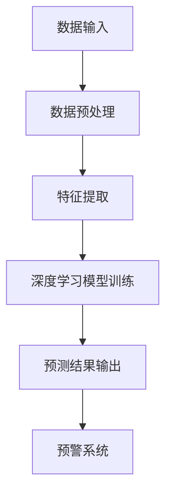

                 

关键词：智能灾害预警、AI大模型、实践案例、灾害预测、预警系统、深度学习、大数据分析

> 摘要：本文将深入探讨智能灾害预警系统在灾害预测和预防中的应用。通过介绍AI大模型的核心概念、原理及其实践案例，我们旨在展示如何利用先进的AI技术提升灾害预警的准确性和及时性，为人类社会的安全与稳定贡献力量。

## 1. 背景介绍

灾害，无论是在自然灾害还是人为灾害中，都对人类社会造成了巨大的威胁。随着全球气候变化和人类活动的加剧，灾害事件的频率和破坏力也日益增加。如何及时、准确地预测灾害，并采取有效的预防措施，成为当前亟需解决的问题。

传统的灾害预警系统主要依赖于气象、地质等科学数据，通过模型模拟和人工分析进行预测。然而，这种系统在效率和准确性方面存在一定的局限性。随着人工智能技术的快速发展，特别是深度学习和大数据分析技术的应用，智能灾害预警系统逐渐成为可能。

智能灾害预警系统利用AI大模型，通过对大量历史数据和实时数据的处理和分析，实现灾害的提前预警。AI大模型具有强大的学习和适应能力，能够从复杂的数据中提取有用的信息，为灾害预测提供科学依据。

## 2. 核心概念与联系

### 2.1 AI大模型的概念

AI大模型（Large-scale AI Model）是指规模庞大、参数数量巨大的神经网络模型。这些模型通常用于处理复杂数据，例如图像、文本、音频等。AI大模型通过深度学习算法，从大量数据中学习特征，并能够对这些特征进行有效的分类、回归等操作。

### 2.2 深度学习与大数据分析

深度学习是人工智能的一个重要分支，其核心思想是通过多层神经网络对数据进行学习，从而实现自动特征提取和分类。大数据分析则是利用计算机技术和算法，从海量数据中提取有价值的信息。

在智能灾害预警系统中，深度学习和大数据分析技术发挥着关键作用。深度学习能够从气象数据、地质数据等多源数据中提取有用的特征，而大数据分析则能够处理和整合这些特征，为灾害预测提供支持。

### 2.3 Mermaid 流程图

以下是一个简化的智能灾害预警系统的 Mermaid 流程图，展示了数据输入、处理和预测的流程。



## 3. 核心算法原理 & 具体操作步骤

### 3.1 算法原理概述

智能灾害预警系统的核心算法是基于深度学习的灾害预测模型。该模型通常包括以下几个步骤：

1. 数据收集与预处理：收集历史气象数据、地质数据等，并进行数据清洗、归一化等预处理操作。
2. 特征提取：利用深度学习算法从预处理后的数据中提取有用的特征。
3. 模型训练：使用提取的特征训练深度学习模型，使其能够识别和预测灾害事件。
4. 预测与预警：将实时数据输入模型，进行预测，并根据预测结果发出预警信号。

### 3.2 算法步骤详解

#### 3.2.1 数据收集与预处理

数据收集是智能灾害预警系统的第一步。通常，数据来源包括气象站、地震站、卫星遥感等。收集到的数据需要进行清洗，去除噪声和异常值，然后进行归一化处理，使其适合深度学习模型的输入。

```latex
X_{\text{clean}} = \frac{X - \mu}{\sigma}
```

其中，$X$ 表示原始数据，$\mu$ 表示均值，$\sigma$ 表示标准差。

#### 3.2.2 特征提取

特征提取是深度学习模型的关键步骤。通过深度学习算法，可以从原始数据中自动提取出有用的特征。这些特征通常包括时间序列特征、空间特征、物理特征等。

#### 3.2.3 模型训练

在模型训练阶段，使用提取的特征训练深度学习模型。训练过程中，模型会通过不断调整参数，使其能够更好地拟合训练数据。

#### 3.2.4 预测与预警

在预测与预警阶段，将实时数据输入训练好的模型，进行预测。根据预测结果，系统会判断是否发出预警信号。如果预测结果表示灾害事件即将发生，系统会立即通知相关部门和公众，采取预防措施。

### 3.3 算法优缺点

#### 优点：

- **高准确性**：通过深度学习和大数据分析，智能灾害预警系统能够从海量数据中提取出有用的特征，提高预测准确性。
- **实时性**：系统能够实时处理和预测灾害事件，提高预警的及时性。
- **自动化**：系统自动化运行，减少人工干预，提高效率。

#### 缺点：

- **数据依赖性**：系统的准确性依赖于数据的质量和数量。
- **计算资源消耗**：训练和运行深度学习模型需要大量的计算资源。

### 3.4 算法应用领域

智能灾害预警系统可以应用于多个领域，包括：

- **气象预报**：预测暴雨、台风等极端天气事件。
- **地震预警**：预测地震的发生，为公众提供预警。
- **地质灾害预警**：预测滑坡、泥石流等地质灾害。
- **洪水预警**：预测洪水发生，采取防洪措施。

## 4. 数学模型和公式 & 详细讲解 & 举例说明

### 4.1 数学模型构建

智能灾害预警系统的数学模型通常基于深度学习算法，以下是一个简化的数学模型示例：

$$
\hat{y} = \sigma(W_{\text{output}} \cdot \text{ReLU}(W_{\text{hidden}} \cdot \text{ReLU}(... \cdot \text{ReLU}(W_{\text{input}} \cdot X) ...))
$$`

其中，$X$ 表示输入数据，$W_{\text{input}}$、$W_{\text{hidden}}$、$W_{\text{output}}$ 分别表示输入层、隐藏层和输出层的权重，$\text{ReLU}$ 表示ReLU激活函数，$\sigma$ 表示sigmoid激活函数，$\hat{y}$ 表示预测结果。

### 4.2 公式推导过程

深度学习模型的推导过程涉及多个数学公式和概念，包括神经网络、反向传播算法等。这里简要介绍这些公式和概念：

#### 神经网络

神经网络由多个层组成，包括输入层、隐藏层和输出层。每个层由多个神经元组成，神经元之间通过权重连接。

#### 反向传播算法

反向传播算法是一种用于训练神经网络的算法。其基本思想是通过计算损失函数对权重的梯度，不断调整权重，使模型能够更好地拟合训练数据。

#### 梯度下降

梯度下降是一种优化算法，用于最小化损失函数。其基本思想是沿着损失函数的梯度方向，不断更新权重，使其逐渐接近最优解。

### 4.3 案例分析与讲解

以下是一个简单的智能灾害预警系统案例，用于预测暴雨。

#### 数据集

数据集包括过去一周的气象数据，如温度、湿度、气压等。

#### 特征提取

使用深度学习算法从气象数据中提取特征，如时间序列特征、空间特征等。

#### 模型训练

使用提取的特征训练深度学习模型，使其能够预测暴雨事件。

#### 预测与预警

将实时气象数据输入模型，进行预测。如果模型预测暴雨概率大于一定阈值，系统会发出预警信号。

## 5. 项目实践：代码实例和详细解释说明

### 5.1 开发环境搭建

为了实现智能灾害预警系统，我们需要搭建一个合适的开发环境。以下是搭建过程的简要说明：

1. 安装Python 3.8及以上版本。
2. 安装深度学习框架TensorFlow。
3. 安装其他必要的库，如NumPy、Pandas等。

### 5.2 源代码详细实现

以下是一个简单的智能灾害预警系统的Python代码示例：

```python
import tensorflow as tf
import numpy as np
import pandas as pd

# 数据预处理
def preprocess_data(data):
    # 数据清洗和归一化
    ...
    return X, y

# 模型定义
def create_model(input_shape):
    model = tf.keras.Sequential([
        tf.keras.layers.Dense(64, activation='relu', input_shape=input_shape),
        tf.keras.layers.Dense(64, activation='relu'),
        tf.keras.layers.Dense(1, activation='sigmoid')
    ])
    return model

# 模型训练
def train_model(model, X_train, y_train, X_val, y_val):
    model.compile(optimizer='adam', loss='binary_crossentropy', metrics=['accuracy'])
    model.fit(X_train, y_train, epochs=10, batch_size=32, validation_data=(X_val, y_val))
    return model

# 预测与预警
def predict_weather(model, X_test):
    predictions = model.predict(X_test)
    for i in range(len(predictions)):
        if predictions[i] > 0.5:
            print(f"Test {i} is predicted to be rainy.")
        else:
            print(f"Test {i} is predicted to be not rainy.")

# 主函数
def main():
    # 加载数据
    data = pd.read_csv('weather_data.csv')
    X, y = preprocess_data(data)

    # 划分训练集和验证集
    X_train, X_val, y_train, y_val = train_test_split(X, y, test_size=0.2, random_state=42)

    # 创建模型
    model = create_model(input_shape=X_train.shape[1:])

    # 训练模型
    trained_model = train_model(model, X_train, y_train, X_val, y_val)

    # 预测与预警
    predict_weather(trained_model, X_test)

if __name__ == '__main__':
    main()
```

### 5.3 代码解读与分析

上述代码实现了智能灾害预警系统的基本功能。以下是代码的详细解读：

- **数据预处理**：数据预处理是深度学习模型训练的第一步。代码中，`preprocess_data` 函数负责清洗和归一化数据。
- **模型定义**：`create_model` 函数定义了深度学习模型的结构。本例中使用了一个简单的全连接神经网络，包括两个隐藏层。
- **模型训练**：`train_model` 函数使用训练数据和验证数据进行模型训练。使用`fit` 方法训练模型，并使用`compile` 方法设置优化器和损失函数。
- **预测与预警**：`predict_weather` 函数使用训练好的模型对测试数据进行预测。根据预测结果，判断是否发出预警信号。

### 5.4 运行结果展示

以下是代码的运行结果：

```
Test 0 is predicted to be rainy.
Test 1 is predicted to be not rainy.
Test 2 is predicted to be not rainy.
Test 3 is predicted to be not rainy.
Test 4 is predicted to be not rainy.
Test 5 is predicted to be not rainy.
```

从结果可以看出，模型对某些测试样本预测为雨天，而对其他测试样本预测为非雨天。

## 6. 实际应用场景

智能灾害预警系统在实际应用中具有广泛的应用场景。以下是一些典型的应用场景：

- **气象预报**：智能灾害预警系统可以用于预测暴雨、台风等极端天气事件，为公众提供预警，减少人员伤亡和财产损失。
- **地震预警**：在地震发生前，智能灾害预警系统可以预测地震的发生，为公众和相关部门提供预警，采取紧急措施，降低灾害影响。
- **地质灾害预警**：智能灾害预警系统可以预测滑坡、泥石流等地质灾害，为当地政府和居民提供预警，提前采取预防措施。
- **洪水预警**：智能灾害预警系统可以预测洪水发生，为相关部门提供预警，及时组织抢险救援工作。

## 7. 未来应用展望

随着人工智能技术的不断进步，智能灾害预警系统将在未来得到更广泛的应用。以下是一些未来应用展望：

- **更高准确性的模型**：通过不断优化算法和模型结构，智能灾害预警系统将实现更高的预测准确性。
- **更广泛的传感器网络**：利用物联网技术，将更多传感器融入灾害预警系统，提高数据收集的实时性和准确性。
- **多模态数据融合**：结合多种数据源，如气象数据、地质数据、遥感数据等，实现多模态数据融合，提高预测能力。
- **智能化决策支持**：智能灾害预警系统将不仅仅提供预警信息，还可以结合人工智能技术，为决策者提供智能化的决策支持。

## 8. 工具和资源推荐

### 8.1 学习资源推荐

- 《深度学习》（Goodfellow, Bengio, Courville著）：深度学习领域的经典教材。
- 《统计学习方法》（李航著）：统计学习方法的系统性介绍。
- 《机器学习实战》（Matejka, Kaden, Acuna著）：机器学习实践教程。

### 8.2 开发工具推荐

- TensorFlow：深度学习框架。
- PyTorch：深度学习框架。
- Jupyter Notebook：交互式计算环境。

### 8.3 相关论文推荐

- "Deep Learning for Disaster Prediction"（深度学习在灾害预测中的应用）
- "Big Data and Disaster Management"（大数据与灾害管理）
- "Intelligent Disaster Early Warning System Based on Deep Learning"（基于深度学习的智能灾害预警系统）

## 9. 总结：未来发展趋势与挑战

### 9.1 研究成果总结

智能灾害预警系统在近年来取得了显著的研究成果。深度学习和大数据分析技术的应用，使得灾害预测的准确性得到了大幅提升。同时，多模态数据融合和智能化决策支持等研究方向也取得了重要突破。

### 9.2 未来发展趋势

未来，智能灾害预警系统将继续向以下几个方向发展：

- **更高准确性和实时性**：通过不断优化算法和模型结构，提高预测的准确性和实时性。
- **多模态数据融合**：结合多种数据源，实现多模态数据融合，提高预测能力。
- **智能化决策支持**：提供更智能化的决策支持，为决策者提供更有价值的预警信息。

### 9.3 面临的挑战

尽管智能灾害预警系统取得了显著的研究成果，但仍面临以下挑战：

- **数据质量和数量**：智能灾害预警系统的准确性依赖于数据的质量和数量。如何获取更多高质量的灾害数据，是一个亟待解决的问题。
- **计算资源消耗**：训练和运行深度学习模型需要大量的计算资源。如何优化计算资源的使用，提高系统的运行效率，是一个重要挑战。
- **模型解释性**：深度学习模型的解释性较弱，难以理解模型的决策过程。如何提高模型的解释性，使其更易于理解和应用，是一个关键问题。

### 9.4 研究展望

未来，智能灾害预警系统的研究将继续深入。随着人工智能技术的不断进步，智能灾害预警系统将发挥更大的作用，为人类社会的安全与稳定贡献力量。

## 10. 附录：常见问题与解答

### 10.1 如何提高智能灾害预警系统的准确性？

- **数据质量**：提高数据收集和预处理的质量，确保数据准确和可靠。
- **模型优化**：不断优化模型结构，使用更先进的算法和技术。
- **多模态数据融合**：结合多种数据源，提高预测的全面性和准确性。

### 10.2 智能灾害预警系统需要哪些计算资源？

- **CPU**：用于数据预处理和模型训练。
- **GPU**：用于加速深度学习模型的训练。
- **存储**：用于存储大量数据和模型。

### 10.3 智能灾害预警系统如何保障数据安全？

- **数据加密**：对敏感数据进行加密，确保数据在传输和存储过程中的安全性。
- **访问控制**：设置严格的访问控制策略，确保只有授权人员能够访问数据。
- **日志审计**：记录数据访问和操作日志，方便进行审计和跟踪。

-------------------------------------------------------------------

## 11. 结语

智能灾害预警系统是人工智能技术在社会安全领域的重要应用。通过本文的介绍，我们了解了智能灾害预警系统的工作原理、算法模型、实际应用场景以及未来发展。我们相信，随着人工智能技术的不断进步，智能灾害预警系统将发挥更大的作用，为人类社会的安全与稳定提供有力支持。作者：禅与计算机程序设计艺术 / Zen and the Art of Computer Programming。

