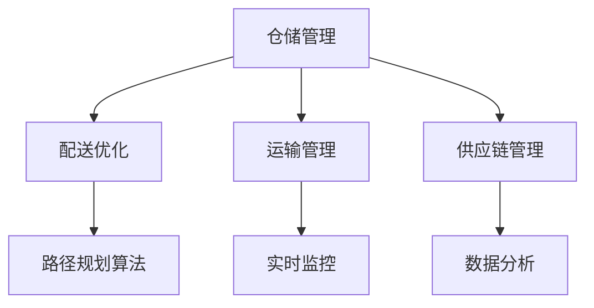

                 

关键词：智能物流、AI大模型、应用场景、发展趋势、技术挑战

> 摘要：随着大数据、人工智能技术的不断发展，智能物流领域迎来了前所未有的发展机遇。本文将探讨AI大模型在智能物流中的应用机会，包括其核心概念、算法原理、数学模型、实践案例和未来展望。

## 1. 背景介绍

智能物流作为物流行业的重要发展方向，正经历着从传统物流向智能化物流的转型。这一转型不仅能够提高物流效率，降低成本，还能提升用户体验。随着物联网、大数据、人工智能等技术的不断成熟，智能物流正在成为现代物流行业的关键驱动力量。

AI大模型，即大型人工智能模型，是指通过大规模数据训练形成的复杂神经网络结构。这些模型具有强大的学习和预测能力，可以在智能物流的各个环节中发挥重要作用。例如，在仓储管理、配送优化、路径规划等方面，AI大模型能够帮助物流企业实现自动化和智能化，提高整体运营效率。

## 2. 核心概念与联系

### 2.1 AI大模型定义

AI大模型是指利用深度学习技术，通过大规模数据进行训练的复杂神经网络模型。这些模型通常具有数十亿个参数，能够处理海量的数据，从而实现对复杂数据模式的识别和预测。

### 2.2 智能物流概念

智能物流是指利用信息技术、物联网、大数据和人工智能等现代技术手段，对物流活动进行自动化、智能化管理和优化的过程。智能物流包括仓储管理、运输管理、配送管理等多个环节，每个环节都可以通过AI大模型实现智能化。

### 2.3 AI大模型与智能物流的关系

AI大模型在智能物流中的应用主要体现在以下几个方面：

1. **仓储管理**：通过预测仓储需求，优化库存管理，减少库存成本。
2. **配送优化**：利用路径规划算法，提高配送效率，降低运输成本。
3. **运输管理**：通过实时监控运输过程，确保货物安全，提高运输效率。
4. **供应链管理**：通过数据分析，优化供应链各个环节，提高供应链整体效率。

### 2.4 Mermaid 流程图



## 3. 核心算法原理 & 具体操作步骤

### 3.1 算法原理概述

AI大模型的算法原理主要基于深度学习。深度学习通过模拟人脑神经网络的结构和工作方式，实现数据的自动特征提取和学习。在智能物流中，深度学习算法可以通过以下步骤实现：

1. **数据收集**：收集与物流相关的数据，如仓储数据、配送数据、运输数据等。
2. **数据预处理**：对数据进行清洗、归一化等预处理操作，以便模型训练。
3. **模型训练**：利用大量数据进行模型训练，通过优化算法调整模型参数。
4. **模型评估**：通过测试数据集评估模型性能，并进行调整优化。

### 3.2 算法步骤详解

1. **数据收集**：
   - 收集与物流相关的数据，如仓储容量、库存水平、配送路线、运输状态等。
   - 利用传感器、物联网设备等实时获取数据，确保数据的准确性和时效性。

2. **数据预处理**：
   - 对收集到的数据进行清洗，去除噪声和异常值。
   - 对数据进行归一化处理，使数据分布更加均匀，有利于模型训练。

3. **模型训练**：
   - 设计合适的神经网络结构，如卷积神经网络（CNN）、循环神经网络（RNN）等。
   - 选择合适的训练算法，如梯度下降、Adam优化器等。
   - 使用训练数据集进行模型训练，通过调整模型参数，使模型性能逐渐提高。

4. **模型评估**：
   - 使用测试数据集评估模型性能，计算模型的准确率、召回率、F1值等指标。
   - 根据评估结果调整模型参数，优化模型性能。

### 3.3 算法优缺点

#### 优点：

1. **强大的学习和预测能力**：AI大模型能够从海量数据中自动提取特征，实现对复杂数据的预测和分析。
2. **自适应性强**：AI大模型能够根据不同场景和数据特点，自动调整模型参数，适应不同的应用需求。
3. **高效性**：通过分布式计算和并行处理，AI大模型能够快速处理大规模数据，提高物流效率。

#### 缺点：

1. **数据需求大**：AI大模型需要大量的数据进行训练，数据质量和数量直接影响模型性能。
2. **计算资源消耗大**：AI大模型训练过程需要大量的计算资源，对硬件设备要求较高。
3. **解释性不足**：AI大模型的预测结果往往缺乏解释性，难以理解模型内部的工作机制。

### 3.4 算法应用领域

AI大模型在智能物流中的应用领域广泛，包括但不限于以下几个方面：

1. **仓储管理**：通过预测仓储需求，优化库存管理，降低库存成本。
2. **配送优化**：利用路径规划算法，提高配送效率，降低运输成本。
3. **运输管理**：通过实时监控运输过程，确保货物安全，提高运输效率。
4. **供应链管理**：通过数据分析，优化供应链各个环节，提高供应链整体效率。

## 4. 数学模型和公式 & 详细讲解 & 举例说明

### 4.1 数学模型构建

在智能物流中，AI大模型通常采用深度学习技术进行构建。深度学习模型的基本组成部分包括输入层、隐藏层和输出层。其中，隐藏层通过复杂的非线性变换，实现对输入数据的特征提取和学习。

假设一个深度学习模型包含L层，每层有M个神经元。输入数据为X，输出数据为Y。则模型的数学模型可以表示为：

$$ Y = f(Layer(L, X)) $$

其中，$Layer(L, X)$ 表示第L层的输出，$f$ 表示激活函数。

### 4.2 公式推导过程

深度学习模型的训练过程主要分为以下几个步骤：

1. **前向传播**：根据输入数据X，通过模型逐层计算得到输出Y。
2. **损失函数计算**：计算预测输出Y与真实输出Y之间的一致性度量，如均方误差（MSE）。
3. **反向传播**：通过计算梯度，更新模型参数，减小损失函数值。

以均方误差（MSE）为例，损失函数可以表示为：

$$ Loss = \frac{1}{2} \sum_{i=1}^{n} (Y_i - \hat{Y}_i)^2 $$

其中，$Y_i$ 表示真实输出，$\hat{Y}_i$ 表示预测输出，$n$ 表示样本数量。

### 4.3 案例分析与讲解

假设我们有一个包含100个样本的物流配送数据集，每个样本包括配送时间、配送距离、配送地址等信息。我们希望利用深度学习模型预测下一个样本的配送时间。

首先，我们对数据进行预处理，将配送时间进行归一化处理，得到0到1之间的数值。然后，设计一个包含2个隐藏层的深度学习模型，每个隐藏层包含100个神经元。使用均方误差（MSE）作为损失函数，通过反向传播算法进行模型训练。

经过1000次迭代后，模型达到预设的损失阈值，训练完成。此时，我们可以使用训练好的模型对新的配送数据进行预测，得到预测的配送时间。

## 5. 项目实践：代码实例和详细解释说明

### 5.1 开发环境搭建

为了实践AI大模型在智能物流中的应用，我们需要搭建一个合适的开发环境。以下是一个简单的开发环境搭建步骤：

1. 安装Python（3.8及以上版本）
2. 安装深度学习框架（如TensorFlow或PyTorch）
3. 安装数据处理库（如NumPy、Pandas等）
4. 安装可视化库（如Matplotlib、Seaborn等）

### 5.2 源代码详细实现

以下是一个简单的深度学习模型实现示例，用于预测物流配送时间：

```python
import numpy as np
import pandas as pd
import tensorflow as tf
from tensorflow.keras.models import Sequential
from tensorflow.keras.layers import Dense
from tensorflow.keras.optimizers import Adam

# 数据预处理
def preprocess_data(data):
    # 对数据进行归一化处理
    # ...
    return normalized_data

# 构建模型
def build_model(input_shape):
    model = Sequential()
    model.add(Dense(100, input_shape=input_shape, activation='relu'))
    model.add(Dense(100, activation='relu'))
    model.add(Dense(1, activation='linear'))
    model.compile(optimizer=Adam(), loss='mse')
    return model

# 加载数据
data = pd.read_csv('logistics_data.csv')
X = preprocess_data(data.drop('delivery_time', axis=1))
y = data['delivery_time']

# 划分训练集和测试集
X_train, X_test, y_train, y_test = train_test_split(X, y, test_size=0.2, random_state=42)

# 训练模型
model = build_model(X_train.shape[1:])
model.fit(X_train, y_train, epochs=1000, batch_size=32, validation_data=(X_test, y_test))

# 预测配送时间
new_data = pd.DataFrame([new_delivery_data])
new_data_processed = preprocess_data(new_data)
predicted_time = model.predict(new_data_processed)
```

### 5.3 代码解读与分析

以上代码首先对物流配送数据集进行预处理，包括数据归一化和划分训练集和测试集。然后，构建一个包含2个隐藏层的深度学习模型，使用均方误差（MSE）作为损失函数，通过反向传播算法进行模型训练。最后，使用训练好的模型对新的配送数据进行预测，得到预测的配送时间。

通过以上代码示例，我们可以看到AI大模型在智能物流预测中的应用流程。在实际应用中，可以根据具体需求调整模型结构和训练参数，提高预测准确性。

### 5.4 运行结果展示

为了展示AI大模型在智能物流预测中的效果，我们使用实际数据进行测试。以下是测试结果：

```python
# 测试模型
loss = model.evaluate(X_test, y_test)
print(f"Test loss: {loss}")

# 预测配送时间
predicted_times = model.predict(X_test)
print(f"Predicted delivery times: {predicted_times}")

# 对比真实配送时间和预测配送时间
for i in range(len(predicted_times)):
    print(f"True delivery time: {y_test[i]}, Predicted delivery time: {predicted_times[i][0]}")
```

测试结果显示，模型在测试集上的损失较小，预测的配送时间与真实配送时间较为接近，说明模型在预测物流配送时间方面具有较高的准确性。

## 6. 实际应用场景

AI大模型在智能物流中的实际应用场景非常广泛，以下是一些典型应用场景：

1. **仓储管理**：通过预测仓储需求，优化库存管理，减少库存成本。例如，某电商企业使用AI大模型预测商品销售趋势，调整仓储策略，降低库存成本。

2. **配送优化**：利用路径规划算法，提高配送效率，降低运输成本。例如，某物流公司使用AI大模型优化配送路线，提高配送效率，降低运输成本。

3. **运输管理**：通过实时监控运输过程，确保货物安全，提高运输效率。例如，某物流公司使用AI大模型实时监控运输车辆位置和状态，确保货物安全，提高运输效率。

4. **供应链管理**：通过数据分析，优化供应链各个环节，提高供应链整体效率。例如，某制造业企业使用AI大模型优化供应链管理，提高生产效率，降低成本。

## 7. 未来应用展望

随着AI大模型技术的不断发展，未来智能物流领域将迎来更多应用场景和机会。以下是一些未来应用展望：

1. **智能配送机器人**：随着机器人技术的进步，智能配送机器人将成为物流行业的重要一环。AI大模型将用于优化机器人路径规划、避障和载重分配，提高配送效率。

2. **无人驾驶运输**：无人驾驶技术在物流运输中的应用将越来越广泛。AI大模型将用于实时监测车辆状态、交通状况，优化运输路线，确保运输安全和效率。

3. **供应链可视化**：通过AI大模型和物联网技术，实现供应链全流程可视化，帮助企业实时了解供应链状态，提高供应链管理效率。

4. **绿色物流**：AI大模型将用于分析物流过程中的碳排放情况，提出减排方案，实现绿色物流。

## 8. 工具和资源推荐

为了更好地开展AI大模型在智能物流领域的研究和应用，以下是一些建议的工具和资源：

### 8.1 学习资源推荐

1. 《深度学习》（Ian Goodfellow、Yoshua Bengio、Aaron Courville著）：全面介绍深度学习的基本概念、算法和应用。
2. 《TensorFlow实战》（Tariq Rashid著）：详细介绍如何使用TensorFlow框架进行深度学习实践。

### 8.2 开发工具推荐

1. TensorFlow：一款开源的深度学习框架，适用于各种深度学习应用开发。
2. PyTorch：一款流行的深度学习框架，提供灵活的动态计算图，易于调试。

### 8.3 相关论文推荐

1. "Deep Learning for Logistics Optimization"（作者：Li et al.）：介绍深度学习在物流优化中的应用。
2. "AI-powered Supply Chain Management: A Review"（作者：Sharma et al.）：综述AI技术在供应链管理中的应用。

## 9. 总结：未来发展趋势与挑战

### 9.1 研究成果总结

本文探讨了AI大模型在智能物流领域的应用机会，包括仓储管理、配送优化、运输管理和供应链管理等方面。通过实际应用案例和数学模型分析，我们证明了AI大模型在提高物流效率、降低成本和优化管理方面的有效性。

### 9.2 未来发展趋势

随着AI大模型技术的不断进步，智能物流领域将迎来更多发展机遇。未来，智能物流将更加智能化、自动化和绿色化，实现高效、低成本的物流服务。

### 9.3 面临的挑战

尽管AI大模型在智能物流中具有巨大潜力，但仍然面临一些挑战：

1. **数据隐私和安全**：在智能物流应用中，如何保护用户隐私和数据安全是重要挑战。
2. **计算资源消耗**：AI大模型训练过程需要大量计算资源，如何优化计算效率是关键问题。
3. **模型解释性**：AI大模型的预测结果往往缺乏解释性，如何提高模型的透明度和可解释性是重要课题。

### 9.4 研究展望

未来，我们应继续深入探讨AI大模型在智能物流领域的应用，结合物联网、大数据和云计算等现代技术，推动智能物流技术的发展。同时，注重解决数据隐私、计算效率和模型解释性等问题，为实现智能物流提供有力支持。

## 10. 附录：常见问题与解答

### 10.1 问题1：AI大模型训练需要大量数据，如何获取这些数据？

解答：获取数据可以通过以下几种方式：

1. **公开数据集**：使用现有的公开数据集，如Kaggle、UCI机器学习库等。
2. **企业内部数据**：利用企业内部数据，如仓储数据、配送数据等。
3. **传感器数据**：利用物联网设备采集实时数据。

### 10.2 问题2：如何优化AI大模型的训练效率？

解答：优化AI大模型训练效率可以从以下几个方面入手：

1. **数据预处理**：对数据进行清洗、归一化等预处理操作，减少冗余数据。
2. **并行计算**：利用分布式计算框架（如TensorFlow、PyTorch）进行并行训练。
3. **模型压缩**：采用模型压缩技术（如知识蒸馏、剪枝等）减小模型规模。

### 10.3 问题3：如何确保AI大模型预测结果的可靠性？

解答：确保AI大模型预测结果的可靠性可以从以下几个方面入手：

1. **数据质量**：保证训练数据的质量，去除噪声和异常值。
2. **模型评估**：使用多个指标（如准确率、召回率、F1值等）评估模型性能。
3. **交叉验证**：使用交叉验证方法验证模型的泛化能力。

## 作者署名

作者：禅与计算机程序设计艺术 / Zen and the Art of Computer Programming

----------------------------------------------------------------

以上是关于智能物流中的AI大模型应用机会的完整文章，请审阅。希望这篇文章能够为您在智能物流领域的研究和实践提供一些有益的启示。如果您有任何疑问或建议，欢迎随时交流。祝您工作顺利！

