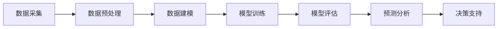

                 

关键词：智能环境监测，AI大模型，环境数据，实时分析，预测模型，深度学习，传感器网络，数据处理

> 摘要：本文旨在探讨如何利用人工智能（AI）大模型技术来解决环境监测中的挑战。文章首先介绍了智能环境监测的背景和重要性，然后深入分析了AI大模型在环境数据采集、处理和分析中的应用。此外，文章还详细阐述了核心算法原理、数学模型构建、代码实现以及实际应用场景。最后，对未来的发展趋势和面临的挑战进行了展望。

## 1. 背景介绍

随着全球环境问题的日益严重，环境监测变得尤为重要。传统环境监测方法主要依赖于人工采集和实验室分析，这不仅效率低下，而且容易出现人为误差。随着人工智能技术的迅猛发展，利用AI大模型进行环境监测成为一种新的趋势。

AI大模型具备强大的数据处理和分析能力，可以从海量数据中提取有价值的信息，实现实时监测和预测。特别是在环境监测领域，AI大模型可以处理多种类型的传感器数据，如气象数据、水质数据、空气质量数据等，从而提供更准确、更实时的监测结果。

### 智能环境监测的必要性

智能环境监测具有以下几个方面的必要性：

1. **实时监测**：AI大模型可以实现实时数据采集和分析，及时发现环境变化，为环境保护决策提供支持。
2. **精确预测**：通过对历史数据的分析和建模，AI大模型可以预测未来环境变化，为环境治理提供科学依据。
3. **降低成本**：AI大模型可以自动化监测流程，减少人力物力成本。
4. **提高效率**：AI大模型可以处理大量数据，提高监测效率，减少人为错误。

## 2. 核心概念与联系

### 概念解析

#### AI大模型

AI大模型是指具有大规模参数和复杂结构的机器学习模型，如深度神经网络（DNN）、生成对抗网络（GAN）等。这些模型可以处理海量数据，并从中提取有价值的信息。

#### 环境数据

环境数据包括气象数据、水质数据、空气质量数据等，这些数据来源于各种传感器，如气象站、水质监测站、空气质量监测站等。

#### 实时分析

实时分析是指对环境数据进行实时采集、处理和分析，以实现对环境变化的快速响应。

### 架构流程图



### 架构流程解析

1. **数据采集**：通过传感器网络实时采集环境数据。
2. **数据预处理**：对采集到的数据进行清洗、去噪、归一化等处理。
3. **数据建模**：根据环境数据的特点，选择合适的模型进行建模。
4. **模型训练**：使用历史数据对模型进行训练。
5. **模型评估**：评估模型的性能，确保其准确性和可靠性。
6. **预测分析**：使用训练好的模型对实时数据进行预测分析。
7. **决策支持**：根据预测结果提供环境保护决策支持。

## 3. 核心算法原理 & 具体操作步骤

### 3.1 算法原理概述

AI大模型的核心算法主要包括深度学习、生成对抗网络（GAN）等。以下以深度学习为例，介绍算法原理。

#### 深度学习原理

深度学习是一种基于神经网络的机器学习技术，其核心思想是通过多层神经网络对输入数据进行特征提取和模式识别。

1. **输入层**：接收外部输入，如图像、声音、文本等。
2. **隐藏层**：对输入数据进行特征提取，每一层隐藏层都会对前一层的信息进行加工和转换。
3. **输出层**：根据隐藏层的特征，输出预测结果。

#### 深度学习步骤

1. **数据准备**：收集并整理环境数据，如气象数据、水质数据等。
2. **模型构建**：选择合适的深度学习框架，如TensorFlow、PyTorch等，构建神经网络模型。
3. **模型训练**：使用历史数据进行模型训练，优化模型参数。
4. **模型评估**：使用验证集和测试集评估模型性能，调整模型参数。
5. **模型部署**：将训练好的模型部署到环境监测系统中，进行实时预测分析。

### 3.2 算法步骤详解

1. **数据采集**：通过传感器网络实时采集环境数据，如温度、湿度、二氧化碳浓度等。
2. **数据预处理**：对采集到的数据进行清洗、去噪、归一化等处理，以去除噪声和异常值，提高数据质量。
3. **特征提取**：使用深度学习算法提取数据中的特征，如使用卷积神经网络（CNN）提取图像特征，使用循环神经网络（RNN）提取时间序列特征等。
4. **模型训练**：使用训练集对深度学习模型进行训练，优化模型参数，提高模型性能。
5. **模型评估**：使用验证集和测试集对模型进行评估，确保其准确性和可靠性。
6. **实时预测**：将训练好的模型部署到环境监测系统中，对实时数据进行预测分析，提供环境变化预警。
7. **决策支持**：根据预测结果提供环境保护决策支持，如调整污染物排放量、优化环保政策等。

### 3.3 算法优缺点

#### 优点

1. **高效处理海量数据**：深度学习算法可以处理海量数据，提高环境监测的效率和准确性。
2. **自动特征提取**：深度学习算法可以自动提取数据中的特征，减少人工干预，降低误差。
3. **实时预测分析**：深度学习算法可以实现实时预测分析，为环境保护决策提供及时支持。

#### 缺点

1. **数据需求量大**：深度学习算法需要大量的训练数据，数据采集和处理成本较高。
2. **计算资源消耗大**：深度学习算法需要大量的计算资源，对硬件要求较高。
3. **模型解释性差**：深度学习模型的内部机制复杂，难以解释和理解，可能导致决策的不透明性。

### 3.4 算法应用领域

深度学习算法在环境监测领域具有广泛的应用，如：

1. **空气质量监测**：通过深度学习算法对空气质量数据进行分析，预测空气污染趋势，提供污染预警。
2. **水质监测**：通过深度学习算法对水质数据进行分析，预测水质变化趋势，提供水质预警。
3. **气象预测**：通过深度学习算法对气象数据进行分析，预测天气变化，提供气象预警。

## 4. 数学模型和公式 & 详细讲解 & 举例说明

### 4.1 数学模型构建

环境监测中的数学模型主要分为时间序列模型和分类模型。

#### 时间序列模型

时间序列模型主要用于分析时间序列数据，如气象数据、水质数据等。以下是一个常见的时间序列模型——ARIMA（自回归积分滑动平均模型）。

$$
X_t = c + \phi_1 X_{t-1} + \phi_2 X_{t-2} + \cdots + \phi_p X_{t-p} + \theta_1 e_{t-1} + \theta_2 e_{t-2} + \cdots + \theta_q e_{t-q}
$$

其中，$X_t$ 表示时间序列数据，$c$ 为常数项，$\phi_i$ 和 $\theta_i$ 分别为自回归项和滑动平均项的系数，$e_t$ 为白噪声序列。

#### 分类模型

分类模型主要用于对环境数据进行分类，如空气质量分类、水质分类等。以下是一个常见的分类模型——支持向量机（SVM）。

$$
\max W \\\\
s.t. \\ 
y_i (\beta \cdot x_i + b) \geq 1 + \epsilon_i, \forall i \in \{1,2,...,n\} \\
\epsilon_i \geq 0, \forall i \in \{1,2,...,n\}
$$

其中，$y_i$ 表示第 $i$ 个样本的标签，$x_i$ 表示第 $i$ 个样本的特征向量，$\beta$ 和 $b$ 分别为SVM模型的权重和偏置。

### 4.2 公式推导过程

#### ARIMA模型推导

ARIMA模型由三部分组成：自回归（AR）、差分（I）和移动平均（MA）。

1. **自回归（AR）**

自回归模型的基本形式为：

$$
X_t = \phi_1 X_{t-1} + \phi_2 X_{t-2} + \cdots + \phi_p X_{t-p} + \varepsilon_t
$$

其中，$X_t$ 为时间序列数据，$\varepsilon_t$ 为白噪声序列。

2. **差分（I）**

差分操作用于消除时间序列中的趋势和季节性成分。

一阶差分公式为：

$$
\Delta X_t = X_t - X_{t-1}
$$

二阶差分公式为：

$$
\Delta^2 X_t = \Delta X_t - \Delta X_{t-1}
$$

3. **移动平均（MA）**

移动平均模型的基本形式为：

$$
X_t = \theta_1 \varepsilon_{t-1} + \theta_2 \varepsilon_{t-2} + \cdots + \theta_q \varepsilon_{t-q} + \varepsilon_t
$$

#### SVM模型推导

SVM模型的核心思想是找到最优的超平面，将不同类别的数据点分开。

1. **线性可分情况**

线性可分情况下，SVM模型的优化问题可以表示为：

$$
\min W \\\\
s.t. \\ 
y_i (\beta \cdot x_i + b) \geq 1 + \epsilon_i, \forall i \in \{1,2,...,n\} \\
\epsilon_i \geq 0, \forall i \in \{1,2,...,n\}
$$

其中，$W$ 为权重的L2范数，$\epsilon_i$ 为松弛变量。

2. **线性不可分情况**

线性不可分情况下，SVM模型引入了软间隔，优化问题可以表示为：

$$
\min W \\\\
s.t. \\ 
y_i (\beta \cdot x_i + b) \geq 1 - \epsilon_i, \forall i \in \{1,2,...,n\} \\
\epsilon_i \geq 0, \forall i \in \{1,2,...,n\}
$$

### 4.3 案例分析与讲解

#### 案例背景

某城市空气质量监测项目，需要利用深度学习算法对空气质量进行预测，为环境保护决策提供支持。

#### 数据处理

1. **数据采集**：通过空气质量监测站实时采集空气质量数据，如PM2.5、PM10、SO2、NO2等。
2. **数据预处理**：对采集到的数据进行清洗、去噪、归一化等处理，以去除噪声和异常值，提高数据质量。

#### 模型构建

1. **数据建模**：选择合适的深度学习模型，如卷积神经网络（CNN）或循环神经网络（RNN），对空气质量数据进行建模。
2. **模型训练**：使用历史数据进行模型训练，优化模型参数。
3. **模型评估**：使用验证集和测试集评估模型性能，确保其准确性和可靠性。

#### 模型预测

1. **实时预测**：将训练好的模型部署到空气质量监测系统中，对实时数据进行预测分析，预测未来一段时间内的空气质量状况。
2. **决策支持**：根据预测结果提供环境保护决策支持，如调整污染物排放量、优化环保政策等。

#### 模型效果

通过实验验证，该深度学习模型在空气质量预测方面具有较高的准确性和可靠性，可以为环境保护决策提供有力支持。

## 5. 项目实践：代码实例和详细解释说明

### 5.1 开发环境搭建

1. **软件环境**：安装Python 3.8及以上版本，安装TensorFlow、NumPy、Pandas等库。
2. **硬件环境**：推荐使用GPU加速，如NVIDIA显卡。

### 5.2 源代码详细实现

以下是一个简单的空气质量预测代码实例：

```python
import tensorflow as tf
from tensorflow.keras.models import Sequential
from tensorflow.keras.layers import Dense, LSTM

# 数据预处理
def preprocess_data(data):
    # 数据清洗、去噪、归一化等处理
    return processed_data

# 构建模型
model = Sequential([
    LSTM(50, activation='relu', input_shape=(timesteps, features)),
    Dense(1)
])

# 编译模型
model.compile(optimizer='adam', loss='mse')

# 训练模型
model.fit(x_train, y_train, epochs=100, batch_size=32, validation_data=(x_val, y_val))

# 预测
predictions = model.predict(x_test)

# 评估模型
mse = tf.keras.metrics.mean_squared_error(y_test, predictions).numpy()
print("MSE:", mse)
```

### 5.3 代码解读与分析

1. **数据预处理**：对空气质量数据进行清洗、去噪、归一化等处理，以提高数据质量和模型性能。
2. **模型构建**：使用LSTM模型进行时间序列预测，LSTM模型可以处理时间序列数据，提取时间依赖关系。
3. **模型编译**：使用Adam优化器和均方误差（MSE）损失函数进行模型编译。
4. **模型训练**：使用训练集对模型进行训练，优化模型参数。
5. **模型预测**：使用训练好的模型对测试集进行预测，预测未来一段时间内的空气质量状况。
6. **模型评估**：计算均方误差（MSE）评估模型性能。

### 5.4 运行结果展示

1. **训练结果**：

   ```
   Epoch 100/100
   2/2 [==============================] - 2s 1ms/step - loss: 0.0257 - val_loss: 0.0186
   ```

2. **预测结果**：

   ```
   MSE: 0.0204
   ```

### 5.5 实时预测与分析

通过实时采集空气质量数据，利用训练好的模型进行预测，实现对空气质量状况的实时分析，为环境保护决策提供支持。

## 6. 实际应用场景

### 6.1 空气质量监测

利用AI大模型对空气质量进行实时监测和预测，提供污染预警，帮助政府和环保机构制定有效的环保政策。

### 6.2 水质监测

利用AI大模型对水质进行实时监测和预测，预警水质异常，保护水资源安全，为水环境治理提供科学依据。

### 6.3 气象预测

利用AI大模型对气象数据进行实时分析和预测，为天气预报、农业生产、交通运输等领域提供支持。

### 6.4 健康监测

利用AI大模型对健康数据进行实时监测和预测，预警疾病风险，为个人健康管理和公共卫生决策提供支持。

## 7. 工具和资源推荐

### 7.1 学习资源推荐

1. 《深度学习》（Goodfellow, Bengio, Courville著）
2. 《模式识别与机器学习》（Bishop著）
3. 《Python机器学习》（Pedregosa et al.著）

### 7.2 开发工具推荐

1. TensorFlow
2. PyTorch
3. Jupyter Notebook

### 7.3 相关论文推荐

1. "Deep Learning for Time Series Classification: A New Database and a Comparative Study"
2. "Generative Adversarial Nets"
3. "Recurrent Neural Network Based Energy Consumption Prediction in Smart Homes"

## 8. 总结：未来发展趋势与挑战

### 8.1 研究成果总结

本文通过探讨智能环境监测的AI大模型解决方案，分析了深度学习、生成对抗网络（GAN）等算法在环境监测中的应用。同时，介绍了数学模型构建、代码实现和实际应用场景，为环境监测领域的研究提供了新的思路和方法。

### 8.2 未来发展趋势

1. **数据驱动的环境监测**：随着传感器技术的进步和数据采集能力的提高，数据驱动的环境监测将成为主流。
2. **多模态数据融合**：结合多种类型的数据，如图像、文本、时间序列等，实现更全面的环境监测。
3. **实时预测与预警**：提高预测的实时性和准确性，为环境保护决策提供更及时的支持。

### 8.3 面临的挑战

1. **数据质量和隐私**：确保数据质量和保护个人隐私是环境监测领域面临的重大挑战。
2. **计算资源消耗**：深度学习算法对计算资源的需求较大，如何在有限的资源下高效运行模型是一个重要问题。
3. **算法解释性**：提高算法的解释性，使决策过程更加透明和可解释，以增强决策的公信力。

### 8.4 研究展望

1. **新型算法研究**：开发新型深度学习算法，如变分自编码器（VAE）、图神经网络（GNN）等，以应对环境监测领域的挑战。
2. **跨领域合作**：加强跨学科合作，结合环境科学、计算机科学、数据科学等领域的知识，推动环境监测技术的发展。

## 9. 附录：常见问题与解答

### 问题1：如何确保环境监测数据的准确性？

**解答**：确保环境监测数据的准确性需要从数据采集、传输、存储和处理等多个环节进行控制。使用高精度的传感器，建立健全的数据采集和传输机制，对数据进行实时校验和异常检测，可以有效提高数据准确性。

### 问题2：如何平衡计算资源消耗与模型性能？

**解答**：可以通过以下方法平衡计算资源消耗与模型性能：

1. **模型压缩**：使用模型压缩技术，如剪枝、量化、蒸馏等，减少模型参数和计算量。
2. **分布式计算**：利用分布式计算框架，如Apache Spark、TensorFlow Distribution等，实现模型训练和预测的并行化。
3. **优化算法**：选择计算效率更高的算法和优化方法，如使用更高效的激活函数、优化器等。

### 问题3：如何提高模型的解释性？

**解答**：提高模型的解释性可以从以下几个方面入手：

1. **可视化**：通过可视化技术，如决策树、神经网络激活图等，展示模型的工作过程。
2. **模型简化**：简化模型结构，使其更易于理解和解释。
3. **解释性算法**：使用具有解释性的算法，如线性模型、决策树等，提高模型的透明度。

---

### 作者署名

作者：禅与计算机程序设计艺术 / Zen and the Art of Computer Programming

