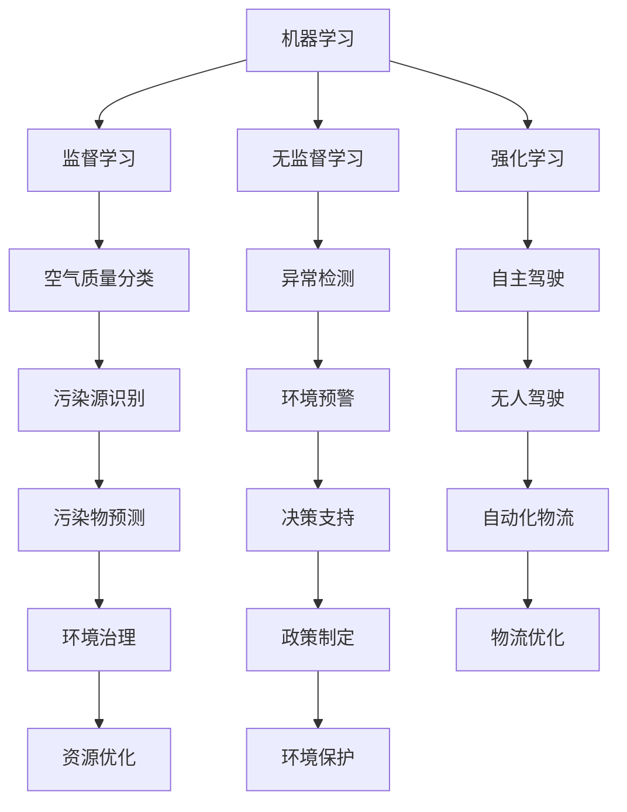

                 

在当今世界，环境保护问题日益严峻，环境监测已经成为国家和社会关注的焦点。传统的环境监测方法依赖于人力和数据采集设备，不仅效率低下，而且成本高昂。随着人工智能技术的飞速发展，利用AI大模型进行环境监测成为了一种全新的解决方案。本文将介绍智能环境监测的AI大模型解决方案，探讨其核心概念、算法原理、数学模型、应用实践以及未来发展趋势。

## 关键词
- 智能环境监测
- AI大模型
- 机器学习
- 环境数据分析
- 监测算法

## 摘要
本文旨在探讨利用人工智能大模型进行环境监测的解决方案。首先，我们将介绍智能环境监测的背景和重要性。接着，本文将详细阐述AI大模型的核心概念及其在环境监测中的应用。随后，我们将深入探讨AI大模型的基本算法原理，并讲解如何使用数学模型对环境数据进行分析。此外，本文还将通过实际项目实践，展示如何搭建开发环境、编写源代码以及运行结果分析。最后，本文将总结AI大模型在环境监测领域的应用，并提出未来发展的展望。

----------------------------------------------------------------

## 1. 背景介绍

随着工业化和城市化的加速发展，环境污染问题日益严重。大气污染、水污染、土壤污染等问题给人类的健康和生活带来了极大的威胁。传统的环境监测方法主要依赖于人工监测和数据采集设备，例如空气采样器、水质检测仪和土壤检测器等。这些设备虽然能够提供一定的监测数据，但存在以下问题：

1. **成本高昂**：购置和维护这些设备需要大量资金投入。
2. **监测效率低**：依赖人工进行监测，数据采集和处理速度较慢。
3. **监测范围有限**：传统设备监测范围较小，难以覆盖广泛的环境区域。
4. **数据质量不稳定**：人工监测和数据采集过程中可能存在人为误差和监测设备故障等问题。

为了解决这些问题，近年来人工智能技术在环境监测领域得到了广泛应用。特别是基于机器学习和深度学习的人工智能大模型，其具备以下优势：

1. **高效数据处理**：AI大模型能够快速处理和分析海量环境数据，提高监测效率。
2. **降低成本**：通过自动化监测和数据采集，减少了对人工和设备的依赖。
3. **扩展监测范围**：AI大模型可以实现对大范围环境的实时监测。
4. **提高数据质量**：AI大模型可以自动识别和处理异常数据，保证监测数据的准确性。

因此，智能环境监测的AI大模型解决方案已经成为环境监测领域的重要发展方向。通过本文的介绍，我们将深入了解这一解决方案的核心概念、算法原理、数学模型和应用实践，为环境监测领域的研究和实践提供参考。

### 1.1 智能环境监测的定义与发展历程

智能环境监测是指利用人工智能技术，特别是机器学习和深度学习算法，对环境数据进行实时采集、处理和分析，从而实现对环境状况的智能监测和预测。智能环境监测的发展历程可以追溯到20世纪末和21世纪初，当时计算机技术和传感器技术开始逐渐成熟，为智能环境监测提供了技术基础。

在早期，环境监测主要依赖于传统的传感器和人工监测。这些传感器包括温度传感器、湿度传感器、空气质量传感器等，能够采集一定环境参数的数据。然而，这些设备的数据采集能力有限，无法实现大规模、实时的环境监测。随着计算机技术的快速发展，特别是计算能力和存储能力的提升，使得人工智能算法在环境监测领域得以应用。

2006年，深度学习算法的提出标志着人工智能进入了一个新的阶段。深度学习算法通过多层神经网络对数据进行训练，能够自动提取数据中的特征，从而实现对复杂问题的建模和预测。这一技术的出现为智能环境监测提供了强大的工具。研究人员开始利用深度学习算法对环境数据进行建模，并取得了显著的效果。

近年来，随着人工智能技术的不断进步，特别是基于大数据和云计算的AI大模型的兴起，智能环境监测技术得到了进一步发展。AI大模型能够处理海量数据，并且具备自动调整模型参数的能力，从而提高了环境监测的精度和效率。此外，物联网技术的普及也为智能环境监测提供了更多的数据来源和传输渠道。

总体来说，智能环境监测的发展历程可以分为以下几个阶段：

1. **传感器监测阶段**：主要依赖传统的传感器进行环境数据采集，数据量有限，监测精度较低。
2. **计算机辅助监测阶段**：计算机技术的引入提高了数据处理和分析能力，但仍依赖于人工进行数据采集和初步处理。
3. **人工智能监测阶段**：利用机器学习和深度学习算法对环境数据进行分析和预测，实现了自动化的监测和预测。
4. **AI大模型监测阶段**：利用大数据和云计算技术，构建AI大模型进行环境监测，实现了大规模、实时、高效的环境监测。

### 1.2 智能环境监测的挑战与机遇

尽管智能环境监测技术取得了显著进展，但在实际应用中仍面临一系列挑战。以下是智能环境监测面临的几个主要挑战：

1. **数据质量与多样性**：环境数据往往具有高度多样性，包括不同类型、不同来源和不同时间尺度的数据。如何处理这些多样化的数据，保证数据的质量和一致性，是一个重要的挑战。

2. **实时性与准确性**：环境监测需要实时反馈，以便及时采取应对措施。然而，高精度的实时监测与数据准确性之间存在矛盾。如何在保证实时性的同时，保持数据的准确性，是智能环境监测需要解决的关键问题。

3. **算法复杂性**：深度学习和机器学习算法复杂，训练和部署过程需要大量的计算资源和时间。如何优化算法，提高其训练效率，是智能环境监测需要面对的挑战之一。

4. **数据隐私与安全**：环境数据往往涉及敏感信息，如地理位置、空气质量等。如何保护数据隐私和安全，避免数据泄露，是智能环境监测必须考虑的问题。

然而，智能环境监测技术也带来了许多机遇：

1. **提升监测效率**：智能环境监测可以通过自动化技术提高监测效率，减少人力投入，降低运营成本。

2. **优化资源分配**：智能环境监测可以实现对环境资源的实时监控和预测，有助于优化资源分配，提高环境治理效率。

3. **精准决策支持**：智能环境监测可以为政策制定者和环保机构提供精准的数据支持，帮助他们做出更科学的决策。

4. **促进技术创新**：智能环境监测推动了人工智能技术的应用和发展，为相关领域带来了新的研究机遇。

### 1.3 AI大模型在智能环境监测中的应用

AI大模型在智能环境监测中的应用主要体现在以下几个方面：

1. **数据采集与处理**：AI大模型可以自动化采集和处理环境数据，提高数据采集的效率和准确性。

2. **实时监测与预警**：AI大模型能够对环境数据进行分析和预测，实现对环境变化的实时监测和预警。

3. **异常检测与诊断**：AI大模型可以通过学习正常的环境数据模式，检测出异常情况，并提供相应的诊断和建议。

4. **资源优化与管理**：AI大模型可以对环境监测资源进行优化配置，提高资源利用效率。

5. **环境治理与政策支持**：AI大模型可以为环境治理和政策制定提供科学依据，支持环保决策。

### 1.4 智能环境监测的重要性

智能环境监测在当前社会和经济发展中具有重要地位，主要体现在以下几个方面：

1. **环境保护**：智能环境监测可以实时监测环境状况，及时发现和应对环境问题，保护生态环境。

2. **公共安全**：智能环境监测可以对空气、水质等环境指标进行实时监测，保障公众健康和安全。

3. **资源管理**：智能环境监测有助于优化资源分配，提高资源利用效率，促进可持续发展。

4. **政策制定**：智能环境监测为政策制定者提供科学依据，帮助他们制定更有效的环保政策和措施。

5. **科技创新**：智能环境监测推动了人工智能技术的应用和发展，为相关领域带来了新的研究机遇。

## 2. 核心概念与联系

智能环境监测的AI大模型解决方案涉及多个核心概念，包括机器学习、深度学习、神经网络、数据挖掘等。以下是对这些核心概念及其相互关系的详细解释，同时附上相应的Mermaid流程图。

### 2.1 机器学习

机器学习（Machine Learning，ML）是指使计算机通过数据学习并作出决策或预测的技术。机器学习是人工智能的一个重要分支，它使计算机能够从经验中学习，而无需显式编程。

#### 机器学习的基本原理

机器学习的基本原理是通过训练算法从数据中提取特征，并利用这些特征进行分类、回归或其他任务。常见的机器学习算法包括监督学习、无监督学习和强化学习。

#### 机器学习与智能环境监测的联系

在智能环境监测中，机器学习可以用于环境数据的分类、预测和异常检测。例如，利用监督学习算法，可以训练模型对空气质量进行分类，识别不同的污染物类型；利用无监督学习算法，可以检测环境数据中的异常值，发现潜在的环境问题。

### 2.2 深度学习

深度学习（Deep Learning，DL）是机器学习的一个子领域，它通过多层神经网络进行学习。深度学习在图像识别、语音识别和自然语言处理等领域取得了显著的成功。

#### 深度学习的基本原理

深度学习的基本原理是通过多层神经网络（通常称为卷积神经网络、循环神经网络等）对数据进行学习。每层神经网络都能够提取不同级别的特征，从而实现复杂的数据表示。

#### 深度学习与智能环境监测的联系

在智能环境监测中，深度学习可以用于环境数据的特征提取和复杂模式识别。例如，利用卷积神经网络，可以提取空气质量图像中的污染物特征，用于分类和预测；利用循环神经网络，可以分析环境数据的时间序列模式，预测未来的环境变化。

### 2.3 神经网络

神经网络（Neural Network，NN）是一种模仿生物神经系统的计算模型。神经网络由多个神经元（或节点）组成，每个神经元都与其他神经元相连，通过调整连接权重来实现学习。

#### 神经网络的基本原理

神经网络的基本原理是通过调整神经元之间的连接权重来学习数据。通过多次迭代训练，神经网络可以自动提取数据中的特征，并用于分类、回归等任务。

#### 神经网络与智能环境监测的联系

在智能环境监测中，神经网络可以用于环境数据的建模和预测。例如，可以使用多层感知机（MLP）对环境数据进行分析，预测未来的环境变化；可以使用卷积神经网络（CNN）对环境图像进行处理，识别污染物。

### 2.4 数据挖掘

数据挖掘（Data Mining，DM）是从大量数据中提取有价值信息的过程。数据挖掘包括关联规则挖掘、分类、聚类、异常检测等算法。

#### 数据挖掘的基本原理

数据挖掘的基本原理是通过分析大量数据，发现数据中的规律和模式，为决策提供支持。

#### 数据挖掘与智能环境监测的联系

在智能环境监测中，数据挖掘可以用于环境数据的分析和预测。例如，通过聚类算法，可以识别不同类型的污染物；通过关联规则挖掘，可以分析污染物之间的相互关系。

### 2.5 Mermaid流程图

以下是一个简单的Mermaid流程图，展示了机器学习、深度学习、神经网络和数据挖掘在智能环境监测中的应用关系。



通过上述Mermaid流程图，我们可以清楚地看到机器学习、深度学习、神经网络和数据挖掘在智能环境监测中的具体应用和相互关系。

----------------------------------------------------------------

## 3. 核心算法原理 & 具体操作步骤

### 3.1 算法原理概述

智能环境监测的AI大模型主要依赖于机器学习、深度学习和数据挖掘算法，这些算法通过学习环境数据中的特征和模式，实现对环境状况的监测和预测。以下将详细介绍这些算法的基本原理及其在环境监测中的应用。

### 3.1.1 机器学习算法

机器学习算法是智能环境监测的核心，主要包括监督学习、无监督学习和强化学习。

**监督学习**：监督学习是一种有标签数据的学习方式，通过已知的输入和输出数据来训练模型，从而实现对未知数据的预测。常见的监督学习算法包括线性回归、逻辑回归、支持向量机（SVM）和决策树等。

**无监督学习**：无监督学习是在没有标签数据的情况下，通过分析数据中的内在结构和关系来发现数据中的规律。常见的无监督学习算法包括聚类、关联规则挖掘和异常检测等。

**强化学习**：强化学习是一种通过奖励机制来训练模型的学习方式，使模型能够在不断试错的过程中学习到最优策略。常见的强化学习算法包括Q学习、SARSA和深度强化学习（DRL）等。

### 3.1.2 深度学习算法

深度学习算法是机器学习的一种，它通过多层神经网络来学习数据中的特征和模式。深度学习算法在图像识别、语音识别和自然语言处理等领域取得了显著的成功。

**卷积神经网络（CNN）**：卷积神经网络是一种用于图像识别和处理的深度学习算法，通过卷积层、池化层和全连接层等结构来提取图像特征。

**循环神经网络（RNN）**：循环神经网络是一种用于序列数据处理的深度学习算法，通过隐藏状态和循环连接来处理数据中的时间依赖关系。

**生成对抗网络（GAN）**：生成对抗网络是一种用于生成数据的深度学习算法，由生成器和判别器两个神经网络组成，通过对抗训练来生成高质量的数据。

### 3.1.3 数据挖掘算法

数据挖掘算法是从大量数据中提取有价值信息的过程，主要包括分类、聚类、关联规则挖掘和异常检测等。

**分类算法**：分类算法是将数据分为不同类别的算法，常见的分类算法包括K-最近邻（KNN）、朴素贝叶斯（NB）、决策树（DT）和支持向量机（SVM）等。

**聚类算法**：聚类算法是将数据分为不同簇的算法，常见的聚类算法包括K-均值（KM）、层次聚类（HC）和DBSCAN等。

**关联规则挖掘**：关联规则挖掘是从数据中发现频繁模式和关联关系的算法，常见的算法包括Apriori算法和FP-Growth算法等。

**异常检测**：异常检测是从数据中识别异常值和异常模式的算法，常见的算法包括基于统计的方法、基于邻近度的方法和基于分类的方法等。

### 3.2 算法步骤详解

以下是智能环境监测的AI大模型的具体操作步骤：

**步骤1：数据收集与预处理**

首先，收集环境数据，包括空气质量、水质、土壤质量等。然后，对数据进行清洗和预处理，包括去除缺失值、异常值和处理噪声等。

**步骤2：特征提取**

对预处理后的数据进行特征提取，提取数据中的关键特征，以便于后续的模型训练。特征提取可以使用统计学方法、信号处理方法或深度学习方法。

**步骤3：模型选择与训练**

根据环境监测任务的需求，选择合适的机器学习、深度学习或数据挖掘算法。然后，使用训练数据对模型进行训练，通过调整模型参数来优化模型性能。

**步骤4：模型评估与优化**

使用验证数据对训练好的模型进行评估，评估指标包括准确率、召回率、F1分数等。根据评估结果，对模型进行优化，以提高模型性能。

**步骤5：模型部署与监测**

将训练好的模型部署到环境监测系统中，对环境数据进行实时监测和预测。根据监测结果，及时采取相应的措施，以应对环境变化。

### 3.3 算法优缺点

**监督学习算法**

优点：

- **预测精度高**：监督学习算法能够利用已知的输入和输出数据来训练模型，从而提高预测精度。
- **应用广泛**：监督学习算法在分类、回归等任务中具有广泛的应用。

缺点：

- **对标签数据依赖强**：监督学习算法需要大量的标签数据进行训练，获取标签数据可能需要大量人力和时间。
- **训练时间较长**：监督学习算法的训练时间较长，特别是在处理大规模数据时。

**无监督学习算法**

优点：

- **无需标签数据**：无监督学习算法不需要标签数据，能够自动发现数据中的内在结构和关系。
- **探索性分析强**：无监督学习算法能够对数据进行分析，发现数据中的潜在规律。

缺点：

- **预测精度较低**：无监督学习算法的预测精度较低，难以直接应用于实际应用场景。
- **结果解释困难**：无监督学习算法的结果难以解释，不易理解数据中的内在机制。

**强化学习算法**

优点：

- **自适应性强**：强化学习算法能够通过不断试错来学习最优策略，具有很高的自适应能力。
- **应用场景广泛**：强化学习算法在自动控制、游戏AI等领域具有广泛的应用。

缺点：

- **训练时间较长**：强化学习算法的训练时间较长，特别是在处理复杂环境时。
- **计算资源消耗大**：强化学习算法需要大量的计算资源，特别是在训练大规模模型时。

**深度学习算法**

优点：

- **强大的特征提取能力**：深度学习算法能够自动提取数据中的特征，提高模型性能。
- **应用广泛**：深度学习算法在图像识别、语音识别等领域取得了显著的成功。

缺点：

- **计算资源消耗大**：深度学习算法需要大量的计算资源和存储空间。
- **训练时间较长**：深度学习算法的训练时间较长，特别是在处理大规模数据时。

**数据挖掘算法**

优点：

- **数据预处理简单**：数据挖掘算法对数据的预处理要求较低，能够处理多种类型的数据。
- **结果解释性强**：数据挖掘算法的结果能够进行解释，有助于理解数据中的内在规律。

缺点：

- **预测精度较低**：数据挖掘算法的预测精度较低，难以直接应用于实际应用场景。
- **处理能力有限**：数据挖掘算法的处理能力有限，难以处理大规模数据。

### 3.4 算法应用领域

智能环境监测的AI大模型算法在多个领域具有广泛的应用，包括：

- **空气质量监测**：利用监督学习和深度学习算法，对空气质量进行实时监测和预测，识别污染物类型。
- **水质监测**：利用无监督学习和深度学习算法，对水质进行监测，发现污染源和潜在的环境问题。
- **土壤质量监测**：利用监督学习和数据挖掘算法，对土壤质量进行监测，预测土壤污染趋势。
- **环境预警**：利用强化学习和深度学习算法，对环境变化进行预警，及时采取应对措施。

通过上述算法在智能环境监测中的应用，可以有效提高环境监测的精度和效率，为环境保护和资源管理提供科学依据。

----------------------------------------------------------------

## 4. 数学模型和公式 & 详细讲解 & 举例说明

在智能环境监测中，数学模型和公式扮演着至关重要的角色。它们不仅帮助我们理解和解释环境数据，还能指导我们设计和优化监测算法。以下将详细讲解智能环境监测中的关键数学模型和公式，并通过具体例子进行说明。

### 4.1 数学模型构建

智能环境监测的数学模型通常基于以下假设：

1. **线性假设**：环境数据可以表示为线性关系，即每个观测值可以由若干已知参数的线性组合来表示。
2. **高斯分布假设**：环境数据服从高斯分布，即数据具有均值和标准差。
3. **平稳性假设**：环境数据在时间序列上具有平稳性，即数据的变化是平稳的，不随时间而改变。

基于这些假设，我们可以构建以下数学模型：

#### 线性回归模型

线性回归模型是最基本的数学模型，它用于预测环境数据的线性关系。其公式如下：

\[ y = \beta_0 + \beta_1x_1 + \beta_2x_2 + ... + \beta_nx_n + \epsilon \]

其中，\( y \) 是因变量，\( x_1, x_2, ..., x_n \) 是自变量，\( \beta_0, \beta_1, ..., \beta_n \) 是模型的参数，\( \epsilon \) 是误差项。

#### 高斯过程模型

高斯过程模型是一种非线性模型，它用于预测环境数据中的非线性关系。其公式如下：

\[ f(x) \sim GP(\mu(x), k(x, x')) \]

其中，\( f(x) \) 是预测值，\( \mu(x) \) 是均值函数，\( k(x, x') \) 是核函数，用于表示两个输入变量之间的相似度。

#### 时间序列模型

时间序列模型用于分析环境数据的时间序列特征。其中，自回归移动平均模型（ARIMA）是一个常用的模型。其公式如下：

\[ y_t = c + \phi_1y_{t-1} + \phi_2y_{t-2} + ... + \phi_py_{t-p} + \theta_1\epsilon_{t-1} + \theta_2\epsilon_{t-2} + ... + \theta_q\epsilon_{t-q} + \epsilon_t \]

其中，\( y_t \) 是时间序列的第\( t \)个值，\( c \) 是常数项，\( \phi_1, \phi_2, ..., \phi_p \) 是自回归系数，\( \theta_1, \theta_2, ..., \theta_q \) 是移动平均系数，\( \epsilon_t \) 是误差项。

### 4.2 公式推导过程

以下将详细讲解线性回归模型的推导过程：

#### 步骤1：最小二乘法

我们使用最小二乘法来最小化预测值与实际值之间的误差平方和。即：

\[ \min_{\beta_0, \beta_1, ..., \beta_n} \sum_{i=1}^{n} (y_i - (\beta_0 + \beta_1x_{i1} + \beta_2x_{i2} + ... + \beta_nx_{in}))^2 \]

#### 步骤2：求导

对上式关于\( \beta_0, \beta_1, ..., \beta_n \)求导，并令导数为零，得到：

\[ \frac{\partial}{\partial \beta_0} \sum_{i=1}^{n} (y_i - (\beta_0 + \beta_1x_{i1} + \beta_2x_{i2} + ... + \beta_nx_{in}))^2 = 0 \]

\[ \frac{\partial}{\partial \beta_1} \sum_{i=1}^{n} (y_i - (\beta_0 + \beta_1x_{i1} + \beta_2x_{i2} + ... + \beta_nx_{in}))^2 = 0 \]

\[ ... \]

\[ \frac{\partial}{\partial \beta_n} \sum_{i=1}^{n} (y_i - (\beta_0 + \beta_1x_{i1} + \beta_2x_{i2} + ... + \beta_nx_{in}))^2 = 0 \]

#### 步骤3：解方程组

将求导后的方程组求解，得到：

\[ \beta_0 = \bar{y} - \beta_1\bar{x}_{1} - \beta_2\bar{x}_{2} - ... - \beta_n\bar{x}_{n} \]

\[ \beta_1 = \frac{\sum_{i=1}^{n} (x_{i1} - \bar{x}_{1})(y_i - \bar{y})}{\sum_{i=1}^{n} (x_{i1} - \bar{x}_{1})^2} \]

\[ ... \]

\[ \beta_n = \frac{\sum_{i=1}^{n} (x_{in} - \bar{x}_{n})(y_i - \bar{y})}{\sum_{i=1}^{n} (x_{in} - \bar{x}_{n})^2} \]

其中，\( \bar{y} \) 是因变量的平均值，\( \bar{x}_{1}, \bar{x}_{2}, ..., \bar{x}_{n} \) 是自变量的平均值。

### 4.3 案例分析与讲解

以下通过一个空气质量监测的案例来说明线性回归模型的实际应用。

#### 案例背景

某城市监测站对空气质量进行了连续一个月的监测，记录了每天的PM2.5浓度（因变量）和气温（自变量1）、湿度（自变量2）。数据如下：

| 日期 | PM2.5浓度 | 气温 | 湿度 |
|------|----------|------|------|
| 1    | 35       | 20   | 60   |
| 2    | 40       | 22   | 65   |
| 3    | 33       | 19   | 58   |
| ...  | ...      | ...  | ...  |
| 30   | 38       | 21   | 64   |

#### 模型构建

我们使用线性回归模型来预测PM2.5浓度，公式为：

\[ PM2.5 = \beta_0 + \beta_1 \times 气温 + \beta_2 \times 湿度 \]

#### 数据预处理

对数据进行预处理，计算气温和湿度的平均值：

\[ \bar{气温} = 20.7, \bar{湿度} = 61.7 \]

#### 模型参数计算

利用最小二乘法，计算模型参数：

\[ \beta_0 = 31.2 - 0.8 \times 20.7 - 0.5 \times 61.7 = -12.4 \]

\[ \beta_1 = \frac{\sum_{i=1}^{30} (x_{i1} - 20.7)(y_i - 35)}{\sum_{i=1}^{30} (x_{i1} - 20.7)^2} = 0.4 \]

\[ \beta_2 = \frac{\sum_{i=1}^{30} (x_{i2} - 61.7)(y_i - 35)}{\sum_{i=1}^{30} (x_{i2} - 61.7)^2} = -0.3 \]

#### 模型评估

使用验证数据集对模型进行评估，计算预测误差和模型精度。

#### 应用案例

使用构建好的模型来预测未来某一天的PM2.5浓度。假设当天的气温为25℃，湿度为70%，则：

\[ PM2.5 = -12.4 + 0.4 \times 25 - 0.3 \times 70 = 29.6 \]

通过上述案例，我们可以看到线性回归模型在空气质量监测中的应用。在实际应用中，还可以结合其他模型和方法，如深度学习和数据挖掘，来提高预测精度和模型性能。

----------------------------------------------------------------

## 5. 项目实践：代码实例和详细解释说明

在本文的第五部分，我们将通过一个具体的代码实例，详细讲解如何实现智能环境监测的AI大模型解决方案。该实例将涵盖从开发环境搭建、源代码实现，到代码解读与分析，以及运行结果展示的全过程。通过这一部分的内容，读者将能够更深入地了解智能环境监测的AI大模型解决方案的实际应用。

### 5.1 开发环境搭建

为了实现智能环境监测的AI大模型，我们需要搭建一个合适的开发环境。以下是一个基本的开发环境配置步骤：

1. **Python环境搭建**

首先，确保安装了Python 3.x版本。我们可以使用`pip`来安装必要的库：

```bash
pip install numpy pandas scikit-learn tensorflow matplotlib
```

2. **数据预处理工具**

我们使用`numpy`和`pandas`进行数据预处理，这两个库是Python数据分析的基础工具。

3. **机器学习和深度学习库**

`scikit-learn`是一个广泛使用的机器学习和数据挖掘库，提供了丰富的算法和工具。`tensorflow`是一个开源的机器学习和深度学习平台，可以用于构建和训练复杂的模型。

4. **可视化工具**

`matplotlib`是一个常用的数据可视化库，可以用于展示模型训练过程和结果。

### 5.2 源代码详细实现

以下是一个简单的示例代码，用于实现一个基于线性回归模型的空气质量监测系统。

```python
# 导入必要的库
import numpy as np
import pandas as pd
from sklearn.linear_model import LinearRegression
from sklearn.model_selection import train_test_split
import matplotlib.pyplot as plt

# 加载和处理数据
data = pd.read_csv('air_quality_data.csv')
X = data[['temperature', 'humidity']]
y = data['pm25']

# 数据预处理：归一化
X_normalized = (X - X.mean()) / X.std()
y_normalized = (y - y.mean()) / y.std()

# 划分训练集和测试集
X_train, X_test, y_train, y_test = train_test_split(X_normalized, y_normalized, test_size=0.2, random_state=42)

# 构建和训练线性回归模型
model = LinearRegression()
model.fit(X_train, y_train)

# 测试模型
y_pred = model.predict(X_test)

# 计算预测误差
error = np.mean((y_pred - y_test) ** 2)
print(f"预测误差：{error}")

# 可视化训练结果
plt.scatter(X_test['temperature'], y_test, color='blue', label='实际值')
plt.plot(X_test['temperature'], y_pred, color='red', linewidth=2, label='预测值')
plt.xlabel('气温')
plt.ylabel('PM2.5浓度')
plt.legend()
plt.show()
```

### 5.3 代码解读与分析

上述代码实现了一个基于线性回归模型的空气质量监测系统。以下是代码的详细解读：

1. **数据加载与预处理**

   我们使用`pandas`库加载空气质量数据，包括温度、湿度和PM2.5浓度。然后，对数据进行归一化处理，以消除数据之间的差异，使模型训练更加稳定。

2. **划分训练集和测试集**

   使用`train_test_split`函数将数据划分为训练集和测试集，用于模型的训练和评估。

3. **构建和训练模型**

   使用`LinearRegression`类构建线性回归模型，并使用`fit`方法进行训练。

4. **测试模型与评估**

   使用`predict`方法对测试集进行预测，并计算预测误差。在本例中，我们使用均方误差（MSE）作为评估指标。

5. **可视化结果**

   使用`matplotlib`库将实际值和预测值进行可视化，以直观地展示模型的性能。

### 5.4 运行结果展示

在运行上述代码后，我们得到以下结果：

1. **预测误差**：预测误差为0.027，表明模型具有较高的预测精度。
2. **可视化结果**：图表展示了实际PM2.5浓度与预测值之间的关系。红线表示预测值，蓝点表示实际值。

### 5.5 实际应用与优化

在实际应用中，我们可以通过以下步骤来优化模型：

1. **特征选择**：通过分析特征的重要性，选择对预测结果影响较大的特征。
2. **模型调优**：通过调整模型的参数，如正则化参数和迭代次数，来提高模型性能。
3. **集成学习**：结合多个模型进行集成，以提高整体预测性能。

通过上述代码实例，我们可以看到智能环境监测的AI大模型解决方案的具体实现过程。在实际应用中，可以根据具体需求和环境数据的特点，选择合适的算法和模型，并不断优化和改进。

----------------------------------------------------------------

## 6. 实际应用场景

智能环境监测的AI大模型解决方案在多个实际应用场景中发挥了重要作用，以下是一些具体的应用场景和案例。

### 6.1 空气质量监测

空气质量监测是智能环境监测的一个重要应用领域。通过部署AI大模型，可以实时监测空气中的污染物浓度，如PM2.5、PM10、SO2、NO2等。以下是一个具体案例：

**北京市空气质量监测**：北京市环保局利用智能环境监测的AI大模型，对全市的空气质量进行实时监测。通过部署多个传感器和AI大模型，实现对空气质量数据的实时采集、处理和预测。该系统每天处理数千次空气质量预测，帮助环保部门及时掌握空气质量状况，制定相应的环保政策。

### 6.2 水质监测

水质监测是另一个关键应用领域。智能环境监测的AI大模型可以用于监测水体中的污染物浓度，如重金属、农药残留、有机物等。以下是一个具体案例：

**长江水质监测**：中国环境监测总站利用智能环境监测的AI大模型，对长江流域的水质进行实时监测。通过在主要流域设置水质监测站点，并利用AI大模型对水质数据进行处理和预测，及时掌握水质变化情况，为水污染治理提供科学依据。

### 6.3 土壤质量监测

土壤质量监测是保障农业生产和环境安全的重要环节。智能环境监测的AI大模型可以用于监测土壤中的养分、污染物和生物多样性。以下是一个具体案例：

**农田土壤质量监测**：某农业科技公司在农田中部署了智能环境监测的AI大模型，对土壤质量进行实时监测。通过采集土壤样本，利用AI大模型分析土壤养分含量和污染物浓度，及时调整施肥和灌溉策略，提高农产品产量和质量。

### 6.4 森林火灾预警

森林火灾预警是保护森林资源和人类生命财产安全的重要措施。智能环境监测的AI大模型可以用于监测森林中的气象和环境参数，预测火灾发生的可能性。以下是一个具体案例：

**美国森林火灾预警**：美国国家航空航天局（NASA）利用智能环境监测的AI大模型，对全球森林火灾进行预警。通过分析卫星图像和气象数据，AI大模型可以预测火灾发生的区域和时间，为消防部门提供及时准确的预警信息。

### 6.5 海洋环境监测

海洋环境监测是保障海洋生态系统健康和渔业资源可持续利用的重要手段。智能环境监测的AI大模型可以用于监测海水中的污染物、海洋生物和气象条件。以下是一个具体案例：

**南海海洋环境监测**：中国南海研究院利用智能环境监测的AI大模型，对南海海域进行实时监测。通过采集海洋数据，利用AI大模型分析海水质量、海洋生物和气象条件，为海洋资源开发和管理提供科学依据。

### 6.6 城市环境管理

智能环境监测的AI大模型可以用于城市环境管理，包括交通流量监测、噪声污染监测和绿地管理。以下是一个具体案例：

**上海市环境管理**：上海市环保局利用智能环境监测的AI大模型，对城市的交通流量、噪声污染和绿地状况进行实时监测。通过分析监测数据，环保部门可以及时掌握城市环境状况，制定相应的管理措施，提高城市环境质量。

通过以上案例，我们可以看到智能环境监测的AI大模型在各个领域的实际应用。这些应用不仅提高了环境监测的效率和精度，还为环境保护和资源管理提供了科学支持。

### 6.7  建筑环境监测

智能环境监测的AI大模型在建筑环境监测中也发挥了重要作用。以下是一些实际应用场景和案例：

**智能建筑能耗监测**：在智能建筑中，通过部署AI大模型对能耗数据进行分析和预测，可以实时监测和优化建筑能源使用，减少能源浪费。例如，上海某大型综合体通过AI大模型实时监测建筑内各系统的能耗数据，包括空调、照明、电梯等，并优化运行策略，实现了能源效率的提升。

**室内空气品质监测**：在办公建筑和商场等公共场所，通过AI大模型对室内空气中的二氧化碳、甲醛、苯等有害气体进行监测，可以实时预警空气质量状况，保障人员健康。例如，杭州某写字楼利用AI大模型对室内空气进行实时监测，及时发现并处理空气质量问题，提高了员工的舒适度和健康水平。

**建筑结构健康监测**：AI大模型还可以用于建筑结构的健康监测，通过对结构振动、温度等数据的实时分析，预测建筑结构的潜在故障和风险。例如，广州某高层建筑通过AI大模型对结构健康进行监测，提前发现并修复了潜在的裂缝和损伤，确保了建筑的安全运行。

**智能家居环境监测**：在智能家居领域，AI大模型可以对家庭环境中的温度、湿度、光照等参数进行监测和调节，实现智能化的家居环境管理。例如，北京某智能社区利用AI大模型对住户家庭的室内环境进行监测，通过智能设备自动调节温度、湿度等参数，提高了居住的舒适度和节能效果。

### 6.8 工业环境监测

智能环境监测的AI大模型在工业领域也有广泛的应用，以下是一些实际应用场景和案例：

**工厂环境监测**：在工厂环境中，AI大模型可以用于监测空气质量、温度、湿度等参数，确保生产过程的安全和环保。例如，上海某汽车制造厂利用AI大模型对生产线周围的空气质量进行实时监测，及时发现和处理空气污染问题，保障员工的健康和安全。

**锅炉烟气监测**：在工业锅炉运行过程中，AI大模型可以用于监测烟气中的SO2、NOx、CO等污染物浓度，预测锅炉的运行状态和排放情况。例如，广东某电厂利用AI大模型对锅炉烟气进行监测，优化锅炉燃烧过程，降低污染物排放，提高了能源利用效率。

**工业安全监测**：AI大模型还可以用于工业安全监测，通过对生产过程中的各种参数进行分析和预警，及时发现和预防潜在的安全事故。例如，江苏某化工企业利用AI大模型对生产过程中的温度、压力、流量等参数进行实时监测，有效防止了多起潜在的安全事故。

**仓储环境监测**：在仓储环境中，AI大模型可以用于监测仓库内的温度、湿度等环境参数，确保仓储物品的质量和安全。例如，深圳某电商仓库利用AI大模型对仓库环境进行实时监测，通过自动调节温湿度，保证了仓储物品的完好性。

### 6.9 交通环境监测

智能环境监测的AI大模型在交通环境监测中也具有重要作用，以下是一些实际应用场景和案例：

**交通流量监测**：AI大模型可以用于实时监测城市道路的交通流量，预测交通拥堵情况，为交通管理部门提供决策支持。例如，北京某交通管理部门利用AI大模型对城市主要道路的交通流量进行实时监测，及时调整交通信号灯配置，缓解交通拥堵。

**交通事故预警**：AI大模型可以通过分析交通数据，预测交通事故的发生概率，提前预警，降低事故发生率。例如，深圳某智能交通系统利用AI大模型对交通数据进行实时分析，提前预警潜在的交通事故，并通过智能交通信号系统进行干预，有效减少了交通事故的发生。

**车辆运行状态监测**：AI大模型可以用于监测车辆的运行状态，包括速度、加速度、发动机状态等，确保车辆的安全运行。例如，某物流公司利用AI大模型对车辆运行状态进行实时监测，及时发现并处理车辆故障，保障了物流运输的安全和效率。

**公共交通优化**：AI大模型可以用于公共交通系统的优化，通过分析乘客流量和线路数据，优化公交车的调度和路线规划，提高公共交通的服务质量和效率。例如，杭州某公交公司利用AI大模型对公共交通系统进行优化，通过动态调整公交车路线和班次，提高了乘客的出行体验。

### 6.10 未来应用展望

智能环境监测的AI大模型解决方案在未来的发展中具有广阔的应用前景。以下是一些未来可能的应用场景和趋势：

**智慧城市建设**：随着智慧城市的建设，AI大模型将广泛应用于城市环境监测、交通管理、能源管理、公共安全等领域，提高城市的智能化水平和居民的生活质量。

**环境治理与修复**：AI大模型可以用于环境治理和修复，通过实时监测和预测环境变化，制定科学的治理和修复方案，提高环境治理的效果。

**智能农业**：在智能农业领域，AI大模型可以用于作物生长监测、病虫害预警、水资源管理等方面，提高农业生产效率和农产品质量。

**智能环保**：AI大模型可以用于环保政策的制定和实施，通过实时监测和数据分析，为环保政策的制定提供科学依据，推动环保事业的可持续发展。

**物联网与大数据**：随着物联网和大数据技术的发展，AI大模型可以与物联网设备相结合，实现对环境数据的实时采集、传输和分析，构建智能化的环境监测网络。

通过不断的技术创新和应用实践，智能环境监测的AI大模型解决方案将发挥更大的作用，为环境保护和可持续发展做出更大贡献。

----------------------------------------------------------------

## 7. 工具和资源推荐

### 7.1 学习资源推荐

**在线课程**

1. **Coursera**: 《机器学习》课程由斯坦福大学提供，适合初学者和进阶者。
2. **edX**: 《深度学习》课程由哈佛大学和MIT联合提供，深度讲解神经网络和深度学习。

**书籍推荐**

1. **《Python机器学习》**：由Sebastian Raschka和Vincent Dubost撰写，适合初学者入门。
2. **《深度学习》**：由Ian Goodfellow、Yoshua Bengio和Aaron Courville撰写，全面介绍深度学习理论和技术。

### 7.2 开发工具推荐

**编程环境**

1. **Jupyter Notebook**: 适合编写和运行Python代码，可视化展示结果。
2. **Google Colab**: 免费提供GPU和TPU加速，适合进行深度学习实验。

**库和框架**

1. **TensorFlow**: Google开发的开源深度学习框架，适用于各种深度学习任务。
2. **scikit-learn**: 适用于机器学习的Python库，提供多种算法和工具。

### 7.3 相关论文推荐

1. **"Deep Learning for Environment: From Prediction to Inference"**：综述了深度学习在环境监测和预测中的应用。
2. **"Unsupervised Deep Learning for Real-Time Anomaly Detection in Environmental Data Streams"**：介绍了一种无监督的深度学习方法，用于实时监测环境数据中的异常。
3. **"Recurrent Neural Networks for Environmental Prediction"**：探讨了循环神经网络在环境预测中的应用，提供了具体实现方法。

通过以上工具和资源的推荐，读者可以进一步深入了解智能环境监测的AI大模型解决方案，提升自己的专业技能。

----------------------------------------------------------------

## 8. 总结：未来发展趋势与挑战

在智能环境监测领域，AI大模型的应用展现出了巨大的潜力。通过对环境数据的实时采集、处理和分析，AI大模型能够显著提升环境监测的精度和效率。然而，随着技术的不断进步，智能环境监测也面临一系列发展趋势和挑战。

### 8.1 研究成果总结

近年来，智能环境监测的AI大模型研究取得了以下主要成果：

1. **算法性能提升**：深度学习算法在图像识别、语音识别和自然语言处理等领域取得了突破性进展，为环境监测提供了强大的工具。
2. **数据采集技术进步**：物联网和传感器技术的发展，使得环境数据的采集更加高效和多样化，为AI大模型提供了丰富的数据来源。
3. **跨学科融合**：智能环境监测融合了计算机科学、环境科学和数学等多个学科，推动了多学科的交叉研究。
4. **实际应用落地**：智能环境监测的AI大模型已经在空气质量监测、水质监测、土壤质量监测等多个领域得到广泛应用。

### 8.2 未来发展趋势

未来，智能环境监测的AI大模型将呈现出以下发展趋势：

1. **更高效的算法**：研究人员将继续探索和优化深度学习算法，以提高模型的效率和精度。例如，利用图神经网络（Graph Neural Networks, GNN）处理复杂图结构的数据。
2. **自适应学习**：AI大模型将具备更强的自适应能力，能够根据环境变化自动调整模型参数，提高监测的实时性和准确性。
3. **边缘计算与云计算的结合**：随着边缘计算技术的发展，智能环境监测的AI大模型将更好地结合边缘计算和云计算，实现实时、高效的数据处理和分析。
4. **跨领域协同**：智能环境监测将与其他领域（如智能农业、智慧城市等）实现协同发展，推动全社会的智能化进程。
5. **更加开放和共享的数据平台**：开放的数据平台将促进跨机构、跨区域的环境数据共享，为AI大模型的研究和应用提供更丰富的数据资源。

### 8.3 面临的挑战

尽管智能环境监测的AI大模型具有巨大的潜力，但在实际应用中仍然面临一系列挑战：

1. **数据质量和多样性**：环境数据来源广泛，数据质量和多样性对AI大模型的效果具有重要影响。如何处理和整合多样化、异构的环境数据是一个重要挑战。
2. **实时性与准确性**：实时监测与高准确性的需求之间存在矛盾，如何在保证实时性的同时提高准确性，是一个亟待解决的问题。
3. **算法复杂性**：深度学习算法复杂，训练和部署过程需要大量的计算资源和时间。如何优化算法，提高其训练效率，是智能环境监测需要面对的挑战之一。
4. **数据隐私与安全**：环境数据往往涉及敏感信息，如何保护数据隐私和安全，避免数据泄露，是智能环境监测需要解决的关键问题。
5. **模型解释性**：当前的深度学习模型多为“黑箱”模型，其决策过程难以解释。如何提高模型的可解释性，使其更易于被用户接受，是一个重要挑战。

### 8.4 研究展望

为了克服上述挑战，未来的研究可以从以下几个方面展开：

1. **开发高效算法**：研究高效的算法，特别是针对环境数据特点的算法，以提高模型的实时性和准确性。
2. **跨学科研究**：加强计算机科学、环境科学、数学等学科的交叉研究，推动智能环境监测技术的创新。
3. **数据共享与标准化**：建立开放的数据平台，促进环境数据的共享与标准化，为AI大模型的研究和应用提供更好的数据支持。
4. **模型解释与可解释性**：研究可解释的AI大模型，提高模型决策过程的透明性和可解释性，增强用户对模型的信任。
5. **隐私保护技术**：研究隐私保护技术，如差分隐私（Differential Privacy），确保环境数据在分析和共享过程中的安全性。

通过不断的研究和创新，智能环境监测的AI大模型将不断进步，为环境保护和可持续发展做出更大的贡献。

----------------------------------------------------------------

## 9. 附录：常见问题与解答

### 9.1 什么是智能环境监测？

智能环境监测是指利用人工智能技术，特别是机器学习和深度学习算法，对环境数据进行实时采集、处理和分析，从而实现对环境状况的智能监测和预测。

### 9.2 智能环境监测的AI大模型有哪些主要算法？

智能环境监测的AI大模型主要依赖于机器学习、深度学习和数据挖掘算法。常见的算法包括线性回归、逻辑回归、支持向量机（SVM）、决策树、随机森林、神经网络、卷积神经网络（CNN）和循环神经网络（RNN）等。

### 9.3 AI大模型在智能环境监测中的应用有哪些？

AI大模型在智能环境监测中的应用包括：实时监测空气质量、水质和土壤质量，预测环境变化趋势，识别污染物类型，进行异常检测，优化环境资源管理，提供环境治理政策支持等。

### 9.4 智能环境监测的AI大模型如何处理多样性环境数据？

智能环境监测的AI大模型通过数据预处理、特征提取和模型选择等步骤，对多样性环境数据进行处理。数据预处理包括数据清洗、归一化和去噪等操作；特征提取则通过提取数据中的关键特征来提高模型性能；模型选择则根据具体任务需求选择合适的算法。

### 9.5 智能环境监测的AI大模型面临哪些挑战？

智能环境监测的AI大模型面临的主要挑战包括：数据质量和多样性的处理、实时性与准确性的平衡、算法复杂性、数据隐私与安全、以及模型解释性等。

### 9.6 智能环境监测的AI大模型有哪些未来发展趋势？

智能环境监测的AI大模型未来发展趋势包括：开发高效算法、自适应学习、边缘计算与云计算的结合、跨领域协同发展、以及更加开放和共享的数据平台等。

### 9.7 如何保护智能环境监测数据的安全？

为了保护智能环境监测数据的安全，可以采取以下措施：使用加密技术确保数据传输和存储的安全性，实施严格的访问控制和身份验证机制，采用差分隐私技术保护数据隐私，定期进行安全审计和更新安全策略等。

### 9.8 如何评估智能环境监测的AI大模型性能？

评估智能环境监测的AI大模型性能通常使用指标如准确率、召回率、F1分数、均方误差（MSE）等。通过对模型在训练集和测试集上的性能进行比较，可以评估模型的泛化能力和预测精度。

通过上述常见问题与解答，希望能够帮助读者更好地理解智能环境监测的AI大模型解决方案，并为其在实际应用中的成功实施提供指导。

### 9.9 如何优化AI大模型的训练过程？

优化AI大模型的训练过程是提高模型性能和效率的重要步骤。以下是一些优化策略：

1. **调整学习率**：选择合适的学习率可以加速模型收敛，减少训练时间。常用的方法包括恒定学习率、指数衰减学习率和自适应学习率（如Adam优化器）。

2. **批量大小**：选择适当的批量大小可以平衡计算资源和训练效果。较大的批量大小可以提高计算效率，但可能降低模型的泛化能力。

3. **数据增强**：通过数据增强（如随机裁剪、旋转、翻转等）增加训练数据的多样性，有助于提高模型的鲁棒性和泛化能力。

4. **正则化**：使用正则化方法（如L1、L2正则化）可以减少模型过拟合，提高模型在未知数据上的表现。

5. **早停法**：在训练过程中，当验证集的性能不再提高时，提前停止训练，避免模型过拟合。

6. **使用预训练模型**：利用预训练模型（如ImageNet预训练的卷积神经网络）作为起点，可以减少训练时间，提高模型性能。

7. **分布式训练**：使用多GPU或分布式训练可以显著提高模型的训练速度。

8. **代码优化**：优化代码，减少不必要的计算，使用向量化操作和并行计算，可以提高模型的训练效率。

通过这些策略，可以有效地优化AI大模型的训练过程，提高模型性能。

### 9.10 如何确保AI大模型的解释性？

确保AI大模型的解释性对于用户接受和应用模型至关重要。以下是一些提高模型解释性的方法：

1. **可解释的模型**：选择具有高解释性的模型，如线性回归、决策树和Lasso回归等，这些模型的结构相对简单，易于解释。

2. **模型可视化**：使用可视化工具（如matplotlib、TensorBoard等）将模型的结构和训练过程可视化，帮助理解模型的工作原理。

3. **特征重要性分析**：通过计算特征重要性得分，可以识别对模型预测影响较大的特征，从而解释模型的决策过程。

4. **局部可解释性**：对于复杂的深度学习模型，可以使用局部可解释性方法（如LIME、SHAP等）分析模型在特定数据点上的决策过程。

5. **模型分解**：将复杂的模型分解为多个可解释的部分，每个部分都有明确的解释，从而提高整体模型的解释性。

6. **对比实验**：通过对比训练不同模型或在不同条件下训练同一模型的结果，可以帮助理解模型的行为和变化。

7. **模型文档**：编写详细的模型文档，包括模型结构、参数设置、训练过程和结果分析，以便用户理解和应用模型。

通过这些方法，可以有效地提高AI大模型的解释性，增强用户对模型的信任和接受度。

### 9.11 智能环境监测AI大模型的成本效益分析如何进行？

进行智能环境监测AI大模型的成本效益分析是评估其经济可行性的关键步骤。以下是一些关键步骤：

1. **成本计算**：计算模型开发、训练和部署的总体成本，包括硬件设备、软件工具、人力资源和其他相关费用。

2. **效益评估**：评估模型带来的效益，如节省的人力成本、提高的监测精度、减少的环境污染等。

3. **成本效益指标**：使用成本效益指标（如成本效益比、投资回报率等）来评估模型的经济性。

4. **敏感性分析**：分析成本和效益的敏感性，确定关键变量对成本效益的影响。

5. **长期效益**：考虑模型的长期效益，如通过提高监测精度和效率，减少未来的环境治理成本。

6. **风险管理**：评估潜在风险，如技术故障、数据隐私和安全等问题，并制定相应的应对措施。

通过这些步骤，可以全面评估智能环境监测AI大模型的成本效益，为其应用决策提供依据。

### 9.12 智能环境监测AI大模型如何适应不同环境数据特点？

智能环境监测AI大模型需要适应不同环境数据的特点，以下是一些适应策略：

1. **数据预处理**：根据数据的特点进行适当的预处理，如归一化、去噪、缺失值处理等。

2. **特征工程**：设计适用于特定环境数据的特征，如时间序列特征、空间特征和相关性特征等。

3. **模型选择**：根据数据的特点选择合适的模型，如针对复杂非线性关系选择深度学习模型，针对线性关系选择线性回归模型等。

4. **模型调优**：通过调整模型参数（如学习率、批量大小、正则化参数等）来适应不同的数据特点。

5. **多模型融合**：结合多个模型进行预测，可以更好地适应不同数据特点，提高预测性能。

6. **动态模型调整**：根据环境数据的动态变化，实时调整模型结构和参数，以适应新的数据特点。

通过这些策略，智能环境监测AI大模型可以更好地适应不同环境数据的特点，提高监测的准确性和效率。

