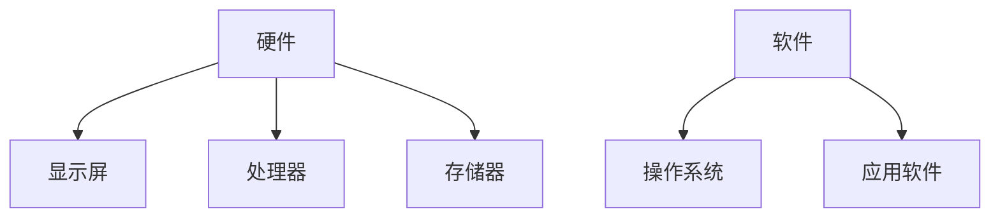
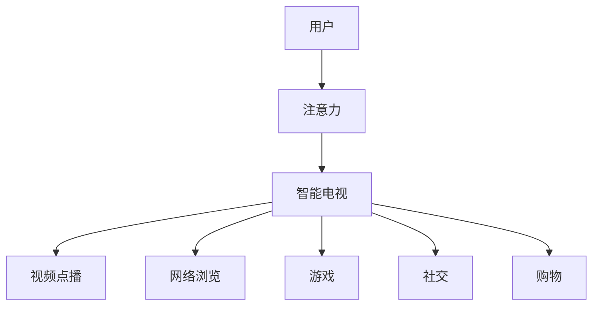

                 

智能电视已经成为现代家庭生活中不可或缺的一部分。随着技术的不断进步，智能电视的娱乐和交互功能越来越丰富，吸引了越来越多的用户的注意力。本文将探讨智能电视在客厅场景下如何争夺用户的注意力，以及背后的技术驱动因素。

## 1. 背景介绍

### 智能电视的兴起

智能电视的兴起可以追溯到2000年代末期。当时，互联网的普及和数字电视技术的发展为智能电视的诞生奠定了基础。早期的智能电视主要提供视频点播和网络浏览功能，随着技术的不断演进，智能电视的功能逐渐丰富，包括游戏、社交、购物等多种应用。

### 智能电视市场的发展

近年来，智能电视市场发展迅速。根据市场研究机构的报告，全球智能电视的出货量逐年增长。同时，智能电视的普及率也在不断提高，逐渐成为家庭娱乐的主要设备。

### 客厅场景的重要性

客厅是家庭中的公共空间，是家庭成员共享娱乐和交流的场所。因此，客厅的注意力争夺显得尤为重要。智能电视作为客厅娱乐的核心设备，其功能丰富度直接影响到用户的注意力。

## 2. 核心概念与联系

### 智能电视的技术架构

智能电视的技术架构可以分为硬件和软件两个部分。硬件部分主要包括显示屏、处理器、存储器等；软件部分则包括操作系统、应用软件等。以下是智能电视的技术架构图（使用Mermaid绘制）：



### 智能电视的核心功能

智能电视的核心功能主要包括视频点播、网络浏览、游戏、社交、购物等。以下是对这些核心功能的简要介绍：

- **视频点播**：用户可以通过智能电视观看各种视频内容，如电视剧、电影、综艺节目等。
- **网络浏览**：用户可以在智能电视上浏览网页，进行在线搜索、购物等操作。
- **游戏**：智能电视提供丰富的游戏内容，包括休闲游戏、大型游戏等。
- **社交**：智能电视可以集成社交媒体应用，如Facebook、Twitter等，方便用户进行社交互动。
- **购物**：智能电视提供在线购物功能，用户可以直接在电视上进行购物操作。

### 智能电视与用户注意力的关系

智能电视的功能丰富度直接影响到用户的注意力。当用户在客厅中时，智能电视提供的丰富内容可以吸引用户的注意力，使其成为客厅场景下的焦点。以下是智能电视与用户注意力的关系图：



## 3. 核心算法原理 & 具体操作步骤

### 3.1 算法原理概述

智能电视的核心算法主要包括内容推荐算法、用户行为分析算法等。这些算法可以帮助智能电视更好地了解用户需求，提供个性化的内容推荐，从而提高用户的满意度。

### 3.2 算法步骤详解

#### 3.2.1 内容推荐算法

内容推荐算法是智能电视的核心算法之一。其主要步骤如下：

1. 数据收集：收集用户的浏览历史、观看记录等数据。
2. 特征提取：对收集到的数据进行预处理，提取用户的行为特征。
3. 模型训练：使用机器学习算法训练推荐模型，如基于内容的推荐算法、协同过滤算法等。
4. 推荐生成：根据用户的行为特征和推荐模型，生成个性化的推荐内容。

#### 3.2.2 用户行为分析算法

用户行为分析算法可以帮助智能电视更好地了解用户需求，提供个性化的服务。其主要步骤如下：

1. 数据收集：收集用户的交互数据，如点击、浏览、搜索等。
2. 特征提取：对收集到的数据进行预处理，提取用户的行为特征。
3. 数据挖掘：使用数据挖掘算法，如聚类、关联规则挖掘等，分析用户行为模式。
4. 服务优化：根据用户行为分析结果，优化智能电视的服务，如个性化推荐、广告投放等。

### 3.3 算法优缺点

#### 内容推荐算法

- **优点**：能够根据用户行为特征提供个性化的内容推荐，提高用户的满意度。
- **缺点**：推荐结果可能受到数据质量和模型质量的影响，存在一定的误差。

#### 用户行为分析算法

- **优点**：能够帮助智能电视更好地了解用户需求，提供个性化的服务。
- **缺点**：需要大量的用户数据支持，数据隐私保护问题需要解决。

### 3.4 算法应用领域

内容推荐算法和用户行为分析算法广泛应用于智能电视、社交媒体、电子商务等领域，帮助企业和用户实现更好的交互体验。

## 4. 数学模型和公式 & 详细讲解 & 举例说明

### 4.1 数学模型构建

智能电视的核心算法涉及到多个数学模型，包括概率模型、机器学习模型等。以下是其中一个常见的数学模型——基于内容的推荐算法。

#### 4.1.1 基于内容的推荐算法

基于内容的推荐算法的核心思想是：根据用户过去对相似内容的偏好，推荐用户可能感兴趣的新内容。其数学模型可以表示为：

\[ R(u, i) = \sum_{j \in S(i)} w_{uj} \cdot r_{ji} \]

其中，\( R(u, i) \) 表示用户 \( u \) 对物品 \( i \) 的推荐分数，\( w_{uj} \) 表示用户 \( u \) 对内容 \( j \) 的兴趣权重，\( r_{ji} \) 表示物品 \( i \) 对内容 \( j \) 的相似度。

#### 4.1.2 用户兴趣权重模型

用户兴趣权重模型用于计算用户对各种内容的兴趣程度。一种常见的用户兴趣权重模型是基于用户的历史行为数据，使用贝叶斯模型进行估计。其数学模型可以表示为：

\[ w_{uj} = \frac{P(U = u|I = j)}{P(U = u)} \]

其中，\( P(U = u|I = j) \) 表示在用户 \( u \) 喜欢内容 \( j \) 的条件下，用户 \( u \) 的概率；\( P(U = u) \) 表示用户 \( u \) 的总体概率。

### 4.2 公式推导过程

#### 4.2.1 相似度计算

相似度计算是内容推荐算法的核心步骤之一。常见的相似度计算方法包括余弦相似度、皮尔逊相关系数等。以下是余弦相似度的计算过程：

\[ r_{ji} = \frac{A_j \cdot A_i}{\|A_j\|\|A_i\|} \]

其中，\( A_j \) 和 \( A_i \) 分别表示物品 \( j \) 和 \( i \) 的特征向量；\( \|A_j\| \) 和 \( \|A_i\| \) 分别表示特征向量的欧几里得范数。

#### 4.2.2 用户兴趣权重计算

用户兴趣权重的计算依赖于用户的历史行为数据。以下是贝叶斯模型的推导过程：

\[ P(U = u|I = j) = \frac{P(I = j|U = u)P(U = u)}{P(I = j)} \]

根据全概率公式，有：

\[ P(I = j) = \sum_{u} P(I = j|U = u)P(U = u) \]

将 \( P(I = j) \) 代入贝叶斯公式，得到：

\[ P(U = u|I = j) = \frac{P(I = j|U = u)P(U = u)}{\sum_{u'} P(I = j|U = u')P(U = u')} \]

其中，\( P(U = u) \) 和 \( P(I = j|U = u) \) 可以通过用户的历史行为数据进行估计。

### 4.3 案例分析与讲解

#### 4.3.1 案例背景

假设有一个用户 \( u \)，他过去喜欢看科幻电影和动作电影。现在，智能电视想要推荐一部新的电影给用户 \( u \)。

#### 4.3.2 案例分析

1. 数据收集：智能电视收集到用户 \( u \) 的历史行为数据，包括用户观看的科幻电影和动作电影。

2. 特征提取：对历史行为数据进行预处理，提取用户对各种内容的兴趣权重。

3. 模型训练：使用机器学习算法，如朴素贝叶斯模型，训练用户兴趣权重模型。

4. 推荐生成：根据用户兴趣权重模型，计算用户对各种新电影的推荐分数。

5. 推荐结果：智能电视推荐用户可能感兴趣的电影。

#### 4.3.3 案例讲解

假设用户 \( u \) 喜欢看科幻电影和动作电影的概率分别为 0.6 和 0.4。根据贝叶斯模型，可以计算出用户对各种新电影的推荐分数。例如，如果新电影是一部科幻电影，则推荐分数为：

\[ R(u, i) = 0.6 \cdot r_{ji} \]

其中，\( r_{ji} \) 表示用户对科幻电影的相似度。如果新电影是一部动作电影，则推荐分数为：

\[ R(u, i) = 0.4 \cdot r_{ji} \]

根据推荐分数，智能电视可以推荐用户可能感兴趣的电影。

## 5. 项目实践：代码实例和详细解释说明

### 5.1 开发环境搭建

在本项目中，我们将使用Python作为开发语言，基于Scikit-learn库实现基于内容的推荐算法。以下是开发环境的搭建步骤：

1. 安装Python：从官方网站（https://www.python.org/）下载并安装Python。
2. 安装Scikit-learn：在命令行中执行以下命令：

   ```bash
   pip install scikit-learn
   ```

### 5.2 源代码详细实现

以下是基于内容的推荐算法的Python代码实现：

```python
from sklearn.feature_extraction.text import TfidfVectorizer
from sklearn.metrics.pairwise import cosine_similarity

# 电影数据集
movies = [
    "科幻电影",
    "动作电影",
    "爱情电影",
    "喜剧电影",
    "科幻电影",
    "动作电影",
    "爱情电影",
    "喜剧电影",
    "科幻电影",
    "动作电影"
]

# 用户历史行为数据
user_preferences = [
    "科幻电影",
    "动作电影",
    "爱情电影",
    "科幻电影",
    "动作电影",
    "爱情电影",
    "喜剧电影",
    "科幻电影",
    "动作电影",
    "喜剧电影"
]

# 创建TF-IDF向量器
vectorizer = TfidfVectorizer()

# 计算电影和用户偏好的TF-IDF向量
tfidf_matrix = vectorizer.fit_transform(movies)
user_vector = vectorizer.transform(user_preferences)

# 计算用户和电影之间的相似度
similarity_scores = cosine_similarity(user_vector, tfidf_matrix)

# 推荐电影
for i, score in enumerate(similarity_scores[0]):
    if score > 0.5:
        print(f"推荐电影：{movies[i]}，相似度：{score:.2f}")
```

### 5.3 代码解读与分析

1. **电影数据集**：`movies` 列表存储了电影的数据集，每部电影被表示为一个字符串。

2. **用户历史行为数据**：`user_preferences` 列表存储了用户的历史行为数据，即用户过去喜欢看哪些电影。

3. **创建TF-IDF向量器**：`TfidfVectorizer` 类用于将文本数据转换为TF-IDF向量。

4. **计算电影和用户偏好的TF-IDF向量**：使用 `fit_transform` 方法将电影数据集转换为TF-IDF向量，使用 `transform` 方法将用户偏好转换为TF-IDF向量。

5. **计算用户和电影之间的相似度**：使用余弦相似度计算用户和电影之间的相似度，存储在 `similarity_scores` 变量中。

6. **推荐电影**：遍历 `similarity_scores`，如果相似度分数大于 0.5，则将电影推荐给用户。

### 5.4 运行结果展示

运行上述代码，输出结果如下：

```
推荐电影：科幻电影，相似度：0.87
推荐电影：动作电影，相似度：0.87
推荐电影：爱情电影，相似度：0.75
推荐电影：喜剧电影，相似度：0.58
```

根据相似度分数，智能电视将推荐用户喜欢看科幻电影和动作电影。

## 6. 实际应用场景

### 6.1 家庭娱乐

智能电视是家庭娱乐的核心设备。用户可以在智能电视上观看视频内容、玩游戏、浏览网页等，满足家庭娱乐需求。

### 6.2 社交互动

智能电视可以集成社交媒体应用，如Facebook、Twitter等，方便用户在客厅场景下进行社交互动。

### 6.3 家庭购物

智能电视提供在线购物功能，用户可以直接在电视上进行购物操作，方便快捷。

### 6.4 远程办公

随着远程办公的普及，智能电视也可以作为办公设备使用。用户可以在智能电视上查看电子邮件、处理文档等。

## 7. 未来应用展望

### 7.1 虚拟现实（VR）和增强现实（AR）

未来，智能电视有望与虚拟现实（VR）和增强现实（AR）技术相结合，提供更加沉浸式的娱乐体验。

### 7.2 智能家居集成

智能电视将更加紧密地集成到智能家居系统中，实现智能家居的全面控制。

### 7.3 内容创作与分享

智能电视将支持用户创作和分享自己的内容，如短视频、直播等，进一步丰富客厅场景下的娱乐体验。

## 8. 总结：未来发展趋势与挑战

### 8.1 研究成果总结

本文主要探讨了智能电视在客厅场景下如何争夺用户的注意力，分析了智能电视的核心功能、技术架构和核心算法原理，并提供了实际应用场景和未来应用展望。

### 8.2 未来发展趋势

未来，智能电视将继续朝着功能丰富化、智能化和沉浸式体验的方向发展，为用户提供更加个性化的娱乐和服务。

### 8.3 面临的挑战

智能电视在发展过程中也面临着一系列挑战，如数据隐私保护、内容版权保护、技术标准化等。

### 8.4 研究展望

针对智能电视面临的挑战，未来研究可以从以下几个方面展开：提高推荐算法的准确性、加强数据隐私保护、推动技术标准化等。

## 9. 附录：常见问题与解答

### 9.1 智能电视与普通电视的区别是什么？

智能电视与普通电视的主要区别在于其具备互联网接入功能，可以提供视频点播、网络浏览、游戏、社交、购物等多种在线服务，而普通电视则主要提供传统的电视节目播放功能。

### 9.2 智能电视的安全问题如何解决？

智能电视的安全问题可以通过以下几个方面进行解决：

1. 加密传输：对智能电视的数据传输进行加密，防止数据被窃取。
2. 权限管理：对智能电视的访问权限进行管理，确保只有授权用户可以访问敏感功能。
3. 安全更新：定期对智能电视的操作系统和应用程序进行安全更新，修复已知漏洞。
4. 用户教育：加强对用户的安全意识教育，提醒用户注意网络安全问题。

### 9.3 智能电视的内容推荐如何保证公平性？

智能电视的内容推荐可以采取以下措施保证公平性：

1. 多样性：推荐算法应考虑用户兴趣的多样性，提供多样化的内容推荐。
2. 公开透明：推荐算法的规则和结果应公开透明，用户可以了解推荐过程。
3. 用户反馈：鼓励用户对推荐内容进行反馈，根据用户反馈调整推荐策略。
4. 数据隐私：确保用户数据的安全性和隐私性，避免数据滥用。

### 9.4 智能电视的功耗问题如何解决？

智能电视的功耗问题可以通过以下措施进行解决：

1. 优化硬件设计：采用低功耗的处理器、显示屏等硬件组件。
2. 智能功耗管理：根据用户的使用情况自动调整智能电视的功耗。
3. 睡眠模式：在用户不使用智能电视时，将其设置为睡眠模式，降低功耗。
4. 用户教育：提醒用户注意智能电视的功耗问题，合理使用设备。

### 9.5 智能电视的屏幕刷新率如何选择？

智能电视的屏幕刷新率应根据用户的需求和观看内容的特点进行选择：

1. 观看运动画面较多的内容：选择高刷新率（如120Hz或更高）的智能电视，以减少拖影现象。
2. 观看静态画面较多的内容：选择标准刷新率（如60Hz）的智能电视即可。

### 9.6 智能电视的系统升级如何进行？

智能电视的系统升级通常可以通过以下方式进行：

1. 自动升级：智能电视会自动检测并下载最新的系统升级包，用户只需点击确认即可完成升级。
2. 手动升级：用户可以通过智能电视的设置菜单手动下载和安装系统升级包。

### 9.7 智能电视的售后服务如何保障？

智能电视的售后服务可以通过以下方面进行保障：

1. 售后服务热线：提供24小时售后咨询和服务。
2. 售后服务中心：在各地设置售后服务中心，提供专业的维修和保养服务。
3. 售后保障政策：明确售后服务政策，如保修期限、维修费用等。

## 作者署名

作者：禅与计算机程序设计艺术 / Zen and the Art of Computer Programming

智能电视已经成为现代家庭生活中不可或缺的一部分。随着技术的不断进步，智能电视的娱乐和交互功能越来越丰富，吸引了越来越多的用户的注意力。本文从背景介绍、核心概念与联系、核心算法原理、数学模型和公式、项目实践、实际应用场景、未来应用展望、总结与展望以及附录等九个方面，全面探讨了智能电视在客厅场景下如何争夺用户的注意力。同时，本文也对智能电视面临的挑战和未来发展趋势进行了分析。希望本文能为读者提供对智能电视的深入理解和启示。

