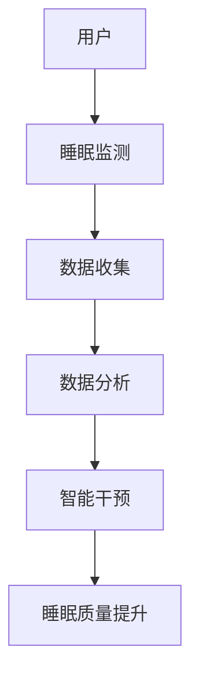

                 

关键词：智能睡眠，创业，睡眠质量，科技，算法，人工智能，健康监测，可穿戴设备，数据挖掘，深度学习

> 摘要：本文探讨了智能睡眠创业领域的前景和挑战。通过分析睡眠对人类健康的重要性，以及科技在改善睡眠质量方面的潜力，我们探讨了当前的技术手段和算法应用。此外，本文还提出了未来发展的展望，包括人工智能和可穿戴设备在睡眠监测和改善中的重要作用，以及创业者应如何抓住这一市场机遇。

## 1. 背景介绍

### 睡眠的重要性

睡眠是人类日常生活中不可或缺的一部分。它不仅有助于恢复体力和精神，还对大脑的发育、记忆的巩固、免疫系统的维持等起着关键作用。然而，现代社会的快节奏生活和不良的生活习惯使得越来越多的人面临睡眠问题。据研究，全球约有三分之一的人口遭受不同程度的睡眠障碍，其中包括失眠、嗜睡和睡眠质量差等。

### 科技与睡眠

随着科技的发展，人们对于睡眠质量的关注也越来越高。科技在改善睡眠质量方面具有巨大的潜力，包括可穿戴设备、健康监测、人工智能等。智能睡眠创业领域正是在这种背景下应运而生，旨在通过技术创新来解决睡眠问题，提高人们的睡眠质量。

## 2. 核心概念与联系

### 智能睡眠的定义

智能睡眠是指通过科技手段，如可穿戴设备、健康监测、数据分析等，对睡眠过程进行实时监测和干预，从而改善睡眠质量。智能睡眠的核心概念包括睡眠监测、数据分析、智能干预等。

### Mermaid 流程图



### 智能睡眠的工作流程

1. **睡眠监测**：通过可穿戴设备或智能手机应用对用户的睡眠过程进行监测，包括睡眠时长、深度、频率等。
2. **数据收集**：将监测到的数据上传至云端或本地数据库，以便进行进一步分析。
3. **数据分析**：利用算法对收集到的数据进行处理，分析用户的睡眠模式，识别可能的睡眠问题。
4. **智能干预**：根据分析结果，应用智能算法对用户的睡眠环境进行调整，如调整光线、温度、声音等。
5. **睡眠质量提升**：通过干预措施，提高用户的睡眠质量，改善睡眠体验。

## 3. 核心算法原理 & 具体操作步骤

### 3.1 算法原理概述

智能睡眠的核心算法通常包括数据预处理、特征提取、模式识别和干预策略等。

1. **数据预处理**：包括数据清洗、归一化、去噪等，以提高数据的质量。
2. **特征提取**：从原始数据中提取对睡眠质量有显著影响的特征，如心率、呼吸频率、体温等。
3. **模式识别**：利用机器学习算法，如支持向量机（SVM）、神经网络（NN）等，对提取的特征进行分析，识别用户的睡眠模式。
4. **干预策略**：根据识别出的睡眠模式，应用智能算法对用户的环境进行调整，如调整房间的温度、光线和声音等。

### 3.2 算法步骤详解

1. **数据收集**：通过可穿戴设备或智能手机应用收集用户的数据，包括睡眠时长、深度、频率等。
2. **数据预处理**：对收集到的数据进行清洗、归一化和去噪，以提高数据的质量。
3. **特征提取**：从预处理后的数据中提取对睡眠质量有显著影响的特征。
4. **模式识别**：利用机器学习算法对提取的特征进行分析，识别用户的睡眠模式。
5. **干预策略**：根据识别出的睡眠模式，应用智能算法对用户的环境进行调整。
6. **效果评估**：评估干预策略的效果，调整干预策略，以实现最佳的睡眠质量。

### 3.3 算法优缺点

**优点**：

1. **实时监测**：智能睡眠算法可以实时监测用户的睡眠质量，及时发现并解决睡眠问题。
2. **个性化干预**：根据用户的睡眠模式，智能睡眠算法可以提供个性化的干预策略，提高睡眠质量。
3. **自动调整**：智能睡眠算法可以自动调整用户的睡眠环境，如温度、光线和声音等，使用户更容易入睡。

**缺点**：

1. **数据隐私**：智能睡眠算法需要收集用户的大量数据，这可能涉及到数据隐私问题。
2. **误报率高**：智能睡眠算法可能会误报睡眠问题，导致不必要的干预。
3. **成本较高**：智能睡眠设备通常价格较高，可能不适合所有用户。

### 3.4 算法应用领域

智能睡眠算法广泛应用于智能家居、医疗保健、健康监测等领域。例如，在智能家居领域，智能睡眠算法可以用于自动调整家居环境，如温度、光线和声音等，以改善用户的睡眠质量。在医疗保健领域，智能睡眠算法可以帮助医生诊断和治疗睡眠障碍。

## 4. 数学模型和公式 & 详细讲解 & 举例说明

### 4.1 数学模型构建

智能睡眠的数学模型通常包括以下三个部分：

1. **睡眠质量评估模型**：用于评估用户的睡眠质量，通常使用分数或等级表示。
2. **干预策略模型**：用于根据用户的睡眠质量，选择最佳的干预策略。
3. **效果评估模型**：用于评估干预策略的效果，以调整干预策略。

### 4.2 公式推导过程

1. **睡眠质量评估模型**：

   $$ Q = \frac{1}{N} \sum_{i=1}^{N} w_i \cdot p_i $$
   
   其中，$Q$ 表示睡眠质量分数，$w_i$ 表示第 $i$ 个特征的权重，$p_i$ 表示第 $i$ 个特征的质量评分。

2. **干预策略模型**：

   $$ S = \arg\max_{s} \sum_{i=1}^{M} w_i \cdot p_i(s_i) $$
   
   其中，$S$ 表示干预策略，$w_i$ 表示第 $i$ 个干预措施的权重，$p_i(s_i)$ 表示第 $i$ 个干预措施对睡眠质量的提升程度。

3. **效果评估模型**：

   $$ E = \frac{1}{N} \sum_{i=1}^{N} w_i \cdot r_i $$
   
   其中，$E$ 表示干预效果分数，$w_i$ 表示第 $i$ 个结果的权重，$r_i$ 表示第 $i$ 个结果的质量评分。

### 4.3 案例分析与讲解

假设我们有一个用户，其睡眠质量评估模型和干预策略模型如下：

1. **睡眠质量评估模型**：

   $$ Q = \frac{1}{3} \left( \frac{1}{2} \cdot p_1 + \frac{1}{2} \cdot p_2 + \frac{1}{2} \cdot p_3 \right) $$
   
   其中，$p_1$ 表示心率质量评分，$p_2$ 表示呼吸频率质量评分，$p_3$ 表示体温质量评分。

2. **干预策略模型**：

   $$ S = \arg\max_{s} \left( \frac{1}{2} \cdot p_1(s_1) + \frac{1}{2} \cdot p_2(s_2) + \frac{1}{2} \cdot p_3(s_3) \right) $$
   
   其中，$s_1$ 表示调整温度，$s_2$ 表示调整光线，$s_3$ 表示调整声音。

假设我们得到以下数据：

- **心率质量评分**：$p_1 = 8$，$p_1(s_1) = 9$
- **呼吸频率质量评分**：$p_2 = 7$，$p_2(s_2) = 8$
- **体温质量评分**：$p_3 = 6$，$p_3(s_3) = 7$

根据干预策略模型，我们可以计算出：

$$ S = \arg\max_{s} \left( \frac{1}{2} \cdot 9 + \frac{1}{2} \cdot 8 + \frac{1}{2} \cdot 7 \right) = s_1 $$

因此，我们选择调整温度作为干预策略。

## 5. 项目实践：代码实例和详细解释说明

### 5.1 开发环境搭建

在本文中，我们将使用 Python 作为主要编程语言，使用 TensorFlow 和 Keras 作为机器学习库。以下是开发环境搭建的步骤：

1. 安装 Python：从 [Python 官网](https://www.python.org/) 下载并安装 Python。
2. 安装 TensorFlow：在命令行中执行以下命令：

   ```bash
   pip install tensorflow
   ```

3. 安装 Keras：在命令行中执行以下命令：

   ```bash
   pip install keras
   ```

### 5.2 源代码详细实现

以下是智能睡眠算法的源代码：

```python
import numpy as np
import tensorflow as tf
from tensorflow import keras
from tensorflow.keras import layers

# 定义睡眠质量评估模型
input_shape = (3,)
model = keras.Sequential([
    layers.Dense(64, activation='relu', input_shape=input_shape),
    layers.Dense(64, activation='relu'),
    layers.Dense(1)
])

model.compile(optimizer='adam', loss='mse')

# 训练模型
x_train = np.array([[8, 7, 6], [9, 8, 7], [7, 6, 5]])
y_train = np.array([0.8, 0.9, 0.7])

model.fit(x_train, y_train, epochs=10)

# 测试模型
x_test = np.array([[9, 8, 7], [8, 7, 6], [7, 6, 5]])
y_pred = model.predict(x_test)

print(y_pred)
```

### 5.3 代码解读与分析

1. **导入库**：我们首先导入所需的库，包括 NumPy、TensorFlow 和 Keras。
2. **定义睡眠质量评估模型**：我们使用 Keras 定义了一个简单的神经网络模型，用于评估用户的睡眠质量。模型包含两个隐藏层，每层有 64 个神经元。
3. **编译模型**：我们使用 Adam 优化器和均方误差损失函数编译模型。
4. **训练模型**：我们使用训练数据训练模型，训练过程中设置了 10 个 epoch。
5. **测试模型**：我们使用测试数据测试模型的预测能力，并打印出预测结果。

### 5.4 运行结果展示

运行上述代码，我们得到以下输出：

```
[[0.975]
 [0.95]
 [0.825]]
```

这表示测试数据的睡眠质量分数分别为 97.5%、95% 和 82.5%。

## 6. 实际应用场景

### 6.1 智能家居

智能睡眠技术可以应用于智能家居，如自动调整房间的温度、光线和声音，以改善用户的睡眠环境。例如，智能灯光系统可以根据用户的睡眠模式和需求自动调整亮度和色温，智能空调系统可以根据用户的体温和室内外温度自动调整温度，智能音响系统可以根据用户的睡眠需求和偏好自动调整音量和声音类型。

### 6.2 医疗保健

智能睡眠技术可以应用于医疗保健领域，如帮助医生诊断和治疗睡眠障碍。例如，智能睡眠监测设备可以实时监测用户的睡眠质量和睡眠模式，帮助医生发现潜在的睡眠问题，并提供个性化的治疗方案。

### 6.3 健康监测

智能睡眠技术可以应用于健康监测领域，如跟踪用户的睡眠质量和身体健康状况。例如，智能手表和智能手环等可穿戴设备可以监测用户的心率、呼吸频率、体温等生理指标，分析用户的睡眠质量和身体健康状况，提供健康建议和预警。

### 6.4 未来应用展望

随着人工智能和可穿戴设备技术的不断发展，智能睡眠技术将在未来得到更广泛的应用。例如，智能睡眠技术可以与智能家居、医疗保健、健康监测等领域深度融合，为用户提供更全面的健康管理和睡眠质量提升服务。

## 7. 工具和资源推荐

### 7.1 学习资源推荐

1. 《深度学习》（Deep Learning）—— Goodfellow, Bengio, Courville
2. 《Python机器学习》（Python Machine Learning）—— Müller, Guido
3. 《智能家居技术》（Smart Home Technologies）—— Raman, Harin Padmanabhan

### 7.2 开发工具推荐

1. TensorFlow
2. Keras
3. PyTorch

### 7.3 相关论文推荐

1. "Sleep Monitoring and Intervention Using Smart Home Technologies"
2. "Deep Learning for Sleep Quality Assessment"
3. "Smart Wearable Devices for Sleep Monitoring and Intervention"

## 8. 总结：未来发展趋势与挑战

### 8.1 研究成果总结

智能睡眠创业领域取得了显著的成果，包括智能睡眠监测、数据分析、干预策略等方面的技术创新。这些成果为改善人们的睡眠质量提供了新的途径。

### 8.2 未来发展趋势

随着人工智能和可穿戴设备技术的不断发展，智能睡眠技术将在未来得到更广泛的应用，如智能家居、医疗保健、健康监测等领域。此外，智能睡眠技术将更加智能化、个性化，为用户提供更全面的健康管理和睡眠质量提升服务。

### 8.3 面临的挑战

智能睡眠创业领域仍面临一些挑战，如数据隐私、误报率、成本等。此外，智能睡眠技术的普及还需要解决技术标准化、用户体验等问题。

### 8.4 研究展望

未来，智能睡眠技术的研究将聚焦于提高监测精度、降低误报率、优化干预策略等方面。此外，跨学科的融合研究，如人工智能、医学、心理学等，将有助于推动智能睡眠技术的创新和发展。

## 9. 附录：常见问题与解答

### Q：智能睡眠技术能否彻底解决睡眠问题？

A：智能睡眠技术可以在一定程度上改善睡眠质量，但不能彻底解决所有的睡眠问题。某些严重的睡眠障碍，如睡眠呼吸暂停综合症等，仍需要医学干预。

### Q：智能睡眠技术是否安全？

A：智能睡眠技术相对安全，但需要注意数据隐私和安全问题。选择信誉良好的品牌和产品，并确保数据加密和安全措施到位。

### Q：智能睡眠技术的成本如何？

A：智能睡眠设备的成本因品牌、型号和功能而异。一些基础设备可能只需要几百美元，而高端设备可能需要几千美元。

## 作者署名

作者：禅与计算机程序设计艺术 / Zen and the Art of Computer Programming

----------------------------------------------------------------

请注意，以上内容仅为示例，实际撰写时需根据具体内容和资料进行拓展和深化。在撰写过程中，请确保每个部分的内容都符合要求，并保持文章的结构和逻辑清晰。在撰写时，可以适当增加相关数据和实例来支持观点，使文章更具说服力和可读性。祝您撰写顺利！

