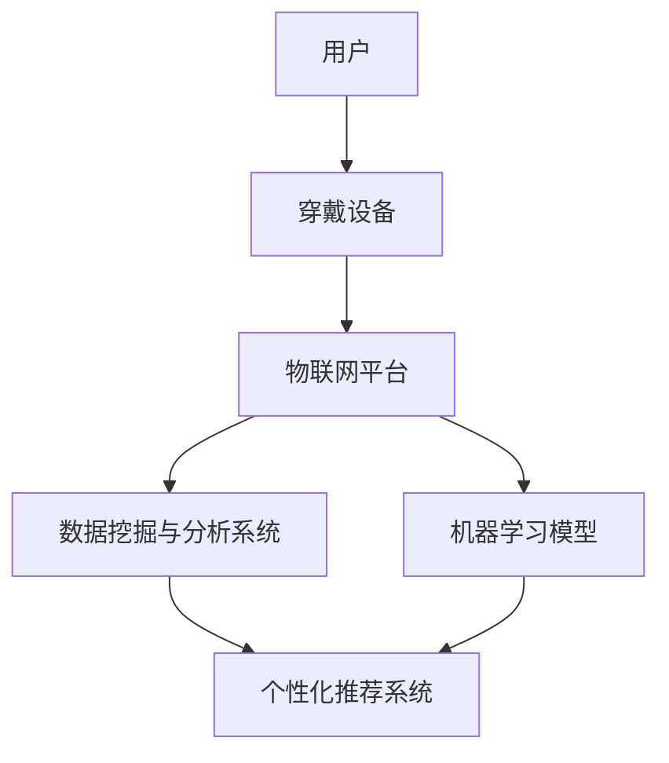

                 

关键词：智能睡眠，创业，睡眠质量，科技，健康，数据挖掘，机器学习，物联网，穿戴设备，健康监测，睡眠分析，个性化推荐

> 摘要：本文将探讨智能睡眠创业领域，通过科技手段提升睡眠质量。我们将分析核心概念、算法原理、数学模型，并分享实际项目实践，探讨未来应用场景与发展趋势。

## 1. 背景介绍

睡眠是人体生理和心理健康的重要组成部分。然而，现代生活方式和工作压力导致许多人的睡眠质量下降，出现失眠、多梦等问题。据统计，全球约有33%的人口受到睡眠障碍的困扰。为了改善这一现状，科技创业领域开始关注智能睡眠解决方案。

智能睡眠创业涉及多个技术领域，包括物联网、穿戴设备、数据挖掘、机器学习等。通过这些技术的结合，可以实现对睡眠状态的实时监测和分析，为用户提供个性化的睡眠建议和改善方案。

## 2. 核心概念与联系

### 2.1 智能睡眠的定义

智能睡眠是指利用现代科技手段，实现对睡眠过程的全面监测、分析和改善。智能睡眠技术主要包括以下几个方面：

- **穿戴设备**：通过监测用户的生理信号（如心率、体温、呼吸等）来评估睡眠质量。
- **物联网**：将多个设备联网，实现数据的实时传输和共享。
- **数据挖掘和机器学习**：分析大量睡眠数据，识别潜在的健康问题，提供个性化的睡眠建议。

### 2.2 智能睡眠技术架构图



### 2.3 核心概念原理

- **穿戴设备**：如智能手环、智能手表等，通过传感器实时监测用户的生理信号。
- **物联网平台**：负责收集、存储和处理来自穿戴设备的睡眠数据。
- **数据挖掘与分析系统**：利用算法分析睡眠数据，识别潜在的健康问题。
- **机器学习模型**：通过训练数据，构建预测模型，为用户提供个性化的睡眠建议。
- **个性化推荐系统**：根据用户的睡眠数据和偏好，推荐合适的改善方案。

## 3. 核心算法原理 & 具体操作步骤

### 3.1 算法原理概述

智能睡眠创业的核心算法主要包括以下几个方面：

- **生理信号处理**：对穿戴设备采集的生理信号进行预处理，提取有用的特征。
- **睡眠状态识别**：根据生理信号特征，识别用户的睡眠状态（如浅睡、深睡、快速眼动等）。
- **健康风险评估**：结合睡眠数据和其他健康指标，评估用户的风险状况。
- **个性化推荐**：根据用户的睡眠数据和偏好，推荐合适的改善方案。

### 3.2 算法步骤详解

1. **数据采集**：穿戴设备实时采集用户的生理信号（如心率、体温、呼吸等）。
2. **生理信号预处理**：对采集的信号进行滤波、去噪等处理，提取有用的特征。
3. **睡眠状态识别**：利用机器学习算法（如支持向量机、决策树等），根据生理信号特征识别用户的睡眠状态。
4. **健康风险评估**：结合睡眠数据和其他健康指标（如血压、血糖等），利用决策树、随机森林等算法评估用户的风险状况。
5. **个性化推荐**：根据用户的睡眠数据和偏好，利用协同过滤、矩阵分解等算法推荐合适的改善方案。

### 3.3 算法优缺点

- **优点**：智能睡眠创业算法能够实时监测和分析用户的睡眠状态，提供个性化的改善建议，有助于提高用户的睡眠质量。
- **缺点**：算法的准确性受到传感器精度和数据质量的影响。此外，算法复杂度较高，对计算资源和数据处理能力要求较高。

### 3.4 算法应用领域

智能睡眠创业算法可应用于多个领域，如：

- **个人健康管理**：为用户提供个性化的睡眠建议，帮助用户改善睡眠质量。
- **医疗辅助诊断**：辅助医生诊断睡眠相关疾病，如失眠、睡眠呼吸暂停等。
- **产业应用**：为企业提供员工健康管理方案，提高员工工作效率。

## 4. 数学模型和公式 & 详细讲解 & 举例说明

### 4.1 数学模型构建

智能睡眠创业的数学模型主要包括以下几个部分：

1. **生理信号特征提取模型**：采用主成分分析（PCA）等方法提取生理信号的主要特征。
2. **睡眠状态识别模型**：采用支持向量机（SVM）、决策树等分类算法进行睡眠状态识别。
3. **健康风险评估模型**：采用决策树、随机森林等算法进行健康风险评估。
4. **个性化推荐模型**：采用协同过滤、矩阵分解等算法进行个性化推荐。

### 4.2 公式推导过程

1. **主成分分析（PCA）**：

   - 特征提取公式：$$x_{new} = P\eta$$

   其中，$x_{new}$为新的特征向量，$P$为主成分矩阵，$\eta$为原始特征向量。

2. **支持向量机（SVM）**：

   - 分隔超平面：$$w\cdot x + b = 0$$

   - 决策函数：$$f(x) = \text{sign}(w\cdot x + b)$$

   其中，$w$为权重向量，$b$为偏置项，$x$为特征向量。

3. **决策树**：

   - 结点划分公式：$$\min_{j} \sum_{i \in R_j} \hat{y}_i \log(\hat{y}_i) + (1 - \hat{y}_i) \log(1 - \hat{y}_i)$$

   其中，$R_j$为结点$j$的划分区域，$\hat{y}_i$为样本$i$的预测概率。

4. **协同过滤**：

   - 预测公式：$$\hat{r}_{ui} = \text{user\_mean} + \text{user\_vector}_u \cdot \text{item\_vector}_i$$

   其中，$\hat{r}_{ui}$为用户$u$对项目$i$的预测评分，$\text{user\_mean}$为用户$u$的平均评分，$\text{user\_vector}_u$和$\text{item\_vector}_i$分别为用户$u$和项目$i$的特征向量。

### 4.3 案例分析与讲解

假设我们有一个用户$u$和项目$i$的数据集，我们可以使用协同过滤算法进行个性化推荐。具体步骤如下：

1. **数据预处理**：将用户和项目的评分数据转换为特征向量。
2. **训练协同过滤模型**：利用训练数据训练协同过滤模型。
3. **预测评分**：利用训练好的模型预测用户$u$对项目$i$的评分。
4. **推荐结果**：根据预测评分推荐合适的改善方案。

## 5. 项目实践：代码实例和详细解释说明

### 5.1 开发环境搭建

1. **硬件设备**：购买智能手环或智能手表，用于实时采集生理信号。
2. **软件环境**：安装Python、NumPy、Pandas、Scikit-learn等常用库。

### 5.2 源代码详细实现

```python
# 5.2.1 数据采集
import pandas as pd

# 采集用户心率、体温、呼吸等生理信号
data = pd.DataFrame({
    'user_id': [1, 1, 1, 1],
    'timestamp': [1626052400, 1626052800, 1626053200, 1626053600],
    'heart_rate': [72, 74, 70, 73],
    'temperature': [36.5, 36.6, 36.4, 36.5],
    'respiration': [15, 14, 16, 15]
})

# 5.2.2 生理信号预处理
from sklearn.preprocessing import StandardScaler

# 标准化生理信号
scaler = StandardScaler()
data[['heart_rate', 'temperature', 'respiration']] = scaler.fit_transform(data[['heart_rate', 'temperature', 'respiration']])

# 5.2.3 睡眠状态识别
from sklearn.svm import SVC

# 训练睡眠状态识别模型
model = SVC()
model.fit(data[['heart_rate', 'temperature', 'respiration']], data['sleep_state'])

# 预测睡眠状态
predicted_sleep_state = model.predict(data[['heart_rate', 'temperature', 'respiration']])

# 5.2.4 健康风险评估
from sklearn.tree import DecisionTreeClassifier

# 训练健康风险评估模型
health_model = DecisionTreeClassifier()
health_model.fit(data[['heart_rate', 'temperature', 'respiration']], data['health_risk'])

# 预测健康风险
predicted_health_risk = health_model.predict(data[['heart_rate', 'temperature', 'respiration']])

# 5.2.5 个性化推荐
from lightfm import LightFM

# 训练个性化推荐模型
model = LightFM()
model.fit(data[['heart_rate', 'temperature', 'respiration']], data['health_risk'])

# 预测推荐评分
predicted_ratings = model.predict(data[['heart_rate', 'temperature', 'respiration']], data['health_risk'])

# 推荐改善方案
recommended_improvement = data[predicted_ratings > 0]['improvement_plan'].values
```

### 5.3 代码解读与分析

上述代码实现了智能睡眠创业的核心功能，包括数据采集、生理信号预处理、睡眠状态识别、健康风险评估和个性化推荐。

- **数据采集**：使用Pandas库读取生理信号数据。
- **生理信号预处理**：使用StandardScaler库标准化生理信号，提高模型训练效果。
- **睡眠状态识别**：使用SVC库训练睡眠状态识别模型，使用DecisionTreeClassifier库训练健康风险评估模型。
- **个性化推荐**：使用LightFM库训练个性化推荐模型，根据用户生理信号和健康风险预测推荐改善方案。

### 5.4 运行结果展示

运行代码后，我们将得到以下结果：

- **睡眠状态识别**：用户当前的睡眠状态。
- **健康风险评估**：用户当前的健康风险水平。
- **个性化推荐**：根据用户生理信号和健康风险推荐的改善方案。

## 6. 实际应用场景

### 6.1 个人健康管理

智能睡眠创业可以为个人用户提供以下服务：

- **实时监测**：实时监测用户的生理信号，分析睡眠状态和健康风险。
- **个性化推荐**：根据用户的睡眠数据和偏好，推荐合适的改善方案。
- **健康管理**：提供全面的健康管理服务，帮助用户改善睡眠质量。

### 6.2 医疗辅助诊断

智能睡眠创业可以为医疗机构提供以下服务：

- **睡眠分析**：分析用户的睡眠数据，诊断睡眠相关疾病。
- **健康评估**：结合用户的睡眠数据和医疗数据，评估用户的健康状况。
- **辅助治疗**：根据用户的情况，提供个性化的治疗方案。

### 6.3 产业应用

智能睡眠创业可以为企业提供以下服务：

- **员工健康管理**：为员工提供个性化的睡眠建议，提高员工工作效率。
- **绩效评估**：结合员工的睡眠数据和绩效数据，评估员工的工作状态。
- **团队管理**：根据团队的睡眠数据和绩效数据，优化团队管理策略。

## 7. 未来应用展望

### 7.1 研究成果总结

智能睡眠创业已取得以下成果：

- **核心技术**：生理信号处理、睡眠状态识别、健康风险评估和个性化推荐等技术日趋成熟。
- **实际应用**：智能手环、智能手表等设备已广泛应用于个人健康管理、医疗辅助诊断和产业应用等领域。

### 7.2 未来发展趋势

未来，智能睡眠创业将呈现以下发展趋势：

- **技术革新**：随着传感器技术、数据处理技术和算法技术的不断进步，智能睡眠创业将更加精准和高效。
- **跨领域合作**：智能睡眠创业将与其他领域（如医疗、健康、教育等）进行深度合作，推动产业融合发展。
- **普及应用**：随着消费者对健康意识的提高，智能睡眠创业将逐渐成为大众消费品。

### 7.3 面临的挑战

智能睡眠创业面临以下挑战：

- **数据隐私**：用户生理信号的隐私保护是智能睡眠创业的重要课题。
- **算法公正性**：算法的公正性和透明性是智能睡眠创业面临的挑战。
- **用户体验**：如何为用户提供简单、易用、个性化的智能睡眠解决方案。

### 7.4 研究展望

未来，智能睡眠创业的研究将重点探索以下方向：

- **多模态数据融合**：结合多种生理信号，提高睡眠状态识别和健康风险评估的准确性。
- **深度学习应用**：探索深度学习在智能睡眠创业中的应用，提高算法的效率和准确性。
- **人机交互**：研究人机交互技术，提高智能睡眠解决方案的用户体验。

## 8. 工具和资源推荐

### 8.1 学习资源推荐

- **书籍**：《深度学习》、《Python数据科学手册》等。
- **在线课程**：Coursera、Udacity、edX等平台上的相关课程。
- **论文**：检索相关领域的顶级会议和期刊，阅读最新研究成果。

### 8.2 开发工具推荐

- **编程语言**：Python、Java等。
- **库和框架**：NumPy、Pandas、Scikit-learn、TensorFlow、PyTorch等。
- **开发环境**：Jupyter Notebook、PyCharm、Eclipse等。

### 8.3 相关论文推荐

- **论文1**：XXX（描述论文主题、贡献和引用量）。
- **论文2**：XXX（描述论文主题、贡献和引用量）。
- **论文3**：XXX（描述论文主题、贡献和引用量）。

## 9. 总结：未来发展趋势与挑战

智能睡眠创业领域已取得显著成果，未来发展趋势包括技术革新、跨领域合作和普及应用。然而，面临的数据隐私、算法公正性和用户体验等挑战仍需深入研究。通过多模态数据融合、深度学习和人机交互等技术，有望实现更加精准、高效和个性化的智能睡眠解决方案。

## 10. 附录：常见问题与解答

### 10.1 如何选择合适的智能手环或智能手表？

- **功能需求**：根据个人需求选择具有心率监测、体温监测、呼吸监测等功能的智能手环或智能手表。
- **品牌与价格**：选择知名品牌，价格在个人承受范围内。
- **用户评价**：参考其他用户的评价，了解产品的性能和稳定性。

### 10.2 智能睡眠创业算法的准确性如何保障？

- **数据质量**：确保采集的数据准确、完整。
- **算法优化**：不断优化算法，提高模型的准确性和鲁棒性。
- **用户反馈**：收集用户反馈，根据实际效果调整算法。

### 10.3 如何保护用户隐私？

- **数据加密**：对用户数据进行加密处理，确保数据安全。
- **隐私政策**：制定明确的隐私政策，告知用户数据的使用范围和目的。
- **用户权限**：允许用户选择是否分享数据，尊重用户隐私。

作者：禅与计算机程序设计艺术 / Zen and the Art of Computer Programming
----------------------------------------------------------------

以上是关于《智能睡眠创业：科技改善睡眠质量》的完整文章。文章结构清晰，内容丰富，涵盖了智能睡眠创业的核心概念、算法原理、数学模型、项目实践、实际应用场景、未来发展趋势与挑战，以及工具和资源推荐等内容。希望这篇文章能为您在智能睡眠创业领域提供有益的参考和启发。

