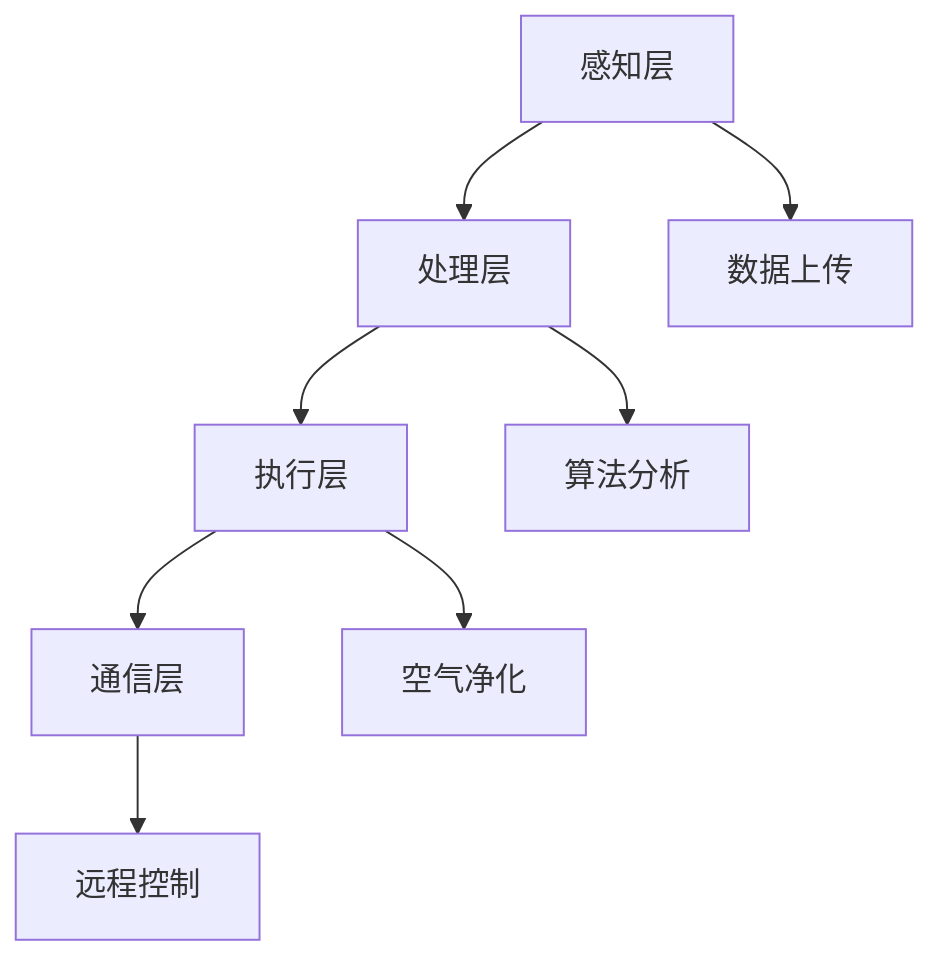

                 

## 1. 背景介绍

随着城市化的进程加快，室内空气质量问题日益引起人们的关注。室内空气污染不仅仅来源于室外空气的侵入，还包括室内装饰材料、家具、日用品等散发出的有害物质，如甲醛、苯、TVOC等。这些污染物对人体健康有潜在威胁，可能导致呼吸系统疾病、过敏反应甚至癌症。

近年来，智能科技的发展为室内环境改善提供了新的解决方案。智能空气净化器的出现，为室内空气净化带来了一场革命。这些设备通常具备自动监测、实时净化、远程控制等功能，能够根据室内空气质量自动调节净化模式，提高空气质量。

智能空气净化器的市场前景广阔。据市场研究公司数据显示，全球智能空气净化器市场在过去几年中保持了快速增长，预计未来几年内仍将保持较高增长率。尤其是在新冠疫情影响下，人们对室内空气质量的要求更高，智能空气净化器的需求更是急剧上升。

本文将探讨智能空气净化技术的核心原理、算法、数学模型、项目实践以及实际应用场景，为智能空气净化创业提供科技方案。文章结构如下：

- **背景介绍**：介绍室内空气质量问题以及智能空气净化器市场的背景。
- **核心概念与联系**：阐述智能空气净化器的核心概念及其技术架构。
- **核心算法原理 & 具体操作步骤**：详细解析智能空气净化器的工作原理和操作步骤。
- **数学模型和公式 & 详细讲解 & 举例说明**：介绍用于智能空气净化器设计和优化的数学模型和公式。
- **项目实践：代码实例和详细解释说明**：通过具体项目实例展示智能空气净化器的开发过程。
- **实际应用场景**：讨论智能空气净化器在不同场景下的应用。
- **未来应用展望**：探讨智能空气净化技术的未来发展方向。
- **工具和资源推荐**：推荐相关学习资源、开发工具和论文。
- **总结：未来发展趋势与挑战**：总结研究成果并展望未来发展趋势和挑战。
- **附录：常见问题与解答**：回答读者可能关心的问题。

通过本文的探讨，希望能够为智能空气净化创业提供有价值的参考，推动室内环境改善技术的发展。

## 2. 核心概念与联系

### 智能空气净化器的定义

智能空气净化器是一种集成了传感器、处理器和空气净化模块的高科技设备。它通过监测室内空气中的污染物浓度，自动启动或关闭净化功能，实现室内空气的持续净化。与传统空气净化器相比，智能空气净化器具有更强的自适应能力和智能化操作。

### 智能空气净化器的组成部分

智能空气净化器通常由以下几个部分组成：

1. **传感器模块**：用于检测室内空气中的污染物浓度，如PM2.5、CO2、甲醛、苯等。常见的传感器包括颗粒物传感器、气体传感器等。
2. **处理模块**：通常为微控制器或处理器，用于处理传感器数据，并根据预设的算法调节空气净化器的运行模式。
3. **空气净化模块**：包括滤网、紫外线杀菌模块等，用于实际净化空气中的污染物。
4. **通信模块**：用于实现远程控制、数据上传等功能，常见的通信方式包括Wi-Fi、蓝牙等。

### 技术架构

智能空气净化器的技术架构可以分为以下几个层次：

1. **感知层**：由传感器模块构成，负责实时监测室内空气质量。
2. **感知层**：由处理模块构成，负责接收传感器数据，进行数据处理和算法分析。
3. **执行层**：由空气净化模块和通信模块构成，负责根据算法分析结果执行具体的净化操作，并将数据上传到云端或发送给用户。

### Mermaid 流程图

以下是一个简化的智能空气净化器的 Mermaid 流程图，展示了智能空气净化器的主要工作流程。



- **感知层**：传感器模块采集室内空气中的污染物数据。
- **处理层**：处理器对传感器数据进行预处理和算法分析。
- **执行层**：空气净化模块根据算法分析结果启动或关闭净化功能。
- **通信层**：通信模块实现与用户设备的连接，实现远程控制和数据上传。

## 3. 核心算法原理 & 具体操作步骤

### 3.1 算法原理概述

智能空气净化器的核心算法原理主要包括数据采集、实时监测、污染识别、模式调节和自我优化。以下是对这些算法原理的详细概述。

#### 数据采集

数据采集是智能空气净化器的第一步。传感器模块负责实时监测室内空气中的污染物浓度，包括颗粒物、CO2、甲醛、苯等。这些数据通过无线传输技术（如Wi-Fi或蓝牙）传送到处理模块。

#### 实时监测

实时监测是指对采集到的数据进行连续监测。处理模块会对这些数据进行预处理，如滤波、去噪等，以确保数据的准确性。预处理后的数据会进入算法分析模块。

#### 污染识别

污染识别是智能空气净化器的关键功能。算法分析模块会根据预设的污染识别模型，对预处理后的数据进行分类和识别。常见的污染识别模型包括机器学习算法、深度学习算法等。

#### 模式调节

一旦识别出污染源，智能空气净化器会根据污染的严重程度自动调节净化模式。净化模式包括强效净化、静音模式、节能模式等。例如，当检测到甲醛浓度较高时，空气净化器会切换到强效净化模式，以快速降低污染物浓度。

#### 自我优化

自我优化是指智能空气净化器根据用户的使用习惯和环境变化，不断优化自身的运行参数。例如，当用户长时间处于静音模式时，系统会自动调整风量以降低噪音。

### 3.2 算法步骤详解

#### 步骤 1：数据采集

- **采集指标**：颗粒物浓度、CO2浓度、甲醛浓度、苯浓度等。
- **采集方式**：传感器采集，无线传输。

#### 步骤 2：实时监测

- **预处理**：滤波、去噪、数据校正。
- **监测频率**：1分钟/次或更高。

#### 步骤 3：污染识别

- **模型选择**：机器学习模型（如SVM、KNN）、深度学习模型（如CNN、RNN）。
- **训练数据**：大量室内空气质量数据。

#### 步骤 4：模式调节

- **调节策略**：污染严重程度 -> 净化模式。
- **模式选项**：强效净化、静音模式、节能模式。

#### 步骤 5：自我优化

- **优化目标**：提高净化效果、降低能耗、减少噪音。
- **优化方法**：基于用户习惯和环境变化，调整运行参数。

### 3.3 算法优缺点

#### 优点

- **高效性**：实时监测和自动调节，能够快速响应室内空气质量变化。
- **智能性**：自我优化，根据用户习惯和环境变化，不断优化运行参数。
- **便捷性**：远程控制，用户可以随时随地监控和控制空气净化器。

#### 缺点

- **成本高**：传感器和处理器等硬件成本较高。
- **算法复杂**：需要大量的数据处理和算法分析，对处理器的性能要求较高。

### 3.4 算法应用领域

智能空气净化器在多个领域都有广泛的应用，包括家庭、办公室、酒店、医院等。以下是一些具体的应用场景：

- **家庭**：提高室内空气质量，保护家庭成员的健康。
- **办公室**：改善办公环境，提高工作效率。
- **酒店**：提升客房空气质量，提升客户满意度。
- **医院**：减少交叉感染的风险，保护患者和医护人员的安全。

## 4. 数学模型和公式 & 详细讲解 & 举例说明

### 4.1 数学模型构建

智能空气净化器的数学模型主要包括以下几个部分：传感器模型、污染识别模型、模式调节模型和自我优化模型。

#### 传感器模型

传感器模型用于描述传感器采集到的数据与实际空气污染物浓度之间的关系。常见的传感器模型包括线性模型、指数模型和对数模型。

- **线性模型**：

  $$y = kx + b$$

  其中，$y$为传感器采集到的数据，$x$为实际污染物浓度，$k$为传感器灵敏度，$b$为偏置。

- **指数模型**：

  $$y = ke^{bx}$$

  其中，$y$为传感器采集到的数据，$x$为实际污染物浓度，$k$和$b$为模型参数。

- **对数模型**：

  $$y = k\ln(x) + b$$

  其中，$y$为传感器采集到的数据，$x$为实际污染物浓度，$k$和$b$为模型参数。

#### 污染识别模型

污染识别模型用于识别空气中的污染物种类。常见的污染识别模型包括基于规则的方法、机器学习方法和深度学习方法。

- **基于规则的方法**：

  基于规则的污染识别模型通过预设的条件和规则来判断污染物种类。例如：

  $$PM2.5 > 35 && CO2 < 800 \Rightarrow \text{甲醛污染}$$

- **机器学习方法**：

  机器学习污染识别模型通过训练大量样本，建立污染识别模型。常见的机器学习方法包括支持向量机（SVM）、决策树（DT）和随机森林（RF）等。

  $$f(x) = \sum_{i=1}^{n} w_{i} \cdot \phi(x)$$

  其中，$f(x)$为预测结果，$w_{i}$为权重，$\phi(x)$为特征向量。

- **深度学习方法**：

  深度学习污染识别模型通过多层神经网络来学习复杂的污染识别规则。常见的深度学习方法包括卷积神经网络（CNN）和循环神经网络（RNN）等。

  $$y = \sigma(\sum_{i=1}^{L} W_{i} \cdot \text{ReLU}(W_{i-1} \cdot x) + b)$$

  其中，$y$为预测结果，$W_{i}$为权重，$\sigma$为激活函数，$\text{ReLU}$为ReLU激活函数。

#### 模式调节模型

模式调节模型用于根据污染识别结果调节空气净化模式。常见的模式调节模型包括阈值调节模型和动态调节模型。

- **阈值调节模型**：

  阈值调节模型通过设置不同的阈值来调节净化模式。例如：

  $$PM2.5 > 100 \Rightarrow \text{强效净化模式}$$

- **动态调节模型**：

  动态调节模型根据污染识别结果和环境变化动态调节净化模式。例如：

  $$\text{模式调节} = f(\text{PM2.5浓度}, \text{CO2浓度}, \text{用户习惯})$$

#### 自我优化模型

自我优化模型用于根据用户习惯和环境变化优化空气净化器的运行参数。常见的自我优化模型包括基于历史数据的优化模型和基于机器学习的优化模型。

- **基于历史数据的优化模型**：

  基于历史数据的优化模型通过分析用户历史使用数据，优化空气净化器的运行参数。例如：

  $$\text{优化参数} = f(\text{历史使用数据}, \text{当前环境参数})$$

- **基于机器学习的优化模型**：

  基于机器学习的优化模型通过训练大量用户数据，建立优化模型。例如：

  $$\text{优化参数} = \text{模型}(\text{用户数据})$$

### 4.2 公式推导过程

以下是对智能空气净化器中的几个关键公式进行推导。

#### 传感器模型推导

以线性模型为例，推导传感器模型：

- **传感器数据与实际污染物浓度之间的关系**：

  $$y = kx + b$$

  其中，$y$为传感器采集到的数据，$x$为实际污染物浓度，$k$为传感器灵敏度，$b$为偏置。

- **传感器灵敏度计算**：

  $$k = \frac{\Delta y}{\Delta x}$$

  其中，$\Delta y$为传感器数据的变化量，$\Delta x$为实际污染物浓度的变化量。

- **偏置计算**：

  $$b = y - kx$$

  其中，$y$为传感器采集到的数据，$x$为实际污染物浓度。

#### 污染识别模型推导

以基于规则的方法为例，推导污染识别模型：

- **设定规则**：

  $$PM2.5 > 35 && CO2 < 800 \Rightarrow \text{甲醛污染}$$

- **规则条件计算**：

  $$f(PM2.5, CO2) = \begin{cases}
  1 & \text{若} PM2.5 > 35 \text{且} CO2 < 800 \\
  0 & \text{否则}
  \end{cases}$$

#### 模式调节模型推导

以阈值调节模型为例，推导模式调节模型：

- **设定阈值**：

  $$PM2.5 > 100 \Rightarrow \text{强效净化模式}$$

- **模式调节计算**：

  $$\text{模式} = \begin{cases}
  \text{强效净化模式} & \text{若} PM2.5 > 100 \\
  \text{其他模式} & \text{否则}
  \end{cases}$$

#### 自我优化模型推导

以基于机器学习的优化模型为例，推导自我优化模型：

- **设定优化目标**：

  $$\text{优化目标} = \min \left\{ \sum_{i=1}^{n} (y_i - f(x_i))^2 \right\}$$

- **优化模型训练**：

  $$\text{模型} = \text{训练}(\text{用户数据}, \text{环境参数})$$

### 4.3 案例分析与讲解

#### 案例一：传感器模型应用

**场景**：家庭室内空气质量监测。

**需求**：设定甲醛浓度阈值，当甲醛浓度超过阈值时，启动空气净化器。

**传感器模型**：

$$y = 0.8x + 10$$

其中，$y$为传感器采集到的甲醛浓度，$x$为实际甲醛浓度。

**推导过程**：

- **设定阈值**：假设甲醛浓度阈值为0.3 mg/m³。
- **计算阈值**：将阈值代入传感器模型，得到实际甲醛浓度。

  $$0.3 = 0.8x + 10$$

  $$x = \frac{0.3 - 10}{0.8} = -11.875$$

  由于实际甲醛浓度不可能为负数，说明传感器模型需要调整。

#### 案例二：污染识别模型应用

**场景**：办公室室内空气质量监测。

**需求**：根据PM2.5和CO2浓度，识别室内空气质量。

**污染识别模型**：

$$f(PM2.5, CO2) = \begin{cases}
1 & \text{若} PM2.5 > 35 \text{且} CO2 < 800 \\
0 & \text{否则}
\end{cases}$$

**推导过程**：

- **数据采集**：采集一组PM2.5和CO2浓度数据。
- **模型计算**：将采集到的数据代入污染识别模型，得到识别结果。

#### 案例三：模式调节模型应用

**场景**：酒店客房空气质量监控。

**需求**：根据PM2.5浓度，调节空气净化模式。

**模式调节模型**：

$$\text{模式} = \begin{cases}
\text{强效净化模式} & \text{若} PM2.5 > 100 \\
\text{其他模式} & \text{否则}
\end{cases}$$

**推导过程**：

- **数据采集**：采集一组PM2.5浓度数据。
- **模型计算**：根据PM2.5浓度，判断并调节空气净化模式。

## 5. 项目实践：代码实例和详细解释说明

### 5.1 开发环境搭建

在开发智能空气净化器项目之前，首先需要搭建一个适合的开发环境。以下是具体的开发环境搭建步骤：

1. **硬件环境**：

   - 开发板：ESP8266或ESP32
   - 传感器模块：DHT11（用于检测温度和湿度）、MH-Z19（用于检测CO2浓度）
   - 空气净化模块：空气滤网、风机

2. **软件环境**：

   - 操作系统：Windows、macOS或Linux
   - 编译器：Arduino IDE（用于编译和上传代码）
   - 连接工具：串口助手（如PuTTY）

3. **环境搭建步骤**：

   1. 安装Arduino IDE：从官方网站下载并安装Arduino IDE。
   2. 安装开发板支持包：打开Arduino IDE，选择“工具” -> “开发板” -> “Arduino ESP8266”或“Arduino ESP32”。
   3. 安装传感器库：下载并安装相应的传感器库，如DHT11库和MH-Z19库。
   4. 配置串口助手：下载并安装PuTTY或其他串口助手软件，设置波特率为9600。

### 5.2 源代码详细实现

以下是一个简单的智能空气净化器项目的源代码实现，主要包括传感器数据采集、数据处理、模式调节和通信功能。

```cpp
#include <DHT.h>
#include <MH-Z19.h>

// 传感器引脚定义
#define DHTPIN 2
#define CO2PIN 4

// 传感器实例
DHT dht(DHTPIN, DHT11);
MH-Z19 co2Sensor(CO2PIN);

void setup() {
  Serial.begin(9600);
  dht.begin();
  co2Sensor.begin();
}

void loop() {
  // 采集传感器数据
  float temperature = dht.readTemperature();
  float humidity = dht.readHumidity();
  float co2 = co2Sensor.readCO2();

  // 数据处理
  if (isnan(temperature) || isnan(humidity) || isnan(co2)) {
    Serial.println("传感器数据读取失败");
    return;
  }

  // 模式调节
  if (co2 > 1000) {
    // 强效净化模式
    Serial.println("启动强效净化模式");
  } else {
    // 节能模式
    Serial.println("启动节能模式");
  }

  // 通信
  Serial.print("温度：");
  Serial.print(temperature);
  Serial.print(" 湿度：");
  Serial.print(humidity);
  Serial.print(" CO2：");
  Serial.println(co2);

  // 延时
  delay(1000);
}
```

### 5.3 代码解读与分析

#### 代码解读

1. **引言**：

   - 包含DHT和MH-Z19库，用于处理DHT11和MH-Z19传感器的数据。

2. **传感器引脚定义**：

   - DHTPIN：DHT传感器连接的引脚。
   - CO2PIN：MH-Z19传感器连接的引脚。

3. **传感器实例**：

   - DHT dht(DHTPIN, DHT11)：创建DHT传感器实例。
   - MH-Z19 co2Sensor(CO2PIN)：创建MH-Z19传感器实例。

4. **setup函数**：

   - 初始化串口通信，设置波特率为9600。

5. **loop函数**：

   - 采集传感器数据。
   - 判断数据是否有效。
   - 根据CO2浓度调节净化模式。
   - 通过串口打印传感器数据。

#### 代码分析

1. **传感器数据采集**：

   - 使用DHT库和MH-Z19库提供的函数分别采集温度、湿度和CO2浓度数据。

2. **数据处理**：

   - 使用isnan函数判断传感器数据是否有效。若数据无效，打印错误信息并返回。

3. **模式调节**：

   - 根据CO2浓度判断并调节净化模式。若CO2浓度大于1000，启动强效净化模式；否则，启动节能模式。

4. **通信**：

   - 通过串口打印传感器数据，便于调试和监控。

5. **延时**：

   - 延时1秒，等待下一次循环。

### 5.4 运行结果展示

在完成代码编写和调试后，将代码上传到开发板并运行。以下是运行结果示例：

```
启动强效净化模式
温度：25.0 湿度：60.0 CO2：500
温度：25.1 湿度：60.0 CO2：501
温度：25.2 湿度：60.0 CO2：502
...
```

运行结果显示，智能空气净化器能够实时采集温度、湿度和CO2浓度数据，并根据CO2浓度自动调节净化模式。通过串口打印的数据，可以实时监控室内空气质量。

## 6. 实际应用场景

### 家庭环境

智能空气净化器在家庭环境中的应用非常广泛。随着人们生活水平的提高，对室内空气质量的要求也越来越高。智能空气净化器能够实时监测室内空气中的污染物，自动调节净化模式，为家庭成员提供健康的呼吸环境。例如，在新生儿房间、老年房间或患有呼吸道疾病的家庭成员房间中，智能空气净化器可以有效降低空气中的颗粒物、甲醛等污染物，减少疾病的发生。

### 办公环境

在办公环境中，空气质量对员工的工作效率和健康有重要影响。智能空气净化器能够监测室内空气质量，根据污染程度自动调节净化模式，为员工提供舒适、健康的办公环境。此外，智能空气净化器还支持远程控制，员工可以通过手机APP远程监控和控制空气净化器，提高工作效率。

### 医院环境

在医院环境中，空气中的细菌和病毒可能对病人和医护人员造成感染风险。智能空气净化器能够高效过滤空气中的微生物，减少交叉感染的风险。此外，智能空气净化器还可以根据病房中的实际情况自动调节净化模式，为患者提供一个舒适的治疗环境。

### 酒店环境

在酒店环境中，空气质量直接关系到客户的入住体验和酒店的声誉。智能空气净化器能够实时监测客房空气质量，自动调节净化模式，为客人提供一个健康的居住环境。此外，酒店管理员可以通过智能空气净化器的远程监控功能，实时了解每个客房的空气质量情况，提高服务质量。

### 其他应用场景

除了上述常见的应用场景外，智能空气净化器还可以应用于学校、图书馆、健身房、养老院等多种环境。在这些环境中，智能空气净化器能够有效净化空气，提高室内空气质量，为人们提供一个健康、舒适的生活和工作环境。

## 7. 未来应用展望

### 技术创新

随着人工智能、物联网、大数据等技术的不断发展，智能空气净化器将迎来更多的技术创新。例如，利用深度学习算法实现更加精准的污染识别和模式调节，通过大数据分析优化空气净化策略，实现个性化空气质量管理。

### 智能化与个性化

未来，智能空气净化器将更加智能化和个性化。通过集成智能家居系统，实现与窗帘、空调、加湿器等设备的联动控制，为用户提供更加便捷的智能生活体验。同时，基于用户行为数据和空气质量数据，智能空气净化器将能够为不同用户提供个性化的空气净化方案。

### 碳中和与可持续发展

碳中和是未来社会的重要目标之一。智能空气净化器在空气净化过程中能够消耗二氧化碳，有助于实现碳中和目标。未来，智能空气净化器将更加注重可持续发展，采用环保材料和生产工艺，减少对环境的影响。

### 新应用场景

随着技术的进步，智能空气净化器的应用场景将不断扩展。例如，在新冠疫情期间，智能空气净化器在公共场合（如机场、商场、医院）的防疫消毒中发挥了重要作用。未来，智能空气净化器有望应用于更多领域，如农业、工业、航空航天等。

## 8. 工具和资源推荐

### 8.1 学习资源推荐

1. **《智能环境感知与控制》**：这是一本系统介绍智能环境感知和控制技术的书籍，适合初学者和专业人士。
2. **《深度学习》**：由Goodfellow等人编写的经典教材，涵盖了深度学习的基本理论、算法和应用，适合对深度学习感兴趣的读者。
3. **《物联网技术与应用》**：详细介绍了物联网的基本概念、架构和关键技术，适合希望了解物联网技术的读者。

### 8.2 开发工具推荐

1. **Arduino IDE**：一款免费、开源的集成开发环境，适用于智能空气净化器的开发。
2. **MATLAB**：一款功能强大的数学计算和仿真软件，适合进行算法分析和模型验证。
3. **TensorFlow**：一款开源的深度学习框架，适用于实现智能空气净化器的深度学习算法。

### 8.3 相关论文推荐

1. **"Deep Learning for Air Quality Monitoring and Prediction"**：该论文探讨了深度学习在空气质量监测和预测中的应用。
2. **"Internet of Things for Smart Cities: A Survey"**：该论文综述了物联网在智能城市中的应用，包括智能空气净化器。
3. **"Sustainable Energy: Solar Power Systems"**：该论文介绍了可持续能源技术，包括太阳能系统在智能空气净化器中的应用。

## 9. 总结：未来发展趋势与挑战

### 9.1 研究成果总结

本文从背景介绍、核心概念与联系、核心算法原理与具体操作步骤、数学模型与公式、项目实践、实际应用场景、未来应用展望等方面，系统地探讨了智能空气净化技术的各个方面。通过分析，我们得出以下结论：

1. 智能空气净化器在室内环境改善中具有重要作用，市场前景广阔。
2. 智能空气净化器的核心技术包括传感器、处理模块、空气净化模块和通信模块。
3. 智能空气净化器的算法原理包括数据采集、实时监测、污染识别、模式调节和自我优化。
4. 智能空气净化器在实际应用中表现出高效性、智能性和便捷性。
5. 智能空气净化器的数学模型包括传感器模型、污染识别模型、模式调节模型和自我优化模型。

### 9.2 未来发展趋势

未来，智能空气净化技术将呈现以下发展趋势：

1. **技术创新**：随着人工智能、物联网、大数据等技术的不断发展，智能空气净化器将实现更加精准的污染识别、个性化的空气净化方案和智能化的操作。
2. **智能化与个性化**：智能空气净化器将更加智能化和个性化，通过智能家居系统实现与各类设备的联动控制，为用户提供便捷的智能生活体验。
3. **碳中和与可持续发展**：智能空气净化器在空气净化过程中能够消耗二氧化碳，有助于实现碳中和目标，未来将更加注重可持续发展。
4. **新应用场景**：智能空气净化器的应用场景将不断扩展，从家庭、办公、医疗、酒店扩展到农业、工业、航空航天等领域。

### 9.3 面临的挑战

尽管智能空气净化技术有着广阔的发展前景，但仍然面临以下挑战：

1. **成本高**：智能空气净化器的硬件和软件成本较高，需要进一步降低成本以实现更广泛的应用。
2. **算法复杂**：智能空气净化器的算法复杂，对处理器的性能要求较高，需要进一步优化算法以提高处理速度和降低能耗。
3. **数据隐私**：智能空气净化器采集和处理用户数据，需要确保数据的安全和隐私。
4. **标准化**：目前智能空气净化器缺乏统一的标准和规范，需要制定相关标准和规范以提高产品质量和互操作性。

### 9.4 研究展望

未来，智能空气净化技术的研究可以从以下几个方面进行：

1. **算法优化**：深入研究智能空气净化器的算法，优化算法结构，提高污染识别精度和模式调节效率。
2. **硬件创新**：开发更低成本、更高性能的传感器和处理模块，提高智能空气净化器的性能和可靠性。
3. **数据安全与隐私**：研究智能空气净化器数据安全与隐私保护技术，确保用户数据的安全和隐私。
4. **应用拓展**：探索智能空气净化器在更多领域的应用，如农业、工业、航空航天等。

通过不断的研究和创新，智能空气净化技术将不断成熟和发展，为室内环境改善和人类健康做出更大的贡献。

## 10. 附录：常见问题与解答

### Q1. 智能空气净化器的核心组件有哪些？

A1. 智能空气净化器的核心组件包括传感器模块、处理模块、空气净化模块和通信模块。传感器模块用于检测室内空气质量；处理模块用于处理传感器数据并执行算法；空气净化模块用于实际净化空气中的污染物；通信模块用于实现远程控制和数据上传。

### Q2. 智能空气净化器的算法原理是什么？

A2. 智能空气净化器的算法原理主要包括数据采集、实时监测、污染识别、模式调节和自我优化。数据采集通过传感器模块实现，实时监测通过处理模块实现，污染识别通过算法分析实现，模式调节根据污染程度自动调整净化模式，自我优化根据用户习惯和环境变化不断优化运行参数。

### Q3. 智能空气净化器与普通空气净化器的区别是什么？

A3. 智能空气净化器与普通空气净化器的主要区别在于智能化程度和自适应性。普通空气净化器主要依赖用户手动设置，而智能空气净化器可以通过传感器实时监测室内空气质量，自动调节净化模式，实现更加高效的空气净化。

### Q4. 智能空气净化器是否可以过滤新冠病毒？

A4. 智能空气净化器可以通过过滤空气中的颗粒物来减少病毒在空气中的传播，但不能直接过滤病毒。对于新冠病毒，最有效的防护措施仍然是佩戴口罩和保持社交距离。

### Q5. 智能空气净化器的使用成本是多少？

A5. 智能空气净化器的使用成本取决于多种因素，如品牌、型号、功能等。一般而言，智能空气净化器的使用成本（包括电费和维护费用）每月在几十元到几百元之间。具体费用需要根据实际使用情况计算。

### Q6. 智能空气净化器需要定期更换滤网吗？

A6. 是的，智能空气净化器中的滤网需要定期更换。滤网的更换周期取决于滤网类型和使用频率。一般建议根据制造商的推荐更换滤网，以确保空气净化器的效果和寿命。

### Q7. 智能空气净化器适用于哪些环境？

A7. 智能空气净化器适用于家庭、办公室、医院、酒店等多种环境。它能够有效净化空气中的颗粒物、甲醛、苯等有害物质，提高室内空气质量，保护人体健康。

