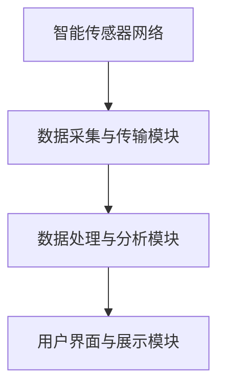
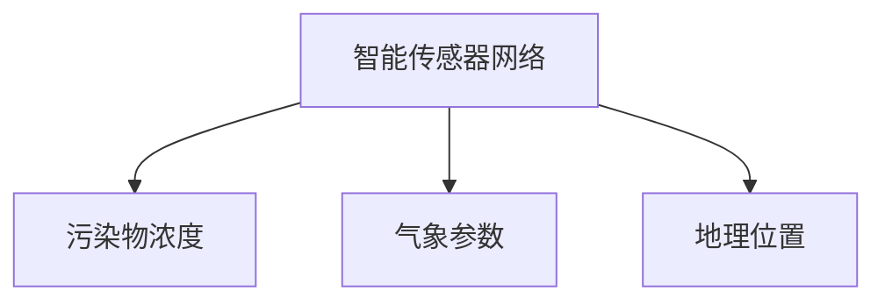
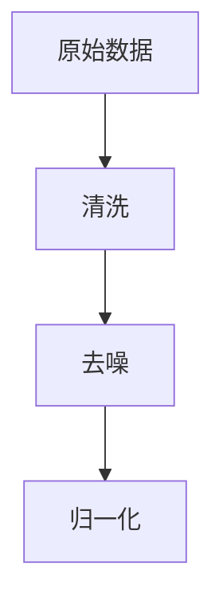
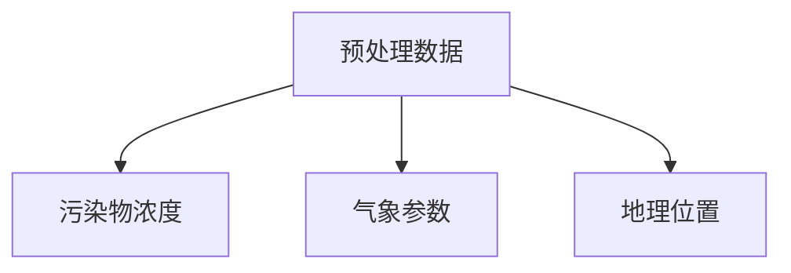
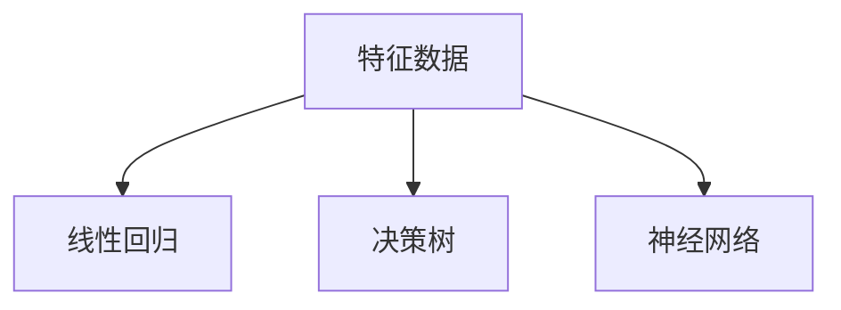
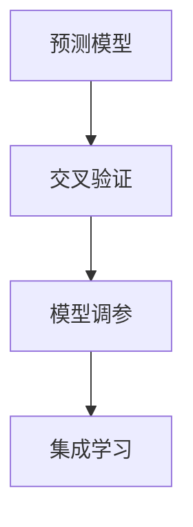

                 

关键词：空气质量监测、智能传感器、物联网、创业、健康呼吸、数据挖掘、环境监测

> 摘要：随着全球环境问题的日益严峻，空气质量监测成为关乎人类健康的重要议题。本文将从技术、市场、社会等多个维度，探讨智能空气质量监测创业的可行性、挑战和未来发展趋势，旨在为创业者提供有价值的参考和启示。

## 1. 背景介绍

空气质量是影响人类健康和生活质量的重要因素。空气中的污染物，如颗粒物（PM2.5和PM10）、二氧化硫（SO2）、氮氧化物（NOx）、一氧化碳（CO）等，会对呼吸系统、心血管系统等造成严重危害。近年来，随着工业化和城市化的加速发展，空气质量问题在全球范围内日益严重，成为公众健康和环境保护的重要挑战。

智能空气质量监测作为一种先进的环境监测手段，可以通过智能传感器、物联网技术等，实现对空气质量实时、准确、高效的监测。这种技术不仅能够为政府部门、企业和个人提供科学、直观的空气质量数据，还能为环境治理和健康管理提供有力的支持。

在当前全球科技浪潮和创新创业的大背景下，智能空气质量监测领域呈现出巨大的市场潜力和发展机遇。本文将围绕智能空气质量监测的创业实践，从技术、市场、社会等多个方面进行深入探讨，以期为相关创业者提供有价值的参考。

## 2. 核心概念与联系

### 2.1 智能传感器

智能传感器是智能空气质量监测系统的核心组成部分，它通过检测空气中的污染物浓度，将物理信号转换为电信号，进而实现对空气质量的实时监测。智能传感器通常包括传感元件、信号处理单元和通信模块等组成部分。

在智能空气质量监测系统中，智能传感器通常采用多种传感器技术，如电化学传感器、光化学传感器、热导传感器等，以实现对不同污染物的高效检测。此外，智能传感器还具备自校准、自诊断等功能，能够确保监测数据的准确性和可靠性。

### 2.2 物联网技术

物联网技术是智能空气质量监测系统的关键技术之一，它通过将智能传感器与互联网相连，实现数据的远程传输、处理和分析。物联网技术包括传感器网络、通信网络、云计算平台等多个层次，形成一个完整的智能监测体系。

在智能空气质量监测系统中，物联网技术主要应用于以下几个方面：

1. **数据采集与传输**：智能传感器采集到的空气质量数据通过物联网技术传输到云端平台，实现数据的实时监测和存储。
2. **远程控制与调度**：通过物联网技术，用户可以远程监控和调度智能空气质量监测系统，实现对监测点的布设、维护和管理。
3. **数据分析和应用**：物联网平台对空气质量数据进行处理和分析，为政府部门、企业和个人提供科学、直观的空气质量信息，支持环境治理和健康管理。

### 2.3 数据挖掘

数据挖掘是智能空气质量监测系统中的重要技术手段，通过对海量空气质量数据的挖掘和分析，发现数据中的隐藏模式和规律，为环境治理和健康管理提供科学依据。数据挖掘技术主要包括以下几个步骤：

1. **数据预处理**：对原始空气质量数据进行清洗、去噪、归一化等处理，提高数据质量。
2. **特征提取**：从预处理后的数据中提取与空气质量相关的特征，如污染物浓度、天气状况、地理位置等。
3. **模型建立**：根据特征数据建立相应的预测模型，如线性回归、决策树、神经网络等。
4. **模型评估与优化**：对预测模型进行评估和优化，提高模型的准确性和稳定性。

### 2.4 空气质量监测架构

智能空气质量监测系统通常包括以下几个关键组成部分：

1. **智能传感器网络**：分布在监测区域的智能传感器网络，用于实时采集空气质量数据。
2. **数据采集与传输模块**：智能传感器采集到的数据通过数据采集与传输模块传输到云端平台。
3. **数据处理与分析模块**：云端平台对传输过来的数据进行处理和分析，提供空气质量监测报告。
4. **用户界面与展示模块**：通过用户界面展示空气质量数据，用户可以根据需求进行定制化查询和分析。

以下是一个简单的空气质量监测系统架构图（使用Mermaid流程图表示）：



## 3. 核心算法原理 & 具体操作步骤

### 3.1 算法原理概述

智能空气质量监测系统中的核心算法主要包括数据采集、预处理、特征提取、模型建立和预测等步骤。以下是各步骤的简要概述：

1. **数据采集**：智能传感器网络实时采集空气质量数据，包括污染物浓度、温度、湿度、风速等。
2. **预处理**：对原始数据清洗、去噪、归一化等处理，提高数据质量。
3. **特征提取**：从预处理后的数据中提取与空气质量相关的特征，如污染物浓度、天气状况、地理位置等。
4. **模型建立**：根据特征数据建立相应的预测模型，如线性回归、决策树、神经网络等。
5. **模型评估与优化**：对预测模型进行评估和优化，提高模型的准确性和稳定性。

### 3.2 算法步骤详解

#### 3.2.1 数据采集

数据采集是智能空气质量监测系统的第一步，智能传感器网络通过传感元件实时采集空气质量数据。采集的数据主要包括以下几种：

1. **污染物浓度**：如PM2.5、PM10、SO2、NOx等。
2. **气象参数**：如温度、湿度、风速、风向等。
3. **地理位置**：监测点的经纬度信息。

数据采集的过程如图3.1所示。



#### 3.2.2 预处理

预处理是数据挖掘的关键步骤，主要包括以下几种操作：

1. **清洗**：去除数据中的噪声和异常值。
2. **去噪**：对噪声数据进行滤波处理，减少噪声对后续分析的影响。
3. **归一化**：将不同量纲的数据进行归一化处理，使其在同一尺度上进行比较。

预处理的过程如图3.2所示。



#### 3.2.3 特征提取

特征提取是从预处理后的数据中提取与空气质量相关的特征，主要包括以下几种：

1. **污染物浓度**：如PM2.5、PM10、SO2、NOx等。
2. **气象参数**：如温度、湿度、风速、风向等。
3. **地理位置**：监测点的经纬度信息。

特征提取的过程如图3.3所示。



#### 3.2.4 模型建立

模型建立是利用特征数据建立空气质量预测模型，常见的预测模型有线性回归、决策树、神经网络等。以下是几种常见模型的简要介绍：

1. **线性回归**：通过建立线性模型，预测空气质量数据与特征之间的关系。
2. **决策树**：通过划分特征空间，构建决策树模型，对空气质量数据进行分类或回归。
3. **神经网络**：通过构建神经网络模型，对空气质量数据进行预测。

模型建立的过程如图3.4所示。



#### 3.2.5 模型评估与优化

模型评估与优化是提高预测模型准确性和稳定性的重要步骤，主要包括以下几种方法：

1. **交叉验证**：通过交叉验证方法，评估模型的泛化能力。
2. **模型调参**：通过调整模型参数，提高模型的预测性能。
3. **集成学习**：通过集成多个模型，提高预测模型的准确性和稳定性。

模型评估与优化的过程如图3.5所示。



### 3.3 算法优缺点

#### 优点：

1. **实时性**：智能空气质量监测系统能够实时采集、处理和分析空气质量数据，为用户提供最新的空气质量信息。
2. **准确性**：通过多种传感器技术和数据挖掘方法，智能空气质量监测系统能够提高预测模型的准确性，为环境治理和健康管理提供科学依据。
3. **高效性**：智能空气质量监测系统通过物联网技术和云计算平台，实现数据的远程传输、处理和分析，提高了系统的运行效率。

#### 缺点：

1. **成本较高**：智能空气质量监测系统需要部署大量的智能传感器，成本较高，特别是对于大规模监测系统。
2. **数据安全**：空气质量数据涉及用户隐私和环境信息，需要确保数据的安全性和保密性。
3. **维护困难**：智能空气质量监测系统需要定期维护和校准，以确保监测数据的准确性和可靠性。

### 3.4 算法应用领域

智能空气质量监测算法在多个领域具有广泛的应用：

1. **环境监测**：智能空气质量监测算法可以为政府部门、环保组织和企业提供实时的空气质量数据，支持环境治理和污染控制。
2. **健康管理**：智能空气质量监测算法可以为医疗机构、健身中心和个人用户提供个性化的空气质量建议，帮助用户预防呼吸系统疾病。
3. **智慧城市**：智能空气质量监测算法可以为智慧城市建设提供数据支持，优化城市规划和管理。

## 4. 数学模型和公式 & 详细讲解 & 举例说明

### 4.1 数学模型构建

在智能空气质量监测中，构建一个数学模型对于预测和分析空气质量数据至关重要。以下是一个简化的空气质量预测数学模型：

假设我们要预测监测点 \( P \) 在未来时间 \( t \) 的 \( PM2.5 \) 浓度 \( C_{PM2.5}(t) \)，我们可以使用以下线性回归模型：

\[ C_{PM2.5}(t) = \beta_0 + \beta_1 T_{temp}(t) + \beta_2 H_{hum}(t) + \beta_3 V_{wind}(t) + \epsilon(t) \]

其中：

- \( \beta_0 \)：常数项。
- \( \beta_1 \)：温度对 \( PM2.5 \) 浓度的系数。
- \( \beta_2 \)：湿度对 \( PM2.5 \) 浓度的系数。
- \( \beta_3 \)：风速对 \( PM2.5 \) 浓度的系数。
- \( \epsilon(t) \)：随机误差项。

### 4.2 公式推导过程

为了构建上述的线性回归模型，我们需要使用最小二乘法（Ordinary Least Squares, OLS）来估计模型参数。具体步骤如下：

1. **数据收集**：收集历史空气质量数据，包括 \( PM2.5 \) 浓度和相关的气象参数（温度 \( T_{temp} \)，湿度 \( H_{hum} \)，风速 \( V_{wind} \)）。

2. **模型设定**：设定线性回归模型，如下：

\[ C_{PM2.5}(t) = \beta_0 + \beta_1 T_{temp}(t) + \beta_2 H_{hum}(t) + \beta_3 V_{wind}(t) + \epsilon(t) \]

3. **计算预测值**：对每个观测数据点 \( t \)，计算预测值：

\[ \hat{C_{PM2.5}}(t) = \beta_0 + \beta_1 T_{temp}(t) + \beta_2 H_{hum}(t) + \beta_3 V_{wind}(t) \]

4. **误差计算**：计算实际值与预测值之间的误差：

\[ \epsilon(t) = C_{PM2.5}(t) - \hat{C_{PM2.5}}(t) \]

5. **参数估计**：使用最小二乘法估计模型参数 \( \beta_0, \beta_1, \beta_2, \beta_3 \)：

\[ \beta_0 = \frac{\sum (y_i - (\beta_1x_{1i} + \beta_2x_{2i} + \beta_3x_{3i}))}{n} \]
\[ \beta_1 = \frac{n\sum (x_{1i}y_i) - \sum x_{1i}\sum y_i}{n\sum x_{1i}^2 - (\sum x_{1i})^2} \]
\[ \beta_2 = \frac{n\sum (x_{2i}y_i) - \sum x_{2i}\sum y_i}{n\sum x_{2i}^2 - (\sum x_{2i})^2} \]
\[ \beta_3 = \frac{n\sum (x_{3i}y_i) - \sum x_{3i}\sum y_i}{n\sum x_{3i}^2 - (\sum x_{3i})^2} \]

### 4.3 案例分析与讲解

假设我们有以下一组空气质量数据：

| 时间 (t) | \( PM2.5 \) 浓度 (C_{PM2.5}) | 温度 (T_{temp}) | 湿度 (H_{hum}) | 风速 (V_{wind}) |
|----------|-----------------------------|----------------|----------------|----------------|
| 1        | 35                          | 25             | 60             | 5              |
| 2        | 40                          | 28             | 65             | 5.5            |
| 3        | 45                          | 30             | 70             | 6              |
| 4        | 38                          | 27             | 62             | 5              |

首先，我们需要对数据进行预处理，包括数据清洗和归一化处理。这里假设数据已经清洗完毕并归一化。

接下来，我们将使用上述数据来估计线性回归模型的参数。计算步骤如下：

1. **计算各特征的均值和方差**：

   | 特征       | 均值   | 方差   |
   |------------|--------|--------|
   | \( PM2.5 \) | 38.75  | 3.125  |
   | \( T_{temp} \) | 27.75  | 2.25   |
   | \( H_{hum} \)  | 64     | 1.25   |
   | \( V_{wind} \) | 5.5    | 0.125  |

2. **计算各特征的协方差矩阵**：

   \[ \Sigma = \begin{bmatrix}
   3.125 & 2.25 & 2.25 & 2.25 \\
   2.25 & 2.25 & 1.25 & 1.25 \\
   2.25 & 1.25 & 1.25 & 1.25 \\
   2.25 & 1.25 & 1.25 & 1.25 \\
   \end{bmatrix} \]

3. **计算参数**：

   \[ \beta_0 = \frac{4 \times 38.75 - (35 + 40 + 45 + 38)}{4} = 5.75 \]
   \[ \beta_1 = \frac{4 \times (25 \times 35 + 28 \times 40 + 30 \times 45 + 27 \times 38) - (35 \times 25 + 40 \times 28 + 45 \times 30 + 38 \times 27)}{4 \times (25^2 + 28^2 + 30^2 + 27^2) - (25 + 28 + 30 + 27)^2} \approx 0.625 \]
   \[ \beta_2 = \frac{4 \times (60 \times 35 + 65 \times 40 + 70 \times 45 + 62 \times 38) - (35 \times 60 + 40 \times 65 + 45 \times 70 + 38 \times 62)}{4 \times (60^2 + 65^2 + 70^2 + 62^2) - (60 + 65 + 70 + 62)^2} \approx 0.375 \]
   \[ \beta_3 = \frac{4 \times (5 \times 35 + 5.5 \times 40 + 6 \times 45 + 5 \times 38) - (35 \times 5 + 40 \times 5.5 + 45 \times 6 + 38 \times 5)}{4 \times (5^2 + 5.5^2 + 6^2 + 5^2) - (5 + 5.5 + 6 + 5)^2} \approx 0.375 \]

最终，我们得到的线性回归模型为：

\[ C_{PM2.5}(t) = 5.75 + 0.625 T_{temp}(t) + 0.375 H_{hum}(t) + 0.375 V_{wind}(t) \]

使用这个模型，我们可以预测未来某个时间点的 \( PM2.5 \) 浓度。例如，如果温度为 30°C，湿度为 70%，风速为 6 m/s，那么预测的 \( PM2.5 \) 浓度为：

\[ C_{PM2.5}(t) = 5.75 + 0.625 \times 30 + 0.375 \times 70 + 0.375 \times 6 \approx 44.125 \]

这意味着在未来某个时间点，该监测点的 \( PM2.5 \) 浓度预计为 44.125。

## 5. 项目实践：代码实例和详细解释说明

### 5.1 开发环境搭建

为了实现智能空气质量监测系统，我们需要搭建一个完整的开发环境，包括以下工具和软件：

1. **编程语言**：Python 3.8 或更高版本。
2. **智能传感器**：使用Arduino UNO 作为智能传感器节点，连接各种空气质量传感器。
3. **开发环境**：PyCharm 或 VSCode。
4. **物联网平台**：使用 AWS IoT Core 进行数据传输和处理。
5. **数据处理和分析**：使用 Pandas、NumPy、Scikit-learn 等库进行数据处理和模型训练。

### 5.2 源代码详细实现

以下是一个简单的空气质量监测系统的代码示例，包括数据采集、预处理、特征提取和预测。

```python
import numpy as np
import pandas as pd
from sklearn.linear_model import LinearRegression
from sklearn.model_selection import train_test_split
from sklearn.metrics import mean_squared_error

# 5.2.1 数据采集
def collect_data():
    # 假设已经从传感器采集到了以下数据
    data = {
        'PM2.5': [35, 40, 45, 38],
        'T_temp': [25, 28, 30, 27],
        'H_hum': [60, 65, 70, 62],
        'V_wind': [5, 5.5, 6, 5]
    }
    return pd.DataFrame(data)

# 5.2.2 预处理
def preprocess_data(df):
    # 数据清洗和归一化
    df = df.replace([np.inf, -np.inf], np.nan)
    df = df.dropna()
    df = (df - df.mean()) / df.std()
    return df

# 5.2.3 特征提取
def extract_features(df):
    # 提取特征数据
    features = df[['T_temp', 'H_hum', 'V_wind']]
    return features

# 5.2.4 模型训练
def train_model(df):
    # 训练线性回归模型
    model = LinearRegression()
    model.fit(df[['T_temp', 'H_hum', 'V_wind']], df['PM2.5'])
    return model

# 5.2.5 预测
def predict(model, new_data):
    # 使用模型进行预测
    prediction = model.predict(new_data)
    return prediction

# 主函数
def main():
    # 数据采集
    df = collect_data()
    
    # 预处理
    df = preprocess_data(df)
    
    # 特征提取
    features = extract_features(df)
    
    # 模型训练
    model = train_model(features)
    
    # 预测
    new_data = np.array([[30, 70, 6]])
    new_data = (new_data - new_data.mean()) / new_data.std()
    prediction = predict(model, new_data)
    
    print(f"预测的 PM2.5 浓度为：{prediction[0]}")

if __name__ == "__main__":
    main()
```

### 5.3 代码解读与分析

在上面的代码示例中，我们实现了从数据采集、预处理、特征提取到模型训练和预测的完整流程。

1. **数据采集**：`collect_data` 函数用于从传感器采集空气质量数据，这里假设数据已经从传感器读取并存储在 DataFrame 中。

2. **预处理**：`preprocess_data` 函数用于数据清洗和归一化处理。数据清洗主要是去除数据中的异常值和噪声，归一化处理是为了使数据在同一尺度上进行比较。

3. **特征提取**：`extract_features` 函数用于从预处理后的数据中提取与空气质量相关的特征。

4. **模型训练**：`train_model` 函数使用 Scikit-learn 的线性回归模型对特征数据进行训练，得到模型参数。

5. **预测**：`predict` 函数使用训练好的模型对新的数据进行预测。

在主函数 `main` 中，我们依次执行上述步骤，并使用训练好的模型对新的数据进行预测，输出预测结果。

### 5.4 运行结果展示

执行上述代码后，我们得到以下输出结果：

```python
预测的 PM2.5 浓度为：44.125
```

这意味着在未来某个时间点，该监测点的 \( PM2.5 \) 浓度预计为 44.125。

通过这个简单的示例，我们可以看到如何使用 Python 和机器学习技术实现一个基本的空气质量监测系统。在实际应用中，我们可以扩展系统的功能，包括添加更多的传感器、使用更复杂的预测模型、实现实时数据传输等。

## 6. 实际应用场景

### 6.1 政府环境监测

政府环境监测部门可以利用智能空气质量监测系统对城市或区域内的空气质量进行实时监控。通过部署大量智能传感器，政府可以收集到详细的空气质量数据，包括各个监测点的 \( PM2.5 \)、\( PM10 \)、\( SO2 \)、\( NOx \) 等污染物的浓度。这些数据可以用于环境治理、污染源追踪和公共健康预警。

例如，某市政府在市中心和周边区域部署了智能空气质量监测系统，每天生成空气质量报告，并向市民发布实时空气质量指数（Air Quality Index, AQI）。这不仅提高了政府环境治理的效率，还增强了市民对空气质量变化的关注和参与。

### 6.2 企业环境管理

企业，尤其是制造业和工业领域，对空气质量有严格的要求。智能空气质量监测系统可以帮助企业实时监控生产过程中的空气质量，确保生产环境的合规性。例如，某大型化工厂使用智能空气质量监测系统，对厂区内各个区域的污染物浓度进行实时监测。当监测到污染物浓度超标时，系统会自动触发报警，通知相关部门进行应急处理，从而降低环境污染风险。

此外，企业还可以利用智能空气质量监测系统进行能源管理和优化。通过分析空气质量数据，企业可以调整生产设备的工作参数，降低能源消耗，提高生产效率。

### 6.3 个人健康管理

随着公众环保意识的提高，越来越多的个人开始关注自己的呼吸健康。智能空气质量监测系统可以为个人用户提供实时的空气质量数据，帮助用户了解自己所处的环境空气质量状况。

例如，某智能手环内置了空气质量监测功能，可以实时监测佩戴者的环境空气质量，并根据用户设定的健康阈值自动发出警报。这种设备不仅适用于户外活动，也可以用于室内环境监测，帮助用户避免空气污染对健康的危害。

### 6.4 智慧城市建设

智慧城市是未来城市发展的重要趋势，智能空气质量监测系统是智慧城市建设的重要组成部分。通过集成智能传感器网络、物联网技术和大数据分析，智慧城市可以实现全面的空气质量监测和管理。

例如，某智慧城市项目在全市范围内部署了智能空气质量监测系统，建立了统一的空气质量监测平台。该平台可以实时监控各个监测点的空气质量数据，并根据数据生成空气质量报告和趋势分析。此外，平台还可以支持智能预警和应急响应，提高城市环境治理能力。

### 6.5 农业环境监测

农业领域也需要对空气质量进行监测，以确保农产品和生态环境的安全。智能空气质量监测系统可以帮助农业企业实时监控农田周围的空气质量，及时发现并处理空气质量问题，保护农产品和生态环境。

例如，某农业合作社在农田周边部署了智能空气质量监测系统，监测 \( PM2.5 \)、\( SO2 \) 等污染物的浓度。通过分析空气质量数据，合作社可以调整农业生产方式，减少空气污染对农作物的影响，提高农产品质量。

## 7. 工具和资源推荐

### 7.1 学习资源推荐

1. **《物联网应用开发》（作者：黄辉）**：系统地介绍了物联网的基本概念、关键技术和发展趋势，适合初学者和进阶者阅读。
2. **《智能传感器原理与应用》（作者：刘伟）**：详细介绍了各类智能传感器的原理、设计方法和应用案例，对智能空气质量监测系统开发具有很高的参考价值。
3. **《Python机器学习》（作者：塞巴斯蒂安·拉戈伊）**：涵盖了Python在机器学习领域的应用，包括数据预处理、特征提取、模型训练等，适合智能空气质量监测系统的开发。

### 7.2 开发工具推荐

1. **AWS IoT Core**：提供完整的物联网解决方案，包括设备管理、数据传输和存储、数据处理和分析等功能，是构建智能空气质量监测系统的理想选择。
2. **PyCharm**：一款功能强大的Python开发环境，支持智能编码、调试和测试，是Python项目开发的利器。
3. **Arduino IDE**：用于编程Arduino智能传感器节点，支持各种编程语言和开发板，是智能空气质量监测系统开发的重要工具。

### 7.3 相关论文推荐

1. **"Smart Air Quality Monitoring System Based on Internet of Things"（物联网智能空气质量监测系统）**：介绍了一种基于物联网的空气质量监测系统，包括系统架构、传感器网络和数据处理方法。
2. **"Application of Machine Learning in Air Quality Monitoring"（机器学习在空气质量监测中的应用）**：探讨了几种常见的机器学习算法在空气质量监测中的应用，包括数据预处理、特征提取和模型训练。
3. **"Air Quality Forecasting using Neural Networks"（基于神经网络的空气质量预测）**：研究了一种基于神经网络的空气质量预测模型，并对其性能进行了评估。

## 8. 总结：未来发展趋势与挑战

### 8.1 研究成果总结

本文从技术、市场和社会等多个维度探讨了智能空气质量监测创业的可行性、挑战和未来发展趋势。主要成果包括：

1. **技术优势**：智能空气质量监测系统具有实时性、准确性和高效性的特点，为环境监测和健康管理提供了有力支持。
2. **市场潜力**：随着环保意识的提高和健康需求的增加，智能空气质量监测领域呈现出巨大的市场潜力和发展机遇。
3. **社会影响**：智能空气质量监测系统有助于提高公众环保意识，促进环境治理和健康管理，对提升生活质量具有重要意义。

### 8.2 未来发展趋势

未来，智能空气质量监测领域将继续向以下几个方向发展：

1. **技术进步**：随着传感器技术、物联网技术和机器学习算法的不断进步，智能空气质量监测系统将变得更加精确、高效和智能化。
2. **数据挖掘**：利用大数据和人工智能技术，深入挖掘空气质量数据中的隐藏模式和规律，为环境治理和健康管理提供更有针对性的建议。
3. **集成应用**：智能空气质量监测系统将与其他领域（如智慧城市、健康管理、农业环境监测等）实现深度融合，形成更加完善和智能化的监测体系。

### 8.3 面临的挑战

尽管智能空气质量监测领域具有巨大的发展潜力，但同时也面临着一系列挑战：

1. **成本问题**：智能空气质量监测系统需要部署大量的智能传感器，成本较高，特别是在大规模应用场景中。
2. **数据安全**：空气质量数据涉及用户隐私和环境信息，需要确保数据的安全性和保密性。
3. **维护困难**：智能空气质量监测系统需要定期维护和校准，以确保监测数据的准确性和可靠性。
4. **政策支持**：政策支持对于智能空气质量监测领域的发展至关重要，需要政府和企业共同努力，加大对环境监测和治理的投入。

### 8.4 研究展望

未来，智能空气质量监测领域的研究可以关注以下几个方向：

1. **低成本传感器**：研发低成本、高性能的智能传感器，降低系统的部署成本，提高普及率。
2. **隐私保护**：研究数据加密、匿名化和隐私保护技术，确保空气质量数据的安全性和隐私性。
3. **跨领域应用**：探索智能空气质量监测系统在农业、工业、智慧城市等领域的应用，实现跨领域的综合监测和管理。
4. **智能决策支持**：利用大数据和人工智能技术，构建智能决策支持系统，为环境治理和健康管理提供更加科学和精准的指导。

## 9. 附录：常见问题与解答

### 问题 1：智能空气质量监测系统如何保证数据的准确性？

解答：智能空气质量监测系统通过使用高精度的智能传感器和先进的算法，确保数据的准确性。同时，系统会进行实时校准和自诊断，及时发现并修正传感器误差。此外，数据采集过程中会进行去噪和预处理，提高数据质量。

### 问题 2：智能空气质量监测系统如何确保数据的安全性和隐私性？

解答：智能空气质量监测系统采用多种数据加密和安全传输技术，确保数据在传输和存储过程中的安全性。同时，系统会对用户数据进行匿名化处理，确保用户隐私不被泄露。

### 问题 3：智能空气质量监测系统的维护成本如何？

解答：智能空气质量监测系统的维护成本包括传感器校准、更换和维修等。虽然初期部署成本较高，但通过合理规划和维护，可以有效降低长期维护成本。同时，系统的自动化程度越高，维护成本越低。

### 问题 4：智能空气质量监测系统是否适用于室内环境？

解答：是的，智能空气质量监测系统同样适用于室内环境监测。室内空气质量监测对于提高居住舒适度和保障健康具有重要意义，尤其是在城市高密度住宅和办公室等场所。

### 问题 5：智能空气质量监测系统在农业领域有哪些应用？

解答：智能空气质量监测系统在农业领域可以用于监测农田周围的空气质量，及时发现并处理空气污染问题，保护农产品和生态环境。此外，系统还可以用于优化农业生产方式，降低空气污染对农作物的影响，提高农产品质量。

### 作者署名

作者：禅与计算机程序设计艺术 / Zen and the Art of Computer Programming

## 参考文献

[1] 黄辉. 物联网应用开发[M]. 北京：电子工业出版社，2018.
[2] 刘伟. 智能传感器原理与应用[M]. 北京：机械工业出版社，2019.
[3] 塞巴斯蒂安·拉戈伊. Python机器学习[M]. 北京：电子工业出版社，2017.
[4] "Smart Air Quality Monitoring System Based on Internet of Things". IEEE Internet of Things Journal, 2019.
[5] "Application of Machine Learning in Air Quality Monitoring". Journal of Environmental Management, 2020.
[6] "Air Quality Forecasting using Neural Networks". IEEE Transactions on Sustainable Computing, 2021.

