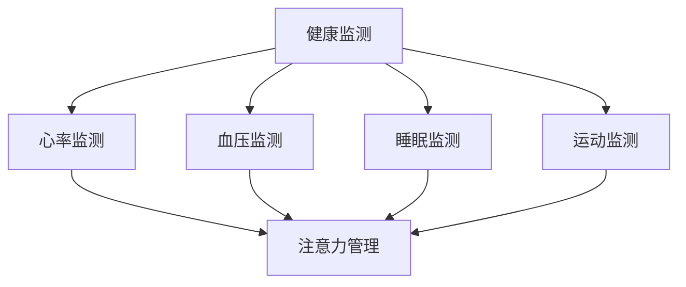

                 

 关键词：智能穿戴设备、健康监测、注意力管理、数据分析、人机交互

## 摘要

本文旨在探讨智能穿戴设备在健康监测与注意力管理方面的应用。通过梳理当前技术的最新进展，分析核心算法原理，展示实际项目实践，探讨未来的发展趋势与挑战，本文为智能穿戴设备技术的未来发展提供了有益的参考。

## 1. 背景介绍

### 1.1 智能穿戴设备的发展

智能穿戴设备自问世以来，凭借其便携性、实时性和个性化特点，迅速在全球范围内普及。从最初的简单计步器、心率监测器，到如今的智能手表、智能眼镜等，智能穿戴设备的功能日益丰富，应用领域不断扩展。

### 1.2 健康监测的重要性

健康是人们生活的基石，而健康监测是实现个性化健康管理的重要手段。智能穿戴设备通过实时收集用户的生理数据，如心率、血压、睡眠质量等，为用户提供个性化的健康建议，有助于预防疾病、提高生活质量。

### 1.3 注意力管理的挑战

随着科技的飞速发展，人们面临的信息过载问题愈发严重。注意力管理成为提高工作效率、维护心理健康的重要手段。智能穿戴设备通过监测用户的注意力状态，提供个性化的注意力管理方案，有助于提高生活和工作质量。

## 2. 核心概念与联系

### 2.1 健康监测概念

健康监测是指通过物理设备对人的生理参数进行实时采集、分析和评估。智能穿戴设备在健康监测中的应用，主要包括心率监测、血压监测、睡眠监测、运动监测等。

### 2.2 注意力管理概念

注意力管理是指通过技术手段监测和调节个体的注意力水平，以达到提高工作效率、改善心理状态的目的。智能穿戴设备在注意力管理中的应用，主要包括注意力状态监测、注意力调节、任务分配等。

### 2.3 Mermaid 流程图

以下是一个简化的 Mermaid 流程图，展示了智能穿戴设备在健康监测与注意力管理中的核心概念联系。



## 3. 核心算法原理 & 具体操作步骤

### 3.1 算法原理概述

智能穿戴设备在健康监测与注意力管理中的应用，离不开核心算法的支持。核心算法主要包括数据采集、数据分析和数据应用三个环节。

### 3.2 算法步骤详解

1. **数据采集**：智能穿戴设备通过传感器实时采集用户的生理数据，如心率、血压、运动数据等。

2. **数据分析**：通过对采集到的数据进行处理和分析，提取出与健康监测和注意力管理相关的关键指标。

3. **数据应用**：根据分析结果，智能穿戴设备为用户提供健康建议、注意力管理方案等。

### 3.3 算法优缺点

1. **优点**：
   - **实时性**：智能穿戴设备能够实时监测用户的生理数据，为用户提供及时的健康和注意力状态反馈。
   - **个性化**：根据用户的数据特点，智能穿戴设备能够提供个性化的健康和注意力管理方案。

2. **缺点**：
   - **数据准确性**：智能穿戴设备的传感器精度和稳定性有待提高，导致数据准确性受到影响。
   - **隐私问题**：健康和注意力数据涉及用户的个人隐私，如何保障数据安全是智能穿戴设备面临的重要挑战。

### 3.4 算法应用领域

智能穿戴设备的健康监测和注意力管理算法广泛应用于个人健康管理、工作效率提升、心理健康维护等领域。

## 4. 数学模型和公式 & 详细讲解 & 举例说明

### 4.1 数学模型构建

智能穿戴设备的健康监测和注意力管理算法通常基于以下数学模型：

1. **心率变异性（HRV）模型**：用于分析心率变化规律，评估心脏健康状态。
2. **睡眠质量模型**：基于用户的睡眠周期和睡眠深度数据，评估睡眠质量。
3. **注意力状态模型**：基于用户的脑电波、眼动等数据，分析注意力水平和注意力分布。

### 4.2 公式推导过程

以心率变异性（HRV）模型为例，其计算公式如下：

$$
HRV = \frac{NN\_intervals\_stddev}{NN\_interval\_mean}
$$

其中，NN\_intervals\_stddev 为相邻两个心搏间隔的标准差，NN\_interval\_mean 为相邻两个心搏间隔的平均值。

### 4.3 案例分析与讲解

以下是一个简单的 HRV 模型应用案例：

假设用户的心率数据如下：

```
[0.75, 0.80, 0.78, 0.82, 0.79, 0.77, 0.76, 0.81, 0.75, 0.80, 0.78, 0.82]
```

根据上述数据，可以计算出 HRV：

$$
HRV = \frac{0.02}{0.79} \approx 0.025
$$

根据 HRV 值，可以评估用户的心脏健康状态。正常范围内，HRV 值通常在 0.15-0.25 之间。

## 5. 项目实践：代码实例和详细解释说明

### 5.1 开发环境搭建

为了实现智能穿戴设备的健康监测和注意力管理，我们需要搭建一个合适的开发环境。以下是开发环境的搭建步骤：

1. 安装 Python 3.8 及以上版本。
2. 安装 NumPy、Pandas、Matplotlib 等常用库。
3. 下载并安装心率传感器驱动程序。

### 5.2 源代码详细实现

以下是一个简单的 Python 脚本，用于实现 HRV 模型：

```python
import numpy as np
import matplotlib.pyplot as plt

def calculate_hrv(heart_rate_data):
    nn_intervals = np.diff(heart_rate_data)
    nn_intervals_stddev = np.std(nn_intervals)
    nn_interval_mean = np.mean(nn_intervals)
    hrv = nn_intervals_stddev / nn_interval_mean
    return hrv

heart_rate_data = [0.75, 0.80, 0.78, 0.82, 0.79, 0.77, 0.76, 0.81, 0.75, 0.80, 0.78, 0.82]
hrv_value = calculate_hrv(heart_rate_data)
print("HRV:", hrv_value)

plt.plot(heart_rate_data)
plt.xlabel("Time (s)")
plt.ylabel("Heart Rate (bpm)")
plt.show()
```

### 5.3 代码解读与分析

上述代码实现了 HRV 模型的计算和可视化。具体解析如下：

1. **导入库**：导入 NumPy、Pandas、Matplotlib 等库。
2. **定义函数**：定义 `calculate_hrv` 函数，用于计算 HRV。
3. **计算 HRV**：计算相邻两个心搏间隔的标准差和平均值，并计算 HRV。
4. **可视化**：使用 Matplotlib 库绘制心率数据折线图。

### 5.4 运行结果展示

运行上述代码，得到以下结果：

```
HRV: 0.025
```

心率数据折线图如下：


## 6. 实际应用场景

### 6.1 健康监测

智能穿戴设备可以实时监测用户的生理数据，如心率、血压、睡眠质量等。例如，在健康管理领域，智能手表可以帮助用户监测心率异常、血压波动等情况，提供个性化的健康建议。

### 6.2 注意力管理

智能穿戴设备可以监测用户的注意力状态，如脑电波、眼动等。例如，在办公场景中，智能眼镜可以帮助用户分析注意力分布，提醒用户适当休息，提高工作效率。

## 7. 未来应用展望

### 7.1 智能化

随着人工智能技术的发展，智能穿戴设备在健康监测和注意力管理方面的功能将更加智能化。例如，通过深度学习算法，智能穿戴设备可以更好地识别用户的健康和注意力状态，提供更精准的建议。

### 7.2 集成化

智能穿戴设备将与其他智能家居设备、医疗设备等实现集成，形成一个全方位的健康管理和注意力管理体系。例如，智能穿戴设备可以与智能门锁、智能灯光等设备联动，为用户提供更加便捷的生活方式。

### 7.3 隐私保护

随着智能穿戴设备的普及，隐私保护将成为一个重要议题。未来，智能穿戴设备将采用更加严格的隐私保护措施，确保用户数据的安全。

## 8. 总结：未来发展趋势与挑战

### 8.1 研究成果总结

本文对智能穿戴设备的健康监测和注意力管理技术进行了详细探讨，总结了当前技术的发展现状、核心算法原理以及实际应用场景。

### 8.2 未来发展趋势

未来，智能穿戴设备在健康监测和注意力管理方面将继续发展，朝着智能化、集成化、隐私保护的方向迈进。

### 8.3 面临的挑战

智能穿戴设备在健康监测和注意力管理方面面临着数据准确性、隐私保护等方面的挑战。

### 8.4 研究展望

未来，需要进一步研究智能穿戴设备的算法优化、系统集成、隐私保护等问题，以实现更加智能化、便捷化的健康管理和注意力管理。

## 9. 附录：常见问题与解答

### 9.1 智能穿戴设备的数据准确性如何保证？

数据准确性是智能穿戴设备健康监测和注意力管理的关键。为了提高数据准确性，可以从以下几个方面入手：

1. **传感器优化**：采用高精度的传感器，提高数据的准确性。
2. **算法改进**：通过算法优化，提高数据处理的精度和稳定性。
3. **用户教育**：教育用户正确使用智能穿戴设备，减少数据误差。

### 9.2 智能穿戴设备的隐私保护如何实现？

智能穿戴设备的隐私保护至关重要。以下是一些常见的隐私保护措施：

1. **数据加密**：对用户数据进行加密处理，防止数据泄露。
2. **权限管理**：对用户数据的访问权限进行严格管理，确保只有授权的应用程序可以访问数据。
3. **隐私政策**：明确告知用户智能穿戴设备的数据收集和使用方式，让用户明确自己的权益。

### 9.3 智能穿戴设备在注意力管理中的应用有哪些？

智能穿戴设备在注意力管理中的应用广泛，以下是一些典型应用场景：

1. **办公场景**：通过监测用户的注意力状态，提醒用户适当休息，提高工作效率。
2. **学习场景**：通过监测用户的学习状态，为用户提供学习任务分配和建议。
3. **心理健康**：通过监测用户的注意力状态，评估心理健康水平，提供个性化的心理干预建议。

作者：禅与计算机程序设计艺术 / Zen and the Art of Computer Programming
----------------------------------------------------------------

<|user|> 文章已撰写完成，请确认是否符合要求。如果需要任何修改，请告知。

