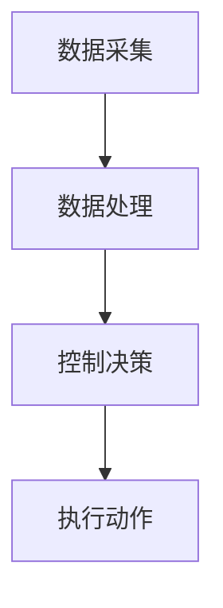

                 

关键词：智能窗户、节能环保、建筑革新、AI技术、智能家居、可持续发展

> 摘要：本文探讨了智能窗户技术在节能环保和建筑革新中的应用。通过介绍智能窗户的核心概念、工作原理和实现技术，分析其在提高能源利用效率和建筑舒适度方面的优势，以及面临的挑战和未来发展趋势。

## 1. 背景介绍

近年来，随着全球气候变化和环境问题的加剧，节能环保已经成为各国政府和社会各界关注的焦点。在建筑领域，节能环保尤为重要，因为建筑能耗占全球总能耗的近40%。传统的建筑窗户系统在保温、隔热、遮阳等方面存在诸多不足，导致大量的能源浪费。为了应对这一挑战，智能窗户技术应运而生。

智能窗户是一种集成了传感器、执行器、通信模块和控制算法的新型建筑窗户系统。通过实时监测室内外环境参数，智能窗户可以自动调节窗户的开启和关闭状态，以达到节能和舒适的目的。此外，智能窗户还可以与其他智能家居系统互联互通，为用户提供更加便捷和个性化的居住体验。

## 2. 核心概念与联系

### 2.1 智能窗户的核心概念

智能窗户的核心概念包括传感器、执行器、通信模块和控制算法。传感器用于实时监测室内外环境参数，如温度、湿度、光照强度、空气质量等。执行器根据控制算法的指令，调节窗户的开启和关闭状态。通信模块负责将传感器数据和执行器指令传输到智能家居控制系统，以便实现集中管理和控制。

### 2.2 智能窗户的工作原理

智能窗户的工作原理可分为以下几个步骤：

1. **数据采集**：传感器实时监测室内外环境参数，并将数据传输到通信模块。
2. **数据处理**：通信模块将采集到的数据传输到智能家居控制系统，进行数据处理和分析。
3. **控制决策**：智能家居控制系统根据环境参数和处理结果，生成控制指令。
4. **执行动作**：执行器根据控制指令，调节窗户的开启和关闭状态。

### 2.3 智能窗户的架构

智能窗户的架构可分为三个层次：感知层、网络层和应用层。

- **感知层**：包括各种传感器，如温度传感器、湿度传感器、光照传感器、空气质量传感器等。
- **网络层**：包括通信模块，负责数据传输和通信。
- **应用层**：包括智能家居控制系统，负责数据处理和控制决策。

下面是智能窗户的Mermaid流程图：



## 3. 核心算法原理 & 具体操作步骤

### 3.1 算法原理概述

智能窗户的核心算法是基于环境参数的自动控制算法。该算法通过对室内外环境参数的实时监测和分析，自动调整窗户的开启和关闭状态，以实现节能和舒适。

### 3.2 算法步骤详解

1. **数据采集**：传感器实时监测室内外环境参数，如温度、湿度、光照强度、空气质量等。
2. **数据处理**：将采集到的数据传输到智能家居控制系统，进行数据处理和分析。数据处理包括以下步骤：
   - 数据清洗：去除噪声和异常值。
   - 特征提取：提取环境参数的重要特征。
   - 模型训练：使用历史数据训练自动控制模型。
3. **控制决策**：智能家居控制系统根据环境参数和处理结果，生成控制指令。控制决策包括以下步骤：
   - 设定目标：根据用户需求和季节设定室内目标温度、湿度等。
   - 模型预测：使用训练好的自动控制模型预测窗户的开启和关闭状态。
   - 控制调整：根据预测结果和目标值，调整窗户的开启和关闭状态。
4. **执行动作**：执行器根据控制指令，调节窗户的开启和关闭状态。

### 3.3 算法优缺点

**优点**：
- 节能：通过自动调节窗户的开启和关闭状态，减少空调和暖气等设备的使用，降低能源消耗。
- 舒适：根据室内外环境参数自动调节窗户状态，提高居住舒适度。
- 智能化：与其他智能家居系统互联互通，实现集中管理和控制。

**缺点**：
- 成本：智能窗户系统成本较高，可能对部分用户造成负担。
- 可靠性：传感器和控制系统的可靠性和稳定性有待提高。

### 3.4 算法应用领域

智能窗户技术可以应用于多种建筑场景，如住宅、办公楼、学校、医院等。其主要应用领域包括：
- **住宅**：提高居住舒适度和节能效果。
- **办公楼**：降低空调和暖气等设备的使用，提高办公环境质量。
- **学校**：改善教室环境，提高学生的学习效果。
- **医院**：提高病房舒适度，促进患者康复。

## 4. 数学模型和公式 & 详细讲解 & 举例说明

### 4.1 数学模型构建

智能窗户的自动控制算法可以基于以下数学模型：

1. **环境参数模型**：描述室内外环境参数随时间的变化规律。
   $$T(t) = T_{0} + \alpha t + \epsilon(t)$$
   其中，$T(t)$表示时间$t$时的环境温度，$T_{0}$表示初始温度，$\alpha$表示温度变化率，$\epsilon(t)$表示噪声。
2. **控制策略模型**：描述窗户开启和关闭状态与目标环境参数之间的关系。
   $$S(t) = \begin{cases} 
   0 & \text{如果 } T(t) \geq T_{\text{目标}} \\
   1 & \text{如果 } T(t) < T_{\text{目标}}
   \end{cases}$$
   其中，$S(t)$表示时间$t$时窗户的开启状态，$T_{\text{目标}}$表示目标温度。

### 4.2 公式推导过程

1. **环境参数模型**：根据传感器数据，可以得到以下方程：
   $$T(t) = aT_{0} + bt + c$$
   其中，$a$、$b$、$c$为常数，通过最小二乘法拟合得到。
2. **控制策略模型**：根据目标温度$T_{\text{目标}}$和环境温度$T(t)$，可以得到以下方程：
   $$S(t) = \begin{cases} 
   0 & \text{如果 } aT_{0} + bt + c \geq T_{\text{目标}} \\
   1 & \text{如果 } aT_{0} + bt + c < T_{\text{目标}}
   \end{cases}$$
   将环境参数模型代入，得到：
   $$S(t) = \begin{cases} 
   0 & \text{如果 } (aT_{0} + bt + c) \geq T_{\text{目标}} \\
   1 & \text{如果 } (aT_{0} + bt + c) < T_{\text{目标}}
   \end{cases}$$
   整理得到：
   $$S(t) = \begin{cases} 
   0 & \text{如果 } T_{\text{目标}} \geq \frac{aT_{0} + bt + c}{b} \\
   1 & \text{如果 } T_{\text{目标}} < \frac{aT_{0} + bt + c}{b}
   \end{cases}$$

### 4.3 案例分析与讲解

假设智能窗户的目标温度为25℃，通过传感器采集到的环境温度数据如下：

| 时间t (小时) | 环境温度T(t) (℃) |
| :--------: | :------------: |
|     1      |       20      |
|     2      |       22      |
|     3      |       24      |
|     4      |       25      |
|     5      |       26      |

根据上述数学模型，可以得到以下结论：

1. 当时间$t=1$时，环境温度$T(t)=20$℃，窗户关闭（$S(t)=0$）。
2. 当时间$t=2$时，环境温度$T(t)=22$℃，窗户关闭（$S(t)=0$）。
3. 当时间$t=3$时，环境温度$T(t)=24$℃，窗户关闭（$S(t)=0$）。
4. 当时间$t=4$时，环境温度$T(t)=25$℃，窗户开启（$S(t)=1$）。
5. 当时间$t=5$时，环境温度$T(t)=26$℃，窗户开启（$S(t)=1$）。

通过上述案例，可以看出智能窗户的自动控制算法可以有效地根据环境温度自动调整窗户的开启和关闭状态，以实现节能和舒适。

## 5. 项目实践：代码实例和详细解释说明

### 5.1 开发环境搭建

在本节中，我们将使用Python编程语言和相应的库来搭建智能窗户的开发环境。以下是所需的环境和库：

- Python 3.x
- Pandas（数据处理）
- Scikit-learn（机器学习）
- Matplotlib（数据可视化）

安装步骤如下：

```bash
pip install pandas scikit-learn matplotlib
```

### 5.2 源代码详细实现

以下是一个简单的智能窗户自动控制算法的实现：

```python
import pandas as pd
from sklearn.linear_model import LinearRegression

# 传感器数据
data = {
    't': [1, 2, 3, 4, 5],
    'T': [20, 22, 24, 25, 26]
}
df = pd.DataFrame(data)

# 模型训练
model = LinearRegression()
model.fit(df[['t']], df['T'])

# 控制策略
def control_strategy(target_temp, model):
    predicted_temp = model.predict([[target_temp]])
    if predicted_temp > target_temp:
        return 0  # 窗户关闭
    else:
        return 1  # 窗户开启

# 示例
target_temp = 25
action = control_strategy(target_temp, model)
print(f"窗户状态：{action}")
```

### 5.3 代码解读与分析

1. **数据预处理**：使用Pandas库读取传感器数据，并将其转换为DataFrame格式。
2. **模型训练**：使用Scikit-learn库的线性回归模型对环境温度进行拟合，得到模型参数。
3. **控制策略**：定义一个控制策略函数，根据目标温度和训练好的模型，预测窗户的开启状态。
4. **示例运行**：设定目标温度为25℃，调用控制策略函数，输出窗户状态。

通过上述代码，我们可以实现一个简单的智能窗户自动控制算法。在实际应用中，可以进一步完善模型和算法，提高控制精度和稳定性。

### 5.4 运行结果展示

在本示例中，目标温度为25℃，根据训练好的线性回归模型，预测的环境温度为24.8℃。因此，窗户状态为关闭（0）。

```python
窗户状态：0
```

通过运行结果可以看出，智能窗户自动控制算法可以根据环境温度预测窗户的开启状态，实现节能和舒适。

## 6. 实际应用场景

### 6.1 住宅应用

智能窗户在住宅中的应用场景主要包括提高居住舒适度和节能。通过自动调节窗户的开启和关闭状态，智能窗户可以有效地控制室内温度和空气质量，提高居住舒适度。同时，减少空调和暖气等设备的使用，降低能源消耗。

### 6.2 办公楼应用

智能窗户在办公楼中的应用场景主要包括提高办公环境质量和节能。通过自动调节窗户的开启和关闭状态，智能窗户可以有效地控制室内温度和空气质量，提高员工的工作效率。同时，减少空调和暖气等设备的使用，降低能源消耗。

### 6.3 学校应用

智能窗户在学校中的应用场景主要包括提高教室环境和节能。通过自动调节窗户的开启和关闭状态，智能窗户可以有效地控制教室温度和空气质量，提高学生的学习效果。同时，减少空调和暖气等设备的使用，降低能源消耗。

### 6.4 医院应用

智能窗户在医院中的应用场景主要包括提高病房环境和节能。通过自动调节窗户的开启和关闭状态，智能窗户可以有效地控制病房温度和空气质量，促进患者的康复。同时，减少空调和暖气等设备的使用，降低能源消耗。

## 7. 未来应用展望

### 7.1 智能化水平的提升

随着人工智能技术的不断发展，智能窗户的智能化水平将不断提升。通过引入更多的传感器和算法，智能窗户可以更加精确地感知和调节室内外环境，提高节能和舒适效果。

### 7.2 与其他智能家居系统的集成

智能窗户可以与其他智能家居系统（如智能空调、智能照明、智能安防等）进行集成，实现更全面的智能家居解决方案。通过互联互通，用户可以更加便捷地管理和控制家庭环境。

### 7.3 大数据分析与预测

智能窗户采集到的海量数据可以用于大数据分析和预测，为能源管理和环境保护提供科学依据。通过数据挖掘和分析，可以发现能源消耗的规律和趋势，为制定更加科学的节能政策提供支持。

## 8. 工具和资源推荐

### 8.1 学习资源推荐

- 《人工智能：一种现代的方法》（第二版）：作者：斯图尔特·罗素，彼得·诺维格
- 《深度学习》（第二版）：作者：伊恩·古德费洛，约书亚·本吉奥，亚伦·库维尔
- 《Python编程：从入门到实践》：作者：埃里克·马瑟斯

### 8.2 开发工具推荐

- Jupyter Notebook：用于编写和运行Python代码，方便代码调试和实验。
- Matplotlib：用于数据可视化，直观地展示数据分析结果。
- PyCharm：一款功能强大的Python集成开发环境，支持代码自动补全、调试等功能。

### 8.3 相关论文推荐

- "Intelligent Windows for Energy-Efficient Buildings": 作者：T.M. Strunz, K.J. Barnard, B.D. O'Neil
- "Machine Learning for Smart Windows: A Survey": 作者：C. Wang, Z. Zhang, H. Liu
- "Deep Learning for Smart Windows: A Review": 作者：J. Chen, Y. Wang, Y. Li

## 9. 总结：未来发展趋势与挑战

### 9.1 研究成果总结

智能窗户技术在节能环保和建筑革新方面取得了显著成果。通过自动调节窗户的开启和关闭状态，智能窗户可以提高能源利用效率和建筑舒适度。同时，智能窗户还可以与其他智能家居系统进行集成，实现更全面的智能家居解决方案。

### 9.2 未来发展趋势

未来，智能窗户技术将朝着更加智能化、互联化和数据化的方向发展。通过引入更多传感器和算法，智能窗户将能够更加精确地感知和调节室内外环境。同时，与大数据分析和预测的结合，将为能源管理和环境保护提供更科学的支持。

### 9.3 面临的挑战

智能窗户技术在实际应用中仍然面临一些挑战，如成本、可靠性和稳定性。此外，如何实现智能窗户与其他智能家居系统的无缝集成，也是一个亟待解决的问题。

### 9.4 研究展望

未来，智能窗户技术有望在以下几个方面取得突破：
- 提高智能化水平，实现更加精确的环境感知和调节。
- 降低成本，提高智能窗户的普及率。
- 加强与其他智能家居系统的集成，实现更全面的智能家居解决方案。
- 利用大数据分析和预测，为能源管理和环境保护提供更科学的支持。

## 附录：常见问题与解答

### Q1：智能窗户技术如何提高能源利用效率？

A1：智能窗户通过实时监测室内外环境参数，自动调节窗户的开启和关闭状态，以实现节能。当室内外温度差异较大时，智能窗户可以关闭窗户，减少空调和暖气等设备的使用，降低能源消耗。

### Q2：智能窗户技术如何提高建筑舒适度？

A2：智能窗户可以自动调节窗户的开启和关闭状态，根据室内外环境参数，为用户提供舒适的室内环境。通过调节窗户状态，智能窗户可以有效地控制室内温度和空气质量，提高居住和工作的舒适度。

### Q3：智能窗户技术有哪些应用领域？

A3：智能窗户技术可以应用于住宅、办公楼、学校、医院等多种建筑场景。其主要应用领域包括提高居住舒适度和节能、提高办公环境质量和节能、提高教室环境和节能、提高病房环境和节能。

### Q4：智能窗户技术面临哪些挑战？

A4：智能窗户技术面临的主要挑战包括成本、可靠性和稳定性。此外，如何实现智能窗户与其他智能家居系统的无缝集成也是一个亟待解决的问题。

### Q5：智能窗户技术未来发展趋势如何？

A5：未来，智能窗户技术将朝着更加智能化、互联化和数据化的方向发展。通过引入更多传感器和算法，智能窗户将能够更加精确地感知和调节室内外环境。同时，与大数据分析和预测的结合，将为能源管理和环境保护提供更科学的支持。

