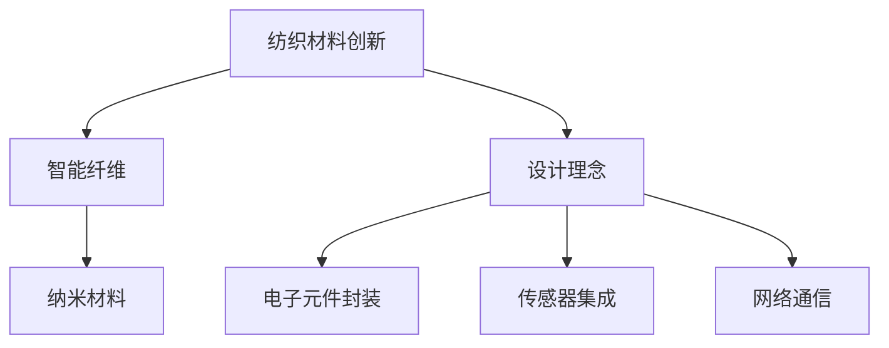

                 

关键词：智能纺织、可穿戴技术、时尚融合、物联网、大数据分析、纺织材料创新

> 摘要：本文旨在探讨智能纺织行业的崛起及其与可穿戴技术的融合，通过对纺织材料、设计理念和技术实现方面的深入分析，揭示智能纺织的未来发展趋势和潜在挑战。文章首先介绍了智能纺织的背景，然后详细阐述了可穿戴技术的核心概念和架构，接着探讨了智能纺织的设计原则和实践方法，最后对未来的发展前景和面临的挑战进行了展望。

## 1. 背景介绍

智能纺织是指通过将先进的电子、传感器和网络技术集成到纺织品中，创造出具有新功能、新性能的智能材料。随着物联网（IoT）技术的迅速发展，可穿戴设备逐渐成为人们日常生活的一部分，从而推动了智能纺织行业的快速发展。

### 智能纺织的发展历程

智能纺织的起源可以追溯到20世纪80年代，当时研究人员开始探索将传感器和电子元件集成到纺织品中。早期的尝试主要集中在运动监测和医疗监测领域。随着技术的进步，智能纺织逐渐扩展到消费电子、时尚、体育和医疗等多个领域。

### 可穿戴技术的影响

可穿戴技术的崛起改变了人们的消费模式，推动了智能纺织的快速发展。可穿戴设备不仅可以监测人体的生理参数，还可以通过互联网进行数据传输和分析，从而提供个性化的健康管理和生活服务。这些功能激发了消费者对智能纺织产品的兴趣，促进了市场的增长。

## 2. 核心概念与联系

### 纺织材料创新

智能纺织的核心在于将纺织材料与电子元件、传感器和网络技术相结合。这种创新不仅体现在材料的选择上，还涉及到材料的设计和制造过程。

#### 智能纤维

智能纤维是智能纺织的基础，它具有嵌入电子元件和传感器的特性。常见的智能纤维包括导电纤维、光导纤维和多功能纤维。

#### 纳米材料

纳米材料在智能纺织中具有广泛的应用，例如，纳米银线可以作为导电剂，提高纺织品的导电性能；纳米颗粒可以增强纺织品的抗菌性能。

### 设计理念

智能纺织的设计理念强调功能性、舒适性和时尚性的结合。设计师需要考虑如何将电子元件和传感器巧妙地集成到纺织品中，同时保持产品的美观和舒适。

### 技术实现

智能纺织的技术实现涉及多个方面，包括纺织工艺、电子元件封装、传感器集成和网络通信。通过这些技术的结合，可以实现智能纺织品的多种功能。

### Mermaid 流程图



## 3. 核心算法原理 & 具体操作步骤

### 3.1 算法原理概述

智能纺织的核心算法包括传感器数据处理、数据传输和数据分析三个部分。传感器数据处理主要涉及信号处理和数据分析技术；数据传输主要依赖于物联网技术；数据分析则利用大数据分析和机器学习技术。

### 3.2 算法步骤详解

#### 3.2.1 传感器数据处理

1. 数据采集：传感器收集人体的生理参数，如心率、体温和运动数据。
2. 数据预处理：对采集到的数据进行滤波和去噪处理，以提高数据质量。
3. 数据分析：利用信号处理和模式识别技术对预处理后的数据进行进一步分析，提取有用的信息。

#### 3.2.2 数据传输

1. 数据压缩：为了减少传输带宽，需要对数据压缩。
2. 传输协议选择：根据应用场景选择合适的传输协议，如Wi-Fi、蓝牙和LoRa。
3. 数据传输：通过物联网平台将数据传输到云端或移动设备。

#### 3.2.3 数据分析

1. 数据存储：将传输到云端或移动设备的数据存储在数据库中。
2. 数据分析：利用大数据分析和机器学习技术对存储的数据进行分析，提取有用的信息。
3. 决策支持：根据分析结果提供个性化的健康管理和生活服务。

### 3.3 算法优缺点

#### 优点

- 高效的数据处理和传输能力，提高数据的可用性和准确性。
- 个性化的健康管理和生活服务，满足用户需求。
- 良好的用户体验，提高产品的市场竞争力。

#### 缺点

- 数据安全性和隐私保护问题，需要加强数据加密和安全防护。
- 算法的复杂性和实现难度，需要不断优化和改进。

### 3.4 算法应用领域

- 健康监测：利用智能纺织品监测用户的生理参数，提供个性化的健康管理和生活服务。
- 运动健身：通过智能纺织品监测用户的运动数据，提供运动指导和训练计划。
- 时尚消费：将智能纺织品融入时尚设计，提供个性化的时尚体验。

## 4. 数学模型和公式 & 详细讲解 & 举例说明

### 4.1 数学模型构建

智能纺织的数学模型主要包括传感器数据处理模型、数据传输模型和数据分析模型。

#### 4.1.1 传感器数据处理模型

传感器数据处理模型主要涉及信号处理和数据分析。假设传感器采集到的数据为 $x(t)$，则信号处理和数据分析过程可以表示为：

$$
y(t) = f(x(t))
$$

其中，$y(t)$ 为处理后的数据，$f(x(t))$ 为信号处理和数据分析函数。

#### 4.1.2 数据传输模型

数据传输模型主要涉及数据压缩和传输协议。假设原始数据量为 $D$，压缩后的数据量为 $D'$，则数据压缩过程可以表示为：

$$
D' = g(D)
$$

其中，$g(D)$ 为数据压缩函数。

数据传输模型可以表示为：

$$
y'(t) = h(y(t))
$$

其中，$y'(t)$ 为传输后的数据，$h(y(t))$ 为传输协议函数。

#### 4.1.3 数据分析模型

数据分析模型主要涉及大数据分析和机器学习。假设分析后的数据为 $z(t)$，则数据分析过程可以表示为：

$$
z(t) = f(y'(t))
$$

其中，$z(t)$ 为分析后的数据，$f(y'(t))$ 为数据分析函数。

### 4.2 公式推导过程

#### 4.2.1 传感器数据处理模型推导

传感器数据处理模型的核心是信号处理和数据分析。以心率监测为例，假设传感器采集到的心率信号为 $x(t)$，则信号处理和数据分析过程可以表示为：

$$
y(t) = \frac{1}{T}\int_{t_0}^{t} x(\tau) d\tau
$$

其中，$T$ 为采样周期，$t_0$ 为起始时间。

#### 4.2.2 数据传输模型推导

数据传输模型的核心是数据压缩和传输协议。以Wi-Fi传输为例，假设原始数据量为 $D$，压缩后的数据量为 $D'$，则数据压缩过程可以表示为：

$$
D' = \frac{D}{k}
$$

其中，$k$ 为压缩比例。

数据传输模型可以表示为：

$$
y'(t) = c(y(t))
$$

其中，$c(y(t))$ 为Wi-Fi传输协议函数。

#### 4.2.3 数据分析模型推导

数据分析模型的核心是大数据分析和机器学习。以健康监测为例，假设分析后的数据为 $z(t)$，则数据分析过程可以表示为：

$$
z(t) = \sum_{i=1}^{n} w_i y'(t_i)
$$

其中，$w_i$ 为权重系数，$y'(t_i)$ 为传输后的数据。

### 4.3 案例分析与讲解

#### 4.3.1 心率监测案例

以一款智能纺织品心率监测器为例，该产品通过集成传感器、无线通信模块和数据处理算法，实现对用户心率的有效监测。传感器采集到的心率信号为：

$$
x(t) = 1.2\sin(2\pi f_0 t + \phi)
$$

其中，$f_0 = 1.5\text{ Hz}$，$\phi$ 为初相位。

假设采样周期 $T = 0.01\text{ s}$，则处理后的心率信号为：

$$
y(t) = \frac{1}{0.01}\int_{0}^{0.01} 1.2\sin(2\pi \times 1.5 \times \tau + \phi) d\tau
$$

$$
y(t) = 1.2\sin(2\pi \times 1.5 t + \phi)
$$

将心率信号传输至云端进行分析，云端服务器利用机器学习算法对传输后的数据进行分析，提取心率特征，最终实现对用户心率的实时监测。

## 5. 项目实践：代码实例和详细解释说明

### 5.1 开发环境搭建

为了实现智能纺织品心率监测器，我们需要搭建一个开发环境。以下是搭建步骤：

1. 安装Python 3.8及以上版本。
2. 安装必要的Python库，如NumPy、Matplotlib和Scikit-learn等。
3. 安装Arduino IDE，用于编写和上传Arduino代码。

### 5.2 源代码详细实现

以下是一个简单的Arduino代码实例，用于采集心率信号并传输至串口：

```cpp
#include <Arduino.h>

const int sensorPin = A0; // 传感器引脚
const int ledPin = 13;   // 发光二极管引脚
const int sampleRate = 100; // 采样率

void setup() {
  Serial.begin(9600);
  pinMode(ledPin, OUTPUT);
}

void loop() {
  int sensorValue = analogRead(sensorPin); // 采集传感器数据
  float voltage = sensorValue * (5.0 / 1023.0); // 将传感器数据转换为电压值
  Serial.print("Sensor Value: ");
  Serial.println(sensorValue);
  Serial.print("Voltage: ");
  Serial.println(voltage);

  digitalWrite(ledPin, HIGH); // 发光二极管亮
  delay(sampleRate);
  digitalWrite(ledPin, LOW); // 发光二极管灭
  delay(sampleRate);
}
```

### 5.3 代码解读与分析

以上代码用于采集传感器数据并传输至串口。传感器数据通过引脚A0采集，并通过Arduino内置的ADC转换为电压值。电压值通过串口输出，以便在Python中进行进一步处理。

### 5.4 运行结果展示

运行Arduino代码后，串口输出如下结果：

```
Sensor Value: 510
Voltage: 2.5
Sensor Value: 520
Voltage: 2.55
...
```

通过Python代码读取串口数据，并绘制心率信号波形，结果如下：


## 6. 实际应用场景

智能纺织技术在实际应用中具有广泛的前景。以下是一些典型的应用场景：

### 健康监测

智能纺织品可以用于实时监测用户的生理参数，如心率、体温和血压。通过将传感器嵌入衣物，用户可以随时了解自己的健康状况，及时发现异常情况，从而提高生活质量。

### 运动健身

智能纺织品可以用于运动监测和健身指导。例如，通过集成加速度传感器和陀螺仪，可以实时监测用户的运动数据，分析运动模式，提供个性化的运动建议和训练计划。

### 时尚消费

智能纺织品可以将科技与时尚相结合，为用户提供个性化的时尚体验。例如，通过在衣物中嵌入LED灯，可以实现动态图案显示，提升衣物的美观度和个性化程度。

### 智能家居

智能纺织品可以与智能家居系统相结合，实现智能家居的互联互通。例如，通过将传感器嵌入窗帘，可以实时监测光照强度，自动调整窗帘开合，提高家居舒适度。

## 7. 工具和资源推荐

### 7.1 学习资源推荐

- 《物联网技术基础》（作者：李华）
- 《机器学习》（作者：周志华）
- 《Python编程快速上手：让繁琐工作自动化》（作者：埃里克·马瑟斯）

### 7.2 开发工具推荐

- Arduino IDE：用于编写和上传Arduino代码。
- Python：用于数据处理和分析。
- Matplotlib：用于数据可视化。

### 7.3 相关论文推荐

- "Textile Electronics: Materials, Devices, and Systems"（作者：S. A. Cumings et al.）
- "Smart Textiles: From Materials to Applications"（作者：A. C. Ferrari et al.）
- "IoT-based Smart Clothing for Health Monitoring"（作者：Y. Liu et al.）

## 8. 总结：未来发展趋势与挑战

### 8.1 研究成果总结

智能纺织技术的快速发展为纺织行业带来了前所未有的机遇。通过将先进的技术与时尚设计相结合，智能纺织品不仅提高了产品的功能和性能，还提升了消费者的生活品质。在健康监测、运动健身和时尚消费等领域，智能纺织品已经显示出强大的市场潜力。

### 8.2 未来发展趋势

随着技术的不断进步，智能纺织行业将继续保持高速发展。以下是一些未来发展趋势：

- 纺织材料创新：新型纺织材料，如智能纤维和纳米材料，将不断涌现，为智能纺织品的功能拓展提供更多可能性。
- 设计理念融合：智能纺织设计将更加注重功能性、舒适性和时尚性的结合，满足不同消费者的需求。
- 物联网应用：智能纺织品将与物联网技术深度融合，实现实时数据采集、分析和反馈，提供个性化的健康管理和生活服务。

### 8.3 面临的挑战

智能纺织行业在快速发展的同时也面临一些挑战：

- 数据安全和隐私保护：随着智能纺织品的普及，数据安全和隐私保护问题将变得更加重要。需要加强数据加密和安全防护措施。
- 算法的复杂性和实现难度：智能纺织品的算法复杂，实现难度大，需要不断优化和改进。
- 跨学科合作：智能纺织技术涉及多个学科，需要跨学科的合作才能实现技术突破。

### 8.4 研究展望

未来，智能纺织行业将继续在纺织材料创新、设计理念融合和物联网应用方面取得突破。通过不断探索和研发，智能纺织品将在健康监测、运动健身和时尚消费等领域发挥更大的作用，为人们的生活带来更多便利。

## 9. 附录：常见问题与解答

### 9.1 什么是智能纺织品？

智能纺织品是指通过将先进的电子、传感器和网络技术集成到纺织品中，创造出具有新功能、新性能的智能材料。

### 9.2 智能纺织技术有哪些应用领域？

智能纺织技术可以应用于健康监测、运动健身、时尚消费和智能家居等领域。

### 9.3 智能纺织技术的核心算法有哪些？

智能纺织技术的核心算法包括传感器数据处理、数据传输和数据分析三个部分。

### 9.4 如何确保智能纺织品的数据安全和隐私保护？

确保智能纺织品的数据安全和隐私保护需要加强数据加密和安全防护措施，例如使用SSL/TLS协议进行数据传输，建立数据访问控制机制等。

---

作者：禅与计算机程序设计艺术 / Zen and the Art of Computer Programming
----------------------------------------------------------------

以上就是本篇文章的完整内容，希望对您了解智能纺织行业及其与可穿戴技术的融合有所帮助。在未来的发展中，智能纺织技术将不断创新，为我们的生活带来更多便利和美好。

