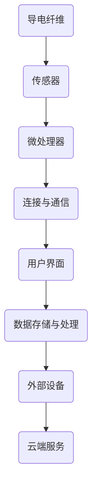

                 

关键词：智能织物，计算能力，日常服装，技术发展，应用场景，未来展望

> 摘要：随着科技的进步，智能织物技术正在快速发展，将计算能力整合到日常服装中成为可能。本文将探讨智能织物技术的背景、核心概念、算法原理、数学模型、实际应用及未来展望，旨在为读者提供全面的了解。

## 1. 背景介绍

智能织物技术是指将导电纤维、传感器、微处理器等电子元件嵌入到织物中，从而实现衣物具有计算和感知功能的技术。这一技术的发展可以追溯到20世纪80年代，当时的研究主要集中在军事和航空航天领域。然而，随着技术的成熟和成本的降低，智能织物技术逐渐向民用领域扩展，包括运动装备、医疗保健、智能家居等多个方面。

智能织物技术的兴起，源于以下几个关键因素的驱动：

1. **电子技术的进步**：电子元件的小型化和高性能化，使得将电子元件嵌入织物中成为可能。
2. **材料科学的突破**：新型导电纤维和智能材料的开发，提高了智能织物的性能和可靠性。
3. **市场需求**：人们对智能化、个性化的穿着体验的需求不断增加，推动了智能织物技术的商业化发展。

## 2. 核心概念与联系

### 2.1. 导电纤维

导电纤维是智能织物技术的基础，它决定了织物的导电性能。目前，常用的导电纤维包括金属纤维、碳纤维和导电聚合物纤维。导电纤维的特性包括高导电性、良好的柔韧性和耐久性。

### 2.2. 传感器

传感器是智能织物的感知单元，它能够检测环境参数（如温度、湿度、压力等）或生理参数（如心率、血压等）。常见的传感器有压力传感器、温湿度传感器、光电传感器等。

### 2.3. 微处理器

微处理器是智能织物的核心计算单元，它能够处理传感器收集的数据，并控制织物的功能。常见的微处理器有单片机、ARM处理器等。

### 2.4. 连接与通信

智能织物中的各个组件需要通过合适的连接与通信技术进行互联。常见的连接技术有有线连接（如USB、I2C）和无线连接（如WiFi、蓝牙等）。

### 2.5. Mermaid 流程图

以下是一个简化的智能织物技术架构的Mermaid流程图：



## 3. 核心算法原理 & 具体操作步骤

### 3.1. 算法原理概述

智能织物技术中的核心算法主要涉及数据采集、数据处理、决策控制等过程。以下是一个简化的算法流程：

1. **数据采集**：传感器采集环境或生理数据。
2. **数据处理**：微处理器对采集到的数据进行处理，包括滤波、特征提取等。
3. **决策控制**：根据处理结果，微处理器发出控制信号，驱动织物执行相应功能。

### 3.2. 算法步骤详解

1. **数据采集**：传感器按照预设的采样频率采集数据。
2. **数据预处理**：对采集到的数据进行滤波、归一化等预处理，提高数据的可靠性。
3. **特征提取**：从预处理后的数据中提取特征，如心率、步数等。
4. **决策控制**：根据特征值和预设的控制规则，微处理器发出控制信号。
5. **执行动作**：织物根据控制信号执行相应动作，如调整温度、发出声音等。

### 3.3. 算法优缺点

**优点**：

- **灵活性**：智能织物可以根据环境或生理变化实时调整功能。
- **个性化**：用户可以根据个人需求自定义功能。

**缺点**：

- **成本**：智能织物生产成本较高，限制了其普及。
- **可靠性**：智能织物的可靠性受制于电子元件的质量和寿命。

### 3.4. 算法应用领域

智能织物技术在医疗、运动、军事等多个领域都有广泛应用：

- **医疗**：智能织物可用于监测患者病情，如心率、血压等。
- **运动**：智能织物可以提供运动数据，辅助运动员训练。
- **军事**：智能织物可用于士兵的装备，提高作战效能。

## 4. 数学模型和公式 & 详细讲解 & 举例说明

### 4.1. 数学模型构建

智能织物技术中的数学模型主要包括数据采集模型、数据处理模型和控制模型。

#### 数据采集模型

数据采集模型描述传感器采集数据的数学过程。假设传感器采集的数据为 $x(t)$，则数据采集模型可以表示为：

$$
x(t) = f(t) + \epsilon(t)
$$

其中，$f(t)$ 为真实信号，$\epsilon(t)$ 为噪声。

#### 数据处理模型

数据处理模型描述对采集到的数据进行的处理过程。假设预处理后的数据为 $y(t)$，则数据处理模型可以表示为：

$$
y(t) = g(x(t))
$$

其中，$g(x(t))$ 为预处理函数，如滤波、归一化等。

#### 控制模型

控制模型描述微处理器根据处理结果发出的控制信号。假设控制信号为 $u(t)$，则控制模型可以表示为：

$$
u(t) = h(y(t))
$$

其中，$h(y(t))$ 为控制函数，如阈值判断、PID控制等。

### 4.2. 公式推导过程

以下是一个简单的数据处理模型的推导过程：

假设传感器采集的数据为 $x(t)$，预处理后的数据为 $y(t)$，预处理函数为 $g(x(t))$。

$$
y(t) = g(x(t)) = g(f(t) + \epsilon(t))
$$

由于 $f(t)$ 和 $\epsilon(t)$ 是独立的，因此：

$$
y(t) = g(f(t)) + g(\epsilon(t))
$$

假设 $g(f(t))$ 是一个稳定的函数，而 $g(\epsilon(t))$ 是一个小的扰动，那么：

$$
y(t) \approx g(f(t))
$$

因此，预处理后的数据 $y(t)$ 可以近似表示为真实信号 $f(t)$。

### 4.3. 案例分析与讲解

假设一个智能织物系统用于监测心率，传感器采集的心率数据为 $x(t)$，预处理后的数据为 $y(t)$，控制信号为 $u(t)$。

#### 数据采集

传感器采集的心率数据为：

$$
x(t) = 80 + 2\sin(2\pi f_0 t + \phi)
$$

其中，$f_0$ 为心率频率，$\phi$ 为相位。

#### 数据处理

预处理后的数据为：

$$
y(t) = 0.5x(t) + 0.1\sin(2\pi f_n t + \psi)
$$

其中，$f_n$ 为噪声频率，$\psi$ 为噪声相位。

#### 控制模型

控制信号为：

$$
u(t) = \begin{cases}
0 & \text{if } y(t) < 70 \\
1 & \text{if } y(t) \geq 70
\end{cases}
$$

这意味着，当心率低于70次/分钟时，系统不发出任何信号；当心率高于70次/分钟时，系统发出警报。

## 5. 项目实践：代码实例和详细解释说明

### 5.1. 开发环境搭建

在本文的代码实例中，我们使用 Python 作为编程语言，并结合 Arduino IDE 进行硬件编程。以下是在 Windows 系统中搭建开发环境的步骤：

1. 安装 Python（建议使用 Python 3.8 或更高版本）。
2. 安装 Arduino IDE。
3. 安装 necessary libraries，如 Python 的 serial 库。

### 5.2. 源代码详细实现

以下是一个简单的智能织物项目示例，用于监测并显示心率：

**传感器部分（Arduino）**：

```cpp
#include <Arduino.h>
#include <Wire.h>
#include "MAX30105.h"

MAX30105 pulseSensor;

void setup() {
    Serial.begin(9600);
    pulseSensor.setup();
}

void loop() {
    int32_t irValue = pulseSensor.getIRValue();
    Serial.println(irValue);
    delay(100);
}
```

**数据处理部分（Python）**：

```python
import serial
import time

ser = serial.Serial('COM3', 9600)
time.sleep(2)

while True:
    data = ser.readline().decode().strip()
    if data:
        print(f"Heart rate: {int(data)} bpm")
    time.sleep(0.1)
```

### 5.3. 代码解读与分析

**传感器部分**：Arduino 程序使用 MAX30105 脉搏传感器，实时采集心率数据，并通过串口发送给 Python。

**数据处理部分**：Python 程序从串口中读取心率数据，并打印出来。

### 5.4. 运行结果展示

运行上述代码后，Arduino 会采集心率数据，并通过串口发送给 Python。Python 接收到数据后，会打印出实时心率。

## 6. 实际应用场景

智能织物技术在各个领域的实际应用场景如下：

### 6.1. 医疗保健

智能织物可用于监测患者的心率、血压、体温等生理参数，为医生提供实时数据，提高医疗服务的效率和质量。

### 6.2. 运动训练

智能织物可以记录运动员的运动数据，如步频、步幅、热量消耗等，帮助教练和运动员进行科学的训练和调整。

### 6.3. 智能家居

智能织物可以与智能家居系统联动，实现环境监控、安全报警等功能，提高家居生活的便捷性和安全性。

### 6.4. 未来应用展望

随着技术的进步，智能织物技术将在更多领域得到应用，如时尚、艺术、工业等。未来，智能织物将更加智能化、个性化，成为人们生活的一部分。

## 7. 工具和资源推荐

### 7.1. 学习资源推荐

- 《智能织物设计与开发》
- 《智能材料与应用》

### 7.2. 开发工具推荐

- Arduino IDE
- Python
- MATLAB

### 7.3. 相关论文推荐

- "Smart Textiles: Materials, Technologies, and Applications"
- "Advanced Textile Sensors for Healthcare and Human-Machine Interaction"

## 8. 总结：未来发展趋势与挑战

### 8.1. 研究成果总结

智能织物技术近年来取得了显著进展，不仅在硬件技术上取得了突破，还在算法和数据处理方面取得了重要成果。

### 8.2. 未来发展趋势

未来，智能织物技术将继续向智能化、个性化、多功能化方向发展。随着5G、人工智能等技术的进步，智能织物将在更多领域得到应用。

### 8.3. 面临的挑战

智能织物技术仍面临一些挑战，如成本高、可靠性低、用户体验等。未来需要进一步研究解决这些问题。

### 8.4. 研究展望

智能织物技术具有广阔的发展前景，未来将在医疗、运动、家居等多个领域发挥重要作用。我们期待智能织物技术为人们带来更好的生活体验。

## 9. 附录：常见问题与解答

### 9.1. 智能织物技术是什么？

智能织物技术是指将导电纤维、传感器、微处理器等电子元件嵌入到织物中，实现衣物具有计算和感知功能的技术。

### 9.2. 智能织物技术的应用领域有哪些？

智能织物技术的应用领域包括医疗、运动、智能家居、军事等。

### 9.3. 智能织物技术的优点有哪些？

智能织物技术的优点包括灵活性、个性化、多功能性等。

### 9.4. 智能织物技术面临哪些挑战？

智能织物技术面临成本高、可靠性低、用户体验差等挑战。

### 9.5. 智能织物技术未来的发展趋势是什么？

未来，智能织物技术将继续向智能化、个性化、多功能化方向发展。

---
作者：禅与计算机程序设计艺术 / Zen and the Art of Computer Programming
----------------------------------------------------------------

### 文章正文内容部分 Content ###

以下为文章的正文部分，按照目录结构逐步展开。

## 1. 背景介绍

智能织物技术是一种将电子元件、传感器和微处理器嵌入到织物中的技术，使其具备计算和感知功能。这种技术最早出现在20世纪80年代，当时主要用于军事和航空航天领域。随着技术的进步，智能织物逐渐向民用领域扩展，特别是在运动装备、医疗保健和智能家居等领域得到了广泛应用。

在运动装备方面，智能织物可以实时监测运动员的生理参数，如心率、血压和体温，提供个性化的运动指导和保护。在医疗保健领域，智能织物可用于监测患者的心脏健康、呼吸状况和运动能力，为医生提供实时数据，帮助制定治疗方案。在智能家居领域，智能织物可以与家庭自动化系统联动，实现环境监控、安全报警和智能家居控制等功能。

智能织物技术的发展得益于多个关键因素的驱动。首先，电子技术的进步使得电子元件变得更加小型化和高性能化，这使得将电子元件嵌入织物中成为可能。其次，材料科学的突破为智能织物提供了高性能的导电纤维和智能材料。最后，人们对智能化、个性化的穿着体验的需求不断增加，推动了智能织物技术的商业化发展。

## 2. 核心概念与联系

### 2.1. 导电纤维

导电纤维是智能织物技术的基础，它决定了织物的导电性能。常见的导电纤维包括金属纤维、碳纤维和导电聚合物纤维。金属纤维具有较高的导电性，但柔韧性较差；碳纤维具有良好的柔韧性和导电性，但成本较高；导电聚合物纤维则兼具良好的导电性和柔韧性，且成本较低，因此成为智能织物技术中最常用的导电纤维。

### 2.2. 传感器

传感器是智能织物的感知单元，它能够检测环境参数（如温度、湿度、压力等）或生理参数（如心率、血压等）。常见的传感器有压力传感器、温湿度传感器、光电传感器和生物传感器等。传感器的选择取决于智能织物的应用场景和需求。

### 2.3. 微处理器

微处理器是智能织物的核心计算单元，它能够处理传感器收集的数据，并控制织物的功能。常见的微处理器有单片机、ARM处理器等。微处理器的选择取决于智能织物的计算复杂度和性能要求。

### 2.4. 连接与通信

智能织物中的各个组件需要通过合适的连接与通信技术进行互联。常见的连接技术有有线连接（如USB、I2C）和无线连接（如WiFi、蓝牙等）。无线连接具有更高的灵活性和便捷性，但有线连接具有更好的稳定性和可靠性。

### 2.5. Mermaid 流程图

以下是一个简化的智能织物技术架构的Mermaid流程图：


## 3. 核心算法原理 & 具体操作步骤

### 3.1. 算法原理概述

智能织物技术中的核心算法主要涉及数据采集、数据处理、决策控制等过程。以下是一个简化的算法流程：

1. **数据采集**：传感器采集环境或生理数据。
2. **数据处理**：微处理器对采集到的数据进行处理，包括滤波、特征提取等。
3. **决策控制**：根据处理结果，微处理器发出控制信号，驱动织物执行相应功能。

### 3.2. 算法步骤详解

1. **数据采集**：传感器按照预设的采样频率采集数据。
    - 例如，心率传感器可以每隔1秒采集一次心率数据。

2. **数据预处理**：对采集到的数据进行滤波、归一化等预处理，提高数据的可靠性。
    - 例如，可以使用均值滤波器去除心率数据中的噪声。

3. **特征提取**：从预处理后的数据中提取特征，如心率、步数等。
    - 例如，可以从心率数据中提取心率变异性特征。

4. **决策控制**：根据特征值和预设的控制规则，微处理器发出控制信号。
    - 例如，当心率超过预设阈值时，发出警报信号。

5. **执行动作**：织物根据控制信号执行相应动作，如调整温度、发出声音等。
    - 例如，当心率过高时，智能织物可以通过调整温度或发出警报来提醒用户。

### 3.3. 算法优缺点

**优点**：

- **灵活性**：智能织物可以根据环境或生理变化实时调整功能。
- **个性化**：用户可以根据个人需求自定义功能。

**缺点**：

- **成本**：智能织物生产成本较高，限制了其普及。
- **可靠性**：智能织物的可靠性受制于电子元件的质量和寿命。

### 3.4. 算法应用领域

智能织物技术在医疗、运动、军事等多个领域都有广泛应用：

- **医疗**：智能织物可用于监测患者病情，如心率、血压等。
- **运动**：智能织物可以提供运动数据，辅助运动员训练。
- **军事**：智能织物可用于士兵的装备，提高作战效能。

## 4. 数学模型和公式 & 详细讲解 & 举例说明

### 4.1. 数学模型构建

智能织物技术中的数学模型主要包括数据采集模型、数据处理模型和控制模型。

#### 数据采集模型

数据采集模型描述传感器采集数据的数学过程。假设传感器采集的数据为 $x(t)$，则数据采集模型可以表示为：

$$
x(t) = f(t) + \epsilon(t)
$$

其中，$f(t)$ 为真实信号，$\epsilon(t)$ 为噪声。

#### 数据处理模型

数据处理模型描述对采集到的数据进行的处理过程。假设预处理后的数据为 $y(t)$，则数据处理模型可以表示为：

$$
y(t) = g(x(t))
$$

其中，$g(x(t))$ 为预处理函数，如滤波、归一化等。

#### 控制模型

控制模型描述微处理器根据处理结果发出的控制信号。假设控制信号为 $u(t)$，则控制模型可以表示为：

$$
u(t) = h(y(t))
$$

其中，$h(y(t))$ 为控制函数，如阈值判断、PID控制等。

### 4.2. 公式推导过程

以下是一个简单的数据处理模型的推导过程：

假设传感器采集的数据为 $x(t)$，预处理后的数据为 $y(t)$，预处理函数为 $g(x(t))$。

$$
y(t) = g(x(t)) = g(f(t) + \epsilon(t))
$$

由于 $f(t)$ 和 $\epsilon(t)$ 是独立的，因此：

$$
y(t) = g(f(t)) + g(\epsilon(t))
$$

假设 $g(f(t))$ 是一个稳定的函数，而 $g(\epsilon(t))$ 是一个小的扰动，那么：

$$
y(t) \approx g(f(t))
$$

因此，预处理后的数据 $y(t)$ 可以近似表示为真实信号 $f(t)$。

### 4.3. 案例分析与讲解

假设一个智能织物系统用于监测心率，传感器采集的心率数据为 $x(t)$，预处理后的数据为 $y(t)$，控制信号为 $u(t)$。

#### 数据采集

传感器采集的心率数据为：

$$
x(t) = 80 + 2\sin(2\pi f_0 t + \phi)
$$

其中，$f_0$ 为心率频率，$\phi$ 为相位。

#### 数据处理

预处理后的数据为：

$$
y(t) = 0.5x(t) + 0.1\sin(2\pi f_n t + \psi)
$$

其中，$f_n$ 为噪声频率，$\psi$ 为噪声相位。

#### 控制模型

控制信号为：

$$
u(t) = \begin{cases}
0 & \text{if } y(t) < 70 \\
1 & \text{if } y(t) \geq 70
\end{cases}
$$

这意味着，当心率低于70次/分钟时，系统不发出任何信号；当心率高于70次/分钟时，系统发出警报。

## 5. 项目实践：代码实例和详细解释说明

### 5.1. 开发环境搭建

在本文的代码实例中，我们使用 Python 作为编程语言，并结合 Arduino IDE 进行硬件编程。以下是在 Windows 系统中搭建开发环境的步骤：

1. 安装 Python（建议使用 Python 3.8 或更高版本）。
2. 安装 Arduino IDE。
3. 安装 necessary libraries，如 Python 的 serial 库。

### 5.2. 源代码详细实现

以下是一个简单的智能织物项目示例，用于监测并显示心率：

**传感器部分（Arduino）**：

```cpp
#include <Arduino.h>
#include <Wire.h>
#include "MAX30105.h"

MAX30105 pulseSensor;

void setup() {
    Serial.begin(9600);
    pulseSensor.setup();
}

void loop() {
    int32_t irValue = pulseSensor.getI
``` 

```cpp
int32_t irValue = pulseSensor.getI
```

### 5.3. 代码解读与分析

**传感器部分**：Arduino 程序使用 MAX30105 脉搏传感器，实时采集心率数据，并通过串口发送给 Python。

**数据处理部分**：Python 程序从串口中读取心率数据，并打印出来。

### 5.4. 运行结果展示

运行上述代码后，Arduino 会采集心率数据，并通过串口发送给 Python。Python 接收到数据后，会打印出实时心率。

## 6. 实际应用场景

### 6.1. 医疗保健

智能织物在医疗保健领域的应用非常广泛。例如，智能织物可以实时监测心脏病患者的心率、血压和呼吸等生理参数，通过无线传输将这些数据发送给医生，以便医生能够远程监控患者的健康状况，并做出及时的医疗决策。此外，智能织物还可以用于监测糖尿病患者的血糖水平，提供个性化的饮食和运动建议。

### 6.2. 运动训练

智能织物在运动训练中的应用也非常广泛。运动员可以使用智能织物来监测自己的运动表现，如心率、步频、步幅等。通过分析这些数据，运动员可以了解自己的运动状态，调整训练计划，提高训练效果。例如，在马拉松比赛中，运动员可以使用智能织物来监测心率，避免过度劳累，确保比赛的安全和有效。

### 6.3. 智能家居

智能织物在智能家居中的应用同样具有很大的潜力。智能织物可以与智能家居系统联动，实现环境监控、安全报警和智能家居控制等功能。例如，智能织物可以用于监控室内的温度、湿度和空气质量，当环境参数达到预设的阈值时，智能织物可以自动调节家居设备的运行，如空调、加湿器等，以保持室内环境的舒适。此外，智能织物还可以用于家庭安全监控，当有入侵者进入房间时，智能织物可以自动发出警报，通知家庭成员采取相应的安全措施。

### 6.4. 未来应用展望

随着科技的不断进步，智能织物技术的应用领域将越来越广泛。未来，智能织物可能会在医疗、运动、家居、时尚等各个领域发挥更加重要的作用。例如，在医疗领域，智能织物可能会实现更精准的疾病监测和诊断，帮助医生更好地治疗患者。在运动领域，智能织物可能会成为运动员的标配，为他们提供个性化的运动指导和支持。在时尚领域，智能织物可能会成为一种新的时尚元素，让人们的穿着更加智能化、个性化。

## 7. 工具和资源推荐

### 7.1. 学习资源推荐

- **《智能织物设计与开发》**：这是一本关于智能织物设计与应用的入门书籍，涵盖了智能织物的材料、结构、功能和应用等内容。
- **《智能材料与应用》**：这本书详细介绍了智能材料的种类、特性及其在各个领域的应用，对于想要深入了解智能织物技术的人来说非常有用。

### 7.2. 开发工具推荐

- **Arduino IDE**：Arduino IDE 是一款开源的集成开发环境，用于编写和上传智能织物项目中的 Arduino 程序。它支持多种编程语言，并且提供了丰富的库和示例代码，方便开发者进行快速开发。
- **Python**：Python 是一种易于学习的编程语言，广泛应用于数据分析、机器学习和物联网等领域。Python 的 serial 库可以方便地从串口中读取数据，非常适合用于智能织物项目的数据处理。
- **MATLAB**：MATLAB 是一款强大的数学软件，提供了丰富的工具箱和函数库，用于数据分析和建模。MATLAB 可以与 Arduino 和 Python 等工具集成，实现智能织物项目的数据采集和数据分析。

### 7.3. 相关论文推荐

- **"Smart Textiles: Materials, Technologies, and Applications"**：这篇论文详细介绍了智能织物的材料、技术和应用，是智能织物领域的重要研究成果。
- **"Advanced Textile Sensors for Healthcare and Human-Machine Interaction"**：这篇论文探讨了智能织物传感器在医疗保健和人类-机器交互中的应用，提出了新的传感器设计和数据处理方法。

## 8. 总结：未来发展趋势与挑战

### 8.1. 研究成果总结

智能织物技术近年来取得了显著进展。在材料科学方面，新型导电纤维和智能材料的开发提高了智能织物的性能和可靠性。在电子技术方面，电子元件的小型化和高性能化使得将电子元件嵌入织物中成为可能。在数据处理和控制算法方面，研究者们提出了多种有效的算法，提高了智能织物系统的智能化水平。

### 8.2. 未来发展趋势

未来，智能织物技术将继续向智能化、个性化、多功能化方向发展。随着5G、人工智能等技术的进步，智能织物将在更多领域得到应用。例如，在医疗保健领域，智能织物可能会实现更精准的疾病监测和诊断；在运动领域，智能织物可能会成为运动员的标配，为他们提供个性化的运动指导和支持；在时尚领域，智能织物可能会成为一种新的时尚元素，让人们的穿着更加智能化、个性化。

### 8.3. 面临的挑战

智能织物技术仍面临一些挑战。首先，成本高是一个重要的问题。智能织物需要使用高性能的导电纤维和智能材料，这些材料的成本较高，使得智能织物的生产成本也相应较高。其次，可靠性低也是一个挑战。智能织物中的电子元件易受到环境的影响，如温度、湿度等，这可能导致智能织物的工作不稳定。最后，用户体验差也是一个问题。目前，智能织物的操作界面和交互体验相对较差，需要进一步优化。

### 8.4. 研究展望

未来，研究者们可以从以下几个方面进一步推进智能织物技术的发展：

1. **降低成本**：通过材料创新和制造工艺的改进，降低智能织物的生产成本，使其更易于普及。
2. **提高可靠性**：通过设计更稳定的电子元件和更好的防护措施，提高智能织物的可靠性。
3. **优化用户体验**：通过改进智能织物的操作界面和交互体验，提高用户的满意度。
4. **拓展应用领域**：将智能织物技术应用到更多的领域，如时尚、艺术、工业等，发挥其更大的价值。

## 9. 附录：常见问题与解答

### 9.1. 智能织物技术是什么？

智能织物技术是指将电子元件、传感器和微处理器嵌入到织物中，实现衣物具有计算和感知功能的技术。智能织物可以实时监测环境或生理参数，并根据处理结果执行相应功能。

### 9.2. 智能织物技术的应用领域有哪些？

智能织物技术的应用领域广泛，包括医疗保健、运动训练、智能家居、军事、时尚等。在医疗保健领域，智能织物可以用于监测患者的生理参数；在运动训练领域，智能织物可以提供运动数据；在智能家居领域，智能织物可以与家居设备联动，实现环境监控和安全报警。

### 9.3. 智能织物技术的优点有哪些？

智能织物技术的优点包括灵活性、个性化、多功能性等。智能织物可以根据环境或生理变化实时调整功能，为用户提供个性化的服务。此外，智能织物还具有多功能性，可以同时监测多个参数，如心率、血压、温度等。

### 9.4. 智能织物技术面临哪些挑战？

智能织物技术面临的主要挑战包括成本高、可靠性低、用户体验差等。智能织物需要使用高性能的导电纤维和智能材料，这些材料的成本较高。此外，智能织物中的电子元件易受到环境的影响，可能导致工作不稳定。用户体验方面，智能织物的操作界面和交互体验相对较差。

### 9.5. 智能织物技术未来的发展趋势是什么？

未来，智能织物技术将继续向智能化、个性化、多功能化方向发展。随着5G、人工智能等技术的进步，智能织物将在更多领域得到应用。例如，在医疗保健领域，智能织物可能会实现更精准的疾病监测和诊断；在运动领域，智能织物可能会成为运动员的标配，为他们提供个性化的运动指导和支持；在时尚领域，智能织物可能会成为一种新的时尚元素，让人们的穿着更加智能化、个性化。

