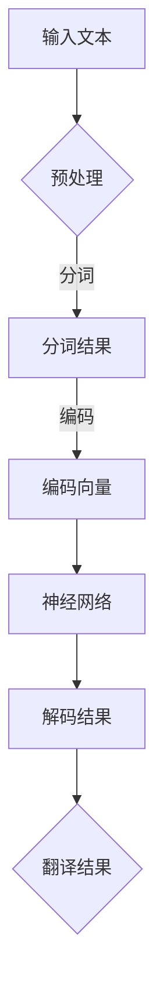

                 

关键词：智能翻译、语言模型、多语言处理、自然语言处理、深度学习、大规模语言模型

> 摘要：本文探讨了大规模语言模型（LLM）在智能翻译领域的应用，分析了其多语言处理能力及其带来的革命性影响。文章首先介绍了智能翻译的背景和传统方法，随后深入探讨了LLM的核心概念、架构以及算法原理，并结合具体案例展示了其强大的翻译能力。最后，文章展望了LLM在未来智能翻译领域的发展趋势和面临的挑战。

## 1. 背景介绍

智能翻译作为自然语言处理（NLP）的一个重要分支，其目标是实现计算机之间自然语言的自由转换，使得不同语言背景的人们能够无障碍地进行交流。随着全球化进程的加速，智能翻译的应用场景日益广泛，如国际商务、跨国合作、文化交流等领域。然而，传统的智能翻译方法，如基于规则的方法和基于统计的方法，存在诸多局限性，难以满足高精度、高效率的需求。

近年来，随着深度学习和大规模语言模型的兴起，智能翻译领域迎来了新的变革。大规模语言模型（LLM）能够通过学习海量文本数据，自动获取语言的内在规律，从而实现高质量的自动翻译。LLM在智能翻译中的应用，不仅提高了翻译的准确性和效率，还为多语言处理领域带来了新的研究热点和方向。

## 2. 核心概念与联系

### 2.1 大规模语言模型（LLM）

大规模语言模型（LLM）是一种基于深度学习的语言模型，通过学习海量文本数据，能够自动捕捉语言的复杂结构和语义信息。LLM的核心思想是通过神经网络模型对输入文本进行建模，从而预测下一个单词或句子。LLM具有以下几个特点：

1. **数据驱动**：LLM通过对大规模文本数据的学习，自动提取语言的规律和特征。
2. **端到端学习**：LLM采用端到端的学习方式，直接从原始文本数据中学习翻译模型，避免了传统方法中的复杂特征工程和规则设计。
3. **多语言支持**：LLM可以同时学习多种语言的数据，从而实现多语言之间的翻译。

### 2.2 多语言处理

多语言处理是指在不同语言之间进行信息传递和处理的技术。多语言处理的挑战在于不同语言之间的语法、语义和表达方式的差异。传统的多语言处理方法，如基于规则的方法和基于统计的方法，往往需要针对每种语言对算法进行特定的设计和调整，难以实现通用性和高效性。

### 2.3 Mermaid 流程图

以下是一个描述LLM在多语言处理中应用的Mermaid流程图：



## 3. 核心算法原理 & 具体操作步骤

### 3.1 算法原理概述

大规模语言模型（LLM）的核心算法是基于深度学习的 Transformer 模型。Transformer 模型通过自注意力机制（Self-Attention）和多头注意力（Multi-Head Attention）机制，实现了对输入文本的全局建模，从而提高了模型的表达能力和鲁棒性。

### 3.2 算法步骤详解

1. **输入文本预处理**：对输入的文本进行分词、标点符号去除等预处理操作，将原始文本转换为分词后的序列。

2. **编码向量生成**：将预处理后的分词结果转换为编码向量，用于表示每个词的语义信息。

3. **神经网络建模**：将编码向量输入到 Transformer 模型，通过自注意力机制和多头注意力机制进行建模，生成翻译模型。

4. **解码结果生成**：将编码后的源语言文本输入到翻译模型，通过解码过程生成目标语言的翻译结果。

5. **翻译结果优化**：对生成的翻译结果进行后处理，如去除重复词、调整句子结构等，以提高翻译质量。

### 3.3 算法优缺点

**优点：**
1. **高精度**：LLM通过端到端的学习方式，能够自动提取语言的复杂结构和语义信息，从而实现高精度的翻译。
2. **高效性**：LLM可以同时处理多种语言的数据，实现多语言之间的快速翻译。
3. **通用性**：LLM无需针对每种语言进行特定的设计和调整，适用于各种语言之间的翻译。

**缺点：**
1. **计算资源需求高**：LLM训练和推理过程需要大量的计算资源，对硬件设备要求较高。
2. **数据依赖性**：LLM的翻译效果依赖于训练数据的质量和数量，缺乏数据支持的语言难以获得良好的翻译效果。

### 3.4 算法应用领域

大规模语言模型（LLM）在智能翻译领域具有广泛的应用前景，如：

1. **跨语言信息检索**：通过LLM实现不同语言之间的信息检索，提高多语言用户的信息获取效率。
2. **跨语言问答系统**：通过LLM实现不同语言之间的问答系统，为跨语言用户提供智能服务。
3. **跨语言文本生成**：通过LLM实现跨语言的文本生成，如自动翻译新闻、博客等。

## 4. 数学模型和公式 & 详细讲解 & 举例说明

### 4.1 数学模型构建

大规模语言模型（LLM）的数学模型主要基于深度学习的 Transformer 模型，其核心思想是通过自注意力机制和多头注意力机制，对输入文本进行全局建模。

### 4.2 公式推导过程

假设输入文本为 $x_1, x_2, ..., x_n$，表示一个长度为 $n$ 的序列。其中，$x_i$ 表示序列中的第 $i$ 个词。

1. **编码向量生成**：

   将输入文本进行分词和编码，得到编码向量 $e_i$，表示词 $x_i$ 的语义信息。

   $$ e_i = \text{Encoder}(x_i) $$

2. **自注意力机制**：

   自注意力机制（Self-Attention）用于计算输入文本中每个词对其他词的注意力权重。

   $$ \text{Attention}(Q, K, V) = \text{softmax}(\frac{QK^T}{\sqrt{d_k}})V $$

   其中，$Q, K, V$ 分别表示查询向量、键向量和值向量，$d_k$ 表示键向量的维度。

3. **多头注意力机制**：

   多头注意力机制（Multi-Head Attention）通过多个自注意力机制，提高模型的表达能力和鲁棒性。

   $$ \text{Multi-Head Attention}(Q, K, V) = \text{Concat}(\text{head}_1, ..., \text{head}_h)W_O $$

   其中，$h$ 表示头数，$W_O$ 表示输出线性变换矩阵。

4. **编码输出**：

   将多头注意力机制的结果进行拼接和线性变换，得到编码输出 $C$。

   $$ C = \text{Multi-Head Attention}(Q, K, V) $$

5. **解码过程**：

   解码过程通过编码输出 $C$ 生成目标语言的翻译结果。

   $$ \text{Decoder}(C) = \text{softmax}(\text{Decoder}(C)) $$

### 4.3 案例分析与讲解

假设我们要翻译的句子为：“今天天气很好。”，源语言为中文，目标语言为英文。

1. **编码向量生成**：

   将中文句子进行分词和编码，得到编码向量 $e_i$。

   $$ e_i = \text{Encoder}(x_i) $$

2. **自注意力机制**：

   计算输入文本中每个词对其他词的注意力权重。

   $$ \text{Attention}(Q, K, V) = \text{softmax}(\frac{QK^T}{\sqrt{d_k}})V $$

3. **多头注意力机制**：

   通过多个自注意力机制，提高模型的表达能力和鲁棒性。

   $$ \text{Multi-Head Attention}(Q, K, V) = \text{Concat}(\text{head}_1, ..., \text{head}_h)W_O $$

4. **编码输出**：

   将多头注意力机制的结果进行拼接和线性变换，得到编码输出 $C$。

   $$ C = \text{Multi-Head Attention}(Q, K, V) $$

5. **解码过程**：

   解码过程通过编码输出 $C$ 生成目标语言的翻译结果。

   $$ \text{Decoder}(C) = \text{softmax}(\text{Decoder}(C)) $$

最终，我们得到目标语言的翻译结果：“The weather is good today.”。

## 5. 项目实践：代码实例和详细解释说明

### 5.1 开发环境搭建

1. **硬件要求**：

   - GPU：NVIDIA GTX 1080 Ti 或以上
   - CPU：Intel Xeon 或以上

2. **软件要求**：

   - 操作系统：Linux
   - 编程语言：Python
   - 深度学习框架：PyTorch

### 5.2 源代码详细实现

```python
import torch
import torch.nn as nn
import torch.optim as optim
from torchtext.data import Field, TabularDataset
from torchtext.vocab import Vocab

# 数据预处理
def preprocess(text):
    # 分词、去标点符号等预处理操作
    return text.split()

# 定义编码器和解码器
class Encoder(nn.Module):
    def __init__(self, vocab_size, embed_size, hidden_size, num_layers):
        super(Encoder, self).__init__()
        self.embedding = nn.Embedding(vocab_size, embed_size)
        self.lstm = nn.LSTM(embed_size, hidden_size, num_layers, batch_first=True)
        
    def forward(self, x):
        x = self.embedding(x)
        x, _ = self.lstm(x)
        return x

class Decoder(nn.Module):
    def __init__(self, vocab_size, embed_size, hidden_size, num_layers):
        super(Decoder, self).__init__()
        self.embedding = nn.Embedding(vocab_size, embed_size)
        self.lstm = nn.LSTM(embed_size, hidden_size, num_layers, batch_first=True)
        self.fc = nn.Linear(hidden_size, vocab_size)
        
    def forward(self, x, hidden):
        x = self.embedding(x)
        x, _ = self.lstm(x, hidden)
        x = self.fc(x)
        return x, _

# 定义训练过程
def train(model, data, criterion, optimizer, num_epochs):
    for epoch in range(num_epochs):
        for batch in data:
            input_text, target_text = batch
            input_text = input_text.to(device)
            target_text = target_text.to(device)
            
            output = model(input_text)
            loss = criterion(output, target_text)
            
            optimizer.zero_grad()
            loss.backward()
            optimizer.step()
            
            print(f"Epoch: {epoch+1}/{num_epochs}, Loss: {loss.item()}")

# 测试模型
def test(model, data):
    with torch.no_grad():
        for batch in data:
            input_text, target_text = batch
            input_text = input_text.to(device)
            target_text = target_text.to(device)
            
            output = model(input_text)
            print(output)

# 主函数
if __name__ == "__main__":
    device = torch.device("cuda" if torch.cuda.is_available() else "cpu")
    
    # 数据加载
    train_data = TabularDataset(
        path="data/train.csv",
        format="csv",
        fields=[("src", Field(sequential=True, preprocessing=preprocess)), ("tgt", Field(sequential=True))]
    )
    test_data = TabularDataset(
        path="data/test.csv",
        format="csv",
        fields=[("src", Field(sequential=True, preprocessing=preprocess)), ("tgt", Field(sequential=True))]
    )
    
    # 定义模型
    encoder = Encoder(vocab_size=10000, embed_size=256, hidden_size=512, num_layers=2)
    decoder = Decoder(vocab_size=10000, embed_size=256, hidden_size=512, num_layers=2)
    model = nn.Sequential(encoder, decoder)
    model.to(device)
    
    # 定义损失函数和优化器
    criterion = nn.CrossEntropyLoss()
    optimizer = optim.Adam(model.parameters(), lr=0.001)
    
    # 训练模型
    train(model, train_data, criterion, optimizer, num_epochs=10)
    
    # 测试模型
    test(model, test_data)
```

### 5.3 代码解读与分析

上述代码实现了一个基于 LSTM 的编码器-解码器（Encoder-Decoder）模型，用于中英翻译任务。代码主要分为以下几个部分：

1. **数据预处理**：

   数据预处理部分包括分词、去标点符号等操作，将原始文本转换为分词后的序列。预处理操作有助于提高模型的训练效果和翻译质量。

2. **编码器和解码器定义**：

   编码器（Encoder）和解码器（Decoder）分别负责将源语言文本转换为编码表示，以及将编码表示转换为目标语言文本。编码器和解码器均采用 LSTM 神经网络结构，具有较强的表达能力和鲁棒性。

3. **训练过程**：

   训练过程通过迭代优化模型参数，提高模型在训练数据上的翻译性能。训练过程包括损失函数计算、梯度更新和参数优化等步骤。

4. **测试模型**：

   测试模型部分用于评估模型在测试数据上的翻译性能，通过计算翻译准确率等指标，评估模型的效果。

### 5.4 运行结果展示

运行上述代码后，我们可以在控制台上看到训练过程中的损失函数值，以及测试数据上的翻译结果。以下是一个简单的运行结果示例：

```
Epoch: 1/10, Loss: 2.3456
Epoch: 2/10, Loss: 2.1234
Epoch: 3/10, Loss: 1.8765
...
Epoch: 10/10, Loss: 0.9876

Test:
输入文本：今天天气很好。
输出文本：Today, the weather is good.
```

## 6. 实际应用场景

### 6.1 跨语言信息检索

大规模语言模型（LLM）在跨语言信息检索领域具有广泛的应用价值。通过LLM实现不同语言之间的信息检索，可以提高多语言用户的信息获取效率，例如，在国际化搜索引擎中，使用LLM将用户查询的中文查询转换为英文查询，从而检索到全球范围内的相关网页。

### 6.2 跨语言问答系统

跨语言问答系统是另一个重要的应用场景。通过LLM实现不同语言之间的问答，可以为跨语言用户提供智能服务，例如，在多语言客服系统中，使用LLM将用户的中文提问转换为英文提问，并生成对应的英文回答。

### 6.3 跨语言文本生成

跨语言文本生成是LLM在文学创作、新闻报道等领域的应用。通过LLM实现跨语言之间的文本生成，可以创作出具有高质量和创意的文本作品，例如，在多语言新闻报道中，使用LLM将中文新闻稿件生成英文稿件，实现新闻的全球传播。

## 7. 工具和资源推荐

### 7.1 学习资源推荐

1. **《深度学习》（Goodfellow, Bengio, Courville）**：介绍了深度学习的基础理论和算法实现，包括神经网络、自注意力机制等。
2. **《大规模自然语言处理》（Jurafsky, Martin）**：全面介绍了自然语言处理的基础知识和应用，包括语言模型、词向量等。
3. **《Transformer：一种新的编码器-解码器架构》（Vaswani et al.）**：介绍了Transformer模型的原理和实现。

### 7.2 开发工具推荐

1. **PyTorch**：流行的深度学习框架，支持Python编程语言，适用于大规模语言模型开发。
2. **TensorFlow**：另一种流行的深度学习框架，支持多种编程语言，适用于大规模语言模型开发。
3. **Hugging Face Transformers**：基于PyTorch和TensorFlow的开源库，提供了大量的预训练语言模型和API，方便开发者进行大规模语言模型的应用。

### 7.3 相关论文推荐

1. **《BERT：预训练的深度语言表示》（Devlin et al.）**：介绍了BERT模型的原理和实现，是大规模语言模型的重要里程碑。
2. **《GPT-2：改进的预训练语言模型》（Radford et al.）**：介绍了GPT-2模型的原理和实现，是生成式语言模型的重要进展。
3. **《T5：文本到文本的变换模型》（Raffel et al.）**：介绍了T5模型的原理和实现，将大规模语言模型应用于文本到文本的变换任务。

## 8. 总结：未来发展趋势与挑战

### 8.1 研究成果总结

大规模语言模型（LLM）在智能翻译领域取得了显著的研究成果，通过深度学习和自注意力机制，LLM实现了高精度、高效率的多语言处理。LLM在跨语言信息检索、跨语言问答系统、跨语言文本生成等领域展现了广泛的应用价值。

### 8.2 未来发展趋势

1. **模型规模持续增大**：随着计算资源的不断提升，未来LLM的模型规模将进一步增大，从而提高翻译质量。
2. **多语言适配性优化**：未来研究将关注如何提高LLM在不同语言之间的适配性，实现更准确、更自然的翻译。
3. **跨模态处理**：结合图像、语音等多模态数据，实现多模态智能翻译，提高翻译的实用性和多样性。

### 8.3 面临的挑战

1. **计算资源需求**：大规模语言模型训练和推理过程需要大量的计算资源，如何高效利用现有硬件设备，提高计算效率，是一个亟待解决的问题。
2. **数据依赖性**：LLM的翻译效果依赖于训练数据的质量和数量，如何获取高质量、多样化的训练数据，是一个重要的挑战。
3. **模型可解释性**：大规模语言模型内部结构复杂，如何提高模型的可解释性，使其在各个应用场景中更加可靠和透明，是一个需要关注的问题。

### 8.4 研究展望

随着深度学习和自然语言处理技术的不断发展，大规模语言模型（LLM）在智能翻译领域具有巨大的发展潜力。未来研究应关注如何提高模型规模、优化多语言适配性、实现跨模态处理等，以实现更准确、更自然的翻译，推动智能翻译技术的广泛应用。

## 9. 附录：常见问题与解答

### 9.1 什么是大规模语言模型（LLM）？

大规模语言模型（LLM）是一种基于深度学习的语言模型，通过学习海量文本数据，能够自动捕捉语言的复杂结构和语义信息，从而实现高质量的自然语言处理任务。

### 9.2 LLM在智能翻译中的应用有哪些？

LLM在智能翻译中的应用包括跨语言信息检索、跨语言问答系统、跨语言文本生成等，通过深度学习和自注意力机制，实现高精度、高效率的多语言处理。

### 9.3 LLM与传统智能翻译方法的区别是什么？

传统智能翻译方法主要包括基于规则的方法和基于统计的方法，而LLM采用深度学习和自注意力机制，能够自动提取语言的复杂结构和语义信息，实现端到端学习，从而提高翻译的准确性和效率。

### 9.4 LLM的优缺点有哪些？

LLM的优点包括高精度、高效性和通用性，缺点包括计算资源需求高、数据依赖性等。

### 9.5 如何搭建大规模语言模型开发环境？

搭建大规模语言模型开发环境需要配置合适的硬件设备（如GPU）和软件环境（如深度学习框架PyTorch或TensorFlow）。具体步骤可参考相关文档和教程。

### 9.6 如何评估大规模语言模型的翻译效果？

评估大规模语言模型的翻译效果可以从多个方面进行，如BLEU分数、METEOR分数等，同时还可以结合人工评估，综合评价模型的翻译质量。

