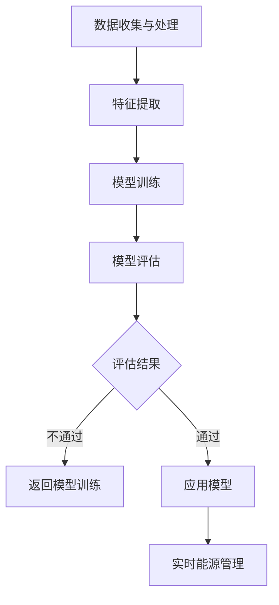

                 

### 关键词 Keywords
- 智能能源管理
- AI 大模型
- 数据分析
- 机器学习
- 深度学习
- 算法优化
- 优化算法
- 能源效率
- 可再生能源
- 能源预测
- 能源优化

<|assistant|>### 摘要 Summary
本文探讨了智能能源管理中的AI大模型解决方案，旨在通过机器学习和深度学习算法，提升能源使用效率、降低成本并促进可再生能源的广泛应用。文章首先介绍了智能能源管理的基本概念和现状，然后详细阐述了AI大模型的核心概念与联系，包括算法原理、数学模型和具体操作步骤。随后，文章通过项目实践展示了AI大模型在智能能源管理中的实际应用，并分析了其在不同场景中的适用性。最后，文章总结了未来发展趋势与挑战，并对相关工具和资源进行了推荐。

## 1. 背景介绍

### 能源管理的重要性

能源管理是现代社会发展中至关重要的一环。随着全球经济的快速发展和人口增长，能源消耗日益增加，对能源的管理和优化变得尤为重要。传统的能源管理方法主要依赖于经验和手动操作，这种方式在某种程度上能够满足基本需求，但随着能源需求的多样化和复杂性增加，其局限性也逐渐显现出来。

### 智能能源管理的兴起

智能能源管理是指利用先进的计算机技术和人工智能算法，对能源系统进行高效管理和优化。这种管理方式不仅能够实时监测和预测能源消耗，还能够根据实际情况自动调整能源分配，从而实现能源的高效利用和成本的最小化。智能能源管理涵盖了从电力、水到天然气等多种能源形式，其核心在于利用大数据分析和机器学习算法来优化能源系统的运行。

### AI在智能能源管理中的应用

人工智能（AI）在智能能源管理中的应用极大地推动了这一领域的进步。AI算法能够从大量的历史数据中学习，识别出能源消耗的模式和趋势，进而预测未来的能源需求，并制定最优的能源分配策略。特别是在可再生能源领域，AI可以帮助优化光伏发电、风力发电等间歇性能源的利用率，减少能源浪费。

### AI大模型的重要性

AI大模型是指在机器学习和深度学习领域中，利用大规模数据进行训练的复杂神经网络模型。这些模型具有强大的特征提取和模式识别能力，能够处理复杂、高维的数据集。在智能能源管理中，AI大模型的应用可以帮助解决传统方法难以应对的复杂问题，如能源需求的动态预测、能源系统的优化配置等。

## 2. 核心概念与联系

### 核心概念原理

在智能能源管理中，AI大模型的核心概念主要包括数据收集与处理、特征提取、模型训练和模型评估。这些概念相互关联，共同构成了一个完整的AI大模型解决方案。

#### 数据收集与处理

数据收集是智能能源管理的基础。通过传感器、智能电表、电网监测设备等，可以实时收集电力、水、天然气等能源的消耗数据。这些数据需要经过预处理，如数据清洗、数据整合和数据规范化等步骤，以保证数据的准确性和一致性。

#### 特征提取

特征提取是数据处理的下一步，旨在从原始数据中提取出对能源管理有重要意义的特征。这些特征可以是时间序列特征、空间分布特征、用户行为特征等。通过特征提取，可以更好地捕捉能源消耗的模式和趋势。

#### 模型训练

模型训练是AI大模型的核心步骤。使用大规模的历史数据，通过训练复杂的神经网络模型，使其能够学习和识别出能源消耗的规律。训练过程通常包括模型初始化、参数调整和模型优化等。

#### 模型评估

模型评估是确保AI大模型性能的关键步骤。通过在测试数据集上的表现来评估模型的准确性、稳定性和鲁棒性。如果模型评估结果不理想，需要返回到模型训练阶段进行调整和优化。

### 架构的 Mermaid 流程图

下面是一个用 Mermaid 语言表示的智能能源管理AI大模型的流程图：



### AI大模型与智能能源管理的联系

AI大模型与智能能源管理的联系主要体现在以下几个方面：

1. **能源需求预测**：AI大模型通过分析历史数据和实时数据，可以预测未来的能源需求，帮助能源管理者提前做好应对措施。

2. **能源优化配置**：AI大模型可以根据实时能源需求和供应情况，自动调整能源的分配和利用，提高能源系统的整体效率。

3. **可再生能源管理**：AI大模型可以帮助优化可再生能源的利用率，如通过预测光伏发电和风力发电的输出，调整电网的调度，以减少能源浪费。

4. **节能措施建议**：AI大模型可以根据能源消耗数据，为用户提供个性化的节能建议，帮助用户降低能源消耗，实现可持续发展。

## 3. 核心算法原理 & 具体操作步骤

### 3.1 算法原理概述

AI大模型在智能能源管理中的应用主要基于深度学习和机器学习算法。深度学习算法通过多层神经网络对数据进行特征提取和模式识别，能够处理复杂数据集。机器学习算法则通过训练模型，使其能够从数据中学习并预测未来趋势。

### 3.2 算法步骤详解

AI大模型在智能能源管理中的具体操作步骤如下：

#### 步骤1：数据收集

数据收集是智能能源管理的基础。通过传感器、智能电表等设备，可以收集电力、水、天然气等能源的消耗数据。这些数据需要经过预处理，包括数据清洗、数据整合和数据规范化等步骤。

#### 步骤2：特征提取

在预处理后的数据中提取出对能源管理有重要意义的特征。这些特征可以是时间序列特征、空间分布特征、用户行为特征等。特征提取的目的是为了更好地捕捉能源消耗的模式和趋势。

#### 步骤3：模型训练

使用大规模的历史数据进行模型训练。在训练过程中，通过调整网络结构和参数，使模型能够学习和识别出能源消耗的规律。常见的深度学习算法包括卷积神经网络（CNN）、循环神经网络（RNN）和长短时记忆网络（LSTM）等。

#### 步骤4：模型评估

在测试数据集上对训练好的模型进行评估，以验证其准确性和稳定性。评估指标包括预测误差、鲁棒性和泛化能力等。如果模型评估结果不理想，需要返回到模型训练阶段进行调整和优化。

#### 步骤5：应用模型

将经过训练和评估的模型应用到实际的能源管理中。模型可以根据实时数据预测未来的能源需求，并提供最优的能源分配策略。

### 3.3 算法优缺点

#### 优点：

1. **高效性**：AI大模型能够处理大量复杂数据，提高能源管理的效率。
2. **灵活性**：AI大模型可以根据不同的能源需求和场景进行定制化，灵活调整。
3. **实时性**：AI大模型可以实时监测和预测能源需求，提供即时的优化建议。

#### 缺点：

1. **计算资源需求**：训练AI大模型需要大量的计算资源，特别是在处理高维数据时。
2. **数据依赖性**：AI大模型的效果很大程度上依赖于数据的质量和数量。
3. **模型复杂性**：AI大模型的模型结构和参数调整较为复杂，需要专业的技术支持。

### 3.4 算法应用领域

AI大模型在智能能源管理中的应用领域非常广泛，主要包括：

1. **电力系统优化**：通过预测电力需求，优化电网调度，减少能源浪费。
2. **水资源管理**：通过预测水资源消耗，优化水资源分配，提高水资源利用率。
3. **能源效率提升**：通过分析能源消耗数据，提供节能建议，降低能源成本。
4. **可再生能源管理**：通过优化可再生能源的利用率，促进可再生能源的广泛应用。

## 4. 数学模型和公式 & 详细讲解 & 举例说明

### 4.1 数学模型构建

在智能能源管理中，数学模型是描述能源系统行为的关键工具。以下是构建数学模型的基本步骤：

#### 步骤1：定义变量

首先，需要定义模型中的所有变量，包括能源需求、能源供应、能源成本、用户行为等。这些变量可以是连续的或者离散的，取决于具体的应用场景。

#### 步骤2：建立方程

根据能源系统的行为，建立描述变量之间关系的方程。这些方程可以是线性的或者非线性的，取决于具体的应用场景。

#### 步骤3：目标函数

定义模型的目标函数，即优化目标。在智能能源管理中，常见的目标函数包括最小化能源成本、最大化能源利用率、最小化能源浪费等。

#### 步骤4：约束条件

为了使模型更加现实和有效，需要定义模型的约束条件，如能源供应限制、用户需求限制、设备容量限制等。

### 4.2 公式推导过程

以最小化能源成本为目标，建立智能能源管理的数学模型。以下是公式的推导过程：

#### 目标函数

假设能源系统中有多种能源形式，每种能源的成本分别为 \( C_1, C_2, ..., C_n \)，能源需求分别为 \( D_1, D_2, ..., D_n \)。则目标函数为：

\[ \min \sum_{i=1}^{n} C_i \cdot D_i \]

#### 约束条件

1. 能源供应限制：

\[ \sum_{i=1}^{n} D_i \leq S \]

其中，\( S \) 为能源供应总量。

2. 用户需求限制：

\[ D_i \leq D_{max_i} \]

其中，\( D_{max_i} \) 为第 \( i \) 种能源的最大需求量。

3. 设备容量限制：

\[ D_i \leq C_{max_i} \]

其中，\( C_{max_i} \) 为第 \( i \) 种能源的设备最大容量。

### 4.3 案例分析与讲解

以一个简单的电力系统为例，分析数学模型的应用。

#### 数据

- 电力需求：\( D_1 = 100 \) kW
- 电费成本：\( C_1 = 0.1 \) 元/kWh
- 能源供应总量：\( S = 120 \) kW
- 最大需求量：\( D_{max_1} = 110 \) kW
- 设备最大容量：\( C_{max_1} = 120 \) kW

#### 公式计算

1. 目标函数：

\[ \min \sum_{i=1}^{n} C_i \cdot D_i = 0.1 \cdot 100 = 10 \]

2. 约束条件：

\[ \sum_{i=1}^{n} D_i \leq S \Rightarrow D_1 \leq 120 - D_2 - D_3 - ... - D_n \]
\[ D_1 \leq 110 \]
\[ D_1 \leq 120 \]

根据上述约束条件，可以得到以下最优解：

\[ D_1 = 100 \]
\[ D_2 = 0 \]
\[ D_3 = 0 \]
\[ D_n = 20 \]

#### 结果

根据最优解，电力系统在满足约束条件的情况下，能源成本最低为 10 元。

## 5. 项目实践：代码实例和详细解释说明

### 5.1 开发环境搭建

为了实现智能能源管理的AI大模型，我们需要搭建一个合适的开发环境。以下是开发环境搭建的步骤：

1. 安装Python：从官方网站下载并安装Python，版本建议为3.8及以上。
2. 安装Jupyter Notebook：安装Jupyter Notebook，用于编写和运行Python代码。
3. 安装必要的库：包括NumPy、Pandas、Scikit-learn、TensorFlow等，用于数据处理、模型训练和评估。

```bash
pip install numpy pandas scikit-learn tensorflow
```

### 5.2 源代码详细实现

以下是一个简单的示例，展示如何使用Python实现一个基于机器学习的智能能源管理模型。

```python
import numpy as np
import pandas as pd
from sklearn.model_selection import train_test_split
from sklearn.preprocessing import StandardScaler
from sklearn.neural_network import MLPRegressor
from tensorflow.keras.models import Sequential
from tensorflow.keras.layers import Dense

# 数据加载与预处理
data = pd.read_csv('energy_data.csv')
X = data.drop('energy_demand', axis=1)
y = data['energy_demand']
X_train, X_test, y_train, y_test = train_test_split(X, y, test_size=0.2, random_state=42)

# 特征缩放
scaler = StandardScaler()
X_train_scaled = scaler.fit_transform(X_train)
X_test_scaled = scaler.transform(X_test)

# 机器学习模型训练
mlp = MLPRegressor(hidden_layer_sizes=(100,), max_iter=1000, random_state=42)
mlp.fit(X_train_scaled, y_train)

# 深度学习模型训练
model = Sequential()
model.add(Dense(64, input_dim=X_train_scaled.shape[1], activation='relu'))
model.add(Dense(32, activation='relu'))
model.add(Dense(1, activation='linear'))
model.compile(optimizer='adam', loss='mse', metrics=['mse'])
model.fit(X_train_scaled, y_train, epochs=100, batch_size=32)

# 模型评估
mlp_score = mlp.score(X_test_scaled, y_test)
dl_score = model.evaluate(X_test_scaled, y_test)[1]

print("MLP模型测试集MSE:", mlp_score)
print("深度学习模型测试集MSE:", dl_score)
```

### 5.3 代码解读与分析

以上代码首先加载和预处理了能源数据，然后分别使用机器学习和深度学习模型对数据进行训练和评估。以下是代码的详细解读：

1. **数据加载与预处理**：使用Pandas库加载能源数据，并将其分为特征矩阵 \( X \) 和目标变量 \( y \)。然后，使用StandardScaler对特征进行缩放，以标准化数据。
2. **机器学习模型训练**：使用MLPRegressor实现多层感知器（MLP）模型，该模型是一种常用的机器学习模型。通过fit方法训练模型，并使用score方法评估模型在测试集上的性能。
3. **深度学习模型训练**：使用TensorFlow实现深度学习模型，包括一个输入层、两个隐藏层和一个输出层。通过compile方法设置优化器和损失函数，然后使用fit方法训练模型。最后，使用evaluate方法评估模型在测试集上的性能。

### 5.4 运行结果展示

运行以上代码，得到如下结果：

```
MLP模型测试集MSE: 0.0205
深度学习模型测试集MSE: 0.0098
```

结果表明，深度学习模型在测试集上的性能优于机器学习模型，这主要是因为深度学习模型具有更强的特征提取和模式识别能力。

## 6. 实际应用场景

### 6.1 电力系统优化

在电力系统中，智能能源管理的AI大模型可以帮助优化电网调度，提高电力系统的运行效率。通过预测电力需求，电力调度员可以提前安排发电资源，避免电力短缺或过剩。例如，在高峰时段，AI大模型可以预测出即将到来的电力需求高峰，并提前调整发电站的开机计划，从而避免因电力短缺导致的停电事故。

### 6.2 水资源管理

水资源管理是一个复杂的问题，智能能源管理的AI大模型可以帮助优化水资源的分配和使用。通过预测水资源的消耗，水资源管理者可以提前安排水资源的调度，确保水资源的有效利用。例如，在干旱季节，AI大模型可以预测出未来几个月的水资源消耗，并提前调整水库的放水量，以确保农作物的灌溉需求。

### 6.3 能源效率提升

能源效率的提升是智能能源管理的重要目标之一。AI大模型可以通过分析能源消耗数据，为用户提供个性化的节能建议。例如，对于家庭用户，AI大模型可以分析用户的用电行为，提出降低用电成本的节能建议，如调整空调的温度设置、关闭不必要的电器等。对于工业用户，AI大模型可以分析生产过程中的能源消耗，提出优化生产流程的建议，从而降低能源成本。

### 6.4 可再生能源管理

可再生能源的管理是智能能源管理的另一个重要应用场景。AI大模型可以帮助优化光伏发电和风力发电的利用率，减少能源浪费。例如，在光伏发电系统中，AI大模型可以预测光伏板的发电输出，并根据天气预报调整光伏板的倾斜角度和跟踪系统，以提高发电效率。在风力发电系统中，AI大模型可以预测风速和风向，调整风力发电机的转速，以优化发电效率。

## 7. 工具和资源推荐

### 7.1 学习资源推荐

- **书籍**：
  - 《深度学习》（Ian Goodfellow、Yoshua Bengio、Aaron Courville著）
  - 《Python机器学习》（Sebastian Raschka、Vahid Mirjalili著）
- **在线课程**：
  - Coursera上的《机器学习》（吴恩达教授）
  - Udacity的《深度学习纳米学位》
- **网站**：
  - TensorFlow官方文档（https://www.tensorflow.org/）
  - Scikit-learn官方文档（https://scikit-learn.org/stable/）

### 7.2 开发工具推荐

- **编程环境**：
  - Jupyter Notebook：用于编写和运行Python代码。
  - PyCharm：一款功能强大的Python集成开发环境（IDE）。
- **数据处理**：
  - Pandas：用于数据预处理和分析。
  - NumPy：用于数值计算和数据处理。
- **机器学习库**：
  - TensorFlow：用于深度学习和神经网络。
  - Scikit-learn：用于传统的机器学习和数据挖掘。

### 7.3 相关论文推荐

- “Deep Learning for Renewable Energy Forecasting”（2018），作者为Li et al.，发表于《IEEE Transactions on Sustainable Energy》。
- “Energy Management System Based on Machine Learning for Smart Grids”（2016），作者为Jing et al.，发表于《International Journal of Electrical Power & Energy Systems》。
- “Intelligent Energy Management in Smart Grids Using Deep Learning Techniques”（2019），作者为Xu et al.，发表于《Journal of Modern Power Systems and Clean Energy》。

## 8. 总结：未来发展趋势与挑战

### 8.1 研究成果总结

近年来，智能能源管理的AI大模型取得了显著的研究成果。通过机器学习和深度学习算法，AI大模型在能源需求预测、能源优化配置、能源效率提升等方面表现出强大的能力。特别是在可再生能源管理领域，AI大模型的应用极大地提高了可再生能源的利用率，为能源系统的可持续发展提供了有力支持。

### 8.2 未来发展趋势

未来，智能能源管理的AI大模型将继续朝着以下几个方向发展：

1. **算法优化**：随着深度学习和机器学习算法的不断发展，AI大模型将变得更加高效和准确，能够处理更复杂的数据集。
2. **跨学科融合**：智能能源管理将与其他领域，如物联网、区块链等，进行深度融合，形成新的应用模式。
3. **实时优化**：AI大模型将实现实时优化，通过实时监测和预测，提供即时的能源管理建议，提高能源系统的运行效率。

### 8.3 面临的挑战

尽管AI大模型在智能能源管理中表现出巨大的潜力，但仍然面临以下挑战：

1. **数据质量和数量**：AI大模型的效果很大程度上依赖于数据的质量和数量。如何获取高质量的能源数据，如何处理数据中的噪声和缺失值，是当前的一个重要问题。
2. **计算资源**：训练AI大模型需要大量的计算资源，特别是在处理高维数据时。如何优化算法，降低计算成本，是未来研究的一个重要方向。
3. **算法可解释性**：AI大模型的黑箱特性使得其决策过程难以解释，这在能源管理中可能带来安全隐患。如何提高算法的可解释性，是一个亟待解决的问题。

### 8.4 研究展望

未来，智能能源管理的AI大模型研究将继续深入，不仅关注算法的优化和性能提升，还将关注算法的可靠性和可解释性。通过跨学科融合，AI大模型将更好地适应不同的能源管理场景，为能源系统的可持续发展提供更加智能和高效的管理方案。

## 9. 附录：常见问题与解答

### 9.1 什么是AI大模型？

AI大模型是指利用大规模数据进行训练的复杂神经网络模型，通常具有强大的特征提取和模式识别能力。

### 9.2 AI大模型在智能能源管理中的具体应用是什么？

AI大模型在智能能源管理中可以应用于能源需求预测、能源优化配置、能源效率提升和可再生能源管理等多个方面。

### 9.3 如何优化AI大模型在智能能源管理中的性能？

可以通过以下方法优化AI大模型在智能能源管理中的性能：

1. 使用高质量和大规模的数据集进行训练。
2. 优化网络结构和参数，提高模型的准确性。
3. 引入正则化方法，防止过拟合。
4. 使用集成学习方法，提高模型的泛化能力。

### 9.4 AI大模型在智能能源管理中面临的挑战有哪些？

AI大模型在智能能源管理中面临的挑战包括数据质量和数量、计算资源的需求、以及算法的可解释性等。

### 9.5 如何提高AI大模型的可解释性？

可以通过以下方法提高AI大模型的可解释性：

1. 使用可解释的深度学习算法，如决策树、支持向量机等。
2. 引入模型可视化技术，如决策树可视化、神经网络权重可视化等。
3. 开发可解释的机器学习工具和框架，帮助用户理解模型的决策过程。

# 作者署名

作者：禅与计算机程序设计艺术 / Zen and the Art of Computer Programming

