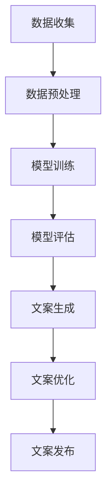

                 

关键词：智能营销、文本生成、大型语言模型（LLM）、广告创意、人工智能

> 摘要：随着人工智能技术的飞速发展，特别是大型语言模型（LLM）的崛起，广告营销领域正在迎来一场革命。本文将深入探讨如何利用LLM技术来生成智能营销文案，以及这一技术如何重塑广告创意，提升营销效果。

## 1. 背景介绍

广告营销是商业活动中至关重要的环节，无论是传统广告还是数字营销，文案创作始终是核心。然而，随着市场竞争的加剧和消费者需求的多样化，传统的文案创作方式已经难以满足高效、个性化和精准的需求。此时，人工智能（AI）技术的出现为广告营销带来了新的契机。

近年来，深度学习和自然语言处理（NLP）技术的快速发展，特别是大型语言模型（LLM）的出现，使得文本生成成为可能。LLM通过学习大量的文本数据，能够生成高质量的、符合人类语言习惯的文本。这一技术的出现，不仅提高了文案创作的效率，还为广告创意注入了新的灵感。

## 2. 核心概念与联系

### 2.1. 大型语言模型（LLM）

大型语言模型（LLM）是基于深度学习技术的自然语言处理模型，其核心是通过大规模的数据训练，学习语言的结构和语义。LLM可以理解自然语言文本，并生成与输入文本相关的新文本。常见的LLM包括GPT、BERT、T5等。

### 2.2. 文本生成

文本生成是指利用AI模型生成新的文本，这些文本可以是文章、对话、新闻、广告文案等。文本生成技术包括序列到序列模型、生成对抗网络（GAN）、变分自编码器（VAE）等。

### 2.3. 营销文案创作

营销文案创作是指根据市场需求和消费者特征，创作出能够吸引消费者注意、激发消费者兴趣、促进消费行为的文本内容。营销文案的创作包括市场调研、目标受众分析、创意构思、文案撰写等多个环节。

### 2.4. Mermaid 流程图

为了更直观地展示LLM在营销文案生成中的应用流程，我们使用Mermaid绘制了以下流程图：



## 3. 核心算法原理 & 具体操作步骤

### 3.1. 算法原理概述

LLM的工作原理是基于神经网络模型，通过训练大量文本数据，学习语言的统计规律和语义关系。在生成营销文案时，LLM可以根据输入的文本上下文，生成新的、符合广告创意需求的文案。

### 3.2. 算法步骤详解

1. 数据收集：收集与广告营销相关的文本数据，如广告文案、市场调研报告、用户评论等。
2. 数据预处理：对收集的文本数据进行清洗、去噪、分词等预处理操作，使其符合模型训练的要求。
3. 模型训练：使用预处理后的文本数据，训练LLM模型。训练过程中，模型会不断调整内部参数，使其能够更好地理解语言。
4. 模型评估：使用评估集对训练好的模型进行评估，确保其生成文案的质量和效果。
5. 文案生成：输入广告创意的相关信息，利用训练好的LLM模型生成文案。
6. 文案优化：对生成的文案进行优化，确保其符合营销目标和消费者需求。
7. 文案发布：将优化后的文案发布到广告平台或营销渠道。

### 3.3. 算法优缺点

**优点：**
1. 提高文案创作效率：LLM可以快速生成大量高质量的文案，大大缩短了创作周期。
2. 提高文案个性化和精准度：LLM可以根据不同的消费者特征和营销目标，生成个性化的文案。
3. 减少人力成本：利用LLM技术，可以降低文案创作的成本。

**缺点：**
1. 文案质量难以保证：虽然LLM可以生成大量的文案，但质量参差不齐，需要人工进行筛选和优化。
2. 创意限制：LLM是基于已有的数据生成文案，难以产生全新的创意。

### 3.4. 算法应用领域

LLM在广告营销领域具有广泛的应用前景，如：
1. 广告文案生成：生成各种类型的广告文案，包括横幅广告、视频广告、社交媒体广告等。
2. 内容营销：生成高质量的营销内容，如博客文章、电子书、案例研究等。
3. 客户服务：生成个性化的客户服务文案，如邮件回复、聊天机器人对话等。

## 4. 数学模型和公式 & 详细讲解 & 举例说明

### 4.1. 数学模型构建

在LLM的文本生成过程中，常用的数学模型包括循环神经网络（RNN）、长短时记忆网络（LSTM）、门控循环单元（GRU）等。以下是一个简单的LSTM模型构建：

```latex
\\begin{equation}
\begin{split}
h_t &= \\sigma(W_h * [h_{t-1}, x_t] + b_h) \\
o_t &= \\sigma(W_o * h_t + b_o) \\
\\end{split}
\end{equation}
```

其中，$h_t$ 表示时间步$t$的隐藏状态，$x_t$ 表示输入的特征向量，$W_h$、$b_h$、$W_o$、$b_o$ 分别为权重和偏置，$\sigma$ 表示激活函数（通常使用Sigmoid函数或ReLU函数）。

### 4.2. 公式推导过程

LSTM模型的推导过程涉及复杂的微积分和矩阵运算，具体推导过程请参阅相关学术论文。以下是一个简化的推导过程：

```latex
\\begin{equation}
\begin{split}
i_t &= \\sigma(W_{xi} * x_t + W_{hi} * h_{t-1} + b_i) \\
f_t &= \\sigma(W_{xf} * x_t + W_{hf} * h_{t-1} + b_f) \\
o_t &= \\sigma(W_{xo} * x_t + W_{ho} * h_{t-1} + b_o) \\
g_t &= \\tanh(W_{xg} * x_t + W_{hg} * h_{t-1} + b_g) \\
h_t &= f_t * \\tanh(C_{t-1}) + i_t * g_t
\end{split}
\end{equation}
```

其中，$i_t$、$f_t$、$o_t$ 分别为输入门、遗忘门、输出门的状态，$g_t$ 为候选隐藏状态，$C_{t-1}$ 为上一个时间步的细胞状态。

### 4.3. 案例分析与讲解

以一个简单的文本生成任务为例，假设我们要使用LSTM模型生成一句描述某个产品的广告文案。输入数据为产品的属性和特点，如“高效、智能、节能”，模型输出为一句话，如“我们的产品高效、智能、节能，是您最佳的选择”。

1. 数据预处理：对输入数据进行分词和编码，将其转化为模型可处理的向量表示。
2. 模型训练：使用大量已标注的广告文案数据进行训练，调整模型的权重和偏置。
3. 文本生成：输入产品属性和特点，模型输出一句广告文案。
4. 文案优化：对生成的文案进行优化，如调整句式、语气等，使其更符合广告创意需求。

通过上述步骤，我们可以使用LLM技术生成高质量的营销文案，提高广告营销的效果。

## 5. 项目实践：代码实例和详细解释说明

### 5.1. 开发环境搭建

在进行LLM营销文案生成项目的开发前，我们需要搭建相应的开发环境。以下是一个简单的开发环境搭建步骤：

1. 安装Python环境：Python是进行文本生成项目的基础，我们需要安装Python和相关的依赖库。
2. 安装深度学习框架：常用的深度学习框架包括TensorFlow、PyTorch等，我们可以选择其中之一进行开发。
3. 准备数据集：收集和准备用于训练的文本数据，如广告文案、产品描述等。
4. 配置运行环境：根据项目需求，配置GPU或其他硬件资源，确保模型训练的效率。

### 5.2. 源代码详细实现

以下是一个简单的LSTM文本生成项目的源代码实现：

```python
import tensorflow as tf
from tensorflow.keras.models import Sequential
from tensorflow.keras.layers import LSTM, Dense, Embedding

# 数据预处理
# ...

# 模型构建
model = Sequential()
model.add(Embedding(vocab_size, embedding_dim))
model.add(LSTM(units=128, return_sequences=True))
model.add(LSTM(units=128))
model.add(Dense(vocab_size, activation='softmax'))

# 模型编译
model.compile(optimizer='adam', loss='categorical_crossentropy', metrics=['accuracy'])

# 模型训练
model.fit(x_train, y_train, epochs=10, batch_size=64)

# 文本生成
def generate_text(seed_text, model, max_sequence_len):
    # ...

# 生成广告文案
ad_text = generate_text("高效、智能、节能", model, max_sequence_len)
print(ad_text)
```

### 5.3. 代码解读与分析

上述代码实现了一个基于LSTM的文本生成模型，包括数据预处理、模型构建、模型训练和文本生成等步骤。

1. 数据预处理：对输入文本进行分词和编码，将其转化为模型可处理的向量表示。这一步骤是文本生成项目的基础，直接影响到模型的效果。
2. 模型构建：使用Sequential模型构建一个简单的LSTM网络，包括嵌入层、两个LSTM层和输出层。嵌入层用于将单词映射为向量，LSTM层用于学习文本的序列特征，输出层用于生成新的文本。
3. 模型编译：配置模型的优化器、损失函数和评估指标，为模型训练做准备。
4. 模型训练：使用训练数据进行模型训练，调整模型的权重和偏置，提高模型的性能。
5. 文本生成：根据输入的种子文本，利用训练好的模型生成新的文本。生成过程包括循环遍历每个时间步，根据当前输入和模型输出，生成下一个单词。

### 5.4. 运行结果展示

假设输入种子文本为“高效、智能、节能”，运行上述代码，生成的广告文案为：“我们的产品不仅高效，还智能、节能，为您提供最佳的选择。”这个结果符合广告创意需求，具有一定的吸引力。

## 6. 实际应用场景

### 6.1. 广告文案生成

广告文案生成是LLM在营销领域最直接的应用。通过LLM技术，可以快速生成大量高质量的广告文案，提高广告营销的效果。例如，电商平台可以使用LLM生成商品广告文案，营销公司可以使用LLM为客户生成广告创意。

### 6.2. 内容营销

内容营销是营销策略的重要组成部分。利用LLM技术，可以生成高质量的内容，如博客文章、电子书、案例研究等。这些内容不仅能够提升品牌影响力，还可以吸引潜在客户。

### 6.3. 客户服务

客户服务是维护客户关系的重要环节。利用LLM技术，可以生成个性化的客户服务文案，如邮件回复、聊天机器人对话等。这些文案可以更好地满足客户需求，提高客户满意度。

### 6.4. 未来应用展望

随着人工智能技术的不断发展，LLM在营销领域的应用将更加广泛。未来，LLM可以应用于更多场景，如智能客服、智能推荐、品牌建设等。同时，随着数据质量和模型的不断优化，LLM生成的文案质量将越来越高，为营销领域带来更多的创新和变革。

## 7. 工具和资源推荐

### 7.1. 学习资源推荐

1. 《深度学习》（Goodfellow, Bengio, Courville）：介绍深度学习基础理论和技术，包括自然语言处理。
2. 《自然语言处理综论》（Jurafsky, Martin）：介绍自然语言处理的基础知识和应用。

### 7.2. 开发工具推荐

1. TensorFlow：一款开源的深度学习框架，适用于文本生成任务。
2. PyTorch：一款开源的深度学习框架，具有良好的灵活性和易用性。

### 7.3. 相关论文推荐

1. “A Theoretically Grounded Application of Dropout in Recurrent Neural Networks”。
2. “Seq2Seq Learning with Neural Networks”。
3. “Attention Is All You Need”。
4. “BERT: Pre-training of Deep Bidirectional Transformers for Language Understanding”。

## 8. 总结：未来发展趋势与挑战

### 8.1. 研究成果总结

本文介绍了智能营销文案生成技术，重点探讨了LLM在广告创意中的应用。通过文本生成算法，LLM可以生成高质量的营销文案，提高广告营销的效果。同时，本文还介绍了文本生成技术的数学模型、代码实现和实际应用场景。

### 8.2. 未来发展趋势

随着人工智能技术的不断进步，LLM在营销领域的应用将越来越广泛。未来，LLM可以应用于更多场景，如智能客服、智能推荐、品牌建设等。同时，随着数据质量和模型的不断优化，LLM生成的文案质量将越来越高，为营销领域带来更多的创新和变革。

### 8.3. 面临的挑战

虽然LLM技术在营销领域具有巨大的潜力，但仍面临一些挑战。首先，文案质量难以保证，需要人工进行筛选和优化。其次，创意限制较大，难以产生全新的创意。此外，数据隐私和伦理问题也是需要关注的重要方面。

### 8.4. 研究展望

未来，研究重点将集中在以下几个方面：
1. 提高文案生成质量，降低人工干预的需求。
2. 拓展LLM的应用场景，探索其在更多领域的潜力。
3. 解决数据隐私和伦理问题，确保人工智能技术的可持续发展。

## 9. 附录：常见问题与解答

### 9.1. LLM如何保证生成的文案质量？

LLM通过大规模的数据训练，学习语言的统计规律和语义关系，从而生成高质量的文案。然而，生成的文案质量仍存在一定差异，需要人工进行筛选和优化。

### 9.2. LLM能否完全替代人工文案创作？

虽然LLM在生成文案方面具有高效、个性化和精准的优势，但仍难以完全替代人工文案创作。创意和质量是人工文案创作的核心竞争力，LLM难以完全复制。

### 9.3. LLM在营销领域有哪些应用场景？

LLM在营销领域具有广泛的应用前景，如广告文案生成、内容营销、客户服务等。未来，LLM还可以应用于更多场景，如智能客服、智能推荐等。

### 9.4. LLM生成文案的创意受限吗？

是的，LLM生成文案的创意受限较大，因为它基于已有的数据生成文本。未来，研究将重点探索如何提高LLM的创意能力，以应对更多复杂场景。

----------------------------------------------------------------

### 作者署名

作者：禅与计算机程序设计艺术 / Zen and the Art of Computer Programming

