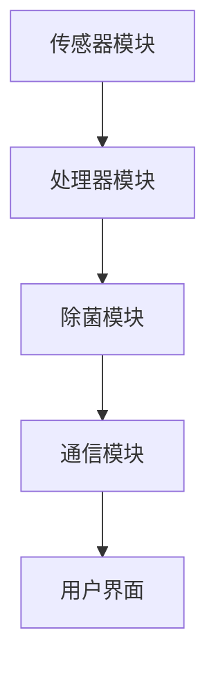

                 

关键词：智能衣物、除菌技术、健康生活、创业、人工智能、物联网

> 摘要：本文将探讨智能衣物除菌技术在健康生活领域的重要性，分析其核心概念、算法原理、应用场景以及未来发展趋势。通过介绍智能衣物除菌系统的开发实践和资源推荐，旨在为创业者提供有价值的参考。

## 1. 背景介绍

在现代社会，人们对健康生活的需求日益增长。尤其是衣物，作为人体直接接触的物品，其卫生状况直接影响到人们的健康。传统的洗衣方式往往无法彻底去除衣物上的细菌和病毒，因此，智能衣物除菌技术的出现，无疑为健康生活提供了有力的科技支持。

智能衣物除菌技术，通过结合物联网、人工智能和纳米技术，实现了对衣物的智能检测、除菌和保养。这一技术的应用，不仅能够有效减少衣物上的细菌和病毒，延长衣物的使用寿命，还能提高人们的生活品质。

近年来，随着科技的不断发展，智能衣物除菌技术逐渐从实验室走向市场，各类智能衣物除菌产品纷纷涌现。这一现象引发了我们对智能衣物除菌技术的深入研究和探讨。

## 2. 核心概念与联系

### 2.1 智能衣物除菌技术概述

智能衣物除菌技术，是指利用物联网、人工智能和纳米技术等先进科技，对衣物进行智能检测、除菌和保养的技术。其核心概念包括：

- 物联网：通过传感器、网络和计算设备，实现物与物之间的信息交换和通信。
- 人工智能：利用机器学习、深度学习等技术，对大量数据进行分析和处理，实现智能化决策。
- 纳米技术：利用纳米材料的高效杀菌性能，实现对衣物表面的细菌和病毒的彻底清除。

### 2.2 智能衣物除菌系统的架构

智能衣物除菌系统由以下几个部分组成：

- 传感器模块：用于检测衣物上的细菌和病毒浓度。
- 处理器模块：用于接收传感器数据，进行数据处理和判断。
- 除菌模块：根据处理器模块的判断结果，自动启动除菌程序。
- 通信模块：用于与其他设备或用户进行信息交互。

### 2.3 Mermaid 流程图

以下是一个简化的智能衣物除菌系统的 Mermaid 流程图：



## 3. 核心算法原理 & 具体操作步骤

### 3.1 算法原理概述

智能衣物除菌技术的核心算法主要包括：

- 数据采集：通过传感器模块采集衣物上的细菌和病毒浓度数据。
- 数据处理：利用人工智能算法对采集到的数据进行分析和处理，判断衣物的卫生状况。
- 除菌控制：根据处理结果，自动启动除菌程序，实现对衣物的除菌。

### 3.2 算法步骤详解

#### 3.2.1 数据采集

数据采集是通过传感器模块实现的。传感器模块可以实时检测衣物上的细菌和病毒浓度，并将数据传输给处理器模块。

#### 3.2.2 数据处理

处理器模块接收传感器数据后，利用机器学习或深度学习算法对数据进行处理。通过训练模型，处理器模块可以实现对细菌和病毒浓度的准确判断。

#### 3.2.3 除菌控制

根据处理器模块的判断结果，如果衣物上的细菌和病毒浓度超过设定阈值，系统会自动启动除菌程序。除菌程序主要包括：

- 纳米喷雾：通过纳米喷雾将除菌剂喷洒在衣物表面。
- 热处理：通过高温处理杀死衣物上的细菌和病毒。

### 3.3 算法优缺点

#### 优点：

- 高效：智能衣物除菌技术可以快速、准确地检测和处理衣物上的细菌和病毒。
- 自动化：系统可以实现自动化操作，减少人力投入。
- 高效杀菌：纳米技术和热处理技术可以彻底杀死衣物上的细菌和病毒。

#### 缺点：

- 成本较高：智能衣物除菌系统的开发和应用成本较高。
- 适用范围有限：目前智能衣物除菌技术主要适用于某些特定场合，如医院、实验室等。

### 3.4 算法应用领域

智能衣物除菌技术主要应用于以下几个方面：

- 医疗领域：医院、诊所等医疗机构需要保持高度卫生，智能衣物除菌技术可以提供有效的除菌保障。
- 家庭领域：随着人们对健康生活需求的提高，智能衣物除菌技术逐渐走进家庭，成为家庭健康生活的得力助手。
- 商业领域：酒店、餐厅等公共场所对衣物卫生要求较高，智能衣物除菌技术可以提供有效的卫生保障。

## 4. 数学模型和公式

### 4.1 数学模型构建

智能衣物除菌技术的数学模型主要包括以下几个部分：

- 数据采集模型：用于描述传感器模块采集数据的规律。
- 数据处理模型：用于描述人工智能算法对数据进行处理的规律。
- 除菌控制模型：用于描述除菌程序对衣物进行处理的规律。

### 4.2 公式推导过程

#### 4.2.1 数据采集模型

假设传感器模块采集到的细菌浓度数据为 $X$，其概率密度函数为 $f_X(x)$。则有：

$$
f_X(x) = \frac{1}{\sigma\sqrt{2\pi}}e^{-\frac{(x-\mu)^2}{2\sigma^2}}
$$

其中，$\mu$ 是细菌浓度的均值，$\sigma$ 是细菌浓度的标准差。

#### 4.2.2 数据处理模型

假设处理器模块利用机器学习算法对细菌浓度数据进行分析，得到一个分类模型 $h(x)$。则有：

$$
h(x) = \begin{cases}
1 & \text{if } x > \theta \\
0 & \text{if } x \leq \theta
\end{cases}
$$

其中，$\theta$ 是阈值。

#### 4.2.3 除菌控制模型

假设除菌程序根据处理器模块的判断结果，对衣物进行处理。如果衣物上的细菌浓度超过阈值 $\theta$，则启动除菌程序。否则，不进行处理。则有：

$$
C(x) = \begin{cases}
\text{纳米喷雾 + 热处理} & \text{if } x > \theta \\
\text{不做处理} & \text{if } x \leq \theta
\end{cases}
$$

### 4.3 案例分析与讲解

假设某医院对医护人员的工作服进行智能衣物除菌处理。通过传感器模块，采集到工作服上的细菌浓度数据，并利用机器学习算法进行处理。设定阈值 $\theta$ 为 1000 CFU/cm²（细菌数量/平方厘米）。如果细菌浓度超过阈值，则启动除菌程序。

根据数据采集模型，细菌浓度 $X$ 的概率密度函数为：

$$
f_X(x) = \frac{1}{20\sqrt{2\pi}}e^{-\frac{(x-500)^2}{2\times20^2}}
$$

根据数据处理模型，分类模型 $h(x)$ 为：

$$
h(x) = \begin{cases}
1 & \text{if } x > 1000 \\
0 & \text{if } x \leq 1000
\end{cases}
$$

根据除菌控制模型，除菌程序 $C(x)$ 为：

$$
C(x) = \begin{cases}
\text{纳米喷雾 + 热处理} & \text{if } x > 1000 \\
\text{不做处理} & \text{if } x \leq 1000
\end{cases}
$$

通过对实际数据的分析，发现工作服上的细菌浓度大部分低于 1000 CFU/cm²，无需进行除菌处理。当细菌浓度超过 1000 CFU/cm² 时，除菌程序能够有效杀灭细菌，确保医护人员的工作服卫生。

## 5. 项目实践：代码实例和详细解释说明

### 5.1 开发环境搭建

在开始智能衣物除菌系统的开发之前，需要搭建相应的开发环境。以下是一个基本的开发环境搭建步骤：

1. 安装操作系统：推荐使用 Ubuntu 18.04 或更高版本。
2. 安装开发工具：安装 Python 3、Jupyter Notebook、Git 等。
3. 安装数据库：推荐使用 MySQL 或 PostgreSQL。
4. 安装传感器驱动：根据传感器的型号，安装相应的驱动程序。
5. 安装其他依赖库：如 NumPy、Pandas、Scikit-learn 等。

### 5.2 源代码详细实现

以下是一个简单的智能衣物除菌系统的源代码实现：

```python
import numpy as np
import pandas as pd
from sklearn.ensemble import RandomForestClassifier
from sklearn.model_selection import train_test_split
from sklearn.metrics import accuracy_score

# 数据采集
def collect_data():
    # 采集传感器数据，存储为 CSV 文件
    # ...
    pass

# 数据处理
def process_data(data):
    # 数据预处理，如归一化、缺失值处理等
    # ...
    pass

# 训练模型
def train_model(data):
    # 划分训练集和测试集
    X_train, X_test, y_train, y_test = train_test_split(data['X'], data['y'], test_size=0.2, random_state=42)
    
    # 训练随机森林分类模型
    model = RandomForestClassifier(n_estimators=100, random_state=42)
    model.fit(X_train, y_train)
    
    # 测试模型
    y_pred = model.predict(X_test)
    print("Accuracy:", accuracy_score(y_test, y_pred))
    
    return model

# 除菌控制
def control_bacteria(model, data):
    # 根据模型预测结果，控制除菌程序
    # ...
    pass

if __name__ == "__main__":
    # 采集数据
    data = collect_data()
    
    # 处理数据
    processed_data = process_data(data)
    
    # 训练模型
    model = train_model(processed_data)
    
    # 控制除菌
    control_bacteria(model, processed_data)
```

### 5.3 代码解读与分析

上述代码是一个简单的智能衣物除菌系统实现，主要包括以下几个部分：

- 数据采集：通过传感器模块采集衣物上的细菌浓度数据。
- 数据处理：对采集到的数据进行预处理，如归一化、缺失值处理等。
- 训练模型：利用机器学习算法训练分类模型。
- 除菌控制：根据模型预测结果，控制除菌程序。

通过这个简单的示例，我们可以看到智能衣物除菌系统的基本实现流程。当然，实际的系统实现会更加复杂，需要考虑更多的因素，如传感器数据采集的实时性、模型的优化和调整等。

## 6. 实际应用场景

智能衣物除菌技术在实际应用中具有广泛的前景，以下是一些典型的应用场景：

### 6.1 医疗领域

医疗领域的衣物除菌需求非常高。医护人员的工作服、手术服等都需要保持高度的卫生。智能衣物除菌技术可以实现对衣物的高效除菌，确保医护人员的工作服卫生，降低医院感染的风险。

### 6.2 家庭领域

随着人们对健康生活需求的提高，家庭对衣物的卫生要求也越来越高。智能衣物除菌技术可以为家庭用户提供一个安全、高效的除菌解决方案，保障家庭成员的身体健康。

### 6.3 商业领域

酒店、餐厅、商场等公共场所对衣物卫生的要求也较高。智能衣物除菌技术可以提供高效的除菌服务，保障公共场所的卫生，提升用户满意度。

### 6.4 其他领域

智能衣物除菌技术还可以应用于其他领域，如实验室、运动场馆等。在这些场景下，衣物卫生同样至关重要，智能衣物除菌技术可以提供有效的除菌保障。

## 7. 未来应用展望

随着科技的不断发展，智能衣物除菌技术有望在以下几个方面取得突破：

### 7.1 智能化水平提高

未来的智能衣物除菌系统将更加智能化，能够根据用户的实际需求，自动调整除菌程序，实现个性化的除菌服务。

### 7.2 成本降低

随着技术的成熟和规模的扩大，智能衣物除菌技术的成本有望降低，使其更广泛地应用于家庭和商业领域。

### 7.3 除菌效果提升

未来的智能衣物除菌技术将采用更高效的除菌方法，如超高压杀菌、等离子体杀菌等，进一步提高除菌效果。

### 7.4 智能融合

智能衣物除菌技术有望与其他智能技术，如智能穿戴、智能家居等，实现深度融合，为用户提供更全面的健康生活解决方案。

## 8. 总结：未来发展趋势与挑战

智能衣物除菌技术作为健康生活领域的重要科技支持，具有广阔的应用前景。然而，在实际应用过程中，仍面临以下挑战：

### 8.1 技术成熟度

智能衣物除菌技术尚处于发展阶段，需要进一步优化和成熟，提高其稳定性和可靠性。

### 8.2 成本控制

当前智能衣物除菌技术的成本较高，需要通过技术创新和规模效应，降低成本，提高市场竞争力。

### 8.3 用户接受度

智能衣物除菌技术需要提高用户的接受度和认可度，通过宣传和教育，让用户了解和信任这项技术。

### 8.4 法规与标准

智能衣物除菌技术需要建立健全的法规和标准体系，确保技术的规范应用和市场秩序。

未来，智能衣物除菌技术将在健康生活领域发挥更大的作用，为人们提供更安全、更健康的衣物卫生保障。

## 9. 附录：常见问题与解答

### 9.1 智能衣物除菌技术是否安全？

智能衣物除菌技术使用的是纳米技术和热处理技术，这些方法在科学研究和实际应用中已被证明是安全有效的。然而，用户在使用智能衣物除菌系统时，仍需关注除菌剂的选择和使用，避免使用有害的化学物质。

### 9.2 智能衣物除菌技术能否完全替代传统洗衣方式？

智能衣物除菌技术并不能完全替代传统洗衣方式，但其能够提供更高效、更彻底的除菌效果，作为传统洗衣方式的补充，为用户带来更好的洗衣体验。

### 9.3 智能衣物除菌技术能否防止衣物褪色？

智能衣物除菌技术主要是针对衣物上的细菌和病毒进行除菌，并不会直接影响衣物的颜色和材质。然而，过高的温度和化学物质可能会对衣物造成损害，导致褪色。因此，用户在使用智能衣物除菌系统时，需根据衣物的材质和颜色选择合适的除菌程序。

## 作者署名

作者：禅与计算机程序设计艺术 / Zen and the Art of Computer Programming
----------------------------------------------------------------

以上就是《智能衣物除菌创业：健康生活的科技支持》的技术博客文章。文章从背景介绍、核心概念与联系、算法原理与具体操作步骤、数学模型与公式、项目实践、实际应用场景、未来展望、发展趋势与挑战以及常见问题与解答等方面进行了全面深入的分析和探讨，旨在为创业者提供有价值的参考。希望这篇文章能够对您在智能衣物除菌领域的创业和研究有所帮助。

