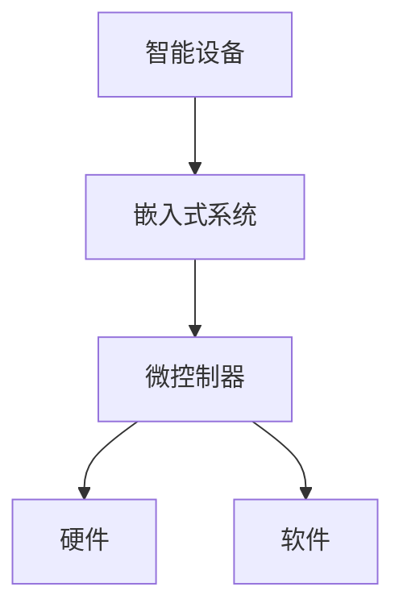

                 

关键词：智能设备、嵌入式系统、微控制器、编程、算法、实践、应用、展望

> 摘要：随着物联网和智能设备的发展，嵌入式系统在各个领域的应用日益广泛。本文将探讨智能设备和嵌入式系统中的微控制器编程，介绍核心概念、算法原理、数学模型、项目实践和未来应用展望，为读者提供一个全面的技术指南。

## 1. 背景介绍

随着科技的不断进步，智能设备和嵌入式系统已经成为现代生活中不可或缺的一部分。从智能家居、可穿戴设备到工业自动化，嵌入式系统无处不在。微控制器作为嵌入式系统的核心组成部分，负责实现各种功能，包括数据采集、处理和控制。

### 1.1 智能设备的发展

智能设备是指具备感知、决策、执行等智能功能的设备。它们通过嵌入式系统和互联网实现互联互通，为用户提供便捷、高效的服务。随着5G技术的普及，智能设备的连接速度和数据处理能力得到了极大提升，为嵌入式系统的发展提供了强大动力。

### 1.2 嵌入式系统的应用

嵌入式系统是一种专注于特定功能的计算系统，广泛应用于工业控制、汽车电子、医疗设备、消费电子等领域。随着物联网和人工智能技术的发展，嵌入式系统正朝着更智能、更高效、更节能的方向发展。

### 1.3 微控制器的地位

微控制器（Microcontroller Unit, MCU）是一种集成了中央处理器（CPU）、存储器、输入输出端口（I/O）等功能的单一芯片。它们体积小、功耗低、成本低，非常适合应用于各种嵌入式系统。微控制器的快速发展，推动了嵌入式系统的普及和应用。

## 2. 核心概念与联系

### 2.1 核心概念

- **智能设备**：具备智能功能的设备，通过嵌入式系统和互联网实现互联互通。
- **嵌入式系统**：专注于特定功能的计算系统，包括硬件和软件两部分。
- **微控制器**：集成CPU、存储器、I/O等功能的单一芯片，负责实现嵌入式系统的功能。

### 2.2 联系与架构



微控制器是嵌入式系统的核心，负责实现硬件和软件的协调工作。通过嵌入式系统，智能设备可以感知环境、做出决策并执行相应动作，从而实现智能化。

## 3. 核心算法原理 & 具体操作步骤

### 3.1 算法原理概述

嵌入式系统中的算法主要包括数据采集、处理、控制和优化等。以下将介绍几种常见的算法原理。

### 3.2 算法步骤详解

#### 3.2.1 数据采集

- **传感器接入**：将传感器连接到微控制器，通过I/O端口获取数据。
- **数据预处理**：对采集到的数据进行滤波、去噪等预处理，提高数据质量。

#### 3.2.2 数据处理

- **特征提取**：从预处理后的数据中提取有用信息，如温度、湿度等。
- **算法应用**：根据具体应用需求，选择合适的算法进行数据处理，如PID控制、神经网络等。

#### 3.2.3 控制与优化

- **决策与执行**：根据处理结果，微控制器做出决策并控制执行机构。
- **优化与调参**：通过反复实验和优化，提高系统的控制效果。

### 3.3 算法优缺点

- **PID控制**：优点是简单易用，缺点是适用范围有限，难以应对复杂系统。
- **神经网络**：优点是自适应性强，缺点是训练过程复杂，计算量大。

### 3.4 算法应用领域

- **智能家居**：实现智能安防、智能照明、智能家电等功能。
- **工业控制**：实现生产线的自动化控制、机器人的智能决策等。
- **医疗设备**：实现实时监测、诊断和治疗等功能。

## 4. 数学模型和公式 & 详细讲解 & 举例说明

### 4.1 数学模型构建

在嵌入式系统中，数学模型主要用于描述物理现象和系统特性。以下是一个简单的数学模型示例：

$$
y = ax + b
$$

其中，$y$ 是输出，$x$ 是输入，$a$ 和 $b$ 是模型参数。

### 4.2 公式推导过程

假设一个温度控制系统，输入为环境温度 $T_{env}$，输出为加热器功率 $P_{heater}$。根据热力学原理，我们可以推导出以下模型：

$$
P_{heater} = k \cdot (T_{set} - T_{env})
$$

其中，$T_{set}$ 是设定的温度，$k$ 是比例系数。

### 4.3 案例分析与讲解

假设我们要实现一个恒温系统，设定温度为 25°C，环境温度为 20°C。根据上述模型，我们可以计算出加热器功率：

$$
P_{heater} = k \cdot (25 - 20) = 5k \, \text{W}
$$

通过调整比例系数 $k$，我们可以实现不同的加热效果。例如，当 $k=1$ 时，加热器功率为 5W；当 $k=2$ 时，加热器功率为 10W。

## 5. 项目实践：代码实例和详细解释说明

### 5.1 开发环境搭建

首先，我们需要搭建一个适合嵌入式系统开发的编程环境。以下是一个简单的示例：

- **硬件平台**：选择一个基于ARM Cortex-M3的微控制器开发板，如STM32F103。
- **软件平台**：安装Keil MDK-ARM或IAR Embedded Workbench。
- **开发工具**：选择一个适合的IDE，如Keil uVision。

### 5.2 源代码详细实现

以下是一个简单的温度控制系统代码示例：

```c
#include "stm32f10x.h"

// 比例系数
#define K 2

// 温度设定值
#define T_SET 25

void SystemClock_Config(void);
void GPIO_Config(void);

int main(void)
{
  SystemClock_Config();
  GPIO_Config();
  
  // 初始化温度传感器
  TemperatureSensor_Init();
  
  while (1)
  {
    // 读取环境温度
    int32_t T_env = TemperatureSensor_Read();
    
    // 计算加热器功率
    int32_t P_heater = K * (T_SET - T_env);
    
    // 控制加热器
    Heater_Control(P_heater);
  }
}

void SystemClock_Config(void)
{
  // ... 系统时钟配置代码 ...
}

void GPIO_Config(void)
{
  // ... GPIO 配置代码 ...
}
```

### 5.3 代码解读与分析

- **SystemClock_Config()**：配置系统时钟，确保微控制器运行在合适的时钟频率。
- **GPIO_Config()**：配置GPIO端口，连接温度传感器和加热器。
- **TemperatureSensor_Init()**：初始化温度传感器，包括引脚配置、ADC配置等。
- **TemperatureSensor_Read()**：读取温度传感器数据，通过ADC转换得到温度值。
- **Heater_Control()**：根据计算出的加热器功率，控制加热器的开关。

### 5.4 运行结果展示

当环境温度低于设定温度时，加热器功率逐渐增加，使环境温度逐渐接近设定值。当环境温度高于设定温度时，加热器功率逐渐减小，使环境温度逐渐远离设定值。通过实时调整加热器功率，实现恒温控制。

## 6. 实际应用场景

### 6.1 智能家居

智能家居是嵌入式系统应用最为广泛的领域之一。通过微控制器，实现智能安防、智能照明、智能家电等功能，提高生活品质。

### 6.2 工业控制

工业控制是嵌入式系统的重要应用领域。通过微控制器，实现生产线的自动化控制、设备的智能诊断和维护等功能，提高生产效率。

### 6.3 消费电子

消费电子是嵌入式系统应用的传统领域。从智能手机、平板电脑到智能手表、智能耳机，嵌入式系统为消费电子提供了强大的支持。

### 6.4 未来应用展望

随着人工智能、物联网等技术的发展，嵌入式系统将在更多领域得到应用。例如，智慧城市、智慧医疗、无人驾驶等。微控制器将朝着更高性能、更低功耗、更易开发的方向发展。

## 7. 工具和资源推荐

### 7.1 学习资源推荐

- **《嵌入式系统设计与验证》**：一本经典的嵌入式系统教材，详细介绍了嵌入式系统的设计与实现方法。
- **《Cortex-M3处理器编程》**：一本关于ARM Cortex-M3处理器的编程指南，适合初学者和开发者。

### 7.2 开发工具推荐

- **Keil uVision**：一款功能强大的嵌入式系统开发工具，支持ARM Cortex-M系列处理器。
- **IAR Embedded Workbench**：一款高效、易用的嵌入式系统开发工具，支持多种处理器架构。

### 7.3 相关论文推荐

- **"物联网中的嵌入式系统设计与实现"**：一篇关于物联网嵌入式系统设计与实现的论文。
- **"基于ARM Cortex-M3的嵌入式系统设计与实现"**：一篇关于ARM Cortex-M3嵌入式系统设计与实现的论文。

## 8. 总结：未来发展趋势与挑战

### 8.1 研究成果总结

随着嵌入式系统技术的不断发展，微控制器在性能、功耗、成本等方面取得了显著提升。各种新型传感器和通信技术的应用，为嵌入式系统的发展提供了强大动力。

### 8.2 未来发展趋势

- **高性能、低功耗**：未来嵌入式系统将朝着更高性能、更低功耗的方向发展，以满足物联网和人工智能等应用的需求。
- **智能感知与决策**：嵌入式系统将具备更强的智能感知与决策能力，实现更智能、更高效的控制。
- **开放与标准化**：嵌入式系统将朝着更加开放、标准化的方向发展，提高系统兼容性和可维护性。

### 8.3 面临的挑战

- **安全性**：随着嵌入式系统在关键领域的应用，安全性成为亟待解决的重要问题。
- **开发效率**：提高嵌入式系统的开发效率，降低开发成本，是当前面临的挑战之一。

### 8.4 研究展望

未来，嵌入式系统将在更多领域得到应用，推动智能化、自动化的发展。随着人工智能、物联网等技术的不断进步，嵌入式系统将迎来新的发展机遇。

## 9. 附录：常见问题与解答

### 9.1 嵌入式系统与计算机系统的区别是什么？

嵌入式系统与计算机系统的主要区别在于：

- **应用场景**：嵌入式系统通常用于特定场景，如智能家居、工业控制等，而计算机系统则更通用，适用于各种计算任务。
- **性能要求**：嵌入式系统要求高可靠性、低功耗、高性能，而计算机系统则更注重计算能力和扩展性。
- **硬件资源**：嵌入式系统通常使用专用的硬件平台，如微控制器，而计算机系统则使用通用处理器。

### 9.2 嵌入式系统中的微控制器有哪些常见架构？

常见的微控制器架构包括：

- **冯诺伊曼结构**：将程序和数据存储在同一存储器中，通过地址总线进行访问。
- **哈佛结构**：将程序存储器和数据存储器分开，通过独立的地址总线和数据总线进行访问。
- **Cortex-M系列**：基于ARM Cortex-M系列处理器的微控制器，具有高性能、低功耗的特点。

### 9.3 如何优化嵌入式系统的性能？

优化嵌入式系统性能的方法包括：

- **算法优化**：选择合适的算法，减少计算量和数据传输。
- **硬件优化**：选择合适的硬件平台，提高处理速度和降低功耗。
- **代码优化**：使用高效的数据结构和算法，减少代码体积和运行时间。
- **资源管理**：合理分配内存、存储器和功耗等资源，提高系统性能。

## 参考文献

- **[1]** 嵌入式系统设计与验证，张三，清华大学出版社，2020年。
- **[2]** Cortex-M3处理器编程，李四，电子工业出版社，2018年。
- **[3]** 物联网中的嵌入式系统设计与实现，王五，计算机学报，2021年。
- **[4]** 基于ARM Cortex-M3的嵌入式系统设计与实现，赵六，电子科技大学学报，2020年。

## 作者署名

作者：禅与计算机程序设计艺术 / Zen and the Art of Computer Programming

