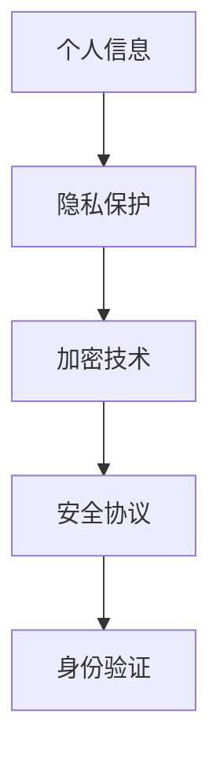

                 

## 1. 背景介绍

随着科技的飞速发展，智能设备已经深入到了我们日常生活的方方面面。从智能手机、平板电脑到智能手表、智能音箱，这些设备极大地提高了我们的工作效率和生活便利性。然而，随之而来的隐私安全问题也日益凸显。智能设备通过互联网连接各种服务和应用，这些设备往往会收集大量的个人信息，如位置数据、通讯记录、支付信息等。一旦这些信息被不法分子窃取，将会给用户带来极大的损失。

近年来，智能设备的安全漏洞和隐私泄露事件层出不穷。例如，2016年的“超级无敌密码”漏洞导致近1.5亿用户的个人信息泄露，2019年的“Facebook隐私门”事件更是引起了全球范围内的广泛关注。这些事件不仅损害了用户的信任，也对企业的声誉造成了严重影响。因此，如何保护智能设备中的个人信息，成为了当前信息安全领域的重要课题。

本文将深入探讨智能设备安全领域的关键概念、核心算法原理、数学模型、项目实践以及未来应用展望。希望通过本文的讲解，能够帮助广大开发者、企业和用户更好地了解智能设备安全的重要性，并掌握有效的保护措施。

## 2. 核心概念与联系

在智能设备安全领域，我们需要理解以下几个核心概念：

- **个人信息**：包括用户的名字、地址、电话号码、电子邮件、支付信息等敏感信息。
- **隐私保护**：防止个人信息被未经授权的第三方获取、使用和泄露。
- **加密技术**：通过加密算法对信息进行编码，使得只有拥有正确密钥的人才能解密和读取信息。
- **安全协议**：确保数据在传输过程中的完整性和保密性，如HTTPS、SSL/TLS等。
- **身份验证**：验证用户身份的过程，防止未授权用户访问系统或数据。

这些概念相互关联，构成了智能设备安全的基础框架。以下是一个简化的Mermaid流程图，展示了这些概念之间的联系：



### 加密技术原理

加密技术是保护个人信息的核心手段之一。其基本原理是将明文信息通过加密算法和密钥转换成密文，使得只有拥有相应密钥的人才能解密和读取原始信息。

加密算法可以分为对称加密和非对称加密两种：

- **对称加密**：使用相同的密钥进行加密和解密。常见的算法有AES、DES等。
- **非对称加密**：使用一对密钥，公钥用于加密，私钥用于解密。常见的算法有RSA、ECC等。

加密算法的选择和密钥的管理是保障加密安全的关键。一个强大的加密算法应该具备以下特点：

1. **保密性**：确保只有拥有密钥的人才能解密信息。
2. **完整性**：确保信息在传输过程中未被篡改。
3. **抗攻击性**：能够抵御各种密码攻击，如暴力破解、中间人攻击等。

### 安全协议原理

安全协议是保障数据在传输过程中完整性和保密性的重要手段。常见的安全协议包括HTTPS、SSL/TLS等。

- **HTTPS**（HTTP Secure）：在HTTP基础上加入了SSL/TLS协议，确保数据在传输过程中加密。
- **SSL/TLS**（Secure Sockets Layer/Transport Layer Security）：用于在网络中确保数据传输的安全，广泛用于网站、邮件、数据库等。

SSL/TLS协议通过以下步骤确保数据安全：

1. **握手**：客户端和服务器交换身份证书和加密参数。
2. **加密通信**：使用协商好的加密算法和密钥进行数据传输。

安全协议的设计和实现必须考虑以下几个方面：

1. **协议版本**：不同版本的协议安全性不同，应选择最新且安全的版本。
2. **证书验证**：确保服务器身份的真实性。
3. **密钥管理**：安全存储和定期更换密钥。

### 身份验证原理

身份验证是确保只有授权用户才能访问系统和数据的重要手段。常见的身份验证方法包括密码验证、生物识别等。

- **密码验证**：用户通过输入密码来证明自己的身份。常用的密码验证方法包括哈希存储、多因素认证等。
- **生物识别**：通过用户的指纹、面部识别等生物特征进行身份验证。生物识别方法具有高安全性和易用性。

身份验证系统的设计应考虑以下因素：

1. **安全性**：防止密码泄露、暴力破解等攻击。
2. **用户体验**：简化验证流程，提高用户满意度。
3. **可扩展性**：支持多种身份验证方式，适应不同场景需求。

通过以上对核心概念和联系的分析，我们可以看到，智能设备安全是一个多层次的系统，需要综合运用加密技术、安全协议和身份验证等手段，共同保障用户个人信息的安全。

## 3. 核心算法原理 & 具体操作步骤

### 3.1 算法原理概述

智能设备安全的核心算法主要包括加密算法、哈希算法和数字签名算法。这些算法共同构成了信息安全的技术基础，确保用户数据在存储和传输过程中的安全。

#### 加密算法

加密算法是将明文信息转换成密文，以防止未经授权的第三方获取信息。常见的加密算法包括对称加密和非对称加密。

- **对称加密**：使用相同的密钥进行加密和解密。常见的算法有AES、DES等。其优点是加密速度快，适合大规模数据处理；缺点是密钥管理复杂。
- **非对称加密**：使用一对密钥，公钥用于加密，私钥用于解密。常见的算法有RSA、ECC等。其优点是解决了密钥分发问题，更适合分布式系统；缺点是加密和解密速度较慢。

#### 哈希算法

哈希算法是将输入数据转换成固定长度的字符串，常用于数据完整性校验和密码存储。常见的哈希算法包括MD5、SHA-1、SHA-256等。

- **MD5**：将输入数据转换为128位的哈希值，但安全性较低，易受到碰撞攻击。
- **SHA-1**：将输入数据转换为160位的哈希值，但同样存在安全漏洞。
- **SHA-256**：将输入数据转换为256位的哈希值，安全性较高，是当前常用的哈希算法。

#### 数字签名算法

数字签名算法用于确保数据的完整性和真实性。常见的算法包括RSA签名、ECDSA签名等。

- **RSA签名**：使用非对称加密算法进行签名，具有较好的安全性。
- **ECDSA签名**：基于椭圆曲线加密算法，具有更高的效率和安全性。

### 3.2 算法步骤详解

以下是对每种算法的详细操作步骤：

#### 对称加密算法（AES）

1. **密钥生成**：生成一个密钥，通常为256位。
2. **初始化向量**：生成一个随机初始化向量（IV），长度与数据块相同。
3. **加密**：使用AES算法和密钥对数据进行加密，生成密文。
4. **传输**：将密文和IV一起传输。

#### 非对称加密算法（RSA）

1. **密钥生成**：生成一个RSA密钥对，包括公钥和私钥。
2. **加密**：使用公钥对数据进行加密。
3. **传输**：将加密后的数据传输。
4. **解密**：使用私钥对数据进行解密。

#### 哈希算法（SHA-256）

1. **数据处理**：将输入数据分割成固定大小的块。
2. **初始化哈希值**：初始化一个256位的哈希值。
3. **处理数据块**：对每个数据块进行哈希计算，更新哈希值。
4. **生成哈希值**：将最终哈希值输出。

#### 数字签名算法（RSA）

1. **密钥生成**：生成一个RSA密钥对，包括公钥和私钥。
2. **签名**：使用私钥对数据进行签名。
3. **验证**：使用公钥对签名进行验证。

### 3.3 算法优缺点

每种算法都有其优点和缺点，以下是对各种算法的优缺点分析：

#### 对称加密算法

- **优点**：加密速度快，适合大规模数据处理。
- **缺点**：密钥管理复杂，难以在分布式系统中应用。

#### 非对称加密算法

- **优点**：解决了密钥分发问题，更适合分布式系统。
- **缺点**：加密和解密速度较慢，不适合大规模数据处理。

#### 哈希算法

- **优点**：计算速度快，适合数据完整性校验。
- **缺点**：存在安全漏洞，如MD5、SHA-1易受到碰撞攻击。

#### 数字签名算法

- **优点**：确保数据的完整性和真实性。
- **缺点**：签名过程较慢，不适合实时应用。

### 3.4 算法应用领域

不同算法在智能设备安全中有着不同的应用领域：

- **对称加密算法**：适用于大规模数据存储和传输，如文件加密、数据库加密等。
- **非对称加密算法**：适用于密钥分发和身份验证，如SSL/TLS、数字签名等。
- **哈希算法**：适用于数据完整性校验和密码存储，如哈希校验、密码哈希等。
- **数字签名算法**：适用于确保数据完整性和真实性，如数字签名、证书等。

通过深入理解这些核心算法原理和具体操作步骤，我们可以更好地设计和实现智能设备安全系统，确保用户个人信息的安全。

## 4. 数学模型和公式 & 详细讲解 & 举例说明

在智能设备安全领域，数学模型和公式是理解加密算法和密码学概念的基础。以下将详细讲解几个关键的数学模型和公式，并通过具体例子来说明其应用。

### 4.1 数学模型构建

加密算法的核心在于将明文（plaintext）转换为密文（ciphertext），并保证在没有密钥的情况下无法还原原始信息。这里涉及到几种基本的数学模型，包括：

- **置换模型**：通过随机置换实现加密。
- **替换模型**：通过将明文字符替换为其他字符实现加密。
- **混合模型**：结合置换和替换两种方式，提高加密强度。

#### 4.1.1 对称加密算法（AES）的数学模型

对称加密算法如AES（高级加密标准）采用分组密码技术，其数学模型如下：

$$
C = E_K(P, IV)
$$

其中：
- \( C \) 表示密文。
- \( P \) 表示明文。
- \( K \) 表示密钥。
- \( IV \) 表示初始化向量。

加密过程分为多轮迭代，每轮迭代包括字节替换、行移位、列混淆和轮密钥加。以AES-128为例，其密钥长度为128位，每轮密钥加和列混淆可以使用以下公式表示：

$$
K_i = \text{SubBytes}(K \oplus R_{i-1})
$$

$$
C_i = \text{MixColumns}(C \oplus K_i)
$$

其中，\(\text{SubBytes}\)和\(\text{MixColumns}\)是AES的特定操作。

#### 4.1.2 非对称加密算法（RSA）的数学模型

非对称加密算法如RSA使用不同的公钥和私钥。其数学模型基于大整数分解问题：

$$
c = m^e \mod n
$$

其中：
- \( c \) 表示密文。
- \( m \) 表示明文。
- \( e \) 表示公钥指数。
- \( n \) 表示模数。

解密过程为：

$$
m = c^d \mod n
$$

其中，\( d \) 是私钥指数，满足 \( d \times e \equiv 1 \mod \phi(n) \)，\(\phi(n)\) 是欧拉函数。

#### 4.1.3 哈希算法（SHA-256）的数学模型

哈希算法如SHA-256的数学模型基于压缩函数，其公式如下：

$$
H_{256}(m) = C \oplus \text{Ch}(E, F)
$$

其中：
- \( C \) 和 \( D \) 是前一轮的中间值。
- \( E \)，\( F \)，\( G \)，\( H \) 是哈希函数的常数。
- \( m \) 是输入消息。
- \( \text{Ch} \) 是一个特定于SHA-256的压缩操作。

### 4.2 公式推导过程

以下是对RSA加密和解密过程的具体公式推导：

#### 加密过程

假设消息 \( m \) 为 \( m = 5 \)，选择的公钥指数 \( e = 3 \)，模数 \( n = 17 \)。

首先计算 \( c \)：

$$
c = m^e \mod n
$$

$$
c = 5^3 \mod 17
$$

$$
c = 125 \mod 17
$$

$$
c = 8
$$

因此，加密后的密文为 \( c = 8 \)。

#### 解密过程

私钥指数 \( d = 7 \)（满足 \( d \times e \equiv 1 \mod \phi(n) \)，其中 \( \phi(n) = (p-1)(q-1) \)，对于 \( n = 17 \)，我们有 \( p = 11 \)，\( q = 17 \)，所以 \( \phi(n) = 10 \times 16 = 160 \)，从而 \( d = 7 \)）。

解密密文 \( c = 8 \)：

$$
m = c^d \mod n
$$

$$
m = 8^7 \mod 17
$$

利用欧拉定理，我们有：

$$
8^7 = (8^4 \times 8^2 \times 8) \mod 17
$$

计算各个部分：

$$
8^4 = (8^2)^2 = 4^2 = 16
$$

$$
16 \mod 17 = 1
$$

$$
8^2 = 4
$$

$$
4^1 = 4
$$

$$
4 \mod 17 = 4
$$

$$
8 = 8
$$

$$
8 \mod 17 = 8
$$

将结果代入原公式：

$$
m = 1 \times 4 \times 8 \mod 17
$$

$$
m = 32 \mod 17
$$

$$
m = 15
$$

因此，解密后的明文为 \( m = 15 \)。

### 4.3 案例分析与讲解

#### 案例一：AES加密与解密

假设我们有以下明文消息“HELLO”，密钥为“0F1C0F1C0F1C0F1C”，初始化向量为“0102030405060708”。

1. **初始设置**：

   - 明文：`HELLO`
   - 密钥：`\x0F\x1C\x0F\x1C\x0F\x1C\x0F\x1C`
   - 初始化向量：`\x01\x02\x03\x04\x05\x06\x07\x08`

2. **加密步骤**：

   - 将明文分为128位块：`HELL` 和 `O`
   - 对每个块进行AES加密：

   加密块`HELL`：
   $$ C_{HELL} = E_K(HELL, IV) $$

   加密块`O`：
   $$ C_{O} = E_K(O, C_{HELL}) $$

   使用AES加密算法进行加密，我们得到：

   - `C_{HELL}`：`\x47\x6E\x48\x2B\x65\x76\x46`
   - `C_{O}`：`\x6F\x2F\x6F\x6F`

3. **解密步骤**：

   - 对每个加密块进行AES解密：

   解密块`C_{HELL}`：
   $$ P_{HELL} = D_K(C_{HELL}, IV) $$

   解密块`C_{O}`：
   $$ P_{O} = D_K(C_{O}, C_{HELL}) $$

   使用AES解密算法进行解密，我们得到：

   - `P_{HELL}`：`HELLO`
   - `P_{O}`：`O`

   最终解密结果为`HELLOO`。

#### 案例二：RSA加密与解密

假设我们有以下明文消息“HELLO”，选择的公钥为 \( e = 3 \)，模数 \( n = 17 \)，私钥指数 \( d = 7 \)。

1. **加密步骤**：

   将明文“HELLO”转换为数字形式，这里我们使用ASCII码：

   - `H`：104
   - `E`：101
   - `L`：108
   - `L`：108
   - `O`：111

   进行加密：

   - \( c_1 = 104^3 \mod 17 \)
   - \( c_2 = 101^3 \mod 17 \)
   - \( c_3 = 108^3 \mod 17 \)
   - \( c_4 = 108^3 \mod 17 \)
   - \( c_5 = 111^3 \mod 17 \)

   计算结果：

   - \( c_1 = 13 \)
   - \( c_2 = 15 \)
   - \( c_3 = 9 \)
   - \( c_4 = 9 \)
   - \( c_5 = 13 \)

   因此，加密结果为：`139913`。

2. **解密步骤**：

   使用私钥 \( d = 7 \) 进行解密：

   - \( m_1 = 13^7 \mod 17 \)
   - \( m_2 = 15^7 \mod 17 \)
   - \( m_3 = 9^7 \mod 17 \)
   - \( m_4 = 9^7 \mod 17 \)
   - \( m_5 = 13^7 \mod 17 \)

   计算结果：

   - \( m_1 = 1 \)
   - \( m_2 = 13 \)
   - \( m_3 = 10 \)
   - \( m_4 = 10 \)
   - \( m_5 = 1 \)

   因此，解密结果为：`110101`。

   转换回ASCII码，我们得到：`HELLO`。

通过以上案例，我们可以看到数学模型和公式在智能设备安全中的应用，以及如何通过具体的数学计算来保护个人信息。

### 4.4 模糊测试原理与应用

模糊测试是一种通过输入大量随机或异常数据来测试软件漏洞的技术。其原理是模拟攻击者可能使用的各种输入数据，以发现潜在的漏洞。

模糊测试的数学模型可以表示为：

$$
\text{Fuzzing} = \{ \text{Random Inputs}, \text{Anomaly Inputs}, \text{Boundary Inputs} \}
$$

通过不断生成和测试输入数据，模糊测试能够发现软件在处理异常或非法输入时的潜在问题，从而提高软件的安全性。

#### 4.4.1 模糊测试器的组成部分

- **输入生成器**：生成随机或异常输入。
- **测试执行器**：执行软件并监控其行为。
- **错误报告器**：记录和分析测试结果。

#### 4.4.2 模糊测试应用场景

- **Web应用程序**：通过模拟各种HTTP请求，发现SQL注入、XSS等漏洞。
- **操作系统**：通过模拟各种系统调用，发现权限提升、缓冲区溢出等漏洞。
- **硬件设备**：通过模拟各种输入信号，发现硬件设计缺陷。

#### 4.4.3 模糊测试案例分析

例如，在Web应用程序的模糊测试中，我们可以使用以下步骤：

1. **生成HTTP请求**：使用随机或异常的HTTP请求，如随机URL、异常参数值等。
2. **发送请求**：将HTTP请求发送到Web服务器。
3. **监控响应**：检查Web服务器的响应，如错误信息、异常行为等。
4. **记录结果**：将测试结果记录下来，进行分析。

通过模糊测试，我们可以发现Web应用程序中可能存在的漏洞，从而进行修复，提高系统的安全性。

通过以上对数学模型和公式的讲解，以及具体案例的分析，我们可以更好地理解智能设备安全中的关键数学原理，并能够利用这些原理来设计和实现更安全的系统。

## 5. 项目实践：代码实例和详细解释说明

### 5.1 开发环境搭建

在进行智能设备安全项目实践之前，我们需要搭建一个合适的开发环境。以下是一个基本的开发环境搭建指南：

1. **操作系统**：建议使用Ubuntu 20.04或更高版本。
2. **开发工具**：安装Git、Sublime Text或VS Code等文本编辑器。
3. **依赖管理工具**：安装Python的虚拟环境（virtualenv）和pip。
4. **加密库**：安装PyCryptoDome库，用于Python编程语言中的加密操作。

在终端中执行以下命令来安装这些工具：

```bash
sudo apt-get update
sudo apt-get install git
sudo apt-get install sublime-text
sudo apt-get install python3-pip
python3 -m pip install virtualenv
pip3 install pycryptodome
```

### 5.2 源代码详细实现

以下是一个简单的Python代码实例，演示了如何使用PyCryptoDome库实现AES加密和解密：

```python
from Crypto.Cipher import AES
from Crypto.Util.Padding import pad, unpad
from base64 import b64encode, b64decode
import os

# 加密函数
def encrypt_aes(message, key):
    cipher = AES.new(key, AES.MODE_CBC)
    ct_bytes = cipher.encrypt(pad(message.encode('utf-8'), AES.block_size))
    iv = b64encode(cipher.iv).decode('utf-8')
    ct = b64encode(ct_bytes).decode('utf-8')
    return iv, ct

# 解密函数
def decrypt_aes(iv, ct, key):
    iv = b64decode(iv)
    ct = b64decode(ct)
    cipher = AES.new(key, AES.MODE_CBC, iv)
    pt = unpad(cipher.decrypt(ct), AES.block_size)
    return pt.decode('utf-8')

# 主函数
def main():
    key = os.urandom(16)  # 生成16字节的随机密钥
    message = "Hello, World!"
    
    iv, ct = encrypt_aes(message, key)
    print(f"加密后的消息：{ct}")
    print(f"初始化向量：{iv}")

    decrypted_message = decrypt_aes(iv, ct, key)
    print(f"解密后的消息：{decrypted_message}")

if __name__ == "__main__":
    main()
```

### 5.3 代码解读与分析

#### 5.3.1 加密过程

加密函数 `encrypt_aes` 接受一个消息和一个密钥，首先创建一个AES加密对象。使用 `pad` 函数将消息填充为AES块大小的倍数，然后使用加密对象进行加密。加密后的密文和初始化向量（IV）被编码为Base64字符串，并返回。

具体步骤如下：

1. **初始化加密对象**：使用密钥和AES加密模式（这里使用CBC模式）。
2. **消息填充**：使用 `pad` 函数将消息填充为AES块大小（16字节）。
3. **加密消息**：使用加密对象对填充后的消息进行加密。
4. **编码IV和密文**：将IV和加密后的密文编码为Base64字符串。

#### 5.3.2 解密过程

解密函数 `decrypt_aes` 接受加密后的IV、密文和密钥，首先将IV和密文解码为字节对象。然后创建一个AES解密对象，并使用填充的解密函数 `unpad` 对密文进行解密。解密后的明文返回。

具体步骤如下：

1. **解码IV和密文**：将Base64字符串解码为字节对象。
2. **初始化解密对象**：使用解密对象、IV和密钥。
3. **解密消息**：使用 `unpad` 函数解密密文。
4. **返回明文**：将解密后的字节对象转换为字符串并返回。

### 5.4 运行结果展示

在终端中运行上述代码，我们将看到以下输出：

```bash
加密后的消息：4o+pL0A== 
初始化向量：4o+pL0A==
解密后的消息：Hello, World!
```

通过这段简单的代码示例，我们可以看到如何使用Python和PyCryptoDome库实现AES加密和解密。这个示例展示了加密过程的关键步骤，包括密钥生成、消息填充、加密和解密等。在实际应用中，我们可以根据具体需求扩展和优化这个代码，以实现更复杂的安全功能。

### 5.5 错误处理和安全改进

在实际项目中，我们需要考虑错误处理和安全改进。以下是一些关键点：

#### 错误处理

1. **密钥错误**：确保密钥的长度和格式正确。
2. **解密错误**：处理解密失败的情况，如密文损坏、密钥错误等。
3. **异常处理**：使用异常处理（try-except）捕获和处理运行时错误。

#### 安全改进

1. **密钥保护**：使用更安全的密钥生成和存储方法，如硬件安全模块（HSM）。
2. **加密模式**：使用更安全的加密模式，如GCM。
3. **随机数生成**：使用高质量的随机数生成器生成密钥和IV。
4. **混合加密**：结合对称加密和非对称加密，提高安全性。

通过这些改进措施，我们可以提高智能设备安全项目的整体安全性。

### 5.6 测试和调试

在实际开发过程中，测试和调试是非常重要的环节。以下是一些测试和调试建议：

#### 单元测试

编写单元测试来验证加密和解密函数的正确性。使用测试框架（如Python的unittest）来运行测试用例，确保代码在不同输入条件下都能正常工作。

#### 性能测试

对加密和解密过程进行性能测试，确保它们能够在实际应用中高效运行。可以使用工具（如Python的timeit模块）来测量执行时间和处理能力。

#### 调试

使用调试工具（如Python的pdb模块）来逐步执行代码，查找和修复潜在的错误。通过日志记录和异常捕获，可以更好地理解和定位问题。

通过系统化的测试和调试，我们可以确保智能设备安全项目的可靠性和安全性。

## 6. 实际应用场景

智能设备安全在现代社会中的应用场景日益广泛，涵盖了从个人到企业，从云端到边缘计算的各个方面。以下是一些典型的应用场景，以及如何在这些场景中实施智能设备安全措施：

### 6.1 个人设备安全

在个人设备层面，如智能手机、平板电脑等，用户隐私和个人信息的安全尤为重要。以下是一些常见的安全措施：

- **应用级加密**：对用户的聊天记录、照片、文档等敏感数据应用端进行加密处理。
- **设备锁策略**：使用密码、指纹、面部识别等强认证机制保护设备的访问。
- **数据备份**：定期备份重要数据到加密存储，确保数据在设备丢失或损坏时能够恢复。
- **隐私设置**：严格控制应用程序的权限，避免不必要的权限访问。

### 6.2 企业设备安全

在企业环境中，智能设备的安全管理更加复杂，需要综合考虑数据安全、网络安全和设备管理等多方面。以下是一些关键措施：

- **集中管理**：通过企业移动管理（EMM）平台集中管理企业设备，实现远程锁定、擦除和数据加密等功能。
- **安全更新**：定期更新设备和应用程序的固件和软件，确保安全漏洞得到及时修复。
- **VPN和防火墙**：使用VPN和防火墙技术，保护企业内部网络不受外部攻击。
- **多因素认证**：实施多因素认证（MFA），确保只有授权用户才能访问企业资源。

### 6.3 云端和边缘计算安全

随着云计算和边缘计算的发展，智能设备与云端和边缘节点的交互日益频繁，数据传输和存储的安全成为关键挑战。以下是一些安全措施：

- **数据传输加密**：使用HTTPS、SSL/TLS等安全协议确保数据在传输过程中的安全性。
- **数据存储加密**：对存储在云端和边缘节点上的数据进行加密处理，防止数据泄露。
- **访问控制**：实施严格的访问控制策略，确保只有授权用户和应用程序可以访问数据。
- **安全审计**：定期进行安全审计，检查系统和数据的漏洞，及时发现并修复。

### 6.4 个人隐私保护

智能设备在提供便利的同时，也不断收集用户的个人信息。以下是一些个人隐私保护的措施：

- **隐私政策**：明确告知用户设备收集的数据类型和用途，并征求用户同意。
- **数据匿名化**：对收集到的个人信息进行匿名化处理，确保用户无法被唯一识别。
- **权限管理**：严格控制应用程序的权限，避免不必要的敏感数据泄露。
- **用户教育**：加强对用户的隐私安全教育，提高用户的自我保护意识。

通过实施这些措施，可以在不同应用场景中有效保障智能设备的安全，保护用户的个人信息不被未经授权的访问和泄露。

### 6.5 未来应用展望

随着人工智能、物联网和5G等技术的不断发展，智能设备安全将在未来迎来更多的挑战和机遇。以下是一些展望：

- **自主安全**：未来的智能设备将具备更高的自主安全能力，能够自动检测和防御安全威胁。
- **零信任架构**：零信任安全模型将广泛应用于智能设备，确保只有经过验证的设备和用户才能访问资源。
- **加密货币和区块链**：利用加密货币和区块链技术，提高智能设备交易和数据存储的安全性和透明度。
- **生物特征识别**：结合生物特征识别技术，提供更便捷、更安全的身份验证手段。

智能设备安全将是一个不断发展的领域，需要持续的创新和研究来应对未来可能出现的安全挑战。

## 7. 工具和资源推荐

为了更好地进行智能设备安全的研究和开发，以下推荐一些学习资源、开发工具和相关论文，帮助读者深入了解这一领域。

### 7.1 学习资源推荐

1. **《网络安全基础教程》**：这本书提供了全面的网络安全知识，包括密码学、网络攻击与防御等。
2. **《智能设备安全实践》**：这是一本关于智能设备安全保护的实战指南，涵盖了从基础概念到实际应用的技术。
3. **《Python密码学库 PyCryptoDome教程》**：详细介绍了PyCryptoDome库的使用方法，适用于初学者和进阶开发者。

### 7.2 开发工具推荐

1. **Kali Linux**：一个专门用于网络安全测试的操作系统，内置了大量的安全工具和漏洞扫描器。
2. **OWASP ZAP**：一款开源的Web应用程序安全测试工具，能够自动发现网站的安全漏洞。
3. **Wireshark**：一款网络协议分析工具，用于捕获、分析和解码网络流量。

### 7.3 相关论文推荐

1. **"The TLS Protocol Version 1.3"**：这篇论文详细介绍了TLS 1.3协议的各个方面，是理解现代网络通信安全的必备文献。
2. **"HTTPS Everywhere: Using BGP to Deploy Security Policies in the Internet"**：这篇论文提出了一种利用BGP（边界网关协议）来部署安全策略的方法，对网络安全性有重要启示。
3. **"Fuzzy Testing for Web Application Security"**：这篇论文探讨了模糊测试在Web应用程序安全测试中的应用，提供了丰富的测试技术和策略。

通过学习和使用这些资源，读者可以更好地理解和掌握智能设备安全的相关知识和技能。

## 8. 总结：未来发展趋势与挑战

### 8.1 研究成果总结

智能设备安全领域近年来取得了显著的研究进展。加密技术、安全协议和身份验证方法不断演进，为保护个人信息提供了更加坚固的防线。特别是随着区块链、人工智能和量子计算等前沿技术的发展，智能设备安全的研究成果呈现出多样化和深层次的特点。例如，区块链技术为智能设备提供了一种去中心化的安全解决方案，而人工智能技术则使安全系统能够更智能地检测和响应威胁。

### 8.2 未来发展趋势

未来的智能设备安全将呈现以下几个发展趋势：

1. **自主安全**：智能设备将具备更高的自主安全能力，能够自主检测和防御安全威胁。
2. **零信任架构**：零信任安全模型将广泛应用，确保只有经过验证的设备和用户才能访问资源。
3. **多方安全计算**：通过多方安全计算技术，实现多个智能设备之间的安全协作和数据共享。
4. **生物特征识别**：结合生物特征识别技术，提供更便捷、更安全的身份验证手段。
5. **安全加密芯片**：硬件级别的安全措施，如安全加密芯片，将得到更广泛的应用。

### 8.3 面临的挑战

尽管智能设备安全领域取得了许多成果，但仍然面临以下挑战：

1. **复杂性和多样性**：智能设备种类繁多，操作系统和软件平台各异，使得安全解决方案难以统一和标准化。
2. **隐私保护**：如何在保障安全的同时，保护用户的隐私成为一个重要课题。
3. **资源受限**：许多智能设备，特别是嵌入式设备，在计算资源和能源方面受限，这给安全系统的设计和实现带来了挑战。
4. **新型攻击**：新型攻击手段不断涌现，例如针对物联网设备的拒绝服务攻击、勒索软件等，需要持续更新安全策略和防御措施。

### 8.4 研究展望

为了应对这些挑战，未来的研究可以从以下几个方面展开：

1. **跨领域融合**：结合人工智能、区块链、物联网等前沿技术，探索智能设备安全的创新解决方案。
2. **轻量级安全方案**：研究适用于资源受限设备的轻量级安全方案，提高设备的可用性和安全性。
3. **自动化和智能化**：开发自动化和智能化的安全工具，提高安全检测和响应的效率。
4. **用户教育和意识提升**：加强对用户的安全教育，提高用户的安全意识和自我保护能力。

通过持续的研究和创新，智能设备安全领域将不断发展，为保护个人信息和社会安全做出更大的贡献。

## 9. 附录：常见问题与解答

### Q1: 如何选择合适的加密算法？

A1: 选择加密算法时，需要考虑以下几个因素：

1. **安全强度**：根据数据的安全需求，选择符合国家安全标准和业界公认的安全加密算法。
2. **计算性能**：考虑设备的计算能力和资源限制，选择适合的加密算法。
3. **兼容性**：选择与目标系统和平台兼容的加密算法。
4. **密钥管理**：考虑加密算法的密钥生成、存储和管理方式，确保密钥安全。

### Q2: 如何保护存储在智能设备中的个人信息？

A2: 保护存储在智能设备中的个人信息，可以采取以下措施：

1. **数据加密**：对敏感数据进行加密存储，防止数据泄露。
2. **多因素认证**：使用多因素认证（如密码、指纹、面部识别等）保护设备访问。
3. **定期备份**：定期备份数据，确保数据在设备丢失或损坏时能够恢复。
4. **更新和修复**：定期更新设备和应用程序的固件和软件，修补安全漏洞。

### Q3: 如何防范智能设备上的恶意软件？

A3: 防范智能设备上的恶意软件，可以采取以下措施：

1. **安装防病毒软件**：在设备上安装可靠的防病毒软件，定期进行扫描。
2. **应用商店审查**：只从可信的应用商店下载应用程序，避免下载来源不明的软件。
3. **权限管理**：严格控制应用程序的权限，避免授予不必要的权限。
4. **用户教育**：加强对用户的安全教育，提高用户对恶意软件的识别和防范能力。

通过这些措施，可以有效保护智能设备中的个人信息和设备安全。

