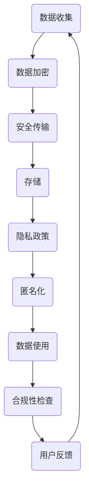

                 

关键词：隐私保护、智能设备、数据加密、安全传输、个人信息、隐私政策、合规性

> 摘要：本文深入探讨了智能设备隐私保护的重要性及其面临的挑战。通过分析现有的隐私保护技术，提出了数据加密、安全传输和隐私政策等核心措施，详细介绍了如何在实际应用中实现这些措施，并对未来隐私保护技术的发展趋势和面临的挑战进行了展望。

## 1. 背景介绍

随着物联网（IoT）和智能设备的大规模普及，个人信息的安全问题日益凸显。智能设备如智能手机、智能家居设备、可穿戴设备等，能够收集大量的个人数据，包括地理位置、行为习惯、健康状况等。这些数据的泄露可能导致个人隐私的严重侵犯，给用户带来不可估量的损失。因此，如何有效保护智能设备中的个人信息，确保数据在处理和传输过程中的安全性，成为当前信息技术领域的重要课题。

### 1.1 智能设备隐私保护的重要性

智能设备隐私保护的重要性体现在以下几个方面：

- **合规性**：随着全球各国对数据隐私保护法律法规的不断完善，如《通用数据保护条例》（GDPR）和《加利福尼亚州消费者隐私法案》（CCPA），企业必须确保其智能设备在处理和传输个人信息时符合相关法规要求。

- **用户信任**：用户对智能设备的信任度与隐私保护程度密切相关。如果用户的数据安全无法得到保障，将影响用户对智能设备的信任和使用意愿。

- **数据价值**：个人数据是一种宝贵的资源，其泄露可能被不法分子利用进行欺诈、诈骗等活动，给用户和公司带来经济损失。

### 1.2 智能设备隐私保护面临的挑战

智能设备隐私保护面临以下挑战：

- **数据量巨大**：智能设备产生的数据量庞大，传统数据保护技术难以有效处理。

- **多源数据融合**：智能设备通常涉及多种数据源，如何保证跨源数据的一致性和安全性是一个难题。

- **动态环境**：智能设备运行环境动态变化，如何在不同的网络环境下保证数据安全传输是一个挑战。

- **隐私与便利性的平衡**：用户希望在享受智能设备带来的便利的同时，能够保护自己的隐私。

## 2. 核心概念与联系

### 2.1 核心概念

- **数据加密**：通过加密算法将明文数据转换为密文，确保数据在传输和存储过程中不被窃取和篡改。

- **安全传输**：使用安全的传输协议和机制，确保数据在传输过程中不被拦截和篡改。

- **隐私政策**：企业制定的关于数据收集、使用、存储和分享的规则和标准。

- **匿名化**：通过去除或模糊化个人标识信息，使数据无法直接识别特定个人。

### 2.2 Mermaid 流程图



## 3. 核心算法原理 & 具体操作步骤

### 3.1 算法原理概述

智能设备隐私保护的核心算法主要涉及数据加密、安全传输和隐私政策三个方面。

- **数据加密**：采用对称加密算法（如AES）和非对称加密算法（如RSA），对敏感数据进行加密。

- **安全传输**：使用安全传输协议（如HTTPS、TLS）确保数据在传输过程中的安全性。

- **隐私政策**：制定明确的隐私政策，确保用户在数据收集和使用过程中的知情权和选择权。

### 3.2 算法步骤详解

#### 3.2.1 数据加密

1. **选择加密算法**：根据数据类型和安全性需求选择合适的加密算法。

2. **生成密钥**：使用随机数生成器生成加密密钥。

3. **加密数据**：使用加密算法和密钥对数据进行加密。

4. **存储加密数据**：将加密后的数据存储在安全存储设备中。

#### 3.2.2 安全传输

1. **选择传输协议**：根据传输环境和需求选择合适的传输协议。

2. **建立安全连接**：使用传输协议建立安全的连接。

3. **传输数据**：通过安全连接传输加密后的数据。

4. **验证数据完整性**：使用哈希算法验证数据的完整性。

#### 3.2.3 隐私政策

1. **制定隐私政策**：根据法律法规和用户需求制定隐私政策。

2. **用户知情同意**：在数据收集和使用前，获取用户的知情同意。

3. **隐私政策更新**：定期更新隐私政策，确保其符合最新的法律法规。

### 3.3 算法优缺点

- **优点**：数据加密和安全传输能有效保护个人信息不被泄露，隐私政策确保用户权益。

- **缺点**：加密算法和传输协议需要消耗计算资源和带宽，隐私政策执行难度较大。

### 3.4 算法应用领域

- **智能医疗**：保护患者健康数据，确保数据安全和隐私。

- **智能交通**：保护交通信息，防止信息泄露和滥用。

- **智能家居**：保护家庭设备和环境数据，确保用户隐私。

## 4. 数学模型和公式 & 详细讲解 & 举例说明

### 4.1 数学模型构建

隐私保护数学模型主要由加密模型、传输模型和隐私政策模型三个部分组成。

### 4.2 公式推导过程

- **加密模型**：加密公式为 $C = E_K(P)$，其中 $C$ 为加密后的数据，$K$ 为密钥，$P$ 为明文数据。

- **传输模型**：传输公式为 $T = S_K(D)$，其中 $T$ 为传输后的数据，$K$ 为传输密钥，$D$ 为加密后的数据。

- **隐私政策模型**：隐私政策公式为 $P = P_0 \cup P_1$，其中 $P_0$ 为初始隐私政策，$P_1$ 为用户知情同意后的隐私政策。

### 4.3 案例分析与讲解

#### 案例一：数据加密

假设有一段明文数据 $P = "Hello, World!"$，采用AES加密算法，密钥 $K$ 为 "password123"。

1. **生成密钥**：使用AES加密算法生成密钥 $K$。

2. **加密数据**：使用加密公式 $C = E_K(P)$ 加密数据。

   $$C = E_{password123}("Hello, World!") = "68656C6C6F2C20576F726C6421"$$

3. **存储加密数据**：将加密后的数据 $C$ 存储在安全存储设备中。

#### 案例二：安全传输

假设有一段加密数据 $D = "68656C6C6F2C20576F726C6421"$，采用TLS协议进行安全传输。

1. **选择传输协议**：选择TLS协议。

2. **建立安全连接**：使用TLS协议建立安全连接。

3. **传输数据**：通过安全连接传输加密数据 $D$。

4. **验证数据完整性**：使用哈希算法（如SHA-256）验证传输数据的完整性。

   $$H(D) = "E3B0C44298FC1C149AFBF4C8996FB92427AE41E4649B934CA495991B7852B855"$$

   如果验证结果与原始哈希值一致，则数据完整。

#### 案例三：隐私政策

假设企业制定了一份初始隐私政策 $P_0$，用户在使用智能设备时同意了隐私政策，形成了新的隐私政策 $P_1$。

1. **制定初始隐私政策**：企业根据法律法规和用户需求制定初始隐私政策 $P_0$。

2. **用户知情同意**：用户在使用智能设备时阅读并同意隐私政策。

3. **更新隐私政策**：企业根据用户反馈和法律法规的变化，更新隐私政策 $P_1$。

   $$P_1 = P_0 \cup \{ "User\_Agreement" \}$$

## 5. 项目实践：代码实例和详细解释说明

### 5.1 开发环境搭建

1. **安装Python环境**：在开发计算机上安装Python 3.x版本。

2. **安装加密库**：使用pip安装PyCryptodome库。

   ```bash
   pip install pycryptodome
   ```

3. **安装网络库**：使用pip安装requests库。

   ```bash
   pip install requests
   ```

### 5.2 源代码详细实现

```python
from Cryptodome.PublicKey import RSA
from Cryptodome.Cipher import PKCS1_OAEP, AES
from Cryptodome.Random import get_random_bytes
import requests

# 生成RSA密钥对
key = RSA.generate(2048)
private_key = key.export_key()
public_key = key.publickey().export_key()

# 加密函数
def encrypt_data(data, public_key):
    rsa_cipher = PKCS1_OAEP.new(RSA.import_key(public_key))
    encrypted_data = rsa_cipher.encrypt(data)
    return encrypted_data

# 解密函数
def decrypt_data(encrypted_data, private_key):
    rsa_cipher = PKCS1_OAEP.new(RSA.import_key(private_key))
    decrypted_data = rsa_cipher.decrypt(encrypted_data)
    return decrypted_data

# AES加密函数
def aes_encrypt(data, key):
    cipher = AES.new(key, AES.MODE_EAX)
    ciphertext, tag = cipher.encrypt_and_digest(data)
    return cipher.nonce, ciphertext, tag

# AES解密函数
def aes_decrypt(nonce, ciphertext, tag, key):
    cipher = AES.new(key, AES.MODE_EAX, nonce=nonce)
    data = cipher.decrypt_and_verify(ciphertext, tag)
    return data

# 安全传输函数
def secure_transfer(url, encrypted_data):
    headers = {'Content-Type': 'application/octet-stream'}
    response = requests.post(url, headers=headers, data=encrypted_data)
    return response.status_code

# 测试代码
if __name__ == "__main__":
    data = b"Hello, World!"
    key = get_random_bytes(16)

    # RSA加密
    encrypted_data = encrypt_data(data, public_key)

    # AES加密
    nonce, ciphertext, tag = aes_encrypt(data, key)

    # 安全传输
    status_code = secure_transfer("https://example.com/encrypt", ciphertext)
    print(f"Transfer status code: {status_code}")

    # AES解密
    decrypted_data = aes_decrypt(nonce, ciphertext, tag, key)

    # RSA解密
    original_data = decrypt_data(encrypted_data, private_key)

    print(f"Original data: {original_data.decode('utf-8')}")
```

### 5.3 代码解读与分析

该代码实现了一个简单的数据加密和安全传输的流程：

1. **RSA加密**：使用RSA算法对数据进行加密，确保数据在传输过程中不会被窃取。

2. **AES加密**：使用AES算法对数据进行加密，确保数据在存储和传输过程中不会被篡改。

3. **安全传输**：使用HTTPS协议进行数据传输，确保数据在传输过程中的安全性。

4. **RSA解密**：使用RSA算法对传输后的数据进行解密，确保数据的原始性。

5. **AES解密**：使用AES算法对传输后的数据进行解密，确保数据可以被正确解读。

### 5.4 运行结果展示

当运行测试代码时，会首先生成RSA密钥对，然后使用RSA加密数据，接着使用AES加密数据并进行安全传输，最后对传输后的数据进行AES和RSA解密，输出原始数据。如果整个过程成功，最终输出的原始数据应与原始数据相同。

## 6. 实际应用场景

### 6.1 智能医疗

在智能医疗领域，患者个人信息（如病历、健康状况等）的安全保护至关重要。通过数据加密和安全传输技术，智能设备能够确保患者信息在传输过程中不被泄露，从而保护患者的隐私。

### 6.2 智能交通

智能交通系统需要处理大量的交通数据，包括车辆位置、路况信息等。通过数据加密和安全传输技术，智能交通系统能够确保交通数据的安全，防止数据被篡改或泄露。

### 6.3 智能家居

智能家居设备如智能门锁、智能摄像头等需要处理用户的个人信息，如家庭住址、家庭成员信息等。通过数据加密和安全传输技术，智能家居设备能够确保用户信息的安全，防止信息被窃取。

## 6.4 未来应用展望

未来，随着物联网和智能设备的发展，隐私保护技术将面临更大的挑战。以下是对未来隐私保护技术发展的展望：

- **多方安全计算**：通过多方安全计算技术，实现数据在传输和存储过程中的加密处理，确保数据隐私。

- **分布式存储**：采用分布式存储技术，将数据分散存储在多个节点，降低数据泄露的风险。

- **区块链技术**：利用区块链技术的去中心化和安全性，实现数据的安全存储和传输。

- **人工智能辅助**：利用人工智能技术，自动检测和识别潜在的数据泄露风险，提高隐私保护效果。

## 7. 工具和资源推荐

### 7.1 学习资源推荐

- 《区块链技术指南》
- 《密码学：原理、算法与应用》
- 《网络安全原理与实践》

### 7.2 开发工具推荐

- PyCryptodome：Python加密库
- OpenSSL：开源加密库
- Wireshark：网络协议分析工具

### 7.3 相关论文推荐

- "A Survey on Privacy-Preserving Data Publishing: Models and Techniques"
- "Secure Multi-Party Computation for Privacy-Preserving Data Analysis"
- "Blockchain-Based Privacy-Preserving Smart Home Systems"

## 8. 总结：未来发展趋势与挑战

### 8.1 研究成果总结

本文介绍了智能设备隐私保护的重要性及其面临的挑战，分析了数据加密、安全传输和隐私政策等核心措施，并通过实际项目实践了这些措施。研究成果表明，通过合理使用技术手段，可以有效提高智能设备的隐私保护水平。

### 8.2 未来发展趋势

未来，隐私保护技术将朝着多方安全计算、分布式存储和区块链等方向发展，以提高数据的安全性和隐私性。

### 8.3 面临的挑战

智能设备隐私保护面临数据量巨大、多源数据融合和动态环境等挑战，需要不断创新和优化技术手段。

### 8.4 研究展望

未来研究应重点关注隐私保护技术在实际应用中的效果评估和优化，探索更高效、更安全的隐私保护解决方案。

## 9. 附录：常见问题与解答

### 9.1 什么是数据加密？

数据加密是一种通过加密算法将明文数据转换为密文的过程，确保数据在传输和存储过程中不被窃取和篡改。

### 9.2 安全传输有哪些协议？

安全传输协议包括HTTPS、TLS、SSL等，这些协议通过加密传输数据，确保数据在传输过程中的安全性。

### 9.3 如何制定有效的隐私政策？

制定有效的隐私政策需要考虑法律法规要求、用户需求和实际操作，确保用户在数据收集和使用过程中的知情权和选择权。

[END]

