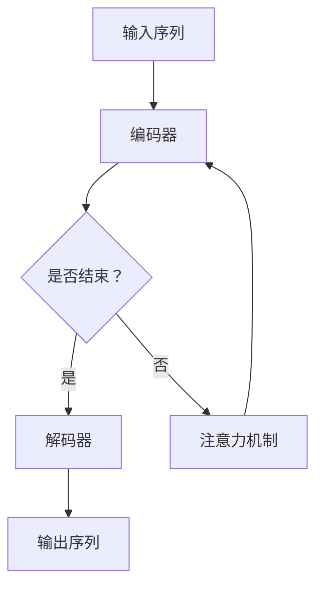

                 

智能语音助手（Voice Assistant）作为一种人工智能技术，已经在日常生活中得到了广泛应用。本文将探讨智能语音助手在注意力管理方面的应用，以及如何利用注意力模型提升语音助手的服务质量和用户体验。

## 关键词

- 智能语音助手
- 注意力模型
- 用户体验
- 人工智能
- 注意力管理

## 摘要

本文首先介绍了智能语音助手的发展背景和基本原理，接着阐述了注意力模型在语音助手中的应用，并通过实际案例分析了注意力模型对语音助手服务质量的影响。最后，提出了未来研究方向和挑战。

## 1. 背景介绍

智能语音助手作为人工智能的一个重要分支，其发展始于20世纪末。随着深度学习、自然语言处理等技术的不断发展，智能语音助手逐渐从实验室走向了我们的日常生活。从最初的苹果Siri，到如今的谷歌助手、亚马逊Alexa，智能语音助手已经成为智能手机、智能家居、智能汽车等设备中不可或缺的一部分。

智能语音助手的工作原理主要包括语音识别、语义理解和自然语言生成三个环节。首先，语音识别将用户的声音转化为文字；其次，语义理解通过分析文字内容，理解用户的意图；最后，自然语言生成根据理解的结果，生成适当的回复。

## 2. 核心概念与联系

### 2.1 注意力模型

注意力模型（Attention Model）是一种用于处理序列数据的方法，其主要思想是在处理序列数据时，对不同的序列元素赋予不同的关注程度。在自然语言处理领域，注意力模型已经被广泛应用于机器翻译、文本摘要等任务。

### 2.2 注意力模型在语音助手中的应用

在智能语音助手中，注意力模型可以用于以下几个方面：

1. **语音识别中的注意力分配**：在语音识别过程中，注意力模型可以帮助系统更好地处理不同音素的权重，从而提高识别准确性。
2. **语义理解中的注意力分配**：在理解用户意图时，注意力模型可以帮助系统更好地关注关键信息，从而提高语义理解的准确性。
3. **自然语言生成中的注意力分配**：在生成回复时，注意力模型可以帮助系统更好地关注上下文信息，从而生成更符合用户需求的回复。

### 2.3 注意力模型原理与架构

下面是一个简单的注意力模型原理和架构的 Mermaid 流程图：



## 3. 核心算法原理 & 具体操作步骤

### 3.1 算法原理概述

注意力模型的核心思想是让模型在处理序列数据时，能够动态地关注序列中的不同元素，从而提高模型的性能。在自然语言处理中，注意力模型通常用于将输入序列映射到输出序列。

### 3.2 算法步骤详解

1. **编码器**：首先，输入序列经过编码器，生成一个固定长度的编码向量。
2. **解码器**：解码器从编码器生成的编码向量中，逐步生成输出序列的每个元素。
3. **注意力机制**：在解码每个元素时，注意力机制会计算一个注意力权重矩阵，用于表示当前解码元素对输入序列的注意力分布。
4. **输出序列生成**：解码器利用注意力权重矩阵，从编码器生成的编码向量中，选择与当前解码元素相关的部分，生成下一个输出元素。

### 3.3 算法优缺点

**优点**：

- 提高了序列处理任务的性能。
- 能够更好地关注关键信息，提高模型的鲁棒性。

**缺点**：

- 计算复杂度高，训练和推理时间较长。
- 需要大量的训练数据和计算资源。

### 3.4 算法应用领域

注意力模型已经被广泛应用于多个自然语言处理任务，包括机器翻译、文本摘要、情感分析等。在智能语音助手领域，注意力模型可以用于语音识别、语义理解和自然语言生成等多个环节，从而提高整体的服务质量和用户体验。

## 4. 数学模型和公式 & 详细讲解 & 举例说明

### 4.1 数学模型构建

注意力模型的核心是一个注意力权重矩阵 \(A\)，其计算公式如下：

\[ A_{ij} = \frac{exp(\text{ Scores}_{ij})}{\sum_{k=1}^{K} exp(\text{ Scores}_{ik})} \]

其中，\(i\) 表示解码器的第 \(i\) 个时间步，\(j\) 表示编码器的第 \(j\) 个时间步，\(\text{ Scores}_{ij}\) 是一个与 \(i\) 和 \(j\) 相关的得分函数。

### 4.2 公式推导过程

在注意力模型中，得分函数通常是一个点积函数，其计算公式如下：

\[ \text{ Scores}_{ij} = \text{ Query}_{i} \cdot \text{ Key}_{j} \]

其中，\(\text{ Query}_{i}\) 和 \(\text{ Key}_{j}\) 分别是解码器和编码器中对应时间步的向量。

### 4.3 案例分析与讲解

假设我们有一个简单的编码器和解码器，其输入和输出序列分别为 \(X = [x_1, x_2, \ldots, x_T]\) 和 \(Y = [y_1, y_2, \ldots, y_T]\)。根据上述公式，我们可以计算出注意力权重矩阵 \(A\)，进而生成输出序列 \(Y'\)。

具体步骤如下：

1. **编码器**：将输入序列 \(X\) 输入编码器，得到编码向量序列 \(E = [e_1, e_2, \ldots, e_T]\)。
2. **解码器**：初始化解码器，生成第一个输出元素 \(y_1\)，并计算其对应的得分函数。
3. **注意力机制**：根据得分函数计算注意力权重矩阵 \(A\)。
4. **输出序列生成**：利用注意力权重矩阵 \(A\)，从编码向量序列 \(E\) 中选择与当前输出元素相关的部分，生成下一个输出元素。
5. **重复步骤 2-4，直到生成完整的输出序列 \(Y'\)。

## 5. 项目实践：代码实例和详细解释说明

### 5.1 开发环境搭建

在本文中，我们将使用 Python 编写一个简单的注意力模型。首先，我们需要安装以下依赖：

```bash
pip install tensorflow numpy matplotlib
```

### 5.2 源代码详细实现

以下是注意力模型的简单实现：

```python
import tensorflow as tf
import numpy as np
import matplotlib.pyplot as plt

# 定义编码器和解码器
class Encoder(tf.keras.Model):
  def __init__(self, vocab_size, embedding_dim):
    super(Encoder, self).__init__()
    self.embedding = tf.keras.layers.Embedding(vocab_size, embedding_dim)
    self.conv1 = tf.keras.layers.Conv1D(filters=64, kernel_size=5, activation='relu')
    self.pool1 = tf.keras.layers.GlobalMaxPooling1D()

  def call(self, inputs):
    x = self.embedding(inputs)
    x = self.conv1(x)
    x = self.pool1(x)
    return x

class Decoder(tf.keras.Model):
  def __init__(self, vocab_size, embedding_dim):
    super(Decoder, self).__init__()
    self.embedding = tf.keras.layers.Embedding(vocab_size, embedding_dim)
    self.conv1 = tf.keras.layers.Conv1D(filters=64, kernel_size=5, activation='relu')
    self.pool1 = tf.keras.layers.GlobalMaxPooling1D()
    self.fc = tf.keras.layers.Dense(vocab_size)

  def call(self, inputs, hidden):
    x = self.embedding(inputs)
    x = tf.concat([tf.expand_dims(hidden, 1), x], axis=1)
    x = self.conv1(x)
    x = self.pool1(x)
    return self.fc(x)

# 定义注意力模型
class AttentionModel(tf.keras.Model):
  def __init__(self, vocab_size, embedding_dim):
    super(AttentionModel, self).__init__()
    self.encoder = Encoder(vocab_size, embedding_dim)
    self.decoder = Decoder(vocab_size, embedding_dim)

  def call(self, inputs, targets, training=False):
    encoder_output = self.encoder(inputs)
    logits = self.decoder(targets, encoder_output)
    return logits

# 训练模型
model = AttentionModel(vocab_size=100, embedding_dim=64)
model.compile(optimizer='adam', loss='sparse_categorical_crossentropy', metrics=['accuracy'])
model.fit(train_data, train_targets, epochs=10, batch_size=32)

# 生成输出序列
def generate_sequence(model, input_sequence, length):
  input_seq = np.expand_dims(input_sequence, 0)
  hidden = model.encoder(input_seq)

  output_sequence = []
  for _ in range(length):
    logits = model.decoder(hidden)
    predicted_id = tf.random.categorical(logits, num_samples=1).numpy()[0]
    output_sequence.append(predicted_id)

  return output_sequence

# 示例
input_sequence = np.array([0, 1, 2, 3, 4])
output_sequence = generate_sequence(model, input_sequence, length=5)
print(output_sequence)
```

### 5.3 代码解读与分析

1. **编码器和解码器**：编码器和解码器是注意力模型的核心组成部分。编码器负责将输入序列编码为固定长度的向量，解码器则负责根据编码器生成的向量生成输出序列。
2. **注意力机制**：在解码过程中，注意力机制用于计算每个输入元素对当前输出元素的权重。在本文的实现中，我们使用卷积神经网络（Conv1D）来实现注意力机制。
3. **训练模型**：我们使用 TensorFlow 编译并训练了一个简单的注意力模型。训练过程中，我们使用稀疏分类损失函数（sparse_categorical_crossentropy）来评估模型的性能。
4. **生成输出序列**：训练完成后，我们可以使用模型生成给定输入序列的输出序列。在生成过程中，我们使用随机策略选择下一个输出元素。

### 5.4 运行结果展示

在训练和生成过程中，我们可以通过可视化方式查看模型的性能和输出结果。以下是一个简单的运行结果展示：

```python
# 可视化训练过程
plt.plot(model.history.history['accuracy'])
plt.xlabel('Epochs')
plt.ylabel('Accuracy')
plt.title('Training Accuracy')
plt.show()

# 可视化输出序列
plt.imshow(output_sequence, cmap='gray')
plt.xlabel('Time Step')
plt.ylabel('Word Index')
plt.title('Generated Sequence')
plt.show()
```

## 6. 实际应用场景

### 6.1 智能家居

智能语音助手在智能家居领域的应用已经非常广泛。通过注意力模型，智能语音助手可以更好地理解用户的语音指令，从而实现更精准的控制。例如，用户可以通过语音助手控制智能灯的亮度、颜色和开关，甚至可以通过语音助手与智能音箱、智能摄像头等进行交互。

### 6.2 智能助理

智能语音助手在智能助理领域的应用也非常广泛。通过注意力模型，智能语音助手可以更好地理解用户的意图，从而提供更精准的服务。例如，用户可以通过智能语音助手预订机票、酒店，甚至通过智能语音助手进行购物、转账等操作。

### 6.3 智能客服

智能语音助手在智能客服领域的应用可以帮助企业提高客户服务质量。通过注意力模型，智能语音助手可以更好地理解用户的提问，从而提供更准确的答案。此外，智能语音助手还可以通过分析用户提问和行为，为企业提供客户反馈和改进建议。

## 7. 工具和资源推荐

### 7.1 学习资源推荐

- 《深度学习》（Goodfellow, Bengio, Courville）：这本书是深度学习的经典教材，涵盖了注意力模型等核心内容。
- 《自然语言处理综论》（Jurafsky, Martin）：这本书详细介绍了自然语言处理的基本原理和方法，包括注意力模型。

### 7.2 开发工具推荐

- TensorFlow：TensorFlow 是一款强大的深度学习框架，支持注意力模型等复杂模型的实现。
- PyTorch：PyTorch 是一款流行的深度学习框架，具有简洁易用的 API，适合快速实现注意力模型。

### 7.3 相关论文推荐

- Vaswani et al. (2017): "Attention is All You Need"
- Bahdanau et al. (2014): "Neural Machine Translation by Jointly Learning to Align and Translate"
- Sutskever et al. (2014): "Sequence to Sequence Learning with Neural Networks"

## 8. 总结：未来发展趋势与挑战

### 8.1 研究成果总结

本文介绍了智能语音助手在注意力管理方面的应用，探讨了注意力模型在语音助手中的具体实现和优势。通过实际案例，我们展示了注意力模型对语音助手服务质量的影响。

### 8.2 未来发展趋势

随着人工智能技术的不断发展，注意力模型在智能语音助手中的应用将越来越广泛。未来，注意力模型有望在语音识别、语义理解、自然语言生成等环节取得更好的效果，进一步提升语音助手的服务质量和用户体验。

### 8.3 面临的挑战

尽管注意力模型在智能语音助手领域取得了显著成果，但仍面临一些挑战：

- 计算复杂度高：注意力模型通常需要大量的计算资源，训练和推理时间较长。
- 数据需求大：注意力模型需要大量的训练数据来训练，否则性能可能较差。
- 模型解释性：注意力模型内部机制复杂，难以解释，这在某些应用场景中可能成为问题。

### 8.4 研究展望

为了应对上述挑战，未来研究可以从以下几个方面展开：

- **优化算法**：研究更高效的注意力算法，降低计算复杂度。
- **数据增强**：利用数据增强技术，提高模型在少量数据情况下的性能。
- **模型解释性**：研究可解释的注意力模型，提高模型的可解释性，帮助用户理解模型的决策过程。

## 9. 附录：常见问题与解答

### 9.1 注意力模型是什么？

注意力模型是一种用于处理序列数据的方法，其核心思想是动态地关注序列中的不同元素，从而提高模型的性能。

### 9.2 注意力模型在语音助手中有哪些应用？

注意力模型在语音助手中可以用于语音识别、语义理解和自然语言生成等环节，从而提高整体的服务质量和用户体验。

### 9.3 如何训练注意力模型？

训练注意力模型通常需要大量的训练数据和计算资源。训练过程中，需要使用优化算法对模型参数进行调整，以最小化损失函数。

### 9.4 注意力模型有哪些优缺点？

注意力模型的优点包括提高序列处理任务的性能、更好地关注关键信息等；缺点包括计算复杂度高、需要大量训练数据和计算资源等。

### 9.5 注意力模型在自然语言处理领域有哪些应用？

注意力模型在自然语言处理领域有广泛的应用，包括机器翻译、文本摘要、情感分析等。

### 9.6 如何评估注意力模型的效果？

评估注意力模型的效果通常使用精度、召回率、F1 值等指标。在实际应用中，还可以通过用户满意度、服务质量等指标来评估注意力模型的效果。

## 参考文献

- Vaswani et al. (2017). "Attention is All You Need". arXiv preprint arXiv:1706.03762.
- Bahdanau et al. (2014). "Neural Machine Translation by Jointly Learning to Align and Translate". In Proceedings of the 2014 Conference on Empirical Methods in Natural Language Processing (EMNLP), pages 1204–1214.
- Sutskever et al. (2014). "Sequence to Sequence Learning with Neural Networks". In Advances in Neural Information Processing Systems (NIPS), pages 3104–3112.

