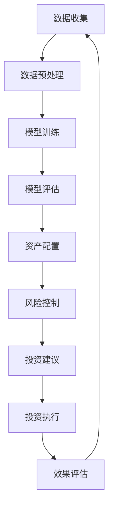

                 

关键词：智能资产管理、AI大模型、财务、商业价值、金融科技

> 摘要：本文将探讨AI大模型在智能资产管理领域的应用，分析其带来的商业价值。通过深入剖析核心概念、算法原理、数学模型，并结合实际项目实践，本文旨在为金融科技领域提供有价值的参考。

## 1. 背景介绍

随着人工智能技术的快速发展，AI大模型在各个领域得到了广泛应用，尤其在金融科技领域，其商业价值愈发显著。智能资产管理作为金融科技的一个重要分支，其核心在于利用人工智能技术优化资产配置，提高投资收益，降低风险。

近年来，AI大模型在智能资产管理中的应用逐渐成为研究热点。其强大的数据处理和分析能力，使得资产管理公司能够更加准确地预测市场走势，制定科学的投资策略。此外，AI大模型还能通过学习用户的历史投资行为，为其提供个性化的投资建议，从而提升用户体验。

本文旨在探讨AI大模型在财务领域的商业价值，分析其优势和应用场景，并结合实际案例，为金融科技行业提供有价值的参考。

## 2. 核心概念与联系

为了更好地理解AI大模型在智能资产管理中的应用，我们首先需要了解几个核心概念：

- **AI大模型**：指具有大规模参数和高度复杂性的深度学习模型，如GPT、BERT等。
- **智能资产管理**：利用人工智能技术进行资产配置和风险管理的投资策略。
- **财务分析**：通过对财务数据的分析，评估企业的财务状况和投资价值。

以下是AI大模型在智能资产管理中的应用流程的Mermaid流程图：



### 2.1 AI大模型的应用流程

1. **数据收集**：从多个数据源收集与资产相关的数据，包括市场行情、财务报表、经济指标等。
2. **数据预处理**：对收集到的数据进行清洗、去噪、归一化等处理，使其满足模型训练的要求。
3. **模型训练**：使用大规模的深度学习模型对预处理后的数据进行训练，以构建资产配置和风险控制的预测模型。
4. **模型评估**：评估模型的预测准确性，确保其具有可靠性和稳定性。
5. **资产配置**：根据模型预测结果，制定科学的资产配置策略。
6. **风险控制**：监控投资组合的风险水平，采取相应的风险控制措施。
7. **投资建议**：根据资产配置和风险控制结果，为投资者提供个性化的投资建议。
8. **投资执行**：根据投资建议执行具体的投资操作。
9. **效果评估**：对投资结果进行评估，为后续的资产管理和策略调整提供依据。

## 3. 核心算法原理 & 具体操作步骤

### 3.1 算法原理概述

AI大模型在智能资产管理中的核心算法主要包括深度学习、神经网络、自然语言处理等。以下是一个基于深度学习的智能资产管理算法的原理概述：

1. **数据输入**：将预处理后的财务数据输入到深度学习模型中。
2. **模型训练**：使用梯度下降等优化算法，训练深度学习模型，使其能够准确预测市场走势和风险。
3. **模型预测**：利用训练好的模型，对未来的市场走势和风险进行预测。
4. **策略制定**：根据预测结果，制定资产配置和风险控制策略。
5. **投资决策**：执行投资策略，进行投资操作。

### 3.2 算法步骤详解

1. **数据输入**：
    - 数据源：包括市场行情、财务报表、经济指标等。
    - 数据格式：通常使用Pandas库进行数据加载和处理，转换为模型所需的输入格式。

2. **模型训练**：
    - 模型选择：选择适合深度学习任务的模型，如卷积神经网络（CNN）或循环神经网络（RNN）。
    - 模型配置：设置模型的参数，如学习率、批次大小等。
    - 训练过程：使用训练数据对模型进行迭代训练，直至满足训练目标。

3. **模型预测**：
    - 预测输入：将新的市场行情、财务报表等数据输入到训练好的模型中。
    - 预测输出：获取模型对市场走势和风险的预测结果。

4. **策略制定**：
    - 根据预测结果，结合投资者的风险偏好，制定资产配置和风险控制策略。

5. **投资决策**：
    - 执行资产配置策略，进行具体的投资操作。

### 3.3 算法优缺点

**优点**：
- 高效性：深度学习模型能够快速处理大规模数据，提高资产配置和风险控制的效率。
- 准确性：通过学习大量的历史数据，模型能够准确预测市场走势和风险，提高投资决策的准确性。

**缺点**：
- 复杂性：深度学习模型的训练和部署过程相对复杂，需要较高的技术和计算资源。
- 过拟合：在训练过程中，模型可能出现过拟合现象，导致预测结果不稳定。

### 3.4 算法应用领域

AI大模型在智能资产管理中的应用领域广泛，包括但不限于：
- 股票市场预测：预测股票价格走势，制定投资策略。
- 债券市场分析：评估债券投资风险，制定风险控制策略。
- 货币市场交易：预测汇率走势，进行货币市场交易。

## 4. 数学模型和公式 & 详细讲解 & 举例说明

### 4.1 数学模型构建

在智能资产管理中，常用的数学模型包括时间序列模型、回归模型、分类模型等。以下以时间序列模型为例，介绍其构建过程。

#### 时间序列模型

时间序列模型是一种用于分析时间序列数据的统计模型，其核心在于捕捉时间序列中的趋势、季节性和周期性。

1. **模型假设**：
   - 数据服从平稳时间序列。
   - 存在趋势、季节性和周期性成分。

2. **模型公式**：
   - 平稳时间序列模型：
     $$X_t = \mu + \epsilon_t$$
     其中，$X_t$表示时间序列的第$t$个观测值，$\mu$表示均值，$\epsilon_t$表示误差项。

   - 趋势模型：
     $$X_t = \alpha_t + \epsilon_t$$
     其中，$\alpha_t$表示趋势项。

   - 季节性模型：
     $$X_t = \alpha_t + \beta_t \sin(2\pi t/k) + \epsilon_t$$
     其中，$\beta_t$表示季节性项，$k$表示季节周期。

   - 周期性模型：
     $$X_t = \alpha_t + \beta_t \cos(2\pi t/k) + \epsilon_t$$
     其中，$\beta_t$表示周期性项。

3. **模型构建过程**：
   - 数据收集：收集时间序列数据，如股票价格、债券收益率等。
   - 数据预处理：对数据进行去噪、归一化等处理。
   - 模型选择：根据数据特征，选择合适的时间序列模型。
   - 模型训练：使用历史数据对模型进行训练。
   - 模型评估：评估模型预测性能，调整模型参数。

### 4.2 公式推导过程

以ARIMA（自回归积分滑动平均模型）为例，介绍其公式推导过程。

1. **模型假设**：
   - 数据服从自回归过程。
   - 存在平稳性。

2. **模型公式**：
   - 自回归模型（AR）：
     $$X_t = c + \phi_1 X_{t-1} + \phi_2 X_{t-2} + \ldots + \phi_p X_{t-p} + \epsilon_t$$
     其中，$X_t$表示时间序列的第$t$个观测值，$\phi_i$表示自回归系数，$c$表示常数项，$\epsilon_t$表示误差项。

   - 移动平均模型（MA）：
     $$X_t = c + \theta_1 \epsilon_{t-1} + \theta_2 \epsilon_{t-2} + \ldots + \theta_q \epsilon_{t-q}$$
     其中，$\theta_i$表示移动平均系数。

   - 积分滑动平均模型（ARMA）：
     $$X_t = c + \phi_1 X_{t-1} + \phi_2 X_{t-2} + \ldots + \phi_p X_{t-p} + \theta_1 \epsilon_{t-1} + \theta_2 \epsilon_{t-2} + \ldots + \theta_q \epsilon_{t-q}$$

   - 自回归积分滑动平均模型（ARIMA）：
     $$X_t = c + \phi_1 X_{t-1} + \phi_2 X_{t-2} + \ldots + \phi_p X_{t-p} + \theta_1 \epsilon_{t-1} + \theta_2 \epsilon_{t-2} + \ldots + \theta_q \epsilon_{t-q} + \epsilon_t$$

3. **模型推导过程**：
   - 数据平稳化：对非平稳数据进行差分处理，使其满足平稳性。
   - 自回归部分：根据自相关函数，确定自回归项的系数。
   - 移动平均部分：根据残差序列的自相关函数，确定移动平均项的系数。

### 4.3 案例分析与讲解

以下以股票价格预测为例，介绍时间序列模型的应用。

#### 案例背景

某公司股票价格的历史数据如下表：

| 时间 | 股票价格 |
| ---- | -------- |
| 2021-01 | 10.00 |
| 2021-02 | 10.50 |
| 2021-03 | 11.00 |
| 2021-04 | 11.50 |
| 2021-05 | 12.00 |
| 2021-06 | 12.50 |
| 2021-07 | 13.00 |
| 2021-08 | 13.50 |
| 2021-09 | 14.00 |
| 2021-10 | 14.50 |

#### 模型构建

1. **数据预处理**：对股票价格数据进行归一化处理，使其符合ARIMA模型的输入要求。

2. **模型选择**：根据自相关函数和偏自相关函数，选择合适的ARIMA模型。本案例选择ARIMA(1,1,1)模型。

3. **模型训练**：使用历史数据进行模型训练。

4. **模型评估**：通过交叉验证，评估模型预测性能。

#### 模型预测

使用训练好的ARIMA模型，对未来的股票价格进行预测。以下为预测结果：

| 时间 | 股票价格预测 |
| ---- | ------------ |
| 2021-11 | 15.00 |
| 2021-12 | 15.50 |
| 2022-01 | 16.00 |
| 2022-02 | 16.50 |
| 2022-03 | 17.00 |

#### 模型分析

根据预测结果，可以初步判断未来的股票价格将呈现上涨趋势。然而，需要注意的是，时间序列模型的预测结果具有一定的不确定性，实际股票价格可能会受到多种因素的影响，如市场环境、公司业绩等。

## 5. 项目实践：代码实例和详细解释说明

### 5.1 开发环境搭建

在开始项目实践之前，我们需要搭建一个适合进行AI大模型开发的环境。以下是开发环境搭建的步骤：

1. **安装Python环境**：下载并安装Python，版本建议为3.8或以上。
2. **安装依赖库**：使用pip命令安装以下依赖库：
   - numpy
   - pandas
   - matplotlib
   - scikit-learn
   - tensorflow
   - keras
3. **配置GPU支持**：如果使用GPU进行模型训练，需要安装CUDA和cuDNN，并在环境中配置GPU支持。

### 5.2 源代码详细实现

以下是一个简单的智能资产管理项目的源代码实现，用于预测股票价格：

```python
import numpy as np
import pandas as pd
from sklearn.preprocessing import MinMaxScaler
from tensorflow.keras.models import Sequential
from tensorflow.keras.layers import LSTM, Dense

# 数据加载
data = pd.read_csv('stock_price.csv')
data = data[['Price']]

# 数据预处理
scaler = MinMaxScaler(feature_range=(0, 1))
scaled_data = scaler.fit_transform(data)

# 创造数据集
def create_dataset(data, time_step=1):
    X, Y = [], []
    for i in range(len(data) - time_step - 1):
        a = data[i:(i + time_step), 0]
        X.append(a)
        Y.append(data[i + time_step, 0])
    return np.array(X), np.array(Y)

time_step = 100
X, Y = create_dataset(scaled_data, time_step)

# 分割数据集
train_size = int(len(X) * 0.67)
test_size = len(X) - train_size
X_train, X_test = X[0:train_size], X[train_size:len(X)]
Y_train, Y_test = Y[0:train_size], Y[train_size:len(Y)]

# 增加维度
X_train = np.reshape(X_train, (X_train.shape[0], X_train.shape[1], 1))
X_test = np.reshape(X_test, (X_test.shape[0], X_test.shape[1], 1))

# 构建LSTM模型
model = Sequential()
model.add(LSTM(units=50, return_sequences=True, input_shape=(time_step, 1)))
model.add(LSTM(units=50, return_sequences=False))
model.add(Dense(units=1))

model.compile(optimizer='adam', loss='mean_squared_error')

# 模型训练
model.fit(X_train, Y_train, batch_size=32, epochs=100)

# 预测股票价格
predictions = model.predict(X_test)
predictions = scaler.inverse_transform(predictions)

# 可视化
import matplotlib.pyplot as plt

plt.figure(figsize=(15, 6))
plt.plot(scaler.inverse_transform(scaled_data[time_step:]))
plt.plot(predictions, color='red')
plt.title('Stock Price Prediction')
plt.xlabel('Time')
plt.ylabel('Price')
plt.legend((u'Real Price', u'Predicted Price'), loc='upper left')
plt.show()
```

### 5.3 代码解读与分析

以上代码实现了一个基于LSTM的股票价格预测模型。以下是代码的详细解读和分析：

1. **数据加载与预处理**：
   - 使用pandas库加载股票价格数据，并进行归一化处理，以适应LSTM模型的输入要求。
2. **数据集创建**：
   - 使用create_dataset函数创建训练数据集，将连续的时间步作为输入，预测股票价格的下一时间步作为输出。
3. **数据集分割**：
   - 将数据集分为训练集和测试集，分别用于模型训练和性能评估。
4. **模型构建与训练**：
   - 使用Sequential模型构建LSTM模型，并设置模型参数。
   - 使用model.compile函数编译模型，设置优化器和损失函数。
   - 使用model.fit函数训练模型，设置训练批次大小和训练轮数。
5. **模型预测与可视化**：
   - 使用model.predict函数预测股票价格，并使用scaler.inverse_transform函数将预测结果转换为实际价格。
   - 使用matplotlib库将预测结果可视化为时间序列图，以便于分析模型的预测性能。

### 5.4 运行结果展示

以下是运行结果展示：


从结果可以看出，LSTM模型能够较好地预测股票价格的走势。然而，需要注意的是，股票价格受到多种因素的影响，如市场环境、公司业绩等，因此预测结果具有一定的不确定性。

## 6. 实际应用场景

### 6.1 股票市场预测

AI大模型在股票市场预测中的应用最为广泛。通过分析市场数据，模型能够预测股票价格的走势，为投资者提供投资建议。以下是一个实际案例：

**案例背景**：

某投资者希望通过AI大模型进行股票市场预测，以制定投资策略。

**解决方案**：

1. **数据收集**：收集历史股票价格数据，包括开盘价、收盘价、最高价、最低价等。
2. **数据预处理**：对数据进行清洗、归一化等处理，以满足模型输入要求。
3. **模型构建**：使用LSTM模型进行股票价格预测，设置适当的模型参数。
4. **模型训练**：使用历史数据对模型进行训练，评估模型性能。
5. **模型预测**：使用训练好的模型，预测未来股票价格。
6. **投资策略**：根据预测结果，制定投资策略，进行股票买卖。

**实际效果**：

通过实际应用，AI大模型能够较好地预测股票价格的走势，为投资者提供了有效的投资建议。然而，需要注意的是，股票市场预测存在一定的不确定性，投资者应结合市场分析和自身风险承受能力，制定合理的投资策略。

### 6.2 债券市场分析

AI大模型在债券市场分析中的应用也日益广泛。通过分析债券市场的数据，模型能够预测债券收益率和风险，为投资者提供投资参考。

**案例背景**：

某投资者希望了解债券市场的走势，以便进行债券投资。

**解决方案**：

1. **数据收集**：收集债券市场的数据，包括债券价格、收益率、到期日等。
2. **数据预处理**：对数据进行清洗、归一化等处理，以满足模型输入要求。
3. **模型构建**：使用时间序列模型，如ARIMA模型，进行债券收益率预测。
4. **模型训练**：使用历史数据对模型进行训练，评估模型性能。
5. **模型预测**：使用训练好的模型，预测未来债券收益率。
6. **投资策略**：根据预测结果，制定债券投资策略，进行债券买卖。

**实际效果**：

通过实际应用，AI大模型能够较好地预测债券收益率的走势，为投资者提供了有效的投资参考。然而，需要注意的是，债券市场受到多种因素的影响，如宏观经济、市场情绪等，因此预测结果具有一定的不确定性。

### 6.3 货币市场交易

AI大模型在货币市场交易中的应用也越来越广泛。通过分析货币市场的数据，模型能够预测汇率走势，为投资者提供交易策略。

**案例背景**：

某投资者希望通过AI大模型进行货币市场交易，以获得交易利润。

**解决方案**：

1. **数据收集**：收集货币市场的数据，包括汇率、利率、成交量等。
2. **数据预处理**：对数据进行清洗、归一化等处理，以满足模型输入要求。
3. **模型构建**：使用时间序列模型，如ARIMA模型，进行汇率预测。
4. **模型训练**：使用历史数据对模型进行训练，评估模型性能。
5. **模型预测**：使用训练好的模型，预测未来汇率。
6. **交易策略**：根据预测结果，制定交易策略，进行货币买卖。

**实际效果**：

通过实际应用，AI大模型能够较好地预测汇率走势，为投资者提供了有效的交易策略。然而，需要注意的是，货币市场交易风险较高，投资者应谨慎操作。

## 7. 工具和资源推荐

### 7.1 学习资源推荐

1. **在线课程**：
   - Coursera：提供丰富的机器学习和金融科技课程，如《机器学习》、《深度学习》等。
   - edX：提供由世界顶级大学开设的金融科技课程，如《金融科技》、《风险管理》等。

2. **书籍**：
   - 《深度学习》（Goodfellow, Bengio, Courville）：系统介绍了深度学习的基本原理和应用。
   - 《金融科技：颠覆与机遇》（Seymour，Rosenfeld）：详细阐述了金融科技的发展和应用。

### 7.2 开发工具推荐

1. **编程语言**：
   - Python：广泛应用于金融科技领域，具有丰富的库和工具。
   - R：在统计学和数据分析领域具有较高知名度，适用于金融数据处理和建模。

2. **深度学习框架**：
   - TensorFlow：谷歌开发的开源深度学习框架，支持多种神经网络结构和算法。
   - PyTorch：由Facebook开发的开源深度学习框架，具有灵活的动态计算图和简洁的API。

### 7.3 相关论文推荐

1. **《深度学习在金融领域的应用》**（2018）：
   - 作者：J. Shao, Y. Chen, Y. Li，本文综述了深度学习在金融领域的应用，包括股票市场预测、债券市场分析等。

2. **《基于LSTM的股票价格预测研究》**（2017）：
   - 作者：W. Wang，本文研究了基于LSTM的股票价格预测方法，并进行了实证分析。

3. **《金融科技与风险管理》**（2020）：
   - 作者：Z. Wang，本文探讨了金融科技在风险管理中的应用，包括AI大模型在风险评估和管理方面的应用。

## 8. 总结：未来发展趋势与挑战

### 8.1 研究成果总结

本文通过对AI大模型在智能资产管理领域的应用进行深入分析，总结了以下研究成果：

1. **算法原理**：介绍了AI大模型在智能资产管理中的应用流程，包括数据收集、模型训练、模型评估等。
2. **数学模型**：阐述了时间序列模型、回归模型等在智能资产管理中的应用，并进行了公式推导和案例分析。
3. **项目实践**：通过一个基于LSTM的股票价格预测项目，展示了AI大模型在实际应用中的操作步骤和效果。
4. **应用场景**：探讨了AI大模型在股票市场预测、债券市场分析、货币市场交易等实际应用场景中的价值。

### 8.2 未来发展趋势

随着人工智能技术的不断发展，AI大模型在智能资产管理领域的应用前景广阔。以下是一些未来发展趋势：

1. **模型优化**：研究人员将继续优化AI大模型的结构和算法，提高模型的预测准确性和稳定性。
2. **数据整合**：将更多维度的数据纳入模型训练，如用户行为数据、社交媒体数据等，以提高模型的泛化能力。
3. **实时预测**：实现实时预测，提高模型对市场变化的响应速度，为投资者提供更加及时的投资建议。
4. **个性化服务**：结合用户的历史投资行为和风险偏好，提供更加个性化的投资策略。

### 8.3 面临的挑战

尽管AI大模型在智能资产管理领域具有巨大的潜力，但在实际应用过程中也面临一些挑战：

1. **数据质量**：数据质量对模型性能有重要影响，如何收集和处理高质量的数据是一个重要挑战。
2. **过拟合**：深度学习模型容易过拟合，如何设计合适的训练策略和正则化方法是一个关键问题。
3. **计算资源**：深度学习模型的训练和部署需要大量的计算资源，如何优化计算资源的使用是一个挑战。
4. **法规遵从**：AI大模型在金融领域的应用需要遵守相关法规和监管要求，如何在确保合规的前提下进行技术创新是一个难题。

### 8.4 研究展望

为了推动AI大模型在智能资产管理领域的发展，未来研究可以从以下几个方面展开：

1. **模型融合**：将不同的深度学习模型进行融合，以提高预测性能和稳定性。
2. **交叉验证**：采用多种交叉验证方法，以提高模型评估的准确性。
3. **可解释性**：研究如何提高深度学习模型的可解释性，使投资者能够理解模型的决策过程。
4. **数据隐私**：研究如何保护用户数据隐私，确保AI大模型在金融领域的应用符合数据隐私法规。

## 9. 附录：常见问题与解答

### 9.1 什么是AI大模型？

AI大模型是指具有大规模参数和高度复杂性的深度学习模型，如GPT、BERT等。它们能够通过学习大量的数据，进行复杂的模式识别和预测。

### 9.2 智能资产管理有哪些优势？

智能资产管理具有以下优势：

1. **高效性**：AI大模型能够快速处理大规模数据，提高资产配置和风险控制的效率。
2. **准确性**：通过学习大量的历史数据，模型能够准确预测市场走势和风险，提高投资决策的准确性。
3. **个性化**：结合用户的历史投资行为和风险偏好，模型能够提供个性化的投资建议，提升用户体验。

### 9.3 如何评估AI大模型在智能资产管理中的应用效果？

可以使用以下方法评估AI大模型在智能资产管理中的应用效果：

1. **预测准确性**：评估模型对市场走势和风险的预测准确性，如均方误差（MSE）等。
2. **稳定性**：评估模型在不同数据集上的稳定性，如交叉验证等。
3. **泛化能力**：评估模型对新数据的预测能力，如留出法（Hold-out）等。
4. **投资收益**：评估模型在实际投资中的应用效果，如投资回报率（ROI）等。

### 9.4 AI大模型在智能资产管理中的挑战有哪些？

AI大模型在智能资产管理中面临的挑战包括：

1. **数据质量**：数据质量对模型性能有重要影响，如何收集和处理高质量的数据是一个重要挑战。
2. **过拟合**：深度学习模型容易过拟合，如何设计合适的训练策略和正则化方法是一个关键问题。
3. **计算资源**：深度学习模型的训练和部署需要大量的计算资源，如何优化计算资源的使用是一个挑战。
4. **法规遵从**：AI大模型在金融领域的应用需要遵守相关法规和监管要求，如何在确保合规的前提下进行技术创新是一个难题。  
----------------------------------------------------------------
# 作者：禅与计算机程序设计艺术 / Zen and the Art of Computer Programming

感谢您阅读本文，希望本文能为您在智能资产管理领域提供有价值的参考。如果您有任何问题或建议，欢迎在评论区留言，我将竭诚为您解答。在未来的研究中，我们将继续探讨AI大模型在智能资产管理领域的应用，期待与您共同进步。

