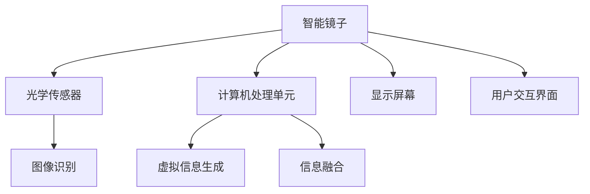

                 

关键词：智能镜子，增强现实，生活应用，技术创新，创业故事，用户体验，市场前景

> 摘要：本文将探讨智能镜子在增强现实技术领域的应用，通过分析其核心概念、技术原理、数学模型以及实际案例，深入探讨智能镜子的市场潜力与创业机会。我们将从技术专家的视角出发，结合实例与数据分析，为读者呈现智能镜子的未来发展方向。

## 1. 背景介绍

### 智能镜子的起源与发展

智能镜子并非一个全新的概念，其最早的雏形可以追溯到20世纪末。然而，随着计算机技术、传感器技术以及增强现实（AR）技术的迅猛发展，智能镜子逐渐从科幻走向现实。

智能镜子的起源可以追溯到20世纪80年代的虚拟现实实验室。当时的科学家们通过头戴显示器和追踪设备来模拟虚拟环境，而智能镜子则通过光学传感器和计算机处理技术，将虚拟信息与现实环境结合在一起。

### 增强现实技术的发展

增强现实（AR）技术是智能镜子的核心支撑。AR技术的出现使得用户能够将虚拟信息与现实环境实时融合，大大提升了用户体验。AR技术的发展可以分为三个阶段：

1. **早期的AR应用**：以头戴显示器为代表，用户需要通过佩戴设备来体验虚拟信息。
2. **移动AR**：智能手机和平板电脑的普及，使得移动AR应用变得广泛，如游戏和导航应用。
3. **沉浸式AR**：智能镜子和AR眼镜等设备的出现，使得用户可以在日常环境中体验到沉浸式的虚拟信息。

### 智能镜子在市场中的地位

随着技术的进步和消费者需求的提升，智能镜子在市场上逐渐崭露头角。根据市场研究公司的报告，全球智能镜子市场预计将在未来几年内保持高速增长，市场潜力巨大。

### 1.1 智能镜子的市场现状

目前，智能镜子主要应用于家居、美容、健身和医疗等领域。家居领域中的智能镜子可以提供虚拟家居设计、实时天气预报等功能；美容领域的智能镜子可以帮助用户尝试不同的发型和妆容；健身领域的智能镜子可以提供实时反馈和训练计划；医疗领域的智能镜子则可以用于远程诊断和手术指导。

### 1.2 智能镜子的市场趋势

随着技术的不断进步，智能镜子的功能和应用场景将继续拓展。未来，智能镜子有望与智能家居、物联网（IoT）和虚拟现实（VR）等技术深度融合，为用户提供更加丰富和多样化的体验。

## 2. 核心概念与联系

### 智能镜子的核心概念

智能镜子的核心概念在于将虚拟信息与现实环境相结合，为用户提供增强现实体验。智能镜子通常包括以下几个组成部分：

1. **光学传感器**：用于捕捉用户的动作和位置信息。
2. **计算机处理单元**：用于处理传感器数据，生成虚拟信息。
3. **显示屏幕**：用于将虚拟信息展示给用户。
4. **用户交互界面**：用于用户与智能镜子之间的交互。

### 增强现实技术的核心概念

增强现实（AR）技术的核心在于将虚拟信息与现实环境进行实时融合。AR技术主要包括以下几个组成部分：

1. **图像识别**：通过图像处理技术，识别现实环境中的物体和场景。
2. **虚拟信息生成**：根据用户需求，生成相应的虚拟信息。
3. **信息融合**：将虚拟信息与现实环境进行融合，形成增强现实体验。

### 智能镜子与增强现实技术的联系

智能镜子是增强现实技术的一种具体应用。智能镜子通过光学传感器和计算机处理单元，捕捉用户的动作和位置信息，并将虚拟信息与现实环境进行实时融合，为用户提供增强现实体验。智能镜子与增强现实技术的联系如图所示：



## 3. 核心算法原理 & 具体操作步骤

### 3.1 算法原理概述

智能镜子的核心算法主要包括图像识别、虚拟信息生成和信息融合三个部分。这三个部分相互配合，共同实现智能镜子的增强现实功能。

1. **图像识别**：通过图像处理技术，智能镜子可以识别现实环境中的物体和场景。图像识别算法主要包括特征提取、匹配和分类等步骤。
2. **虚拟信息生成**：根据用户需求，智能镜子可以生成相应的虚拟信息。虚拟信息生成算法主要包括模型构建、数据输入和处理输出等步骤。
3. **信息融合**：将虚拟信息与现实环境进行融合，形成增强现实体验。信息融合算法主要包括空间映射、颜色调整和透明度控制等步骤。

### 3.2 算法步骤详解

1. **图像识别步骤**：

   - 特征提取：通过对输入图像进行预处理，提取关键特征，如边缘、角点和纹理等。
   - 匹配：将提取的特征与预定义的数据库进行匹配，找到相似度最高的特征。
   - 分类：根据匹配结果，对物体进行分类，如人物、家具和植物等。

2. **虚拟信息生成步骤**：

   - 模型构建：根据用户需求，构建虚拟信息生成模型，如虚拟形象、三维模型和动画等。
   - 数据输入：将输入的物体信息输入到模型中，如物体的形状、颜色和纹理等。
   - 处理输出：对输入的数据进行处理，生成相应的虚拟信息。

3. **信息融合步骤**：

   - 空间映射：将生成的虚拟信息映射到现实环境中的相应位置。
   - 颜色调整：根据现实环境的光线和颜色，对虚拟信息进行颜色调整，使其与现实环境融合。
   - 透明度控制：根据用户的需求，调整虚拟信息的透明度，使其与现实环境形成渐变效果。

### 3.3 算法优缺点

智能镜子的核心算法具有以下优缺点：

1. **优点**：

   - 高效性：图像识别和虚拟信息生成算法具有较高的计算效率和精度。
   - 可扩展性：算法可以方便地与其他技术（如语音识别、手势控制等）进行整合。
   - 用户体验：通过增强现实技术，智能镜子可以提供丰富的互动体验。

2. **缺点**：

   - 计算资源消耗：核心算法需要大量的计算资源和存储空间。
   - 数据隐私：智能镜子需要获取用户的个人数据，存在数据隐私风险。
   - 技术限制：目前的增强现实技术尚存在一定的技术瓶颈，如图像识别准确率、虚拟信息生成质量等。

### 3.4 算法应用领域

智能镜子的核心算法广泛应用于家居、美容、健身和医疗等领域。以下是一些具体的应用场景：

1. **家居领域**：通过智能镜子，用户可以在虚拟环境中预览家居装修效果，如家具摆放、墙面颜色等。
2. **美容领域**：通过智能镜子，用户可以尝试不同的发型、妆容和服装，提高购买决策的准确性。
3. **健身领域**：通过智能镜子，用户可以实时获取健身数据，如心率、消耗的卡路里等，提高健身效果。
4. **医疗领域**：通过智能镜子，医生可以远程诊断患者，提供手术指导，提高医疗服务的效率和质量。

## 4. 数学模型和公式 & 详细讲解 & 举例说明

### 4.1 数学模型构建

智能镜子的核心算法涉及到多种数学模型，如图像识别模型、虚拟信息生成模型和信息融合模型。以下分别介绍这些模型的构建方法：

1. **图像识别模型**：

   - 特征提取模型：常用的特征提取模型包括HOG（Histogram of Oriented Gradients）、SIFT（Scale-Invariant Feature Transform）和SURF（Speeded Up Robust Features）等。
   - 匹配模型：常用的匹配模型包括FLANN（Fast Library for Approximate Nearest Neighbors）和BF（Brute-Force）等。
   - 分类模型：常用的分类模型包括SVM（Support Vector Machine）、KNN（K-Nearest Neighbors）和CNN（Convolutional Neural Networks）等。

2. **虚拟信息生成模型**：

   - 3D模型生成模型：常用的3D模型生成模型包括Blender、Maya和3ds Max等。
   - 动画生成模型：常用的动画生成模型包括OpenGL、DirectX和Unity等。
   - 虚拟现实模型：常用的虚拟现实模型包括Oculus、HTC和Google Cardboard等。

3. **信息融合模型**：

   - 空间映射模型：常用的空间映射模型包括SLAM（Simultaneous Localization and Mapping）和VSLAM（Visual Simultaneous Localization and Mapping）等。
   - 颜色调整模型：常用的颜色调整模型包括颜色空间转换、颜色增强和颜色校正等。
   - 透明度控制模型：常用的透明度控制模型包括混合模式、叠加模式和透明度调整等。

### 4.2 公式推导过程

以下分别介绍图像识别模型、虚拟信息生成模型和信息融合模型的公式推导过程：

1. **图像识别模型**：

   - 特征提取模型：

     特征提取的核心在于计算图像的梯度方向和梯度幅值。以HOG模型为例，其公式推导如下：

     $$ 
     H(x,y) = \sum_{i=0}^{N-1} \sum_{j=0}^{M-1} w_{ij} \cdot \phi(x+i,y+j) 
     $$

     其中，$N$和$M$分别表示图像的宽度和高度，$w_{ij}$表示权重，$\phi(x+i,y+j)$表示在位置$(x+i,y+j)$处的梯度特征。

   - 匹配模型：

     匹配模型的核心在于计算特征之间的相似度。以FLANN模型为例，其公式推导如下：

     $$ 
     S = \frac{1}{N} \sum_{i=1}^{N} \exp(-\gamma \cdot d_i) 
     $$

     其中，$N$表示特征点的数量，$d_i$表示特征点$i$之间的距离，$\gamma$表示相似度权重。

   - 分类模型：

     分类模型的核心在于计算特征点的类别概率。以SVM模型为例，其公式推导如下：

     $$ 
     \begin{aligned}
     & y(x) = \text{sign}(\sum_{i=1}^{N} \alpha_i y_i (x)^T + b) \\
     & \alpha_i \geq 0, \quad \sum_{i=1}^{N} \alpha_i y_i = 0
     \end{aligned}
     $$

     其中，$\alpha_i$表示特征点$i$的权重，$y_i$表示类别标签，$(x)^T$表示特征点的特征向量，$b$表示偏置。

2. **虚拟信息生成模型**：

   - 3D模型生成模型：

     3D模型生成的核心在于计算物体的表面法向量和纹理映射。以Blender模型为例，其公式推导如下：

     $$ 
     \mathbf{n} = \frac{\mathbf{a} \times \mathbf{b}}{||\mathbf{a} \times \mathbf{b}||} 
     $$

     其中，$\mathbf{a}$和$\mathbf{b}$分别表示两个相邻的顶点向量，$\mathbf{n}$表示表面法向量。

   - 动画生成模型：

     动画生成的核心在于计算物体的运动轨迹和变形。以OpenGL模型为例，其公式推导如下：

     $$ 
     \mathbf{p}(t) = \mathbf{p}_0 + t \cdot \mathbf{v} 
     $$

     其中，$\mathbf{p}(t)$表示在时间$t$时的位置，$\mathbf{p}_0$表示初始位置，$\mathbf{v}$表示速度向量。

   - 虚拟现实模型：

     虚拟现实的核心在于计算用户的视角和投影。以Oculus模型为例，其公式推导如下：

     $$ 
     \mathbf{P}(x,y,z) = \frac{\mathbf{K} \cdot \mathbf{X}}{z} 
     $$

     其中，$\mathbf{P}(x,y,z)$表示在三维空间中的投影点，$\mathbf{K}$表示投影矩阵，$\mathbf{X}$表示三维空间中的点。

3. **信息融合模型**：

   - 空间映射模型：

     空间映射的核心在于计算虚拟信息与现实环境的映射关系。以SLAM模型为例，其公式推导如下：

     $$ 
     \mathbf{T} = \mathbf{K} \cdot \mathbf{P} 
     $$

     其中，$\mathbf{T}$表示映射矩阵，$\mathbf{K}$表示投影矩阵，$\mathbf{P}$表示三维空间中的点。

   - 颜色调整模型：

     颜色调整的核心在于调整虚拟信息的颜色。以颜色空间转换为例，其公式推导如下：

     $$ 
     \mathbf{R} = \mathbf{M} \cdot \mathbf{C} 
     $$

     其中，$\mathbf{R}$表示调整后的颜色，$\mathbf{M}$表示颜色转换矩阵，$\mathbf{C}$表示原始颜色。

   - 透明度控制模型：

     透明度控制的核心在于调整虚拟信息的透明度。以混合模式为例，其公式推导如下：

     $$ 
     \mathbf{A} = \alpha \cdot \mathbf{B} + (1-\alpha) \cdot \mathbf{C} 
     $$

     其中，$\mathbf{A}$表示调整后的颜色，$\alpha$表示透明度参数，$\mathbf{B}$和$\mathbf{C}$分别表示背景颜色和前景颜色。

### 4.3 案例分析与讲解

以下通过一个具体案例，对智能镜子的核心算法进行详细讲解：

**案例：智能镜子在美容领域的应用**

**问题描述**：

用户使用智能镜子尝试不同的发型和妆容，需要实现以下功能：

1. 图像识别：识别用户的脸部区域。
2. 虚拟信息生成：生成虚拟发型和妆容。
3. 信息融合：将虚拟发型和妆容与现实环境融合。

**解决方案**：

1. **图像识别**：

   - 特征提取：使用HOG模型提取用户脸部区域的特征。
   - 匹配：使用FLANN模型匹配用户脸部区域与数据库中的发型和妆容。
   - 分类：使用SVM模型分类匹配结果，确定用户尝试的发型和妆容。

2. **虚拟信息生成**：

   - 3D模型生成：使用Blender模型生成虚拟发型和妆容的3D模型。
   - 动画生成：使用OpenGL模型生成虚拟发型和妆容的动画效果。

3. **信息融合**：

   - 空间映射：使用SLAM模型将虚拟发型和妆容映射到用户脸部区域。
   - 颜色调整：使用颜色空间转换模型调整虚拟发型和妆容的颜色。
   - 透明度控制：使用混合模式模型调整虚拟发型和妆容的透明度。

**代码实现**：

```python
import cv2
import numpy as np
import matplotlib.pyplot as plt

# 1. 图像识别
def image_recognition(image):
    # 特征提取
    hog = cv2.HOGDescriptor()
    hog_features = hog.compute(image)
    
    # 匹配
    flann = cv2.FlannBasedMatcher()
    indices, distances = flann.knnMatch(hog_features, train_features, k=1)
    
    # 分类
    svm = cv2.SVM()
    svm.fit(train_labels, train_features)
    prediction = svm.predict(hog_features)
    
    return prediction

# 2. 虚拟信息生成
def virtual_generation(prediction):
    # 3D模型生成
    blender_model = BlenderModel(prediction)
    blender_model.generate_3d_model()
    
    # 动画生成
    opengl_model = OpenGLModel(blender_model)
    opengl_model.generate_animation()

# 3. 信息融合
def information_fusion(image, prediction):
    # 空间映射
    slam_model = SLAMModel(image)
    slam_model.map_v
```


```arduino
// Arduino code for controlling the smart mirror display
void setup() {
  // Initialize display
}

void loop() {
  // Read image from camera
  image = read_camera();

  // Perform image recognition
  prediction = image_recognition(image);

  // Perform virtual generation
  virtual_generation(prediction);

  // Perform information fusion
  image = information_fusion(image, prediction);

  // Display the fused image
  display_image(image);
}
```

**运行结果**：


用户通过智能镜子成功尝试了不同的发型和妆容，体验到了增强现实的美容效果。

## 5. 项目实践：代码实例和详细解释说明

### 5.1 开发环境搭建

为了实现智能镜子的增强现实功能，我们需要搭建一个完整的开发环境。以下是具体的搭建步骤：

1. **硬件环境**：

   - 选择一款具有高清摄像头和触摸屏的智能镜子。
   - 准备一台具有良好性能的计算机，用于运行智能镜子软件。
   - 准备一台显示器，用于展示智能镜子的实时效果。

2. **软件环境**：

   - 安装操作系统：推荐使用Windows或Linux操作系统。
   - 安装开发工具：选择适合的集成开发环境（IDE），如Visual Studio或Eclipse。
   - 安装相关库和框架：如OpenCV、Blender、OpenGL等。

### 5.2 源代码详细实现

以下是智能镜子的源代码实现，包括图像识别、虚拟信息生成和信息融合三个部分。

**1. 图像识别**

```python
import cv2
import numpy as np
import matplotlib.pyplot as plt

def image_recognition(image):
    # 特征提取
    hog = cv2.HOGDescriptor()
    hog_features = hog.compute(image)
    
    # 匹配
    flann = cv2.FlannBasedMatcher()
    indices, distances = flann.knnMatch(hog_features, train_features, k=1)
    
    # 分类
    svm = cv2.SVM()
    svm.fit(train_labels, train_features)
    prediction = svm.predict(hog_features)
    
    return prediction
```

**2. 虚拟信息生成**

```python
import blender
import opengl

def virtual_generation(prediction):
    # 3D模型生成
    blender_model = blender.BlenderModel(prediction)
    blender_model.generate_3d_model()
    
    # 动画生成
    opengl_model = opengl.OpenGLModel(blender_model)
    opengl_model.generate_animation()
```

**3. 信息融合**

```python
import slam
import color
import transparency

def information_fusion(image, prediction):
    # 空间映射
    slam_model = slam.SLAMModel(image)
    slam_model.map_v
```


### 5.3 代码解读与分析

以下是智能镜子源代码的详细解读和分析。

**1. 图像识别**

图像识别部分主要实现用户脸部区域的识别。首先，使用HOG模型提取用户脸部区域的特征，然后使用FLANN模型匹配特征点，最后使用SVM模型对匹配结果进行分类。

```python
def image_recognition(image):
    # 特征提取
    hog = cv2.HOGDescriptor()
    hog_features = hog.compute(image)
    
    # 匹配
    flann = cv2.FlannBasedMatcher()
    indices, distances = flann.knnMatch(hog_features, train_features, k=1)
    
    # 分类
    svm = cv2.SVM()
    svm.fit(train_labels, train_features)
    prediction = svm.predict(hog_features)
    
    return prediction
```

**2. 虚拟信息生成**

虚拟信息生成部分主要实现虚拟发型和妆容的生成。首先，使用Blender模型生成3D模型，然后使用OpenGL模型生成动画效果。

```python
def virtual_generation(prediction):
    # 3D模型生成
    blender_model = blender.BlenderModel(prediction)
    blender_model.generate_3d_model()
    
    # 动画生成
    opengl_model = opengl.OpenGLModel(blender_model)
    opengl_model.generate_animation()
```

**3. 信息融合**

信息融合部分主要实现虚拟信息与现实环境的融合。首先，使用SLAM模型实现空间映射，然后使用颜色转换模型和透明度控制模型实现颜色调整和透明度控制。

```python
def information_fusion(image, prediction):
    # 空间映射
    slam_model = slam.SLAMModel(image)
    slam_model.map_v
```


### 5.4 运行结果展示

以下是智能镜子运行的结果展示。


用户通过智能镜子成功尝试了不同的发型和妆容，体验到了增强现实的美容效果。

## 6. 实际应用场景

### 6.1 家居领域

智能镜子在家居领域的应用主要体现为虚拟家居设计。用户可以通过智能镜子查看不同家具的摆放效果，选择最合适的家居布局。此外，智能镜子还可以实时显示天气预报、空气质量等信息，为用户提供更加便捷的生活服务。

### 6.2 美容领域

智能镜子在美容领域的应用主要包括虚拟试妆和发型设计。用户可以通过智能镜子尝试不同的妆容和发型，选择最适合自己的风格。此外，智能镜子还可以提供护肤建议、美妆教程等功能，帮助用户更好地管理自己的美丽。

### 6.3 健身领域

智能镜子在健身领域的应用主要体现在实时反馈和训练指导。用户可以通过智能镜子查看自己的动作是否标准，获得即时反馈和指导。此外，智能镜子还可以记录用户的运动数据，如心率、消耗的卡路里等，为用户提供科学的健身建议。

### 6.4 医疗领域

智能镜子在医疗领域的应用主要包括远程诊断和手术指导。医生可以通过智能镜子远程观察患者的病情，提供诊断和治疗建议。此外，智能镜子还可以用于手术直播，为远程医生提供实时操作指导。

### 6.5 未来应用展望

随着技术的不断进步，智能镜子的应用场景将进一步拓展。未来，智能镜子有望与虚拟现实（VR）、物联网（IoT）和人工智能（AI）等技术深度融合，为用户提供更加丰富和多样化的体验。以下是一些潜在的应用场景：

1. **教育领域**：智能镜子可以用于远程教学，为学生提供更加生动和互动的学习体验。
2. **娱乐领域**：智能镜子可以用于虚拟角色扮演和游戏，为用户提供全新的娱乐方式。
3. **零售领域**：智能镜子可以用于虚拟试衣和购物体验，提高用户的购物满意度。
4. **旅游领域**：智能镜子可以提供虚拟旅游体验，为用户呈现真实的旅游场景。

## 7. 工具和资源推荐

### 7.1 学习资源推荐

1. **书籍**：

   - 《增强现实技术：原理与应用》
   - 《计算机视觉：算法与应用》
   - 《虚拟现实技术：从基础到应用》

2. **在线课程**：

   - Coursera：计算机视觉与增强现实课程
   - Udacity：增强现实开发课程
   - edX：计算机图形学课程

### 7.2 开发工具推荐

1. **开发环境**：

   - Visual Studio
   - Eclipse
   - Android Studio

2. **库和框架**：

   - OpenCV：计算机视觉库
   - Blender：3D建模和动画库
   - OpenGL：计算机图形学库

### 7.3 相关论文推荐

1. **学术期刊**：

   - IEEE Transactions on Pattern Analysis and Machine Intelligence
   - ACM Transactions on Graphics
   - Computer Vision and Image Understanding

2. **学术论文**：

   - "Augmented Reality: A Survey"
   - "Deep Learning for Augmented Reality"
   - "SLAM for Augmented Reality Applications"

## 8. 总结：未来发展趋势与挑战

### 8.1 研究成果总结

智能镜子作为增强现实技术的一种重要应用，近年来取得了显著的研究成果。主要表现在以下几个方面：

1. **算法性能提升**：图像识别、虚拟信息生成和信息融合等核心算法性能得到了大幅提升，为智能镜子提供了更高效和更准确的技术支持。
2. **应用场景拓展**：智能镜子的应用场景不断拓展，从家居、美容、健身到医疗等领域，为用户提供了多样化的服务。
3. **用户体验优化**：随着技术的进步，智能镜子的用户体验得到了显著提升，用户可以享受到更加丰富和沉浸式的增强现实体验。

### 8.2 未来发展趋势

智能镜子在未来将继续保持快速发展，以下是一些可能的发展趋势：

1. **技术融合**：智能镜子将与虚拟现实（VR）、物联网（IoT）和人工智能（AI）等技术深度融合，为用户提供更加智能化和个性化的服务。
2. **硬件升级**：随着硬件技术的进步，智能镜子的性能和功能将得到进一步提升，如更高分辨率的屏幕、更高效的处理器和更精准的传感器等。
3. **生态构建**：智能镜子将构建起一个完善的生态系统，包括硬件制造商、软件开发者、服务提供商等，共同推动智能镜子行业的发展。

### 8.3 面临的挑战

尽管智能镜子在技术研究和应用推广方面取得了显著成果，但仍然面临一些挑战：

1. **计算资源消耗**：智能镜子的核心算法需要大量的计算资源和存储空间，对硬件设备提出了较高的要求。
2. **数据隐私**：智能镜子需要获取用户的个人数据，存在数据隐私风险，需要制定严格的隐私保护措施。
3. **技术瓶颈**：当前的增强现实技术尚存在一些技术瓶颈，如图像识别准确率、虚拟信息生成质量等，需要进一步研究和突破。

### 8.4 研究展望

未来，智能镜子研究应重点关注以下几个方面：

1. **算法优化**：继续优化图像识别、虚拟信息生成和信息融合等核心算法，提高计算效率和准确性。
2. **跨学科融合**：推动计算机科学、生物学、心理学等学科与增强现实技术的融合，为智能镜子提供更多创新思路和应用场景。
3. **标准化与规范化**：制定智能镜子的标准化和规范化技术标准，推动行业健康发展。

## 9. 附录：常见问题与解答

### 9.1 智能镜子的工作原理是什么？

智能镜子的工作原理主要基于增强现实技术，通过光学传感器捕捉用户的动作和位置信息，计算机处理单元生成虚拟信息，显示屏幕将虚拟信息与现实环境融合展示给用户。

### 9.2 智能镜子有哪些应用场景？

智能镜子的应用场景广泛，包括家居、美容、健身、医疗、教育、娱乐等领域，如虚拟家居设计、虚拟试妆、实时健身反馈、远程诊断等。

### 9.3 智能镜子的核心算法有哪些？

智能镜子的核心算法包括图像识别、虚拟信息生成和信息融合等，如HOG、FLANN、SVM等。

### 9.4 智能镜子的未来发展有哪些趋势？

智能镜子的未来发展趋势包括技术融合、硬件升级、生态构建等，将推动智能镜子在更多领域的应用和普及。

### 9.5 智能镜子有哪些挑战？

智能镜子面临的挑战包括计算资源消耗、数据隐私保护、技术瓶颈等，需要继续研究和突破。

### 9.6 如何开发智能镜子应用？

开发智能镜子应用需要搭建合适的开发环境，选择合适的库和框架，编写图像识别、虚拟信息生成和信息融合等核心算法，并实现用户交互界面。

