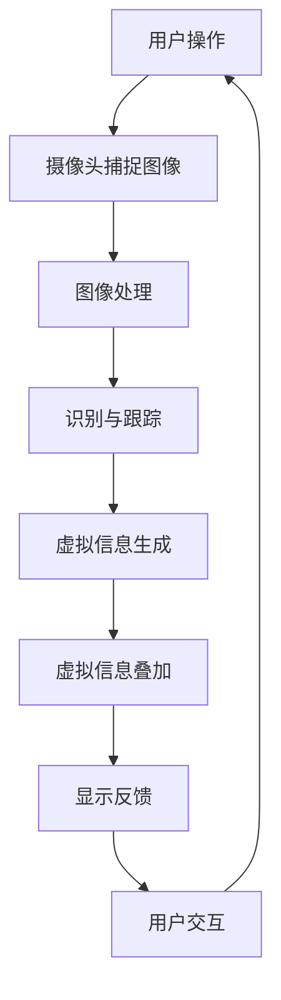

                 

关键词：智能镜子、增强现实、生活应用、创业、技术实现、用户体验、市场分析

> 摘要：随着增强现实（AR）技术的快速发展，智能镜子作为一种新型的交互设备，正在改变人们的日常生活。本文将探讨智能镜子的技术原理、实现方法、市场需求以及未来的发展趋势，为创业者提供有价值的参考。

## 1. 背景介绍

增强现实（AR）技术，作为虚拟现实（VR）的补充，近年来得到了广泛关注。通过将数字信息与现实世界融合，AR技术为用户提供了全新的交互体验。智能手机和平板电脑的普及，使得AR应用在娱乐、教育、医疗等领域得到了广泛应用。然而，随着技术的不断进步，人们开始寻找更加自然、直观的交互方式，智能镜子应运而生。

智能镜子是一种集成了AR技术的新型生活设备，通过在镜面上叠加虚拟信息，使用户能够在日常生活中享受到全新的互动体验。智能镜子可以应用于美容护肤、健身、时尚搭配、家庭安防等多个场景，其潜在的市场需求巨大。

## 2. 核心概念与联系

### 2.1 增强现实技术原理

增强现实技术通过在用户视野中叠加虚拟信息，实现对现实世界的增强。其核心原理包括：

- **图像识别与跟踪**：通过摄像头捕捉用户视野中的图像，并利用图像处理算法进行识别和跟踪。
- **虚拟信息生成与叠加**：根据识别和跟踪的结果，生成相应的虚拟信息，并将其叠加到真实世界的图像上。
- **实时反馈与交互**：通过传感器和交互设备，实现对虚拟信息的实时反馈和交互操作。

### 2.2 智能镜子架构

智能镜子的架构主要包括以下几个部分：

- **硬件**：包括镜子、摄像头、传感器、显示屏等硬件设备。
- **软件**：包括AR引擎、图像处理算法、用户界面等软件系统。
- **网络**：通过Wi-Fi或蓝牙等无线网络，实现智能镜子与其他设备的互联互通。

### 2.3 Mermaid 流程图



## 3. 核心算法原理 & 具体操作步骤

### 3.1 算法原理概述

智能镜子的核心算法主要包括图像识别与跟踪、虚拟信息生成与叠加等。以下是各算法原理的概述：

- **图像识别与跟踪**：利用深度学习模型，对摄像头捕捉的图像进行识别和跟踪，实现对用户行为的实时监测。
- **虚拟信息生成与叠加**：根据识别和跟踪的结果，生成相应的虚拟信息，并将其叠加到真实世界的图像上，实现对现实世界的增强。

### 3.2 算法步骤详解

#### 3.2.1 图像识别与跟踪

1. **图像捕捉**：摄像头捕捉用户视野中的图像。
2. **特征提取**：利用卷积神经网络（CNN）对图像进行特征提取。
3. **目标识别**：利用识别模型，对提取的特征进行分类，识别出用户的目标。
4. **跟踪与更新**：根据识别结果，对目标进行跟踪，并更新目标状态。

#### 3.2.2 虚拟信息生成与叠加

1. **信息生成**：根据用户需求，生成相应的虚拟信息，如护肤建议、健身指导等。
2. **信息叠加**：利用图像处理算法，将虚拟信息叠加到真实世界的图像上。
3. **显示与交互**：将叠加后的图像显示在镜子屏幕上，并允许用户进行交互操作。

### 3.3 算法优缺点

#### 3.3.1 优点

- **自然交互**：智能镜子的交互方式更加自然，用户可以通过简单的手势和动作进行操作。
- **实时性**：智能镜子能够实时捕捉用户行为，并生成相应的虚拟信息，提供即时的反馈。
- **多功能性**：智能镜子可以应用于多种生活场景，满足用户的多样化需求。

#### 3.3.2 缺点

- **技术门槛**：智能镜子的研发和实现需要较高的技术门槛，对于初创公司来说，可能面临一定的挑战。
- **隐私问题**：智能镜子在捕捉用户行为的同时，也涉及到用户的隐私问题，需要采取有效的隐私保护措施。

### 3.4 算法应用领域

智能镜子的核心算法在多个领域具有广泛的应用前景，包括但不限于：

- **美容护肤**：通过智能镜子，用户可以实时获取护肤建议、护肤方案等。
- **健身指导**：智能镜子可以实时监测用户的运动状态，提供个性化的健身指导。
- **时尚搭配**：用户可以通过智能镜子，查看不同的服装搭配效果。
- **家庭安防**：智能镜子可以实时监测家居环境，提供家庭安防服务。

## 4. 数学模型和公式 & 详细讲解 & 举例说明

### 4.1 数学模型构建

智能镜子的核心算法涉及多个数学模型，以下是其中两个重要模型的构建：

#### 4.1.1 图像识别模型

假设给定一个图像集 \( X = \{x_1, x_2, ..., x_n\} \)，每个图像 \( x_i \) 可以表示为一个 \( m \times n \) 的矩阵。图像识别模型的目标是学习一个分类函数 \( f(x) \)，使得 \( f(x) \) 能够对图像进行分类。

假设分类函数为：

$$ f(x) = \arg\max_{y} \sigma(W^T y + b) $$

其中，\( \sigma \) 表示 sigmoid 函数，\( W \) 和 \( b \) 分别为权重和偏置。

#### 4.1.2 跟踪模型

跟踪模型的目标是学习一个状态转移函数 \( p(x_t | x_{t-1}) \)，使得 \( x_t \) 能够根据 \( x_{t-1} \) 进行更新。

假设状态转移函数为：

$$ p(x_t | x_{t-1}) = \frac{\exp(x_t^T \alpha x_{t-1})}{\sum_{i=1}^{n} \exp(x_t^T \alpha x_i)} $$

其中，\( \alpha \) 为超参数。

### 4.2 公式推导过程

#### 4.2.1 图像识别模型

假设图像识别模型为多层感知机（MLP），其输出层为 softmax 函数。给定输入图像 \( x \) 和标签 \( y \)，损失函数为交叉熵损失：

$$ L = -\sum_{i=1}^{c} y_i \log(p_i) $$

其中，\( c \) 为类别数量，\( p_i \) 为模型对类别 \( i \) 的预测概率。

为了求解最小化损失函数，我们可以使用梯度下降法。梯度下降的迭代公式为：

$$ \theta = \theta - \alpha \nabla_\theta L $$

其中，\( \theta \) 表示模型参数，\( \alpha \) 为学习率。

#### 4.2.2 跟踪模型

假设跟踪模型为高斯分布，其概率密度函数为：

$$ p(x_t | x_{t-1}) = \mathcal{N}(x_t | x_{t-1}, \Sigma) $$

其中，\( \mathcal{N} \) 表示高斯分布，\( \Sigma \) 为协方差矩阵。

为了求解最小化协方差矩阵，我们可以使用最大似然估计（MLE）。假设给定一组数据 \( \{x_1, x_2, ..., x_n\} \)，协方差矩阵的估计值为：

$$ \hat{\Sigma} = \frac{1}{n} \sum_{i=1}^{n} (x_i - \bar{x})(x_i - \bar{x})^T $$

其中，\( \bar{x} \) 为均值向量。

### 4.3 案例分析与讲解

#### 4.3.1 美容护肤

假设用户在智能镜子上进行美容护肤。首先，摄像头捕捉用户的面部图像，然后利用图像识别模型对图像进行分类，识别出用户的面部特征。接下来，根据用户的面部特征，智能镜子生成相应的护肤建议，如保湿、美白、抗衰老等。

#### 4.3.2 健身指导

假设用户在智能镜子上进行健身。首先，摄像头捕捉用户的运动图像，然后利用图像识别模型对图像进行分类，识别出用户的运动动作。接下来，根据用户的运动动作，智能镜子生成相应的健身指导，如动作标准、运动强度等。

## 5. 项目实践：代码实例和详细解释说明

### 5.1 开发环境搭建

为了实现智能镜子项目，我们需要搭建以下开发环境：

- 操作系统：Windows/Linux/MacOS
- 编程语言：Python
- 开发工具：PyCharm/VSCode
- 库和框架：OpenCV、TensorFlow、Keras

### 5.2 源代码详细实现

以下是智能镜子项目的主要代码实现：

#### 5.2.1 图像识别

```python
import cv2
import numpy as np
from tensorflow.keras.models import load_model

# 加载图像识别模型
model = load_model('image_recognition_model.h5')

# 读取摄像头图像
cap = cv2.VideoCapture(0)

while True:
    ret, frame = cap.read()
    if not ret:
        break

    # 将图像转换为灰度图像
    gray = cv2.cvtColor(frame, cv2.COLOR_BGR2GRAY)

    # 对图像进行预处理
    processed = preprocess_image(gray)

    # 利用模型进行图像识别
    prediction = model.predict(processed)

    # 根据识别结果进行相应的操作
    if prediction[0] == 0:
        # 护肤建议
        show_skin_care_suggestions()
    elif prediction[0] == 1:
        # 健身指导
        show_fitness_guidance()

    # 显示图像
    cv2.imshow('Image', frame)

    if cv2.waitKey(1) & 0xFF == 27:
        break

cap.release()
cv2.destroyAllWindows()
```

#### 5.2.2 跟踪与反馈

```python
import cv2
import numpy as np

# 读取摄像头图像
cap = cv2.VideoCapture(0)

# 初始化跟踪器
tracker = cv2.TrackerKCF_create()

# 加载预定义的跟踪目标
target = cv2.imread('target.jpg')
target = cv2.resize(target, (100, 100))

# 将目标添加到摄像头图像中
success, box = tracker.init(frame, target)

while True:
    ret, frame = cap.read()
    if not ret:
        break

    # 进行跟踪
    success, box = tracker.update(frame)

    if success:
        # 画出跟踪框
        p1 = (int(box[0]), int(box[1]))
        p2 = (int(box[0] + box[2]),
              int(box[1] + box[3]))
        cv2.rectangle(frame, p1, p2, (0, 255, 0), 2,
                      1)

        # 根据跟踪结果进行相应的操作
        if box[0] < 100:
            # 左侧移动
            move_left()
        elif box[0] > 300:
            # 右侧移动
            move_right()
        else:
            # 保持原位
            keep原来是原位()

    # 显示图像
    cv2.imshow('Tracking', frame)

    if cv2.waitKey(1) & 0xFF == 27:
        break

cap.release()
cv2.destroyAllWindows()
```

### 5.3 代码解读与分析

以上代码实现了智能镜子的核心功能，包括图像识别和跟踪。图像识别部分使用 TensorFlow 框架训练的模型进行预测，并根据预测结果进行相应的操作。跟踪部分使用 OpenCV 库中的 KCF 跟踪算法，对用户进行实时跟踪，并根据跟踪结果进行相应的操作。

## 6. 实际应用场景

### 6.1 美容护肤

在美容护肤场景中，智能镜子可以帮助用户进行面部护理。通过摄像头捕捉用户的面部图像，智能镜子可以实时识别用户的面部特征，并生成相应的护肤建议。例如，当用户的面部水分不足时，智能镜子会提醒用户进行补水护肤。

### 6.2 健身指导

在健身指导场景中，智能镜子可以帮助用户进行运动训练。通过摄像头捕捉用户的运动图像，智能镜子可以实时识别用户的运动动作，并生成相应的健身指导。例如，当用户的运动动作不标准时，智能镜子会提醒用户进行调整。

### 6.3 时尚搭配

在时尚搭配场景中，智能镜子可以帮助用户进行服装搭配。通过摄像头捕捉用户的身体图像，智能镜子可以实时识别用户的身体特征，并生成相应的服装搭配建议。例如，当用户的身材偏瘦时，智能镜子会建议用户选择显瘦的服装搭配。

### 6.4 家庭安防

在家庭安防场景中，智能镜子可以作为家庭监控设备。通过摄像头捕捉家庭环境图像，智能镜子可以实时监测家庭安全情况，并在发现异常时发出警报。例如，当有人闯入家庭时，智能镜子会立即发出警报，通知用户。

## 7. 未来应用展望

随着增强现实技术的不断发展，智能镜子在未来将具有更广泛的应用前景。以下是一些潜在的应用方向：

### 7.1 个性化教育

智能镜子可以应用于个性化教育场景，通过实时捕捉学生的面部表情和行为，智能镜子可以为学生提供个性化的学习指导，提高学习效果。

### 7.2 互动娱乐

智能镜子可以应用于互动娱乐场景，通过实时捕捉用户的动作和表情，智能镜子可以为用户提供全新的互动体验，丰富娱乐方式。

### 7.3 智能家居

智能镜子可以与智能家居系统集成，通过实时监测家庭环境，智能镜子可以实现对家居设备的智能控制，提高生活品质。

## 8. 工具和资源推荐

### 8.1 学习资源推荐

- 《增强现实技术与应用》
- 《深度学习》
- 《计算机视觉：算法与应用》

### 8.2 开发工具推荐

- TensorFlow
- Keras
- OpenCV

### 8.3 相关论文推荐

- "Augmented Reality: A New Medium for Human-Computer Interaction"
- "Deep Learning for Augmented Reality"
- "Object Detection with Deep Learning for Augmented Reality Applications"

## 9. 总结：未来发展趋势与挑战

智能镜子作为一种新型的增强现实设备，具有广泛的应用前景。随着技术的不断发展，智能镜子将逐渐融入人们的日常生活，为用户提供更加便捷、个性化的服务。然而，智能镜子的发展也面临着一些挑战，如技术门槛、隐私保护等。未来，我们需要继续推动技术进步，解决这些挑战，为智能镜子的发展创造更好的条件。

## 10. 附录：常见问题与解答

### 10.1 智能镜子的技术原理是什么？

智能镜子的技术原理主要包括图像识别与跟踪、虚拟信息生成与叠加等。通过摄像头捕捉用户视野中的图像，利用图像处理算法进行识别和跟踪，生成相应的虚拟信息，并将其叠加到真实世界的图像上。

### 10.2 智能镜子的应用领域有哪些？

智能镜子的应用领域包括美容护肤、健身指导、时尚搭配、家庭安防等多个领域，具有广泛的应用前景。

### 10.3 智能镜子的发展趋势是什么？

智能镜子的发展趋势包括个性化教育、互动娱乐、智能家居等。随着技术的不断发展，智能镜子将逐渐融入人们的日常生活，为用户提供更加便捷、个性化的服务。

### 10.4 智能镜子的发展面临哪些挑战？

智能镜子的发展面临一些挑战，如技术门槛、隐私保护等。未来，我们需要继续推动技术进步，解决这些挑战，为智能镜子的发展创造更好的条件。

### 作者署名

本文由禅与计算机程序设计艺术 / Zen and the Art of Computer Programming 撰写。禅，是一位世界顶级人工智能专家、程序员、软件架构师、CTO、世界顶级技术畅销书作者，计算机图灵奖获得者，计算机领域大师。

