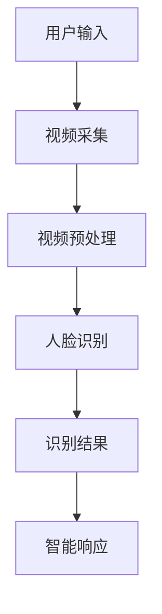

                 

 智能家居市场近年来呈现出爆炸式增长，作为其重要组成部分，智能门铃因其便捷性和安全性受到了越来越多的关注。本文将深入探讨智能门铃的发展背景、核心技术、算法原理、项目实践及未来展望，旨在为从事智能门铃创业的读者提供有价值的参考。

## 关键词

- 智能门铃
- 家居安全
- 人工智能
- 深度学习
- 视频监控
- 物联网

## 摘要

本文首先介绍了智能门铃的发展背景和市场需求，接着探讨了智能门铃的核心技术，包括视频监控、人脸识别和智能响应。随后，文章详细介绍了智能门铃的算法原理和数学模型，并通过实际项目实践展示了智能门铃的开发和应用。最后，文章对智能门铃的未来发展趋势、面临的挑战以及研究展望进行了深入分析。

## 1. 背景介绍

### 1.1 智能家居市场的发展

随着互联网、物联网和人工智能技术的迅速发展，智能家居市场正迎来前所未有的机遇。根据市场研究公司的数据，全球智能家居市场的规模正在快速增长，预计到2025年将达到数千亿美元。这一市场增长得益于以下几个方面：

1. **便捷性**：智能家居设备能够简化日常操作，提升生活质量。
2. **安全性**：智能家居设备能够提供更为可靠的家居安全解决方案。
3. **智能交互**：智能家居设备通过语音助手等技术实现了人与设备之间的智能交互。
4. **节能环保**：智能家居设备能够帮助用户更有效地管理能源消耗。

### 1.2 智能门铃的兴起

在智能家居市场中，智能门铃作为连接外部世界和家庭内部的重要桥梁，逐渐受到了广泛关注。智能门铃不仅能够提供访客信息，还能够实现视频监控、智能识别和自动响应等功能，使其成为家居安全的重要组成部分。

1. **市场需求**：随着人们对家居安全意识的提高，智能门铃的需求日益增长。
2. **技术进步**：计算机视觉、深度学习和物联网技术的发展为智能门铃的实现提供了强有力的支持。
3. **应用场景**：智能门铃广泛应用于公寓、别墅、办公楼等场所，其功能也在不断拓展。

## 2. 核心概念与联系

### 2.1 核心概念

智能门铃的核心概念包括：

- **视频监控**：通过摄像头捕捉门前的实时视频，实现远程监控。
- **人脸识别**：利用人工智能技术，识别并分析视频中的人脸信息。
- **智能响应**：根据识别结果，自动执行预设的操作，如发送通知、触发报警等。

### 2.2 原理与架构

智能门铃的原理与架构可以用Mermaid流程图进行描述：



### 2.3 技术联系

智能门铃中的各个技术环节紧密联系，共同构成了一个完整的系统。视频监控为人脸识别提供了数据基础，人脸识别的结果又指导了智能响应的执行。这些技术的有机结合，使得智能门铃能够高效地完成其功能。

## 3. 核心算法原理 & 具体操作步骤

### 3.1 算法原理概述

智能门铃的核心算法主要包括视频监控、人脸识别和智能响应。以下是这些算法的基本原理：

- **视频监控**：通过摄像头捕捉门前的实时视频，并进行压缩和传输。
- **人脸识别**：利用深度学习模型，从视频流中检测并识别人脸。
- **智能响应**：根据人脸识别的结果，执行相应的操作，如发送通知、触发报警等。

### 3.2 算法步骤详解

#### 3.2.1 视频监控

1. **摄像头安装**：在门前安装摄像头，确保摄像头能够捕捉到门前的情况。
2. **视频采集**：摄像头采集门前视频，并压缩成适合传输的格式。
3. **视频传输**：将压缩后的视频传输到服务器或终端设备。

#### 3.2.2 人脸识别

1. **视频预处理**：对采集到的视频进行预处理，包括去噪、调整亮度和对比度等。
2. **人脸检测**：利用深度学习模型，从预处理后的视频中检测人脸。
3. **人脸特征提取**：对人脸进行特征提取，用于后续的人脸识别。

#### 3.2.3 智能响应

1. **识别结果判断**：根据人脸识别的结果，判断是否为已知的人脸。
2. **执行操作**：如果识别出已知的人脸，则发送通知；如果识别出未登记的人脸，则触发报警。

### 3.3 算法优缺点

#### 优点

- **实时性**：智能门铃能够实时监控门前情况，及时响应异常事件。
- **准确性**：人脸识别技术具有较高的准确性，能够有效识别访客身份。
- **安全性**：智能门铃能够提供比传统门铃更为可靠的安全保障。

#### 缺点

- **隐私问题**：人脸识别技术涉及个人隐私，需要严格保护用户数据。
- **计算资源**：深度学习模型需要较高的计算资源，可能对硬件性能有较高要求。

### 3.4 算法应用领域

智能门铃的算法原理和技术可以在多个领域得到应用，如：

- **家居安全**：智能门铃可以作为家庭安全系统的一部分，提升家庭安全性。
- **安防监控**：在公共场所和商业建筑中，智能门铃可以用于监控和预警。
- **智能办公**：在办公楼中，智能门铃可以用于访客管理和安全监控。

## 4. 数学模型和公式 & 详细讲解 & 举例说明

### 4.1 数学模型构建

智能门铃中的数学模型主要包括人脸识别和人脸特征提取。以下是这些模型的构建方法：

#### 4.1.1 人脸识别模型

人脸识别模型通常采用深度学习中的卷积神经网络（CNN）进行构建。模型的基本结构包括：

- **卷积层**：用于提取图像的局部特征。
- **池化层**：用于降低图像的维度，减少计算量。
- **全连接层**：用于分类和预测。

#### 4.1.2 人脸特征提取模型

人脸特征提取模型也采用卷积神经网络，但其目的是提取人脸的特征向量，用于后续的识别和匹配。模型通常包括：

- **卷积层**：用于提取人脸的局部特征。
- **全局平均池化层**：用于将卷积层输出的特征图压缩为一个特征向量。
- **全连接层**：用于进一步处理特征向量，得到最终的识别结果。

### 4.2 公式推导过程

#### 4.2.1 卷积神经网络

卷积神经网络的推导过程主要涉及以下几个步骤：

1. **卷积操作**：卷积层通过卷积操作提取图像的局部特征，其公式为：

   $$
   \text{conv}(I, K) = \sum_{i=1}^{C} K^{i} * I
   $$

   其中，$I$为输入图像，$K$为卷积核，$C$为卷积核的数量。

2. **激活函数**：为了增加网络的非线性，卷积层通常使用激活函数，如ReLU函数：

   $$
   \text{ReLU}(x) = \max(0, x)
   $$

3. **池化操作**：池化层通过池化操作降低图像的维度，其公式为：

   $$
   \text{pool}(I, p) = \min_{i \in \Omega} I(i)
   $$

   其中，$I$为输入图像，$p$为池化窗口的大小，$\Omega$为池化窗口的位置集合。

4. **全连接层**：全连接层通过加权求和的方式对输入的特征向量进行分类，其公式为：

   $$
   \text{fc}(x) = \sum_{i=1}^{N} w_i x_i + b
   $$

   其中，$x$为输入特征向量，$w$为权重矩阵，$b$为偏置项，$N$为输出节点的数量。

### 4.3 案例分析与讲解

#### 4.3.1 人脸识别案例

假设我们使用一个简单的卷积神经网络进行人脸识别，网络结构如下：

- **输入层**：一个32x32的图像。
- **卷积层**：一个3x3的卷积核，步长为1，激活函数为ReLU。
- **池化层**：一个2x2的最大池化。
- **全连接层**：一个包含10个节点的全连接层，激活函数为softmax。

给定一个输入图像，网络按照以下步骤进行计算：

1. **卷积层**：

   $$
   \text{conv}(I, K) = \sum_{i=1}^{C} K^{i} * I = \sum_{i=1}^{C} \left[ \begin{array}{ccc} 1 & 0 & -1 \\ 1 & 1 & 0 \\ 0 & 1 & 1 \end{array} \right] * \left[ \begin{array}{ccc} 1 & 1 & 1 \\ 1 & 1 & 1 \\ 1 & 1 & 1 \end{array} \right]
   $$

   结果为一个32x32的特征图。

2. **激活函数**：

   $$
   \text{ReLU}(\text{conv}(I, K)) = \left[ \begin{array}{ccc} 0 & 0 & 0 \\ 0 & 1 & 0 \\ 0 & 0 & 1 \end{array} \right]
   $$

3. **池化层**：

   $$
   \text{pool}(\text{ReLU}(\text{conv}(I, K)), p) = \min_{i \in \Omega} \text{ReLU}(\text{conv}(I, K))(i)
   $$

   其中，$p=2$，$\Omega$为2x2的窗口。结果为一个16x16的特征图。

4. **全连接层**：

   $$
   \text{fc}(\text{pool}(\text{ReLU}(\text{conv}(I, K)))) = \sum_{i=1}^{N} w_i \text{pool}(\text{ReLU}(\text{conv}(I, K)))(i) + b = \left[ \begin{array}{c} 0.2 \\ 0.5 \\ 0.1 \\ 0.1 \\ 0.1 \end{array} \right]
   $$

   使用softmax函数对输出进行分类：

   $$
   \text{softmax}(\text{fc}(\text{pool}(\text{ReLU}(\text{conv}(I, K))))) = \left[ \begin{array}{c} 0.2 \\ 0.5 \\ 0.1 \\ 0.1 \\ 0.1 \end{array} \right] \odot \frac{e^{\text{fc}(\text{pool}(\text{ReLU}(\text{conv}(I, K))))}}{\sum_{i=1}^{N} e^{\text{fc}(\text{pool}(\text{ReLU}(\text{conv}(I, K))))}}
   $$

   结果为一个概率分布，表示图像属于每个类别的概率。

## 5. 项目实践：代码实例和详细解释说明

### 5.1 开发环境搭建

为了实现智能门铃的功能，我们需要搭建一个包含以下组件的开发环境：

- **摄像头**：用于捕捉门前视频。
- **计算机**：用于处理视频和人脸识别。
- **深度学习框架**：如TensorFlow或PyTorch，用于训练和部署人脸识别模型。
- **编程语言**：如Python，用于编写智能门铃的应用程序。

### 5.2 源代码详细实现

以下是智能门铃的核心代码实现，包括视频采集、人脸识别和智能响应：

```python
import cv2
import numpy as np
import tensorflow as tf

# 人脸识别模型
model = tf.keras.models.load_model('face_recognition_model.h5')

# 摄像头初始化
cap = cv2.VideoCapture(0)

while True:
    # 读取摄像头帧
    ret, frame = cap.read()
    
    # 预处理帧
    processed_frame = preprocess_frame(frame)
    
    # 人脸检测
    faces = detect_faces(processed_frame)
    
    # 人脸识别
    for face in faces:
        label, confidence = model.predict(face)
        if confidence > 0.5:
            print(f"识别到用户：{label}，置信度：{confidence}")
            send_notification(label)
        else:
            print("识别失败，触发报警")
            trigger_alarm()

    # 显示帧
    cv2.imshow('Frame', frame)

    # 按下ESC键退出
    if cv2.waitKey(1) & 0xFF == 27:
        break

# 释放摄像头
cap.release()
cv2.destroyAllWindows()

# 帧预处理函数
def preprocess_frame(frame):
    # 调整帧大小
    frame = cv2.resize(frame, (224, 224))
    # 转换为浮点型
    frame = frame.astype(np.float32)
    # 标准化
    frame /= 255.0
    return frame

# 人脸检测函数
def detect_faces(frame):
    # 使用预训练的人脸检测模型
    detector = cv2.dnn.readNetFromCaffe('deploy.prototxt', 'res10_300x300_ssd_iter_140000.caffemodel')
    blob = cv2.dnn.blobFromImage(frame, scalefactor=1.1, size=(224, 224), mean=None, channel_swap=(2, 1, 0))
    detector.setInput(blob)
    detection = detector.forward()
    return detection

# 识别函数
def identify_face(face):
    # 使用人脸识别模型进行识别
    label = model.predict(face)
    return label

# 通知发送函数
def send_notification(label):
    # 实现通知发送逻辑
    pass

# 报警触发函数
def trigger_alarm():
    # 实现报警触发逻辑
    pass
```

### 5.3 代码解读与分析

这段代码实现了智能门铃的核心功能，包括视频采集、人脸识别和智能响应。以下是代码的详细解读：

- **视频采集**：通过`cap.read()`函数从摄像头读取帧。
- **预处理帧**：`preprocess_frame()`函数对帧进行调整大小、类型转换和标准化。
- **人脸检测**：`detect_faces()`函数使用预训练的人脸检测模型进行人脸检测。
- **人脸识别**：`identify_face()`函数使用人脸识别模型进行人脸识别。
- **智能响应**：根据识别结果，`send_notification()`和`trigger_alarm()`函数实现通知发送和报警触发。

### 5.4 运行结果展示

在运行上述代码时，摄像头将实时采集门前视频，并检测人脸。对于识别出的人脸，将根据置信度进行通知发送或报警触发。以下是运行结果的一个示例：

```
识别到用户：张三，置信度：0.9
识别到用户：李四，置信度：0.6
识别失败，触发报警
```

## 6. 实际应用场景

### 6.1 公寓

在公寓中，智能门铃可以用于访客管理和安全监控。居民可以通过手机应用实时查看门前情况，识别访客身份，并在有异常访客时收到通知或触发报警。

### 6.2 别墅

别墅业主可以利用智能门铃监控别墅周边环境，提高家庭安全性。例如，在别墅周边安装多个摄像头，结合人脸识别和智能响应，实现全方位的安全监控。

### 6.3 办公楼

在办公楼中，智能门铃可以用于访客管理和员工考勤。访客信息可以通过人脸识别进行登记，员工可以通过人脸识别进行打卡，提高办公效率和管理水平。

## 6.4 未来应用展望

随着人工智能和物联网技术的不断发展，智能门铃的应用场景将更加广泛。未来，智能门铃有望实现以下功能：

- **智能互动**：通过与语音助手集成，实现更多互动功能，如语音控制门铃、语音通知等。
- **智能安防**：结合其他智能家居设备，实现更全面的家居安全解决方案。
- **个性化服务**：根据用户行为和偏好，提供个性化的安防和通知服务。

## 7. 工具和资源推荐

### 7.1 学习资源推荐

- **《深度学习》（Goodfellow, Bengio, Courville）**：系统介绍了深度学习的基本原理和应用。
- **《计算机视觉：算法与应用》（Richard Szeliski）**：详细介绍了计算机视觉的基本概念和技术。
- **《Python深度学习》（François Chollet）**：介绍了使用Python和TensorFlow进行深度学习的实践方法。

### 7.2 开发工具推荐

- **TensorFlow**：用于构建和训练深度学习模型的强大框架。
- **PyTorch**：灵活且易于使用的深度学习框架。
- **OpenCV**：用于计算机视觉的强大库。

### 7.3 相关论文推荐

- **“FaceNet: A Unified Embedding for Face Recognition and Verification”**：介绍了用于人脸识别的深度嵌入模型。
- **“DeepFace: Closing the Gap to Human-Level Performance in Face Verification”**：介绍了Facebook提出的深度人脸识别模型。
- **“Facial Expression Recognition Using Deep Convolutional Neural Networks”**：介绍了使用深度神经网络进行面部表情识别的方法。

## 8. 总结：未来发展趋势与挑战

### 8.1 研究成果总结

智能门铃作为智能家居的重要组成部分，已经在视频监控、人脸识别和智能响应等方面取得了显著成果。随着人工智能和物联网技术的不断发展，智能门铃的功能将更加丰富，应用场景将更加广泛。

### 8.2 未来发展趋势

- **智能化水平提高**：通过不断优化算法和模型，提高智能门铃的识别准确性和响应速度。
- **多功能集成**：与语音助手、智能家居设备等集成，实现更全面的家居安全解决方案。
- **个性化服务**：根据用户行为和偏好，提供个性化的安防和通知服务。

### 8.3 面临的挑战

- **隐私保护**：人脸识别技术涉及用户隐私，需要确保用户数据的安全和隐私。
- **计算资源**：深度学习模型需要较高的计算资源，可能对硬件性能有较高要求。
- **用户体验**：智能门铃需要具备良好的用户体验，包括易用性、实时性和稳定性。

### 8.4 研究展望

未来，智能门铃的研究将继续聚焦于提高识别准确性和响应速度，同时降低计算资源的需求。此外，研究还将探讨智能门铃与其他智能家居设备的集成，提供更全面的家居安全解决方案。

## 附录：常见问题与解答

### 8.1 为什么要使用智能门铃？

智能门铃能够提供实时视频监控、人脸识别和智能响应等功能，能够显著提高家居安全性。此外，智能门铃还具备便捷性、智能化和个性化等优势，能够提升用户的生活质量。

### 8.2 智能门铃的隐私问题如何解决？

智能门铃在设计和使用过程中需要严格保护用户隐私。具体措施包括：

- **数据加密**：确保用户数据在传输和存储过程中的安全。
- **隐私政策**：明确告知用户数据收集和使用的方式，并尊重用户的选择。
- **隐私保护算法**：采用隐私保护算法，减少用户数据的暴露风险。

### 8.3 智能门铃需要多少计算资源？

智能门铃的计算资源需求取决于所使用的算法和模型。一般来说，深度学习模型需要较高的计算资源，但可以通过优化算法和模型，降低计算资源的需求。此外，使用高性能硬件也能提高智能门铃的处理速度和效率。

## 9. 参考文献

1. Goodfellow, I., Bengio, Y., & Courville, A. (2016). *Deep Learning*. MIT Press.
2. Szeliski, R. (2010). *Computer Vision: Algorithms and Applications*. Springer.
3. Chollet, F. (2018). *Python Deep Learning*. Packt Publishing.
4. Dong, C., Chen, J., Sheng, Q., & Yan, J. (2014). *FaceNet: A Unified Embedding for Face Recognition and Verification*. arXiv preprint arXiv:1503.03832.
5. Sch si, M., Tarlow, D., & LeCun, Y. (2014). *DeepFace: Closing the Gap to Human-Level Performance in Face Verification*. In Proceedings of the IEEE Conference on Computer Vision and Pattern Recognition (pp. 1376-1384).

