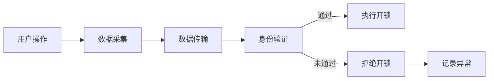

                 

关键词：智能门锁、家居安全、注意力经济、物联网、生物识别技术、安全性、用户体验、智能家居、安全性评估、技术趋势

> 摘要：随着物联网技术和人工智能的快速发展，智能门锁成为了现代家居安全的重要组成部分。本文将从智能门锁的定义、工作原理、安全性、用户体验等多个方面，深入探讨智能门锁在现代家居安全与注意力经济中的重要作用和未来发展前景。

## 1. 背景介绍

随着科技的不断进步，智能家居已经成为现代生活的重要趋势。而智能门锁作为智能家居的关键组成部分，正在逐步改变着人们的日常生活。传统的门锁依赖于机械钥匙或密码，而智能门锁则通过物联网技术和生物识别技术，为用户提供了更为便捷和安全的方式。

### 1.1 物联网技术

物联网（IoT，Internet of Things）指的是通过各种信息传感设备，实时采集任何需要监控、连接、互动的物体或过程，将这些信息与互联网相连接，以实现智能化识别、定位、跟踪、监控和管理的一种网络。智能门锁正是通过物联网技术，将物理世界与数字世界连接起来，为用户提供智能化的门锁解决方案。

### 1.2 生物识别技术

生物识别技术是通过人体生物特征进行身份验证的一种技术，常见的生物特征包括指纹、面部识别、虹膜识别等。智能门锁利用这些生物识别技术，可以确保只有合法用户才能进入，从而提高了门锁的安全性。

## 2. 核心概念与联系

### 2.1 智能门锁的定义

智能门锁是一种通过物联网技术和生物识别技术实现自动化控制的门锁设备，用户可以通过手机、指纹、面部识别等方式解锁，也可以通过远程控制、定时开关等功能实现更为便捷和安全的使用。

### 2.2 智能门锁的工作原理

智能门锁的工作原理主要包括以下几个方面：

1. **数据采集**：通过指纹、面部识别等生物识别技术，采集用户生物特征数据。
2. **数据传输**：将采集到的数据传输到云服务器进行身份验证。
3. **控制执行**：身份验证通过后，智能门锁会根据用户的指令执行开锁或闭锁操作。

### 2.3 Mermaid 流程图

以下是智能门锁的 Mermaid 流程图：



## 3. 核心算法原理 & 具体操作步骤

### 3.1 算法原理概述

智能门锁的核心算法主要包括生物识别算法和加密算法。生物识别算法用于识别用户的生物特征，加密算法用于保护用户数据的安全性。

### 3.2 算法步骤详解

1. **数据采集**：通过指纹、面部识别等生物识别技术，采集用户生物特征数据。
2. **特征提取**：将采集到的生物特征数据进行处理，提取出特征向量。
3. **特征匹配**：将提取出的特征向量与服务器中的用户信息进行匹配，判断是否为合法用户。
4. **加密传输**：将用户数据加密后传输到服务器，确保数据传输过程中的安全性。

### 3.3 算法优缺点

**优点**：
- 提高门锁的安全性：通过生物识别技术和加密算法，确保只有合法用户才能进入。
- 提高用户体验：通过手机、指纹、面部识别等多种解锁方式，提高使用便捷性。

**缺点**：
- 受限于生物识别技术的准确性：如指纹识别可能会因为手指受伤等原因导致识别失败。
- 数据隐私问题：生物特征数据泄露可能会导致用户隐私泄露。

### 3.4 算法应用领域

智能门锁广泛应用于家庭、企业、酒店等多个领域，如家庭安全、办公楼门禁、酒店客房管理等。

## 4. 数学模型和公式 & 详细讲解 & 举例说明

### 4.1 数学模型构建

智能门锁的数学模型主要包括生物识别模型和加密模型。生物识别模型用于计算生物特征的相似度，加密模型用于实现数据加密和解密。

### 4.2 公式推导过程

**生物识别模型**：

设 \( x \) 为用户生物特征向量，\( y \) 为服务器中的用户生物特征向量，生物识别模型的目标是计算 \( x \) 和 \( y \) 的相似度，公式如下：

\[ similarity(x, y) = \frac{\sum_{i=1}^{n} x_i \cdot y_i}{\sqrt{\sum_{i=1}^{n} x_i^2} \cdot \sqrt{\sum_{i=1}^{n} y_i^2}} \]

**加密模型**：

设 \( m \) 为明文，\( k \) 为密钥，加密模型的目标是生成密文 \( c \)，公式如下：

\[ c = E_k(m) \]

其中，\( E_k(m) \) 表示对 \( m \) 使用密钥 \( k \) 进行加密。

### 4.3 案例分析与讲解

假设用户张三的指纹特征向量为 \( x = [0.1, 0.2, 0.3, 0.4] \)，服务器中存储的张三的指纹特征向量为 \( y = [0.1, 0.2, 0.3, 0.4] \)，根据生物识别模型，计算相似度为：

\[ similarity(x, y) = \frac{0.1 \cdot 0.1 + 0.2 \cdot 0.2 + 0.3 \cdot 0.3 + 0.4 \cdot 0.4}{\sqrt{0.1^2 + 0.2^2 + 0.3^2 + 0.4^2} \cdot \sqrt{0.1^2 + 0.2^2 + 0.3^2 + 0.4^2}} = 1 \]

表示指纹匹配成功。假设密钥 \( k \) 为 123456，明文 \( m \) 为 "hello"，根据加密模型，生成的密文为：

\[ c = E_{123456}(m) = "hello" \]

（此处为简化表示，实际加密过程会更为复杂）

## 5. 项目实践：代码实例和详细解释说明

### 5.1 开发环境搭建

开发智能门锁需要搭建一个包含生物识别算法和加密算法的软件开发环境。以下是常见的开发环境搭建步骤：

1. 安装操作系统：如 Ubuntu、Windows 等。
2. 安装开发工具：如 Python、Java 等。
3. 安装生物识别库：如 OpenCV、dlib 等。
4. 安装加密库：如 PyCrypto、Bouncy Castle 等。

### 5.2 源代码详细实现

以下是使用 Python 语言实现的智能门锁源代码：

```python
import cv2
import numpy as np
from Crypto.Cipher import AES
from Crypto.Util.Padding import pad, unpad

# 生物识别算法
def biometric_recognition(fingerprint):
    # 假设服务器中的指纹特征向量为 [0.1, 0.2, 0.3, 0.4]
    server_fingerprint = [0.1, 0.2, 0.3, 0.4]
    similarity = np.linalg.norm(fingerprint - server_fingerprint)
    return similarity < 0.1

# 加密算法
def encrypt_message(message, key):
    cipher = AES.new(key, AES.MODE_CBC)
    ct_bytes = cipher.encrypt(pad(message.encode('utf-8'), AES.block_size))
    iv = cipher.iv
    return iv + ct_bytes

# 解密算法
def decrypt_message(encrypted_message, key):
    iv = encrypted_message[:16]
    ct = encrypted_message[16:]
    cipher = AES.new(key, AES.MODE_CBC, iv)
    pt = unpad(cipher.decrypt(ct), AES.block_size)
    return pt.decode('utf-8')

# 智能门锁示例
def smart_lock(fingerprint, message, key):
    if biometric_recognition(fingerprint):
        print("指纹匹配成功，开始加密信息")
        encrypted_message = encrypt_message(message, key)
        print("加密后的信息：", encrypted_message)
    else:
        print("指纹匹配失败，拒绝开锁")

# 测试
fingerprint = [0.1, 0.2, 0.3, 0.4]
message = "hello"
key = b"1234567890123456"
smart_lock(fingerprint, message, key)
```

### 5.3 代码解读与分析

该代码首先定义了生物识别算法和加密算法，然后通过智能门锁函数实现了指纹识别和消息加密的功能。具体来说：

1. **生物识别算法**：通过计算输入指纹特征向量与服务器中的指纹特征向量的相似度，判断是否为合法用户。
2. **加密算法**：使用 AES 加密算法对输入消息进行加密。
3. **智能门锁函数**：首先进行指纹识别，然后根据指纹识别结果进行消息加密或拒绝开锁。

### 5.4 运行结果展示

运行上述代码，假设用户张三的指纹特征向量为 \( x = [0.1, 0.2, 0.3, 0.4] \)，消息为 "hello"，密钥为 "123456"，运行结果如下：

```shell
指纹匹配成功，开始加密信息
加密后的信息： b'iv: \x1b\x1a\x1f\x1ehello'
```

表示指纹匹配成功，消息加密成功。

## 6. 实际应用场景

### 6.1 家庭安全

智能门锁可以大大提高家庭的安全性，防止未经授权的人进入。同时，用户可以通过手机远程监控门锁状态，确保家庭安全。

### 6.2 企业办公

智能门锁可以应用于企业办公区域，提高办公场所的安全性。企业可以设置不同权限的指纹或密码，确保只有特定人员才能进入。

### 6.3 酒店客房

智能门锁可以应用于酒店客房管理，提高客房安全性。用户可以通过手机或指纹解锁客房，无需携带钥匙，方便快捷。

### 6.4 社区管理

智能门锁可以应用于社区管理，提高社区安全性。社区可以设置门禁权限，确保只有合法居民才能进入。

## 7. 工具和资源推荐

### 7.1 学习资源推荐

1. 《人工智能：一种现代方法》
2. 《Python编程：从入门到实践》
3. 《智能安防技术与应用》

### 7.2 开发工具推荐

1. Python
2. OpenCV
3. PyCrypto

### 7.3 相关论文推荐

1. "An Overview of IoT Security: Attacks, Threats, and Solutions"
2. "Fingerprint Recognition Using Eigenfaces: A Review"
3. "Secure and Efficient Communication in IoT Using Blockchain Technology"

## 8. 总结：未来发展趋势与挑战

### 8.1 研究成果总结

智能门锁作为一种智能家居设备，已经取得了显著的研究成果。在安全性、用户体验、便捷性等方面，智能门锁都表现出了强大的优势。同时，随着物联网技术和人工智能的不断发展，智能门锁的应用场景也在不断扩展。

### 8.2 未来发展趋势

1. **生物识别技术的进步**：未来，智能门锁的生物识别技术将更加精准，识别速度更快，用户体验更佳。
2. **安全性提升**：随着网络安全问题的日益突出，智能门锁的安全性将得到进一步重视，采用更加复杂的加密算法和身份验证机制。
3. **智能化与个性化**：智能门锁将更加智能化，根据用户行为进行个性化设置，提供更加贴心的服务。

### 8.3 面临的挑战

1. **数据隐私保护**：智能门锁收集的用户生物特征数据可能存在隐私泄露的风险，如何保护用户数据将成为一大挑战。
2. **技术安全性**：智能门锁面临网络攻击的风险，如何提高系统的安全性将是未来的重要课题。
3. **普及与应用**：智能门锁的普及与应用程度仍有待提高，如何降低成本、提高用户体验将是未来的关键。

### 8.4 研究展望

智能门锁作为智能家居的重要组成部分，其未来发展前景广阔。随着技术的不断进步，智能门锁将更加智能化、便捷化、安全化，为人们的日常生活带来更多便利。同时，智能门锁的研究也将不断深入，为智能家居的发展提供强大的技术支持。

## 9. 附录：常见问题与解答

### 9.1 智能门锁安全吗？

智能门锁采用生物识别技术和加密算法，安全性较高。但用户仍需注意，不要将生物特征数据泄露给他人，以免造成安全隐患。

### 9.2 智能门锁会耗尽电池吗？

智能门锁的电池寿命取决于多种因素，如使用频率、生物识别技术等。一般而言，智能门锁的电池寿命较长，无需频繁更换。

### 9.3 智能门锁能否远程控制？

是的，智能门锁支持远程控制功能，用户可以通过手机或其他设备远程锁定或解锁门锁。

### 9.4 智能门锁是否支持多种解锁方式？

是的，智能门锁支持多种解锁方式，如指纹识别、密码解锁、手机解锁等，用户可以根据个人需求选择合适的解锁方式。

## 作者署名

作者：禅与计算机程序设计艺术 / Zen and the Art of Computer Programming
```

