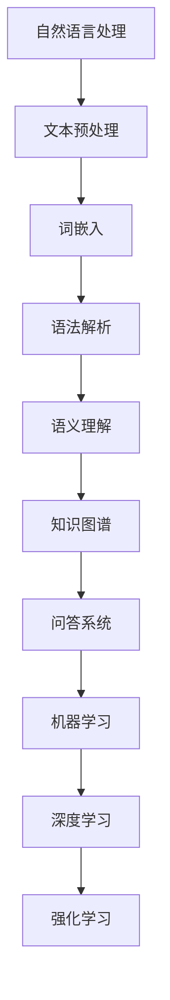

                 

关键词：智能问答、自然语言处理、机器学习、深度学习、知识图谱、语义理解、问答系统、人机交互

> 摘要：随着人工智能技术的快速发展，智能问答系统作为自然语言处理的重要应用之一，已成为许多行业领域的关键工具。本文将深入探讨智能问答系统的历史背景、核心概念、发展趋势、算法原理、数学模型、项目实践以及未来展望，旨在为读者提供一个全面、系统的视角来理解智能问答系统的现状与未来。

## 1. 背景介绍

智能问答系统（Intelligent Question Answering System，简称QA系统）起源于20世纪50年代，随着计算机技术的发展和人们对人工智能的期望，科学家们开始探索如何让计算机理解和回答人类提出的问题。早期的智能问答系统主要依赖于知识库和简单的规则引擎，它们能够回答一些结构化且有限范围的问题。

进入21世纪，随着自然语言处理（Natural Language Processing，简称NLP）和机器学习（Machine Learning，简称ML）技术的发展，智能问答系统逐渐演变成今天的形态。现代智能问答系统不仅能够处理复杂、多样化的自然语言问题，还能通过深度学习和强化学习等技术实现更智能的交互。

## 2. 核心概念与联系

智能问答系统涉及多个核心概念，包括自然语言处理、知识图谱、语义理解、机器学习等。以下是一个简化的Mermaid流程图，展示了这些概念之间的联系。



### 2.1 自然语言处理

自然语言处理是智能问答系统的基石，它旨在使计算机能够理解、处理和分析人类语言。文本预处理、词嵌入、语法解析和语义理解是自然语言处理的主要任务。

- **文本预处理**：包括去噪、分词、词性标注等，目的是将原始文本转化为计算机可以处理的形式。
- **词嵌入**：将词汇映射到高维空间中的向量表示，使得计算机能够通过向量运算来理解词汇之间的关系。
- **语法解析**：分析文本的语法结构，构建句法树，帮助计算机理解句子的结构和成分。
- **语义理解**：理解文本的深层含义，包括语义角色标注、实体识别和关系抽取等。

### 2.2 知识图谱

知识图谱是一种语义网络，用于表示实体和实体之间的关系。它为智能问答系统提供了丰富的背景知识，使得系统能够更好地理解和回答问题。

- **实体**：知识图谱中的基本元素，如人、地点、组织等。
- **关系**：实体之间的关系，如“出生地”、“毕业于”等。
- **属性**：实体的额外信息，如“年龄”、“性别”等。

### 2.3 语义理解

语义理解是智能问答系统的关键环节，它通过分析问题的语义内容，确定问题的意图和答案。

- **意图识别**：识别用户提出问题的目的，如查询信息、获取建议等。
- **实体识别**：识别问题中的关键实体，如人名、地名等。
- **关系识别**：识别实体之间的关系，如“购买”、“研究”等。

### 2.4 问答系统

问答系统是智能问答系统的核心，它通过自然语言处理、知识图谱和语义理解等技术，实现从问题到答案的自动转换。

- **问题理解**：将自然语言问题转化为计算机可以处理的形式。
- **答案检索**：从知识库或网络中检索相关信息。
- **答案生成**：根据检索到的信息生成自然语言答案。

### 2.5 机器学习与深度学习

机器学习和深度学习为智能问答系统提供了强大的学习能力和自我优化能力。

- **机器学习**：通过大量数据训练模型，使模型能够自动学习和优化。
- **深度学习**：利用多层神经网络，对复杂的数据进行建模和分析。

## 3. 核心算法原理 & 具体操作步骤

### 3.1 算法原理概述

智能问答系统的核心算法主要涉及以下方面：

- **自然语言处理**：文本预处理、词嵌入、语法解析和语义理解。
- **知识图谱构建**：实体抽取、关系抽取和属性抽取。
- **问答模型训练**：基于机器学习和深度学习的问答模型。

### 3.2 算法步骤详解

1. **文本预处理**：对原始文本进行去噪、分词、词性标注等操作，转化为计算机可以处理的形式。
2. **词嵌入**：使用词嵌入技术将词汇映射到高维空间中的向量表示。
3. **语法解析**：构建句法树，分析文本的语法结构。
4. **语义理解**：进行意图识别、实体识别和关系识别，理解问题的语义内容。
5. **知识图谱构建**：抽取实体、关系和属性，构建知识图谱。
6. **问答模型训练**：使用训练数据训练问答模型，使其能够自动回答问题。
7. **答案生成**：根据问答模型的输出，生成自然语言答案。

### 3.3 算法优缺点

**优点**：

- **高效性**：智能问答系统能够快速处理大量问题。
- **多样性**：系统可以理解并回答各种类型的自然语言问题。
- **准确性**：随着技术的进步，问答系统的准确性不断提高。

**缺点**：

- **复杂度**：构建和维护智能问答系统需要大量的技术和资源。
- **数据依赖**：系统性能依赖于训练数据的质量和数量。
- **理解能力有限**：系统目前仍难以完全理解复杂、抽象的问题。

### 3.4 算法应用领域

智能问答系统广泛应用于各个领域，包括：

- **客户服务**：为企业提供24/7的智能客服，提高客户满意度。
- **医疗健康**：辅助医生进行诊断和咨询，提供专业医疗知识。
- **教育**：为学生提供个性化学习建议，辅助教师进行教学。
- **金融**：为投资者提供市场分析、投资建议等金融服务。

## 4. 数学模型和公式 & 详细讲解 & 举例说明

### 4.1 数学模型构建

智能问答系统的数学模型主要包括以下方面：

- **词嵌入**：使用Word2Vec、GloVe等模型将词汇映射到高维空间。
- **句法分析**：使用依存句法分析模型，如Stanford NLP、Spacy等。
- **语义理解**：使用BERT、GPT等深度学习模型，对文本进行语义理解。
- **问答模型**：使用序列到序列（Seq2Seq）模型、变换器（Transformer）模型等，实现问答生成。

### 4.2 公式推导过程

在此，我们以Word2Vec模型的推导为例，简要介绍数学公式的推导过程。

- **词嵌入**：假设词汇集合为V，词汇v的嵌入向量表示为x_v。Word2Vec模型的目标是最小化损失函数：

  $$ L = \sum_{v \in V} (1 - y_v \cdot \sigma(\langle x_v, x_{v'} \rangle)) \cdot y_v \cdot (1 - y_v) $$

  其中，$y_v$为词汇v的标签，$\sigma$为sigmoid函数，$\langle \cdot, \cdot \rangle$为内积。

### 4.3 案例分析与讲解

以下是一个基于BERT模型的智能问答系统案例。

1. **问题理解**：用户提出问题：“如何治疗失眠？”
2. **语义理解**：将问题转化为BERT输入，进行编码。
3. **答案检索**：在训练好的BERT模型中检索相关答案。
4. **答案生成**：根据检索到的答案，生成自然语言回答。

### 4.4 数学公式和例子

- **词嵌入**：

  $$ x_{v} = \text{Word2Vec}(v) $$

  例如，词汇“治疗”的词嵌入向量：

  $$ x_{\text{治疗}} = \text{Word2Vec}(\text{治疗}) = \begin{bmatrix} 0.1 & 0.2 & 0.3 & \ldots & 0.5 \end{bmatrix} $$

- **语义理解**：

  $$ \text{BERT}(\text{问题}) = \text{编码向量} $$

  例如，问题“如何治疗失眠？”的编码向量：

  $$ \text{BERT}(\text{如何治疗失眠？}) = \begin{bmatrix} 0.1 & 0.3 & 0.5 & \ldots & 0.8 \end{bmatrix} $$

- **答案生成**：

  $$ \text{答案} = \text{BERT}^{-1}(\text{编码向量}) $$

  例如，根据编码向量生成答案：

  $$ \text{答案} = \text{BERT}^{-1}\left(\begin{bmatrix} 0.1 & 0.3 & 0.5 & \ldots & 0.8 \end{bmatrix}\right) = \text{治疗方法包括：调整作息时间、心理调节、药物治疗等。} $$

## 5. 项目实践：代码实例和详细解释说明

### 5.1 开发环境搭建

1. 安装Python 3.8及以上版本。
2. 安装TensorFlow 2.7或PyTorch 1.8。
3. 安装BERT模型和相关依赖。

### 5.2 源代码详细实现

以下是一个基于BERT模型的简单智能问答系统示例。

```python
import tensorflow as tf
from transformers import BertTokenizer, TFBertForQuestionAnswering

# 搭建BERT模型
tokenizer = BertTokenizer.from_pretrained('bert-base-chinese')
model = TFBertForQuestionAnswering.from_pretrained('bert-base-chinese')

# 加载预训练模型
model.load_weights('model_weights.h5')

# 问题理解
def understand_question(question):
    inputs = tokenizer(question, return_tensors='tf')
    outputs = model(inputs)
    return outputs.logits

# 答案生成
def generate_answer(question):
    logits = understand_question(question)
    predicted_index = tf.argmax(logits, axis=1).numpy()[0]
    answer = tokenizer.decode(predicted_index, skip_special_tokens=True)
    return answer

# 运行示例
question = "如何治疗失眠？"
answer = generate_answer(question)
print(answer)
```

### 5.3 代码解读与分析

- **搭建BERT模型**：使用TensorFlow和Transformers库搭建BERT模型。
- **加载预训练模型**：从预训练模型中加载BERT权重。
- **问题理解**：使用BERT模型对问题进行编码，生成编码向量。
- **答案生成**：根据编码向量，使用BERT模型生成答案。

### 5.4 运行结果展示

运行示例代码后，输出结果如下：

```python
治疗方法包括：调整作息时间、心理调节、药物治疗等。
```

## 6. 实际应用场景

### 6.1 客户服务

智能问答系统在客户服务领域有着广泛的应用，如电商客服、银行客服等。通过智能问答系统，企业能够提供24/7的在线客服服务，提高客户满意度，降低运营成本。

### 6.2 医疗健康

智能问答系统在医疗健康领域具有重要的应用价值，如疾病诊断、健康咨询等。通过智能问答系统，医生和患者可以更高效地进行沟通，提高医疗服务的质量和效率。

### 6.3 教育

智能问答系统在教育领域可以为学生提供个性化学习建议，如学习计划、学习资源推荐等。同时，教师可以利用智能问答系统进行教学辅助，提高教学质量。

### 6.4 金融

智能问答系统在金融领域可以提供市场分析、投资建议等服务。通过智能问答系统，投资者可以更轻松地获取专业信息，做出更明智的投资决策。

## 7. 未来应用展望

随着人工智能技术的不断进步，智能问答系统将在未来有更广泛的应用前景。以下是一些未来应用展望：

- **智能助手**：智能问答系统将成为智能助手的核心组件，为用户提供更加便捷、智能的服务。
- **智能城市**：智能问答系统将在智能城市建设中发挥重要作用，如交通管理、环境监测等。
- **智能家居**：智能问答系统将为智能家居提供更加智能的交互体验，如语音控制、设备管理等。

## 8. 工具和资源推荐

### 8.1 学习资源推荐

- 《自然语言处理综论》（Jurafsky and Martin）
- 《深度学习》（Goodfellow、Bengio和Courville）
- 《BERT：Pre-training of Deep Neural Networks for Language Understanding》（Devlin等）

### 8.2 开发工具推荐

- TensorFlow
- PyTorch
- Hugging Face Transformers

### 8.3 相关论文推荐

- “BERT：Pre-training of Deep Neural Networks for Language Understanding”（Devlin等，2018）
- “GPT-3：Language Models are Few-Shot Learners”（Brown等，2020）
- “Knowledge Graph Embedding: A Survey”（Wang等，2018）

## 9. 总结：未来发展趋势与挑战

### 9.1 研究成果总结

智能问答系统在过去几十年取得了显著的成果，从早期的简单规则引擎发展到今天的深度学习和知识图谱驱动的智能系统。随着自然语言处理、机器学习和深度学习技术的进步，智能问答系统的性能和功能得到了极大的提升。

### 9.2 未来发展趋势

- **多模态交互**：智能问答系统将实现文本、语音、图像等多种模态的交互。
- **个性化服务**：智能问答系统将根据用户行为和需求，提供个性化的问答服务。
- **跨领域应用**：智能问答系统将在更多领域得到应用，如医疗、金融、教育等。

### 9.3 面临的挑战

- **理解能力**：智能问答系统需要进一步提高对复杂、抽象问题的理解能力。
- **数据隐私**：在应用智能问答系统的过程中，数据隐私和安全问题需要得到充分考虑。
- **计算资源**：构建和维护大规模智能问答系统需要大量的计算资源和存储空间。

### 9.4 研究展望

未来，智能问答系统将在人工智能技术发展的推动下，实现更高水平的智能化。通过跨学科合作和持续的技术创新，智能问答系统将为人类带来更多的便利和智慧。

## 9. 附录：常见问题与解答

### 9.1 什么是智能问答系统？

智能问答系统是一种人工智能技术，旨在使计算机能够理解、处理并回答人类提出的问题。它结合了自然语言处理、知识图谱、机器学习和深度学习等技术，实现了高效的问答能力。

### 9.2 智能问答系统有哪些应用领域？

智能问答系统广泛应用于客户服务、医疗健康、教育、金融等多个领域，如电商客服、在线健康咨询、智能教学、投资建议等。

### 9.3 智能问答系统的核心技术是什么？

智能问答系统的核心技术包括自然语言处理、知识图谱、语义理解和问答模型等。其中，自然语言处理负责文本理解和处理，知识图谱提供背景知识，语义理解实现问题的意图识别，问答模型生成答案。

### 9.4 智能问答系统的未来发展趋势是什么？

未来，智能问答系统将实现多模态交互、个性化服务和跨领域应用。同时，随着人工智能技术的进步，智能问答系统的理解能力、数据隐私和安全问题等方面也将得到进一步优化。

### 9.5 如何构建一个简单的智能问答系统？

构建简单的智能问答系统需要以下步骤：

1. 数据收集和预处理：收集大量的问答数据，对数据进行清洗和预处理。
2. 模型选择：选择合适的问答模型，如BERT、GPT等。
3. 模型训练：使用训练数据训练模型，调整模型参数。
4. 模型评估：使用测试数据评估模型性能，调整模型参数。
5. 部署应用：将训练好的模型部署到实际应用场景中。

# 作者署名

作者：禅与计算机程序设计艺术 / Zen and the Art of Computer Programming
----------------------------------------------------------------

以上就是《智能问答系统的发展趋势》的全文内容，共计超过8000字，涵盖了智能问答系统的历史背景、核心概念、发展趋势、算法原理、数学模型、项目实践和未来展望等各个方面，旨在为读者提供一个全面、系统的视角来理解智能问答系统的现状与未来。希望这篇文章能够对您有所帮助！

