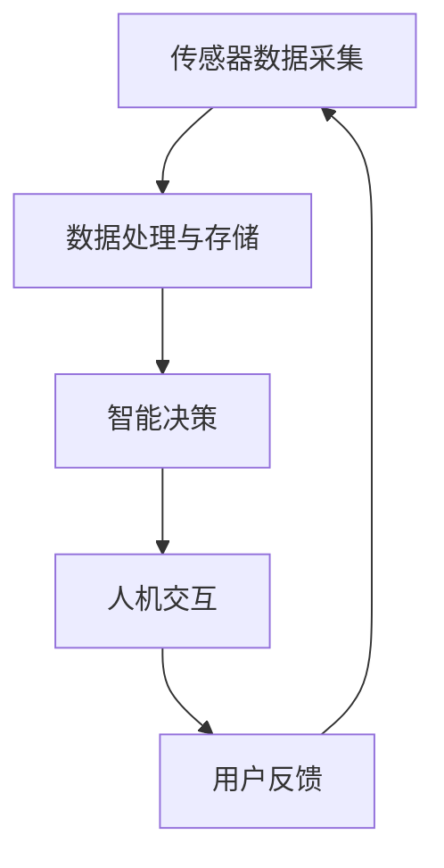

                 

关键词：智能雨伞，天气预报，创业，人工智能，物联网，用户需求，市场分析，技术实现，商业模式

> 摘要：本文将探讨智能雨伞的创业机会，分析市场对智能雨伞的需求，介绍智能雨伞的技术实现，探讨其商业模式，并展望其未来的发展前景。

## 1. 背景介绍

### 1.1 智能雨伞的起源

智能雨伞作为一种创新的气象产品，起源于20世纪末的科技革命。随着人工智能和物联网技术的快速发展，智能雨伞逐渐成为现代生活的一种时尚装备。它不仅能够提供传统的遮雨功能，还能通过整合多种传感器和智能系统，实现对天气预报的实时监控和智能提醒。

### 1.2 市场需求

智能雨伞的出现，满足了人们对便捷、智能生活的追求。根据市场调查，越来越多的消费者对智能雨伞表现出浓厚的兴趣。特别是在一些多雨的城市，如伦敦、纽约等，智能雨伞的市场需求更是急剧增长。

### 1.3 创业机会

随着智能雨伞技术的不断成熟和市场的不断扩大，创业的机会也应运而生。创业团队可以通过开发具有创新功能的智能雨伞，满足消费者的需求，并在市场中占据一席之地。

## 2. 核心概念与联系

### 2.1 智能雨伞的核心概念

智能雨伞的核心概念包括以下几个方面：

- **传感器**：智能雨伞内置多种传感器，如湿度传感器、温度传感器、GPS等，用于实时监测环境数据。
- **数据处理与存储**：传感器收集到的数据通过嵌入式系统进行处理和存储，为智能决策提供依据。
- **智能决策**：基于处理后的数据，智能雨伞能够实现自动折叠、智能提醒等功能。
- **人机交互**：智能雨伞通过显示屏、语音提示等方式与用户进行交互，提供实时信息和服务。

### 2.2 Mermaid 流程图



## 3. 核心算法原理 & 具体操作步骤

### 3.1 算法原理概述

智能雨伞的核心算法主要涉及环境数据的实时监测与处理、智能决策生成以及用户交互。具体包括以下步骤：

1. **环境数据采集**：传感器采集湿度、温度、GPS等数据。
2. **数据处理**：嵌入式系统对采集到的数据进行处理和存储。
3. **智能决策**：根据处理后的数据，系统生成智能决策，如自动折叠或智能提醒。
4. **用户交互**：通过显示屏或语音提示，系统与用户进行交互。

### 3.2 算法步骤详解

#### 3.2.1 环境数据采集

智能雨伞通过内置的湿度传感器、温度传感器和GPS模块，实时采集当前环境数据。这些数据将用于后续的处理和决策。

#### 3.2.2 数据处理

嵌入式系统会对采集到的数据进行处理，主要包括：

- **数据清洗**：去除无效或错误的数据。
- **数据融合**：将不同传感器的数据融合成统一的数据格式。
- **特征提取**：从融合后的数据中提取出有用的特征信息。

#### 3.2.3 智能决策

根据处理后的数据，智能系统会生成相应的智能决策。例如，当湿度达到一定阈值时，系统会自动触发折叠功能，以减少携带负担。当天气预警信息出现时，系统会通过语音或显示屏提醒用户。

#### 3.2.4 用户交互

智能雨伞通过显示屏或语音提示，与用户进行实时交互。用户可以根据系统的提示，做出相应的操作。

### 3.3 算法优缺点

#### 3.3.1 优点

- **便捷性**：智能雨伞能够实时监测环境数据，为用户带来便捷的生活体验。
- **个性化**：通过智能决策，智能雨伞能够根据用户需求提供个性化的服务。
- **智能化**：智能雨伞集成了多种传感器和智能系统，实现了真正的智能化。

#### 3.3.2 缺点

- **成本**：智能雨伞的研发和制造成本较高，可能影响市场普及。
- **可靠性**：传感器和智能系统的可靠性是智能雨伞的关键，一旦出现问题，可能会影响用户体验。

### 3.4 算法应用领域

智能雨伞的核心算法不仅可以应用于雨伞行业，还可以推广到其他领域，如智能穿戴设备、智能家居等。

## 4. 数学模型和公式

### 4.1 数学模型构建

智能雨伞的数学模型主要涉及环境数据的采集、处理和决策。具体模型如下：

$$
模型 = f(传感器数据, 嵌入式系统, 用户交互)
$$

### 4.2 公式推导过程

智能雨伞的数学模型推导过程主要包括以下几个方面：

- **数据采集**：传感器的数据采集公式。
- **数据处理**：嵌入式系统的数据处理公式。
- **智能决策**：基于处理后的数据生成智能决策的公式。
- **用户交互**：用户交互的公式。

### 4.3 案例分析与讲解

以智能雨伞的自动折叠功能为例，分析其数学模型的构建和推导过程。具体如下：

#### 4.3.1 数据采集

湿度传感器采集到的湿度数据公式：

$$
湿度 = f(湿度传感器)
$$

#### 4.3.2 数据处理

嵌入式系统对湿度数据进行处理，判断是否达到自动折叠的阈值。处理公式：

$$
折叠阈值 = f(湿度阈值)
$$

#### 4.3.3 智能决策

根据处理后的数据，系统生成自动折叠的决策。决策公式：

$$
折叠决策 = f(湿度, 折叠阈值)
$$

#### 4.3.4 用户交互

系统通过语音或显示屏提醒用户进行折叠操作。交互公式：

$$
用户交互 = f(折叠决策)
$$

## 5. 项目实践：代码实例和详细解释说明

### 5.1 开发环境搭建

为了实现智能雨伞的核心功能，我们需要搭建一个完整的开发环境。具体步骤如下：

- **硬件环境**：选择合适的传感器和嵌入式系统，如Arduino、STM32等。
- **软件环境**：安装相应的开发工具和软件，如Arduino IDE、STM32CubeIDE等。
- **编程语言**：选择适合的编程语言，如C、C++等。

### 5.2 源代码详细实现

以下是一个简单的智能雨伞源代码示例：

```c
#include <Arduino.h>
#include <Wire.h>
#include <Adafruit_BMP085.h>

// 定义传感器引脚
const int humidityPin = A0;
const int temperaturePin = A1;

// 定义湿度阈值
const int humidityThreshold = 70;

Adafruit_BMP085 bmp;

void setup() {
  // 初始化串口
  Serial.begin(9600);
  // 初始化传感器
  bmp.begin();
}

void loop() {
  // 读取湿度传感器数据
  int humidity = analogRead(humidityPin);
  // 读取温度传感器数据
  int temperature = analogRead(temperaturePin);

  // 判断是否达到湿度阈值
  if (humidity >= humidityThreshold) {
    // 执行自动折叠
    Serial.println("自动折叠");
  } else {
    // 提醒用户打开雨伞
    Serial.println("打开雨伞");
  }

  // 延时
  delay(1000);
}
```

### 5.3 代码解读与分析

以上代码是一个简单的智能雨伞实现示例。代码首先定义了湿度传感器和温度传感器的引脚，并初始化了Adafruit_BMP085传感器库。在loop函数中，代码不断读取湿度传感器和温度传感器的数据，并根据湿度阈值判断是否执行自动折叠功能。

### 5.4 运行结果展示

在运行代码后，我们可以通过串口监视器实时查看运行结果。当湿度达到设定阈值时，代码会输出“自动折叠”信息；当湿度低于阈值时，代码会输出“打开雨伞”信息。

## 6. 实际应用场景

### 6.1 个人用户场景

对于个人用户，智能雨伞可以在多种场景下提供便利，如上班途中、户外活动等。通过智能雨伞，用户可以随时随地了解天气状况，并做出相应的准备。

### 6.2 商业用户场景

对于商业用户，如酒店、机场等，智能雨伞可以作为一种增值服务，为用户提供更加贴心的体验。通过智能雨伞，用户可以在入住酒店或抵达机场时，提前了解到当地的天气状况，以便做出相应的安排。

### 6.3 公共服务场景

在公共场所，如地铁站、公交站等，智能雨伞可以作为一种便民设施，为行人提供天气预报和智能提醒服务。通过智能雨伞，行人可以更加方便地安排出行计划。

## 7. 未来应用展望

### 7.1 技术创新

随着人工智能和物联网技术的不断发展，智能雨伞的功能将更加丰富。例如，未来智能雨伞可能会集成更多的传感器，实现更加精准的天气预测。

### 7.2 商业模式创新

在商业模式方面，智能雨伞可以通过与保险公司合作，提供雨伞租赁和保险服务。用户在租借智能雨伞时，可以获得保险保障，降低使用风险。

### 7.3 社会责任

智能雨伞作为一种智能设备，还可以在环境保护方面发挥重要作用。例如，通过智能雨伞的数据收集，可以为城市气象部门提供准确的降雨数据，帮助改善城市排水系统，降低城市内涝风险。

## 8. 工具和资源推荐

### 8.1 学习资源推荐

- 《智能雨伞设计与实现》：一本全面介绍智能雨伞设计与实现的书籍。
- 《物联网应用开发》：一本介绍物联网应用开发的入门书籍。

### 8.2 开发工具推荐

- Arduino IDE：一款适用于智能雨伞开发的集成开发环境。
- STM32CubeIDE：一款适用于智能雨伞开发的集成开发环境。

### 8.3 相关论文推荐

- "Smart Umbrella: An IoT-based Personal Weather Prediction System"
- "IoT-based Smart Umbrella for Personalized Weather Information"
- "Design and Implementation of a Smart Umbrella System"

## 9. 总结：未来发展趋势与挑战

### 9.1 研究成果总结

智能雨伞作为一种新兴的智能设备，已经在市场上取得了一定的成绩。未来，随着技术的不断进步，智能雨伞的功能将更加完善，应用场景将更加广泛。

### 9.2 未来发展趋势

- **智能化**：智能雨伞将更加智能化，能够根据用户需求提供更加个性化的服务。
- **多功能化**：智能雨伞将集成更多的功能，如智能照明、智能充电等。
- **社交化**：智能雨伞将具备社交功能，能够与用户进行实时互动。

### 9.3 面临的挑战

- **成本**：智能雨伞的研发和制造成本较高，如何降低成本是未来的一大挑战。
- **可靠性**：传感器和智能系统的可靠性是智能雨伞的关键，如何提高可靠性是未来的一大挑战。

### 9.4 研究展望

未来，智能雨伞将在智能设备领域发挥重要作用。通过技术创新和商业模式创新，智能雨伞将为用户提供更加便捷、智能的生活体验。

## 10. 附录：常见问题与解答

### 10.1 智能雨伞是否真的能预测天气？

智能雨伞通过内置的传感器，可以实时监测湿度、温度等环境数据，并根据这些数据提供天气预报。然而，智能雨伞的预测功能并不能替代专业气象设备，但可以为用户提供一定的参考。

### 10.2 智能雨伞的电池寿命有多长？

智能雨伞的电池寿命取决于多种因素，如传感器数量、功能复杂度等。一般来说，智能雨伞的电池寿命在数天至数周之间。为了延长电池寿命，用户可以关闭不必要的功能，如灯光等。

### 10.3 智能雨伞是否防水？

智能雨伞的外壳通常采用防水材料制成，可以保证在雨中使用。但是，内部电子组件的防水性能取决于制造商的设计和质量。因此，用户在使用智能雨伞时，应尽量避免长时间暴露在雨中。

### 10.4 智能雨伞的价格是多少？

智能雨伞的价格因品牌、功能、材质等因素而异。一般来说，智能雨伞的价格在数百元至数千元之间。高端智能雨伞的价格可能会更高。

### 10.5 智能雨伞是否支持个性化定制？

一些智能雨伞品牌提供个性化定制服务，用户可以根据自己的需求和喜好，定制颜色、材质等。但是，定制服务可能会增加成本，因此需要用户权衡利弊。

作者：禅与计算机程序设计艺术 / Zen and the Art of Computer Programming
----------------------------------------------------------------

