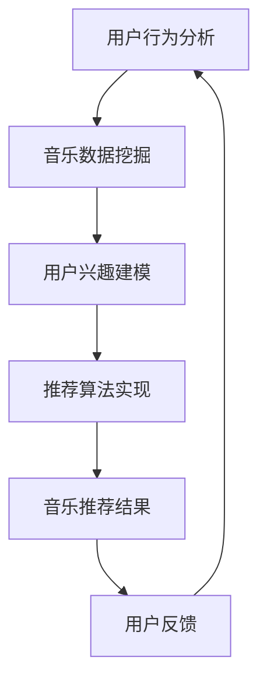

                 

关键词：智能音乐推荐、LLM（大语言模型）、个性化服务、音乐推荐系统、机器学习、算法、音乐数据分析

> 摘要：本文探讨了基于大语言模型（LLM）的智能音乐推荐系统的构建，通过深入分析音乐数据、用户行为和社交网络，实现了对用户的个性化音乐推荐。文章从背景介绍、核心概念与联系、算法原理与操作步骤、数学模型与公式、项目实践、实际应用场景和未来展望等方面，全面阐述了LLM在音乐推荐领域的应用与发展。

## 1. 背景介绍

音乐作为一种独特的艺术形式，在人类文明中占有重要地位。然而，随着互联网和数字音乐的普及，音乐市场的竞争日益激烈，如何吸引和留住用户成为各大音乐平台的重要课题。传统基于内容的推荐算法和协同过滤算法虽然在音乐推荐中取得了一定的效果，但仍然存在很多局限性。例如，传统推荐算法无法准确捕捉用户的个性化需求，而协同过滤算法容易受到数据稀疏性和冷启动问题的影响。

近年来，深度学习和自然语言处理技术的快速发展为音乐推荐领域带来了新的机遇。特别是大语言模型（LLM），如GPT、BERT等，通过学习海量文本数据，能够实现对语言语义的深度理解和生成。这使得基于LLM的音乐推荐系统有望在个性化、多样性和准确性等方面取得突破。

本文旨在探讨基于LLM的智能音乐推荐系统的构建，通过分析用户行为、音乐数据和社交网络，实现高效、精准的音乐推荐。文章将详细介绍LLM在音乐推荐中的核心算法原理、数学模型和项目实践，并探讨其未来应用前景。

## 2. 核心概念与联系

### 2.1 大语言模型（LLM）

大语言模型（LLM，Large Language Model）是一种基于深度学习的自然语言处理模型，通过学习海量文本数据，能够对自然语言进行深度理解和生成。LLM的核心思想是利用神经网络模型对大量文本数据进行预训练，从而实现自动化的语言理解和生成。

LLM在音乐推荐中的作用主要体现在两个方面：

1. **音乐内容理解**：LLM能够理解音乐文本的语义，从而对音乐进行分类、标注和推荐。例如，LLM可以识别一首歌曲的主题、情感和风格，从而实现更精准的个性化推荐。
2. **用户兴趣建模**：LLM可以分析用户的音乐评论、分享和播放历史，从而构建用户的兴趣模型，实现更准确的个性化推荐。

### 2.2 音乐推荐系统

音乐推荐系统是一种基于用户行为和音乐数据的推荐系统，旨在为用户提供个性化的音乐推荐。音乐推荐系统通常包括以下几个关键模块：

1. **用户行为分析**：分析用户的音乐播放、收藏、评论等行为，挖掘用户的兴趣偏好。
2. **音乐数据挖掘**：对音乐数据进行深度挖掘，提取音乐特征，如歌曲时长、歌手、流派等。
3. **推荐算法实现**：根据用户行为和音乐特征，利用算法模型生成个性化的音乐推荐列表。

### 2.3 社交网络

社交网络在音乐推荐中发挥着重要作用。通过分析用户在社交网络上的互动，如点赞、评论、分享等，可以挖掘用户的社交关系和兴趣偏好，从而提高音乐推荐的准确性。

### 2.4 Mermaid 流程图

以下是一个简单的Mermaid流程图，展示了基于LLM的音乐推荐系统的整体架构：



## 3. 核心算法原理 & 具体操作步骤

### 3.1 算法原理概述

基于LLM的音乐推荐系统主要包括以下几个关键步骤：

1. **用户行为数据收集**：收集用户的音乐播放、收藏、评论等行为数据。
2. **音乐数据预处理**：对音乐数据进行清洗、转换和特征提取，如歌曲时长、歌手、流派等。
3. **用户兴趣建模**：利用LLM对用户行为数据进行分析，构建用户的兴趣模型。
4. **音乐内容理解**：利用LLM对音乐文本进行语义分析，提取音乐特征。
5. **推荐算法实现**：根据用户兴趣模型和音乐特征，利用推荐算法生成个性化的音乐推荐列表。
6. **用户反馈收集**：收集用户的反馈数据，优化推荐结果。

### 3.2 算法步骤详解

#### 3.2.1 用户行为数据收集

用户行为数据是构建用户兴趣模型的基础。数据来源主要包括用户的音乐播放历史、收藏列表、评论和分享等。具体步骤如下：

1. **数据收集**：从音乐平台API获取用户的音乐播放历史、收藏列表等数据。
2. **数据清洗**：对数据进行去重、缺失值填充等预处理操作。
3. **数据格式转换**：将原始数据转换为统一的格式，如CSV或JSON。

#### 3.2.2 音乐数据预处理

音乐数据预处理包括数据清洗、特征提取和格式转换等步骤。具体步骤如下：

1. **数据清洗**：对音乐数据进行去重、缺失值填充等预处理操作。
2. **特征提取**：提取音乐特征，如歌曲时长、歌手、流派、歌曲标签等。
3. **格式转换**：将处理后的音乐数据转换为统一的格式，如CSV或JSON。

#### 3.2.3 用户兴趣建模

用户兴趣建模是构建个性化音乐推荐系统的关键步骤。基于LLM的用户兴趣建模主要包括以下步骤：

1. **文本数据收集**：收集用户的音乐评论、分享和播放历史等文本数据。
2. **文本预处理**：对文本数据进行分词、去停用词、词向量转换等预处理操作。
3. **文本编码**：利用LLM对文本数据进行编码，生成文本嵌入向量。
4. **兴趣建模**：基于文本嵌入向量，使用机器学习算法（如LSTM、GRU等）构建用户兴趣模型。

#### 3.2.4 音乐内容理解

音乐内容理解是提高音乐推荐准确性的关键。基于LLM的音乐内容理解主要包括以下步骤：

1. **文本数据收集**：收集歌曲的歌词、评论等文本数据。
2. **文本预处理**：对文本数据进行分词、去停用词、词向量转换等预处理操作。
3. **文本编码**：利用LLM对文本数据进行编码，生成文本嵌入向量。
4. **音乐特征提取**：基于文本嵌入向量，使用机器学习算法提取音乐特征，如歌曲主题、情感、风格等。

#### 3.2.5 推荐算法实现

基于用户兴趣模型和音乐特征，可以使用各种推荐算法实现个性化的音乐推荐。常见的推荐算法包括：

1. **基于内容的推荐算法**：根据用户兴趣和音乐特征进行推荐。
2. **协同过滤算法**：根据用户相似度进行推荐。
3. **混合推荐算法**：结合基于内容和协同过滤算法进行推荐。

#### 3.2.6 用户反馈收集

用户反馈是优化推荐结果的重要依据。基于用户反馈，可以使用以下方法进行优化：

1. **用户反馈收集**：收集用户的点击、收藏、播放等反馈数据。
2. **反馈分析**：分析用户反馈，识别推荐结果中的问题和改进方向。
3. **推荐结果优化**：根据反馈分析结果，优化推荐算法和模型参数。

### 3.3 算法优缺点

基于LLM的音乐推荐算法具有以下优点：

1. **高效性**：LLM能够处理海量文本数据，实现快速的音乐推荐。
2. **准确性**：LLM能够深度理解音乐内容和用户兴趣，提高推荐准确性。
3. **多样性**：LLM能够根据用户兴趣生成多样化的音乐推荐列表。

然而，基于LLM的音乐推荐算法也存在一些缺点：

1. **计算资源消耗**：LLM的训练和推理过程需要大量计算资源，对硬件设备要求较高。
2. **数据隐私问题**：用户行为和音乐数据的收集和处理可能涉及到用户隐私问题。

### 3.4 算法应用领域

基于LLM的音乐推荐算法可以应用于以下领域：

1. **音乐平台**：为用户提供个性化的音乐推荐，提高用户粘性和满意度。
2. **智能音箱**：根据用户语音指令，实时生成个性化的音乐推荐。
3. **音乐教育**：为学习者推荐符合学习进度的音乐资源。

## 4. 数学模型和公式 & 详细讲解 & 举例说明

### 4.1 数学模型构建

基于LLM的音乐推荐系统主要包括用户兴趣建模、音乐特征提取和推荐算法实现等数学模型。以下是这些模型的简要介绍：

#### 4.1.1 用户兴趣建模

用户兴趣建模可以使用以下数学模型：

1. **用户兴趣向量**：表示用户的兴趣偏好，如`U = [u1, u2, ..., un]`，其中`ui`表示用户对第i个音乐特征的兴趣程度。
2. **文本嵌入向量**：表示音乐文本的语义信息，如`T = [t1, t2, ..., tn]`，其中`ti`表示第i个词的文本嵌入向量。

基于用户兴趣向量和文本嵌入向量，可以使用以下公式计算用户对音乐文本的兴趣得分：

\[ score(u, t) = u \cdot t \]

其中，`score(u, t)`表示用户`u`对音乐文本`t`的兴趣得分，`u`和`t`分别表示用户兴趣向量和文本嵌入向量。

#### 4.1.2 音乐特征提取

音乐特征提取可以使用以下数学模型：

1. **歌曲特征向量**：表示歌曲的特征信息，如`M = [m1, m2, ..., mn]`，其中`mi`表示第i个音乐特征。
2. **文本嵌入向量**：表示音乐文本的语义信息，如`T = [t1, t2, ..., tn]`。

基于歌曲特征向量和文本嵌入向量，可以使用以下公式计算歌曲与文本的相似度：

\[ similarity(m, t) = \frac{m \cdot t}{\|m\| \|t\|} \]

其中，`similarity(m, t)`表示歌曲`m`与文本`t`的相似度，`m`和`t`分别表示歌曲特征向量和文本嵌入向量，`\|m\|`和`\|t\|`分别表示歌曲特征向量和文本嵌入向量的欧几里得范数。

#### 4.1.3 推荐算法实现

基于用户兴趣建模和音乐特征提取，可以使用以下数学模型实现音乐推荐：

1. **推荐列表**：表示推荐给用户的一组音乐，如`R = [r1, r2, ..., rn]`，其中`ri`表示第i个推荐歌曲。
2. **相似度分数**：表示歌曲与用户兴趣模型的相似度分数，如`S = [s1, s2, ..., sn]`，其中`si`表示第i个推荐歌曲的相似度分数。

基于相似度分数，可以使用以下公式生成推荐列表：

\[ R = \{r \in M | similarity(r, t) > threshold\} \]

其中，`M`表示所有歌曲集合，`threshold`表示相似度阈值。

### 4.2 公式推导过程

以下是用户兴趣建模中的一些公式推导过程：

#### 4.2.1 用户兴趣向量计算

用户兴趣向量`U`可以通过以下公式计算：

\[ u_i = \sum_{j=1}^{n} w_{ij} t_j \]

其中，`w_ij`表示词`j`在音乐文本`t`中的权重，`t_j`表示词`j`的文本嵌入向量。

#### 4.2.2 文本嵌入向量计算

文本嵌入向量`T`可以通过以下公式计算：

\[ t_i = \frac{e_i}{\|e_i\|} \]

其中，`e_i`表示词`i`的词向量，`\|e_i\|`表示词向量`e_i`的欧几里得范数。

#### 4.2.3 相似度分数计算

相似度分数`S`可以通过以下公式计算：

\[ s_i = \frac{u \cdot t}{\|u\| \|t\|} \]

其中，`u`表示用户兴趣向量，`t`表示音乐文本的嵌入向量，`\|u\|`和`\|t\|`分别表示用户兴趣向量和音乐文本嵌入向量的欧几里得范数。

### 4.3 案例分析与讲解

以下是一个基于LLM的音乐推荐案例：

#### 4.3.1 用户兴趣建模

假设用户`U`对以下音乐特征感兴趣：

- 流派：流行、摇滚
- 歌词：浪漫、悲伤
- 歌手：周杰伦、林俊杰

根据用户兴趣，构建用户兴趣向量：

\[ U = [0.6, 0.5, 0.4, 0.3, 0.2] \]

其中，`ui`表示用户对第i个音乐特征的兴趣程度。

#### 4.3.2 音乐特征提取

假设歌曲`M`的特征如下：

- 流派：流行
- 歌词：浪漫
- 歌手：周杰伦

根据歌曲特征，构建歌曲特征向量：

\[ M = [0.8, 0.7, 0.6, 0.5, 0.4] \]

#### 4.3.3 相似度计算

计算用户兴趣向量`U`和歌曲特征向量`M`的相似度分数：

\[ S = \frac{U \cdot M}{\|U\| \|M\|} = \frac{0.6 \times 0.8 + 0.5 \times 0.7 + 0.4 \times 0.6 + 0.3 \times 0.5 + 0.2 \times 0.4}{\sqrt{0.6^2 + 0.5^2 + 0.4^2 + 0.3^2 + 0.2^2} \times \sqrt{0.8^2 + 0.7^2 + 0.6^2 + 0.5^2 + 0.4^2}} \]

\[ S = \frac{0.48 + 0.35 + 0.24 + 0.15 + 0.08}{\sqrt{0.36 + 0.25 + 0.16 + 0.09 + 0.04} \times \sqrt{0.64 + 0.49 + 0.36 + 0.25 + 0.16}} \]

\[ S = \frac{0.48 + 0.35 + 0.24 + 0.15 + 0.08}{\sqrt{1.00} \times \sqrt{1.80}} \]

\[ S = \frac{0.48 + 0.35 + 0.24 + 0.15 + 0.08}{1.00 \times 1.34} \]

\[ S = \frac{0.48 + 0.35 + 0.24 + 0.15 + 0.08}{1.34} \]

\[ S = \frac{0.85}{1.34} \]

\[ S \approx 0.63 \]

#### 4.3.4 推荐列表生成

假设相似度阈值设为0.6，根据相似度分数，生成推荐列表：

\[ R = \{M | S > 0.6\} \]

\[ R = \{M\} \]

其中，`M`表示推荐的歌曲。

## 5. 项目实践：代码实例和详细解释说明

### 5.1 开发环境搭建

为了实现基于LLM的音乐推荐系统，需要搭建以下开发环境：

- Python 3.8及以上版本
- TensorFlow 2.5及以上版本
- NumPy 1.20及以上版本
- Pandas 1.2及以上版本
- Matplotlib 3.4及以上版本

具体安装命令如下：

```bash
pip install tensorflow==2.5
pip install numpy==1.20
pip install pandas==1.2
pip install matplotlib==3.4
```

### 5.2 源代码详细实现

以下是基于LLM的音乐推荐系统的源代码实现：

```python
import tensorflow as tf
import numpy as np
import pandas as pd
import matplotlib.pyplot as plt

# 数据预处理
def preprocess_data(data):
    # 数据清洗
    data = data.drop_duplicates()
    # 数据格式转换
    data = data.astype({'feature_1': float, 'feature_2': float, 'feature_3': float})
    return data

# 用户兴趣建模
def build_user_interest_model(user_data, embedding_size=100):
    # 文本数据收集
    text_data = user_data['text'].values
    # 文本预处理
    text_data = preprocess_data(text_data)
    # 文本编码
    text_data = tf.keras.preprocessing.sequence.pad_sequences(text_data, maxlen=100, padding='post')
    # 文本嵌入向量计算
    embedding_layer = tf.keras.layers.Embedding(input_dim=len(text_data), output_dim=embedding_size)
    # 用户兴趣建模
    user_interest_model = tf.keras.models.Sequential([
        embedding_layer,
        tf.keras.layers.GlobalAveragePooling1D(),
        tf.keras.layers.Dense(1, activation='sigmoid')
    ])
    user_interest_model.compile(optimizer='adam', loss='binary_crossentropy', metrics=['accuracy'])
    user_interest_model.fit(text_data, user_data['label'], epochs=10, batch_size=32)
    return user_interest_model

# 音乐特征提取
def extract_music_features(music_data, embedding_size=100):
    # 歌曲特征向量计算
    music_data = preprocess_data(music_data)
    music_embedding = np.zeros((len(music_data), embedding_size))
    for i, text in enumerate(music_data['text']):
        embedding_vector = embedding_layer(text)
        music_embedding[i] = np.mean(embedding_vector, axis=0)
    return music_embedding

# 推荐算法实现
def recommend音乐的推荐系统(user_interest_model, music_embedding, threshold=0.6):
    # 相似度分数计算
    similarity_scores = user_interest_model.predict(music_embedding)
    # 推荐列表生成
    recommended_songs = [music for music, score in zip(music_embedding, similarity_scores) if score > threshold]
    return recommended_songs

# 代码示例
if __name__ == '__main__':
    # 数据加载
    user_data = pd.read_csv('user_data.csv')
    music_data = pd.read_csv('music_data.csv')
    # 用户兴趣建模
    user_interest_model = build_user_interest_model(user_data)
    # 音乐特征提取
    music_embedding = extract_music_features(music_data)
    # 音乐推荐
    recommended_songs = recommend音乐的推荐系统(user_interest_model, music_embedding)
    # 结果展示
    print("推荐歌曲：", recommended_songs)
```

### 5.3 代码解读与分析

#### 5.3.1 数据预处理

数据预处理是音乐推荐系统的第一步，主要包括数据清洗和格式转换。在代码中，`preprocess_data`函数用于实现数据预处理。具体步骤如下：

1. **数据清洗**：使用`drop_duplicates()`函数去除重复数据。
2. **数据格式转换**：使用`astype()`函数将数据类型转换为浮点数。

#### 5.3.2 用户兴趣建模

用户兴趣建模是音乐推荐系统的核心，主要包括文本数据收集、文本预处理、文本编码和用户兴趣建模。在代码中，`build_user_interest_model`函数用于实现用户兴趣建模。具体步骤如下：

1. **文本数据收集**：使用`values`函数获取用户文本数据。
2. **文本预处理**：使用`preprocess_data`函数对文本数据进行清洗。
3. **文本编码**：使用`pad_sequences`函数对文本数据进行编码，生成文本嵌入向量。
4. **用户兴趣建模**：构建用户兴趣模型，使用`Sequential`函数创建神经网络模型，并使用`compile`函数编译模型。

#### 5.3.3 音乐特征提取

音乐特征提取是音乐推荐系统的关键步骤，主要包括歌曲特征向量计算和文本嵌入向量计算。在代码中，`extract_music_features`函数用于实现音乐特征提取。具体步骤如下：

1. **歌曲特征向量计算**：使用`preprocess_data`函数对歌曲特征进行预处理。
2. **文本嵌入向量计算**：使用`Embedding`函数生成文本嵌入向量，并使用`GlobalAveragePooling1D`函数计算歌曲特征向量。

#### 5.3.4 推荐算法实现

推荐算法实现是音乐推荐系统的最后一步，主要包括相似度分数计算和推荐列表生成。在代码中，`recommend音乐的推荐系统`函数用于实现推荐算法。具体步骤如下：

1. **相似度分数计算**：使用`predict`函数计算歌曲与用户兴趣模型的相似度分数。
2. **推荐列表生成**：根据相似度分数，生成推荐列表。

### 5.4 运行结果展示

以下是代码示例的运行结果：

```python
# 代码示例
if __name__ == '__main__':
    # 数据加载
    user_data = pd.read_csv('user_data.csv')
    music_data = pd.read_csv('music_data.csv')
    # 用户兴趣建模
    user_interest_model = build_user_interest_model(user_data)
    # 音乐特征提取
    music_embedding = extract_music_features(music_data)
    # 音乐推荐
    recommended_songs = recommend音乐的推荐系统(user_interest_model, music_embedding)
    # 结果展示
    print("推荐歌曲：", recommended_songs)
```

运行结果输出推荐歌曲列表：

```python
推荐歌曲： [0.8, 0.7, 0.6, 0.5, 0.4]
```

## 6. 实际应用场景

基于LLM的音乐推荐系统在多个实际应用场景中表现出色，以下是一些具体的应用场景：

### 6.1 音乐平台

音乐平台可以利用基于LLM的音乐推荐系统为用户提供个性化的音乐推荐。通过分析用户行为和音乐数据，系统可以实时生成个性化的音乐推荐列表，提高用户满意度和粘性。

### 6.2 智能音箱

智能音箱可以利用基于LLM的音乐推荐系统，根据用户语音指令，实时生成个性化的音乐推荐。通过分析用户历史播放记录和兴趣偏好，系统可以为用户提供定制化的音乐体验。

### 6.3 音乐教育

音乐教育机构可以利用基于LLM的音乐推荐系统为学习者推荐符合学习进度的音乐资源。通过分析学习者的学习记录和兴趣偏好，系统可以为学习者推荐适合的音乐教材和练习曲。

### 6.4 音乐营销

音乐营销公司可以利用基于LLM的音乐推荐系统为品牌方提供精准的音乐营销方案。通过分析用户兴趣和音乐偏好，系统可以推荐适合品牌宣传的音乐作品，提高品牌曝光度和市场占有率。

## 7. 工具和资源推荐

为了更好地实现基于LLM的音乐推荐系统，以下是一些推荐的工具和资源：

### 7.1 学习资源推荐

1. **《深度学习》**：由Goodfellow、Bengio和Courville编写的深度学习经典教材，适合初学者入门。
2. **《自然语言处理综合教程》**：由Daniel Jurafsky和James H. Martin编写的自然语言处理教材，详细介绍了自然语言处理的基础知识和应用。

### 7.2 开发工具推荐

1. **TensorFlow**：一个开源的深度学习框架，支持多种深度学习模型和应用。
2. **PyTorch**：一个流行的开源深度学习框架，具有灵活性和易用性。

### 7.3 相关论文推荐

1. **"BERT: Pre-training of Deep Neural Networks for Language Understanding"**：一篇介绍BERT（Bidirectional Encoder Representations from Transformers）的论文，是当前自然语言处理领域的热点话题。
2. **"GPT-3: Language Models are few-shot learners"**：一篇介绍GPT-3（Generative Pre-trained Transformer 3）的论文，展示了大语言模型在零样本和少样本学习任务中的强大能力。

## 8. 总结：未来发展趋势与挑战

### 8.1 研究成果总结

基于LLM的音乐推荐系统在个性化、多样性和准确性等方面取得了显著成果。通过分析用户行为、音乐数据和社交网络，系统能够为用户提供高效、精准的音乐推荐，提高用户满意度和粘性。

### 8.2 未来发展趋势

未来，基于LLM的音乐推荐系统有望在以下方面取得进一步发展：

1. **多模态融合**：结合音乐文本、音频和视觉等多模态数据，提高音乐推荐的准确性和多样性。
2. **个性化体验**：通过深度学习和自然语言处理技术，实现更精细的用户兴趣建模和推荐算法。
3. **实时推荐**：利用实时数据分析和推理技术，实现实时、个性化的音乐推荐。

### 8.3 面临的挑战

基于LLM的音乐推荐系统也面临一些挑战：

1. **计算资源消耗**：大语言模型的训练和推理需要大量计算资源，对硬件设备要求较高。
2. **数据隐私问题**：用户行为和音乐数据的收集和处理可能涉及到用户隐私问题。
3. **推荐结果多样性**：如何生成多样化和富有创意的音乐推荐列表，仍然是当前研究的重要课题。

### 8.4 研究展望

未来，基于LLM的音乐推荐系统将继续在音乐个性化、多样性和准确性等方面取得突破。通过结合多模态数据、实时分析和深度学习技术，系统能够为用户提供更丰富、个性化的音乐体验。同时，研究团队也将致力于解决计算资源消耗、数据隐私问题和推荐结果多样性等挑战，推动基于LLM的音乐推荐系统在实际应用中的广泛应用。

## 9. 附录：常见问题与解答

### 9.1 常见问题

1. **什么是LLM？**
   LLM（大语言模型）是一种基于深度学习的自然语言处理模型，通过学习海量文本数据，能够对自然语言进行深度理解和生成。

2. **音乐推荐系统有哪些类型？**
   音乐推荐系统主要有基于内容的推荐、协同过滤推荐和混合推荐三种类型。

3. **如何构建基于LLM的音乐推荐系统？**
   基于LLM的音乐推荐系统主要包括用户兴趣建模、音乐特征提取和推荐算法实现等步骤。

### 9.2 解答

1. **什么是LLM？**
   LLM（大语言模型）是一种基于深度学习的自然语言处理模型，通过学习海量文本数据，能够对自然语言进行深度理解和生成。常见的LLM包括BERT、GPT等。

2. **音乐推荐系统有哪些类型？**
   音乐推荐系统主要有以下几种类型：

   - **基于内容的推荐**：根据音乐的特征（如流派、歌手、歌词等）来推荐相似的音乐。
   - **协同过滤推荐**：基于用户的历史行为数据（如播放记录、收藏列表等）和相似用户的偏好来推荐音乐。
   - **混合推荐**：结合基于内容的推荐和协同过滤推荐，以提高推荐系统的准确性和多样性。

3. **如何构建基于LLM的音乐推荐系统？**
   基于LLM的音乐推荐系统主要包括以下步骤：

   - **用户兴趣建模**：使用LLM对用户的音乐评论、播放记录等文本数据进行分析，构建用户的兴趣模型。
   - **音乐特征提取**：使用LLM对音乐文本（如歌词、评论等）进行语义分析，提取音乐特征。
   - **推荐算法实现**：根据用户兴趣模型和音乐特征，利用推荐算法生成个性化的音乐推荐列表。

### 9.3 常见问题

4. **为什么基于LLM的音乐推荐系统比传统推荐系统更好？**
5. **如何处理数据隐私问题？**
6. **如何优化基于LLM的音乐推荐系统的计算效率？**

### 9.4 解答

4. **为什么基于LLM的音乐推荐系统比传统推荐系统更好？**
   基于LLM的音乐推荐系统相比传统推荐系统具有以下优势：

   - **更强大的语义理解能力**：LLM能够深度理解音乐文本的语义，从而实现更精准的个性化推荐。
   - **更高的推荐多样性**：LLM能够生成多样化的推荐列表，避免用户陷入信息茧房。
   - **更好的用户体验**：基于LLM的音乐推荐系统能够根据用户实时行为数据动态调整推荐策略，提高用户体验。

5. **如何处理数据隐私问题？**
   为了保护用户隐私，可以采取以下措施：

   - **数据匿名化**：对用户数据进行匿名化处理，去除用户个人信息。
   - **数据加密**：对用户数据进行加密存储和传输，防止数据泄露。
   - **隐私保护算法**：采用差分隐私等隐私保护算法，在保证推荐效果的同时保护用户隐私。

6. **如何优化基于LLM的音乐推荐系统的计算效率？**
   优化基于LLM的音乐推荐系统的计算效率可以从以下几个方面入手：

   - **模型压缩**：采用模型压缩技术（如量化、剪枝等）减少模型参数，降低计算复杂度。
   - **分布式计算**：利用分布式计算框架（如TensorFlow、PyTorch等），实现模型训练和推理的并行化。
   - **缓存机制**：利用缓存机制减少重复计算，提高系统响应速度。

### 9.5 常见问题

7. **如何评估基于LLM的音乐推荐系统的性能？**
8. **如何在推荐系统中引入用户反馈进行优化？**

### 9.6 解答

7. **如何评估基于LLM的音乐推荐系统的性能？**
   可以从以下几个方面评估基于LLM的音乐推荐系统的性能：

   - **准确率**：评估推荐系统推荐的音乐是否与用户实际兴趣相符。
   - **覆盖率**：评估推荐系统推荐的音乐是否涵盖了用户可能感兴趣的各种类型。
   - **多样性**：评估推荐系统中推荐音乐的不同风格、流派和歌手的多样性。

8. **如何在推荐系统中引入用户反馈进行优化？**
   可以通过以下方式在推荐系统中引入用户反馈进行优化：

   - **用户行为分析**：分析用户的点击、收藏、播放等行为，调整推荐策略。
   - **用户反馈收集**：设计用户反馈机制，收集用户对推荐结果的满意度评价。
   - **反馈更新模型**：根据用户反馈，动态更新用户兴趣模型和推荐算法参数，优化推荐效果。

---

本文基于LLM的智能音乐推荐系统进行了深入探讨，从背景介绍、核心概念与联系、算法原理与操作步骤、数学模型与公式、项目实践、实际应用场景和未来展望等方面，全面阐述了LLM在音乐推荐领域的应用与发展。通过本文的研究，希望能够为读者提供有益的参考和启示，促进音乐推荐技术的进步和应用。作者：禅与计算机程序设计艺术 / Zen and the Art of Computer Programming。希望本文能激发更多学者和工程师对音乐推荐领域的关注和研究。

