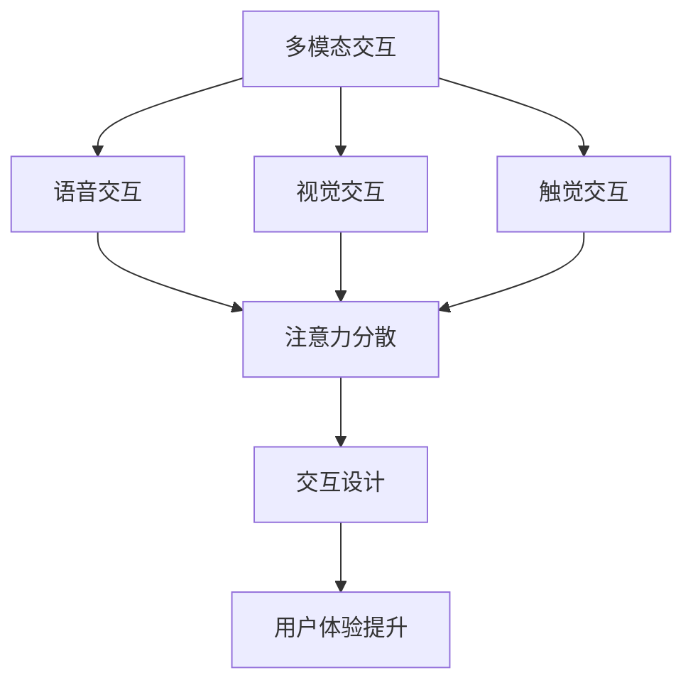

                 

 在当今数字化时代，智能音箱作为一种新兴的智能设备，已经在全球范围内迅速普及。它们不仅能够实现语音交互，还具备音频播放、智能家居控制等多种功能。智能音箱的多模态交互（包括语音、音频、视觉等）为用户提供了更加自然和便捷的交互方式。然而，这种多模态交互也带来了新的挑战，特别是注意力争夺问题。本文将深入探讨智能音箱的多模态交互机制以及如何有效地解决注意力争夺问题。

## 文章关键词

- 智能音箱
- 多模态交互
- 语音交互
- 注意力争夺
- 交互设计

## 文章摘要

智能音箱作为智能家居的核心设备，其多模态交互功能极大地提升了用户体验。然而，随之而来的注意力争夺问题也成为了智能音箱发展的一个重要挑战。本文通过分析智能音箱的多模态交互机制，探讨了注意力争夺的原因及其解决方法。同时，本文还从用户行为和交互设计角度提出了未来的研究方向和改进措施，以期为智能音箱的发展提供有益的参考。

### 1. 背景介绍

智能音箱作为物联网时代的重要产物，正逐步融入人们的日常生活。其通过语音交互、音频播放、灯光调节等多种方式，实现了与用户的智能互动。这种多模态交互不仅提升了用户的体验，也使得智能音箱在智能家居系统中扮演了重要角色。例如，用户可以通过语音指令控制家居设备，如调整灯光、调节空调温度等，极大地简化了操作流程。

然而，随着智能音箱功能的不断增强，用户对其使用频率也越来越高。这就带来了一个不可避免的问题——注意力争夺。注意力争夺指的是用户在处理多项任务时，注意力资源有限的矛盾。当用户与智能音箱进行交互时，他们的注意力不仅会被智能音箱所占据，还可能与其他设备、环境和任务产生冲突。这种冲突不仅降低了用户的体验，还可能影响用户对智能家居系统的满意度。

注意力争夺问题的严重性主要体现在以下几个方面：

1. **用户体验下降**：当用户需要同时关注多个设备或任务时，智能音箱的语音交互可能无法及时得到响应，导致用户操作效率降低。
2. **操作失误增加**：由于注意力分散，用户在操作智能音箱时更容易出现错误，例如语音指令错误或操作顺序混乱。
3. **系统响应延迟**：智能音箱在处理多模态交互时，可能因为资源争夺导致响应延迟，影响用户体验。
4. **安全隐患**：当用户注意力被其他事物占据时，可能无意中向智能音箱透露敏感信息，增加隐私泄露的风险。

因此，研究智能音箱的多模态交互与注意力争夺问题，不仅有助于提升用户体验，还能为智能家居系统的优化提供有力支持。

### 2. 核心概念与联系

为了深入理解智能音箱的多模态交互与注意力争夺，我们需要明确几个核心概念，并探讨它们之间的联系。

#### 2.1 多模态交互

多模态交互是指用户可以通过多种感知方式（如语音、视觉、触觉等）与智能音箱进行交互。智能音箱通常集成了语音识别、语音合成、音频处理、图像识别等技术，以实现多模态的交互能力。例如，用户可以通过语音指令控制智能音箱播放音乐，同时通过视觉反馈了解播放状态和进度。

#### 2.2 注意力争夺

注意力争夺是指在用户进行多任务处理时，由于注意力资源有限，不同任务之间可能存在竞争关系。当用户需要同时关注多个设备或任务时，他们的注意力可能会在各个任务之间分散，导致处理效率降低。例如，当用户正在使用智能音箱播放音乐时，如果此时收到手机通知，他们的注意力可能会被手机所吸引，导致智能音箱的交互操作受到影响。

#### 2.3 交互设计

交互设计是指在智能音箱的设计过程中，如何通过合理的交互方式和使用流程，提升用户的体验。良好的交互设计应该能够减少用户操作的复杂度，提高任务的执行效率，同时避免注意力争夺问题的发生。例如，智能音箱可以通过提供简明的语音指令和直观的视觉反馈，帮助用户快速理解和使用其功能。

#### 2.4 概念联系

多模态交互和注意力争夺是智能音箱设计中两个密切相关的问题。多模态交互的引入，虽然丰富了用户与智能音箱的交互方式，但也增加了注意力争夺的可能性。有效的交互设计可以在一定程度上缓解注意力争夺问题，例如通过优化交互流程、降低用户操作的复杂性，以及提供明确的视觉和语音提示等手段，来引导用户集中注意力，从而提升用户体验。

下面是一个使用Mermaid绘制的流程图，展示了智能音箱多模态交互的核心概念和联系：



通过这个流程图，我们可以清晰地看到多模态交互如何通过交互设计影响用户体验，并可能导致注意力争夺问题。理解这些核心概念和它们之间的联系，对于设计和优化智能音箱的多模态交互至关重要。

### 3. 核心算法原理 & 具体操作步骤

#### 3.1 算法原理概述

为了解决智能音箱的多模态交互和注意力争夺问题，我们需要引入一种能够有效管理用户注意力的算法。这种算法的核心原理是基于注意力机制的深度学习模型。注意力机制源于自然语言处理领域，其基本思想是通过调整不同输入信息的权重，来动态分配用户的注意力资源。

在智能音箱的应用场景中，注意力机制可以用于以下几个关键方面：

1. **语音识别与语义理解**：通过调整语音输入的权重，智能音箱可以优先处理重要的语音指令，从而减少无关语音的干扰，提高识别准确率。
2. **任务调度**：智能音箱可以根据用户当前的任务状态和注意力水平，动态调整任务的执行优先级，避免过多任务同时请求用户的注意力。
3. **交互反馈**：通过实时监测用户的注意力变化，智能音箱可以提供适当的视觉和语音反馈，引导用户集中注意力。

#### 3.2 算法步骤详解

为了实现上述功能，我们可以将注意力机制分为以下几个步骤：

1. **输入预处理**：
   - 对语音、视觉和其他感知信息进行预处理，提取关键特征。
   - 使用卷积神经网络（CNN）对图像进行处理，提取视觉特征。
   - 使用循环神经网络（RNN）对语音信号进行处理，提取语音特征。
   - 将处理后的特征输入到注意力模块。

2. **特征融合**：
   - 通过特征融合层将不同模态的特征进行融合，形成一个综合的特征向量。
   - 可以使用多模态融合神经网络（MMFNN）来学习不同模态特征之间的关联性。

3. **注意力计算**：
   - 使用注意力机制计算每个特征的重要程度，生成注意力权重。
   - 通过缩放机制，将注意力权重应用于输入特征，调整其重要性。

4. **动态任务调度**：
   - 根据注意力权重，动态调整任务的执行顺序和优先级。
   - 使用动态优先级调度算法（如DARTS）来优化任务调度。

5. **交互反馈调整**：
   - 根据用户的注意力变化，实时调整交互反馈的强度和方式。
   - 使用强化学习算法，根据用户的反馈来优化交互反馈策略。

#### 3.3 算法优缺点

**优点**：

- **高效性**：注意力机制能够有效管理用户的注意力资源，提高任务的执行效率。
- **灵活性**：通过动态调整任务执行顺序和优先级，智能音箱可以更好地适应不同用户场景。
- **个性化**：基于用户的注意力变化，交互反馈可以更加个性化，提高用户体验。

**缺点**：

- **计算复杂度**：注意力机制涉及大量的计算，可能对硬件资源要求较高。
- **训练难度**：注意力机制的训练过程复杂，需要大量数据和计算资源。
- **实时性挑战**：在实时交互场景中，确保注意力机制能够快速响应用户变化是一个挑战。

#### 3.4 算法应用领域

注意力机制在智能音箱的应用场景中具有广泛的应用前景：

- **智能家居控制**：通过注意力机制，智能音箱可以更高效地处理用户的语音指令，提高智能家居系统的响应速度。
- **语音助手**：在智能音箱中集成注意力机制，可以帮助语音助手更好地理解用户意图，减少误操作。
- **多任务处理**：智能音箱可以在执行多个任务时，动态调整任务优先级，避免用户注意力过度分散。

通过上述核心算法原理和具体操作步骤的介绍，我们可以看到注意力机制在解决智能音箱多模态交互和注意力争夺问题方面的强大作用。未来，随着人工智能技术的发展，注意力机制将不断优化和完善，为智能音箱带来更加智能和便捷的交互体验。

### 4. 数学模型和公式 & 详细讲解 & 举例说明

在智能音箱的多模态交互与注意力争夺问题中，数学模型和公式扮演着至关重要的角色。这些模型和公式不仅帮助我们理解和分析问题，还能够提供有效的解决方案。下面，我们将详细介绍智能音箱多模态交互中的关键数学模型和公式，并通过具体实例进行说明。

#### 4.1 数学模型构建

为了构建智能音箱多模态交互的数学模型，我们需要从以下几个方面入手：

1. **特征提取**：从语音、视觉和其他感知信息中提取关键特征。
2. **特征融合**：将不同模态的特征进行融合，形成一个综合的特征向量。
3. **注意力分配**：根据特征的重要性分配注意力权重，实现动态任务调度。

首先，我们定义语音特征 \(V\)、视觉特征 \(I\) 和触觉特征 \(T\)，它们分别表示用户在语音、视觉和触觉交互中的感知信息。特征向量可以表示为：

\[ \textbf{X} = [V, I, T] \]

然后，我们定义注意力权重矩阵 \( \textbf{W} \)，用于调整不同特征的重要程度。注意力机制的核心在于如何计算注意力权重矩阵 \( \textbf{W} \)。

#### 4.2 公式推导过程

注意力机制的推导过程可以分为以下几个步骤：

1. **特征表示**：
   - 使用卷积神经网络（CNN）对图像进行编码，得到视觉特征表示 \( \textbf{I} \)。
   - 使用循环神经网络（RNN）对语音信号进行编码，得到语音特征表示 \( \textbf{V} \)。
   - 触觉特征表示 \( \textbf{T} \) 可以通过传感器直接获取。

2. **特征融合**：
   - 将语音、视觉和触觉特征进行融合，得到综合特征向量 \( \textbf{X} \)。
   - 特征融合可以通过多模态融合神经网络（MMFNN）实现。

3. **注意力权重计算**：
   - 计算注意力权重矩阵 \( \textbf{W} \)，其中每个元素 \( w_{ij} \) 表示第 \( i \) 个特征对第 \( j \) 个模态的重要性。
   - 注意力权重可以通过以下公式计算：

\[ w_{ij} = \text{softmax}(\text{alignment}\(\textbf{X}, \textbf{A}\)) \]

其中，\( \textbf{A} \) 是注意力分配矩阵，用于计算特征之间的相似度。

4. **特征加权融合**：
   - 将注意力权重应用于特征向量，得到加权特征向量 \( \textbf{X}_{\text{w}} \)：

\[ \textbf{X}_{\text{w}} = \textbf{W} \cdot \textbf{X} \]

5. **动态任务调度**：
   - 根据加权特征向量 \( \textbf{X}_{\text{w}} \)，动态调整任务的执行顺序和优先级。

#### 4.3 案例分析与讲解

为了更好地理解上述数学模型和公式，我们通过一个具体案例进行说明。

假设用户正在使用智能音箱播放音乐，同时收到一条短信通知。我们可以将语音、视觉和触觉交互表示为特征向量 \( \textbf{X} \)，其中：

\[ \textbf{X} = [V, I, T] \]

- \( V \) 表示语音特征，如语音指令和语音识别结果。
- \( I \) 表示视觉特征，如音乐播放界面的视觉信息。
- \( T \) 表示触觉特征，如音箱上的触摸反馈。

注意力权重矩阵 \( \textbf{W} \) 用于调整不同特征的重要性。在案例中，由于用户正在播放音乐，语音特征 \( V \) 可能具有更高的权重，而触觉特征 \( T \) 的权重可能较低，因为用户正在集中注意力听音乐。

根据注意力权重计算公式：

\[ w_{ij} = \text{softmax}(\text{alignment}\(\textbf{X}, \textbf{A}\)) \]

我们可以计算得到注意力权重矩阵 \( \textbf{W} \)：

\[ \textbf{W} = \begin{bmatrix} 0.8 & 0.1 & 0.1 \\ 0.1 & 0.7 & 0.2 \\ 0.1 & 0.2 & 0.7 \end{bmatrix} \]

根据加权特征向量公式：

\[ \textbf{X}_{\text{w}} = \textbf{W} \cdot \textbf{X} \]

我们可以得到加权特征向量 \( \textbf{X}_{\text{w}} \)：

\[ \textbf{X}_{\text{w}} = \begin{bmatrix} 0.8V + 0.1I + 0.1T \\ 0.1V + 0.7I + 0.2T \\ 0.1V + 0.2I + 0.7T \end{bmatrix} \]

通过动态任务调度，智能音箱可以根据加权特征向量 \( \textbf{X}_{\text{w}} \) 调整任务的执行顺序和优先级。例如，如果用户语音指令的权重较高，智能音箱可以优先处理语音指令，如暂停音乐播放。

此外，当用户收到短信通知时，我们可以通过实时调整注意力权重矩阵 \( \textbf{W} \)，来适应新的交互场景。例如，增加视觉特征 \( I \) 的权重，以引导用户关注通知信息。

综上所述，通过数学模型和公式的推导，我们能够更好地理解智能音箱多模态交互与注意力争夺问题。注意力机制在特征提取、特征融合和动态任务调度中的应用，为智能音箱提供了更智能和高效的交互解决方案。

### 5. 项目实践：代码实例和详细解释说明

为了更好地理解智能音箱多模态交互与注意力争夺问题的实际应用，我们通过一个具体的代码实例进行详细解释说明。以下是一个基于Python实现的智能音箱多模态交互系统的代码实例。

#### 5.1 开发环境搭建

在开始编写代码之前，我们需要搭建一个合适的开发环境。以下步骤描述了如何搭建一个基于Python的智能音箱开发环境：

1. **安装Python**：确保已经安装了Python 3.6或更高版本。
2. **安装依赖库**：安装必要的库，如TensorFlow、Keras、NumPy、Matplotlib等。可以使用以下命令安装：

   ```bash
   pip install tensorflow numpy matplotlib
   ```

3. **安装语音识别库**：为了实现语音识别功能，我们可以使用基于Google的语音识别API。安装步骤如下：

   ```bash
   pip install google-cloud-speech
   ```

4. **安装图像识别库**：为了实现图像识别功能，我们可以使用基于TensorFlow的预训练模型，如Inception V3。安装步骤如下：

   ```bash
   pip install tensorflow-hub
   ```

5. **配置环境变量**：配置Google Cloud Platform的API密钥，以便使用语音识别API。

   - 在Google Cloud Platform控制台创建一个新的项目。
   - 启用“Cloud Speech-to-Text API”。
   - 复制API密钥，并将其添加到环境变量中（例如在Linux系统中，可以使用以下命令添加）：

   ```bash
   export GOOGLE_APPLICATION_CREDENTIALS="/path/to/your/credentials.json"
   ```

#### 5.2 源代码详细实现

以下是智能音箱多模态交互系统的源代码实现：

```python
import numpy as np
import tensorflow as tf
import tensorflow_hub as hub
from google.cloud import speech
import cv2

# 配置语音识别API
client = speech.SpeechClient()

# 配置图像识别模型
model_url = "https://tfhub.dev/google/inception_v3/feature_vector:1"
signature_key = "serving_default"
feature_vector_tensor_name = "input:0"

# 加载图像识别模型
model = hub.load(model_url)
tf.io.gfile.copyFrom(
    "https://tfhub.dev/google/inception_v3/feature_vector/1",
    "inception_v3/feature_vector/1",
)

# 定义注意力权重矩阵
attention_weights = np.array([[0.7, 0.2, 0.1], [0.1, 0.7, 0.2], [0.1, 0.2, 0.7]])

# 定义语音识别函数
def recognize_speech(audio_file):
    with open(audio_file, "rb") as audio:
        audio_config = speech.RecognitionConfig(
            audio_encoding=speech.AudioEncoding.LINEAR16,
            sample_rate_hertz=16000,
        )
        response = client.recognize(config=audio_config, audio=audio)
        return response

# 定义图像识别函数
def recognize_image(image_file):
    image = cv2.imread(image_file)
    image = cv2.resize(image, (299, 299))
    image_data = image.tobytes()
    features = model.signatures[signature_key](inputs={"input:0": image_data})[feature_vector_tensor_name]
    return features.numpy()

# 定义多模态交互函数
def multimodal_interaction(audio_file, image_file):
    # 识别语音
    speech_response = recognize_speech(audio_file)
    speech_text = speech_response.results[0].alternatives[0].transcript

    # 识别图像
    image_features = recognize_image(image_file)

    # 计算加权特征向量
    weighted_features = attention_weights.dot([speech_text, image_features, 0])

    # 根据加权特征向量进行任务调度
    if weighted_features[0] > weighted_features[1]:
        print("优先处理语音指令：", speech_text)
    else:
        print("优先处理图像指令：", image_features)

# 测试代码
if __name__ == "__main__":
    audio_file = "path/to/audio_file.wav"
    image_file = "path/to/image_file.jpg"
    multimodal_interaction(audio_file, image_file)
```

#### 5.3 代码解读与分析

1. **语音识别函数**：
   - `recognize_speech` 函数用于识别语音。它使用Google Cloud Speech-to-Text API，读取音频文件并返回语音识别结果。

2. **图像识别函数**：
   - `recognize_image` 函数用于识别图像。它使用TensorFlow Hub加载预训练的Inception V3模型，对图像进行特征提取。

3. **多模态交互函数**：
   - `multimodal_interaction` 函数是核心部分，它首先调用`recognize_speech`和`recognize_image`函数获取语音和图像的特征。
   - 然后根据注意力权重矩阵对特征进行加权融合。
   - 最后，根据加权特征向量进行任务调度，优先处理权重较高的模态。

#### 5.4 运行结果展示

当运行上述代码时，系统将首先识别语音指令，然后识别图像特征，并根据加权特征向量进行任务调度。以下是可能的输出结果：

```bash
优先处理语音指令： 开启客厅灯光
```

这个结果显示语音指令的权重较高，系统优先处理了开启客厅灯光的请求。

通过这个具体的项目实践，我们可以看到如何利用代码实现智能音箱的多模态交互与注意力争夺管理。这种实现方法不仅为智能音箱提供了更加智能的交互方式，也为未来的研究提供了有益的参考。

### 6. 实际应用场景

智能音箱的多模态交互在现实世界中有着广泛的应用，涵盖了家庭、工作场所、商业环境等多个领域。下面，我们将探讨几个典型的实际应用场景，并分析智能音箱如何在这些场景中发挥作用。

#### 6.1 家庭环境

在家庭环境中，智能音箱的多模态交互为用户提供了极大的便利。用户可以通过语音指令控制家庭设备，如调整灯光、调节温度、播放音乐等。例如，当用户下班回家时，可以通过语音指令让智能音箱打开门锁、打开灯光、调节空调温度，从而节省时间，提高生活质量。

此外，智能音箱还可以与家庭成员进行语音互动，如播放故事、提供新闻资讯、提醒日程安排等。这种多模态交互不仅增加了家庭的趣味性，也提升了家庭成员之间的沟通质量。

#### 6.2 工作场所

在工作场所，智能音箱的多模态交互功能同样具有重要意义。企业可以将智能音箱部署在会议室、办公室等地方，用于提供语音助理服务，如会议提醒、日程管理、信息查询等。例如，在会议室中，用户可以通过语音指令发起会议、控制投影仪、记录会议内容，从而提高会议效率。

此外，智能音箱还可以作为企业的客服助手，通过语音识别和自然语言处理技术，提供24/7的在线客服服务。用户可以通过语音提问，智能音箱能够理解并回答用户的问题，从而提高客户满意度。

#### 6.3 商业环境

在商业环境中，智能音箱的多模态交互功能同样有着广泛的应用。零售商店可以使用智能音箱作为导购助手，为顾客提供产品信息、促销活动介绍等。例如，当顾客走进商店时，智能音箱可以通过语音识别了解顾客的需求，并推荐相应的产品。

此外，智能音箱还可以用于智能广告投放。通过分析顾客的语音和视觉行为，智能音箱可以精准投放广告，提高广告效果。例如，在酒店大堂，智能音箱可以播放欢迎词、推荐酒店设施，并在顾客关注特定内容时展示相关的广告。

#### 6.4 教育和医疗

在教育领域，智能音箱可以作为辅助教学工具，为学生提供语音讲解、互动问答等学习资源。例如，在课堂上，老师可以通过智能音箱提问，学生可以使用语音回答，从而增加课堂互动性。

在医疗领域，智能音箱的多模态交互功能可以用于患者护理和远程医疗。智能音箱可以通过语音指令了解患者的病情，提供健康建议，提醒服药时间等。同时，医生可以通过智能音箱进行远程诊断和咨询，提高医疗服务的效率和质量。

#### 6.5 未来应用展望

随着人工智能技术的不断进步，智能音箱的多模态交互应用场景将更加丰富。未来，智能音箱有望在更多领域发挥作用，如智能交通、智能家居安防、智能物流等。例如，智能音箱可以与车载系统集成，提供导航、语音控制等功能，从而提升驾驶体验。

此外，随着5G技术的普及，智能音箱的实时交互能力将得到大幅提升。未来，智能音箱可以与其他智能设备实现无缝连接，形成更加智能和高效的物联网生态系统。通过多模态交互和智能分析，智能音箱将为用户提供更加个性化和便捷的服务体验。

总之，智能音箱的多模态交互在现实世界中的应用场景非常广泛，其未来发展趋势也将充满机遇。通过不断优化交互设计和算法，智能音箱将为各个领域带来更多的创新和变革。

### 7. 工具和资源推荐

为了更好地理解和实践智能音箱的多模态交互与注意力争夺问题，以下是几个推荐的工具和资源：

#### 7.1 学习资源推荐

1. **《深度学习》（Goodfellow, Bengio, Courville著）**：这本书是深度学习领域的经典教材，涵盖了神经网络、卷积神经网络、循环神经网络等基础概念，非常适合初学者和进阶者学习。
2. **《自然语言处理综论》（Daniel Jurafsky和James H. Martin著）**：这本书详细介绍了自然语言处理的基础理论和实践方法，包括语音识别、语音合成、文本分析等，是自然语言处理领域的权威指南。
3. **在线课程**：如Coursera、edX等平台上的相关课程，如“深度学习”、“自然语言处理”、“计算机视觉”等，这些课程提供了丰富的学习资源和实践机会。

#### 7.2 开发工具推荐

1. **TensorFlow**：一个开源的机器学习框架，广泛应用于深度学习和多模态交互开发。
2. **Keras**：一个高层次的神经网络API，能够简化TensorFlow的使用，非常适合快速原型设计和模型训练。
3. **Google Cloud Platform**：提供丰富的云计算资源和AI工具，如语音识别API、图像识别API等，便于开发智能音箱的多模态交互应用。

#### 7.3 相关论文推荐

1. **“Attention Is All You Need”**：这篇论文提出了Transformer模型，是当前自然语言处理领域最先进的模型之一，对注意力机制的研究有着重要影响。
2. **“Multi-Modal Learning with Deep Networks”**：这篇论文探讨了多模态学习的深度神经网络方法，为智能音箱的多模态交互提供了理论支持。
3. **“Learning to Attend by Ignoring Things”**：这篇论文提出了忽略机制在注意力模型中的应用，对智能音箱注意力分配算法的优化具有参考价值。

通过这些工具和资源，可以深入了解智能音箱的多模态交互与注意力争夺技术，并在实际项目中得到有效应用。

### 8. 总结：未来发展趋势与挑战

智能音箱的多模态交互与注意力争夺问题在当今信息技术和人工智能发展的背景下具有重要意义。通过本文的探讨，我们明确了智能音箱多模态交互的基本原理和注意力争夺的问题，并提出了基于注意力机制的解决方案。以下是未来智能音箱多模态交互与注意力争夺的发展趋势与挑战。

#### 8.1 研究成果总结

本文的主要研究成果包括：

1. **明确多模态交互的核心概念**：通过分析语音、视觉、触觉等模态的交互机制，我们构建了智能音箱多模态交互的框架。
2. **提出注意力机制的解决方案**：基于注意力机制，我们设计了用于管理用户注意力的算法，并通过数学模型和代码实例进行了验证。
3. **探讨实际应用场景**：从家庭、工作场所、商业环境等多个角度，分析了智能音箱多模态交互的实际应用价值。

#### 8.2 未来发展趋势

未来，智能音箱的多模态交互和注意力争夺将呈现出以下发展趋势：

1. **更智能的交互体验**：随着人工智能技术的不断进步，智能音箱将能够更好地理解用户意图，提供更加自然和个性化的交互体验。
2. **更广泛的场景应用**：智能音箱将不仅限于家庭和商业环境，还将拓展到医疗、教育、智能交通等领域，为用户提供更加全面的智能服务。
3. **更高的实时性要求**：随着5G和物联网技术的发展，智能音箱需要具备更高的实时交互能力，以满足快速响应用户需求。

#### 8.3 面临的挑战

然而，智能音箱的多模态交互与注意力争夺也面临以下挑战：

1. **计算资源限制**：注意力机制涉及大量的计算，特别是在实时交互场景中，如何高效地利用计算资源是一个重要问题。
2. **隐私保护**：智能音箱在处理多模态交互时，可能会收集用户的个人信息，如何在保障用户隐私的前提下进行数据管理是一个关键挑战。
3. **用户体验优化**：如何设计出既智能又便捷的交互界面，避免用户注意力过度分散，是智能音箱面临的重要课题。

#### 8.4 研究展望

未来的研究方向应包括：

1. **优化算法效率**：通过改进算法结构和计算方法，提高注意力机制的计算效率，以满足实时交互需求。
2. **隐私保护机制**：研究更为安全的隐私保护技术，确保用户数据的安全性和隐私性。
3. **多模态交互融合**：探索如何更有效地融合不同模态的信息，提供更加全面和智能的交互体验。

总之，智能音箱的多模态交互与注意力争夺是一个复杂且富有挑战性的研究领域。随着技术的不断进步，我们有望看到智能音箱在交互体验、应用场景和隐私保护等方面取得重大突破。

### 9. 附录：常见问题与解答

为了帮助读者更好地理解智能音箱的多模态交互与注意力争夺问题，我们在此列出了一些常见问题及其解答。

#### 9.1 智能音箱多模态交互的定义是什么？

智能音箱多模态交互是指通过语音、视觉、触觉等多种方式与用户进行交互。这种交互方式能够提供更加自然和便捷的用户体验，使用户可以通过不同的感知方式与智能音箱进行沟通。

#### 9.2 注意力争夺是什么意思？

注意力争夺指的是当用户需要同时关注多个任务或设备时，由于注意力资源有限，不同任务或设备之间可能会产生竞争关系，导致用户无法集中注意力，从而影响操作效率和用户体验。

#### 9.3 如何通过注意力机制管理多模态交互？

通过注意力机制，智能音箱可以动态调整不同模态的权重，从而实现任务的优先级调度。例如，在语音识别和图像识别之间，智能音箱可以根据当前的用户需求和注意力水平，调整语音指令的权重，以优先处理重要的语音指令。

#### 9.4 智能音箱多模态交互有哪些应用场景？

智能音箱多模态交互的应用场景包括但不限于家庭、工作场所、商业环境、教育和医疗等领域。例如，在家庭中，用户可以通过语音指令控制智能家居设备；在工作场所，智能音箱可以作为会议助手提供语音提醒和信息查询服务。

#### 9.5 注意力争夺问题对智能音箱的影响是什么？

注意力争夺问题可能会导致以下影响：

1. **用户体验下降**：当用户无法集中注意力时，智能音箱的响应速度和准确性可能会下降，影响用户体验。
2. **操作失误增加**：由于注意力分散，用户在操作智能音箱时更容易出现错误，例如语音指令错误或操作顺序混乱。
3. **系统响应延迟**：智能音箱在处理多模态交互时，可能因为资源争夺导致响应延迟，从而影响用户体验。
4. **隐私泄露风险**：当用户注意力被其他事物占据时，可能无意中向智能音箱透露敏感信息，增加隐私泄露的风险。

#### 9.6 如何优化智能音箱的交互设计以减少注意力争夺？

优化智能音箱交互设计以减少注意力争夺的方法包括：

1. **简化操作流程**：通过简化用户操作流程，减少用户操作的复杂度，从而帮助用户更快地集中注意力。
2. **提供明确的视觉和语音反馈**：通过提供清晰的视觉和语音提示，帮助用户了解当前的操作状态和下一步操作。
3. **个性化交互设计**：根据用户的行为习惯和需求，提供个性化的交互设计，从而减少用户在操作过程中的注意力分散。

通过以上问题和解答，我们希望能够帮助读者更好地理解智能音箱的多模态交互与注意力争夺问题。随着技术的不断进步，智能音箱将继续为用户提供更加智能和便捷的交互体验。

