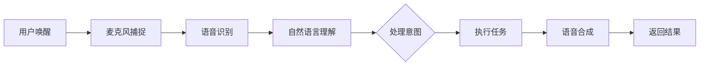

                 

关键词：智能音箱、家庭场景、注意力争夺、用户交互、人工智能技术

> 摘要：本文深入探讨了智能音箱在家庭场景下的应用，分析了其如何争夺用户的注意力，以及背后的技术原理。通过详细的理论阐述、算法解析和实践案例，本文为智能音箱技术的发展和应用提供了有价值的见解。

## 1. 背景介绍

在互联网和人工智能快速发展的今天，智能家居设备已经成为现代家庭生活的重要组成部分。智能音箱作为智能家居设备的一种，通过语音交互技术，实现了与用户的自然语言对话，成为家庭场景中智能化的枢纽。随着人工智能技术的不断进步，智能音箱的功能也越来越强大，如播放音乐、控制家电、提供信息查询等。然而，智能音箱在家庭场景中面临的挑战之一就是如何有效争夺用户的注意力。

### 1.1 智能音箱的兴起

智能音箱的兴起可以追溯到亚马逊的Echo和谷歌的Home Hub。2014年，亚马逊推出了首款智能音箱Echo，搭载了Alexa语音助手，开启了智能家居的新时代。随后，谷歌、苹果、微软等科技巨头纷纷跟进，推出了一系列智能音箱产品。这些智能音箱不仅具有强大的语音交互能力，还集成了智能语音助手，能够处理复杂的用户指令。

### 1.2 家庭场景下的注意力争夺

在家庭场景中，用户的注意力是有限的。智能音箱作为新兴的智能家居设备，需要在众多竞争者中脱颖而出，吸引并保持用户的注意力。这不仅是技术上的挑战，也是市场战略上的关键。智能音箱通过以下几种方式争夺用户的注意力：

- **个性化内容推荐**：根据用户的行为数据和偏好，提供个性化的音乐、新闻、天气预报等内容。
- **便捷的语音交互**：提供快速、准确的语音识别和自然语言理解能力，使用户能够轻松控制智能家居设备。
- **多场景应用**：不仅限于家庭娱乐，还能够控制灯光、空调等家电，提升家庭智能化水平。

## 2. 核心概念与联系

### 2.1 智能音箱的基本原理

智能音箱的核心是语音交互技术。它包括以下几个关键组成部分：

- **麦克风阵列**：用于捕捉用户的语音指令。
- **语音识别（ASR）**：将语音信号转换为文本。
- **自然语言理解（NLU）**：理解文本中的意图和语义。
- **语音合成（TTS）**：将处理后的文本转换为语音输出。

### 2.2 用户注意力管理

用户注意力的管理涉及到以下几个方面：

- **内容个性化**：通过机器学习算法，分析用户的历史行为和偏好，提供个性化的内容推荐。
- **交互体验优化**：通过优化语音识别和自然语言理解算法，提升交互的准确性和流畅性。
- **情境感知**：通过环境传感器，如温度、湿度、光照等，提供情境感知的服务，如自动调整家庭设备的设置。

### 2.3 Mermaid 流程图

下面是一个简化的智能音箱工作流程的 Mermaid 流程图：

## 3. 核心算法原理 & 具体操作步骤

### 3.1 算法原理概述

智能音箱的核心算法主要包括语音识别（ASR）、自然语言理解（NLU）和语音合成（TTS）。这些算法的工作原理如下：

- **语音识别（ASR）**：将语音信号转换为文本。这一过程涉及到语音信号的预处理、特征提取和模型训练等步骤。
- **自然语言理解（NLU）**：将文本转换为计算机可理解的形式，识别用户的意图和语义。这通常涉及到机器学习和深度学习技术，如词向量、循环神经网络（RNN）和变换器（Transformer）等。
- **语音合成（TTS）**：将处理后的文本转换为自然流畅的语音输出。这一过程涉及到语音合成模型的训练和语音特征的重构。

### 3.2 算法步骤详解

#### 3.2.1 语音识别（ASR）

1. **语音信号预处理**：包括静音检测、降噪和声音增强等步骤，以提高语音识别的准确性。
2. **特征提取**：使用梅尔频率倒谱系数（MFCC）等特征，将语音信号转换为适用于机器学习模型的数值特征。
3. **模型训练**：使用大量标注的语音数据，训练深度神经网络模型，如卷积神经网络（CNN）和循环神经网络（RNN）。

#### 3.2.2 自然语言理解（NLU）

1. **词向量表示**：使用词嵌入技术，将文本转换为密集的向量表示。
2. **意图识别**：使用分类算法，如支持向量机（SVM）和神经网络分类器，识别用户的意图。
3. **实体提取**：使用命名实体识别（NER）技术，从文本中提取关键信息，如人名、地点、日期等。

#### 3.2.3 语音合成（TTS）

1. **语音合成模型**：使用深度神经网络模型，如循环神经网络（RNN）和变换器（Transformer），训练语音合成模型。
2. **语音特征重构**：将处理后的文本转换为语音特征，通过合成模型生成语音信号。
3. **音频后处理**：包括音频滤波、去噪和音高调整等步骤，以提高语音质量。

### 3.3 算法优缺点

- **优点**：
  - 高准确性：先进的语音识别和自然语言理解算法，能够准确识别用户的意图。
  - 个性化服务：基于用户行为和偏好，提供个性化的内容和服务。
  - 高交互性：便捷的语音交互方式，提升了用户体验。

- **缺点**：
  - 对环境依赖性强：语音识别和自然语言理解性能容易受到环境噪声的影响。
  - 需要大量数据：算法的训练需要大量标注数据，数据获取和处理成本较高。
  - 能力限制：目前的智能音箱技术还无法完全理解复杂的人类语言，存在局限性。

### 3.4 算法应用领域

智能音箱的算法不仅应用于家庭场景，还广泛应用于其他领域：

- **客户服务**：智能客服机器人，通过语音交互，提供高效、准确的客户服务。
- **医疗健康**：通过语音交互，辅助医生进行病情咨询、药物管理等服务。
- **教育**：智能教育助手，通过语音交互，提供个性化的学习辅导和知识问答。

## 4. 数学模型和公式 & 详细讲解 & 举例说明

### 4.1 数学模型构建

智能音箱的核心算法涉及到多个数学模型，包括语音识别（ASR）、自然语言理解（NLU）和语音合成（TTS）。以下是这些模型的简要介绍：

#### 4.1.1 语音识别（ASR）

语音识别的数学模型通常是基于深度学习，其中卷积神经网络（CNN）和循环神经网络（RNN）是最常用的模型。以下是一个简化的CNN模型：

$$
h^{(l)} = \sigma(W^{(l)} \cdot h^{(l-1)} + b^{(l)})
$$

其中，$h^{(l)}$是第$l$层的特征表示，$W^{(l)}$和$b^{(l)}$分别是权重和偏置，$\sigma$是激活函数。

#### 4.1.2 自然语言理解（NLU）

自然语言理解的数学模型通常是基于词嵌入和神经网络。以下是一个简化的词嵌入模型：

$$
e_{word} = \text{Word2Vec}(word)
$$

其中，$e_{word}$是词$word$的向量表示，$\text{Word2Vec}$是词嵌入模型。

#### 4.1.3 语音合成（TTS）

语音合成的数学模型通常是基于循环神经网络（RNN）或变换器（Transformer）。以下是一个简化的RNN模型：

$$
y_t = \text{RNN}(y_{t-1}, x_t)
$$

其中，$y_t$是第$t$个时间步的输出，$x_t$是输入特征，$\text{RNN}$是循环神经网络。

### 4.2 公式推导过程

以下是对上述数学模型的简要推导过程：

#### 4.2.1 语音识别（ASR）

1. **特征提取**：将语音信号转换为梅尔频率倒谱系数（MFCC）特征。
2. **卷积神经网络（CNN）**：使用卷积层提取特征，并通过激活函数非线性变换。
3. **循环神经网络（RNN）**：使用RNN层对特征进行序列建模。

#### 4.2.2 自然语言理解（NLU）

1. **词嵌入**：使用Word2Vec或GloVe模型，将文本转换为向量表示。
2. **神经网络分类器**：使用神经网络，如多层感知机（MLP）或卷积神经网络（CNN），对向量进行分类。

#### 4.2.3 语音合成（TTS）

1. **循环神经网络（RNN）**：使用RNN层生成语音序列。
2. **语音合成模型**：使用RNN或变换器（Transformer）生成语音特征。
3. **音频合成**：使用合

