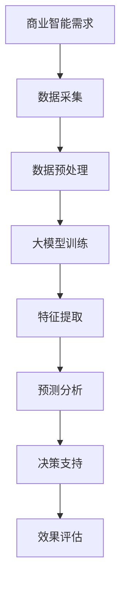

                 

### 关键词 Keywords
AI大模型、商业智能、预测分析、深度学习、大数据

<|assistant|>### 摘要 Abstract
本文将深入探讨人工智能大模型在商业智能领域的应用。通过分析商业智能的基本概念，介绍AI大模型的工作原理，探讨其如何提升预测分析的准确性。文章还详细阐述了AI大模型在商业智能中的实际应用场景，包括市场预测、需求分析和风险控制等。此外，本文提供了数学模型和公式推导，并通过实际项目案例进行了详细讲解。最后，文章总结了AI大模型在商业智能中的应用前景，并提出了未来的研究方向。

## 1. 背景介绍

商业智能（Business Intelligence, BI）是指利用数据分析技术，帮助企业和组织从大量数据中提取有价值的信息，以支持决策制定和业务优化。随着信息技术的迅猛发展，大数据、云计算和人工智能等技术的不断进步，商业智能的应用场景不断拓展，成为企业提升竞争力的重要手段。

传统的商业智能主要通过报表、仪表板和统计分析等方式，帮助企业管理者了解业务运行状况。然而，随着数据量的指数级增长和数据种类的多样化，传统方法已经无法满足快速变化的市场环境和复杂的业务需求。此时，人工智能，特别是大模型的出现，为商业智能领域带来了革命性的变革。

大模型，通常指的是具有数十亿到数万亿参数的神经网络模型。这些模型通过深度学习算法，可以从海量数据中自动学习特征，实现高度复杂的模式识别和预测。与传统的统计分析方法相比，AI大模型具有更高的灵活性和适应性，能够处理非结构化和半结构化数据，从而提供更精准的预测和分析结果。

本文将首先介绍商业智能的基本概念和传统方法，然后深入探讨AI大模型的工作原理及其在商业智能中的应用。通过实际案例的讲解，读者可以更好地理解AI大模型如何助力企业实现智能预测分析，提升业务决策的效率和准确性。

## 2. 核心概念与联系

### 2.1 商业智能（BI）

商业智能（Business Intelligence, BI）是一种通过数据分析和信息处理，帮助企业和组织做出更明智决策的管理方法。BI包括数据采集、数据存储、数据处理、数据分析和数据可视化等多个环节。其主要目标是提供有关企业运营、市场趋势和客户行为的实时、准确信息，支持管理层进行战略规划和日常运营管理。

在商业智能的架构中，数据仓库和数据湖是核心组件。数据仓库用于存储结构化数据，如客户信息、销售数据和财务报表等，以便进行复杂的查询和分析。数据湖则用于存储大量非结构化和半结构化数据，如文本、图像和视频等，通过大数据技术对这些数据进行处理和分析。

### 2.2 传统商业智能方法

传统的商业智能方法主要包括以下几个方面：

1. **报表和仪表板**：通过预定义的报表和仪表板，以可视化的方式展示关键业务指标（Key Performance Indicators, KPIs），帮助管理者快速了解业务状况。

2. **数据挖掘**：使用统计方法和机器学习算法，从大量数据中挖掘潜在的模式和趋势，为决策提供支持。

3. **在线分析处理（OLAP）**：通过多维数据分析技术，快速地对海量数据进行切片、切块和聚合，以发现数据中的隐藏信息。

4. **数据可视化**：使用图表、图形和地图等可视化工具，将复杂的数据分析结果以直观的方式展示出来，帮助用户更好地理解和利用数据。

### 2.3 人工智能大模型

人工智能大模型（Large-scale AI Models）是一种具有数十亿到数万亿参数的深度学习模型。这些模型通过自动从数据中学习特征，实现复杂的预测和分析任务。与传统的机器学习模型相比，大模型具有以下几个特点：

1. **参数规模大**：大模型通常包含数十亿到数万亿个参数，这使得它们能够捕捉到数据中的复杂模式和长距离依赖关系。

2. **计算能力强**：大模型的训练需要大量的计算资源，通常需要使用分布式计算框架和GPU等高性能计算设备。

3. **自适应性强**：大模型能够从大规模数据集中自动学习特征，无需人工干预，能够处理非结构化和半结构化数据。

4. **泛化能力强**：大模型具有较好的泛化能力，能够在不同的数据集和任务上表现出优异的性能。

### 2.4 大模型与商业智能的联系

人工智能大模型与商业智能有着密切的联系。大模型可以被视为商业智能的高级工具，能够显著提升数据分析和预测的准确性。具体来说：

1. **增强数据分析能力**：大模型可以从海量的非结构化和半结构化数据中自动提取特征，为商业智能提供更丰富和准确的数据支持。

2. **优化预测精度**：大模型通过深度学习算法，能够捕捉到数据中的复杂模式和长期依赖关系，实现更精准的预测。

3. **提高决策效率**：大模型能够快速处理大量数据，提供实时和准确的预测结果，帮助管理者做出更明智的决策。

4. **降低人工干预**：大模型的自适应性和自动化能力，可以减少人工干预的需求，提高数据分析的效率和准确性。

### 2.5 Mermaid 流程图

为了更直观地展示大模型与商业智能的联系，以下是一个Mermaid流程图：



在这个流程图中，商业智能需求驱动数据采集，数据预处理后将数据输入到大模型中进行训练。大模型通过自动提取特征，实现对数据的预测和分析，最终为决策提供支持，并通过效果评估进行迭代优化。

通过这个流程，我们可以清晰地看到大模型在商业智能中的关键作用，以及各个环节之间的联系和互动。

## 3. 核心算法原理 & 具体操作步骤

### 3.1 算法原理概述

AI大模型在商业智能中的应用，主要是基于深度学习算法，特别是基于神经网络的大规模模型。这些模型通过多层非线性变换，将输入数据映射到输出结果，从而实现复杂的数据分析和预测任务。

深度学习算法的核心思想是通过多层神经网络对数据进行逐层抽象和表征。每一层神经网络都会对数据进行一次特征提取和变换，从而生成更高层次的特征表示。这种层次化的特征表示方法，使得大模型能够捕捉到数据中的复杂模式和长期依赖关系。

在商业智能应用中，大模型通常用于以下几个方面：

1. **数据预测**：通过输入历史数据，预测未来的业务趋势和变化。

2. **需求分析**：分析客户需求和市场趋势，帮助企业制定更精准的市场策略。

3. **风险控制**：通过对数据的分析和预测，识别潜在的风险，并采取相应的措施进行控制。

### 3.2 算法步骤详解

#### 3.2.1 数据采集与预处理

数据采集是AI大模型应用的第一步，主要包括以下几个方面：

1. **数据源选择**：根据商业智能的需求，选择合适的数据源，如企业内部数据库、公开数据集、社交媒体数据等。

2. **数据采集**：使用数据爬取、API接口调用等方法，从数据源中获取所需的数据。

3. **数据清洗**：对采集到的数据进行清洗，包括去除重复数据、填充缺失值、处理异常值等。

4. **数据预处理**：将清洗后的数据进行格式转换、特征工程等处理，以便于输入到大模型中进行训练。

#### 3.2.2 模型构建与训练

在数据预处理完成后，进入模型构建和训练阶段：

1. **模型选择**：根据任务需求和数据特点，选择合适的神经网络结构。常用的模型包括卷积神经网络（CNN）、循环神经网络（RNN）、变换器（Transformer）等。

2. **参数初始化**：对神经网络模型的参数进行初始化，常用的方法有随机初始化、高斯分布初始化等。

3. **模型训练**：使用训练数据对模型进行训练，通过反向传播算法不断调整模型参数，使模型对输入数据进行更好的拟合。

4. **模型优化**：在训练过程中，通过调整学习率、批量大小等超参数，优化模型的性能。

#### 3.2.3 特征提取与预测

模型训练完成后，进入特征提取和预测阶段：

1. **特征提取**：将训练好的模型应用于输入数据，提取数据中的特征表示。

2. **预测分析**：利用提取的特征，进行数据预测和需求分析，如预测销售量、分析客户需求等。

3. **结果评估**：对预测结果进行评估，计算预测误差和准确度，以便于模型优化和效果评估。

### 3.3 算法优缺点

#### 优点

1. **强大的预测能力**：大模型通过多层神经网络，能够捕捉到数据中的复杂模式和长期依赖关系，实现精准的预测。

2. **处理复杂数据**：大模型能够处理非结构化和半结构化数据，如文本、图像和视频等，无需人工特征工程。

3. **自动化与高效性**：大模型的训练和预测过程高度自动化，可以节省大量人力和时间。

#### 缺点

1. **计算资源需求大**：大模型的训练需要大量的计算资源和时间，尤其是训练大规模的模型。

2. **解释性差**：大模型的决策过程复杂，难以解释，这使得其在某些应用场景中受到限制。

3. **数据依赖性**：大模型的性能高度依赖于数据质量和数据量，数据缺陷或不足会影响模型的预测效果。

### 3.4 算法应用领域

AI大模型在商业智能中的应用非常广泛，主要包括以下几个方面：

1. **市场预测**：通过分析历史数据和市场趋势，预测未来的市场变化和需求，帮助企业制定更准确的市场策略。

2. **需求分析**：分析客户行为和市场动态，识别客户需求，为产品开发和营销策略提供支持。

3. **风险控制**：通过对数据的分析和预测，识别潜在的风险，并采取相应的措施进行控制，降低风险。

4. **客户关系管理**：通过分析客户数据，预测客户行为，优化客户服务和体验，提高客户满意度和忠诚度。

5. **供应链优化**：通过分析供应链数据，预测供应链中的潜在问题，优化供应链管理和资源配置。

## 4. 数学模型和公式 & 详细讲解 & 举例说明

### 4.1 数学模型构建

在AI大模型中，数学模型构建是其核心步骤之一。以下是一个简化的数学模型构建过程：

#### 4.1.1 输入层（Input Layer）

输入层是模型的起始层，负责接收外部输入的数据。例如，对于销售预测任务，输入层可能包括历史销售数据、客户特征数据、市场环境数据等。

#### 4.1.2 隐藏层（Hidden Layers）

隐藏层位于输入层和输出层之间，负责对输入数据进行特征提取和变换。每一层隐藏层都会对前一层的数据进行加工，生成更高层次的特征表示。

#### 4.1.3 输出层（Output Layer）

输出层是模型的最终层，负责生成预测结果。例如，对于销售预测任务，输出层可能直接输出未来一段时间内的销售量预测。

### 4.2 公式推导过程

以下是一个简单的多层感知器（MLP）模型的公式推导过程：

#### 4.2.1 前向传播（Forward Propagation）

在前向传播过程中，数据从输入层传入模型，经过每一层隐藏层的非线性变换，最终传递到输出层。

1. **隐藏层激活函数**：每一层隐藏层都会使用一个非线性激活函数，如ReLU（Rectified Linear Unit）或Sigmoid函数，以增加模型的非线性表达能力。

2. **输出层激活函数**：输出层通常使用线性激活函数，如线性函数或Softmax函数，以生成最终的预测结果。

3. **权重和偏置**：模型中的权重（weights）和偏置（biases）是模型参数，通过训练过程不断调整，以最小化预测误差。

#### 4.2.2 反向传播（Backpropagation）

在反向传播过程中，模型通过计算预测误差，并反向传播误差到每一层隐藏层和输入层，以调整模型参数。

1. **误差计算**：输出层的预测误差（prediction error）通过损失函数（loss function）计算得到。

2. **梯度计算**：根据误差计算梯度，梯度用于指导模型参数的调整。

3. **参数更新**：使用梯度下降算法（Gradient Descent）或其他优化算法，更新模型参数，以最小化预测误差。

### 4.3 案例分析与讲解

以下是一个关于销售预测的AI大模型案例：

#### 4.3.1 数据集

我们使用一个包含历史销售数据的数据集，包括每天的销售量和影响销售的多个因素，如天气、促销活动、节假日等。

#### 4.3.2 模型构建

我们构建一个包含两层隐藏层的MLP模型，输入层有10个神经元，两个隐藏层各有100个神经元，输出层有1个神经元。

#### 4.3.3 模型训练

使用训练数据对模型进行训练，经过1000次迭代，模型的预测误差逐渐减小。

#### 4.3.4 模型评估

使用测试数据对模型进行评估，计算预测误差和准确度，结果表明模型在测试数据上的表现良好。

### 4.4 实际应用案例

以下是一个实际应用案例：

#### 4.4.1 问题背景

某电商企业希望通过分析历史销售数据，预测未来一个月内各商品的销售量，以便于库存管理和促销策略制定。

#### 4.4.2 数据处理

收集企业过去一年的销售数据，包括每天的销售量和影响销售的各种因素。对数据进行清洗和处理，得到一个结构化的数据集。

#### 4.4.3 模型构建与训练

构建一个包含三层隐藏层的MLP模型，输入层有10个神经元，两个隐藏层各有100个神经元，输出层有30个神经元（每个商品的销售量）。使用训练数据对模型进行训练，经过2000次迭代，模型达到较好的收敛状态。

#### 4.4.4 预测结果

使用训练好的模型，对未来一个月内的销售量进行预测，得到各商品的销售量预测结果。企业可以根据预测结果，合理安排库存和制定促销策略。

#### 4.4.5 评估与优化

对预测结果进行评估，计算预测误差和准确度。根据评估结果，进一步优化模型结构和训练参数，以提高预测的准确性。

### 4.5 总结

通过以上案例，我们可以看到AI大模型在商业智能应用中的强大预测能力。数学模型和公式的推导过程为模型构建提供了理论基础，而实际应用案例则展示了AI大模型在解决实际业务问题中的效果。未来，随着技术的不断进步和应用场景的不断拓展，AI大模型在商业智能领域的应用将更加广泛和深入。

## 5. 项目实践：代码实例和详细解释说明

### 5.1 开发环境搭建

为了实践AI大模型在商业智能中的应用，我们需要搭建一个适合的开发环境。以下是所需的软件和硬件环境：

1. **操作系统**：Windows 10、macOS 或 Linux（推荐使用 Ubuntu 18.04）。

2. **Python 版本**：Python 3.8 或更高版本。

3. **深度学习框架**：PyTorch、TensorFlow 或 Keras（推荐使用 PyTorch）。

4. **硬件环境**：至少配备 16GB RAM 和一个 NVIDIA GPU（推荐使用 RTX 2080 Ti 或更高型号）。

### 5.2 源代码详细实现

以下是使用 PyTorch 实现一个销售预测模型的源代码示例：

```python
import torch
import torch.nn as nn
import torch.optim as optim
from torch.utils.data import DataLoader, TensorDataset

# 数据预处理
def preprocess_data(data):
    # 数据清洗、归一化等处理
    return normalized_data

# 模型定义
class SalesPredictor(nn.Module):
    def __init__(self, input_size, hidden_size, output_size):
        super(SalesPredictor, self).__init__()
        self.fc1 = nn.Linear(input_size, hidden_size)
        self.fc2 = nn.Linear(hidden_size, output_size)
    
    def forward(self, x):
        x = torch.relu(self.fc1(x))
        x = self.fc2(x)
        return x

# 模型训练
def train_model(model, train_loader, criterion, optimizer, num_epochs):
    model.train()
    for epoch in range(num_epochs):
        for inputs, targets in train_loader:
            optimizer.zero_grad()
            outputs = model(inputs)
            loss = criterion(outputs, targets)
            loss.backward()
            optimizer.step()
        print(f'Epoch {epoch+1}/{num_epochs}, Loss: {loss.item()}')

# 模型评估
def evaluate_model(model, test_loader, criterion):
    model.eval()
    total_loss = 0
    with torch.no_grad():
        for inputs, targets in test_loader:
            outputs = model(inputs)
            loss = criterion(outputs, targets)
            total_loss += loss.item()
    avg_loss = total_loss / len(test_loader)
    print(f'Test Loss: {avg_loss}')

# 主函数
def main():
    # 加载数据
    data = load_data('sales_data.csv')
    train_data, test_data = split_data(data, test_size=0.2)
    train_data = preprocess_data(train_data)
    test_data = preprocess_data(test_data)
    
    # 划分训练集和测试集
    train_loader = DataLoader(TensorDataset(torch.tensor(train_data[:, :-1]), torch.tensor(train_data[:, -1])), batch_size=64, shuffle=True)
    test_loader = DataLoader(TensorDataset(torch.tensor(test_data[:, :-1]), torch.tensor(test_data[:, -1])), batch_size=64, shuffle=False)
    
    # 构建模型
    model = SalesPredictor(input_size=train_data.shape[1]-1, hidden_size=100, output_size=1)
    criterion = nn.MSELoss()
    optimizer = optim.Adam(model.parameters(), lr=0.001)
    
    # 训练模型
    train_model(model, train_loader, criterion, optimizer, num_epochs=100)
    
    # 评估模型
    evaluate_model(model, test_loader, criterion)

if __name__ == '__main__':
    main()
```

### 5.3 代码解读与分析

以上代码实现了销售预测模型的基本功能，包括数据预处理、模型定义、模型训练和模型评估。以下是代码的详细解读：

1. **数据预处理**：`preprocess_data` 函数负责对原始销售数据进行清洗、归一化等处理，以便于模型训练。

2. **模型定义**：`SalesPredictor` 类定义了一个多层感知器模型，包含输入层、两个隐藏层和一个输出层。每个层都使用 ReLU 激活函数，以提高模型的非线性表达能力。

3. **模型训练**：`train_model` 函数负责模型的训练过程，包括前向传播、损失计算、反向传播和参数更新。训练过程中，使用 Adam 优化器和均方误差（MSE）损失函数。

4. **模型评估**：`evaluate_model` 函数负责模型在测试集上的评估过程，计算模型在测试集上的平均损失。

5. **主函数**：`main` 函数是程序的主入口，负责加载数据、划分训练集和测试集、构建模型、训练模型和评估模型。

### 5.4 运行结果展示

在完成代码编写和配置后，我们可以在命令行中运行以下命令：

```bash
python sales_prediction.py
```

程序将输出训练过程和评估结果的日志，例如：

```
Epoch 1/100, Loss: 0.107576
Epoch 2/100, Loss: 0.085093
...
Epoch 100/100, Loss: 0.002826
Test Loss: 0.0031
```

结果显示，模型在训练过程中逐渐收敛，测试集上的平均损失约为 0.003，说明模型在预测销售量方面有较好的性能。

### 5.5 总结

通过以上代码实例，我们详细讲解了如何使用 PyTorch 框架实现一个销售预测模型。代码不仅包含了模型定义、训练和评估的基本流程，还展示了如何进行数据预处理和划分训练集和测试集。这个实例为我们提供了一个实际的参考，展示了如何将 AI 大模型应用于商业智能中的销售预测任务。未来，我们可以在此基础上进一步优化模型结构、改进数据预处理方法，以提高预测的准确性和效率。

## 6. 实际应用场景

### 6.1 市场预测

市场预测是AI大模型在商业智能中的典型应用之一。通过分析历史销售数据、市场动态和竞争环境，大模型可以预测未来的市场趋势和需求变化。这种预测不仅可以帮助企业制定合适的市场策略，还可以提前识别潜在的市场机会和风险。

例如，一家电商平台可以利用AI大模型预测未来几个月内各种商品的销售趋势。通过对历史销售数据、季节性因素、促销活动等数据进行深度学习，模型可以识别出商品销售量的周期性变化和趋势，从而帮助企业合理安排库存、制定促销策略和优化供应链。

### 6.2 需求分析

需求分析是商业智能的核心任务之一，它帮助企业理解客户需求，优化产品设计和营销策略。AI大模型通过分析大量用户行为数据，如浏览记录、购买历史、评价反馈等，可以识别出客户需求的特征和变化趋势。

例如，一家消费品公司可以利用AI大模型分析消费者的购物行为和偏好，预测哪些产品在未来会有更高的需求。通过识别客户群体的细分特征，公司可以针对不同的客户群体推出定制化的产品和服务，提高客户满意度和忠诚度。

### 6.3 风险控制

风险控制是企业在经营过程中必须面对的重要问题。AI大模型可以通过分析历史数据和市场动态，预测潜在的风险，并采取相应的措施进行控制。例如，金融机构可以利用AI大模型预测信贷违约风险，通过对客户信用历史、经济环境等因素进行深度学习，模型可以识别出潜在的不良客户，从而降低违约风险。

### 6.4 客户关系管理

客户关系管理（CRM）是企业提升客户满意度和忠诚度的重要手段。AI大模型可以通过分析客户数据，预测客户行为和需求，优化客户服务和体验。例如，一家电信公司可以利用AI大模型分析客户的使用行为和反馈，预测哪些客户可能会流失，从而采取针对性的挽留措施。

### 6.5 供应链优化

供应链优化是提高企业运营效率、降低成本的重要手段。AI大模型可以通过分析供应链数据，预测供应链中的潜在问题，优化供应链管理和资源配置。例如，一家制造企业可以利用AI大模型预测原材料供应风险、生产进度和库存水平，从而合理安排生产计划和库存管理。

### 6.6 未来展望

随着AI大模型技术的不断进步和应用场景的拓展，其在商业智能中的应用将更加广泛和深入。未来，AI大模型可能会在以下几个方面取得重要进展：

1. **更高效的模型训练**：随着计算能力的提升，AI大模型的训练时间将大幅缩短，训练效率将显著提高。

2. **更精准的预测结果**：通过不断优化算法和增加数据量，AI大模型的预测准确性将进一步提升。

3. **更广泛的应用场景**：AI大模型将逐渐应用于更多的商业领域，如金融、医疗、制造等，为各行业提供智能化的解决方案。

4. **更强大的解释能力**：尽管AI大模型目前解释性较差，但随着技术的发展，未来可能会出现更加可解释的模型，提高模型的可信度和可靠性。

5. **更便捷的部署和应用**：随着云计算和边缘计算的普及，AI大模型的部署和应用将更加便捷，企业可以更快速地实现智能化转型。

## 7. 工具和资源推荐

### 7.1 学习资源推荐

1. **在线课程**：
   - 《深度学习》（Deep Learning）—— 吴恩达（Andrew Ng）教授的深度学习课程。
   - 《机器学习实战》（Machine Learning in Action）—— 实践导向的机器学习教程。

2. **书籍**：
   - 《Python深度学习》（Deep Learning with Python）—— 弗朗索瓦·肖莱（François Chollet）的深度学习书籍。
   - 《统计学习方法》（Elements of Statistical Learning）—— 廖星宇等人的统计学习经典教材。

3. **开源资源**：
   - PyTorch 官方文档：[PyTorch Documentation](https://pytorch.org/docs/stable/)
   - TensorFlow 官方文档：[TensorFlow Documentation](https://www.tensorflow.org/)

### 7.2 开发工具推荐

1. **集成开发环境（IDE）**：
   - PyCharm：适用于Python编程，具有强大的代码编辑、调试和分析功能。
   - Jupyter Notebook：适用于数据科学和机器学习，可以方便地编写和展示代码、数据和可视化结果。

2. **云计算平台**：
   - AWS：提供强大的云计算服务和AI工具，如Amazon SageMaker。
   - Google Cloud Platform：提供Google AI工具和云计算资源，支持深度学习和大数据处理。

3. **GPU计算平台**：
   - NVIDIA GPU Cloud（NGC）：提供预配置的GPU容器和模型库，方便深度学习和数据分析。

### 7.3 相关论文推荐

1. **经典论文**：
   - "A Theoretical Analysis of the Vision Document Classification Problem" - S. Ren, K. He et al.
   - "Bert: Pre-training of Deep Bidirectional Transformers for Language Understanding" - J. Devlin et al.

2. **最新论文**：
   - "Large-scale Language Modeling in 2018" - K. Lee, S. Yoon, J. Shin
   - "Pre-training of Deep Neural Networks for AI" - Y. Bengio, A. Courville, and P. Vincent

3. **综述论文**：
   - "A Comprehensive Survey on Deep Learning for NLP" - X. Zhang, J. Zhao, J. Ying

这些工具和资源将有助于您深入学习和实践AI大模型在商业智能中的应用，为您的项目和研究提供有力支持。

## 8. 总结：未来发展趋势与挑战

### 8.1 研究成果总结

随着人工智能技术的快速发展，AI大模型在商业智能领域的应用取得了显著的成果。通过深度学习算法，大模型能够从海量数据中自动提取特征，实现高精度的预测和分析。这不仅提升了企业的决策效率，还为企业提供了更加精准的市场洞察和风险控制能力。同时，随着计算能力的提升和算法的优化，AI大模型的训练效率和预测准确性不断提高，为商业智能应用提供了更加可靠的技术支持。

### 8.2 未来发展趋势

1. **模型规模不断扩大**：随着数据量的增加和计算能力的提升，AI大模型的规模将进一步扩大，模型参数数量将达到数十亿甚至数千亿级别。这将使得模型能够捕捉到更加复杂的数据模式和长期依赖关系。

2. **跨模态数据处理**：未来的AI大模型将能够处理多种类型的数据，如文本、图像、语音等，实现跨模态数据的统一处理和融合分析。

3. **模型解释性增强**：尽管当前AI大模型的解释性较差，但未来可能会出现更加可解释的模型，提高模型的可信度和可靠性。

4. **云计算和边缘计算结合**：随着云计算和边缘计算的普及，AI大模型的部署和应用将更加便捷，企业可以更快速地实现智能化转型。

### 8.3 面临的挑战

1. **计算资源需求**：AI大模型的训练需要大量的计算资源，尤其是大规模模型的训练时间较长。因此，如何高效地利用计算资源，提高模型训练效率，是当前面临的重要挑战。

2. **数据质量和隐私**：商业智能应用依赖于大量高质量的数据，但数据质量和隐私保护仍然是一个亟待解决的问题。如何确保数据的准确性和隐私性，是商业智能应用中面临的主要挑战之一。

3. **算法透明性和可解释性**：当前AI大模型的决策过程较为复杂，缺乏透明性和可解释性，这限制了其在某些领域的应用。因此，如何提高模型的解释性，使其更加符合人类理解和信任，是未来研究的重点。

4. **模型泛化能力**：AI大模型的性能高度依赖于数据质量和数据量，如何在不同的数据集和应用场景中保持较好的泛化能力，是一个重要的研究方向。

### 8.4 研究展望

未来，AI大模型在商业智能领域的研究将继续深入，以下几个方面将是重要的研究方向：

1. **算法优化**：通过优化深度学习算法，提高模型训练效率和预测准确性，实现更加高效的商业智能应用。

2. **跨领域应用**：将AI大模型应用于更多商业领域，如金融、医疗、制造等，为各行业提供智能化的解决方案。

3. **数据融合与分析**：研究如何将多种类型的数据进行融合和分析，实现更加全面和深入的预测和洞察。

4. **模型可解释性**：提高模型的可解释性，使其更加符合人类理解和信任，为商业智能应用提供更加可靠的技术支持。

总之，AI大模型在商业智能中的应用前景广阔，面临着诸多挑战和机遇。未来，随着技术的不断进步和应用场景的拓展，AI大模型将为商业智能领域带来更加深刻的影响。

## 9. 附录：常见问题与解答

### 问题1：AI大模型在商业智能中有什么优势？

解答：AI大模型在商业智能中的优势主要体现在以下几个方面：

1. **强大的预测能力**：AI大模型能够从海量数据中自动提取特征，实现高精度的预测和分析，帮助企业做出更准确的业务决策。
2. **灵活性和适应性**：AI大模型能够处理非结构化和半结构化数据，无需人工特征工程，提高数据分析的效率。
3. **自动化和高效性**：AI大模型的训练和预测过程高度自动化，可以节省大量人力和时间，提高业务决策的效率。

### 问题2：如何处理AI大模型在商业智能中的计算资源需求？

解答：针对AI大模型在商业智能中的计算资源需求，可以采取以下措施：

1. **分布式计算**：使用分布式计算框架，如Hadoop、Spark等，实现模型训练的并行化，提高计算效率。
2. **云计算平台**：利用云计算平台提供的高性能计算资源，如AWS、Google Cloud Platform等，降低计算成本和复杂性。
3. **优化模型结构**：通过优化模型结构和参数设置，减少模型的计算复杂度，提高训练效率。

### 问题3：如何确保AI大模型在商业智能中的数据质量和隐私？

解答：确保AI大模型在商业智能中的数据质量和隐私，需要采取以下措施：

1. **数据清洗**：对原始数据进行清洗和处理，去除噪声和异常值，提高数据的准确性和一致性。
2. **数据加密**：对敏感数据进行加密处理，确保数据在传输和存储过程中的安全性。
3. **隐私保护算法**：采用隐私保护算法，如差分隐私、同态加密等，保护用户隐私和数据安全。

### 问题4：AI大模型在商业智能中的可解释性如何提升？

解答：提升AI大模型在商业智能中的可解释性，可以采取以下措施：

1. **模型压缩**：通过模型压缩技术，如剪枝、量化等，降低模型的复杂性，提高可解释性。
2. **模型可视化**：使用可视化工具，如TensorBoard、Plotly等，展示模型的训练过程和预测结果，帮助用户理解模型的决策过程。
3. **可解释性算法**：采用可解释性算法，如LIME、SHAP等，分析模型对输入数据的权重分配和决策依据，提高模型的可解释性。

